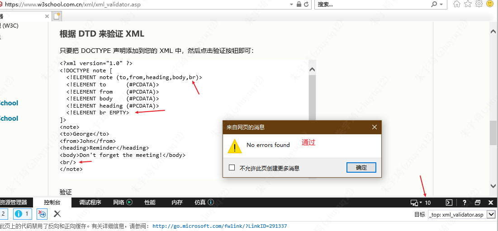
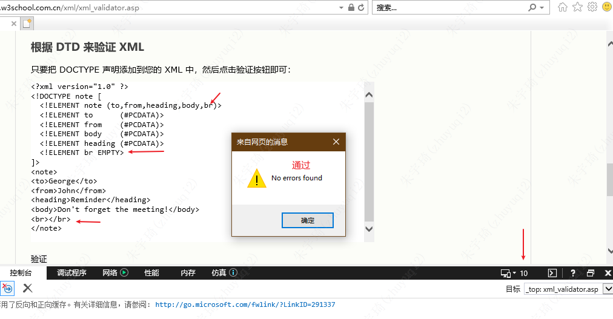
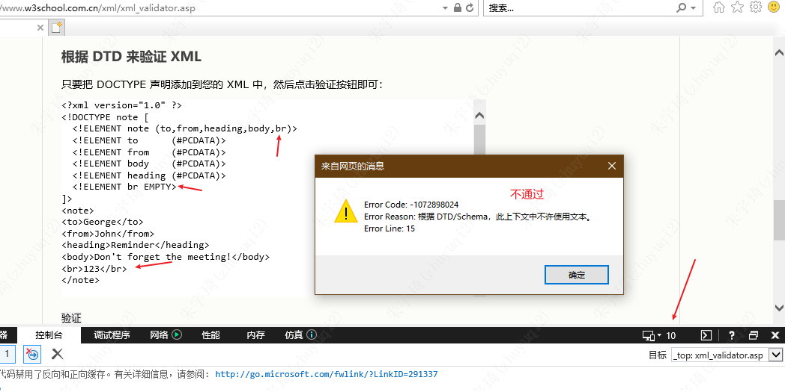

## 基础

### 简介

#### 是什么

- 可扩展标记语言（eXtensible Markup Language）。
- 设计宗旨是传输数据，而非显示数据。
	- XML降低了各种不兼容应用程序交换数据的复杂性。
- 标签没有被预定义，需要自行定义标签。
- 被设计为具有自我描述性。

#### 与HTML的区别

- XML 被设计为传输和存储数据，其焦点是数据的内容。
- HTML 被设计用来显示数据，其焦点是数据的外观。
- HTML 旨在显示信息，而 XML 旨在传输信息。

#### 衍生

-   XHTML：最新的 HTML 版本
-   WSDL：用于描述可用的 web service
-   WAP 和 WML：用于手持设备的标记语言
-   RSS：用于 RSS feed 的语言
-   RDF 和 OWL ：用于描述资源和本体
-   SMIL：用于描述针针对 web 的多媒体

### 语法

标签称为元素，元素中包裹的内容成为文本。

结构方面：

- 声明不是必须。如果存在必须放在第一行。
	- `<?xml version="1.0" encoding="utf-8"?>`
- 必须有一个且只有一个根元素。
- 所有元素都必须关闭。
- 元素大小写敏感。
- 文本的多个空格解析为一个。
- 特殊字符必须使用实体引用代替。
	- 实体是用来定义普通文本的变量。实体引用是对实体的引用。
	- 只有字符 "<" 和 "&" 确实是非法的。大于号是合法的，但是用实体引用来代替它是一个好习惯。

| `&lt;`   | `<` |
| -------- | --- |
| `&gt;`   | `>` |
| `&amp;`  | `&` |
| `&apos;` | `'` |
| `&quot;` | `"`    |

元素方面：

- 含义：从（且包括）开始标签直到（且包括）结束标签的部分。
- 特性：元素可包含其他元素、文本或者两者的混合物。元素也可以拥有属性。
- 规范：
	- 名称不能包含空格。
	- 名称不能以“xml“三个词做开头，任意大小写均不行。
	- 名称不要包含 `-` 、`.`、 `:` 三种标点。

> 特别注意：所有的元素都需要关闭，但不是所有的元素都需要使用结束标签关闭，使用自闭和标签关闭也可以。以下是DTD规范的反例（在IE10及以下才能测试，其他浏览器不能测试）：
> 
> 
> 

属性方面：

- 属性值必须加双引号或单引号。
	- 属性值本身包含双引号，则需要使用单引号包裹或转换为实体引用。
- 属性与元素等价，均能被正确解析为信息。
- 尽量避免使用属性：
	- 属性无法包含多重的值。
	- 属性无法描述树结构。
	- 属性不易扩展。
	- 属性难以阅读和维护。
- **建议：使用元素描述数据、属性提供与数据无关的信息。**

### 文档规范

#### [DTD](DTD.md)

#### [XML Schema](XML Schema.md)

## 进阶

### 命名空间

作用：防止多个xml同时使用是，相同的元素命名冲突。

解决方式：给元素添加前缀。

前缀规则：前缀不是随意写的，前缀必须通过`xmlns`属性声明。

```xml
<root>  
  
<h:table xmlns:h="http://www.w3.org/TR/html4/">  
<h:tr>  
<h:td>Apples</h:td>  
<h:td>Bananas</h:td>  
</h:tr>  
</h:table>  
  
<f:table xmlns:f="http://www.w3cschool.cc/furniture">  
<f:name>African Coffee Table</f:name>  
<f:width>80</f:width>  
<f:length>120</f:length>  
</f:table>  
  
</root>
```

上面案例的命名空间声明在被使用元素的父元素中。也可以声明在xml文件的根元素中（或不同命名空间的元素的共同父元素中），即：

```xml
<root xmlns:h="http://www.w3.org/TR/html4/"  
xmlns:f="http://www.w3cschool.cc/furniture">  
<h:table>  
<h:tr>  
<h:td>Apples</h:td>  
<h:td>Bananas</h:td>  
</h:tr>  
</h:table>  
  
<f:table>  
<f:name>African Coffee Table</f:name>  
<f:width>80</f:width>  
<f:length>120</f:length>  
</f:table>  
  
</root>
```

*注意：命名空间 URI 不会被解析器用于查找信息。其目的是赋予命名空间一个惟一的名称。不过，很多公司常常会作为指针来使用命名空间指向实际存在的网页，这个网页包含关于命名空间的信息。*