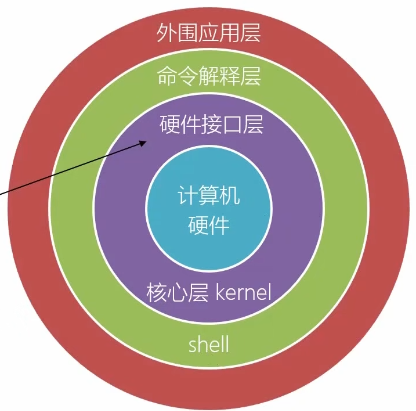
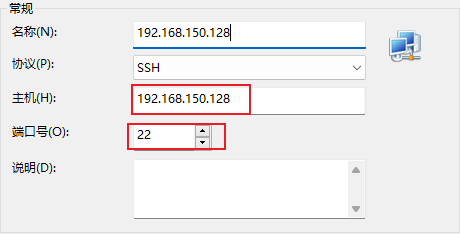
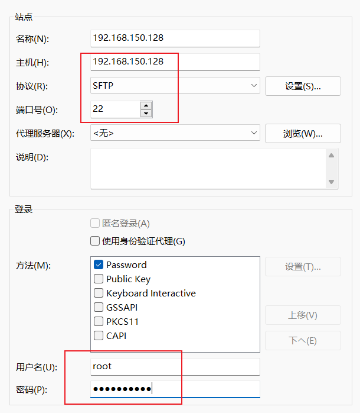
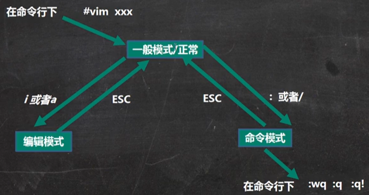

## 第1章 初识Linux

### 1.1 Linux概述

1. Linux基于Unix发展而来。
2. GNU/Linux表示遵循GNU开源协议。
3. 关系图：
   

### 1.2 Linux安装

- **账户信息：**
  - 账户名：root
  - 密码：dimitre123/918049
  - 账户名：zyq
  - 密码：dimitre123/918049

- **极简安装CentOS迷你版：**
  - 一路默认安装。
  - 网络配置：
    - 查看本机IP指令：`ip addr`
    - 修改网卡配置文件：`vi /etc/sysconfig/network-scripts/ifcfg-ens33`
    - 设置开机即启动网卡。
    - 重启网络服务：`systemctl restart network`

- **配置静态IP：**
  - 修改网卡配置文件：`vi /etc/sysconfig/network-scripts/ifcfg-ens33`
  - 注意：确保网关地址正确。
  - 重启网络服务：`systemctl restart network`

## 第2章 Linux入门

### 2.1 Linux的目录结构

| 目录 | 说明 |
| --- | --- |
| `/boot` | 存放启动Linux时使用的文件 |
| `/dev` | 类似Windows的设备管理器 |
| `/etc` | 系统管理所需的配置文件 |
| `/home` | 普通用户的主目录 |
| `/root` | 系统管理员的主目录 |
| `/usr` | 用户应用程序和文件 |
| `/var` | 经常被修改的文件，如日志 |
| `/lib` | 系统所需的基本动态连接共享库 |
| `/lost+found` | 非法关机后存放的文件 |
| `/proc` | 系统内存映射 |
| `/srv` | 服务启动后提供的数据 |
| `/sys` | 文件系统sysfs |
| `/media` | 自动挂载的设备 |
| `/mnt` | 临时挂载其他文件系统的目录 |
| `/opt` | 额外安装软件的目录 |
| `/selinux` | SELinux安全子系统 |

### 2.2 Linux远程登录

- 使用Xshell工具进行远程登录。
  - 

### 2.3 Linux远程文件传输

- 使用Xftp工具进行远程文件传输。
  - 

### 2.4 Vim和Vi的使用

- **模式切换：**
  - 

- **文档修改：**
  - `:wq` 保存并退出
  - `:q` 退出并不保存
  - `:q!` 强制退出并不保存

- **一般模式操作：**
  - `yy` 拷贝当前行
  - `5yy` 拷贝当前行及后续4行
  - `p` 粘贴拷贝的行
  - `dd` 删除当前行
  - `5dd` 删除当前行向下的5行
  - `G` 到达文档最末行
  - `gg` 到达文档最首行
  - `u` 撤销输入
  - `20 + shift + g` 快速定位到第20行

- **命令行模式操作：**
  - `/查找内容` 在文件中查找某个单词，按`n`查找下一个
  - `set nu` 设置文件行号
  - `set nonu` 取消文件行号

### 2.5 Linux系统操作

- **关机、重启：**
  - `shutdown -h now` 立即关机
  - `shutdown -r now` 立即重启
  - `halt` 立即关机
  - `reboot` 立即重启
  - `sync` 把内存的数据同步到磁盘上

- **用户管理：**
  - `useradd 用户名` 添加用户
  - `userdel 用户名` 删除用户
  - `id 用户名` 查询用户信息
  - `su - 用户名` 切换用户
  - `sudo passwd`或`sudo passwd root`设置root账户密码

- **运行级别：**
  - `systemctl get-default` 查看当前运行级别
  - `systemctl set-default TARGET.target` 设置指定的运行级别

- **找回root用户密码：**
  - 进入单用户模式，修改密码后重启系统。

- **帮助指令：**
  - `man [命令或配置文件]` 查看手册页
  - `help [命令]` 查看命令帮助
  - `which 命令` 查找命令路径

- **文件目录指令：**
  - `pwd` 显示当前工作目录的绝对路径
  - `ls` 显示当前目录的所有文件和目录
  - `cd ~` 回到自己的家目录
  - `mkdir -p 路径` 创建多个目录
  - `rm -rf 路径` 删除非空目录
  - `touch 文件名` 创建空文件
  - `cp -r 路径 目标路径` 拷贝文件夹至指定目录
  - `mv 文件名/路径` 移动文件与目录或重命名
  - `cat 文件名` 查看文件内容
  - `more` 分页查看文件内容
  - `less` 更强大的分页查看工具
  - `echo` 输出内容到控制台
  - `head -n 5 文件名` 显示前5行内容
  - `tail -f 文件名` 实时监控文件最后的内容
  - `ln -s 地址 软连接名` 创建软连接

- **时间日期指令：**
  - `date` 显示当前日期和时间
  - `cal` 查看日历

- **搜索查找指令：**
  - `find 路径 -name 文件名` 按照指定的文件名查找文件
  - `locate 文件名` 快速定位文件路径
  - `grep "查找内容" 源文件` 过滤查找

- **防火墙指令：**
  - `systemctl stop firewalld.service` 关闭防火墙
  - `firewall-cmd --zone=public --add-port=80/tcp --permanent` 放行端口
  - `systemctl status firewalld` 查看防火墙状态

## JavaEE开发

### x.1 安装JDK

1. 建立JDK文件夹保存安装包：`mkdir /opt/jdk`
2. 将JDK安装包放至该目录下
3. 进入`/opt/jdk`目录
4. 解压JDK安装包：`tar -zxvf jdk-8u144-linux-x64.tar.gz`
5. 创建`/usr/local/java`目录作为安装目录：`mkdir /usr/local/java`
6. 将解压的Java文件夹移动到`/usr/local/java`：`mv jdk1.8.0_144/ /usr/local/java`
7. 编辑全局环境变量文件：`vi /etc/profile`
8. 刷新环境变量：`source /etc/profile`

### x.2 安装Tomcat

1. 复制Tomcat安装包到`/opt/tomcat`目录
2. 解压缩：`tar -zxvf apache-tomcat-8.5.82.tar.gz`
3. 将解压目录移动至`/usr/local/tomcat`：`mv apache-tomcat-8.5.82 /usr/local/tomcat`
4. 进入`/usr/local/tomcat/bin`目录，执行启动命令：`./startup.sh`
5. 访问测试：确保防火墙已关闭，同时设置了域名解析。

### x.x 安装Hadoop（大数据）

1. 安装`epel-release`：`yum install -y epel-release`
2. 关闭防火墙
3. 解压Hadoop到`/usr/local/hadoop`：`tar -zxvf hadoop-3.2.4.tar.gz -C /usr/local/hadoop`
4. 配置环境变量：`vi /etc/profile`
5. 刷新环境变量：`source /etc/profile`
6. 测试Hadoop安装：`hadoop`

