*《分布式系统原理与范型》定义：“分布式系统是若干独立计算机的集合，这些计算机对于用户来说就像单个相关系统”。分布式系统（distributed system）是建立在网络之上的软件系统。分布式系统是一个大规模网站的治理系统。*
<!-- more -->

## 第 1 章 分布式基础

### 1.1 分布式系统

《分布式系统原理与范型》定义：“分布式系统是若干独立计算机的集合，这些计算机对于用户来说就像单个相关系统”。

分布式系统（distributed system）是建立在网络之上的软件系统。

分布式系统是一个大规模网站的治理系统。

### 1.2 发展演变

#### 1.2.1 单一架构应用

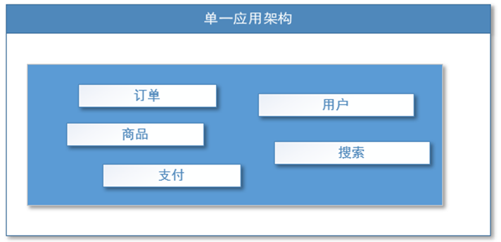

网站流量小，一个应用将所有功能都部署在一起，减少部署节点和成本。此时，用于简化增删改查工作量的数据访问框架(ORM)是关键。

缺点：

1. 性能扩展比较难
2. 协同开发问题
3. 不利于升级维护

#### 1.2.2 垂直架构应用

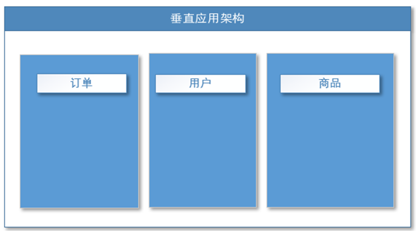

将应用拆成互不相干的几个应用，以提升效率。此时，用于加速前端页面开发的 Web 框架(MVC)是关键。通过切分业务来实现各个模块独立部署，降低了维护和部署的难度，团队各司其职更易管理，性能扩展也更方便，更有针对性。

缺点：公用模块无法重复利用，开发性的浪费

#### 1.2.3 分布式服务架构

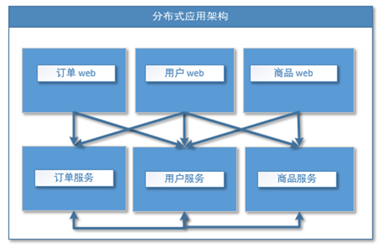

当垂直应用越来越多，应用之间交互不可避免，将核心业务抽取出来，作为独立的服务，逐渐形成稳定的服务中心，使前端应用能更快速的响应多变的市场需求。此时，用于提高业务复用及整合的 **分布式服务框架(RPC)** 是关键。

#### 1.2.4 流动计算架构

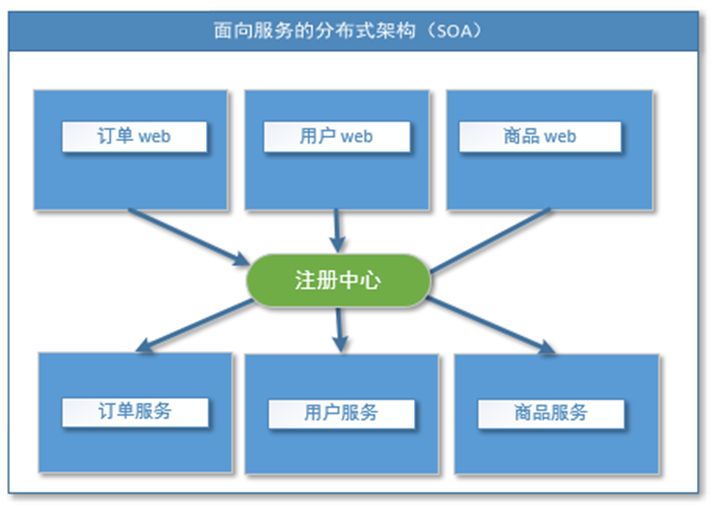

当服务越来越多，容量的评估，小服务资源的浪费等问题逐渐显现，此时需增加一个调度中心基于访问压力实时管理集群容量，提高集群利用率。此时，用于**提高机器利用率的资源调度和治理中心[SOA]( Service Oriented Architecture)是关键**。

### 1.3 RPC

#### 1.3.1 RPC 思想

RPC【Remote Procedure Call】是指远程过程调用，是一种进程间通信方式，他是一种技术的思想，而不是规范。

它允许程序调用另一个地址空间（通常是共享网络的另一台机器上）的过程或函数，而不用程序员显式编码这个远程调用的细节。即程序员无论是调用本地的还是远程的函数，本质上编写的调用代码基本相同。

RPC 两个核心模块：通讯，序列化。

RPC 框架有很多：dubbo、gRPC、Thrift、HSF（High Speed Service Framework)

#### 1.3.2 基本原理

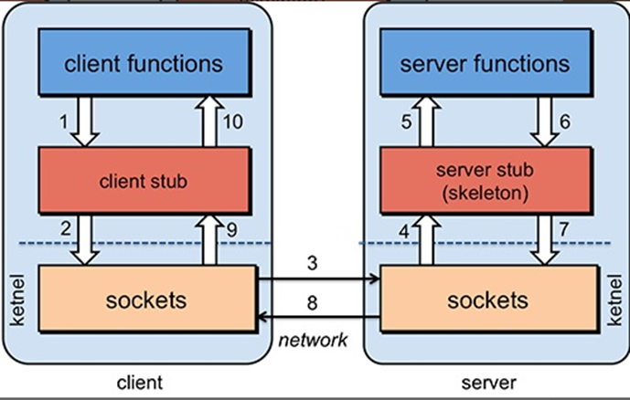

#### 1.3.3 举例

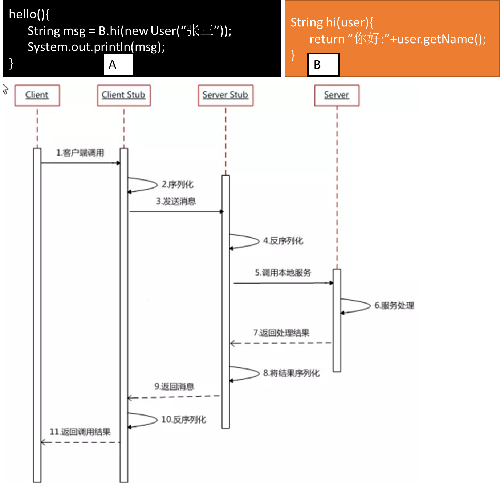

## 第 2 章 dubbo

### 2.1 dubbo 核心概念

#### 2.1.1 简介

Apache Dubbo (incubating) |ˈdʌbəʊ| 是一款高性能、轻量级的开源 Java RPC 框架，它提供了三大核心能力：面向接口的远程方法调用，智能容错和负载均衡，以及服务自动注册和发现。

官网：[https://dubbo.apache.org/zh/index.html](https://dubbo.apache.org/zh/index.html)

Dubbo 架构具有以下几个[特点](https://dubbo.apache.org/zh/docsv2.7/user/preface/architecture/)，分别是连通性、健壮性、伸缩性、以及向未来架构的升级性。

#### 2.1.2 基本概念

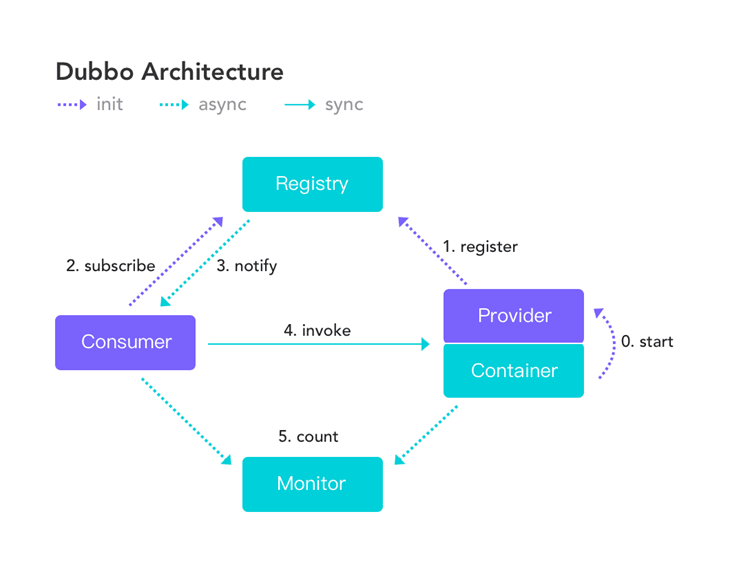

节点角色说明：

| 节点      | 角色说明                               |
| - | - |
| Provider  | 暴露服务的服务提供方                   |
| Consumer  | 调用远程服务的服务消费方               |
| Registry  | 服务注册与发现的注册中心               |
| Monitor   | 统计服务的调用次数和调用时间的监控中心 |
| Container | 服务运行容器                           |

调用关系说明：

1. 服务容器负责启动，加载，运行服务提供者。
2. 服务提供者在启动时，向注册中心注册自己提供的服务。
3. 服务消费者在启动时，向注册中心订阅自己所需的服务。
4. 注册中心返回服务提供者地址列表给消费者，如果有变更，注册中心将基于长连接推送变更数据给消费者。
5. 服务消费者，从提供者地址列表中，基于软负载均衡算法，选一台提供者进行调用，如果调用失败，再选另一台调用。
6. 服务消费者和提供者，在内存中累计调用次数和调用时间，定时每分钟发送一次统计数据到监控中心。

### 2.2 dubbo 环境搭建

#### 2.2.1 安装 zookeeper 注册中心

也可以采用其他注册中心。
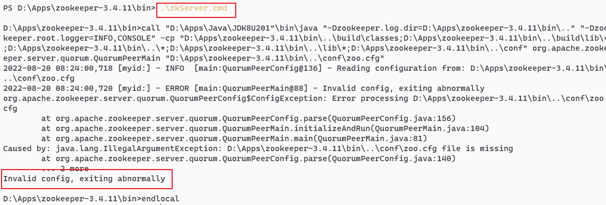
解决报错问题：进入 conf 文件夹，复制一份 zoo_sample.cfg，改名为 zoo.cfg
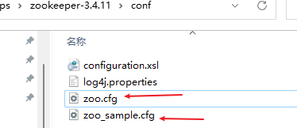
修改 zookeeper 配置文件，本地保存临时文件：新建 data 文件夹，修改配置文件中 dataDir 指向的路径
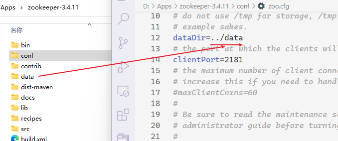

`zkServer.cmd`：启动注册中心
`zkCli.cmd`：连接注册中心（作为管理客户端使用）
`ls /services`：查看有多少服务连接到 zookeeper

#### 2.2.2 安装 dubbo-admin 管理控制台

dubbo 本身并不是一个服务软件。它其实就是一个 jar 包能够帮你的 java 程序连接到 zookeeper，并利用 zookeeper 消费、提供服务。

但是为了让用户更好的管理监控众多的 dubbo 服务，官方提供了一个可视化的监控程序，不过这个监控即使不装也不影响使用。

进入 dubbo-admin 的 application.properties 文件中，查看 zookeeper 地址是否正确。

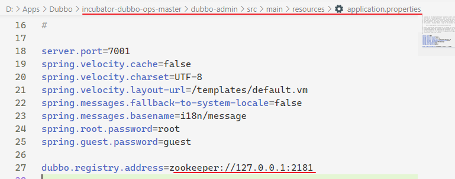

在 dubbo-admin 文件下执行`mvn clean package -Dmaven.test.skip=true`，生成 jar 包

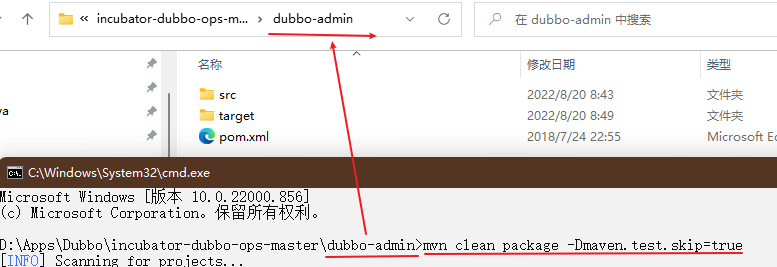

为了便于操作：进入 target 目录，拷贝一份打包好的 `dubbo-admin-0.0.1-SNAPSHOT.jar`` 放到喜欢的位置，在命令行终端输入`java -jar dubbo-admin-0.0.1-SNAPSHOT.jar`，账户名密码均为 root。

注意：启动 dubbo-admin 时，需要启动 zookeeper
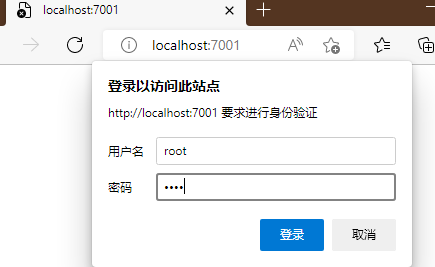

#### 2.2.3 安装 dubbo-monitor-simple 监控中心

主要用来统计服务的调用次数和调用时间，服务消费者和提供者，在内存中累计调用次数和调用时间，定时每分钟发送一次统计数据到监控中心，监控中心则使用数据绘制图表来显示。

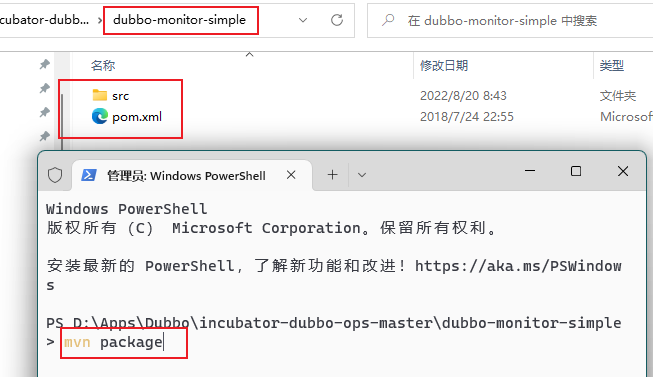

打开 target 目录下的 dubbo-monitor-simple-2.0.0-assembly.tar.gz 压缩包，检查注册中心地址

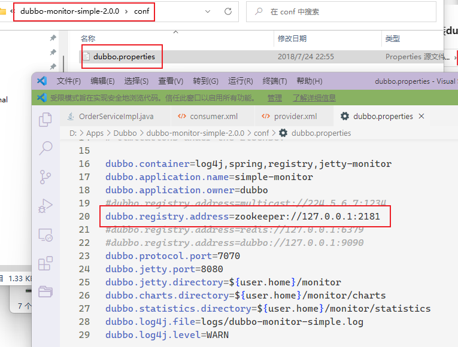

启动监控中心，访问[http://localhost:8080/](http://localhost:8080/)

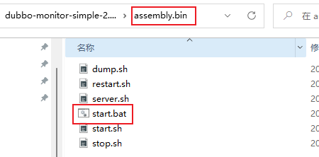

### 2.3 使用案例

#### 2.3.1 需求描述

某个电商系统，订单服务需要调用用户服务获取某个用户的所有地址；

| 模块                  | 功能           |
| --------------------- | -------------- |
| 订单服务 web 模块     | 创建订单等     |
| 用户服务 service 模块 | 查询用户地址等 |

测试预期结果：
订单服务 web 模块在 A 服务器，用户服务模块在 B 服务器，A 可以远程调用 B 的功能。

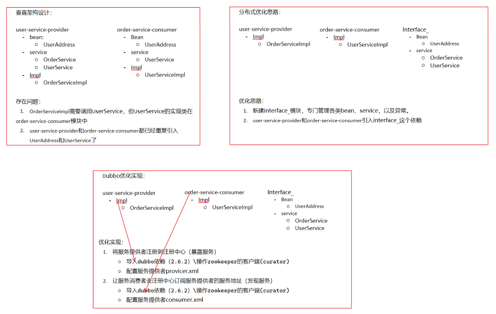

#### 2.3.2 监控中心配置

安装了 dubbo-monitor-simple 监控中心后，要想让服务提供者和消费者能够加入到监控中心，需要进行相关配置。


#### 2.3.3 SpringBoot 整合 dubbo

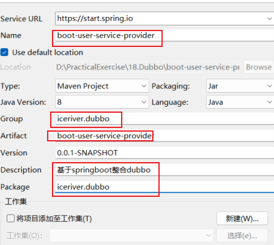

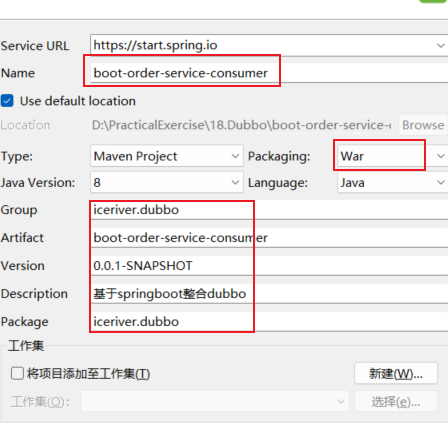

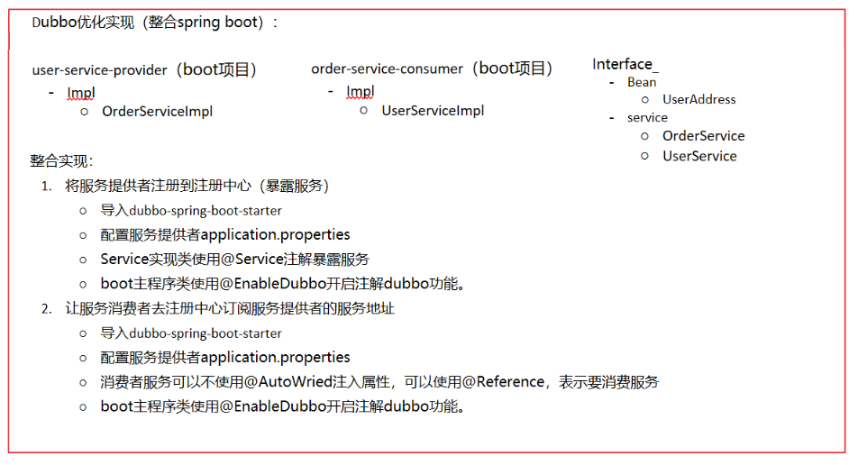

## 第 3 章 Dubbo 配置

### 3.1 配置文件

#### 3.1.1 标签配置

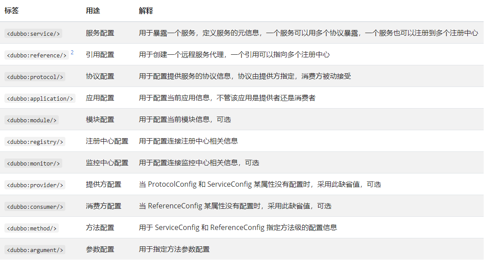

配置官方文档：

#### 3.1.2 属性配置

1. `dubbo:consumer`

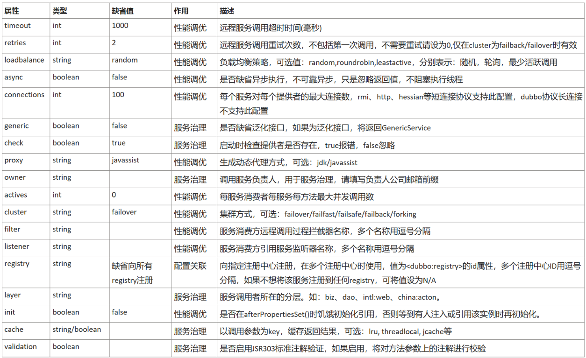

2. `dubbo:reference`

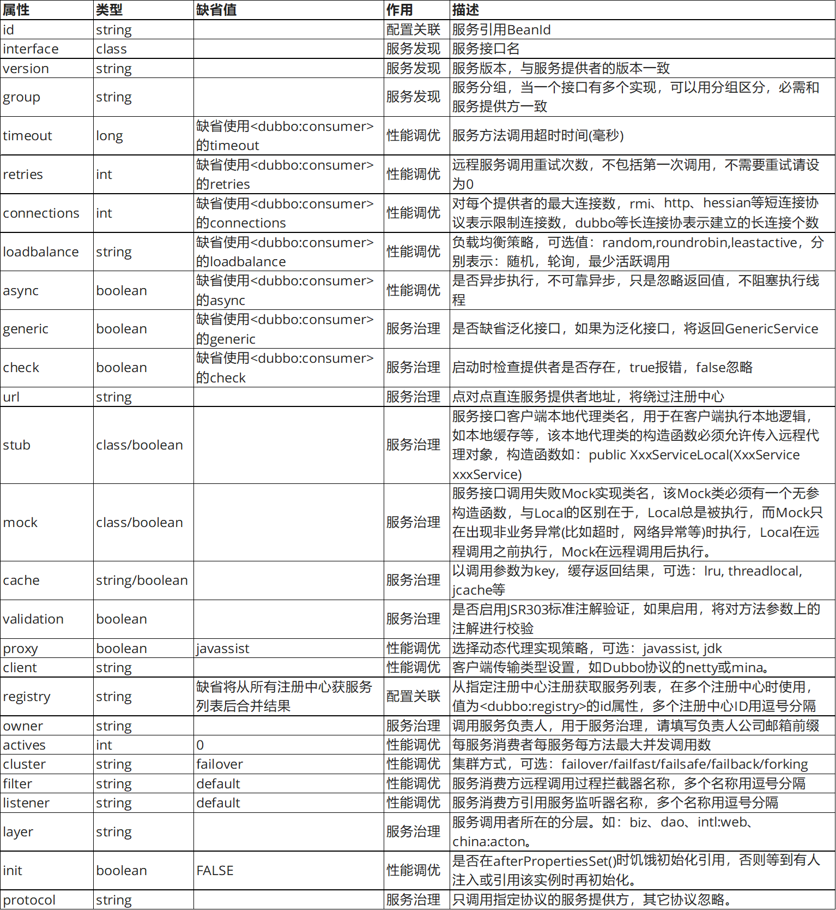

#### 3.1.3 属性配置覆盖策略

- 方法级优先，接口级次之，全局配置再次之。
- 如果级别一样，则消费方优先，提供方次之。

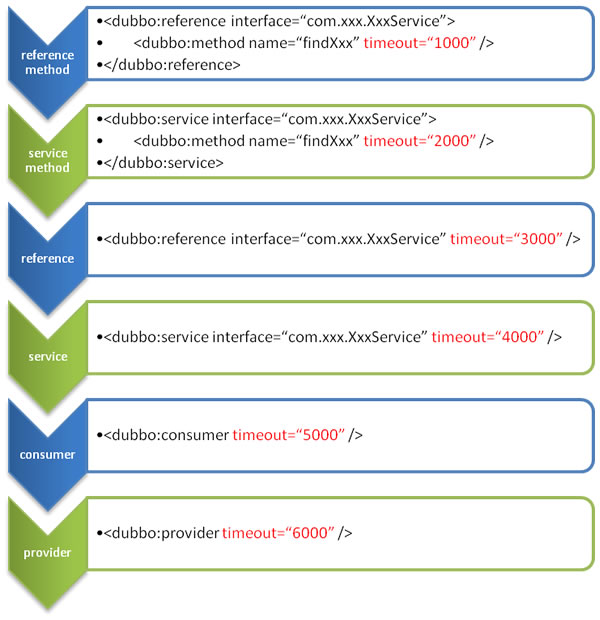

#### 3.1.4 超时与重试

场景模拟：消费服务调用提供者服务超时后，可以通过`retries`属性指定重试次数，比如设置为 3，则重试机制如下：

- 第 1 次连接默认提供者服务，超时后进行第 2 次连接。
- 两次连接失败后，更换提供者服务进行第 3 次连接。
- 三次连接失败后，继续更换提供者服务进行第 4 次连接。

幂等（多次操作结果一样，如查询）一般需要设置重试

不幂等（多次操作结果不一样，如插入），一般不设置重试。

#### 3.1.5 多版本配置

场景模拟：提供者服务有多个版本（使用`dubbo:service version`指定），消费者服务可以通过`dubbo:reference version`指定与提供者服务相同的版本进行连接。

适合生产环境下服务版本升级。

#### 3.1.6 （本地）服务存根

远程服务后，客户端通常只剩下接口，而实现全在服务器端，但提供方有些时候想在客户端也执行部分逻辑。
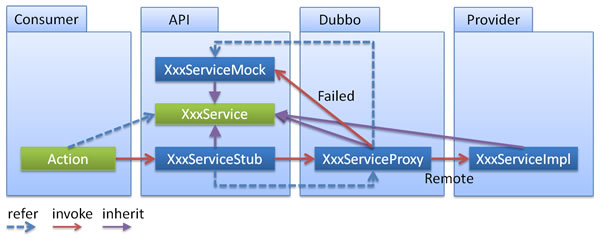
一般约定 Stub 类配置在接口服务中，xml 设置配置在提供者服务中。具体如下：

1. 存根类：设置在接口服务中，创建 Stub 实现。

```java
public class BarServiceStub implements BarService {
    private final BarService barService;

    // 构造函数传入真正的远程代理对象
    public BarServiceStub(BarService barService){
        this.barService = barService;
    }

    public String sayHello(String name) {
        // 此代码在客户端执行, 你可以在客户端做ThreadLocal本地缓存，或预先验证参数是否合法，等等
        try {
            return barService.sayHello(name);
        } catch (Exception e) {
            // 你可以容错，可以做任何AOP拦截事项
            return "容错数据";
        }
    }
}
```

2. xml 配置：`<dubbo:consumer interface="com.foo.BarService" stub="true"/>`或`<dubbo:consumer interface="com.foo.BarService" stub="com.foo.BarServiceStub"/>`

### 3.2 dubbo:properties 属性加载顺序

优先级从上到下依次降低：虚拟机参数 →springboot 配置文件参数（xml 和 properties）→ 公共配置（dubbo.properties）
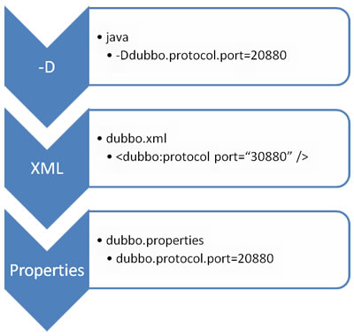

### 3.3 springboot 与 dubbo 整合的 3 中方式

#### 3.3.1 方式一

1. 导入 dubbo-start
2. 在 application.properties 文件中配置属性
   - springboot 主程序使用@EanbleDubbo 注解开启 dubbo 注解功能
3. @Service 注解及参数暴露服务
4. @Reference 注解及参数引用服务

#### 3.3.2 方式二

1. 导入 dubbo-start
2. 在原始 xml 文件中配置属性
   - xml 文件中暴露服务及引用服务
3. springboot 主程序使用@ImportResource(locations="classpath:xxx.xml")引入配置文件

#### 3.3.3 方式三

1. 导入 dubbo-start
2. 创建 spring 配置类
   - 配置类中设置相关的配置属性
3. springboot 主程序使用@EanbleDubbo 注解或@DubboComponentScan 开启 dubbo 注解功能，同时指定扫描配置类的路径
4. @Service 注解及参数暴露服务
5. @Reference 注解及参数引用服务

```java
@Configuration
public class MyDubboConfig {

 @Bean
 public ApplicationConfig applicationConfig() {
  ApplicationConfig applicationConfig = new ApplicationConfig();
  applicationConfig.setName("boot-user-service-provider");
  return applicationConfig;
 }

 //<dubbo:registry protocol="zookeeper" address="127.0.0.1:2181"></dubbo:registry>
 @Bean
 public RegistryConfig registryConfig() {
  RegistryConfig registryConfig = new RegistryConfig();
  registryConfig.setProtocol("zookeeper");
  registryConfig.setAddress("127.0.0.1:2181");
  return registryConfig;
 }

 //<dubbo:protocol name="dubbo" port="20882"></dubbo:protocol>
 @Bean
 public ProtocolConfig protocolConfig() {
  ProtocolConfig protocolConfig = new ProtocolConfig();
  protocolConfig.setName("dubbo");
  protocolConfig.setPort(20882);
  return protocolConfig;
 }

 /**
  *<dubbo:service interface="com.atguigu.gmall.service.UserService"
  ref="userServiceImpl01" timeout="1000" version="1.0.0">
  <dubbo:method name="getUserAddressList" timeout="1000"></dubbo:method>
 </dubbo:service>
  */
 @Bean
 public ServiceConfig<UserService> userServiceConfig(UserService userService){
  ServiceConfig<UserService> serviceConfig = new ServiceConfig<>();
  serviceConfig.setInterface(UserService.class);
  serviceConfig.setRef(userService);
  serviceConfig.setVersion("1.0.0");

  //配置每一个method的信息
  MethodConfig methodConfig = new MethodConfig();
  methodConfig.setName("getUserAddressList");
  methodConfig.setTimeout(1000);

  //将method的设置关联到service配置中
  List<MethodConfig> methods = new ArrayList<>();
  methods.add(methodConfig);
  serviceConfig.setMethods(methods);

  //ProviderConfig
  //MonitorConfig

  return serviceConfig;
 }
}
```

## 第 4 章 高可用（场景处理）

### 4.1 zookeeper 宕机与 dubbo 直连

现象：zookeeper 注册中心宕机，还可以消费 dubbo 暴露的服务。

原因：健壮性

- 监控中心宕掉不影响使用，只是丢失部分采样数据
- 数据库宕掉后，注册中心仍能通过缓存提供服务列表查询，但不能注册新服务
- 注册中心对等集群，任意一台宕掉后，将自动切换到另一台
- **注册中心全部宕掉后，服务提供者和服务消费者仍能通过本地缓存通讯**
- 服务提供者无状态，任意一台宕掉后，不影响使用
- 服务提供者全部宕掉后，服务消费者应用将无法使用，并无限次重连等待服务提供者恢复

高可用：通过设计，减少系统不能提供服务的时间。

dubbo 直连：`@Reference(url="ip")`

### 4.2 集群下 dubbo 负载均衡配置

在集群负载均衡时，Dubbo 提供了多种均衡策略，缺省为 random 随机调用。

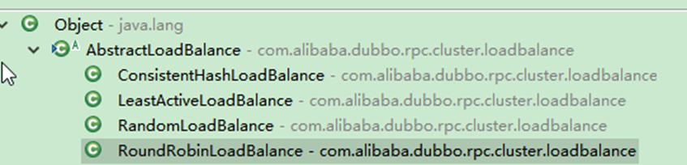

#### 4.2.1 **Random LoadBalance 策略**

随机，按权重设置随机概率。

在一个截面上碰撞的概率高，但调用量越大分布越均匀，而且按概率使用权重后也比较均匀，有利于动态调整提供者权重。
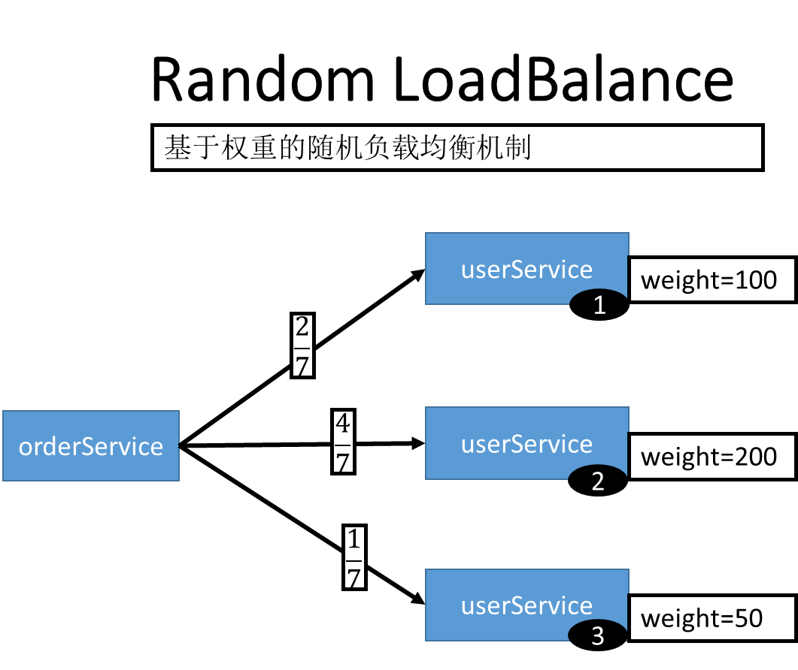

#### 4.2.2 **RoundRobin LoadBalance**

轮循，按公约后的权重设置轮循比率。

存在慢的提供者累积请求的问题，比如：第二台机器很慢，但没挂，当请求调到第二台时就卡在那，久而久之，所有请求都卡在调到第二台上。
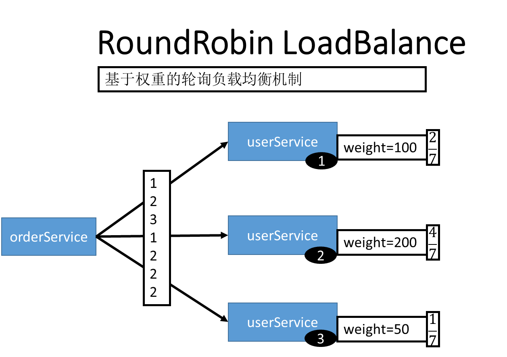

#### 4.2.3 **LeastActive LoadBalance**

最少活跃调用数，相同活跃数的随机，活跃数指调用前后计数差。

使慢的提供者收到更少请求，因为越慢的提供者的调用前后计数差会越大。
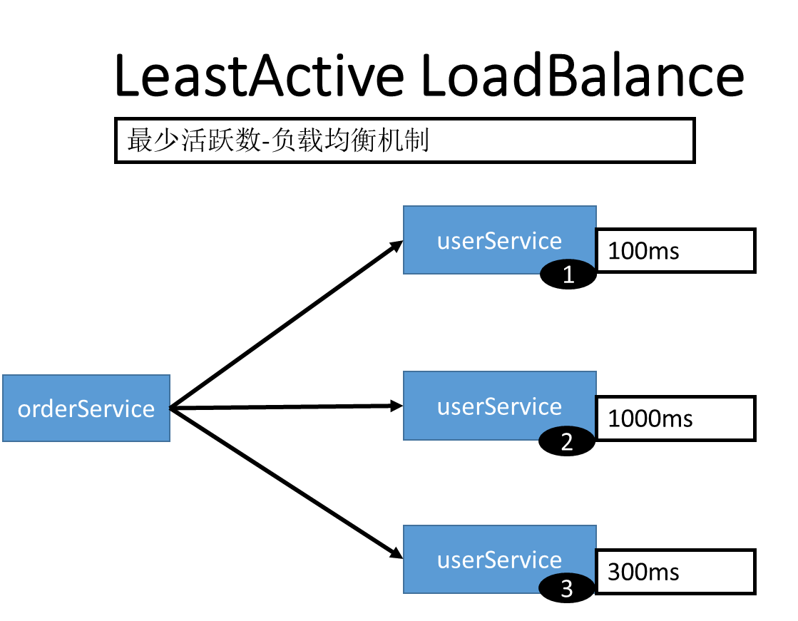

#### 4.2.4 ConsistentHash LoadBalance

一致性 Hash，相同参数的请求总是发到同一提供者。

当某一台提供者挂时，原本发往该提供者的请求，基于虚拟节点，平摊到其它提供者，不会引起剧烈变动。

算法参见：<http://en.wikipedia.org/wiki/Consistent_hashing>

缺省只对第一个参数 Hash，如果要修改，请配置 `<dubbo:parameter key="hash.arguments" value="0,1" />`

缺省用 160 份虚拟节点，如果要修改，请配置`<dubbo:parameter key="hash.nodes" value="320" />`
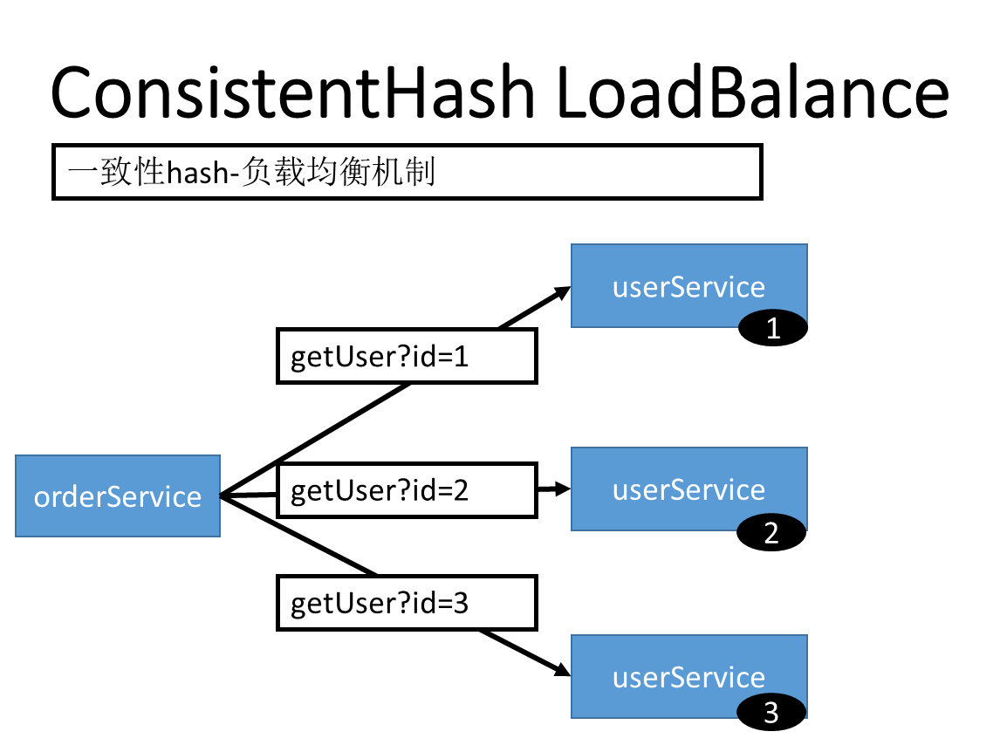

### 4.3 服务降级

当服务器压力剧增的情况下，根据实际业务情况及流量，对一些服务和页面有策略的不处理或换种简单的方式处理，从而释放服务器资源以保证核心交易正常运作或高效运作。

可以通过服务降级功能临时屏蔽某个出错的非关键服务，并定义降级后的返回策略。
dubbo 支持两种降级策略：

```java
RegistryFactory registryFactory = ExtensionLoader.getExtensionLoader(RegistryFactory.class).getAdaptiveExtension();
Registry registry = registryFactory.getRegistry(URL.valueOf("zookeeper://10.20.153.10:2181"));
registry.register(URL.valueOf("override://0.0.0.0/com.foo.BarService?category=configurators&dynamic=false&application=foo&mock=force:return+null"));
```

1. mock=force:return+null 表示消费方对该服务的方法调用都直接返回 null 值，不发起远程调用。用来屏蔽不重要服务不可用时对调用方的影响。
   - 或在 dubbo-admin 管理控制台将消费者进行屏蔽
   - 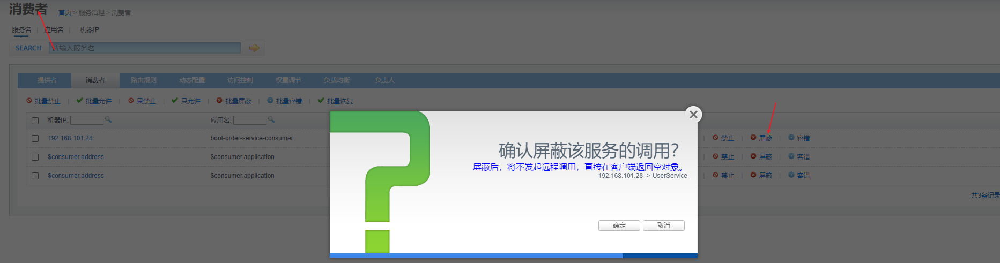
2. 还可以改为 mock=fail:return+null 表示消费方对该服务的方法调用在失败后，再返回 null 值，不抛异常。用来容忍不重要服务不稳定时对调用方的影响。
   - 或在 dubbo-admin 管理控制台将消费者进行容错设置
   - 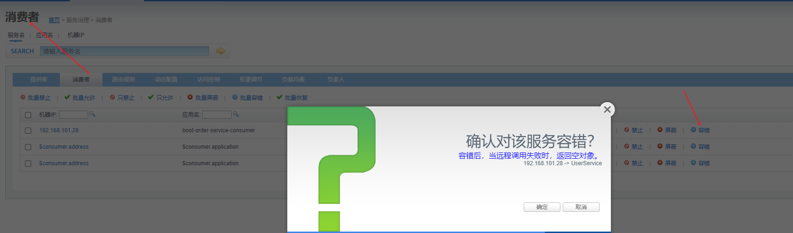

### 4.4 集群容错

#### 4.4.1 集群容错概念

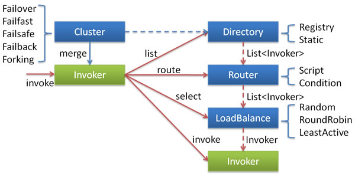各节点关系：

- 这里的 `Invoker`是 `Provider`的一个可调用 `Service`的抽象，`Invoker`封装了 `Provider`地址及 Service 接口信息
- `Directory`代表多个 `Invoker`，可以把它看成`List<Invoker>` ，但与 `List`不同的是，它的值可能是动态变化的，比如注册中心推送变更
- `Cluster`将 `Directory`中的多个 `Invoker`伪装成一个 `Invoker`，对上层透明，伪装过程包含了容错逻辑，调用失败后，重试另一个
- `Router`负责从多个 `Invoker`中按路由规则选出子集，比如读写分离，应用隔离等
- `LoadBalance`负责从多个 `Invoker`中选出具体的一个用于本次调用，选的过程包含了负载均衡算法，调用失败后，需要重选。

#### 4.4.2 集群容错模式

在集群调用失败时，Dubbo 提供了多种容错方案，缺省为 failover 重试。

1. Failover Cluster

失败自动切换，当出现失败，重试其它服务器。通常用于读操作，但重试会带来更长延迟。可通过 retries="2" 来设置重试次数(不含第一次)。

重试次数配置如下：`<dubbo:service retries="2" />`或`<dubbo:reference retries="2" />`或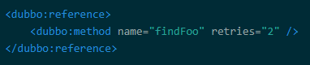

2. Failfast Cluster

快速失败，只发起一次调用，失败立即报错。通常用于非幂等性的写操作，比如新增记录。

3. Failsafe Cluster

失败安全，出现异常时，直接忽略。通常用于写入审计日志等操作。

4. Failback Cluster

失败自动恢复，后台记录失败请求，定时重发。通常用于消息通知操作。

5. Forking Cluster

并行调用多个服务器，只要一个成功即返回。通常用于实时性要求较高的读操作，但需要浪费更多服务资源。可通过 forks="2" 来设置最大并行数。

6. Broadcast Cluster

广播调用所有提供者，逐个调用，任意一台报错则报错 [2]。通常用于通知所有提供者更新缓存或日志等本地资源信息。

#### 4.4.3 集群模式配置

按照以下示例在服务提供方和消费方配置集群模式`<dubbo:service cluster="failsafe" />`或`<dubbo:reference cluster="failsafe" />`

#### 4.4.4 整合 hystrix 容错

Hystrix 旨在通过控制那些访问远程系统、服务和第三方库的节点，从而对延迟和故障提供更强大的容错能力。

Hystrix 具备拥有回退机制和断路器功能的线程和信号隔离，请求缓存和请求打包，以及监控和配置等功能。

1. 提供者和消费者：导入依赖：spring-cloud-starter-netflix-hystrix

`alt+/`可以在 eclipse 中快速导入：


```java
<dependency>
    <groupId>org.springframework.cloud</groupId>
    <artifactId>spring-cloud-starter-netflix-hystrix</artifactId>
    <version>1.4.4.RELEASE</version>
</dependency>
```

2. 提供者和消费者：配置 spring-cloud-starter-netflix-hystrix

然后在 Application 类上增加@EnableHystrix 来启用 hystrix starter：

```java
@SpringBootApplication
@EnableHystrix
public class ProviderApplication {
```

3. 配置 Provider 端：在 Dubbo 的 Provider 上增加@HystrixCommand 配置，这样子调用就会经过 Hystrix 代理

```java
@Service(version = "1.0.0")
public class HelloServiceImpl implements HelloService {
    @HystrixCommand(commandProperties = {
    @HystrixProperty(name = "circuitBreaker.requestVolumeThreshold", value = "10"),
    @HystrixProperty(name = "execution.isolation.thread.timeoutInMilliseconds", value = "2000") })
    @Override
    public String sayHello(String name) {
        // System.out.println("async provider received: " + name);
        // return "annotation: hello, " + name;
        throw new RuntimeException("Exception to show hystrix enabled.");
    }
}
```

4. 配置 Consumer 端：对于 Consumer 端，则可以增加一层 method 调用，并在 method 上配置@HystrixCommand。当调用出错时，会走到 fallbackMethod = "reliable"的调用里。

```java
@Reference(version = "1.0.0")
private HelloService demoService;

@HystrixCommand(fallbackMethod = "reliable")
public String doSayHello(String name) {
    return demoService.sayHello(name);
}
public String reliable(String name) {
    return "hystrix fallback value";
}
```

## 第 5 章 dubbo 原理

### 5.1 RPC 原理


一次完整的 RPC 调用流程（同步调用，异步另说）如下：

1. **服务消费方（client）调用以本地调用方式调用服务；**
2. client stub 接收到调用后负责将方法、参数等组装成能够进行网络传输的消息体；
3. client stub 找到服务地址，并将消息发送到服务端；
4. server stub 收到消息后进行解码；
5. server stub 根据解码结果调用本地的服务；
6. 本地服务执行并将结果返回给 server stub；
7. server stub 将返回结果打包成消息并发送至消费方；
8. client stub 接收到消息，并进行解码；
9. **服务消费方得到最终结果。**

RPC 框架的目标就是要 2~8 这些步骤都封装起来，这些细节对用户来说是透明的，不可见的。实际操作 dubbo 是第 1 步和第 9 步。

### 5.2 netty 通信原理

Netty 是一个异步事件驱动的网络应用程序框架，用于快速开发可维护的高性能协议服务器和客户端。它极大地简化并简化了 TCP 和 UDP 套接字服务器等网络编程。

**BIO(Blocking IO)：服务器接到一个请求即开启一个线程，不能处理大量请求。**
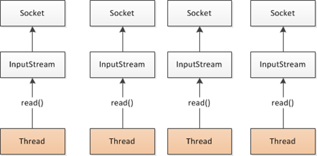

**NIO (Non-Blocking IO)：**Selector 一般称为**选择器**，也可以翻译为**多路复用器**，Connect（连接就绪）、Accept（接受就绪）、Read（读就绪）、Write（写就绪）。Selector 监听多个通道，事件就绪后才开启线程。
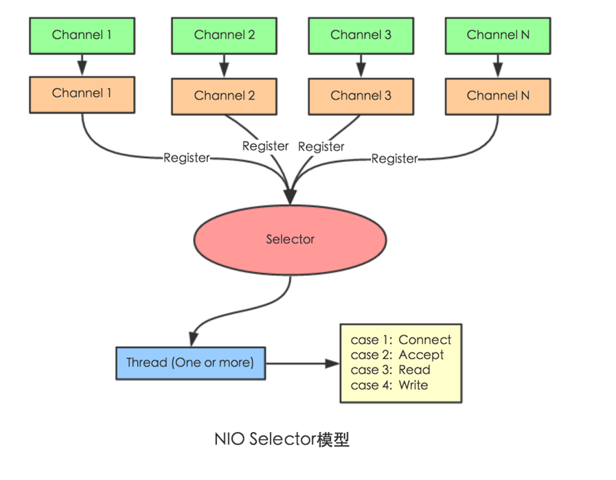
**Netty 基本原理：**
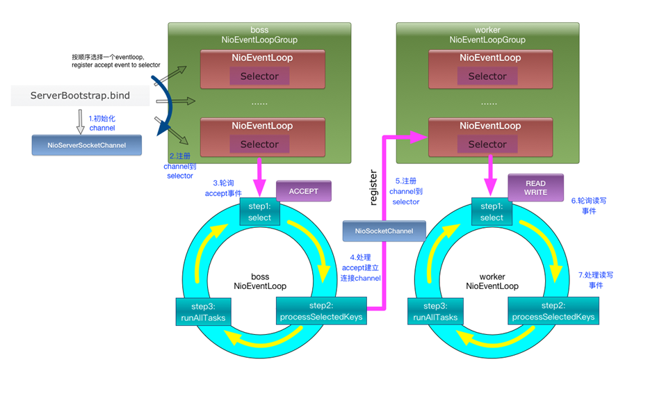

### 5.3 Dubbo 原理

#### 5.3.1 dubbo 框架设计

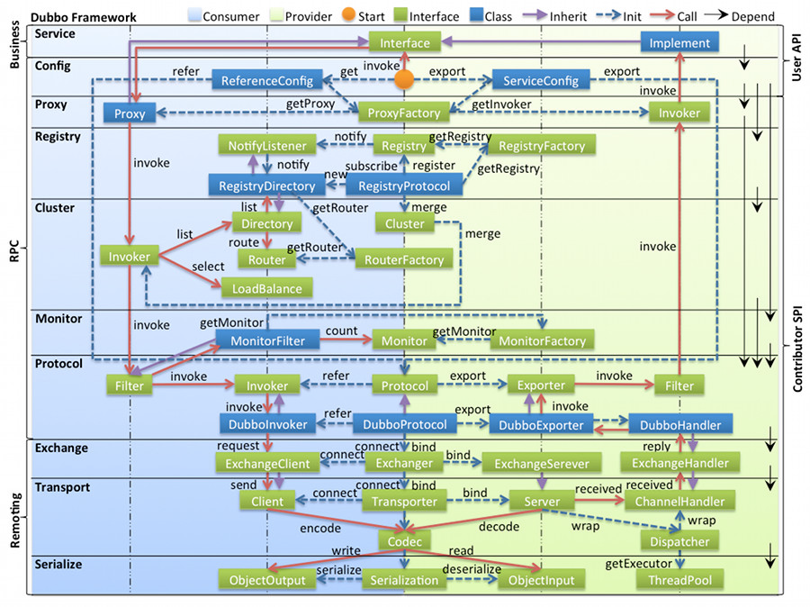

图例说明：

- 图中左边淡蓝背景的为服务消费方使用的接口，右边淡绿色背景的为服务提供方使用的接口，位于中轴线上的为双方都用到的接口。
- 图中从下至上分为十层，各层均为单向依赖，右边的黑色箭头代表层之间的依赖关系，每一层都可以剥离上层被复用，其中，Service 和 Config 层为 API，其它各层均为 SPI。
- 图中绿色小块的为扩展接口，蓝色小块为实现类，图中只显示用于关联各层的实现类。
- 图中蓝色虚线为初始化过程，即启动时组装链，红色实线为方法调用过程，即运行时调时链，紫色三角箭头为继承，可以把子类看作父类的同一个节点，线上的文字为调用的方法。

各层说明：

- **config 配置层**：对外配置接口，以 ServiceConfig, ReferenceConfig 为中心，可以直接初始化配置类，也可以通过 spring 解析配置生成配置类
- **proxy 服务代理层**：服务接口透明代理，生成服务的客户端 Stub 和服务器端 Skeleton, 以 ServiceProxy 为中心，扩展接口为 ProxyFactory
- **registry 注册中心层**：封装服务地址的注册与发现，以服务 URL 为中心，扩展接口为 RegistryFactory, Registry, RegistryService
- **cluster 路由层**：封装多个提供者的路由及负载均衡，并桥接注册中心，以 Invoker 为中心，扩展接口为 Cluster, Directory, Router, LoadBalance
- **monitor 监控层**：RPC 调用次数和调用时间监控，以 Statistics 为中心，扩展接口为 MonitorFactory, Monitor, MonitorService
- **protocol 远程调用层**：封装 RPC 调用，以 Invocation, Result 为中心，扩展接口为 Protocol, Invoker, Exporter
- **exchange 信息交换层**：封装请求响应模式，同步转异步，以 Request, Response 为中心，扩展接口为 Exchanger, ExchangeChannel, ExchangeClient, ExchangeServer
- **transport 网络传输层**：抽象 mina 和 netty 为统一接口，以 Message 为中心，扩展接口为 Channel, Transporter, Client, Server, Codec
- **serialize 数据序列化层**：可复用的一些工具，扩展接口为 Serialization, ObjectInput, ObjectOutput, ThreadPool

#### 5.3.2 启动解析、加载配置信息流程

dubbo 的 xml 配置文件相当于是 spring 的一个配置类，因此可以找到 spring 中的标签解析器 BeanDefinitionParser 的实现子类DubboBeanDefinitionParser 查看如何解析 dubbo 的配置文件。

在 DubboBeanDefinitionParser 类中 parse()方法具体实现标签、属性、值的解析。

parse()方法中每个标签都有一个对应的 bean.class，在 DubboBeanDefinitionParser 构造器方法中对 bean.class 进行了初始化，在调用过程中，执行了 DubboNamespaceHandler 类中的 init()方法，对各个标签进行创建：


其中，除 service 和 reference 标签，其他标签创建的是配置类，这两个创建的是 bean。总体执行流程如下：


#### 5.3.3 服务暴露过程

即 servicebean 的创建过程：

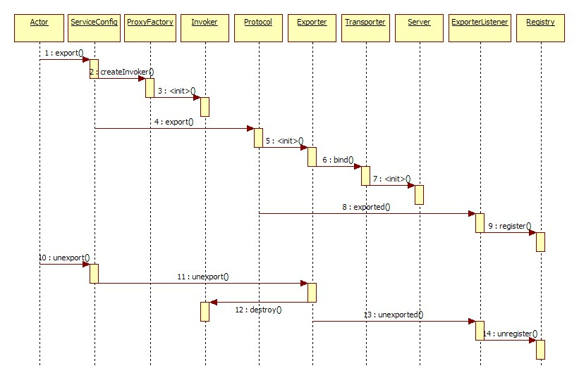

#### 5.3.4 服务引用流程

即 referencebean 的创建过程：

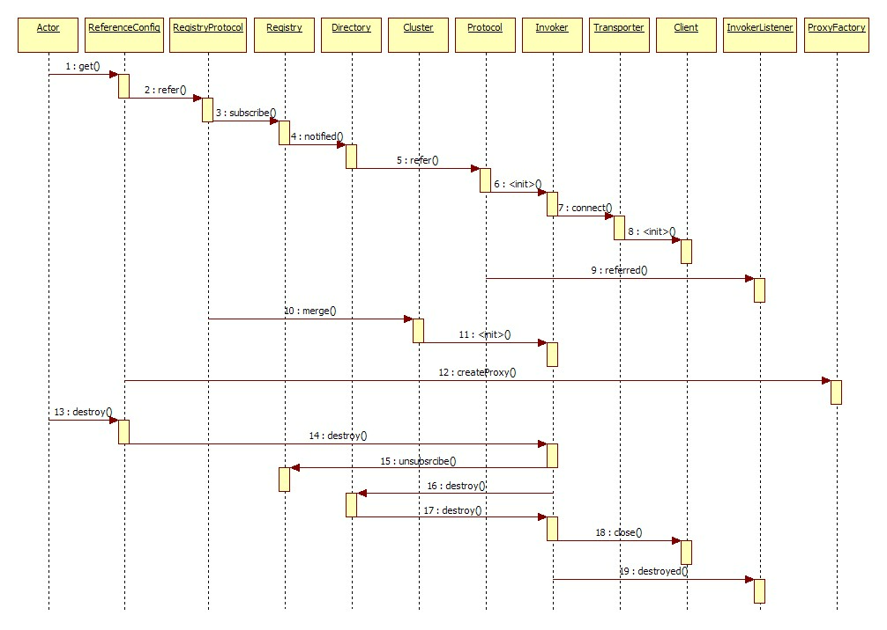

#### 5.3.5 服务调用流程

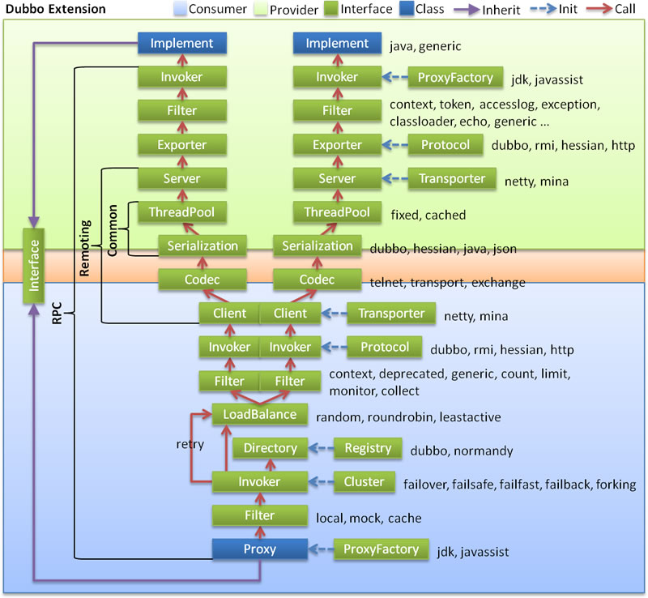

## 总结

dubbo 主要解决了 rpc（远程过程调用问题），不能解决分布式的所有问题，在 springcloud 中，集成了各种分布式问题的解决方案。

dubbo 的分布式原理与其他分布式框架底层思想一致、方式也基本一致（万变不离其宗）。

本文介绍了 dubbo 的主要使用特性/配置/功能，不常见的没有介绍。
