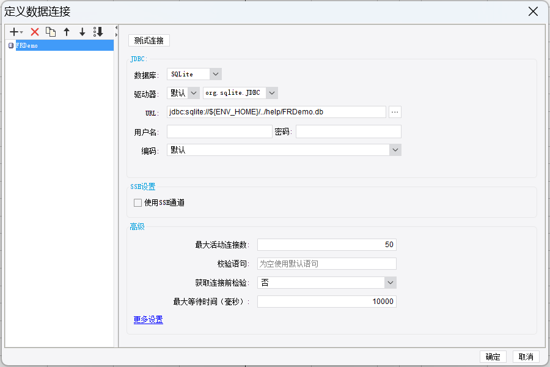

## 0. 认识帆软

### 0.1 功能

帆软官方DEMO：[https://demo.finereport.com/](https:/demo.finereport.com/)[FineReport报表](https://demo.finereport.com/)

### 0.2 开发流程

### 0.3 功能结构

### 0.4 应用结构

## 1. Fine Report 10：服务器环境搭建

帆软服务器搭建分为两种方式：

- 方式一：tomcat服务器内嵌在帆软中。[参考连接](https://help.fanruan.com/finereport10.0/doc-view-2919.html)
- 方式二：帆软和tomcat分别独立部署。[参考链接](https://help.fanruan.com/finereport10.0/doc-view-822.html)

## 2. 问题解决

### 2.1 安装中文环境

- 参考链接：[Linux 系统安装中文语言包- FineReport帮助文档 - 全面的报表使用教程和学习资料 (fanruan.com)](https://help.fanruan.com/finereport10.0/doc-view-2028.html)
- 如果上传提示没权限可以先传到 tmp 目录，然后再移动到自己的目录。
- 未安装可能遇到的报错：

### 2.2 内置数据库启用

帆软提供的模板使用了内置数据库，如果在安装时没有选择内置数据库，会导致模板无法使用。

sqlite 数据库是内置的 frdemo 使用的数据库，若内置的数据库和驱动被误删，可重新下载并创建连接。

- 
- [文档链接](https://help.fanruan.com/finereport/doc-view-2583.html)

内置数据库连接方式如下：

## 3. 基础入门

### 3.1 单元格扩展

1. 模板中只有一个单元格，在web端预览的时候，扩展出多个单元格。
   - 不扩展。
   - 横向扩展。
   - 纵向扩展。
2. 公式单元格默认不扩展；数据集数据列默认纵向扩展。均可修改。

### 3.2 父子格

1. 当报表主体中绑定了多个单元格的时候，单元格间会天然存在某种关系，使单元格间存在数据过滤关系，并且跟随扩展。前面的单元格称之为父格，后面的单元格称之为子格。
   - 子格根据父格的数据分组显示，并于父格的扩展方向一致。
   - 过滤：子格的数据以父格的条件进行筛选。
2. 父子格默认过滤关系只限于同一数据集。不同数据集可以手动设置父子关系。
3. 上父格：父格在子格的紧邻上方、父格横向扩展。
4. 左父格：父格在子格的紧邻左方、父格纵向扩展。