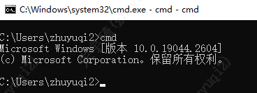
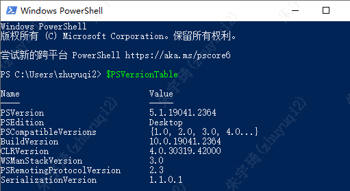
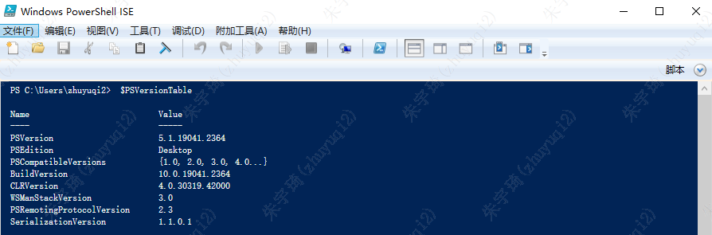
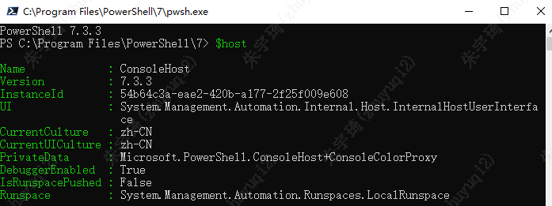
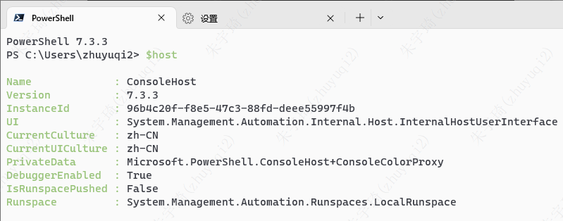
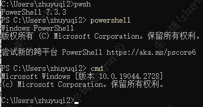

- `cmd`：windows平台命令提示符执行程序。
	- 
- `Windows PowerShell`：任务自动化和配置管理框架，兼容`cmd`。
	- 
- `Windows PowerShell ISE`：集成脚本环境，是`Windows PowerShell`的升级。
	- 
- `PowerShell`：2016年微软开源的`Windows PowerShell`，兼容 Windows、macOS 和 Linux。
	- 
- `WSL`：Windows Linux 子系统，可以直接执行Linux二进制可执行文件（ELF）的兼容层。
- `Windows Terminal`：集成PowerShell、cmd、WSL（Windows Linux子系统）三大环境。
	- 
- `Azure Cloud Shell`：基于浏览器的 shell 体验，用于管理和开发 Azure 资源。
- 切换环境：
	- 
