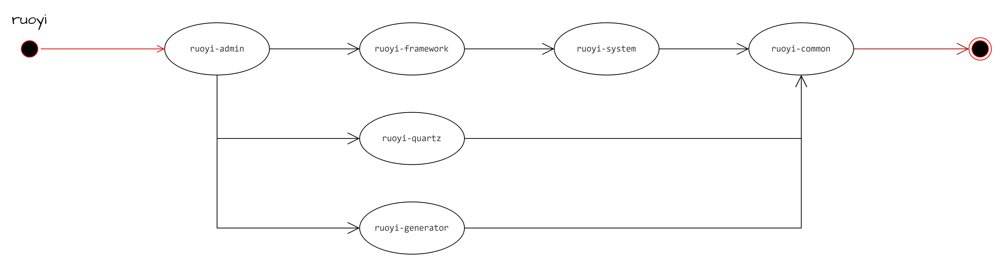
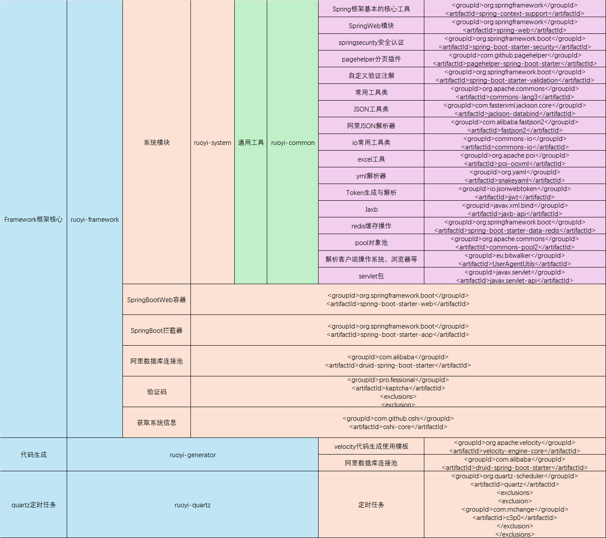
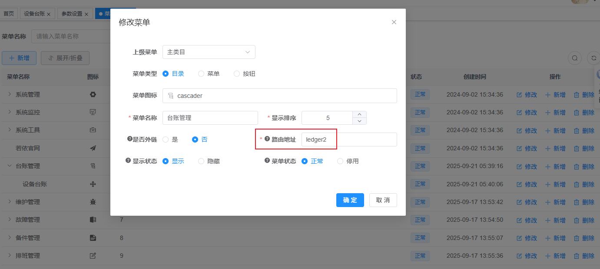

## 1. 前后端分离后台管理系统

### 1.1 框架对比

根据网上搜索和询问智能AI，ELADMIN优于ruoyi，一是ruoyi本身基于eladmin，二是网上反馈ruoyi代码冗余、复杂，eladmin代码简洁、易读。

同时，根据个人网上搜索结果，[AgileBoot](https://github.com/valarchie/AgileBoot-Back-End)采用了企业开发工程规范和代码规范，值得学习。

总结：

|ELADMIN|RUOYI|AGILEBOOT|
|:---|:---|:---|
|适合初学者|大而全，代码不规范|适合学习企业开发规范，但维护性不如前两个|

### 1.2 ELADMIN框架

**文件结构：**

```text
- eladmin-common 公共模块
    - annotation 为系统自定义注解
    - aspect 自定义注解的切面
    - base 提供了Entity、DTO基类和mapstruct的通用mapper
    - config 项目通用配置
        - Web配置跨域与静态资源映射、Swagger配置，文件上传临时路径配置
        - Redis配置，Redission配置, 异步线程池配置
        - 权限拦截配置、AuthorityConfig、Druid 删除广告配置
    - exception 项目统一异常的处理
    - utils 系统通用工具类，列举一些常用的工具类
        - BigDecimaUtils 金额计算工具类
        - RequestHolder 请求工具类
        - SecurityUtils 安全工具类
        - StringUtils 字符串工具类
        - SpringBeanHolder Spring Bean工具类
        - RedisUtils Redis工具类
        - EncryptUtils 加密工具类
        - FileUtil 文件工具类
- eladmin-system 系统核心模块（系统启动入口）
    - sysrunner 程序启动后处理数据
 - modules 系统相关模块(登录授权、系统监控、定时任务、系统模块、运维模块)
- eladmin-logging 系统日志模块
- eladmin-tools 系统第三方工具模块
    - email 邮件工具
    - qiniu 七牛云存储工具
    - alipay 支付宝支付工具
    - local-storage 本地存储工具
- eladmin-generator 系统代码生成模块
```

**新建项目：**

[官网链接](https://eladmin.vip/pages/010201/)

**项目结构：**

1. 根目录是个聚合工程，模块是各个子模块。
2. 聚合工程没有`<dependencyManagement>`标签。
3. 聚合工程使用`<dependencies>`引入了各个依赖，但不包含各个子模块。
4. 新建模块在聚合工程的`<modules>`中添加了子模块；在eladmin-system模块将新建模块作为依赖中引入。

> 测试：新建的子模块如果不在eladmin-system中引入会怎么样？
> 
> 2025-10-07答：运行会报错，提示找不到模块。

#### 1.1.1 ELADMIN自学

> [别人自学的开源项目](https://gitee.com/minzhu-superstar/eladmin-study)

### 1.2 ruoyi

**文件结构：**

```text
com.ruoyi     
├── common            // 工具类
│       └── annotation                    // 自定义注解
│       └── config                        // 全局配置
│       └── constant                      // 通用常量
│       └── core                          // 核心控制
│       └── enums                         // 通用枚举
│       └── exception                     // 通用异常
│       └── json                          // JSON数据处理
│       └── utils                         // 通用类处理
│       └── xss                           // XSS过滤处理
├── framework         // 框架核心
│       └── aspectj                       // 注解实现
│       └── config                        // 系统配置
│       └── datasource                    // 数据权限
│       └── interceptor                   // 拦截器
│       └── manager                       // 异步处理
│       └── shiro                         // 权限控制
│       └── web                           // 前端控制
├── ruoyi-generator   // 代码生成（不用可移除）
├── ruoyi-quartz      // 定时任务（不用可移除）
├── ruoyi-system      // 系统代码
├── ruoyi-admin       // 后台服务
├── ruoyi-xxxxxx      // 其他模块
```

**新建项目：**

[官网链接](https://doc.ruoyi.vip/ruoyi/document/htsc.html#%E6%96%B0%E5%BB%BA%E5%AD%90%E6%A8%A1%E5%9D%97)

**项目结构：**

1. 根目录是个聚合工程，模块是各个子模块。
2. 聚合工程使用`<dependencyManagement>`进行版本管理，子模块也在这里面管理。
3. 聚合工程没有使用`<dependencies>`引入具体依赖。
4. 新建模块在聚合工程的`<modules>`中添加了子模块；新建模块在聚合模块的`<dependencyManagement>`中进行版本管理；在ruoyi-admin模块将新建模块作为依赖中引入。

### 1.3 AgileBoot

**文件结构：**

```text
agileboot
├── agileboot-admin -- 管理后台接口模块（供后台调用）
│
├── agileboot-api -- 开放接口模块（供客户端调用）
│
├── agileboot-common -- 精简基础工具模块
│
├── agileboot-infrastructure -- 基础设施模块（主要是配置和集成，不包含业务逻辑）
│
├── agileboot-domain -- 业务模块
├    ├── user -- 用户模块（举例）
├         ├── command -- 命令参数接收模型（命令）
├         ├── dto -- 返回数据类
├         ├── db -- DB操作类
├              ├── entity -- 实体类
├              ├── service -- DB Service
├              ├── mapper -- DB Dao
├         ├── model -- 领域模型类
├         ├── query -- 查询参数模型（查询）
│         ├────── UserApplicationService -- 应用服务（事务层，操作领域模型类完成业务逻辑）
```

**新建项目：**

新建member模块，既可以在admin模块下创建包、也可以在domain模块下创建包，也可以新建一个模块，作为聚合工程的子项目。

```text
agileboot
├── agileboot-admin -- 
│                ├── member -- 会员模块（举例）
│
├── agileboot-domain -- 
├                ├── member -- 会员模块（举例）
├                     ├── command -- 命令参数接收模型（命令）
├                     ├── dto -- 返回数据类
├                     ├── db -- DB操作类
├                          ├── entity -- 实体类
├                          ├── service -- DB Service
├                          ├── mapper -- DB Dao
├                     ├── model -- 领域模型类
├                     ├── query -- 查询参数模型（查询）
│                     ├────── MemberApplicationService -- 应用服务（事务层，操作领域模型类完成业务逻辑）
└─
```

**项目结构：**

1. 根目录是个聚合工程，模块是各个子模块。
2. 聚合工程使用`<dependencyManagement>`进行版本管理，子模块也在这里面管理。
3. 聚合工程使用`<dependencies>`引入具体依赖。
4. 新建模块在聚合工程的`<modules>`中添加了子模块；新建模块在聚合模块的`<dependencyManagement>`中进行版本管理；在agileboot-admin模块将新建模块作为依赖中引入。

> 测试：新建的子模块如果不在agileboot-admin中引入会怎么样？

### 1.4 三个框架对比

| 对比项目                     | eladmin    | ruoyi-vue   | agileboot   |
| :----------------------- | :--------- | :---------- | :---------- |
| `<dependencyManagement>` | 无该标签       | 有该标签，且包含子模块 | 有该标签，且包含子模块 |
| `<dependencies>`         | 有该标签，但无子模块 | 无该标签        | 有该标签，但无子模块  |

> 总结：父工程的`<dependencies>`不能包含子模块，因为父工程的`<dependencies>`本身就是说子模块自动有这些，自己依赖自己没必要，且容易报错和依赖污染。
> 

**新建子模块差异：**

|对比项目|eladmin|ruoyi-vue|agileboot|
|:---|:---|:---|:---|
|聚合工程`<modules>`|包含子模块|包含子模块|包含子模块|
|`<dependencyManagement>`|无该标签|有该标签，且包含子模块|有该标签，且包含子模块|
|`<dependencies>`|有该标签，但无子模块|无该标签|有该标签，但无子模块|
|系统模块依赖|引入新建子模块|引入新建子模块|引入新建子模块|

**根据本文第二章的对比结论，总结如下：**

1. 子模块不要通过`<dependencies>`标签引入到聚合工程，避免依赖污染。
2. 新建子模块肯定会引入系统模块中，作为依赖。
3. 子模块纳入聚合工程的`<dependencyManagement>`中管理，便于统一版本管理。
4. **agileboot工程最符合这个规范。**

## 2. MAVEN聚合工程和父子工程

### 2.1 聚合（Aggregation）

**定义**：  

通过一个父项目（聚合项目）统一管理多个子模块，实现批量构建（如 `mvn clean install` 一键构建所有模块）。  

**特点**：  

- 聚合项目本身可以没有代码，仅作为模块容器。  
- **子模块在聚合项目的 `pom.xml` 中通过 `<modules>` 声明。**
- 聚合项目执行maven指令，会逐一执行各子模块的maven指令。

**示例结构**：  

```text
parent-project（聚合项目）
├── pom.xml（聚合配置）
└── child-module-1
    ├── pom.xml
└── child-module-2
    ├── pom.xml
```

**聚合项目 `pom.xml` 配置**：  

```xml
<project>
  <modelVersion>4.0.0</modelVersion>
  <groupId>com.example</groupId>
  <artifactId>parent-project</artifactId>
  <version>1.0.0</version>
  <packaging>pom</packaging> <!-- 必须为 pom -->

  <modules>
    <module>child-module-1</module>
    <module>child-module-2</module>
  </modules>
</project>
```

### 2.2 父子项目（Parent-Child Inheritance）

**定义**：  

子模块通过 `<parent>` 标签继承父项目的配置（依赖、插件、属性等），实现配置复用。 

**特点**：  

- 父项目的 `<packaging>` 必须为 `pom`。  
- 子模块的 `pom.xml` 中需声明 `<parent>` 指向父项目。  
- **父项目并没有通过 `<modules>` 声明子模块。** 即不需要该标签（与聚合工程的差异）。
- 在父项目中通过 `<dependencyManagement>` 统一管理依赖版本和范围，子模块按需引用依赖（无需重复指定版本）。

    1. 避免多模块版本冲突。
    2. 子模块声明依赖时需省略 `<version>`。

**父项目 `pom.xml` 配置**：  

```xml
<dependencyManagement>
  <dependencies>
    <dependency>
      <groupId>org.springframework</groupId>
      <artifactId>spring-core</artifactId>
      <version>5.3.10</version>
    </dependency>
  </dependencies>
</dependencyManagement>
```

**子模块 `pom.xml` 配置**：  

```xml
<project>
  <modelVersion>4.0.0</modelVersion>
  <parent>
    <groupId>com.example</groupId>
    <artifactId>parent-project</artifactId>
    <version>1.0.0</version>
  </parent>
  <artifactId>child-module-1</artifactId>
</project>

<dependencies>
  <dependency>
    <groupId>org.springframework</groupId>
    <artifactId>spring-core</artifactId> <!-- 无需版本 -->
  </dependency>
</dependencies>
```

### 2.3 三者结合使用场景

```text
parent-project（聚合 + 父项目）
├── pom.xml（聚合模块 + 依赖管理）
├── common（子模块）
│   └── pom.xml（继承父配置）
└── web-app（子模块）
    └── pom.xml（继承父配置 + 引用依赖）
```

**父项目 `pom.xml` 完整示例**：  

```xml
<project>
  <modelVersion>4.0.0</modelVersion>
  <groupId>com.example</groupId>
  <artifactId>parent-project</artifactId>
  <version>1.0.0</version>
  <packaging>pom</packaging>

  <!-- 聚合模块 -->
  <modules>
    <module>common</module>
    <module>web-app</module>
  </modules>

  <!-- 依赖管理 -->
  <dependencyManagement>
    <dependencies>
      <dependency>
        <groupId>org.springframework</groupId>
        <artifactId>spring-core</artifactId>
        <version>5.3.10</version>
      </dependency>
    </dependencies>
  </dependencyManagement>

  <!-- 公共插件配置 -->
  <build>
    <plugins>
      <plugin>
        <groupId>org.apache.maven.plugins</groupId>
        <artifactId>maven-compiler-plugin</artifactId>
        <version>3.8.1</version>
        <configuration>
          <source>11</source>
          <target>11</target>
        </configuration>
      </plugin>
    </plugins>
  </build>
</project>
```

### 2.4 对比结论

1. 聚合项目是为了不用单独取执行各子模块的maven指令。

    - 聚合项目可以没有任何src目录。
    - pom.xml的打包形式必须是pom
    - pom.xml中有modules标签，用来声明子模块。

2. 父子项目是为了子项目复用父项目的依赖。

    - 父项目`<dependencies>`声明的依赖，子模块会自动继承。
    - 父项目`<dependencyManagement>`声明的依赖，子模块声明版本时无需重复声明。

3. 一般使用时，聚合项目和父子项目是共同使用的。

4. **问题1：聚合工程在，为什么要使用dependencyManagement里显式地添加子模块作为依赖？**

    - 通常不会在dependencyManagement里声明子模块。子模块的依赖管理应该在父POM的`<modules>`标签里声明，或者在子模块自己的POM中通过`<parent>`指定父项目。
    - 但是，当某个子模块A需要被其他子模块B依赖。这时候，在父POM的dependencyManagement里声明子模块A的依赖，可以让子模块B在引用A时不需要指定版本，因为版本由父POM统一管理。这样可以**确保所有子模块使用相同的版本号，避免不同子模块引用不同版本的模块A导致的问题。**
    - 优点：

      1. 统一管理内部模块的依赖版本，确保一致性。
      2. 简化子模块的依赖声明，避免重复指定版本号。
      3. 便于项目版本升级时，所有相关依赖自动更新。

5. 问题2：**聚合工程中使用dependencies引入依赖有什么意义？**

    - 在聚合工程的父POM中使用 `<dependencies>` 引入依赖，核心目的是 **强制所有子模块继承这些依赖**，适用于全局通用且必须的依赖（如日志、测试框架）。
    - **但需谨慎使用，避免依赖污染**。对于需要灵活管理的依赖，应优先通过 `<dependencyManagement>` 声明。

## 3. ruoyi后端

### 3.1 结构



1. ruoyi

  - 这是一个聚合项目，用于管理所有子项目。
    - `<modules>`声明子模块，执行聚合项目的mvn指令，子模块的mvn指令会自动执行。这个主要是生成jar包。
  - 这也是一个父项目，用于管理所有子项目。
    - 使用`<dependencyManagement>`用来管理所有依赖的版本，子模块需要使用时，只需要使用`<dependency>`引用依赖，不需要指定版本。
    - 如果使用了`<dependencies>`标签，则子模块全部具有了这些依赖，而不用声明。ruoyi项目中没有使用这个标签。

2. ruoyi-admin

    - 是一个子模块，用于管理后台。
    - 通过`<dependencies>`引入其他子模块，系统运行时，可以加载其他子模块。因此如果是自己创建的模块，也要添加到`<dependencies`>中。

### 3.2 依赖



### 3.3 启动配置

### 3.4 代码生成

### 3.5 菜单配置

### 3.6 bug处理

#### 3.6.1 页面显示404

菜单配置及页面位置均正确，但是访问页面时，显示404。

解决：修改菜单配置，将菜单的路由地址换个名字。但是，更换子页面的路由名字不行。



原因：不知道为啥。


## 4. ruoyi前端

### 4.1 vite配置文件解析

```javascript
import { defineConfig, loadEnv } from 'vite'
import path from 'path'
import createVitePlugins from './vite/plugins'

// https://vitejs.dev/config/
export default defineConfig(({ mode, command }) => {
  const env = loadEnv(mode, process.cwd())
  const { VITE_APP_ENV } = env
  return {
    // 部署生产环境和开发环境下的URL。
    // 默认情况下，vite 会假设你的应用是被部署在一个域名的根路径上
    // 例如 https://www.ruoyi.vip/。如果应用被部署在一个子路径上，你就需要用这个选项指定这个子路径。例如，如果你的应用被部署在 https://www.ruoyi.vip/admin/，则设置 baseUrl 为 /admin/。
    base: VITE_APP_ENV === 'production' ? '/' : '/',
    plugins: createVitePlugins(env, command === 'build'),
    resolve: {
      // https://cn.vitejs.dev/config/#resolve-alias
      alias: {
        // 设置路径
        '~': path.resolve(__dirname, './'),
        // 设置别名
        '@': path.resolve(__dirname, './src')
      },
      // https://cn.vitejs.dev/config/#resolve-extensions
      extensions: ['.mjs', '.js', '.ts', '.jsx', '.tsx', '.json', '.vue']
    },
    // vite 相关配置
    server: {
      port: 80,
      host: true,
      open: true,
      proxy: {
        // https://cn.vitejs.dev/config/#server-proxy
        '/dev-api': {
          target: 'http://localhost:8080',
          // target: 'https://api.wzs.pub/mock/13',
          changeOrigin: true,
          rewrite: (p) => p.replace(/^\/dev-api/, '')
        }
      }
    },
    //fix:error:stdin>:7356:1: warning: "@charset" must be the first rule in the file
    css: {
      postcss: {
        plugins: [
          {
            postcssPlugin: 'internal:charset-removal',
            AtRule: {
              charset: (atRule) => {
                if (atRule.name === 'charset') {
                  atRule.remove();
                }
              }
            }
          }
        ]
      }
    }
  }
})
```

- L1: 从 `vite` 导入 `defineConfig` 与 `loadEnv`（配置助手与环境变量加载）。
- L2: 导入 Node 内置 `path` 模块（用于路径解析）。
- L3: 引入自定义的插件工厂 `createVitePlugins`（位于 `./vite/plugins`）。
- L5: 注释：Vite 配置文档链接。
- L6: 默认导出配置；用 `defineConfig` 包裹，接收 `{ mode, command }`。
- L7: 按当前 `mode` 从项目根目录加载 `.env*` 到对象 `env`。
- L8: 从 `env` 解构出自定义环境变量 `VITE_APP_ENV`。
- L9: 返回配置对象开始。
- L10–L12: 注释：说明 `base` 的用途和部署子路径场景。
- L13: 设置 `base`。生产与开发都用 `'/'`（如需子路径部署时改成 `'/子路径/'`）。
- L14: 注册插件集合，传入 `env` 与是否为构建命令的布尔值。
- L15: 开始 `resolve` 解析配置。
- L16: 注释：文档链接，介绍 alias。
- L17: 开始定义别名。
- L18: 注释：设置路径。
- L19: 定义 `~` 指向项目根目录。
- L20: 注释：设置别名。
- L21: 定义 `@` 指向 `./src`，用于源码导入别名。
- L22: 结束 `alias`。
- L23: 注释：扩展名解析文档链接。
- L24: 配置可省略的文件扩展名列表。
- L25: 结束 `resolve`。
- L26: 注释：vite 相关配置。
- L27: 开始开发服务器 `server` 配置。
- L28: 端口为 `80`。
- L29: `host: true`，允许通过局域网访问。
- L30: `open: true`，启动后自动打开浏览器。
- L31: 配置代理 `proxy` 开始。
- L32: 注释：代理文档链接。
- L33: 以 `/dev-api` 开头的请求走该代理规则。
- L34: 代理目标后端地址 `http://localhost:8080`。
- L35: 备用的 mock 目标（注释掉）。
- L36: `changeOrigin: true`，修改请求源以通过后端校验。
- L37: `rewrite` 去掉前缀 `/dev-api`，与后端真实路由对齐。
- L41: 注释：修复构建时 `@charset` 必须是首条规则的警告。
- L42: 开始 CSS 相关配置。
- L43: 指定 `postcss` 配置。
- L44: 注册 PostCSS 插件数组开始。
- L45: 定义一个内联 PostCSS 插件对象。
- L46: 插件名：`internal:charset-removal`。
- L47: 定义对 `AtRule`（@规则）的处理对象。
- L48: 指定处理 `@charset` 规则。
- L49: 判断 at 规则名称是否为 `charset`。
- L50: 若是则移除该规则，避免警告。

简短提示：
- 想部署到子路径时，改 L13 为对应路径；同时确认路由与服务器配置匹配。
- 与 TS 路径映射保持一致：若项目用 TS，`tsconfig.json` 的 `paths` 应与 L19/L21 对齐。
- 如需多后端代理，在 L31–L39 下添加更多前缀规则即可。

