## 1. `C#`简介

### 1.1 `.NET Framework`

`.NET Framework`是Microsoft为开发应用程序而创建的一个具有革命意义的平台。

- `.NET Framework`不是只在Windows平台上的。
	- `Mono`（`.NET Framework`的开源版）可以运行在其他操作系统平台。
- `.NET Framework`可以开发多种类型的应用程序。

#### 1.1.1 `.NET Framework`的内容

- 开发工具。
- 一个庞大的代码库（BCL）
- `.NET`公共语言运行库（CLR，Common Language Runtime）：管理用`.NET`库开发的所有应用程序的执行。

#### 1.1.2 .net standard和.net core

- .net standard：可以看作一个类库，提供的api支持所有`.net platform`的应用程序。
- .net core：跨平台开发的一个分支。

#### 1.1.3 .net开发的含义

.net开发其实就是指使用`.net framework`或`.net core`编写应用程序——本质是是使用.net代码库编写代码，语言使用了`.net framework`支持的任何一种。

源代码的执行过程：

1. 源代码通过开发工具（vstudio）将源代码转换为中间语言代码（CIL，Common Intermediate Language）。
	1. 存储在一个程序集中（exe或dll）
2. CIL通过JIT（Just In Time）即时编译器编译为适合操作系统的本机代码。
	1. 该过程在程序运行时自动发生。

程序集包括：CIL、元信息（数据信息）、可选资源（如图片）。

- 托管代码：JIT编译后的代码的运行受CLR控制（如垃圾回收），属于托管代码。
- 非托管代码：编译后的代码可以直接访问操作系统的底层功能，如C++。

### 1.2 `C#`用途

- 桌面应用程序。
- Windows Store应用程序
- 云/web应用程序
- web api
- WCF服务

## 2. 编写C#程序

控制台应用程序：

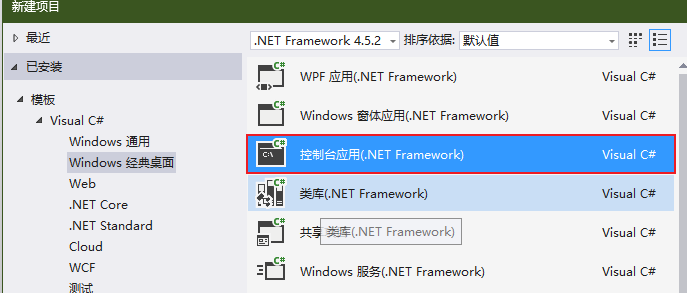

控制台程序会在执行完毕立即终止，导致无法看到结果，可以在代码中加入`Console.ReadKey()`，告诉代码在结束前等待按键。

桌面应用程序：

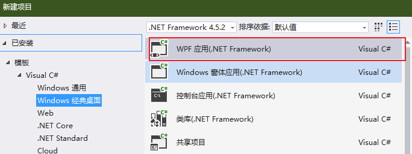

C#代码文件扩展名为`.cs`。

## 3. 变量和表达式

### 3.1 基本语法

- C#代码由一系列语句组成，每条语句使用`;`结束，一行可以写多条语句，一条语句也可以分多行。
- C#是一种块结构语言，所有语句都是代码块的一部分，代码块使用花括号界定，代码块可以包含任意多行语句或者不包含任何语句，花括号字符不需要附带分号。
- C#注释有两种，`//`和`/* */`。
- C#严格区分大小写。

代码折叠（范围内的代码折叠成一行）：

```c#
#region Using directives
usingSystem;
System.Collections.Generic;using
usingSystem,Ling;
using System.Text;
using System.Threading.Tasks;
#endregion
```

### 3.2 变量

声明变量：`<type> <name>`。

- `<type>`：数据类型
- `<name>`：变量名

#### 3.2.1 简单类型

1. 整数类型：

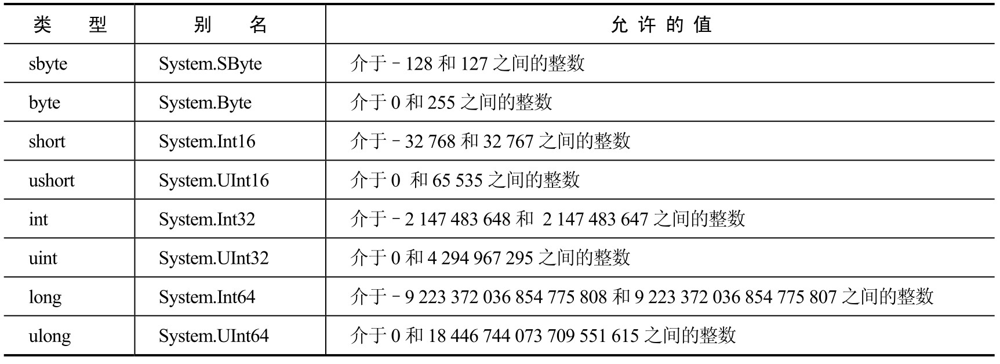

“u”是unsigned的缩写，表示不能在这些类型的变量中存储负数。

2. 浮点类型：

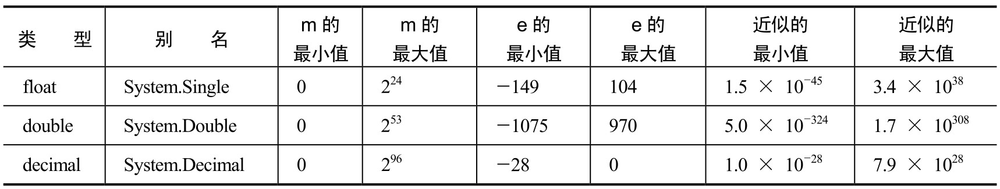

3. 其他类型：

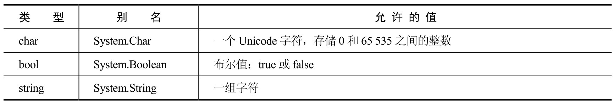

- string没有存储上限，是一个可变大小类型。
- string是引用类型，其余都是值类型，string可以赋值为null，表示不引用任何东西。

#### 3.2.2 变量名规范

- 变量名的第一个字符必须是字母、下划线（`_`）或@。
- 其后的字符可以是字母、下划线或数字。

#### 3.2.3 字面值

赋值语句右边的值如果为固定值，则称为字面值。

字面值后可添加字符指定类型：

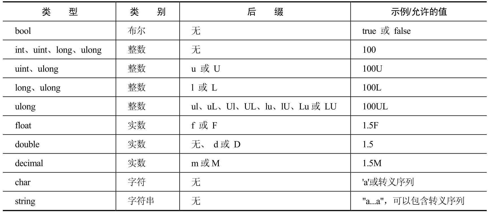

字符串字面值表示特殊符号需要使用转移：

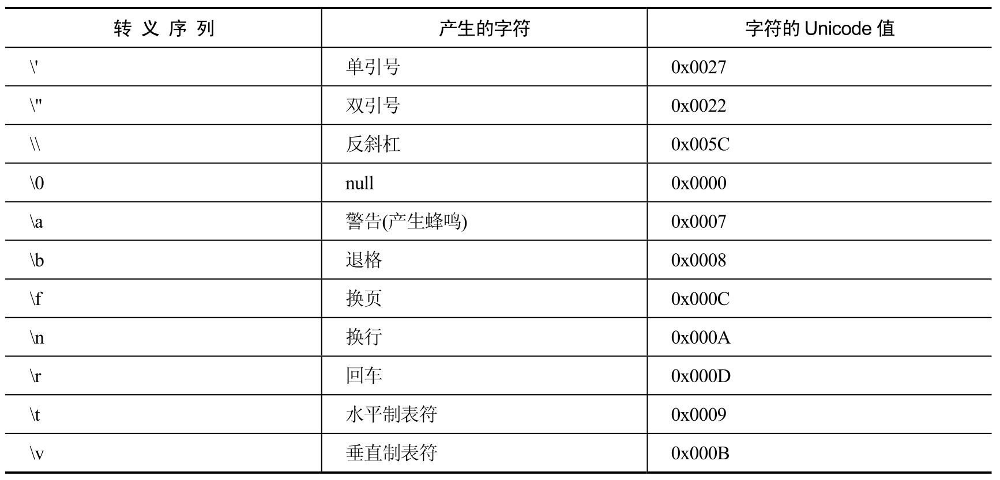

- `\'` 和 `\u0027` 表示的转义含义一致。
- `@" . . ."`  @和" 这种方式可以让语句原样输出，包括空格、换行、制表符、特殊字符等。
	- 但需注意，输出的内容包含`"` 时，必须使用`\` 进行转移。

#### 3.2.4 类型转换

- 隐式转换：从类型A到类型B的转换可在所有情况下进行，执行转换的规则非常简单，可以让编译器执行转换。
	- 一元运算符（包括赋值运算符）都有可能发生类型转换。
	- 两个short值相乘的结果并不会返回一个short值。因为这个操作的结果很可能大于32767（这是short类型可以存储的最大值），所以这个操作的结果实际上是int值。

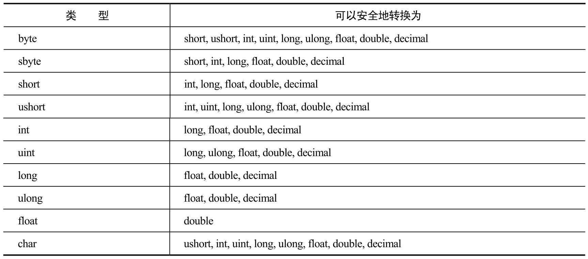
 任何类型A，只要其取值范围完全包含在类型B的取值范围内，就可以隐式转换为类型B。

- 显式转换：从类型A到类型B的转换只能在某些情况下进行，转换规则比较复杂，应进行某种类型的额外处理。
	- `(<destinationType>)<sourceVar>`
	- 把一个大整数放到一个太小的数值类型中，源数据的最左边一位丢失。

checked显式转换：

```c#
byte destinationVar; 
short sourceVar = 281; 
destinationVar = checked((byte)sourceVar); 
WriteLine($"sourceVar val: {sourceVar}"); 
WriteLine($"destinationVar val: {destinationVar}");
```

- 执行这段代码时，程序会崩溃.
- 用unchecked替代checked，就会得到与以前同样的结果，不会出现错误。

右键解决方案，可以设定本解决方案在构建时的算数校验规则：

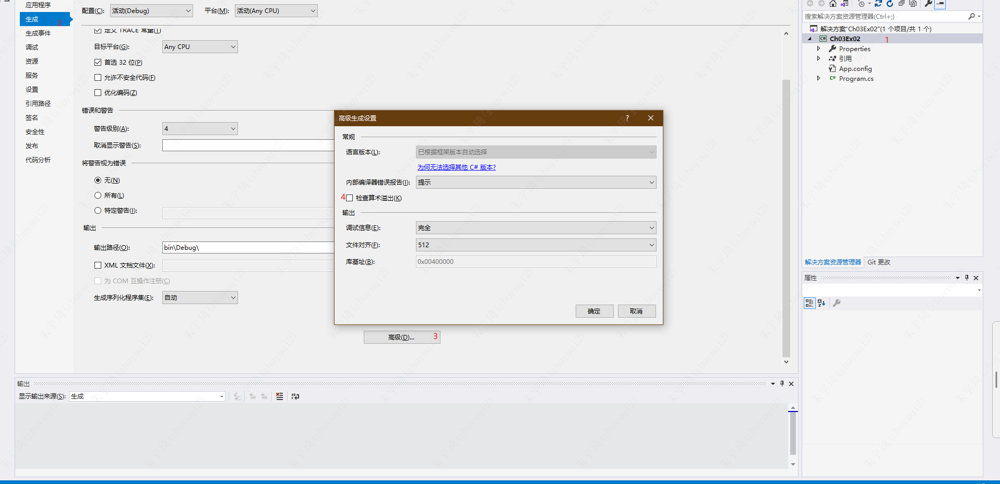

Convert.ToXXX()显式转换。

### 3.3 运算符

分类1：

- 数学运算符
- 赋值运算符
- 逻辑运算符

分类2：

- 一元运算符，处理一个操作数
- 二元运算符，处理两个操作数
- 三元运算符，处理三个操作数

#### 3.3.1 数学运算符

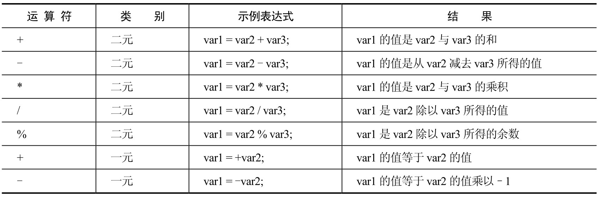
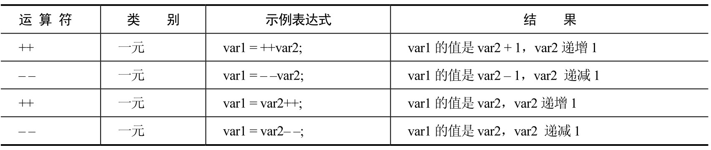

- `+`和`-`有二元和一元两种形式。
- `+` 的一元运算符不会对结果产生影响。如果var2是-1，则+var2仍是-1。
- `+` 的二元运算符对字符串操作表示字符串的拼接。其他数学运算符不能用于字符串操作。
- `char` 变量实际上存储的是数字，所以把两个char变量加在一起也会得到一个数字（其类型为int）——隐式转换。
- `++` 和 `--` 都是一元运算符，可以放在操作数的前面或后面。
	- 放在操作数的前面，则操作数是在进行任何其他计算前受到运算符的影响；
	- 放在操作数的后面，则操作数是在完成表达式的计算后受到运算符的影响。

#### 3.3.2 赋值运算符

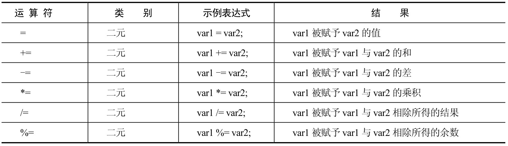

- `+=` 也可用于字符串操作。

#### 3.3.3 运算符优先级

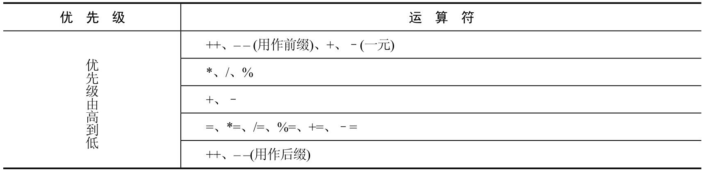

### 3.4 名称空间

名称空间：`.net` 中提供应用程序代码容器的方式。唯一标识代码及其内容。

- 默认情况下，C#代码包含在全局名称空间中，只要通过名称进行引用，就可以访问它们。
- 使用namespace关键字为花括号中的代码块显式定义名称空间。必须写出该名称空间中的限定名称。
- `using static`关键字可以添加名称空间的静态类，调用静态类的方法时，可以直接使用方法名。
	- 例如：`System.Console`静态类中的`System.Console.WriteLine()`方法，可以直接使用。而不是用`Console.WriteLine()`。

### 3.5 复杂变量类型

#### 3.5.1 枚举

取值范围是用户提供的值的有限集合。

定义：

```c#
enum <typename>
{
	<value1>;
	<value2>;
	...
	<valuen>;
}
```

如：

```c#
enum orientation : byte 
{ 
	north = 1, 
	south = 2, 
	east = 3, 
	west = 4 
} 
```

在枚举声明中添加类型，就可以指定其他基本类型：

```c#
enum <typeName> : <underlyingType> 
{ 
	<value1> = <actualVal1>, 
	... 
	<valueN> = <actualValN> 
}
```

枚举类型的值为基本类型，可取类型为byte、sbyte、short、ushort、int、uint、long和ulong，默认情况下该类型为int，未赋值的任何值都会自动获得一个初始值，默认值从0开始，依次递增。

```c#
enum <typeName> : <underlyingType> 
{ 
	<value1> = <actualVal1>, 
	<value2> = <value1>
	<value3>,
	... 
	<valueN> = <actualValN> 
}
```

面的代码中，`<value3>`的值是`<value1> + 1`。

声明：

```c#
<typename> <varname>
```

使用：

```c#
<varname> = <typename>.<value>
```

#### 3.5.2 结构

结构就是由几个数据组成的数据结构，这些数据可能具有不同的类型。

定义：

```c#
struct <typeName> 
{ 
	<accessibility> <type> <name> , <name2>;
}
```

调用结构的代码访问该结构的数据成员，可以对`<accessibility>`使用关键字public。

#### 3.5.3 数组

声明：`<baseType>[] <name>;`

初始化;

- 方式一：`int[] myIntArray = { 5, 9, 10, 2, 99 };`
- 方式二：`int[] myIntArray = new int[5];`
	- 这种方式会给所有数组元素赋予同一个默认值。
- 方式三（前两种的组合）：`int[] myIntArray = new int[5] { 5, 9, 10, 2, 99 };`
	- 数组大小必须与元素个数相匹配。
	- 如果使用变量定义其大小，该变量必须是一个常量。

遍历数组：

- 方式一：for循环。
- 方式二：foreach循环。
	- foreach循环对数组内容进行只读访问，所以不能改变任何元素的值。
	- 但如果使用简单的for循环，就可以给数组元素赋值。

```c#
static void Main(string[] args) 
{ 
	string[] friendNames = { "Todd Anthony", "Kevin Holton", "Shane Laigle" }; 
	WriteLine($"Here are {friendNames.Length} of my friends:");
	foreach (string friendName in friendNames) 
	{ 
		WriteLine(friendName); 
	} 
	ReadKey(); 
}
```

多维数组（矩形数组）：

多维数组只需要更多逗号，如四维数组：`<baseType>[, , , ] <name>;`

数组的数组（锯齿数组）：

锯齿数组（jagged array），其中每行的元素个数可能不同，每个元素都是另一个数组。

### 3.6 字符串处理

#### 3.6.1 char类型转换

string类型的变量可以看成char变量的只读数组。

```c#
string myString = "A string"; 
char myChar = myString[1];
char[] myChars = myString.ToCharArray();
```

#### 3.6.2 大小写转换

- `<string>.ToLower()`
- `<string>.ToUpper()`

#### 3.6.3 去除空格

- `<string>.Trim()`：去除前后
- `<string>.TrimStart()`：去除前
- `<string>.TrimEnd()`：去除后

也可以使用这些命令删除其他字符，只要在一个char数组中指定这些字符即可（将删除字符串前后的所有空格、字母e和s）：

```c#
char[] trimChars = {' ', 'e', 's'};
string userResponse = ReadLine(); 
userResponse = userResponse.ToLower();
userResponse = userResponse.Trim(trimChars); 
if (userResponse == "y") 
{ 
	// Act on response. 
}
```

#### 3.6.4 添加空格

在字符串的左边或右边添加空格（或指定字符），使字符串达到指定的长度。

- `<string>.PadRight(<desiredLength>);`
- `<string>.PadLeft(<desiredLength>);`
- `myString = myString.PadLeft(10, '-');`：在字符串开头添加确定数量的`-`。

## 4. 流程控制

### 4.1 布尔逻辑

#### 4.1.1 比较运算符

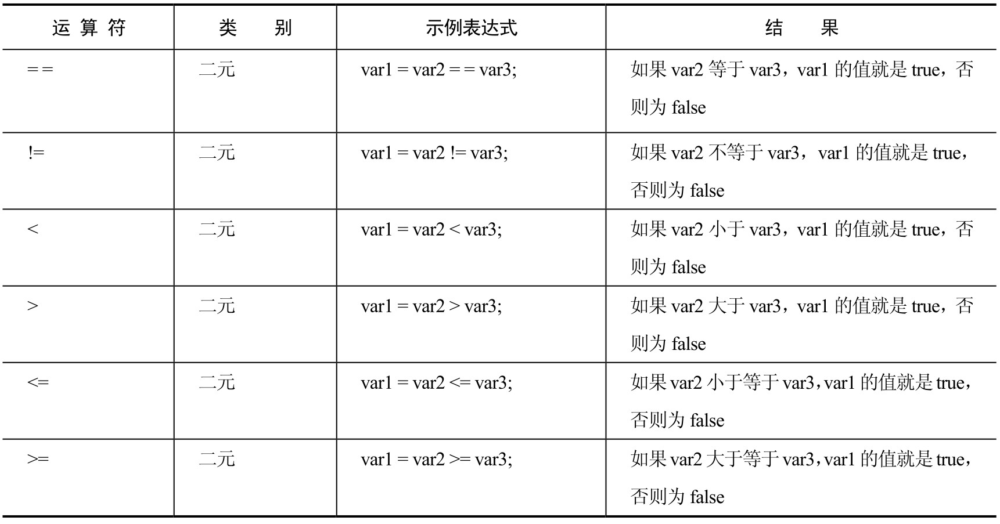

#### 4.1.2 条件布尔运算符

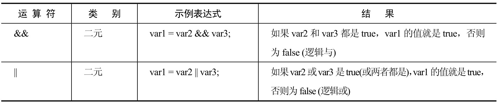

`|` 和 `&` 与上述条件布尔运算符作用一致，但上述布尔运算符性能更高。

#### 4.1.3 布尔赋值运算符

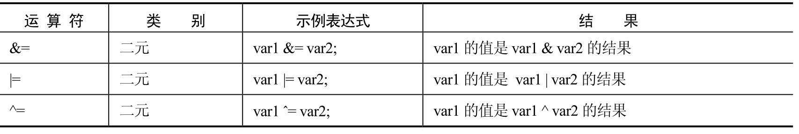

#### 4.1.4 运算符优先级

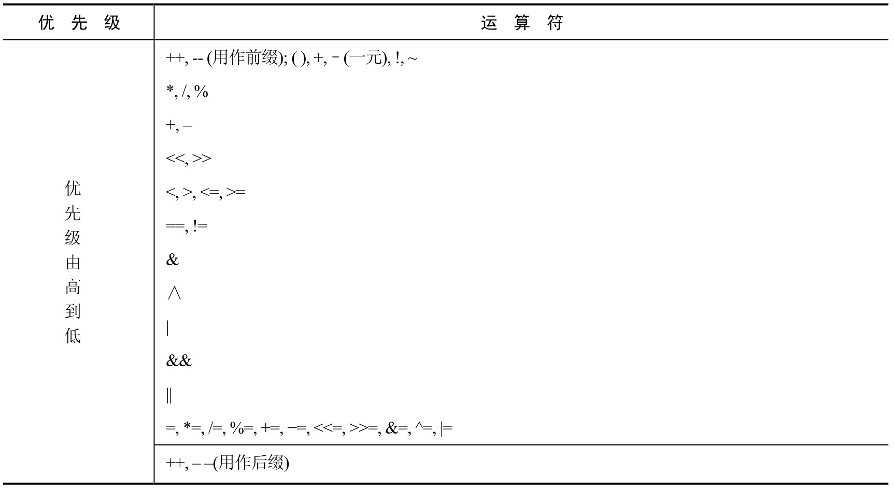

### 4.2 分支

#### 4.2.1 三元运算符

一元运算符有一个操作数，二元运算符有两个操作数，所以三元运算符有3个操作数。

`<test> ? <resultIfTrue> : <resultIfFalse`

#### 4.2.2 if语句

#### 4.2.3 switch语句

default语句不一定要放到最后。

防止从一个case转到下一个case：

- `break`
- `return`
- `goto`

### 4.3 循环

#### 4.3.1 do循环

```c#
do { 
	<code to be looped> 
} while (<Test>);
```

while语句之后必须使用分号。

#### 4.3.2 while循环

#### 4.3.3 for循环

#### 4.3.4 循环终端

- break—— 立即终止循环。
- continue——立即终止当前的循环（继续执行下一次循环）。
- return—— 跳出循环及包含该循环的函数。

## 5. 函数

### 5.1 函数的定义和使用

函数声明不用`function` 关键字。函数名一般用大驼峰方式命名。

#### 5.1.1 返回值

```c#
static <returnType> <FunctionName>() 
{
	...
	return <returnValue>; 
}
```

`<returnValue>`必须是`<returnType>`类型的值，或者可以隐式转换为该类型。

编译器会检查是否执行到return语句，如果没有，就给出错误“并不是所有的处理路径都返回一个值”。

表达式体方法：

```c#
static double Multiply(double myVal1, double myVal2) 
{ 
	return myVal1 ＊ myVal2; 
}
```

等价于：

```c#
static double Multiply(double myVal1, double myVal2) => mVal1 ＊ MyVal2;
```

#### 5.1.2 参数

形参是函数定义的一部分，而实参则由调用代码传递给函数。

1. 参数匹配：在调用函数时，必须使提供的参数与函数定义中指定的参数完全匹配，这意味着要匹配参数的类型、个数和顺序。
2. 参数数组：函数的特殊参数，允许调用时传入任意数量的参数（甚至0个）。该参数只能放到其他参数的末尾，是使用`params`声明的数组类型。

```c#
static <returnType> <FunctionName>(<p1Type> <p1Name>, ..., params <type>[] <name>) { 
	... return <returnValue>; 
}
```

3. 引用参数和值参数：

	- 值参数：在使用参数时，是把一个值传递给函数使用的一个变量。在函数中对此变量的任何修改都不影响函数调用中指定的参数。
	- 引用参数：函数处理的变量与函数调用中使用的变量相同，对这个变量进行的任何改变都会影响用作参数的变量值。使用`ref` 关键字，声明及调用时均需使用。

```c#
static void ShowDouble(ref int val) {
	val ＊= 2; 
	WriteLine($"val doubled = {val}"); 
}
```

4. 输出参数：`out` 关键字修饰的参数，函数执行完会修改该参数的值。声明及调用时均需使用。与`ref` 的区别在于：

	- `ref` 只能修饰已赋值的参数。

### 5.2 变量作用域

如果局部变量和全局变量同名，会屏蔽全局变量。

### 5.3 Main()函数

`Main()`是C#应用程序的入口点，执行这个函数就是执行应用程序。也就是说，在执行过程开始时，会执行`Main()`函数，在`Main()`函数执行完毕时，执行过程就结束了。

- 这个函数可以返回void或int。
- 执行控制台应用程序时，指定的任何命令行参数都放在这个args数组中
	- Debug页面，在Command line arguments设置中添加所希望的命令行参数：
	- 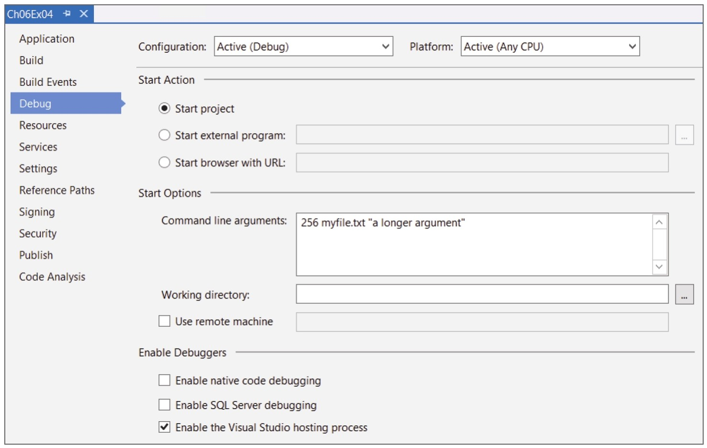
	- 在项目输出所在的目录`（C:\BegCSharp\Chapter06\Ch06Ex04\Ch06Ex04\bin\Debug）`下打开命令提示窗口，键入下述代码，也可以得到同样的结果：
		- `Ch06Ex04 256 myFile.txt "a longer argument"`
		- 每个参数都用空格分开。如果参数包含空格，就可以用双引号把参数括起来，这样才不会把这个参数解释为多个参数。

### 5.4 结构函数

```c#
struct CustomerName { 
	public string firstName, lastName; 
	public string Name() => firstName + " " + lastName; 
}

CustomerName myCustomer; 
myCustomer.firstName = "John"; 
myCustomer.lastName = "Franklin";
WriteLine(myCustomer.Name());
```

- 结构中的函数`static`关键字不是必须。
- 结构中的函数可以通过`结构名.函数名`调用，而不论函数有没有`static`修饰。
- 结构中的函数可以直接访问结构中的成员。

### 5.5 函数重载

函数重载允许创建多个同名函数，参数不同，每个函数可使用不同的参数类型。

函数的返回类型不是其签名的一部分，所以不能定义两个仅返回类型不同的函数。

### 5.6 委托

委托（delegate）是一种存储函数引用的类型。

委托的声明非常类似于函数，但不带函数体，且要使用delegate关键字。委托的声明指定了一个返回类型和一个参数列表。

```c#
class Program
{
  delegate double ProcessDelegate(double param1, double param2);
  static double Multiply(double param1, double param2) => param1 * param2;
  static double Divide(double param1, double param2) => param1 / param2;
  static void Main(string[] args)
  {
      ProcessDelegate process;
      WriteLine("Enter 2 numbers separated with a comma:");
      string input = ReadLine();
      int commaPos = input.IndexOf(', ');
      double param1 = ToDouble(input.Substring(0, commaPos));
      double param2 = ToDouble(input.Substring(commaPos + 1,input.Length - commaPos - 1));
      WriteLine("Enter M to multiply or D to divide:");
      input = ReadLine();
      if (input == "M")
        process = new ProcessDelegate(Multiply);
      else
        process = new ProcessDelegate(Divide);
      WriteLine($"Result: {process(param1, param2)}");
      ReadKey();
  }
}
```

声明部分：`delegate double ProcessDelegate(double param1, double param2);`

- 委托的参数类型和返回值类型和要被委托的函数（`Multiply()`和`Divide()`）的参数类型和返回值类型一致。
- 委托的参数名称可以与被委托的函数参数名称不一致。

使用部分：

- 使用前首先声明一个委托变量：`ProcessDelegate process;`
- new一个委托对象，参数使用被委托的函数名：`process = new ProcessDelegate(Multiply);`
	- 简化写法：`process = Multiply;`
- 调用函数：`process(param1, param2)`

## 6. 调试

