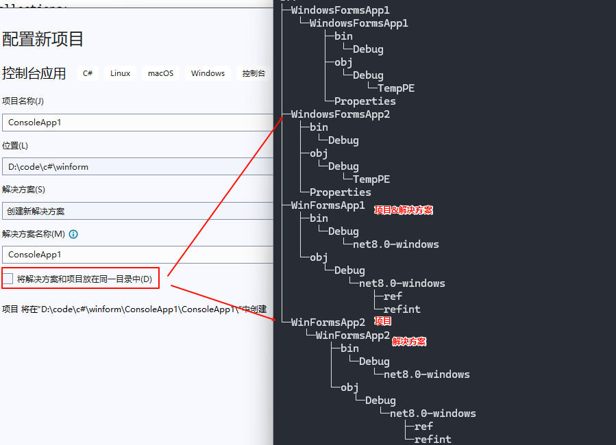
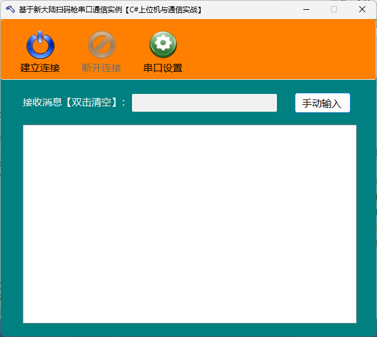
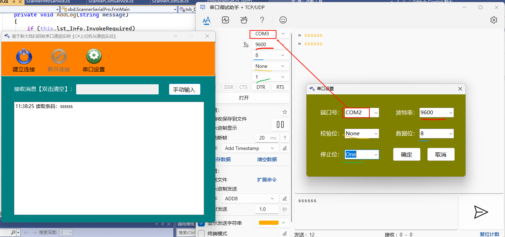
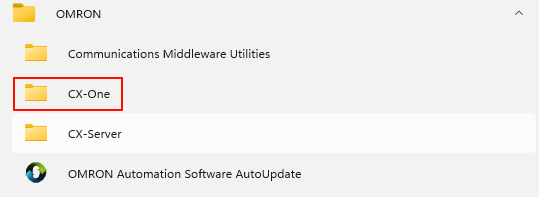
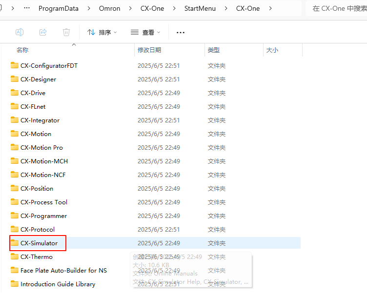
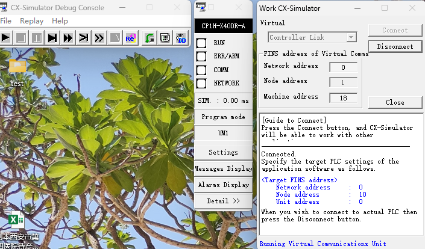

## 1. VS project和solution

## 2. 数据类型转换

## 3. 串口通讯

### 3.1 扫码枪通讯

### 3.2 欧姆龙通讯

1. 搭建欧姆龙模拟环境：

    - 开始菜单找到OMRON>CX-ONE
        - 
    - CX-ONE中找到CX-simulator
        - 
    - 根据书籍操作步骤创建虚拟plc，保存在默认位置，即cx-server文件夹下
        - 
        