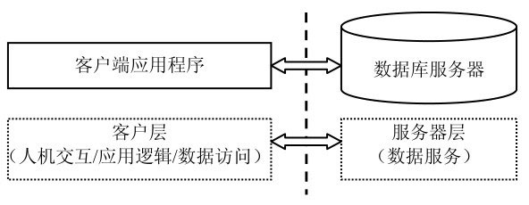
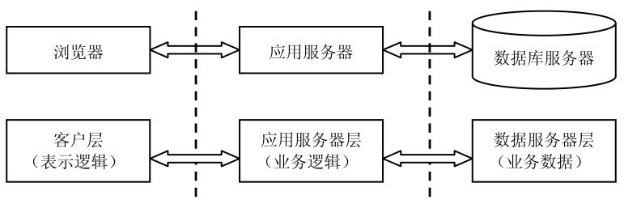
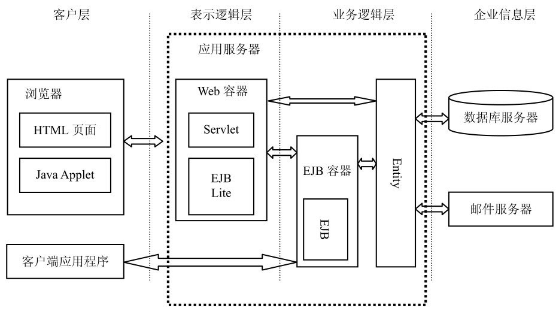
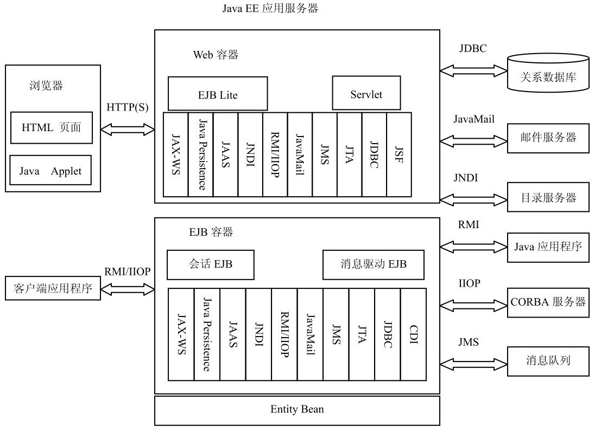
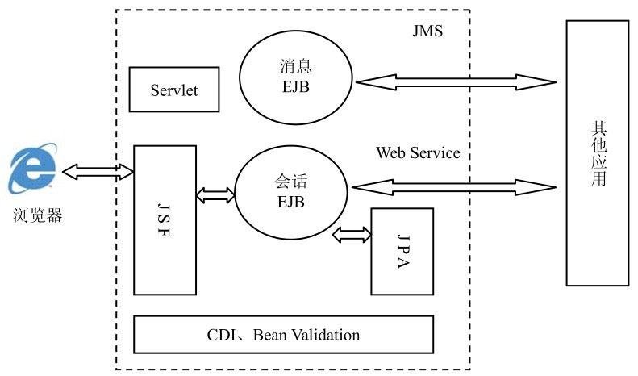
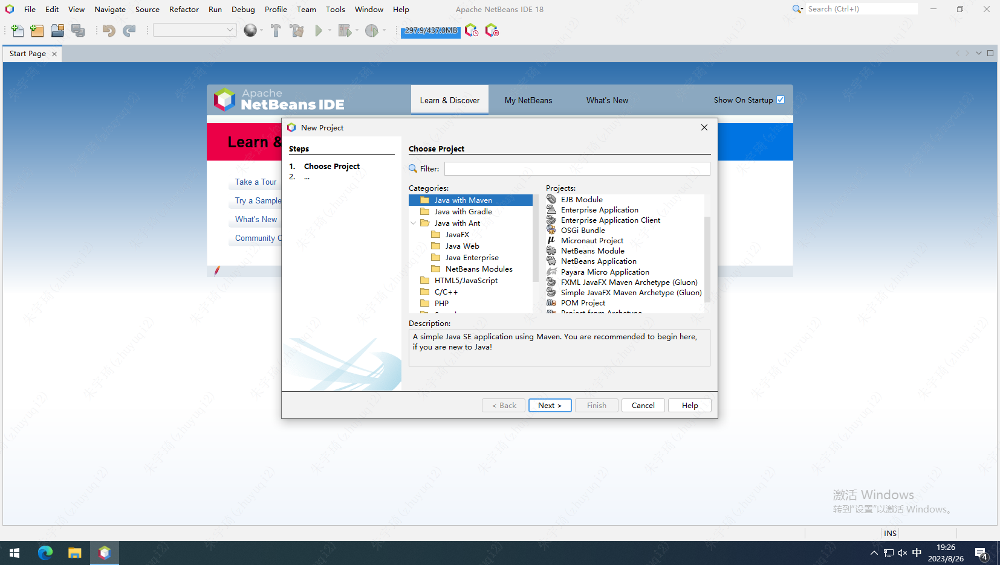

> [!note]
> 基于Java EE 6。

## 1. 走进Java EE

### 1.1 为什么需要Java EE

#### 1.1.1 企业级应用特征

Java EE是为了满足企业级应用开发而推出的。企业级应用具有以下特点：

- 多用户
- 分布式
- 连续性
- 多变性
- 可扩展性
- 安全性
- 集成化

#### 1.1.2 企业级应用架构体系

应用程序的体系结构是指应用程序内部各组件间的组织方式。企业级应用程序的体系结构的设计经历了从两层结构到三层结构、再到多层结构的演变过程。

**1. 两层体系结构应用程序**

两层体系结构应用程序分为客户层（Client）和服务器层（Server），因此又称为C/S模式。

在两层体系结构中，客户层的客户端程序负责实现人机交互、应用逻辑、数据访问等职能；服务器层由数据库服务器来实现，唯一职能是提供数据服务。

特点：

- 安全性低
- 部署困难
- 耗费系统资源

**2. 三层体系结构应用程序**

在两层体系结构应用程序的客户层与服务器层之间又添加了一个第三层——应用服务器层。

客户层功能大大减弱，只用来实现人机交互，原来由客户端实现的应用逻辑、数据访问职能都迁移到应用服务器层上来实现，因此客户层通常被称做“瘦客户层”。数据服务层仍旧仅提供数据信息服务。由于客户层应用程序通常是由一个通用的浏览器（Browser）程序来实现的，因此这种体系结构又被称做B/S模式或“瘦客户机”模式。应用服务器层是位

优点：

- 安全性高
- 易维护
- 快速响应
- 系统扩展灵活

**3. 多层体系结构应用程序**

中间件服务器层按照程序应用逻辑进一步划分为若干个子层。

### 1.2 什么是Java EE

#### 1.2.1 Java EE是一个企业级应用的架构体系

Java EE是一个企业级应用的架构体系，而不是一门编程语言。

Java EE作为一个架构体系，它定义了企业级应用的层次结构，旨在简化和规范企业应用系统的开发和部署。

典型的Java EE应用程序包括四层：客户层、表示逻辑层（Web层）、业务逻辑层和企业信息层：

#### 1.2.2 Java EE是一个企业级应用开发标准集

实现Java EE 6完整规范的应用服务器有Oracle的Weblogic 12c、IBM的Websphere V8，同时还有其他一些免费软件，如JBoss AS 7.1和GlassFish 3.1等。

Java EE规范只是一个标准集，它不定义组件和容器的具体实现。容器由第三方厂商来实现，通常被称为应用服务器。

### 1.3 Java EE设计思想

Java EE将企业级应用分为两部分：实现基础支撑功能的容器和实现特定业务逻辑的组件。

- 容器：
	- 容器提供的底层基础功能被称为服务。
		- 这些服务主要用来实现企业级应用的共性需求，如事务、安全、可扩展性和远程连接等。
	- 组件通过调用容器提供的标准服务来与外界交互。
	- 容器由专门的厂商来生产，容器必须实现的基本接口和功能由Java EE规范定义。
		- 常见的容器类型分为Web容器和EJB容器。
- 组件：
	- 组件一般由开发人员根据特定的业务需求编程实现。
	- 组件通过调用容器提供的标准服务来与外界交互。
		- 容器提供的标准服务有：命名服务、数据库连接、持久化、Java消息服务、事务支持和安全服务等。
- 容器与组件的交互方式：
	- 即容器如何知道要为组件提供何种服务、组件又是如何来获取容器提供的服务呢？
	- Java EE采用部署描述文件来解决这一难题。每个发布到服务器上的应用除了要包含自身实现的代码文件外，还要包括一个XML文件，称为部署描述文件。部署描述文件中详细地描述了应用中的组件所要调用的容器服务的名称、参数等。部署描述文件就像组件与容器间达成的一个“契约”，容器根据部署描述文件的内容为组件提供服务，组件根据部署文件中的内容来调用容器提供的服务。
	- Java EE6中，推出使用注解代替xml配置文件。
		- 在最新的Java EE 6规范中，还引入了一种“惯例优于配置”，也称为“仅异常才配置”的思想。通俗一点讲，就是对于Java EE组件的一些属性和行为，容器将按照一些约定俗成的惯例来自动进行配置，此时开发人员甚至连注解都可以省略。只有当组件的属性和行为不同于惯例时，才需要进行配置。

### 1.4 Java EE技术架构

Java EE技术框架可以分为四部分：组件技术、服务技术、通信技术和框架技术。

- 组件技术
	- 客户端组件
		- web浏览器
		- applet
		- 应用程序客户端
	- web组件
		- servlet
		- JSF（JavaServer Faces）
	- 业务组件
		- EJB组件：实现特定的业务逻辑
			- session bean（会话bean）组件
			- message-driven bean（消息驱动bean）
		- Entitiy组件：完成应用数据的持久化操作
- 服务技术：容器已经实现，Java EE组件可以直接调用。
	- JND（Java Naming and Directory Interface，Java命名和目录服务接口）：命名服务。简化组件中间的互相查找调用。
	- JDBC（Java DataBase Connectivity，Java数据库连接）：数据库连接服务。
	- JTA（Java Transaction API，Java事务API）：Java事务服务。
	- JAAS（Java Authentication Authorization Service，Java验证和授权服务）：安全服务。
	- JCA（Java Connector Architecture，Java连接框架）：Java连接框架。解决老企业系统与EJB容器和组件的集成。
	- CDI（Contexts and Dependency Injection）：上下文和依赖注入。将EJB等受控组件的生命周期交给容器管理。
- 通信技术：客户端与服务器之间、服务器不同组件之间的通信机制。
	- Internet协议：TCP/IP + HTTP + SSL3.0
	- RMI（Remote Method Invocation，远程方法调用）：结合了Java序列化（Java serialization）和Java远程方法协议（Java Remote Method Protocol）。RMI机制实现程序组件在不同操作系统之间的通信。比如，一个EJB可以通过RMI调用Web上另一台机器上的EJB远程方法
	- JMS（Java Message Service，Java消息服务）：允许Java EE应用程序访问企业消息系统，如IBM MQ系列产品和JBoss MQ。
	- Java Mail：邮件技术。
- 框架技术：
	- JSF（Java Server Faces）：构建Java EE Web应用表现层的框架标准）。
	- JPA（Java Persistence API）：持久层构建标准。

### 1.5 Java EE核心开发模式

- 表现逻辑层主要由JSF框架来承担，开发人员通过开发定制JSF组件来实现与用户的交互。
	- Servlet仅作为实现表现逻辑层的有力补充，用来处理一些复杂的客户端请求。
- 业务逻辑层主要由会话EJB组件来实现，它可充分利用EJB容器提供的安全、事务等基础服务，并基于JPA框架实现对持久化信息的管理操作。
- CDI作为Java EE企业应用的黏合剂，可实现应用内各层组件之间的松散耦合。
- Bean Validation为应用提供统一的校验框架。
- 为了实现与其他Web应用的交互，Java EE企业应用可利用Web Service，或JMS消息服务等技术。

### 1.6 Java EE体系架构的优点

1. 独立于硬件配置和操作系统。Java EE应用运行在JVM（Java Virtual Machine, Java虚拟机）上，利用Java本身的跨平台特性。
2. 坚持面向对象的设计原则。
3. 灵活性、可移植性和互操作性。
4. 轻松的企业信息系统集成。

Java EE 6中提出了Profile的概念。Profile是针对特定应用领域的一个技术规范子集，它剪切掉一些很少使用的技术，使得Java EE变得更加简洁，也便于开发商实现。

目前Java EE规范中支持的唯一一个Profile是Web Profile。例如Apache Tomcat就是仅实现Java EE 6 Web Profile的应用服务器。

另外，对于Java EE核心组件EJB提出了简化版本EJB Lite，使得EJB可以运行在Web容器中，大大促进了EJB的应用。

**总结：Java EE应用程序由组件组成，组件运行在容器中，容器为组件提供一些通用服务，如事务处理、安全认证等，组件专注于应用逻辑的实现，并通过调用容器提供的服务实现应用程序所需的功能。**

## 2. 搭建开发环境

NetBeans是Oracle为软件开发者提供的一个免费、开放源代码的集成开发环境。它为Java EE开发者创建企业应用程序提供了所需的全部工具。

Java EE编程属于服务器端应用的编程，因此Java EE程序的运行还需要一个应用服务器的支持。NetBeans IDE 7内置了开源的Java EE 6应用服务器GlassFish 3.1，它全面支持最新的Java EE 6规范，为开发人员部署和调试程序提供了一个良好的平台。

Eclipse也是一款优秀的Java开发环境，但是不内置Java EE应用服务器，而且需要安装各种插件来帮助开发Java EE应用，插件与Eclipse平台间还经常出现版本不兼容的问题。

最新版NetBwans版本为18，需要JDK11。界面如下：

## 3. 基于JSF构建表示逻辑层

Java EE将企业级应用分为客户层、表示逻辑层、业务逻辑层和企业信息层。其中表示逻辑层主要负责实现与用户的交互，即接收用户提交的请求信息并返回动态响应。

JSF是一种基于组件和事件驱动的Web应用框架。

### 3.1 