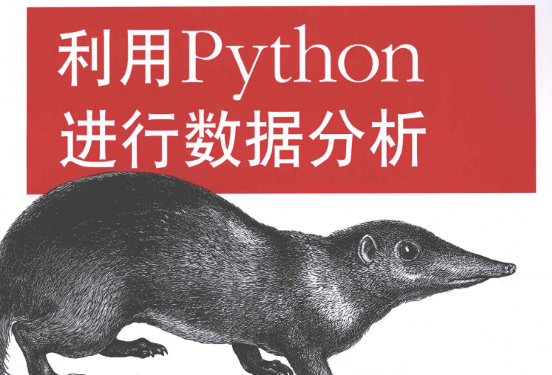
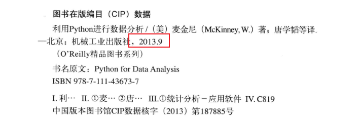
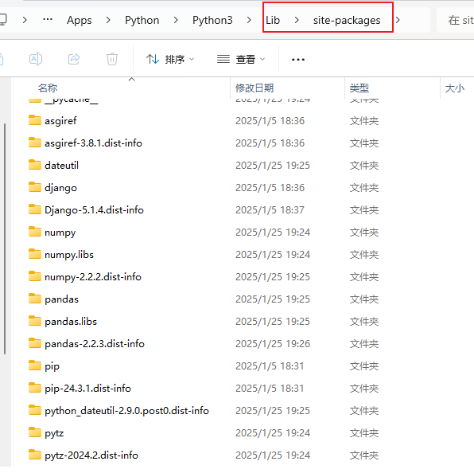
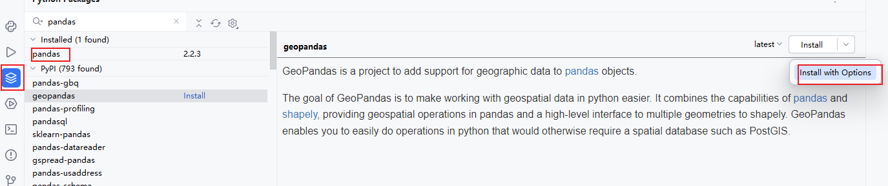
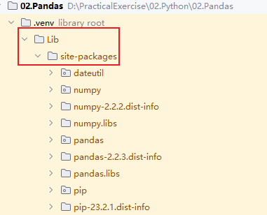

## 概览

### 基础知识

1. 书籍情况（第一版）：

	
	

2. 科学计算库：
	- Numpy：科学计算基础包，其他库的基础。
	- pandas：能够便捷处理结构化数据和函数。
	- matplotlib：绘制数据图表。
	- SciPy：解决科学计算中各种标准问题的包的集合。
		- 配合Numpy可以替代matlab的计算功能。
	- scikit-learn：通用机器学习工具包。
	- statsmodels：统计分析包。
3. 工具：
	- IPython：基于C语言的python解释器，由于输入输出使用In、Out显示，比较直观。
	- Jupyter
4. 集成环境（环境自带Python）：
	- Enthought Python Distribution： 已更名为Enthought Canopy
		- 包含EPDFree（包含Numpy，SciPy、matplotlib、Chaco、IPython）：个人免费，对应Enthought Canopy Express。
		- 包含EPD Full：对高校免费。
	- Python(x,y)
	- Anaconda【推荐】
5. 本书代码：[Github](http://github.com/pydata/pydata-book)
6. 惯例：

	```python
	import numpy as np
	import matplotlib.pyplot as plt
	import pandas as pd
	import seaborn as sns
	import statsmodels as sm
	```

7. 常用指令：
	- 安装python包：`conda install package_name`或`pip install package_name`
	- 升级python包：`conda update package_name`或`pip install --upgrade package_name`

### IPython基础

> 由于Jupyter基于Ipython，因此下述操作通用适用于Jupyter

#### Tab补全

1. 补全变量：

	```python
	In [1]: an_apple = 27
	In [2]: an_example = 42
	In [3]: an<Tab>
	an_apple    and         an_example  any
	```

2. 补全方法：

	```python
	In [3]: b = [1, 2, 3]
	In [4]: b.<Tab>
	b.append  b.count   b.insert  b.reverse
	b.clear   b.extend  b.pop     b.sort
	b.copy    b.index   b.remove
	```

3. 补全模块方法：

	```python
	In [1]: import datetime
	In [2]: datetime.<Tab>
	datetime.date          datetime.MAXYEAR       datetime.timedelta
	datetime.datetime      datetime.MINYEAR       datetime.timezone
	datetime.datetime_CAPI datetime.time          datetime.tzinfo
	```

4. 补全文件路径：

	```python
	In [7]: datasets/movielens/<Tab>
	datasets/movielens/movies.dat    datasets/movielens/README
	datasets/movielens/ratings.dat   datasets/movielens/users.dat
	```

> 默认情况下，IPython会隐藏下划线开头的方法和属性，比如魔术方法和内部的“私有”方法和属性，以避免混乱的显示（和让新手迷惑！）
> 这些也可以tab补全，但是你必须首先键入一个下划线才能看到它们。
> 如果你喜欢总是在tab补全中看到这样的方法，你可以IPython配置中进行设置。可以在IPython文档中查找方法。

#### 自省?

1. 变量后使用：

	```python
	In [8]: b = [1, 2, 3]
	In [9]: b?
	Type:       list
	String Form:[1, 2, 3]
	Length:     3
	Docstring:
	list() -> new empty list
	list(iterable) -> new list initialized from iterable's items
	```

2. 函数后使用显示函数文档注释：

	```python
	def add_numbers(a, b):
		"""
		Add two numbers together

		Returns
		-------
		the_sum : type of arguments
		"""
		return a + b
	
	add_numbers?

	Signature: add_numbers(a, b)
	Docstring:
	Add two numbers together

	Returns
	-------

	the_sum : type of arguments
	File:      <ipython-input-9-6a548a216e27>
	Type:      function
	```

3. 方法后使用两个??显示函数源码

	```python
	In [12]: add_numbers??

	Signature: add_numbers(a, b)
	Source:
	def add_numbers(a, b):
		"""
		Add two numbers together

		Returns
		-------
		the_sum : type of arguments
		"""
		return a + b
	File:      <ipython-input-9-6a548a216e27>
	Type:      function
	```

4. 结合通配符使用，搜索方法、属性：

	```python
	In [13]: np.*load*?

	np.**loader**
	np.load
	np.loads
	np.loadtxt
	np.pkgload
	```

#### %run

> In [14]: %run ipython_script_test.py

1. 可以执行外部的python文件（同`python xxx.py`)，同时，可以加载外部python文件的变量、函数等。

#### %cpaste和%paste

1. 作用：执行粘贴板的代码
2. 区别：%cpaste会给出提示

#### 魔术命令

1. IPython中的特殊命令，Python中没有。
2. 使用方法：在指令前添加%

## 安装pandas

使用清华镜像：

> `pip install pandas -i https://pypi.tuna.tsinghua.edu.cn/simple`

全局安装完后，会在python安装目录的Lib/site-packages目录下下载pandas相关的文件：



在pycharm中开发时，由于pycharm会自动创建.venv环境，这个环境里没有pandas，也不能使用全局的pandas，因此需要重新安装，方法如下：



直接安装会下载失败，按上述方法会打开参数窗口，输入：`-i https://pypi.tuna.tsinghua.edu.cn/simple`


安装成功后，会在.venv的Lib/site-packages目录下下载相关文件：



**检查安装是否成功：**

```python
import pandas as pd
pd.version__
```

*命令行终端和anaconda中可以直接使用`pd.__version__`输出，但在pycham等编辑器中必须使用print()*

## 读取数据

|数据类型|说明|pandas读取方法|
|-|-|-|
|csv、tsv、txt|用逗号、tab分割的纯文本文件|pd.read_csv|
|excel|xls或者xlsx文件|pd.read_excel|
|mysql|关系型数据库表|pd.read_sql|

## 数据结构

### Series

1. 类似一维数组的对象，但是有系统生成的索引。
2. 构建Series:
    - 通过list构建，使用默认索引：`ser_obj = pd.Series(range(10))`
3. 获取数据：`ser_obj.values`。数据类型是个<class 'numpy.ndarray'>
4. 获取索引：`ser_obj.index`
5. 查看数据：`ser_obj.head()`或`ser_obj.head(n)`
6. 通过索引获取数据：`ser_obj[index]`

### DataFrame

1. 类似二维数组的对象，既有行索引也有列索引。
2. 构建DataFrame:
    - 通过字典构建：`df = pd.DataFrame({'A': [1, 2, 3], 'B': [4, 5, 6]})`
3. 获取数据：`df.values`
4. 获取索引：`df.index` 和 `df.columns`
5. 查看数据：`df.head()` 或 `df.head(n)`
6. 通过索引获取数据：`df['A']` 或 `df.loc[index]`

### 数据操作

1. 数据选择：
    - 选择列：`df['A']`
    - 选择行：`df.loc[0]`
    - 选择特定位置的值：`df.loc[0, 'A']`
2. 数据过滤：
    - 条件过滤：`df[df['A'] > 1]`
3. 数据排序：
    - 按列排序：`df.sort_values(by='A')`
4. 数据统计：
    - 描述性统计：`df.describe()`
    - 计算均值：`df.mean()`
    - 计算标准差：`df.std()`

### 数据清洗

1. 处理缺失值：
    - 删除缺失值：`df.dropna()`
    - 填充缺失值：`df.fillna(value)`
2. 处理重复值：
    - 删除重复值：`df.drop_duplicates()`
3. 数据转换：
    - 替换值：`df.replace(old_value, new_value)`
    - 数据类型转换：`df['A'].astype(float)`

### 数据合并

1. 纵向合并：`pd.concat([df1, df2])`
2. 横向合并：`pd.merge(df1, df2, on='key')`

### 数据分组

1. 分组操作：`df.groupby('A').sum()`
2. 分组聚合：`df.groupby('A').agg({'B': 'sum', 'C': 'mean'})`

### 数据可视化

1. 绘制折线图：`df.plot()`
2. 绘制柱状图：`df.plot(kind='bar')`
3. 绘制散点图：`df.plot(kind='scatter', x='A', y='B')`

### 文件读写

1. 读取CSV文件：`df = pd.read_csv('file.csv')`
2. 写入CSV文件：`df.to_csv('file.csv', index=False)`
3. 读取Excel文件：`df = pd.read_excel('file.xlsx')`
4. 写入Excel文件：`df.to_excel('file.xlsx', index=False)`

### 其他常用操作

1. 重命名列：`df.rename(columns={'A': 'new_A'})`
2. 重置索引：`df.reset_index(drop=True)`
3. 设置索引：`df.set_index('A')`
4. 数据透视表：`df.pivot_table(values='B', index='A', columns='C', aggfunc='sum')`

### 总结

Pandas 是一个强大的数据处理工具，提供了丰富的数据结构和操作函数，能够高效地处理和分析数据。通过掌握 Series 和 DataFrame 的基本操作，以及数据清洗、合并、分组和可视化等高级功能，可以极大地提高数据处理的效率。
