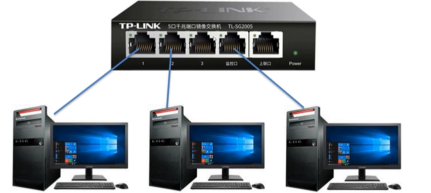
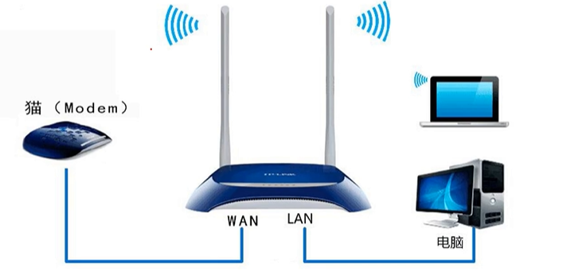
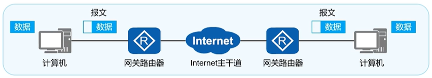

## ENSP

模拟企业级路由交换机的使用。

## 常见网络设备

1. 交换机
	- 无线设备（如手机）与交换机连接时，需要通过AP设备，AP设备与交换机（有线）连接
	- 
2. 路由器
	- 用来连接不同网络：如连通局域网与互联网
	- 

## 常见网路概念

1. Fast Ethernet 快速以太网
	- 快速以太网（Fast Ethernet）是一类新型的局域网，其名称中的“快速”是指数据速率可以达到100Mbps，是标准以太网的数据速率的十倍。
2. WAN（Wide Area Network） 广域网
	- 广域网（WAN），又称广域网、外网、公网。是连接不同地区局域网或城域网计算机通信的远程网。
	- 通常跨接很大的物理范围，所覆盖的范围从几十公里到几千公里，它能连接多个地区、城市和国家，或横跨几个洲并能提供远距离通信，形成国际性的远程网络。
	- 广域网并不等同于互联网。
3. LAN（Local Area Network）局域网
	- 局域网（LAN）是连接住宅、学校、实验室、大学校园或办公大楼等有限区域内计算机的计算机网络 。
	- 相比之下，广域网（WAN）不仅覆盖较大的地理距离，而且还通常涉及固接专线和对于互联网的链接。 
4. WLAN（Wireless LAN）无线局域网- 
	- 无线局域网（WLAN）是不使用任何导线或传输电缆连接的局域网，而使用无线电波或电场与磁场作为数据传送的介质，传送距离一般只有几十米。
5. SMTP
	- SMTP是一种提供可靠且有效的电子邮件传输的协议。SMTP是建立在FTP文件传输服务上的一种邮件服务，主要用于系统之间的邮件信息传递，并提供有关来信的通知。
	- 使用SMTP，可实现相同网络处理进程之间的邮件传输，也可通过中继器或网关实现某处理进程与其他网络之间的邮件传输。
6. VPN（Virtual Private Network）虚拟私人网络
	- 虚拟私人网络（VPN）是一种常用于连接中、大型企业或团体与团体间的私人网络的通讯方法。
	- 它利用隧道协议（Tunneling Protocol）来达到发送端认证、消息保密与准确性等功能。
7. ping
	- ping是一种计算机网络工具，用来测试数据包能否透过IP协议到达特定主机。
	- ping的运作原理是向目标主机传出一个ICMP的请求回显数据包，并等待接收回显回应数据包。程序会按时间和成功响应的次数估算丢失数据包率和数据包往返时间。
	- 网络管理员之间也常将ping用作动词，如“ping一下计算机XXX，看它是否开着。”
8. Packet Loss Rate 丢包率
	- 丢包率(Loss Tolerance或Packet Loss Rate)是指测试中所丢失数据包数量占所发送数据组的比率。
	- 计算方法：`(输入报文-输出报文)/输入报文*100%`
	- 丢包率与数据包长度以及包发送频率相关，通常，千兆网卡在流量大于200Mbps时,丢包率小于万分之五；百兆网卡在流量大于60Mbps时，丢包率小于万分之一，通常在吞吐量范围内测试。
9. Round-trip delay time 网络时延
	- 网络时延是指一个报文或分组从一个网络的一端传送到另一个端所需要的时间。
	- 它包括了发送时延，传播时延，处理时延，排队时延。（时延=发送时延+传播时延+处理时延+排队时延）
	- 一般，发送时延与传播时延是我们主要考虑的。对于报文长度较大的情况，发送时延是主要矛盾；报文长度较小的情况，传播时延是主要矛盾。
10. CDN（content distributed network）内容分发网络
	- CDN管理分布在多个地理位置上的服务器，在它的服务器中存储视频的副本，并且试图将所有用户请求定向到一个将提供最好的用户体验的CDN位置。
	- CDN可以是专用CDN，即它由内容提供商自己所有；也可以是第三方CDN。
11. CSMA/CD协议
	- CSMA/CD协议，又叫做载波监听多点接入/碰撞检测协议。这是一种在广播信道中（也就是总线型网络）一种典型的协调多个用户使用广播信道的协议。该协议的实质也就是“载波监听”（发送前先监听）和“碰撞检测”（边发送边监听）。
12. CRS（Carrier Sense）载波侦测信号
	- 不需要同步于参考时钟，只要有数据传输，CRS就有效，另外，CRS只有PHY在半双工模式下有效；（PHY是物理层，半双工可以理解为传输模式） 
13. COL（Collision Detectd）冲突检测信号
	- 不需要同步于参考时钟，只有PHY在半双工模式下有效。 
14. ACL（Access Control List）访问控制列表
	- ACL使用包过滤技术，在路由器上读取第三层及第四层包头中的信息如源地址、目的地址、源端口、目的端口等，根据预先定义好的规则对包进行过滤，从而达到访问控制的目的。
	- ACL的主要功能就是一方面保护资源节点，阻止非法用户对资源节点的访问，另一方面限制特定的用户节点所能具备的访问权限。

15. IGMP协议（Internet Group Management Protocol）
	- IGMPInternet组管理协议，主要功能是提供internet网际多点。
	- IGMP传送的功能，就是将一个ip包拷贝给多个host。受到IGMP攻击的症状是首先出现蓝屏，然后网速变得极慢，有的甚至鼠标，键盘均不管用，非得重启不可。

## 网络通信原理

### IP地址

概念：在网路中用于标识一个节点（或者网络设备的接口）。
作用：用于IP报文在网络中寻址。
组成：网络位+主机位。
- 前面部分表示网络位，一致表示在同一个网段。
- 子网掩码决定网络位的长度。
	- 如`255.255.255.0`表示IP地址的前3位表示网络位。
	- 如`255.255.0.0`表示IP地址的前2位表示网络位。
- DHCP：自动给手机、电脑配置IP地址。

### 路由技术

### DNS域名解析