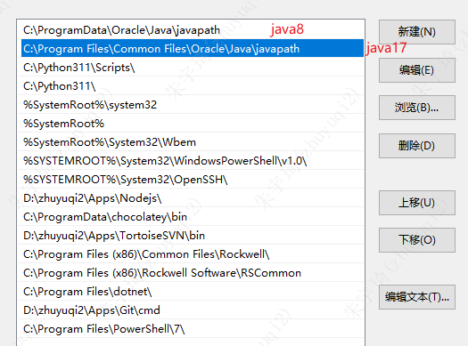
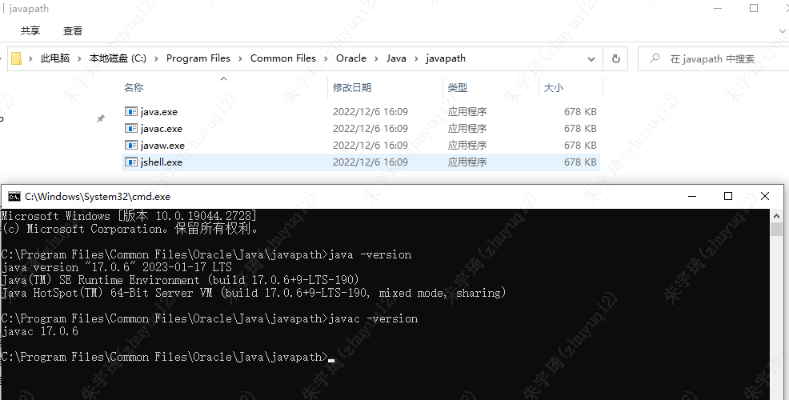
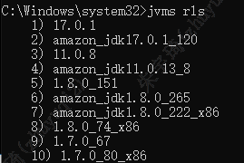
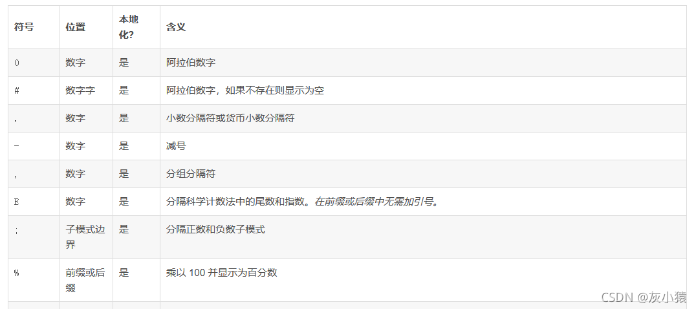

## 多环境配置

以java8和java17为例，先安装java17、后安装java8。

### 方式一

java8和java17都会自动添加环境变量，并将bin目录下的部分`exe`文件拷贝至该目录，默认运行的为为后安装的软件版本，因为后安装的环境变量配置在先安装上面。






**1. 调整环境变量的顺序即可变更默认运行的java版本。**
**2. 进入相应的路径打开终端执行也可运行相应的版本。**

但是无论哪种操作方式，执行`javac -version`命令，总是执行的高版本Java命令（低版本不会拷贝`javac.exe`到默认环境变量的地址中），。只安装一个版本的java时，运行的版本与`java -version`一致。

### 方式二

下载jvms：https://github.com/ystyle/jvms


管理员身份运行：`.\jvms.exe init`


默认的设置`JAVA_HOME`路径：`C:\Program Files (x86)/jdk`

显示可安装的远程java版本：`jvms rls`



安装java：`jvms install 1.8.0_151`

显示本地安装的java版本：`jvms ls`


切换不同版本java：`jvms switch 1.8.0_31`

停用jvms：卸载jdk、删除环境变量的JAVA_HOME、Path中的jdk路径即可。

### 方式三

个人最佳：默认安装高版本，手动配置环境变量低版本

## 注意事项

### 数据类型转换

转换为包装类：

- `static Float valueOf(float f)`
- `static Float valueOf(String s)`

转换为基本数据类型：

- `static float parseFloat(String s)`
- `float floatValue()`。需要`Float`的包装类调用，`float`数调用会报错。

总结：

- `valueOf()`能转换符合格式的string和当前类。
- `parseXxxx()`只能转换符合格式的string类。

```java
public class App {
    public static void main(String[] args) throws Exception {
        String num = "3.0";
        long nums = Long.valueOf(num);
        System.out.print(nums);
    }
}
```

```bash
Exception in thread "main" java.lang.NumberFormatException: For input string: "3.0"
        at java.base/java.lang.NumberFormatException.forInputString(NumberFormatException.java:67)
        at java.base/java.lang.Long.parseLong(Long.java:711)
        at java.base/java.lang.Long.valueOf(Long.java:1163)
        at App.main(App.java:8)
```

### 空数组访问索引会报错

```java
public class App {
    public static void main(String[] args) throws Exception {
        int a[] = {};
        System.out.println(a[0]);
    }
}
```

```bash
Exception in thread "main" java.lang.ArrayIndexOutOfBoundsException: Index 0 out of bounds for length 0
        at App.main(App.java:4)
```

### 浮点数定义不定义精度

```java
public class App {
    public static void main(String[] args) throws Exception {
        double a = 0.0;
        a = 8.25917283 - 2.03849 - 3;//3.220682830000001
        // a = 8.2 - 2.3 -3;//2.8999999999999995
        System.out.println(a);
    }
}
```

### 浮点数保留小数

#### 方式一：`String.format()`

步骤：
1. 将浮点数转为`String`。
2. 使用`String.format()`处理数据。
3. 调用`Float`的`parseFloat`或`valueOf()`方法转换为浮点数

结果：四舍五入。

```java
public class App {
    public static void main(String[] args) throws Exception {
        float f1 = 456.125f;
        String s = String.format("%.2f", f1);
        System.out.println(f1);//456.125
        System.out.println(s);//456.13
        float f2 = Float.valueOf(s); 
        System.out.println(f2);//456.13
        float f3 = Float.parseFloat(s);
        System.out.println(f3);//456.13
    }
}
```

#### 方式二：`s.subString()`

步骤：
1. 将浮点数转为`String`。
2. 使用`String.format()`处理数据。
3. 调用`Float`的`parseFloat`或`valueOf()`方法转换为浮点数。

结果：直接舍去

```java
public class App {
    public static void main(String[] args) throws Exception {
        float f1 = 456.125f;
        String s = f1 + "";
        float f2 = Float.valueOf(s.substring(0,s.indexOf(".")+2));
        float f3 = Float.parseFloat(s.substring(0,s.indexOf(".")+2));
        System.out.println(f2);//456.1
        System.out.println(f3);//456.1
    }
}
```


#### 方式三：`DecimalFormat`

步骤：
1. 引入`java.text.DecimalFormat`。
2. 创建`DecimalFormat`对象，指定格式化格式。
3. 调用`DecimalFormat`对象的`format()`，得到`String`。
4. 调用`Float`的`parseFloat`或`valueOf()`方法转换为浮点数。

结果：直接舍去

```java
import java.text.DecimalFormat;

public class App {
    public static void main(String[] args) throws Exception {
        float f1 = 456.125f;
        DecimalFormat decimalFormat = new DecimalFormat("#.00");
        String ans_3 = decimalFormat.format(f1);
        System.out.println(ans_3);//456.12
        float f2 = Float.valueOf(ans_3);
        float f3 = Float.parseFloat(ans_3);
        System.out.println(f2);//456.12
        System.out.println(f3);//456.12
    }
}
```

知识点：
1. `DecimalFormat`是`NumberFormat`的一个子类，专门用于格式化十进制数据。
2. 格式化格式：

3. `#`的用法，对于`new DecimalFormat("#.00")`：
	- `String ans_3 = decimalFormat.format(456.125);`得到`456.12`
	- `String ans_3 = decimalFormat.format(0.125);`得到`.12`

#### 方式四：`NumberForamt`

步骤：
1. 引入`java.text.NumberFormat`。
2. 引入`java.math.RoundingMode`。
3. 调用`NumberForamt`的`getNumberInstance()`方法，创建`NumberForamt`实例。
4. 调用`NumberForamt`实例对象的`setMaximumFractionDigits()`方法，指定小数位数。
5. 调用`NumberForamt`实例对象的`setRoundingMode()`方法，指定多余小数处理方式。
6. 调用`NumberForamt`实例对象的`format()`方法，得到`String`。
7. 调用`Float`的`parseFloat`或`valueOf()`方法转换为浮点数。

结果：根据指定方式处理小数。本例四舍五入。

```java
import java.math.RoundingMode;
import java.text.NumberFormat;

public class App {
    public static void main(String[] args) throws Exception {
        float f1 = 456.125f;
        NumberFormat numberInstance = NumberFormat.getNumberInstance();
        // 设置最大小数点位数
        numberInstance.setMaximumFractionDigits(2);
        // 设置数据舍入类型
        numberInstance.setRoundingMode(RoundingMode.HALF_UP);
        String ans_3 = numberInstance.format(f1);
        float f2 = Float.valueOf(ans_3);
        float f3 = Float.parseFloat(ans_3);
        System.out.println(f2);// 456.13
        System.out.println(f3);// 456.13
    }
}
```

#### 方式五：`DecimalFormat`

步骤：
1. 引入`java.math.BigDecimal`。
2. 创建`BigDecimal`实例。
3. 调用`BigDecimal`实例对象的`setScale()`方法，指定小数位数和多余位数处理方式。在调用`floatValue()`方法的到`float`。

结果：根据指定方式处理小数。本例四舍五入。

```java
import java.math.BigDecimal;

public class App {
    public static void main(String[] args) throws Exception {
        float f1 = 456.125f;
        BigDecimal bigDecimal = new BigDecimal(f1);
        float ans_3 = bigDecimal.setScale(2, BigDecimal.ROUND_HALF_UP).floatValue();
        System.out.println(ans_3);//456.13
    }
}
```

## 常用开发

### 定时服务

[在Java Web项目中添加定时任务 - 东窗凝残月 - 博客园 (cnblogs.com)](https://www.cnblogs.com/dcncy/p/8205065.html)