*本文介绍了Java语言的高级特性，如多线程、集合、泛型、IO流等，开发中最常使用；网络编程介绍了Java语言如何进行网络通信，是Javaweb开发的基础，企业开发中可能封装成了各种工具使用；反射介绍了Java的反射原理和作用，是理解各种Java框架的基础。*
<!-- more -->
## 第 8 章 多线程基础

### 8.1 基本概念

#### 8.1.1 程序、进程、线程

1. 程序（program）：完成特定任务、用某种语言编写的指令集合。是一段静态的代码。
2. 进程（process）：程序的一次执行过程，或者正在运行的一个程序。
   - 进程是系统分配资源的基本单位，根据进程执行的生命周期，系统会为不同时期的进程分配不同的内存空间。
3. 线程（thread）：程序内部的一条执行路径，一个进程可以含有多个进程。
   - 如果一个进程可以**并行** 执行多个线程，则进程支持多线程。
   - 每个线程拥有独立的运行栈和程序计数器。
   - 同一进程的多个线程共享相同的堆空间（对象、属性共享）、方法区，优点是线程间通信更便捷、高效，但多个线程同时操作公共资源会有安全隐患。
4. Java 中线程的分类（区别在于 JVM 何时离开）：
   - 守护线程：服务用户线程，通过在 start()方法前调用`thread.setDaemon(true)`可以把一个用户线程变成守护线程。
     - 垃圾回收是一个典型的守护线程
     - JVM 中都是守护线程时，JVM 就会退出。
   - 用户线程：

#### 8.1.2 单核、多核

1. 单核：CPU 仅有一个核心数，同一时间内，只能执行一个线程任务。执行多个线程时，采取的是不断切换线程的方式。
   - 由于 CPU 频率高、线程切换时间短，让人感觉”同时“执行了多个线程
2. 多核：CPU 有多个核心，每个核心可以执行一个线程。
3. java.exe：一个 Java 运行程序至少有 3 个线程：
   - main()：主线程
   - gc()：垃圾回收线程
   - 异常处理线程：发生异常时，会影响主线程。

#### 8.1.3 并行、并发

1. 并行：多个 CPU 执行多个任务。
2. 并发：一个 CPU 同时执行多个任务。

### 8.2 创建多线程

#### 8.1 方式一：继承 Thread 类

1. 创建步骤：
   - 资源类继承 Thread 类
   - 资源类中重写 Thread 类中 run()方法
   - 创建 Thread 子类对象
     - 创建一个对象即代表开启一个线程，要开启多个该线程，需要创建多个该对象。
   - 调用子类对象的 start()方法。
2. 注意点：
   - 使用 Tread 子类对象直接调用`run()`方法不会开启分支线程，它表示在 main 线程内，调用了 Thread 子类对象的方法。
   - 使用 Thread 子类对象调用`start()`方法会开启一个线程，开启线程后`run()`方法何时执行全由 CPU 调度决定，即 main 线程和分支线程中的语句执行具有随机性。
   - 一个实例化的 Thread 子类对象只能调用一次`star()`方法，重复调用时，会抛出异常：IllegalThreadStateException。
   - 一般不采用此方法，因为 Java 的单继承性，导致代码扩展受限。
3. 常用方法：
   - `start()`：启动当前线程；调用当前线程的 run()方法
   - `run()`：通常需要重写 Thread 类中的此方法，将创建的线程要执行的操作声明在此方法中
   - `currentThread()`：静态方法，返回执行当前代码的线程
   - `getName()`：获取当前线程的名字
   - `setName("str")`：设置当前线程的名字
   - `yield()`：释放调用线程在 cpu 中的执行权，后续执行哪个线程由 CPU 确定，有可能还是这个线程。当前进程进入就绪状态。
   - `join()`：在线程 a 中调用线程 b 的 join()，此时线程 a 就进入阻塞状态，直到线程 b 完全执行完以后，线程 a 才结束阻塞状态。
     - 有异常问题，可以根据使用位置进行 throws 或 try-catch 处理。
   - ~~`stop()`~~：已过时。当执行此方法时，强制结束当前线程。
   - `sleep(long millitime)`：让当前线程“睡眠”指定的 millitime 毫秒。在指定的 millitime 毫秒时间内，当前线程是阻塞状态。
     - 有异常问题，由于该方法使用在`run()`方法中，而`run()`方法是对父类 Thread 中`run()`方法的重写，且 Thread 中`run()`方法没有抛出异常，根据继承的特性（子类的异常不大于父类），所以子类的`run()`方法不能抛出异常，只能由 try-catch 处置。
   - `isAlive()`：判断当前线程是否存活。
4. 线程优先级：
   - 等级：
     - `MAX_PRIORITY`：10
     - `MIN _PRIORITY`：1
     - `NORM_PRIORITY`：5 （默认等级）
   - 方法：
     - `getPriority()`：返回线程优先等级
     - `setPriority(int num)`：设置有限等级
   - 注意点：设置了高等级的优先级，并不代表一定执行完该线程后执行其他线程，而是提高了 CPU 执行该线程的概率而已。
5. Thread 类构造器
   - `Thread()`：
   - `Thread(String threadname`)：创建指定名称的线程
     - 搭配`super(threadname)`才能在 getName()时获得名字
   - `Thread(Runnable target)`：
   - `Thread(Runnable target, String name)`： （通常使用此方法创建线程对象）

#### 8.2.2 方式二：实现 Runnable 接口

1. 创建步骤：
   - 定义类，实现 Runnable 接口。
   - 实现类中实现 Runnable 接口中的 run 方法
   - 创建实现类对象
   - 创建 Thread 类对象，将实现类对象作为参数传入。
   - 使用 Thread 类的对象调用`start()`方法。
2. 两种方式比较：
   - 相同点：
     - 实现类（继承类）都需要重写`run()`
     - 都具有线程安全问题
   - 不同点：
     - 方式二没有单继承的局限性
     - 方式二更适合多个线程共享数据（数据只有一份）的情况
   - 开发中优先选择方式二

#### 8.2.3 方式三：实现 Callable 接口

1. 创建步骤：
   - 创建一个实现 Callable 的实现类
   - 实现 call 方法，将此线程需要执行的操作声明在 call()中
   - 创建 Callable 接口实现类的对象
   - 创建 FutureTask 的对象，将此 Callable 接口实现类的对象作为传递到 FutureTask 构造器中
   - 创建 Thread 对象，将 FutureTask 的对象作为参数传递到 Thread 类的构造器中，Thread 的对象调用 start()
   - FutureTask 的实例对象调用 get()方法，获取重写 call 方法的返回值。
2. Callable 的优点：
   - call()可以返回值的。
   - call()可以抛出异常，被外面的操作捕获，获取异常的信息。
   - Callable 是支持泛型

#### 8.2.4 方式四：使用线程池（ThreadPool）

1. 创建步骤：
   - 提供指定线程数量的线程池：`ExecutorService service = Executors.newFixedThreadPool(10);`
     - `service1.setCorePoolSize(15)`
     - `service1.setKeepAliveTime()`
   - 执行指定的线程的操作。需要提供实现 Runnable 接口或 Callable 接口实现类的对象
     - `service.execute(Runnable runable)`
     - `service.submit(Callable callable)`
   - 关闭连接池：`service.shutdown()`
2. 优点：
   - 提高响应速度（减少了创建新线程的时间）
   - 降低资源消耗（重复利用线程池中线程，不需要每次都创建）
   - 便于线程管理：
     - corePoolSize：核心池的大小
     - maximumPoolSize：最大线程数
     - keepAliveTime：线程没任务时最多保持多长时间后会终止

### 8.3 线程的生命周期

1. 新建：
   - 继承方式（方式一）：Thread 类子类的对象被创建。
   - 实现方式（方式二）：Thread 类声明并创建。
2. 就绪：处于新建状态的线程调用 start()后，将进入线程队列等待 CPU 时间片，此时它已具备了运行的条件，只是没分配到 CPU 资源
3. 运行：当就绪的线程被调度并获得 CPU 资源时,便进入运行状态。
4. 阻塞：线程被人为挂起或执行输入输出操作时，会让出 CPU 资源，并临时中止自己的执行，即进入阻塞状态。
   - 阻塞时临时状态，不可以作为最终状态。
5. 死亡：线程完成了它的全部工作、线程被提前强制性地中止、出现异常导致结束。
   - 死亡是线程的最终状态。

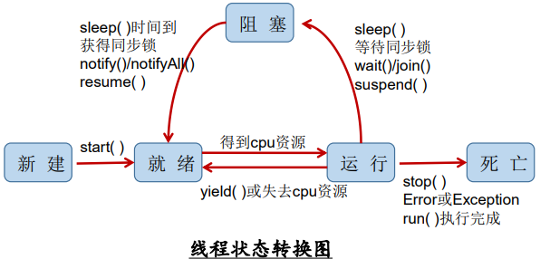

### 8.4 线程安全

#### 5.4.1 线程安全问题——同步机制

1. 线程安全问题：未处理的多线程任务在处理共享数据时，会造成数据破坏（重复数据、缺失数据、数据超范围等）。
   - 原因：处理共享数据的情况时，一个线程多条语句只执行了一部分，未处理完时，另一个线程参与进来，也要处理共享数据，造成共享数据错误。
   - 解决办法：单线程处理数据，执行完后再让其他线程参与——**同步机制**。
   - 解决原理：给共享资源加锁，第一个访问资源的线程进行资源锁定，在解锁之前其他线程无法访问，解锁之后，其他线程可以锁定并使用。

#### 8.4.2 Synchronized 处理线程安全问题

1. Synchronized（同步）语法：
   - 同步代码块：`synchronized(同步监视器){}`
   - 同步方法：`public synchronized void show(){}`
2. Synchronized 细节：
   - 同步监视器必须唯一。
   - 同步代码块：同步监视器可设置为`类名.class`、`this`、任一对象（静态或非静态），取决于是否唯一。
   - 同步方法：静态方法同步监视器默认为`类名.class`，非静态方法同步监视器默认为`this`
3. 同步监视器一般情况：
   - 在实现 Runnable 接口创建多线程的方式中，可以考虑使用 this 充当同步监视器。
   - 在继承 Thread 类创建多线程的方式中，慎用 this 充当同步监视器，考虑使用当前类充当同步监视器。

#### 8.4.3 死锁及 lock 处理线程安全问题

1. 死锁：不同的线程分别占用对方需要的同步资源不放弃，都在等待对方放弃自己需要的同步资源。
   - 出现死锁后，不会出现异常、不会出现提示、程序也不会运行，处于阻塞状态，无法继续。
2. Lock（JDK5.0 新增）：
   - 引入`java.util.concurrent.locks.ReentrantLock;`包
     - `java.util.concurrent.locks.Lock`接口是控制多个线程对共享资源进行访问的工具。
     - `ReentrantLock`类实现了 Lock。
   - 创建`ReentrantLock`对象：`private ReentrantLock lock = new ReenTrantLock();`
     - 根据对象是否唯一（lock 是否唯一），可以在声明时使用 static、或 static final 修饰。
   - 在出现共享资源操作的代码前调用`lock()`方法
   - 在结束共享资源操作的代码后调用`unlock()`方法
     - 如果操作资源共享的代码需要使用 try 包裹，则必须把`unlock()`写入 finally 语句块，`lock()`则不是必须要写入 try 中
3. synchronized 与 Lock 的异同：
   - 相同：二者都可以解决线程安全问题
   - 不同：
     - synchronized 机制在执行完相应的同步代码以后，自动的释放同步监视器。
     - Lock 需要手动的启动同步，同时结束同步也需要手动的实现。
4. 使用的优先顺序：Lock ---> 同步代码块（已经进入了方法体，分配了相应资源 ) --->同步方法（在方法体之外)
   - 同步代码块包裹的共享资源操作代码可以更小。

#### 8.4.4 同步的深入理解

1. 同步的范围：
   - 确定同步代码范围时，要将所有操作共享数据的语句包裹在内。
   - 范围太大：操作数据的语句变为单线程的，没有发挥多线程的功能。
   - 范围太小：操作共享数据的语句由遗漏，同步不起作用。
2. 同步的问题：
   - 优点：解决了线程安全的问题。
   - 缺点：操作同步代码时，只有一个线程运行，其他线程等待，相当于单线程过程，效率低。
3. 释放锁的操作：
   - 同步方法、同步代码块执行结束
   - 同步方法、同步代码块中遇到 break、return
   - 同步方法、同步代码块中出现未处理的 Error 或 Exception
   - 同步方法、同步代码块中执行了线程对象的`wait()`
4. 不会释放锁的操作:
   - 同步方法、同步代码块中调用`Thread.sleep()`、`Thread.yield()`方法暂停当前线程的执行
   - 其他线程调用了当前执行线程的`suspend()`方法将该线程挂起。
     - 应尽量避免使用`suspend()`和`resume()`控制线程。
5. 线程安全的懒汉式单例模式
   ```java
   class Singleton {
      private static Singleton instance = null;
      private Singleton() {    }
      //  1. 方式一
      public static Singleton getInstance() {
         if (instance == null) {
               synchronized (Singleton.class) {
                  if (instance == null) {
                     instance = new Singleton();
                  }
               }
         }
         return instance;
      }
      //  2. 方式二
      public static Singleton getInstance() {
         synchronized (Singleton.class) {
               if (instance == null) {
                  instance = new Singleton();
               }
         }
         return instance;
      }
   }
   ```
   - 方式一效率优于方式二，假如有 n 个线程需要创建当前对象，多核 CPU 让 k 个线程运行到`getInstance()`：
     - 方式一中共有 k 个线程判断对象是否等于 null，1 个线程执行同步代码块并创建对象，k-1 个线程执行同步代码块结束判断，后续 n-k 个线程不会再进入同步代码块。
     - 方式二中共有 1 个线程执行同步代码块并创建对象，k-1 个线程执行同步代码块结束判断，后续 n-k 个线程还会执行同步代码块进行判断。

### 8.5 线程通信

1. `wait()`：一旦执行此方法，当前线程就进入阻塞状态，并释放同步监视器。
2. `notify()`：一旦执行此方法，就会唤醒被 wait 的一个线程。如果有多个线程被 wait，由 JVM 决定执行哪个。
3. `notifyAll()`：一旦执行此方法，就会唤醒所有被 wait 的线程。
4. 说明：
   - 三个方法必须使用在同步代码块或同步方法中。
   - 三个方法的调用者必须是同步代码块或同步方法中的同步监视器。否则，会出现 IllegalMonitorStateException 异常
   - 三个方法是定义在 java.lang.Object 类中。
5. sleep() 和 wait()的异同
   - 相同点：
     - 都可以使当前进程进入阻塞状态
   - 不同点：
     - 声明位置不同：`slee()`声明在 Thread 类中，`wait()`声明在 Object 类中。
     - 调用要求不同：`slee()`可以在任何需要的场景下调用，`wait()`必须在同步方法、同步代码块中调用。
     - `sleep()`不会释放同步监视器、`wait()`会释放同步监视器。

## 第 9 章 集合

### 9.1 概念

- 用于存储数量不等的多个对象、具有映射关系的关联数组。

### 9.2 集合框架体系

1. 单列集合（Collection）：存放单个对象，有两个重要的子接口，其实现子类都是单列集合。
   - List：
     - ArrayList
     - Vector
     - LinkedList
   - Set：
     - HashSet
       - LinkedHashSet
     - TreeSet
   - 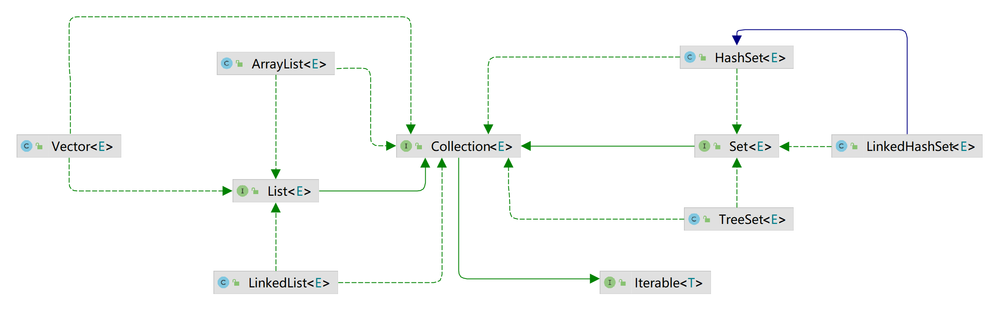
2. 双列集合（Map）：存放 k-v 形式的数据
   - Hashtable
     - Properties
   - HashMap
     - LinkedHashMap
   - TreeMap
   - 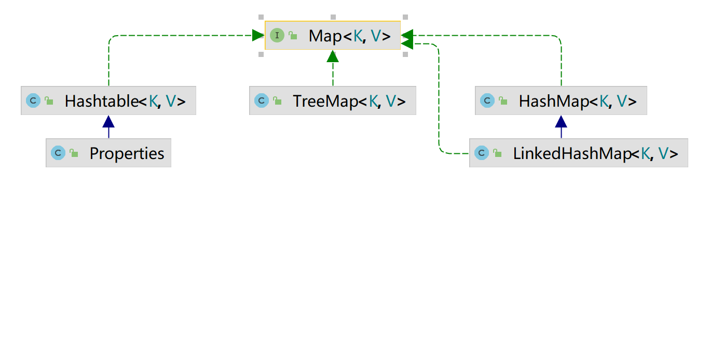

### 9.3 Collection

#### 9.3.1 Collection 接口的特点

1. Collection 接口没有直接的实现子类，是通过它的子接口 Set 和 List 实现的。
2. Collection 实现子类可以存放多个元素，每个元素可以是 Object
3. Collection 的实现类，List 是有序的，Set 不是有序的
4. Collection 的实现类，有的可以存放重复的元素，有的不可以

#### 9.3.2 Collection 接口实现类遍历元素方式

1. Tterator（迭代器）：
   - 所有实现了 Collection 接口的集合类都有一个`iterator()`方法，用以返回一个迭代器
   - Iterator 仅用于集合遍历，本身并不存放对象。
   - 使用流程：
     - 创建迭代器：`Iterator it = 集合对象.iterator()`
     - 遍历对象：`while(it.hasNext()){it.next()}`
       - 使用`it.next()`之前必须使用`hasNext()`方法进行判断，否则在调用完最后一条时会抛出`NoSuchElementException`异常。
       - while 循环结束后，迭代器指向集合中最后一个元素，如果再调用`next()`方法，会抛出异常，如果希望再次遍历，则需要重置迭代器：`it = 集合对象.iterator()`
     - IDEA 快捷模板：`itit`，`Ctrl+j`显示所有的快捷模板
2. 增强 for 循环：
   - 语法：`for( 元素类型 元素名 : 集合名或数组名){ 访问元素 }`
   - 只能用于遍历集合和数组。
   - 本质就是简化版的迭代器（底层代码）。
3. 不可用普通 for 循环，因为子接口 Set 不支持索引

#### 9.3.3 集合的选择

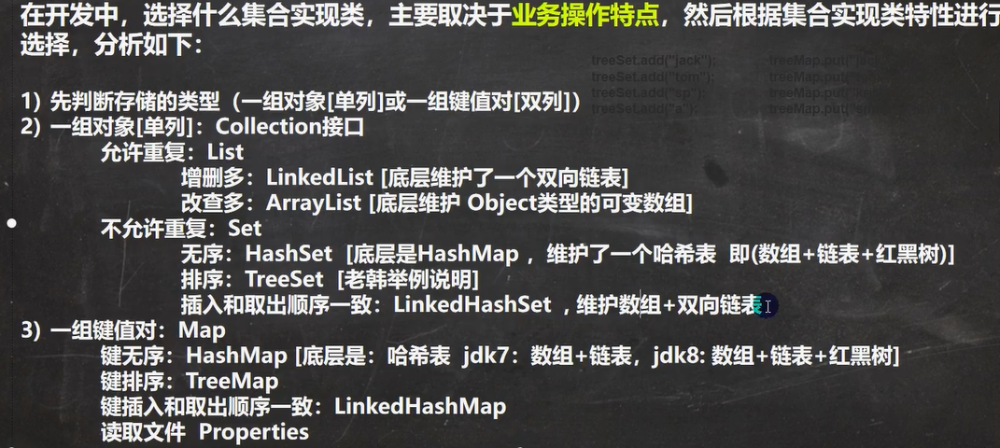

### 9.4 List

#### 9.4.1 特点

1. List 集合类的元素有序（添加和取出顺序一致），且可重复。
2. List 集合类每个元素都有器对应的顺序索引，可通过索引取出元素——使用`get()`
3. List 接口实现类常用的有`ArrayList`、`LinkedList`、`Vector`
   - 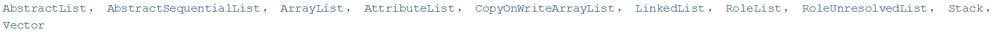

#### 9.4.2 常用方法

[Collection - Java 11中文版 - API参考文档 (apiref.com)](https://www.apiref.com/java11-zh/java.base/java/util/Collection.html)

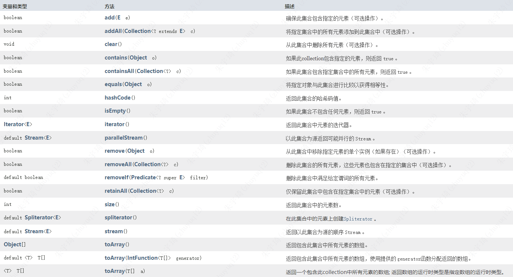

#### 9.4.3 遍历方式

1. 使用 Iterator 迭代器：迭代器的`next()`取出的就是每个对象
2. 使用增强 for 循环
3. 使用普通 for 循环

#### 9.4.4 ArrayList

1. 特点：
   - 可以存放 null，且可存放多个
   - 基本等同于 Vector，但 ArrayList 线程不安全。
2. 底层：
   - ArrayList 的数据由一个`transient`修饰的`Object[]` 存储。可变数组
     - `transient`表示不可被序列化
   - `ArrayList()`：初始容量为 0，第一次添加元素容量变为 10，后续扩容按照当前容量的 1.5 倍增大
   - `ArrayList(int initialCapacity)`：初始容量为 initialCapacity，后续扩容按照当前容量的 1.5 倍增大
     > 3. IDEA 补充知识：
     >    - IDEA 在 debug 时，会阉割数据
     >    - 解决方式：（去掉下列两个红框的勾选）。
     >      - 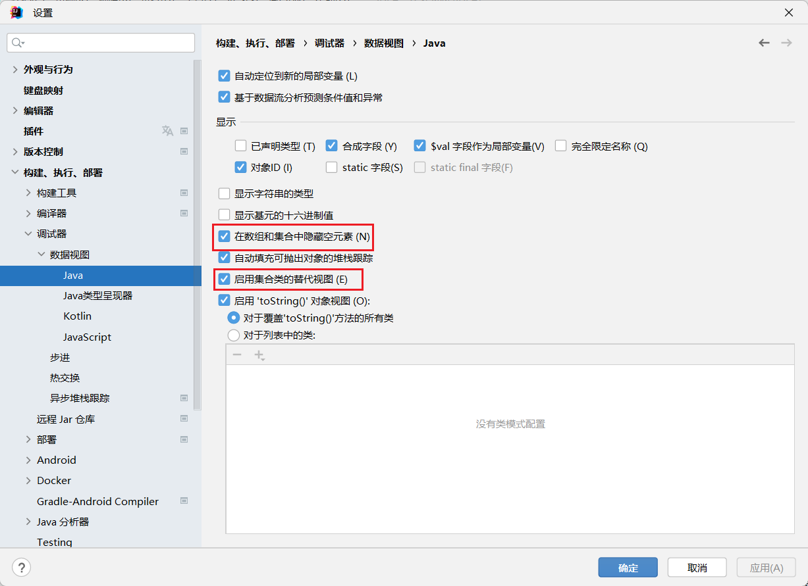

#### 9.4.5 Vector

1. 特点：
   - 可以存放 null，且可存放多个
   - Vector 类的操作方法带有`synchronized`，所以是线程安全的。
2. 底层：
   - 底层使用`Object[]`存放数据
   - `Vector()`：初始容量 0，第一次添加后 10，不足时按当前容量的 2 倍扩容。
   - `Vector(int initialCapacity)`：初始容量为 initialCapacity，不足时按当前容量的 2 倍扩容。

#### 9.4.6 LinkedList

1. 特点：
   - 可以存放 null，且可存放多个
   - 线程不安全，添加删除效率比数组高，查找效率较低
2. 底层：
   - 底层维护了一个双向链表
     - LinkedeList 中有两个属性 first、last，分别指向链表中第一个和最后一个节点
     - 每个节点都含有 3 个属性：prev、next、item
     - 只有无参构造器`LinkedList()`，默认容量 0，添加一个数组，容量+1。
3. LinkedList 和 ArrayList 的选择
   - 改查较多，选择 ArrayList
   - 增删较多，选择 LinkedList
     - 业务中，一般查询较多、增删较少，建议使用 ArrayList

### 9.5 Set

#### 9.5.1 特点

1. 无序（添加和取出顺序不一定一致），元素不可重复，最多只可包含一个 null。
   - 元素不可重复按照 equals 是否相等理解。（基本数据类型会自动装箱，但包装类重写了 equals 方法，比较的还是具体值；字面量字符串在常量池；构造器创建的字符串比较的也是具体内容（equals））
   - 但一旦数据确定，每次的取出顺序一致
   - hashcode 是根据对象的地址值确定的
2. 没有索引
3. 常用实现类有：`HashSet`、`LinkedHashSet`、`TreeSet`
   - 

#### 9.5.2 常用方法

[Set (Java SE 11 & JDK 11 ) (runoob.com)](https://www.runoob.com/manual/jdk1.6/java.base/java/util/Set.html)

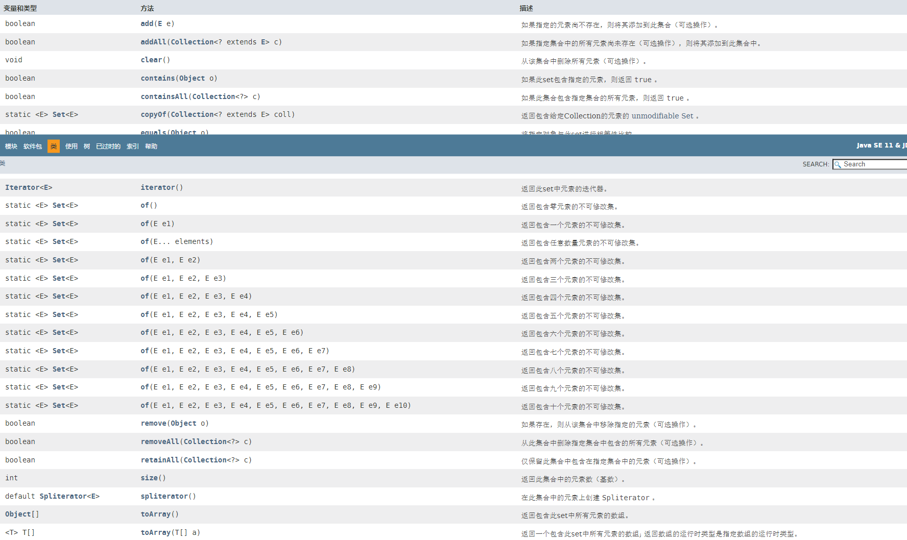

#### 9.5.3 遍历方式

1. 迭代器
2. 增强 for 循环
3. 不能使用普通 for 循环

#### 9.5.4 HashSet

1. 特点：
   - 可以存放 null，但只能存放一个。
   - 相同数据只能存放一个
     - 注意字符串的特殊性（面试题）：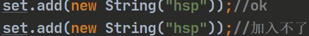
     - 其他对象可以添加成功：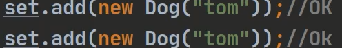
   - 数据存入与取出顺序不一定一致
2. 底层（数据结构）：
   - 底层实际上是 HashMap，而 HashMap 的底层是数组+链表+红黑树
     - 调用 HashSet 构造器后，会先执行 HashMap()构造器，并创建 table 表（数组），初始容量为 0，再取得加载因子 0.75
     - 添加元素时，先计算得到该元素的 hash 值，并转换得到索引值
   - 第一次添加时，将 table 扩容到 16，并把第一次添加的元素放到表中的指定位置
   - 后续添加时，比较索引值，如果表中该索引已有值，则在该值后的数据链中比较，添加到最后
     - 注意：这里比较元素内容是否相同，取决于加入元素的`equals()`方法，通过重写`equals()`和`hasCode()`可以控制元素能否加入
   - JAVA8 中，如果数据链的数据已有 8 个，先对表按 2 倍进行扩容，如果表已经扩容过，并且表到了 64，则将该表转换为红黑树
   - 平时链表数据没到 8 个，但表到达 12 个（16\*0.75），就会对表按照 2 倍进行扩容，并以此类推
   - 数组类型为`HashMap$Node`，数据类型为`HashMap$Node`。

#### 9.5.5 LinkedHashSet

1. 特点：
   - HashSet 的子类、并实现了 Set 接口
   - 可以存放 null、但只能存放一个
   - 相同数据只能添加一个
   - 元素取出顺序固定，且与加入顺序一致。
2. 底层：
   - 底层使用了一个 hashtable（数组） 和双向链表存储数据，
     - 数组是`HashMap$Node`类型
       - 数组有 head 和 tail
     - 数据类型为`LinkedHashMap$Entry`类型，LinkedHashMap 是 HashMap 的子类。
       - 每个元素有 before 和 after
   - 初始容量为 0，第一次添加时，直接将数组 table 扩容到 16，再添加一个元素时，先求 hash 值，再求索引，确定在表中的位置，然后再将元素添加到链表中【机制同 HashSet】

#### 9.5.6 TreeSet

1. 特点：
   - 使用无参构造器时，仍然是无序的（输出顺序与输入顺序不一致）。
   - 使用带比较器的构造器`TreeSet(Comparator<? super E> comparator)`：可以设定指定的添加规则及顺序。
     - 添加规则：取决于比较器中比较的属性，比较器返回 0 时则不能加入
     - 顺序：根据比较器指定的顺序或者逆序确定。
     - 匿名内部类的比较器规则会被创建时底层的 compare()调用
2. 底层：
   - 底层就是 TreeMap，TreeMap 底层就是 Entry
   - 存放的数据类型是 TreeMap$Entry
   - 初始化大小是 0，添加一个容量+1

### 9.6 Map

#### 9.6.1 Map 接口的特点

1. Map 与 Collection 并列存在，用于保存具有映射关系的数据。key-value（双列元素）。
2. Map 中的 key 和 value 可以时任意数类型，会封装到`HashMap$Node`对象中，数据类型为`HashMap$Node`。
3. Map 中的 key 不允许重复，原因同 HashSet（key 相同则 hashcode 和索引值相同，在 table 表（数组）的位置相同），相同的 key 等价于替换元素。
4. Map 中的 value 可以重复
5. Map 中的 key 可以为 null，value 也可以为 null，key 为 null 时只能添加一个（等价于替换），value 可以多个为 null
6. Map 中常用 String 作为 key，实际上 key 只要是 Object 就都可以（包含基本数据类型）
7. Map 中的 key 和 value 存在一一对应关系，使用`get(key)`，就可以得到唯一的一个 value</div>warning
8. Map 中的数据存储：一对 k-v 是存放在`HashMap$Node`中的，由于 Node 实现了 Entry 接口，所以在一定理解上，可以说一对 k-v 就是一个 Entry
   - 源码韩顺平分析：
     - k-v 最后是 `HashMap$Node node = newNode(hash, key, value, null)`
     - k-v 为了方便程序员的遍历，还会创建 EntrySet 集合 ，该集合存放的元素的类型 Entry, 而一个 Entry 对象就有 k,v EntrySet<Entry<K,V>> 即： `transient Set<Map.Entry<K,V>> entrySet;`
     - entrySet 中， 定义的类型是 Map.Entry ，但是实际上存放的还是 HashMap$Node 这是因为 `static class Node<K,V> implements Map.Entry<K,V>`
     - 当把 HashMap$Node 对象 存放到 entrySet 就方便我们的遍历, 因为 Map.Entry 提供了重要方法 K getKey(); V getValue();
     - 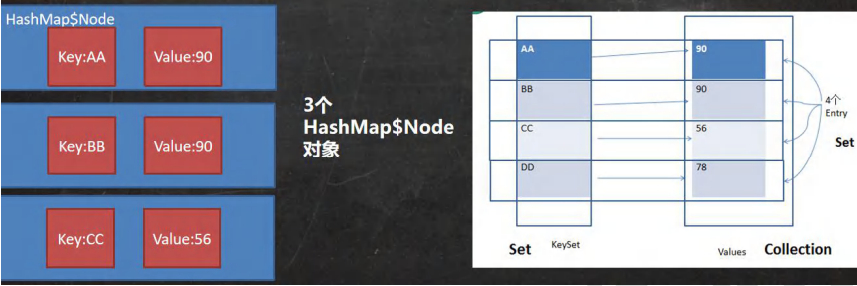
   - 源码个人理解：
     - k-v 在创建时执行的是`HashMap$Node node = newNode(hash, key, value, null)`，所以 k-v 的数据类型就是`HashMap$Node`，数组类型也是`HashMap$Node`。
     - Map.Entry 有重要的`getKey()`、`getValue()`可以获取元素的 k-v 值，有了这两个方法，就大大方便了使用（遍历）。
       - 而在 Map 中，通过`keySet()`获取`Set`类型的所有 key，`values()`获取`Collection`类型的所有 vaule，将这二者存放在了一个 Set 表中。
       - 这个 Set 表就是 EntrySet 集合，集合中每一个元素是 Entry 类型，拥有 key 和 value：`transient Set<Map.Entry<K,V>> entrySet;`
         - EntrySet 和 Node 都是 HashMap 的内部类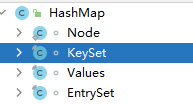
     - 为了使`HashMap$Node`类型的数据能够用上面两个方法，HashMap$Node 类实现了 Map.Entry：`static class Node<K,V> implements Map.Entry<K,V>`</div>
9. 常用实现类：`HashMap`（使用率最高）、`Hashtable`、`Properties`
   - 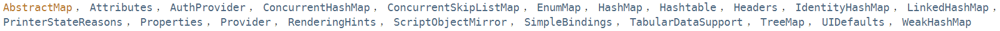

#### 9.6.2 Map 接口常用方法

| **变量和类型**                                               | **方法**                                                     | **描述**                                                     |
| ------------------------------------------------------------ | ------------------------------------------------------------ | ------------------------------------------------------------ |
| void                                                         | [clear](<https://www.runoob.com/manual/jdk1.6/java.base/java/util/Map.html#clear()>)() | 从此映射中删除所有映射（可选操作）。                         |
| boolean                                                      | [containsKey](<https://www.runoob.com/manual/jdk1.6/java.base/java/util/Map.html#containsKey(java.lang.Object)>)([Object](https://www.runoob.com/manual/jdk1.6/java.base/java/lang/Object.html) key) | 如果此映射包含指定键的映射，则返回 true 。                   |
| [Set](https://www.runoob.com/manual/jdk1.6/java.base/java/util/Set.html)<[Map.Entry]<[K],[V](https://www.runoob.com/manual/jdk1.6/java.base/java/util/Map.html)>> | [entrySet](<https://www.runoob.com/manual/jdk1.6/java.base/java/util/Map.html#entrySet()>)() | 返回此映射中包含的映射的[Set](https://www.runoob.com/manual/jdk1.6/java.base/java/util/Set.html)视图。 |
| [V](https://www.runoob.com/manual/jdk1.6/java.base/java/util/Map.html) | [get](<https://www.runoob.com/manual/jdk1.6/java.base/java/util/Map.html#get(java.lang.Object)>)([Object](https://www.runoob.com/manual/jdk1.6/java.base/java/lang/Object.html) key) | 返回指定键映射到的值，如果此映射不包含键的映射，则返回 null 。 |
| boolean                                                      | [isEmpty](<https://www.runoob.com/manual/jdk1.6/java.base/java/util/Map.html#isEmpty()>)() | 如果此映射不包含键 - 值映射，则返回 true 。                  |
| [Set](https://www.runoob.com/manual/jdk1.6/java.base/java/util/Set.html)<[K](https://www.runoob.com/manual/jdk1.6/java.base/java/util/Map.html)> | [keySet](<https://www.runoob.com/manual/jdk1.6/java.base/java/util/Map.html#keySet()>)() | 返回此映射中包含的键的[Set](https://www.runoob.com/manual/jdk1.6/java.base/java/util/Set.html)视图。 |
| [V](https://www.runoob.com/manual/jdk1.6/java.base/java/util/Map.html) | [put](<https://www.runoob.com/manual/jdk1.6/java.base/java/util/Map.html#put(K,V)>)([K](https://www.runoob.com/manual/jdk1.6/java.base/java/util/Map.html) key, [V](https://www.runoob.com/manual/jdk1.6/java.base/java/util/Map.html) value) | 将指定的值与此映射中的指定键相关联（可选操作）。             |
| [V](https://www.runoob.com/manual/jdk1.6/java.base/java/util/Map.html) | [remove](<https://www.runoob.com/manual/jdk1.6/java.base/java/util/Map.html#remove(java.lang.Object)>)([Object](https://www.runoob.com/manual/jdk1.6/java.base/java/lang/Object.html) key) | 如果存在，则从该映射中移除键的映射（可选操作）。             |
| int                                                          | [size](<https://www.runoob.com/manual/jdk1.6/java.base/java/util/Map.html#size()>)() | 返回此映射中键 - 值映射的数量。                              |
| [Collection](https://www.runoob.com/manual/jdk1.6/java.base/java/util/Collection.html)<[V](https://www.runoob.com/manual/jdk1.6/java.base/java/util/Map.html)> | [values](<https://www.runoob.com/manual/jdk1.6/java.base/java/util/Map.html#values()>)() | 返回此映射中包含的值的[Collection](https://www.runoob.com/manual/jdk1.6/java.base/java/util/Collection.html)视图。 |

#### 9.6.3 Map 接口遍历方法

1. 方式一：使用 Map 的`keySet()`方法取出所有的 key，而取出的 key 类型为 Set，因此可以使用两种方式：
   - 增强 for 循环：
   - 使用迭代器：
     - 迭代器的`next()`取出的是 key
2. 方式二：使用 Map 的`values()`方法取出所有的 value，而取出的 value 类型为 Collection，因此可以使用两种方式：
   - 增强 for 循环：
   - 使用迭代器：
     - 迭代器的`next()`取出的是 value
3. 方式三：使用 Map 的`entrySet()`方法取出所有的 entry，而取出的 entry 类型为 `HashMap$Node`，`HashMap$Node` 实现了 Map.Entry，而 Map.Entry 有`getKey()`和`getValue()`
   - 使用 EntrySet 的增强 for 循环：
     - 前提条件：使用向上转型，转为 Map.Entry。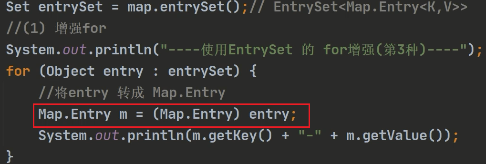
   - 使用迭代器：
     - 迭代器的`next()`取出的是 entry，entry 类型为 HashMap$Node，HashMap$Node 实现了 Map.Entry。
     - 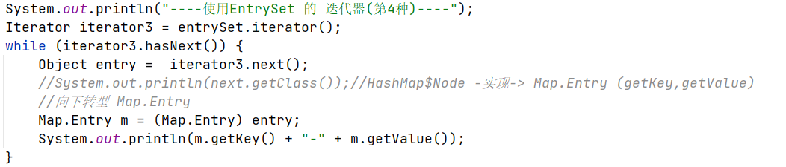

#### 9.6.4 HashMap

1. 特点：
   - 使用率最高
   - key 不能重复，但 value 可以重复，允许使用 null 的 key 和 null 的 value
   - 如果添加相同的 key，则会覆盖原来的 key-val，等同于修改（替换）
   - 线程不安全
2. 底层：
   - 底层以 key-val 的方式来存储数据（数组及数据均为 HashMap$Node 类型）
   - 与 HashSet 一样，不保证映射顺序（存入与取出不一定一致），因为底层是以 hash 表的方式来存储（数组+链表+红黑树）
   - 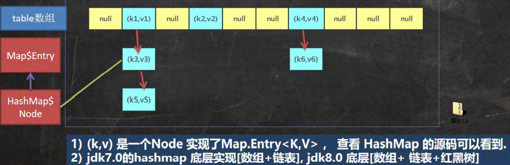
   - **扩容机制：同 HashSet，** 唯一区别在于 HashSet 计算哈希值是元素，HashMap 计算时是 key
   - 初始化数据容量为 0

#### 9.6.5 LinkedHashMap

1. 特点：
   - 继承了 HashMap，实现了 Map。
   - 线程不安全
   - 如果有相同 key，后者替换前者；value 可以重复，允许使用 null 的 key 和 null 的 value
   - 有序（插入与取出顺序一致，但不会排序）
2. 底层
   - 底层使用数组+双向链表 转 红黑树
   - 初始容量为 0

#### 9.6.6 Hashtable

1. 特点：
   - 键和值都不能为 null，会抛出 NullPointerException
   - 线程安全的
2. 底层：
   - 底层是一个数组，类型为`Hashtable$Entry`，实现了 Map.Entry。元素类型也为`Hashtable$Entry`
   - 初始化大小为 11，临界值为 8（11\*0.75）
   - 当添加数据数量到达 8 时，对数组进行扩容，扩容为当前容量 _ 2 + 1，新的临界值变为当前容量 _ 0.75

#### 9.6.7 Properties

1. 特点：
   - 继承了 Hashtable：不能添加 null 的 key 或 value，会发生 NullPointerException
   - 线程安全
   - 如果有相同 key，后者替换前者
   - 可以用与`xxx.properties`文件中，加载数据到`Properties`类中进行读取和修改
2. 底层
   - 初始容量为 0，底层使用数组，元素类型、扩容机制同 Hashtab

#### 9.6.8 TreeMap

1. 特点：
   - 使用无参构造器时，仍然是无序的（输出顺序与输入顺序不一致）、但输出排序。【2022.09.24，使用时发现是跟 key 是 int 类型是，输出时是排好序的】
   - 使用带比较器的构造器`TreeMap(Comparator<? super E> comparator)`：可以设定指定的添加规则及顺序。
     - 添加规则：取决于比较器中比较的属性，比较器返回 0 时则不能加入
     - 顺序：根据比较器指定的顺序或者逆序确定。
     - 匿名内部类的比较器规则会被创建时内部的 compare()调用
2. 底层：
   - 底层就是 Entry
   - 存放的数据类型是`TreeMap$Entry`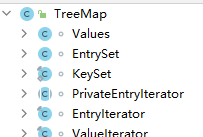
   - 初始化大小是 0，添加一个容量+1</div>warning
     **比较（个人总结）：**
     **注意：容量和** `size()`**不同。** `size()`**指的是有多少实际的数据。**
     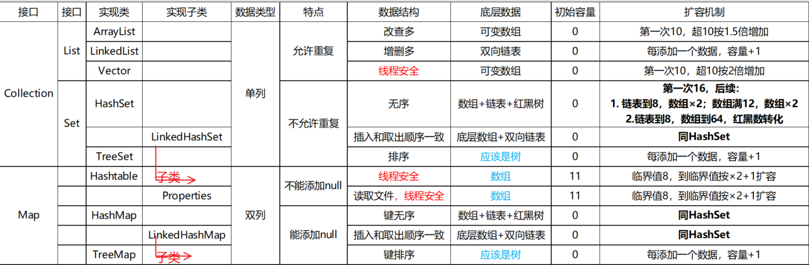</div>

### 9.7 Collections 工具类

#### 9.7.1 介绍

[API](https://www.runoob.com/manual/jdk1.6/java.base/java/util/Collections.html)

1. 操作 Set、List、Map 等集合的工具类。
2. 能够对集合进行排序、查找、修改等工作。

#### 9.7.2 排序操作：

1. `reverse(List)`：反转 List 中的元素顺序
2. `shuffle(List)`：对 List 集合进行随机排序，每次调用都进行一次随机
3. `sort(List)`：对 List 结合的元素进行自然排序（从小到大）
4. `sort(List, Comparator)`：根据比较器的规则对 List 集合的元素进行排序
5. `swap(List, int i, int j)`：交换 List 和 i 和 j 位置的元素
   - i 或 j 超范围时抛出索引越界异常


#### 9.7.3 查找、替换

- 使用`copy()`方法前必须确认目标集合与源集合有同样的 size（注意 size 不是容量），否则会发生数组越界异常。

## 第 10 章 泛型

### 10.1 泛型的引出

#### 10.1.1 个人理解

- 集合中的添加的元素可以是任意类型，但某些特定需求下，需要将添加的类型限定在某一种类型，以保证开发效率、代码规范等目的。
- 这种情况下靠人为去控制添加的元素类型不具有显示意义，编译器也不会在编译程序的时候指出这种失误。
- 为了**保证添加的元素类型一致、编译器能够在编译阶段（程序书写阶段）就发现错误、后续的代码中简化代码**，java 在 JDK5.0 时引入了泛型，它在集合、接口等有确定传入类型需求的类、接口声明时添加了占位元素，使得在使用时，用指定的元素类型替换占位元素，以达到上述目的。

#### 10.1.2 官方理解

- 泛型又称参数化类型，用于解决数据类型的安全性问题
- 需要在类声明或实例化时指定具体类型。
- java 泛型可以保证程序在编译时不出现警告，运行时也就不会产生 ClassCastException，同时能够使 diamagnetic 更简洁、健壮。
- 泛型的作用是：可以在类声明时，通过一个标识，表示类中某个属性、某个方法的返回值、某个方法的参数是指定类型。

### 10.2 使用泛型

#### 10.2.1 泛型的实例化

1. 在创建对象时，`<>`中写上具体的参数类型。
   - 例子：`List<String> list = new ArrayList<String>();`
   - 简写：`List<String> list = new ArrayList<>();`
     - 好处：由编译器去自动推断数据类型，进一步保证数据安全。
2. 细节：
   - 写入的数据类型只能是引用类型，传入基本数据类型会报错
   - 可以写入声明时指定的类型，或指定类型的子类型
   - `<>`内不传入时，默认的泛型是 Object

#### 10.2.2 获取泛型的方法

1. `getGenericSuperclass()`：与`getSuperclass()`方法类似，获取带泛型的父类类型。返回类型为`Type`。

### 10.3 自定义泛型

#### 10.3.1 自定义泛型类

1. 泛型的声明
   - `class 类名<K, V>{}`
   - K、V、T 都不表示具体值或具体的类型，而是一个占位标记符，可以是任意标识符。
     - 一般 E 使用在集合中
     - T 使用在类中
     - K 表示键
     - V 表示值
     - N 表示数值类型
     - ?表示不确定的 java 类型
   - `<>`内可以写入多个，表示多个泛型
2. 声明细节：
   - 泛型可以是属性、方法参数、方法返回值、构造器参数
   - 泛型是数组时，不能在声明时初始化。
     - 数组在`new`时，不确定泛型类型就不能在内存中开辟空间
   - 静态属性、静态方法（参数、返回值）不能是泛型
     - 静态属性和静态方法随类的加载而加载，此时对象还没有创建，JVM 无法初始化泛型
   - 泛型的类型在创建对象时确定
     - 如果没有指定类型，则默认为 Object

#### 10.3.2 自定义泛型接口

1. 泛型的声明
   - `interface 接口名<T>{}`
   - K、V、T 都不表示具体值或具体的类型，而是一个占位标记符，可以是任意标识符。
     - 一般 E 使用在集合中
     - T 使用在类中
     - K 表示键
     - V 表示值
     - N 表示数值类型
     - ?表示不确定的 java 类型
   - `<>`内可以写入多个，表示多个泛型
2. 声明细节：
   - 泛型可以是方法参数、方法返回值
     - 不可以是属性，接口的属性是`public static final`
   - 静态方法（参数及返回值）不能是泛型
   - 泛型的类型在继承接口或实现接口时确定
     - 如果没有指定类型，则默认为 Object，且实现类默认使用 Object
     - 继承接口时确定：子接口的实现类会自动使用子接口确定的类型
     - 实现接口时确定：实现类会自动使用实现类确定的类型

#### 10.3.3 自定义泛型方法

1. 泛型的声明：`修饰符 <参数类型列表> 返回类型 方法名(参数列表){}`
2. 声明细节：
   - 可以定义在普通类、普通接口中，也可以定义在泛型类、泛型接口中。
   - 泛型方法被调用时类型会确定
   - `public void eat(E e){}`修饰符后没有泛型标识，表示这个方法不是泛型方法，而是方法使用了（类声明的）泛型
   - 泛型方法可以使用类声明的泛型，也可以使用自己声明的泛型

### 10.4 泛型的继承和通配符


通配符注意点：
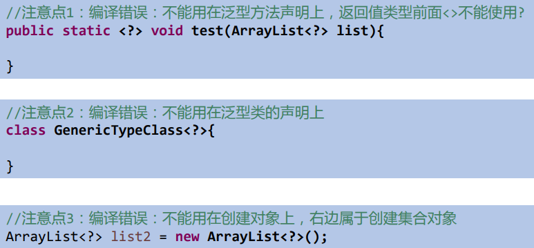

## 第 11 章 IO 流

### 11.1 文件

#### 11.1.1 文件流

1. 流：数据在数据源（文件）和程序（内存）之间经历的路径
2. 输入流：数据从数据源（文件）到程序（内存）的路径
3. 输出流：数据从程序（内存）到数据源（文件）的路径

#### 11.1.2 常用操作

1. 创建文件对象
   - `new File(String str)`：通过指定路径创建 File 实例
   - `File(File parent, String child)`：通过父目录文件和子路径搭配创建 File 实例
   - `File(String parent, String child)`：通过父目录和子路径搭配创建 File 实例
2. 获取文件相关信息
   - `createNewFile()`：在指定路径生成目标文件，并保存在磁盘里
     - 该方法有异常问题
   - `getName()`：获取文件名
   - `getAbsolutePath()`：获取文件的绝对路径（带文件名）
   - `getParent()`：获取父级目录
   - `length()`获取文件内容有多少字节，根据文件的编码获取
     - UTF-8 编码中，汉字 3 个字节
   - `exists()`：文件是否存在
   - `isFile()`：是不是一个文件
   - `isDirectory()`：是不是一个目录
3. 目录操作和文件删除：
   - `delete()`：删除文件或空文件夹
   - `mkdir()`：创建一级目录
   - `mkdirs()`：创建多级目录

### 11.2 IO 流原理及分类

#### 11.2.1 I/O 流原理

1. 用于数据传输，如读写文件，网络通讯。
2. java.io 包下提供了各种流（stream）类和接口，用以获取不同类的数据，并通过方法输入或输出数据。
3. 输入 input：读取外部数据到内存（程序）中
4. 输出 output：将程序（内存）中的数据输出到存储设备中。

#### 11.2.2 流的分类：写、out：自身 → 外部，读、input：外部 → 自身

1. 按照操作数据单位分：字节流（8 字节）二进制文件、字符流（按字符）文本文件
2. 按数据流向：输入流、输出流
3. 按流的角色：节点流、处理流/包装流
   - 节点流：从一个特定的数据源读写数据
     - 数据源：存放数据的地方，可以是文件、字符串、数组、管道
   - 处理流/包装流：建立在已有的流之上，为程序提供更强大、更灵活的读写功能 - 如 BufferedReader、BufferedWriter - 处理流类的底层封装了节点流的 Wrtie 或 Reader 对象，根据多态，可以使用各种 Writer 和 Reader 的子类对象
     节点流和处理流的区别和联系：
   - 节点流是底层流，直接更数据源相接
   - 处理流包装节点流，可以消除不同节点流的实现差异，也可以提供更方便的方法完成输入输出
   - 处理流对节点流的包装，使用了修饰器涉及模式，不会直接与数据源相连
   - 处理流提高了性能：主要以增加缓冲的方式提高输入输出的效率
   - 处理流提供了操作的便捷：处理流可能提供了一系列编辑的方法来一次输入输出大批量的数据，使用更加灵活方便。
    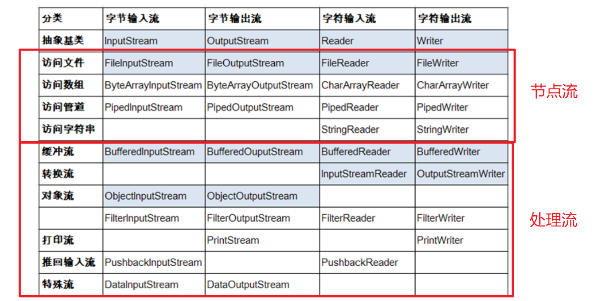
   | 抽象基类 | 字节流       | 字符流 |
   | -------- | ------------ | ------ |
   | 输入流   | InputStream  | Reader |
   | 输出流   | OutputStream | Writer |
   - java 的 io 流涉及 40 多个类，都是从上述 4 个抽象基类派生而来
   - 这 4 个基类派生出来的子类名称都是以基类名作为子类名的后缀

1. IO 流体系图


### 11.3 节点流/文件流

#### 11.3.1 FileInputStream

1. 创建文件输入流对象：`new FileInputStream(filePath)`：
   - 有异常问题
2. `read()`：从输入流中读取一个字节的数据，
   - 到达文件末尾时，返回-1（读取完毕）
   - 有异常问题
   - 读入的字节数据是 ASCII 编码，使用字符强转可得到原文
3. `read(byte[] b)`：一次读取 b.length()个字节存入到 b 中，返回实际读取的字节数量
   - 到达文件末尾时，返回-1（读取完毕）
   - 有异常问题
   - 读入的字节数据是 ASCII 编码组成的数组，转换为字符串时可使用`String(byte[] bytes, int offset, int length)`构造器
     - offset：byte[]数组起点下标
     - length：读入 byte[]字节长度
4. `read(byte[] b, int off, int len)`：开发中使用这个
   - 到达文件末尾时，返回-1（读取完毕）
   - 有异常问题
5. `close()`：关闭文件输入流，并释放与该流相关的所有系统资源
   - 由于创建输入流对象有异常问题，该方法须在 finally 块中调用，以保证确实执行。

#### 11.3.2 FileOutputStream

1. 创建文件输出流对象：
   - `new FileOutputStream(filePath)`：覆盖模式
   - `new FileOutputStream(filePath, true)`：追加模式：第二个参数设置为 true 时，输出的字节流是追加的方式
   - 有异常问题
2. `write(int b)`：将单个字节数据输出到输出流，传入的是一个 ASCII 整数，或者一个字符（会自动类型转换为整型）
   - 有异常问题
3. `write(byte[] b)`：将 b.length()个字节输出到输出流
   - 有异常问题
   - 可搭配 String 的`getBytes(str)`使用，将字符串转换为字符数组
4. `write(byte[] b, int off, int len)`：将字节数组 b，从下标 off 开始的 len 个字节数据输出到输出流。开发中使用这个
   - 有异常问题
5. `close()`：关闭文件输出流，并释放与该流相关的所有系统资源
   - 由于创建输出流对象有异常问题，该方法须在 finally 块中调用，以保证确实执行。

#### 11.3.3 文件拷贝

1. 搭配输入输出流使用

#### 11.3.4 FileReader

1. 创建文件读取对象：`new FileReader(filePath)`：
   - 有异常问题
2. `reader()`：读取单个字符，读入的是个整数
   - 到达文件末尾时，返回-1（读取完毕）
   - 有异常问题
   - 读入的字符数据是 ASCII 编码，使用字符强转可得到原文
3. `read(byte[] b)`：一次读取 b.length()个字符存入到 b 中，返回实际读取的字符数量
   - 到达文件末尾时，返回-1（读取完毕）
   - 有异常问题
   - 读入的字符数据是 ASCII 编码组成的数组，转换为字符串时可使用`String(char[] chars, int offset, int length)`构造器
     - offset：char[]数组起点下标
     - length：读入 char[]字节长度
4. `read(char[] b, int off, int len)`：开发中使用这个
   - 到达文件末尾时，返回-1（读取完毕）
   - 有异常问题
5. `close()`：关闭文件读取对象，并释放与该流相关的所有系统资源
   - 由于创建文件读取对象有异常问题，该方法须在 finally 块中调用，以保证确实执行。

#### 11.3.5 FileWrite

1. 创建文件写入流对象：
   - `new FileWriter(filePath)`：覆盖模式
   - `new FileWriter(filePath, true)`：追加模式：第二个参数设置为 true
   - 有异常问题
2. `write(int b)`：将单个字符数据输出到输出流，传入的是一个 ASCII 整数，或者一个字符（会自动类型转换为整型）
   - 有异常问题
3. `write(char[] b)`：将 b.length()个字符输出到输出流
   - 有异常问题
4. `write(char[] b, int off, int len)`：将字符数组 b，从下标 off 开始的 len 个字符数据输出到输出流。开发中使用这个
   - 有异常问题
5. `write(String str)`：写入整个字符串
6. `write(String str, int off, int len)`：写入字符串指定部分
7. `close()`：关闭文件输出流，并释放与该流相关的所有系统资源
   - 由于创建输出流对象有异常问题，该方法须在 finally 块中调用，以保证确实执行。
   - FileWtrie 必须关闭流(close())或(flush()，否则不能真正保存到文件
   - 等价于 flush()和关闭

### 11.4 处理流

- **BufferedReader 和 BufferedWriter**
  - **属于字符流，一般用于处理文本文件**，处理声音、视频、doc、pdf 等二进制文件时有数据丢失的风险。
  - 关闭流时，只需要关闭外层的 BufferedReader 或 BufferedWriter 即可，而不是传入的 Reader、Writer 对象，底层会自动关闭对应的传入 Reader、Writer 对象
- BufferedInputStream 和 BufferedOutputStream
  - 属于字节流，既可处理文本文件，也可处理二进制文件

#### 11.4.1 BufferedReader

1. 创建对象：`new BufferedReader(Reader in)`：
   - 有异常问题。
   - 异常存在于传入的 Reader in 对象
2. `readLine()`：按行读取，读取完毕返回 null
   - 不读入换行

#### 11.5.2 BufferedWriter

1. 创建对象：`new BufferedWriter(Writer out)`
   - 有异常问题。
   - 异常存在于传入的 Writer out 对象
2. `write(String s, int off, int len)`：写入字符串的一部分
   - 好像不要 off 和 len 的时候是传入整个字符串？
3. `newLine()`：插入一个和系统相关的换行符

#### 11.4.3 BufferedInputStream

- `new BufferedInputStream(InputStream in)`
- 类似 BufferedReader
- 使用的方法是：`read(byte[] b, int off, int len)`

#### 11.4.4 BufferedOutputStream

- `new BufferedOutputStream(OutputStream out)`
- 类似于 BufferedWriter
- 使用的方法是：`write(byte[] b, int off, int len)`

#### 11.4.5 序列化和反序列化

1. 序列化：保存值和数据类型到文件
2. 反序列化：将保存到文件的数据值和数据类型进行恢复
3. 对象要可序列化，则要求该对象实现`Serializable`或`Externalizable`接口。
   - 一般使用`Serializable`，该接口为标记接口——没有任何属性和方法
   - `Externalizable`，继承自`Serializable`，需要重写两个方法
4. 注意事项
   - 读写顺序要一致
   - 序列化或反序列化的对象必须实现`Serializable`或`Externalizable`接口。
   - 序列化的对象建议添加`private static final long serialVersionUID`，提高兼容性
   - 序列化的对象，会默认初始化除 static 和 transient 修饰的成员
   - 序列化的对象，其属性类型也需要实现序列化接口，有异常问题
   - 序列化具有继承性，其子类自动可序列化

#### 11.4.6 ObjectOutputStream

1. 特征：字节流、处理流、对象流、提供序列化功能
2. 创建对象：`new ObjectOutputStream(OutputStream out)`
3. `writeInt(int)`：自动装箱，写一个 32 位的整形数
4. `writeBoolean(boolean)`：自动装箱
5. `writeChar(int)`：自动装箱，写一个 16 位字符，可传入字符，会自动转换为 int
6. `writeDouble(double)`：自动装箱，写一个 64 位双精度浮点数
7. `writeUTF(String)`：以 UTF-8 模式写入字符串
8. `writeObject(Object)`：将指定对象写入
9. `close()`
10. 上述均有异常问题。

#### 11.4.7 ObjectInputStream

1. 特征：字节流、处理流、对象流、提供反序列化功能，**反序列化顺序必须与序列化顺序一致。**
2. 创建对象：`new ObjectInputStream(InputStream input)`
3. `readInt()`
4. `readBoolean()`
5. `readChar()`
6. `readDouble()`
7. `readUTF()`
8. `readObject()`：底层表现多塔的特征，编译类型是 Object，运行类型是实际的类型，底层会进行造型和强转。但如果使用运行类型的方法，需要进行显式强转。
9. `close()`
10. 上述均有异常问题

### 11.5 标准输入流和输出流（java.lang.Object）

1. `System.in`类：编译类型为`InputStream`、运行类型为`BufferedInputStream`
   - 标准输入
   - 输入源键盘
   - 返回`InputStream`
2. `System.out`类：编译类型为`PrintStream`、运行类型为`PrintStream`
   - 标准输出
   - 输出源显示器
   - 返回`OutputStream`

### 11.6 转换流

- `InputStreamReader`（字符流）：
  - 默认情况下，读取文件时按照 utf-8 的形式，
  - `Reader`的子类
  - 可以将`InputStream`（字节流）包装成/转换成`Reader`（字符流）
  - `InputStreamReader(InputStream in, Charset cs)`：按照读取文件的 cs 编码格式进行读入
- `OutputStreamWriter`（字符流）：
  - 指定处理编码
  - `Writer`的子类
  - 可以将`OutputStream`（字节流）转换成`Writer`（字符流）
  - `OutputStreamReader(OutputStream in, Charset cs)`
- 主要用于解决中文文本数据
  - 中文文本数据有乱码问题
  - 中文文本按照字符流处理（读取和写入）效率更高

### 11.7 打印流

- 只有输出流没有输入流

#### 11.7.1 PrintStream

1. 构造器（常用）：
   - `PrintStream(OutputStream out)`：
     - `PrintStream(System.out)`：默认屏幕输出
   - `PrintStream(File file)`：可指定编码
   - `PrintStream(String fileName)`：可指定编码
   - `PrintStream(Writer out)`：可指定编码
2. 使用：`PrintStream out = System.out`
   - `out.print()`：默认情况下，输出位置是标准输出——显示器
   - `print()`底层使用的是`write()`，故可以使用字节流的`write()`方法进行时输出
   - 修改输出位置：`System.setOut(PrintStream ps)`，然后调用`out.print()`
     - 根据创建的`ps`对象，可以输出到指定文件
3. 需要关闭。

#### 11.7.2 PrintWriter

1. 构造器：
   - `PrintWriter(OutputStream out)`：
     - `PrintWriter(System.out)`：默认屏幕输出
   - `PrintWriter(File file)`：可指定编码
   - `PrintWriter(String fileName)`：可指定编码
   - `PrintWriter(Writer out)`：可指定编码
2. 使用：
   - 调用`print()`方法
3. 需要关闭。

### 11.8 Properties

1. 作用：专门用于读写配置文件的集合类
   - 配置文件格式：`键=值`
   - 键值对不需要有空格
   - 值不需要使用引号
   - 默认类型为 String
2. 创建对象：`new Properties()`
3. 常见方法：
   - `load(Reader reader)`
   - `loaad(InputStream instream)`：加载配置文件
   - `list(PrintWriter out)`：将此属性列表打印到指定的输出流（键值对的形式）
     - `list(System.out)`：屏幕输出
   - `list(PrintStream out)`
   - `getProperty(String key)`：根据 key 获取 value
   - `setProperty(String key, String value)`：修改、添加键值对到 Properties 类的对象（此时还没添加到文件里）
   - `store(OutputStream out, String comments)`：将 k-v 存储到文件中
     - comments 会添加文件的开头，以#注释，一般可置为 null
   - `store(Writer writer, String comments)`
4. IDEA 中使用路径：
   - 绝对路径
   - 工程路径：`src/io.properties`
   - 模块路径：`模块名/src/io.properties`

### 11.9 NIO

#### 11.9.1 概述

可以理解为 No Blocking IO，是从 Java1.4 版本开始引入的一个新的 IO API，可以替代标准的 Java IO API。
NIO 与 IO 有同样的作用和目的，但使用方式完全不同，NIO 支持面向缓冲区、基于通道的 IO 操作，可以更加高效地进行文件读写操作。用于解决高并发、I/O 高性能问题。
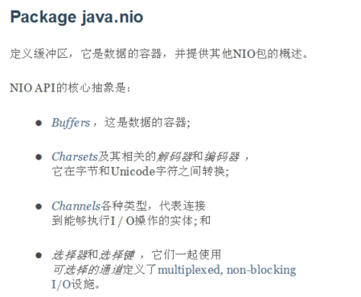
NIO 模型图说明：
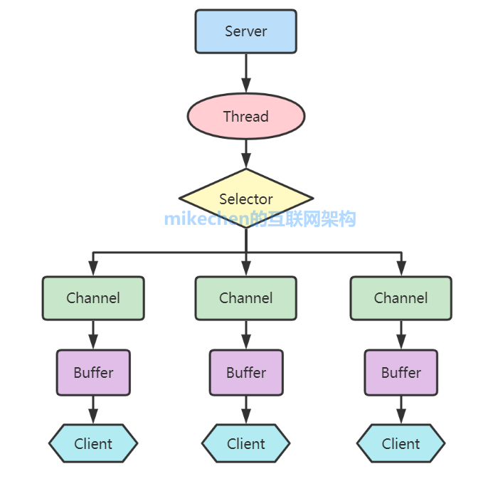

1. 每个 Channel 对应一个 Buffer。
2. Selector 对应一个线程，一个线程对应多个 Channel。
3. 该图反应了有三个 Channel 注册到该 Selector。
4. 程序切换到那个 Channel 是由事件决定的（Event）。
5. Selector 会根据不同的事件，在各个通道上切换。
6. Buffer 就是一个内存块，底层是一个数组。
7. 数据的读取和写入是通过 Buffer，但是需要 flip()切换读写模式，而 BIO 是单向的，要么输入流要么输出流。

#### 11.9.2 NIO 对比 BIO

BIO 即传统 IO，由于会发生阻塞（资源不足，线程等待）。
在高并发服务器的实现中，BIO 模型中客户端每发起一个连接服务器的请求就会启动一个线程，NIO 模型中，服务器处理多个请求，客户端发送的连接请求都会注册到多路复用器上，多路复用器轮循到连接有 I/O 请求就进行处理。
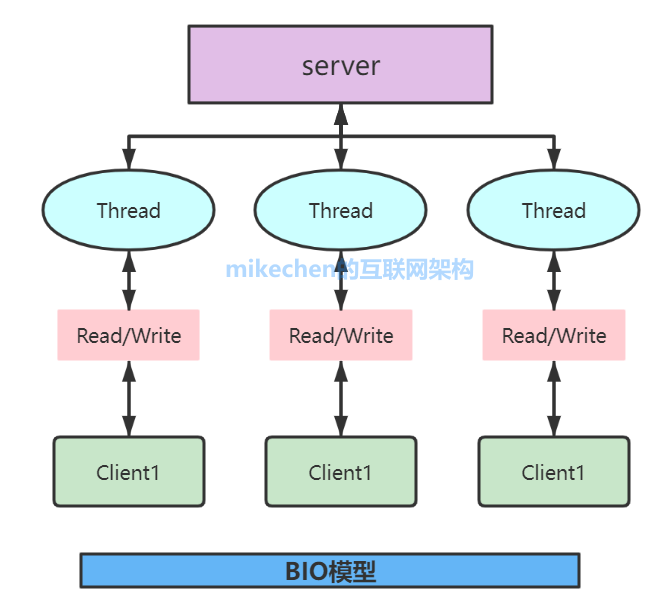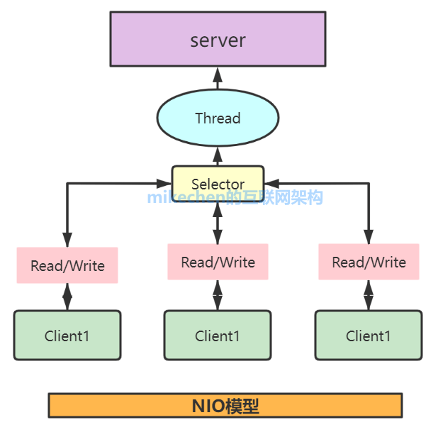
上述模型中，BIO 的问题在于请求 i 过多会过度消耗内存资源。NIO 模型中的 selector 是一个多路复用接口，阻塞的同时监听多个客户端的 IO 请求，一旦收到 IO 请求就调用对应的函数处理。

| IO                         | NIO                           |
| -------------------------- | ----------------------------- |
| 面向流（Stream Orientend） | 面向缓冲区（Buffer Oriented） |
| 阻塞 IO（Blocking IO）     | 非阻塞 IO（Non Blocking IO）  |
| 单向（输入流、输出流）     | 双向（缓冲区）                |
| 无                         | 选择器（Selectors）           |

BIO 即同步阻塞 IO，也就是干完一件事，再去干别的事。这种 IO 简单，但是效率低下。
JDK1.4 之后出来了 NIO，即同步非阻塞，也就是这个线程依然要等待返回结果，但是可以去干点别的事，不用一直在这等着了。
JDK1.7 之后又出了 NIO2.0 也就是 AIO，这就是异步非阻塞，即这个线程连结果都不等待了，直接返回干别的事，返回结果操作系统会通知相应的线程来进行后续的操作。

#### 11.9.3 NIO 核心之一（Buffer 缓冲区）

##### 11.9.3.1 创建缓冲区

缓冲区负责数据的存取，底层为数组，基本数据类型除 boolean 均有对应的缓冲类。Heap 开头的子类，数据是存放在 JVM 堆中的。
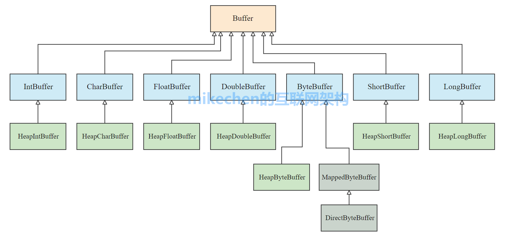

- 非直接缓冲区：在 JVM 堆中创建缓冲区：allocate(int capacity)
  - 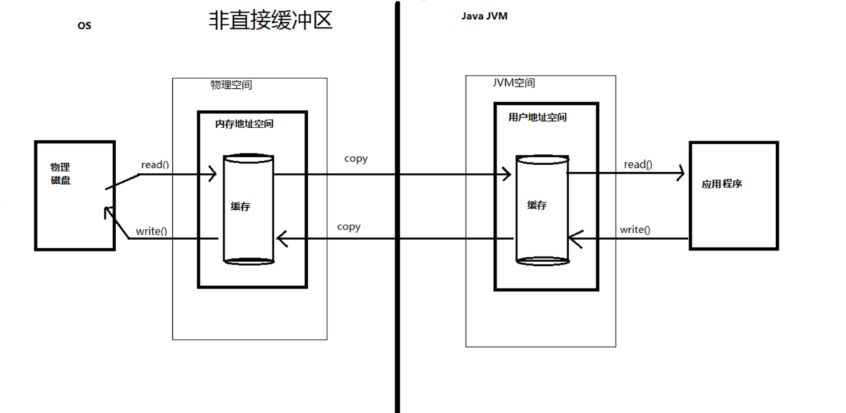
- 直接缓冲区：在系统内存创建缓冲区：allocatDirect(int capacity)
  - 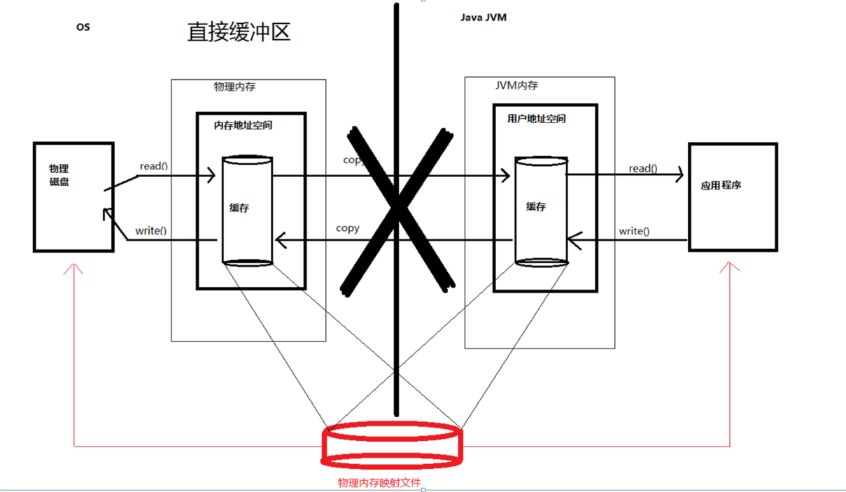
  - 没有 os 和 jvm 间的 copy 过程，可以提高效率。
  - 弊端：
    - 在物理内存中开辟、销毁空间，资源消耗大。
    - 不易控制，垃圾回收时机不易控制。
- 通过数组创建缓冲区：wrap(byte[] arr)

##### 11.9.3.2 java.nio.Buffer 的核心属性

- `capacity`：容量，表示缓冲区中最大存储数据的容量，一旦声明不可改变（因为底层是数组）。
- `limit`：界限，表示缓冲区中可操作数据区域的大小，limit 之后的数据不能读写。
- `position`：位置，表示缓冲区中正在操作的数据的位置。
- `mark`：标记，表示对某位置进行标记，调用`reset()`重置时，position 会回到 mark 标记的地方。
- 0<=mark<=position<=limit<=capacity

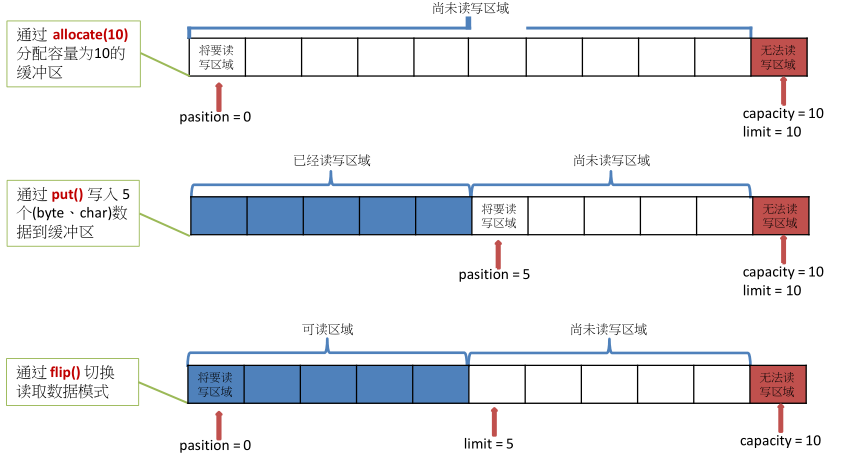

##### 11.9.3.3 java.nio.Buffer 的常用方法

- 获取缓冲区：`allocate(int capacity)`，静态方法，获取指定大小的缓冲区。
  - 如`ByteBuffer.allocate(1024)`代表获取一个 1024 字节大小的缓冲区。
- 存入数据到缓冲区：`put()`
- 获取缓冲区中的数据：`get()`
- 切换读写数据模式：`flip()`
  - 将 limit 设置为当前 position 位置。
  - 将当前 position 位置设置为 0。
  - 丢弃 mark 标记。
- 可重复读数据：`rewind()`
  - 将当前 position 位置设置为 0。
- 还原数组状态：`clear()`，注意数据并未清空，处于被遗忘状态，可以读到，但数据的位置、界限不可见。
  - 将 position 设置为：0
  - 将限制 limit 设置为容量 capacity
  - 丢弃标记 mark
- 返回可操作数的数量：`hasRemaining()`

##### 11.9.3.4 MappedByteBuffer

MappedByteBuffer 存放在堆外的直接内存中，可以映射到文件。
MappedByteBuffer 允许 Java 程序直接从内存中读取文件内容，通过将整个或部分文件映射到内存，由操作系统来处理加载请求和写入文件，应用只需要和内存打交道，这使得 IO 操作非常快。
Mmap 内存映射和普通标准 IO 操作的本质区别在于它并不需要将文件中的数据先拷贝至 OS 的内核 IO 缓冲区，而是可以直接将用户进程私有地址空间中的一块区域与文件对象建立映射关系，这样程序就好像可以直接从内存中完成对文件读/写操作一样。
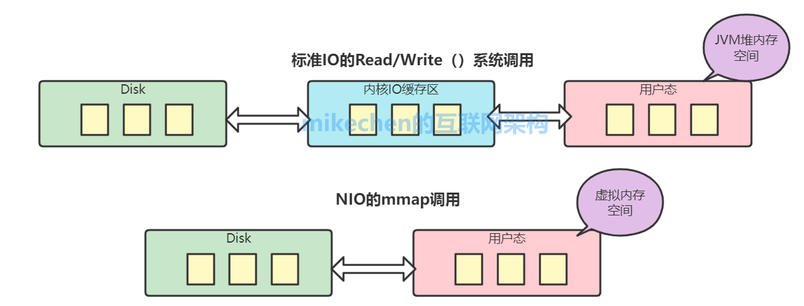
只有当缺页中断发生时，直接将文件从磁盘拷贝至用户态的进程空间内，只进行了一次数据拷贝，对于容量较大的文件来说（文件大小一般需要限制在 1.5~2G 以下），采用 Mmap 的方式其读/写的效率和性能都非常高，RocketMQ 就使用了该技术。

#### 11.9.4 NIO 核心之二（Channel）

##### 11.9.4.1 通道的理解

引用程序使用 IO 接口时，最终会调用到本地主机的 IO 接口，而早期计算机 IO 接口的调用均是由 CPU 完成，导致 CPU 占用过高。后来发展中出现了 DMA(Direct Memory Access，直接存储器访问) ，在进行 DMA 传输时，DMA 控制器掌管总线（CPU 释放总线控制权）。
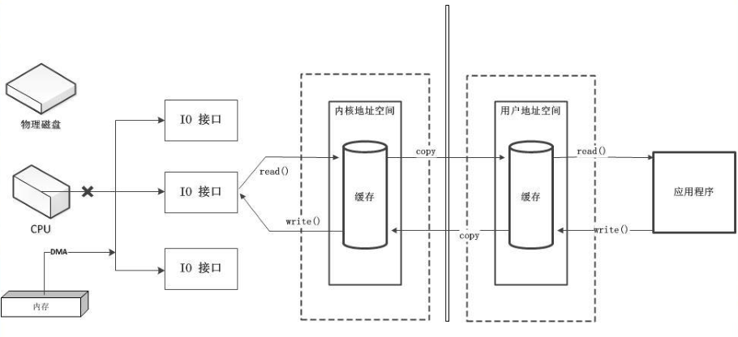
后续发展中，又衍生出通道替代 DMA，完全替代 IO 操作，进一步提高性能。
Channel 是双向的，一个对象既可以调用读取的方法也可以调用写出的方法。Channel 在读取和写出的时候，要使用 ByteBuffer 作为缓冲数组。

##### 11.9.4.2 获取通道

java.nio.channels.Channel 主要实现类：

- 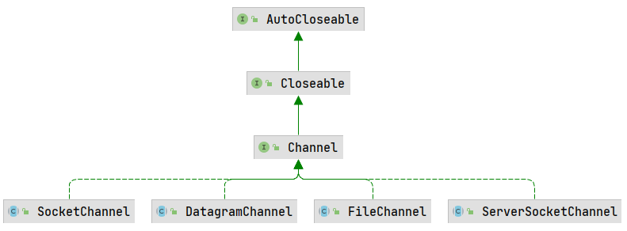
- FileChannel：从文件读取数据
- DatagramChannel：读写 UDP 网络协议数据
- SocketChannel：读写 TCP 网络协议数据
- ServerSocketChannel：可以监听 TCP 连接，对每一个新进来的连接都会创建一个 SocketChannel。

获取方式一：通过支持通道的类的 getChannel()方法。

- FileChannel：FileInputStream、FileOutputStream、RandomAccessFile 的 getChannel()方法。
- SocketChannel：java.net.Socket 的 getChannel()方法。
- DatagramChannel：java.net.DatagramSocket 的 getChannel()方法。
- ServerSocketChannel：java.net.ServerSocket 的 getChannel()方法。

获取方式二：对应通道类的静态 open()方法。
获取方式三：java.nio.file.Files 工具类的 newByteChannel()。

##### 11.9.4.3 使用通道

使用步骤为：获取通道、创建字节缓冲区、读写操作、关闭流。
核心方法：

- `write(buf)`：将 buf 中的数据写入到 channel 中。
- `read(buf)`：从 channel 中读取数据到 buf 中。

文件复制案例：

```java
public class DemoFileChannel {
    public static void main(String[] args) throws  Exception{
        FileInputStream fis = new FileInputStream("day19\\aaa\\123.txt");
        FileOutputStream fos = new FileOutputStream("C:\\Users\\jin\\Desktop\\123.txt");
        FileChannel c1 = fis.getChannel();
        FileChannel c2 = fos.getChannel();
        ByteBuffer buffer = ByteBuffer.allocate(1024);
        while (c1.read(buffer) != -1){
            buffer.flip();
            c2.write(buffer);
            buffer.clear();
        }
        c1.close();
        c2.close();
        fis.close();
        fos.close();
    }
}
```

结合 MappedByteBuffer（直接缓冲区）实现高效读写 ：

```java
public class Demo01_2G {
    public static void main(String[] args) throws IOException {
        RandomAccessFile f1 = new RandomAccessFile("C:\\资料\\小资料\\文件设置加密.avi","r");
        RandomAccessFile f2 = new RandomAccessFile("C:\\Users\\jin\\Desktop\\复制.avi","rw");
        FileChannel c1 = f1.getChannel();
        FileChannel c2 = f2.getChannel();
        long size = c1.size();
        MappedByteBuffer buffer1 = c1.map(FileChannel.MapMode.READ_ONLY, 0, size);
        MappedByteBuffer buffer2 = c2.map(FileChannel.MapMode.READ_WRITE, 0, size);
        for(int i=0; i<size; i++){
            byte b = buffer1.get();
            buffer2.put(b);
        }
        c1.close();
        c2.close();
        f2.close();
        f1.close();
    }
}
```

通道之间的数据传输：transferFrom()与 transferTo()（直接缓冲区方式）

```java
public class Demo01_2G {
    public static void main(String[] args) throws IOException {
        RandomAccessFile f1 = new RandomAccessFile("C:\\资料\\小资料\\文件设置加密.avi","r");
        RandomAccessFile f2 = new RandomAccessFile("C:\\Users\\jin\\Desktop\\复制.avi","rw");
        FileChannel c1 = f1.getChannel();
        FileChannel c2 = f2.getChannel();
        c1.transferTo(0, c1.size(), c2);
        // c2.transferFrom(c1, 0, c1.size());
        c1.close();
        c2.close();
    }
}
```

##### 11.9.4.4 分散读取与聚集写入

分散读取（Scattering Reads）是指从 Channel 中读取的数据“分散”到多个 Buffer 中。（注意缓冲区的顺序）
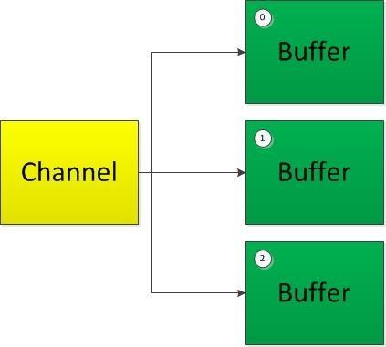
聚集写入（Gathering Writes）是指将多个 Buffer 中的数据“聚集”到 Channel。按照缓冲区的顺序，写入 position 和 limit 之间的数据到 Channel 。
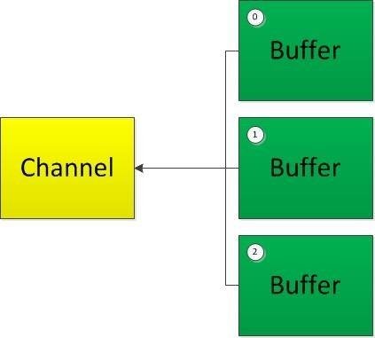

```java
public class Demo02 {
    public static void main(String[] args) throws IOException {
        RandomAccessFile raf1 = new RandomAccessFile("1.txt", "rw");
        FileChannel channel1 = raf1.getChannel();//获取通道
        ByteBuffer buf1 = ByteBuffer.allocate(100);
        ByteBuffer buf2 = ByteBuffer.allocate(1024);
        ByteBuffer[] bufs = {buf1, buf2};
        channel1.read(bufs);//分散读取
        for( ByteBuffer byteBuffer : bufs){
            byteBuffer.flip();
        }

        RandomAccessFile raf2 = new RandomAccessFile("2.txt", "rw"));
        FileChannel channel2 = raf2.getChannel();//获取通道
        channel2.write(bufs);//聚集写入
    }
}
```

##### 11.9.4.5 阻塞式网络通信

SocketChannel 类：TCP 客户端使用 SocketChannel 与服务端进行交互的流程为：

- 打开通道，连接到服务端：
  - `SocketChannel channel = SocketChannel.open();` 打开通道，此时还没有打开 TCP 连接
  - `channel.connect(new InetSocketAddress("localhost", 9090));` 连接到服务端
- 分配缓冲区：
  - `ByteBuffer buf = ByteBuffer.allocate(10);` 分配一个 10 字节的缓冲区，不实用，容量太小
- 配置是否为阻塞方式（默认为阻塞方式）：
  - `channel.configureBlocking(false);`配置通道为非阻塞模式
- 与服务端进行数据交互。
- 关闭连接：`channel.close();`

ServerSocketChannel 类：网络通信 IO 操作，TCP 协议，针对面向流的监听套接字的可选择通道（一般用于服务端），流程如下：

- 打开一个 ServerSocketChannel 通道：
  - `ServerSocketChannel server = ServerSocketChannel.open();`
- 绑定端口
  - `server.bind(new InetSocketAddress(9090));`
- 阻塞等待连接到来，有新连接时会创建一个 SocketChannel 通道，服务端可以通过这个通道与连接过来的客户端进行通信。等待连接到来的代码一般放在一个循环结构中。
  - `SocketChannel client = server.accept();`
- 通过 SocketChannel 与客户端进行数据交互
- 关闭 SocketChannel：`client.close();`

#### 11.9.5 NIO 核心之三（Selector 选择器）

##### 11.9.5.1 使用选择器

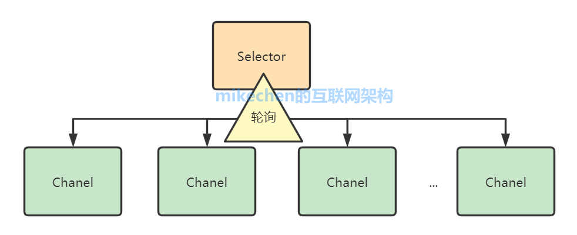
获取选择器：`Selector selector = Selector.open();`
将通道注册到选择器上：`socketChannel.register(selector, ops);`，ops 取值如下：

- 读 : SelectionKey.OP_READ （ 1）
- 写 : SelectionKey.OP_WRITE （ 4）
- 连接 : SelectionKey.OP_CONNECT （ 8）
- 接收: SelectionKey.OP_ACCEPT （ 16）

若注册时不止监听一个事件， 则可以使用“ 位或” 操作符连接。

- 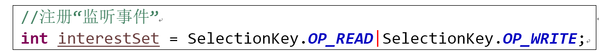

常用方法：

| 方 法                    | 描 述                                                                                                                                                                |
| ------------------------ | -------------------------------------------------------------------------------------------------------------------------------------------------------------------- |
| Set<SelectionKey> keys() | 所有的 SelectionKey 集合。 代表注册在该 Selector 上的 Channel                                                                                                        |
| selectedKeys()           | 被选择的 SelectionKey 集合。 返回此 Selector 的已选择键集                                                                                                            |
| int select()             | 监控所有注册的 Channel， 当它们中间有需要处理的 IO 操作时，该方法返回， 并将对应得的 SelectionKey 加入被选择的 SelectionKey 集合中， 该方法返回这些 Channel 的数量。 |
| int select(long timeout) | 可以设置超时时长的 select() 操作                                                                                                                                     |
| int selectNow()          | 执行一个立即返回的 select() 操作， 该方法不会阻塞线程                                                                                                                |
| Selector wakeup()        | 使一个还未返回的 select() 方法立即返回                                                                                                                               |
| void close()             | 关闭该选择器                                                                                                                                                         |

##### 11.9.5.2 SelectionKey

SelectionKey 表示 SelectableChannel 和 Selector 之间的注册关系。 每次向选择器注册通道时就会选择一个事件(选择键)。 选择键包含两个表示为整数值的操作集。 操作集的每一位都表示该键的通道所支持的一类可选择操作。

| 方 法                       | 描 述                            |
| --------------------------- | -------------------------------- |
| int interestOps()           | 获取感兴趣事件集合               |
| int readyOps()              | 获取通道已经准备就绪的操作的集合 |
| SelectableChannel channel() | 获取注册通道                     |
| Selector selector()         | 返回选择器                       |
| boolean isReadable()        | 检测 Channal 中读事件是否就绪    |
| boolean isWritable()        | 检测 Channal 中写事件是否就绪    |
| boolean isConnectable()     | 检测 Channel 中连接是否就绪      |
| boolean isAcceptable()      | 检测 Channel 中接收是否就绪      |

##### 11.9.5.3 非阻塞网络通信


```java
public class SocketNIO {
    @Test
    public  void client() throws Exception{
        SocketChannel socketChannel = SocketChannel.open(new InetSocketAddress("127.0.0.1", 9898));//1. 获取通道
        socketChannel.configureBlocking(false);//2. 设置非阻塞模式
        ByteBuffer allocate = ByteBuffer.allocate(1024);//3. 指定缓冲区大小
        Scanner scanner = new Scanner(System.in);
        while (scanner.hasNext()){
            String str = scanner.next();
            allocate.put((new Date().toString() + "\n" + str).getBytes());//4. 给缓冲区存放数据
            allocate.flip();//5. 切换读写模式
            socketChannel.write(allocate);//6. 通道内写入数据
            allocate.clear();//7. 清空缓冲区
        }
        socketChannel.close();//8. 关闭通道
    }
    @Test
    public  void server() throws Exception{
        ServerSocketChannel socketChannel = ServerSocketChannel.open();//1. 获取通道
        socketChannel.configureBlocking(false);//2. 设置非阻塞模式
        socketChannel.bind(new InetSocketAddress(9898));//3. 绑定连接
        Selector selector = Selector.open();//4. 获取选择器
        socketChannel.register(selector, SelectionKey.OP_ACCEPT);//5. 将通道注册到选择器，并监听”接收“事件
        while(selector.select() > 0){//6. 轮询式获取选择器上已经准备就绪的事件
            Iterator<SelectionKey> iterator = selector.selectedKeys().iterator();//7. 获取当前选择器中所有注册的选择键（已就绪监听事件）
            while (iterator.hasNext()){
                SelectionKey next = iterator.next();//8. 获取就绪的事件
                if(next.isAcceptable()){//9. 判断已就绪的事件类型，做相应处理
                    SocketChannel accept = socketChannel.accept();// 10. 获取已接收就绪的事件的通道
                    accept.configureBlocking(false);// 11. 切换为非阻塞模式
                    accept.register(selector, SelectionKey.OP_READ);//12. 将该通道注册到选择器上
                }else if (next.isReadable()){ //9. 判断已就绪的事件类型，做相应处理
                    SocketChannel readChannel = (SocketChannel) next.channel();// 10. 获取已读就绪的事件的通道
                    ByteBuffer allocate = ByteBuffer.allocate(1024);//11. 指定缓冲区大小
                    int len = 0;
                    while ((len = readChannel.read(allocate)) > 0){// 12. 循环读取数据
                        allocate.flip();//13. 切换读写模式
                        System.out.println(new String(allocate.array(), 0, len));
                        allocate.clear();//14. 清空缓冲区
                    }
                }
                iterator.remove();//15. 取消选择键（取消next已就绪事件）
            }
        }
        socketChannel.close();//16. 关闭通道
    }
}
```

#### 11.9.6 Charset 与编解码

获取支付的字符编码：`Map<String, Charset> map = Charset.avaliableCharsets()`
编码：字符串转为字节数组。
解码：字节数组转换为字符串。

```java
@Test
public void test(){
    Charset cs1 = Charset.forName("GBK");
    CharsetEncoder ce = cs1.newEncoder();//获取编码器
	CharsetDecoder cd = cs1.newDecoder();//获取解码器
}
```

#### 11.9.7 阻塞与非阻塞

**同步：** 同步是一种可靠的有序运行机制，当进行同步操作时，后续任务等待当前调用返回后，才会进行下一步。
**异步：** 异步正好相反，其他任务不需要等待当前调用返回，通常依靠事件、回调等机制来实现任务间次序关系。
**阻塞：** 在进行阻塞操作时，当前线程会处于阻塞状态，无法从事其他任务，只有当条件就绪才能继续，比如 serversocket 新连接建立完成，或者数据读取、写入操作完成；
**非阻塞：** 不管 IO 操作是否结束，直接返回，相应操作在后台继续处理。
**结论：** 阻塞/非阻塞， 同步/异步的概念要注意讨论的上下文：

- 在进程通信层面， 阻塞/非阻塞， 同步/异步基本是同义词， 但是需要注意区分讨论的对象是发送方还是接收方。
  - 发送方阻塞/非阻塞（同步/异步）和接收方的阻塞/非阻塞（同步/异步） 是互不影响的。
- 在 IO 系统调用层面（ IO system call ）层面， 非阻塞 IO 系统调用和异步 IO 系统调用存在着一定的差别， 它们都不会阻塞进程， 但是返回结果的方式和内容有所差别， 但是都属于非阻塞系统调用（ non-blocing system call ）

传统的 IO 流都是阻塞式的。 也就是说， 当一个线程调用 read() 或 write()时， 该线程被阻塞， 直到有一些数据被读取或写入， 该线程在此期间不能执行其他任务。 因此， 在完成网络通信进行 IO 操作时， 由于线程会阻塞， 所以服务器端必须为每个客户端都提供一个独立的线程进行处理，当服务器端需要处理大量客户端时， 性能急剧下降。
Java NIO 是非阻塞模式的。 当线程从某通道进行读写数据时， 若没有数据可用时， 该线程可以进行其他任务。 线程通常将非阻塞 IO 的空闲时间用于在其他通道上执行 IO 操作， 所以单独的线程可以管理多个输入和输出通道。 因此， NIO 可以让服务器端使用一个或有限几个线程来同时处理连接到服务器端的所有客户端。
非阻塞系统调用（non-blocking I/O system call 与 asynchronous I/O system call） 的存在可以用来实现线程级别的 I/O 并发， 与通过多进程实现的 I/O 并发相比可以减少内存消耗以及进程切换的开销。

#### 11.9.8 管道

Java NIO 管道是 2 个线程之间的单向数据连接。Pipe 有一个 source 通道和一个 sink 通道。 数据会被写到 sink 通道， 从 source 通道读取。
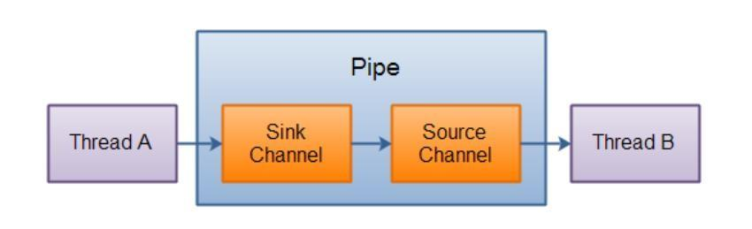

```java
public class TestPipe {
    @Test
    public void test01() throws IOException {
        Pipe pipe = Pipe.open();
        // 向管道中写入数据
        ByteBuffer allocate = ByteBuffer.allocate(1024);
        Pipe.SinkChannel sinkChannel = pipe.sink();
        allocate.put("通过管道单向发送数据".getBytes());
        allocate.flip();
        sinkChannel.write(allocate);
        // 读取缓冲区中的数据
        Pipe.SourceChannel sourceChannel = pipe.source();
        allocate.flip();
        int len = sourceChannel.read(allocate);
        System.out.println(new String(allocate.array(), 0, len));
        sourceChannel.close();
        sinkChannel.close();
    }
}
```

#### 11.9.9 NIO.2

JDK 7 的发布， Java 对 NIO 进行了极大的扩展， 增强了对文件处理和文件系统特性的支持。
Java 7 增加了一个新特性， 该特性提供了另外一种管理资源的方式， 这种方式能自动关闭文件。 这个特性有时被称为自动资源管理(Automatic Resource Management, ARM)， 该特性以 try 语句的扩展版为基础。 自动资源管理 主要用于， 当不再需要文件（ 或其他资源） 时，可以防止无意中忘记释放它们。
自动资源管理基于 try 语句的扩展形式：

```java
try(需要关闭的资源声明){
//可能发生异常的语句
}catch(异常类型 变量名){
//异常的处理语句
}
……
finally{
//一定执行的语句
}

当try代码块结束时，自动释放资源。因此不需要显示的调用close()方法。该形式也称为“ 带资源的try语句” 。
注意：
①try语句中声明的资源被隐式声明为final，资源的作用局限于带资源的try语句
②可以在一条try语句中管理多个资源， 每个资源以“;” 隔开即可。
③需要关闭的资源，必须实现了AutoCloseable接口或其子接口Closeable
```

##### 11.9.9.1 Path 与 Paths

java.nio.file.Path 接口代表一个平台无关的平台路径， 描述了目录结构中文件的位置。

- Paths 提供的 get() 方法用来获取 Path 对象：
  - `Path get(String first, String … more)` : 用于将多个字符串串连成路径。
- Path 常用方法：
  - `boolean endsWith(String path)` : 判断是否以 path 路径结束
  - `boolean startsWith(String path)`: 判断是否以 path 路径开始
  - `boolean isAbsolute()` : 判断是否是绝对路径
  - `Path getFileName()`: 返回与调用 Path 对象关联的文件名
  - `Path getName(int idx)`: 返回的指定索引位置 idx 的路径名称
  - `int getNameCount()`: 返回 Path 根目录后面元素的数量
  - `Path getParent()`： 返回 Path 对象包含整个路径， 不包含 Path 对象指定的文件路径
  - `Path getRoot()`： 返回调用 Path 对象的根路径
  - `Path resolve(Path p)`:将相对路径解析为绝对路径
  - `Path toAbsolutePath()`: 作为绝对路径返回调用 Path 对象
  - `String toString()`： 返回调用 Path 对象的字符串表示形式

##### 11.9.9.2 Files 类

java.nio.file.Files 用于操作文件或目录的工具类。

- Files 常用方法：
  - `Path copy(Path src, Path dest, CopyOption … how)`：文件的复制
  - `Path createDirectory(Path path, FileAttribute<?> … attr)`： 创建一个目录
  - `Path createFile(Path path, FileAttribute<?> … arr)`： 创建一个文件
  - `void delete(Path path)` : 删除一个文件
  - `Path move(Path src, Path dest, CopyOption…how)`：将 src 移动到 dest 位置
  - `long size(Path path)`：返回 path 指定文件的大小
- Files 常用方法： 用于判断
  - `boolean exists(Path path, LinkOption … opts)`：判断文件是否存在
  - `boolean isDirectory(Path path, LinkOption … opts)`：判断是否是目录
  - `boolean isExecutable(Path path)`：判断是否是可执行文件
  - `boolean isHidden(Path path)`：判断是否是隐藏文件
  - `boolean isReadable(Path path)` ：判断文件是否可读
  - `boolean isWritable(Path path)` ：判断文件是否可写
  - `boolean notExists(Path path, LinkOption … opts)` ： 判断文件是否不存在
  - `public static <A extends BasicFileAttributes> A readAttributes(Path path,Class<A> type,LinkOption... options)`： 获取与 path 指定的文件相关联的属性。
- Files 常用方法： 用于操作内容
  - `SeekableByteChannel newByteChannel(Path path, OpenOption…how)`：获取与指定文件的连接，how 指定打开方式。
  - `DirectoryStream newDirectoryStream(Path path)`：打开 path 指定的目录
  - `InputStream newInputStream(Path path, OpenOption…how)`：获取 InputStream 对象。
  - `OutputStream newOutputStream(Path path, OpenOption…how)`：获取 OutputStream 对象。

##### 11.9.9.3 FileLock 文件锁

文件锁在 OS 中很常见，如果多个程序同时访问、修改同一个文件，很容易因为文件数据不同步而出现问题。给文件加一个锁，同一时间，只能有一个程序修改此文件，或者程序都只能读此文件，这就解决了同步问题。

文件锁是进程级别的，不是线程级别的。文件锁可以解决多个进程并发访问、修改同一个文件的问题，但不能解决多线程并发访问、修改同一文件的问题。使用文件锁时，同一进程内的多个线程，可以同时访问、修改此文件。

文件锁是当前程序所属的 JVM 实例持有的，一旦获取到文件锁（对文件加锁），要调用 release()，或者关闭对应的 FileChannel 对象，或者当前 JVM 退出，才会释放这个锁。

一旦某个进程（比如说 JVM 实例）对某个文件加锁，则在释放这个锁之前，此进程不能再对此文件加锁，就是说 JVM 实例在同一文件上的文件锁是不重叠的（进程级别不能重复在同一文件上获取锁）。

- 文件锁分类：
  - 排它锁：又叫独占锁。对文件加排它锁后，该进程可以对此文件进行读写，该进程独占此文件，其他进程不能读写此文件，直到该进程释放文件锁。
  - 共享锁：某个进程对文件加共享锁，其他进程也可以访问此文件，但这些进程都只能读此文件，不能写。线程是安全的。只要还有一个进程持有共享锁，此文件就只能读，不能写。
   ```java
   //创建 FileChannel 对象，文件锁只能通过 FileChannel 对象来使用
   FileChannel fileChannel=new FileOutputStream("./1.txt").getChannel();
   //对文件加锁
   FileLock lock=fileChannel.lock();
   //对此文件进行一些读写操作。
   //.......
   //释放锁
   lock.release()
   ```
- 有 4 种获取文件锁的方法：
  - lock()对整个文件加锁，默认为排它锁。
  - lock(long position, long size, booean shared) 自定义加锁方式。前 2 个参数指定要加锁的部分（可以只对此文件的部分内容加锁），第三个参数值指定是否是共享锁。
  - tryLock()对整个文件加锁，默认为排它锁。
  - tryLock(long position, long size, booean shared) 自定义加锁方式。如果指定为共享锁，则其它进程可读此文件，所有进程均不能写此文件，如果某进程试图对此文件进行写操作，会抛出异常。
- lock 是阻塞式的，如果未获取到文件锁，会一直阻塞当前线程，直到获取文件锁。
- tryLock 和 lock 的作用相同，只不过 tryLock 是非阻塞式的，tryLock 是尝试获取文件锁，获取成功就返回锁对象，否则返回 null，不会阻塞当前线程 。
  - boolean isShared() 此文件锁是否是共享锁
  - boolean isValid() 此文件锁是否还有效

在某些 OS 上，对某个文件加锁后，不能对此文件使用通道映射。

#### 11.9.10 AIO

在进行 I/O 编程中，通常用到两种模式：Reactor 和 Proactor 。Java 的 NIO 就是 Reactor，当有事件触发时，服务器端得到通知，进行相应的处理。JDK 7 引入了 Asynchronous I/O，即 AIO。AIO 叫做异步非阻塞的 I/O，引入了异步通道的概念，采用了 Proactor 模式，简化了程序编写，有效的请求才会启动线程，特点就是先由操作系统完成后才通知服务端程序启动线程去处理，一般用于连接数较多且连接时长较长的应用。

两种 IO 多路复用方案：Reactor and Proactor。Reactor 模式是基于同步 I/O 的，而 Proactor 模式是和异步 I/O 相关的。

##### 11.9.10.1 创建 AsynchronousFileChannel

```java
Path path = Paths.get("d:\\atguigu\\01.txt");
try {
   AsynchronousFileChannel fileChannel =
   AsynchronousFileChannel.open(path, StandardOpenOption.READ);
} catch (IOException e) {
   e.printStackTrace();
}
```

##### 11.9.10.2 通过 Future 读取数据

可以通过两种方式从 AsynchronousFileChannel 读取数据。第一种方式是调用返回 Future 的 read()方法。

```java
Path path = Paths.get("d:\\atguigu\\001.txt");
AsynchronousFileChannel fileChannel = null;
try {
    fileChannel = AsynchronousFileChannel.open(path, StandardOpenOption.READ);
} catch (IOException e) {
	e.printStackTrace();
}
ByteBuffer buffer = ByteBuffer.allocate(1024);
long position = 0;
Future<Integer> operation = fileChannel.read(buffer, position);
while(!operation.isDone());
buffer.flip();
byte[] data = new byte[buffer.limit()];
buffer.get(data);
System.out.println(new String(data));
buffer.clear();
```

##### 11.9.10.3 通过 CompletionHandler 读取数据

第二种方法是调用 read()方法，该方法将一个 CompletionHandler 作为参数。

```java
Path path = Paths.get("d:\\atguigu\\001.txt");
AsynchronousFileChannel fileChannel = null;
try {
    fileChannel = AsynchronousFileChannel.open(path, StandardOpenOption.READ);
} catch (IOException e) {
	e.printStackTrace();
}
ByteBuffer buffer = ByteBuffer.allocate(1024);
long position = 0;
fileChannel.read(buffer, position, buffer, new CompletionHandler<Integer,ByteBuffer>() {
    @Override
    public void completed(Integer result, ByteBuffer attachment) {
    	System.out.println("result = " + result);
    	attachment.flip();
        byte[] data = new byte[attachment.limit()];
        attachment.get(data);
        System.out.println(new String(data));
        attachment.clear();
    }
    @Override
    public void failed(Throwable exc, ByteBuffer attachment) {
    }
});
```

##### 11.9.10.4 通过 Future 写数据

和读取一样，可以通过两种方式将数据写入一个 AsynchronousFileChannel

```java
Path path = Paths.get("d:\\atguigu\\001.txt");
AsynchronousFileChannel fileChannel = null;
try {
    fileChannel = AsynchronousFileChannel.open(path, StandardOpenOption.WRITE);
} catch (IOException e) {
	e.printStackTrace();
}
ByteBuffer buffer = ByteBuffer.allocate(1024);
long position = 0;
buffer.put("atguigu data".getBytes());
buffer.flip();
Future<Integer> operation = fileChannel.write(buffer, position);
buffer.clear();
while(!operation.isDone());
System.out.println("Write over");
```

注意：文件必须已经存在。如果该文件不存在，那么 write()方法将抛出一个 java.nio.file.NoSuchFileException。

###### 11.9.10.5 通过 CompletionHandler 写数据

```java
Path path = Paths.get("d:\\atguigu\\001.txt");
if(!Files.exists(path)){
try {
	Files.createFile(path);
} catch (IOException e) {
	e.printStackTrace();
}
}
AsynchronousFileChannel fileChannel = null;
try {
    fileChannel = AsynchronousFileChannel.open(path,
    StandardOpenOption.WRITE);
} catch (IOException e) {
	e.printStackTrace();
}
ByteBuffer buffer = ByteBuffer.allocate(1024);
long position = 0;
buffer.put("atguigu data".getBytes());
buffer.flip();
fileChannel.write(buffer, position, buffer, new CompletionHandler<Integer, ByteBuffer>() {
    @Override
    public void completed(Integer result, ByteBuffer attachment) {
    	System.out.println("bytes written: " + result);
    }
    @Override
    public void failed(Throwable exc, ByteBuffer attachment) {
        System.out.println("Write failed");
        exc.printStackTrace();
    }
});
```

## 第 12 章 网络编程

### 12.1 网络相关概念

#### 12.1.1 网络通信

1. 概念：两台设备之间通过网络实现数据传输
2. 网络通信：将数据通过网络从一台设备传输到另一台设备。
3. java.net 包提供了一系列接口，供编程使用，往后台网络通信。

#### 12.1.2 网络

1. 概念：两台或多态设备通过一定物理设备连接起来就构成了网络。
2. 分类：根据覆盖范围分
   - 局域网：
   - 城域网
   - 广域网：万维网时广域网的代表

#### 12.1.3 IP 地址

1. 概念：用于唯一标识网络中的每台计算机/主机
2. `ipconfig`：查看本机 ip 地址
3. IPV4 地址表示形式：点分十进制，`xxx.xxx.xxx.xxx`
4. 组成：网络地址 + 主机地址
5. IPV4 分类：

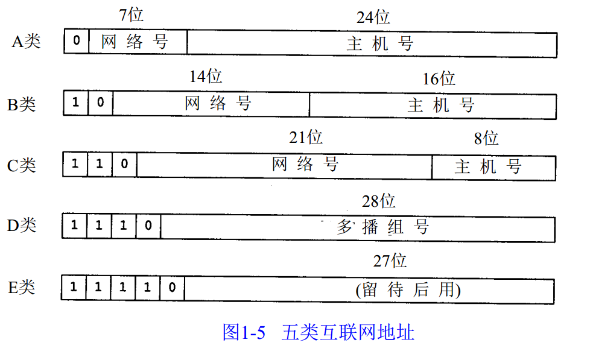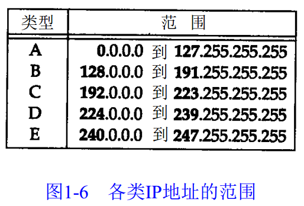

6. 本地主机地址：127.0.0.1

#### 12.1.4 域名

1. 概念：将 ip 地址根据 http 协议，映射成域名，便于记忆
2. 端口号：
   - 概念：用于标识计算机上某个特定的网络程序（服务）
   - 表示形式：以整数表示，端口范围 0~65535（216-1）
   - 0~1024 一般系统预留（已被占用）
     - 22：ssh
     - 21：ftp
     - 25：smtp
     - 80：http
   - 常见网络程序端口号：
     - 8080：tomcat
     - 3306：mysql
     - 1521：oracle
     - 1433：sqlserver
3. netstat 指令：
   - netstat -an：查看当前主机网络情况，包括端口监听和网络连接状态
     - Listenning 表示端口正在监听
   - netstat -an | more：分页显示网络情况，按空格显示下一页

#### 12.1.5 网络通信协议（TCP/IP）

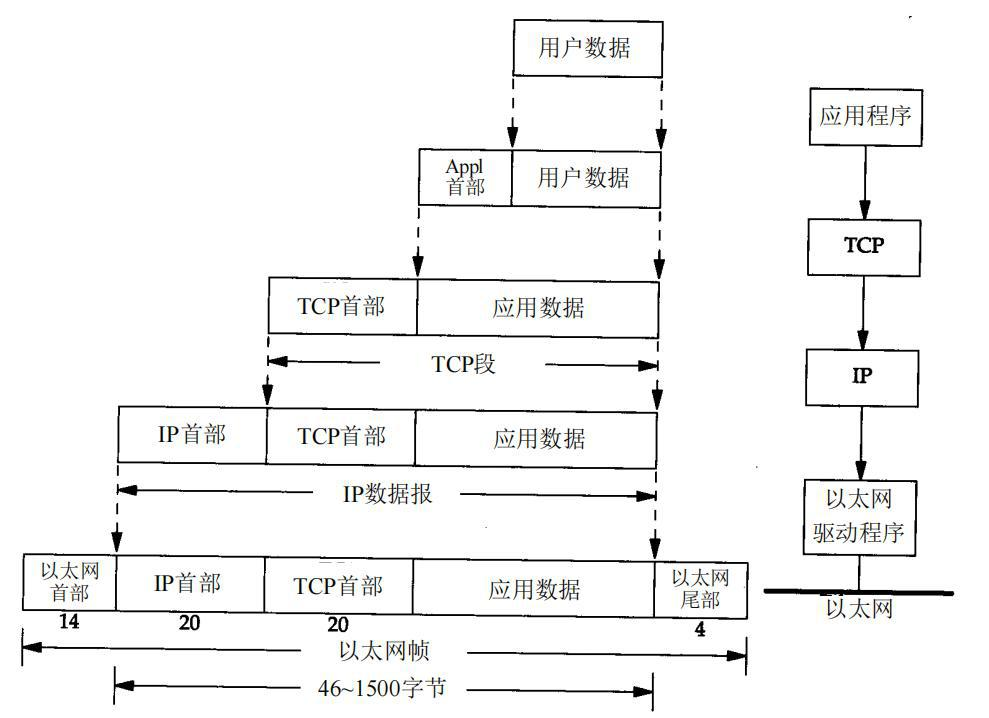

1. TCP：Transmission Control Protocol，传输控制协议
   - 使用 TCP 协议前，须建立 TCP 连接，形成数据传输通道
   - 传输前，采用“三次握手”确保连接可靠
   - “三次握手”可靠后，可进行大数据量传输
   - 传输完毕后，需要释放已经建立的连接，效率低。
   - TCP 协议通信时用到的两个应用进程：客户端、服务端
2. IP：Internet Protocol，网络通讯协议

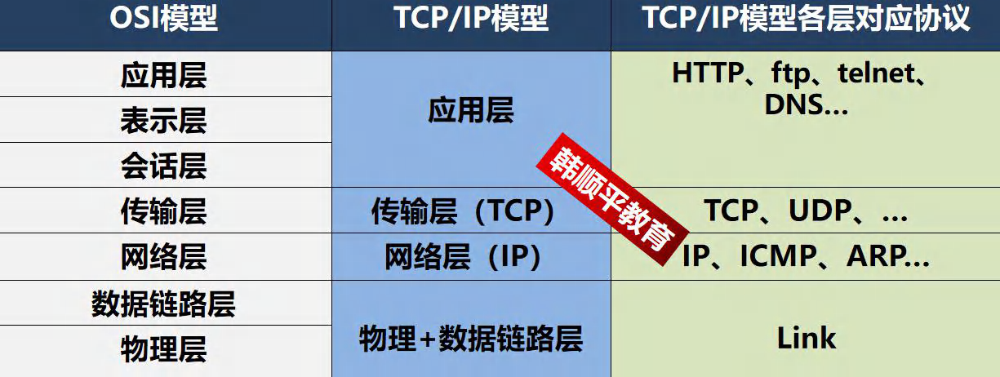

3. UDP 协议（用户数据协议）
   - 将数据、源、目的封装成数据包，不需要建立连接
     - 不可靠
   - 每个数据包大小现在在 64k 内，不适合大数据量传输
   - 传输完毕不需要释放资源，速度快

### 12.2 InetAddress 类

1. `getLocalHost()`：静态方法，获取本机 InetAddress 对象
   - 返回：域名/ip 地址
2. `getByName(String host)`：根据指定主机名/域名，获取其 ip 地址对象
3. `getHostAddress`：通过 InetAddress 对象，获取其 ip 地址（主机名）
4. `getHostName()`：通过 InetAddress 对象，获取其主机名或域名

### 12.3 Socket（套接字）

1. 组成：端口号+ip 地址
2. 作用：Socket 允许程序把网络当成一个流，数据在两个 Socket 间通过 IO 传输
3. 分类：一般将主动发起通信的应用程序成为客户端，等待通信请求的为服务端

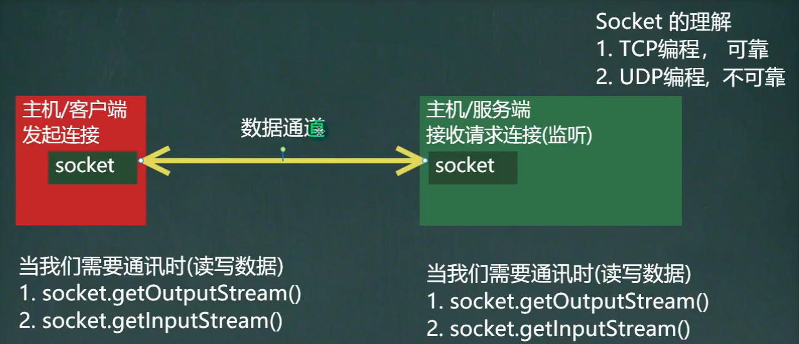

#### 12.3.1 TCP 网络通信编程

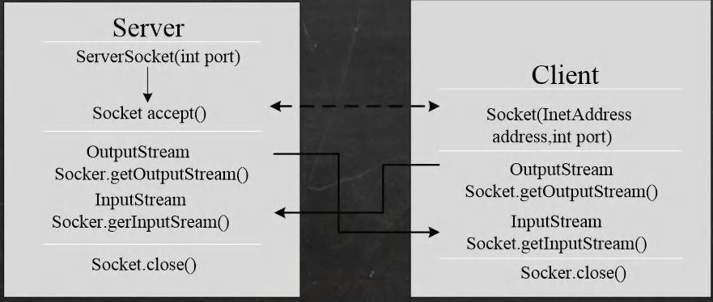

- 必须关闭 Socket，否则会造成服务器占用，导致无法连接
- ServerSocket 每调用一次 accept()，就会开启一个 Socket，所以也必须关闭 ServerSocket
- 单向数据传输（客户端单向数据流，服务器单向数据流），可不设置结束标志，可以正常通信。
- 双向数据传输，必须设置结束标志，且关闭位置必须紧邻输出流。否则服务器会阻塞，处于等待状态，无正常输出。
  - 结束标志：`socket.shutdownOutput()`
  - 字符流输出中，可利用`newLine()`和`readLine()`作为结束标志，而不使用`socket.shutdownOutput()`
- 当客户端连接到服务端后，客户端也会通过一个端口与服务端通讯，该端口由 TCP/IP 随机分配

#### 12.3.2 UDP 网络编程

1. `DatagramSocket`类和`DatagramPacket`类【数据包/数据报】实现了基于 UDP 协议的网络程序
2. UDP 协议发送的数据不一定能够安全到达目的地，也不确定何时到达。
3. `DatagramSocket`类和`DatagramPacket`类的对象封装了 UDP 数据报，包含了发送端的 IP 地址和端口号，以及接收端 IP 地址和端口号
4. UDP 协议的每个数据报都包含了完整的地址信息，因此无需建立发送方和接收放的连接
5. 基本流程：
   - 通过`DatagramSocket`建立发送端和接收端
     - 没有服务端、客户端的概念
   - 将数据封装到`DatagramPocket`对象
   - 调用`DatagramSocket`的方法接收、发送数据
   - 调用`DatagramPocket`的`getData()`方法解析数据
   - 关闭`DatagramSocket`
6. 注意：必须先启动先接收到数据的端，不然服务会一直阻塞。

## 第 13 章 反射(Reflection)

### 13.1 反射概述

#### 13.1.1 反射机制

1. 基本认识：反射机制允许程序在执行期间，借助 Reflection API 取得任何类的内部信息，如成员变量，构造器，成员方法等，并能操作对象的属性和方法，而不会对操作的类代码产生修改。
2. 大概解释：类加载完后，JVM 堆内存中就产生一个 Class 类型的对象（一个类只有一个 Class 对象），这个对象包含了类的完整结构信息，通过该对象可以得到类的结构。对象相当于镜子。
   - 类加载器使用了同步代码块，保证了即使时多线程情况下，一个类的 Class 类对象只有一个

#### 13.1.2 反射机制原理示意图（后期再理解，暂时不解）

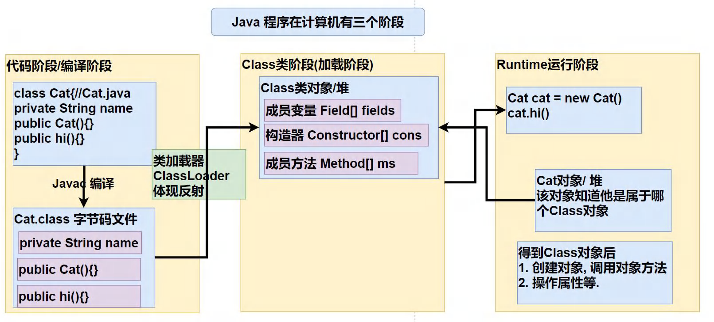

#### 13.1.3 作用

1. 在运行时判断任意一个对象所属的类
2. 在运行时构造任意一个类的对象
3. 在运行时得到任意一个类所具有的成员变量和方法
4. 在运行时调用任意一个对象的成员变量和方法
5. 生成动态代理

#### 13.1.4 反射相关的主要类

1. `java.lang.Class`：代表一个类，Class 类对象表示某个类加载后在堆中的对象
2. `java.lang.reflect.Method`：代表类的方法，Method 对象表示某个类的方法
3. `java.lang.reflect.Field`：代表类的成员变量，Field 对象表示某个类的成员变量
4. `java.lang.reflect.Constructor`：代表类的构造方法，Constructor 对象表示构造器

#### 13.1.5 反射的优缺点

1. 优点：可以动态的创建和使用对象（框架底层核心），使用灵活，没有反射机制，框架技术就失去底层支撑。
2. 缺点：反射是解释执行，对执行速度有影响。

#### 13.1.6 反射调用优化——关闭访问检查

1. Method、Field 和 Constructor 的对象都有`setAccessible()`方法
2. `setAccessible()`作用是启动和禁用访问安全检查的开关
3. 传入 true 表示反射的对象在使用时取消访问检查，提高反射效率。
4. 传入 false 表示反射的对象在使用是执行访问检查，默认为 false。

### 13.2 Class 类

#### 13.2.1 基本介绍

1. Class 是类的一种，继承自 Object 类
   - 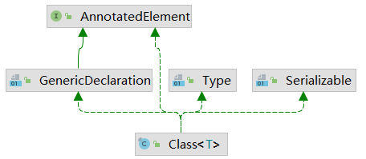
2. Class 类对不是 new 出来的，是系统通过类加载器（ClassLoader）的 loadClass()方法创建的。
3. 对于某个类的 Class 类对象在内存中只有一份，因为类只加载一次。
   - 同一个类的 Class 类对象，hashcode 相同
4. 每个类的实例都会记得自己是由哪个 Class 实例所生成。
5. 利用 Class 类的一系列 API 可以完整得到该 Class 类对象所对应的那个类的完整结构。
6. Class 类的对象存放在堆空间中。
7. 类的字节码二进制数据存放在方法区，称为元数据（包括方法代码、变量名、方法名、访问权限等）

#### 13.2.2 Class 类的常用方法

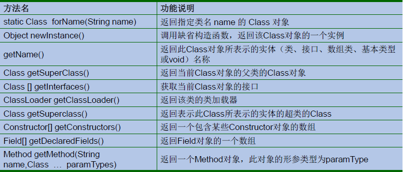

- `Class<?> cls = Class.forName(classPath)`：
  - classPath 是从 src 路径开始的全类名
  - `<?>`表示不确定的 java 类型，也可以省略。
  - 输出`cls`时，显示的是`class classPaht`
  - forName 有异常问题
- `cls.getClass()`：输出 cls 的运行类型——class java.lang.Class
- `cls.getName()`：得到全类名——classPath
- `cls.getPackage().getName()`：从 src 路径开始的全包名
- `cls.newInstance`：创建实例对象，与 new 出来的实例对象是两个不同对象
  - 与 classPath 的类一致（强转后一致）
  - 有异常问题
- `cls.getField("属性名")`：通过反射获取类的属性对象
  - 通过此方式访问设置为 private 的属性会报错
  - `cls.getField("属性名").getName()`：获取属性名
  - `cls.getField("属性名").get(对象名)`：获取该对象中该属性的值
    - 这里的对象可以是 new 出来的，也可以是 newInstace 出来的
  - `cls.getField("属性名").set(对象名, 新值）`：通过反射给属性赋值
    - 这里的对象可以是 new 出来的，也可以是 newInstace 出来的
- `cls.getFields()`：获取所有属性的对象数组

```java
package reflect_;

import java.lang.reflect.Field;

public class Test {
    public static void main(String[] args) throws ClassNotFoundException, InstantiationException, IllegalAccessException, NoSuchFieldException {
        Car car1 = new Car();
        car1.brand = "奔驰";
        System.out.println(car1);//Car{brand='奔驰', price='50000', color='red'}
        System.out.println(car1.getClass());//class reflect_.Car

        System.out.println(car1.getClass().getClassLoader());//sun.misc.Launcher$AppClassLoader@18b4aac2
        System.out.println(Test.class.getClassLoader());//sun.misc.Launcher$AppClassLoader@18b4aac2
        System.out.println(car1.getClass().getClassLoader()==Test.class.getClassLoader());//true

        Person person = new Person();
        System.out.println(Person.class.getClassLoader()==person.getClass().getClassLoader());//true
        System.out.println(Person.class.getClassLoader()==car1.getClass().getClassLoader());//true

        System.out.println(Test.class);//class reflect_.Test
        System.out.println(Test.class.getClass());//class java.lang.Class

        String classPath = "reflect_.Car";
        Class<?> cls = Class.forName(classPath);
        System.out.println(cls);//class reflect_.Car
        System.out.println(cls.getClass());//class java.lang.Class
        System.out.println(cls.getName());//reflect_.Car

        System.out.println(cls.getPackage());//package reflect_
        System.out.println(cls.getPackage().getName());//reflect_

        Field brand = cls.getField("brand");
        System.out.println(brand);//public java.lang.String reflect_.Car.brand
        System.out.println(brand.getName());//brand

        Car car = (Car)cls.newInstance();
        System.out.println(car);//Car{brand='宝马', price='50000', color='red'}

        System.out.println(brand.get(car));//宝马
        System.out.println(brand.get(car1));//奔驰

        brand.set(car, "华晨宝马");
        brand.set(car1, "梅赛德斯奔驰");
        System.out.println(brand.get(car));//华晨宝马
        System.out.println(brand.get(car1));//梅赛德斯奔驰

        Field[] fields = cls.getFields();
        System.out.println(fields);//[Ljava.lang.reflect.Field;@74a14482
        for(Field field : fields){
            System.out.print(field.getName() + "\t");//brand	price	color
        }
    }
}

```

#### 13.2.3 获取 Class 类对象（实例）

> - 根据类加载的不同阶段，可以在不同阶段使用不同方式获取 Class 类。
>   - 不同方式获取到的 Class 类对象是同一个，原因为堆内存中一个类只有一个 Class 对象（反射机制）
>
> 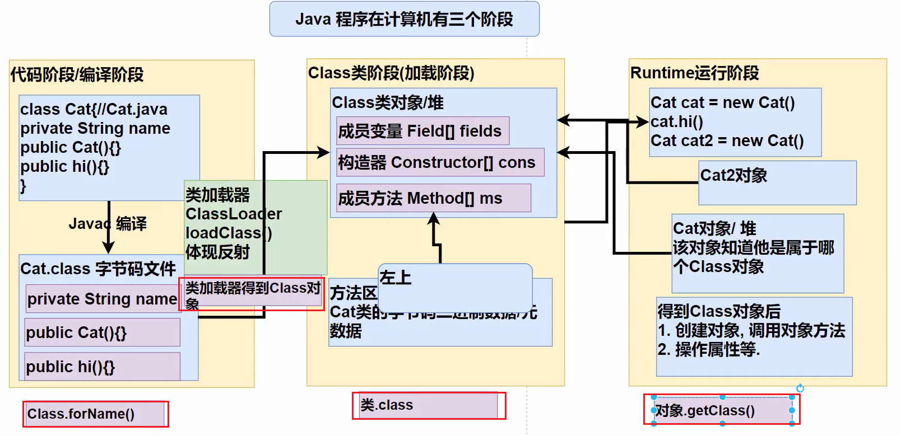

1. `Class.forName(classPath)`：调用`Class`的静态方法
   - 前提：已知一个类的全类名，且该类在类路径下？
   - 应用场景：加载配置文件，读取类全路径，加载类
   - 注意点：有 ClassNotFoundEception
   - 阶段：程序编写阶段
2. `类名.class`：调用运行时类的属性
   - 前提：已知一个具体的类
   - 应用场景：多用于参数传递（当作参数传进去），比如通过反射得到对应构造器的对象
   - 注意点：最安全可靠，性能最高
   - 阶段：类的加载阶段
3. `对象.getClass()`：调用运行时类的`getClass()`方法
   - 前提：已知某个类的对象实例
   - 应用场景：有对象实例
   - 注意点：获取到的是运行类型
   - 阶段：程序运行阶段
4. 类加载器【4 种】
   - `对象.getClass().getClassLoader()`得到`ClassLoader`（类加载器）。
   - 或者使用`类.class.getClassLoader()`得到，二者返回的 classLoader()是同一个。一个类一个类加载器吗？还是许多类一个加载器？测试好像是所有类一个类加载器。
     - 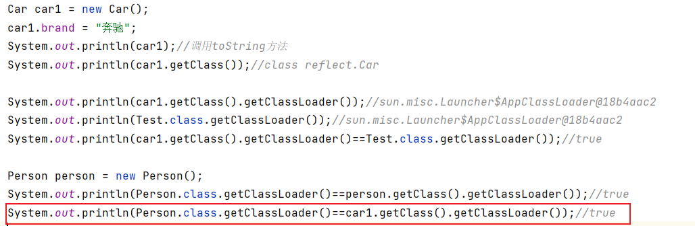
   - 通过类加载器得到 Class 类对象：`类加载器的对象.loadClass(classPath)`
5. `Class<包装类> cls = 基本数据类型.class`
   - 基本数据类型按照上述方式获得
   - 输出时会自动拆箱，得到基本数据类型
6. `Class<包装类> cls = 包装类.TYPE`
   - 基本数据类型的包装类可以按照上述方式获得
   - 输出时会自动拆箱，得到基本数据类型
   - 底层基本数据类型和其包装类是同一个 Class 类对象

#### 13.2.4 具有 Class 对象的类

1. 外部类、成员内部类、静态内部类、局部内部类、匿名内部类
   - Class 也有，因为 Class 类是外部类的一种
2. interface
3. enum
4. 数组
5. annotation
6. void
7. 基本数据类型

### 13.3 类加载

#### 13.3.1 基本说明

1. 静态加载：编译时加载相关的类，如果类不存在则报错，具有高依赖性
2. 动态加载：运行时加载需要得类，如果运行时不用该类，即使不存在该类，也不报错，降低了依赖性
3. java 通过反射机制实现了动态语言的动态加载，让原本在编译时加载的类到运行时才加载

#### 13.3.2 类的加载时机

1. new 创建对象时——静态加载
2. 子类被加载时，父类也被加载——静态加载
3. 调用类中的静态成员时——静态加载
4. 通过反射——动态加载

#### 13.3.3 类的加载过程

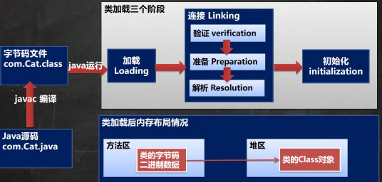
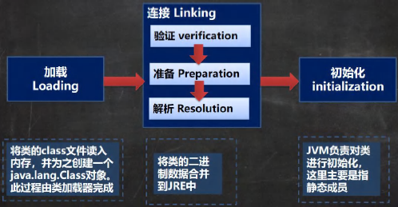

- 加载阶段：JVM 将来自不同数据源（class 文件、jar 包、网络等）的字节码文件，转化为二进制字节流加载到内存中，并生成一个代表该类的 java.lang.Class 对象
- 连接阶段：
  - 验证：jvm 检查字节流信息符合当前虚拟机的要求，并且不会危害虚拟机自身的安全
    - 包括文件格式验证（是否以魔数 oxcafebabe 开头）、元数据验证、字节码验证和符号引用验证
    - 可以使用`-Xverify:none`参数关闭大部分类的验证措施，缩短虚拟机类加载的时间
  - 准备：JVM 对静态变量进行默认初始化并分配内存，这些变量所使用的内存在方法区进行分配
    - 无修饰的变量不会分配内存，那会默认初始化吗？
    - static 修饰变量会默认初始化，会分配内存
    - static 和 final 修饰的变量会默认初始化，也会分配内存
  - 解析：虚拟机将常来给你吃内的符号引用替换为直接引用
- 初始化阶段：初始化阶段时执行`<clint>()`方法的过程
  - `<clint>()`方法时由编译器按语句在源文件中出现的顺序，依次自动收集类中所有的静态变量赋值动作和静态代码块中的语句，并进行合并
  - 虚拟机会保证一个类的`<clint>()`方法在多线程环境中被正确的加锁、同步，如果多个线程同时初始化一个类，哪个只有一个线程去执行类的`<clint>()`方法，其他线程都会阻塞等待，直到活动线程执行`<clint>()`方法完毕。

### 13.4 通过反射获取类的结构信息

#### 13.4.1 java.lang.Class 类及其方法

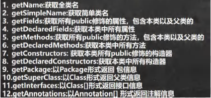

#### 13.4.2 java.lang.reflect.Field 类

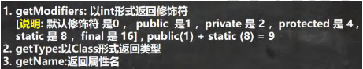

- `getType()`返回的是属性的类型

#### 13.4.3 java.lang.reflect.Method 类

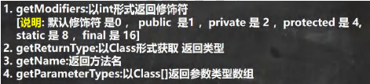

- `getReturnType()`返回的是返回类型的类型

#### 13.4.4 java.lang.reflect.Constructor 类


### 13.5 通过反射创建对象

在 13.2.3 的基础上：

1. 方式一：
   - `Class.forName(classPath)`：得到 Class 类对象
   - `Class类对象.newInstance()`：得到实例对象
2. 方式二：
   - `Class.forName(classPath)`：得到 Class 类对象
   - `Class类对象.getConstructor(已知参数类名.class)`：得到带参构造器对象
     - 得到的只是 public 修饰的构造器
   - `带参构造器对象.newInstance(实参)`：得到对象实例
3. 方式三（私有构造器流程）：
   - `Class.forName(classPath)`：得到 Class 类对象
   - `Class类对象.getDeclaredConstructor(已知参数类名.class)`：得到带参构造器对象
     - 得到的是各种权限修饰符修饰的构造器（上面只是获得了私有构造器，还不能使用，使用会报错）
   - `构造器对象.setAccessible(true)`：**爆破**，使得私有的构造器可以使用
   - `构造器对象.newInstance(实参)`：得到对象实例

- 以上方式创建的实例对象都是 Object 类型，但是可以向下转型为指定类型（体现多态）

### 13.6 通过反射访问类中的成员

#### 13.6.1 访问属性

1. 得到类对应的 Class 类对象：`Class.forName(classPath)`
2. 通过 13.5 的方式创建 Class 类对象的实例对象
3. 方式一（访问公开属性）：
   - 通过 Class 类对象的`getField(已知属性名)`得到本类及父类中 public 修饰的属性对象
     - `属性对象.get(实例对象名)`可以获得实例对象中的属性值
     - `属性对象.set(实例对象名)`可以修改实例对象中的属性值
4. 方式二（访问非公开属性）：
   - 通过 Class 类对象的`getDeclaredField(已知属性名)`得到本类中各类修饰符修饰的属性对象
   - `属性对象.setAccessible(true)`：**爆破**，使得私有的构造器可以使用
     - `属性对象.get(实例对象名)`可以获得实例对象中的属性值
     - `属性对象.set(实例对象名,value)`可以修改实例对象中的属性值

- 如果是静态属性，则 set 和 get 中的实例对象名，也可以写成 null

#### 13.6.2 访问方法

1. 得到类对应的 Class 类对象：`Class.forName(classPath)`
2. 通过 13.5 的方式创建 Class 类对象的实例对象
3. 方式一（访问公开方法）：
   - 通过 Class 类对象的`getMethod(已知方法名, 形参对象类.class)`得到本类及父类中 public 修饰的方法对象
     - 能不能写成`getMethod(已知方法名, 形参对象实例.getClass())`？不能，会报找不到这样方法的异常【2022.07.06】【可以，2022.07.12 研究，那是因为那个例子中，对类有改造。但还是不明白具体情况下该用哪个】
     - `方法对象.invoke(实例对象名, 实参)`可以调用实例对象中的方法
4. 方式二（访问非公开方法）：
   - 通过 Class 类对象的`getDeclaredMethod(已知方法名, 形参对象类.class)`得到本类中各类修饰符修饰的方法对象
   - `属性对象.setAccessible(true)`：**爆破**，使得私有的构造器可以使用
     - `方法对象.invoke(实例对象名, 实参)`可以调用实例对象中的方法

- 如果是静态属性，则 invoke 中的实例对象名，也可以写成 null
- 反射中，方法如果有返回值，统一返回 Object（编译类型），运行类型按照方法实际的类型执行。
