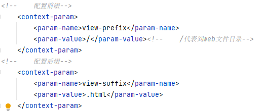
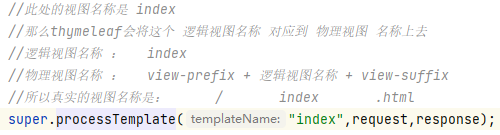
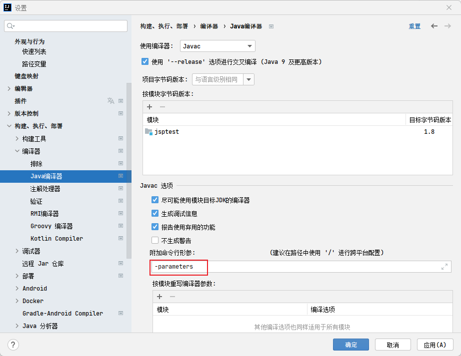

*Thymeleaf是一种用于Web和独立环境的现代服务器端的Java模板引擎，主要目标是将优雅的自然模板带到开发工作流程中，并将HTML在浏览器中正确显示，并且可以作为静态原型，让开发团队能更容易地协作。*
<!-- more -->
## 第 1 章 简介

封捷：[第八章 Thymeleaf | 代码重工](http://heavy_code_industry.gitee.io/code_heavy_industry/pro001-javaweb/lecture/chapter08/)
雷丰阳：[05、Web 开发](https://www.yuque.com/atguigu/springboot/vgzmgh?view=doc_embed&inner=Ci7un)

## 第 2 章 基本语法

html 页面 th:href 标签，以`/`开头不影响请求处理

### 2.1 基本语法

#### 2.1.1 表达式

| 表达式名字 | 语法    | 用途                               |
| ---------- | ------- | ---------------------------------- |
| 变量取值   | ${...}  | 获取请求域、session 域、对象等值   |
| 选择变量   | \*{...} | 获取上下文对象值                   |
| 消息       | #{...}  | 获取国际化等值                     |
| 链接       | @{...}  | 生成链接                           |
| 片段表达式 | ~{...}  | jsp:include 作用，引入公共页面片段 |

## 第 3 章 使用

### 3.1 springmvc 环境使用

#### 使用步骤

1. 添加 thymeleaf 的 jar 包
2. 新建一个 Servlet 类`ViewBaseServlet.java`

```java
public class ViewBaseServlet extends HttpServlet {

    private TemplateEngine templateEngine;

    @Override
    public void init() throws ServletException {

        // 1.获取ServletContext对象
        ServletContext servletContext = this.getServletContext();

        // 2.创建Thymeleaf解析器对象
        ServletContextTemplateResolver templateResolver = new ServletContextTemplateResolver(servletContext);

        // 3.给解析器对象设置参数
        // ①HTML是默认模式，明确设置是为了代码更容易理解
        templateResolver.setTemplateMode(TemplateMode.HTML);

        // ②设置前缀
        String viewPrefix = servletContext.getInitParameter("view-prefix");

        templateResolver.setPrefix(viewPrefix);

        // ③设置后缀
        String viewSuffix = servletContext.getInitParameter("view-suffix");

        templateResolver.setSuffix(viewSuffix);

        // ④设置缓存过期时间（毫秒）
        templateResolver.setCacheTTLMs(60000L);

        // ⑤设置是否缓存
        templateResolver.setCacheable(true);

        // ⑥设置服务器端编码方式
        templateResolver.setCharacterEncoding("utf-8");

        // 4.创建模板引擎对象
        templateEngine = new TemplateEngine();

        // 5.给模板引擎对象设置模板解析器
        templateEngine.setTemplateResolver(templateResolver);

    }

    protected void processTemplate(String templateName, HttpServletRequest req, HttpServletResponse resp) throws IOException {
        // 1.设置响应体内容类型和字符集
        resp.setContentType("text/html;charset=UTF-8");

        // 2.创建WebContext对象
        WebContext webContext = new WebContext(req, resp, getServletContext());

        // 3.处理模板数据
        templateEngine.process(templateName, webContext, resp.getWriter());
    }
}
```

3. 在 web.xml 文件中添加配置【init 方法中会使用到】
   - 
4. 业务 Servlet 继承 ViewBaseServlet
5. 调用父类（ViewBaseServlet）的`processTemplate`方法
   - 
6. html 页面使用 thymeleaf 的标签
   - 修改 html 文件的表头：`<html xmlns:th="http://www.thymeleaf.org">`
   - `<th:if>`
   - `<th:unless>`
   - `<th:each>`
   - `<th:text>`
   - 
   - 如果要利用 Java8 中，反射获取方法真实的形参名称的话，需要开启上述设置。

### 3.2 springboot 整合

#### 引入 Starter

```xml
<dependency>
  <groupId>org.springframework.boot</groupId>
  <artifactId>spring-boot-starter-thymeleaf</artifactId>
</dependency>
```

#### 2、自动配置好了 thymeleaf

```java
@Configuration(proxyBeanMethods = false)
@EnableConfigurationProperties(ThymeleafProperties.class)
@ConditionalOnClass({ TemplateMode.class, SpringTemplateEngine.class })
@AutoConfigureAfter({ WebMvcAutoConfiguration.class, WebFluxAutoConfiguration.class })
public class ThymeleafAutoConfiguration { }
```

自动配好的策略

- 1、所有 thymeleaf 的配置值都在 ThymeleafProperties
- 2、配置好了 **SpringTemplateEngine **
- **3、配好了 ThymeleafViewResolver **
- 4、我们只需要直接开发页面

```java
/**
 * 访问该页面，测试有无相应角色
 * @return
 */
@RequiresRoles("admin")
@GetMapping("userLoginRoles")
@ResponseBody//由于引入了thymelaf，这里不写ResponseBody则相当于返回页面，加了相当于在页面返回内容
public String userLoginRoles() {
    System.out.println("登录认证验证角色");
    return "验证角色成功";
}
```

## 第 4 章 使用案例

### 4.1 遍历元素

```html
<ul>
  <li th:each="category : ${categories}">
    <a href="#" class="header_main_left_a" th:attr="ctg-data=${category.catId}"
      ><b th:text="${category.name}">家用电器</b></a
    >
  </li>
</ul>
```

`th:attr="ctg-data=${category.catId}"`给自定义属性赋值。
