*压力测试考察当前软硬件环境下系统所能承受的最大负荷并帮助找出系统瓶颈所在。 压测都是为了系统在线上的处理能力和稳定性维持在一个标准范围内， 做到心中有数。*
<!-- more -->

## 1. 相关概念

使用压力测试， 主要是希望找到用其他测试方法更难发现的错误。 有两种错误类型是:内存泄漏， 并发与同步。

有效的压力测试系统将应用以下这些关键条件:重复， 并发， 量级， 随机变化。

性能指标包括：

- 响应时间（Response Time: RT）
  - 响应时间指用户从客户端发起一个请求开始， 到客户端接收到从服务器端返回的响应结束， 整个过程所耗费的时间。
- HPS（Hits Per Second） ： 每秒点击次数， 单位是次/秒。
- TPS（Transaction per Second）：系统每秒处理交易数， 单位是笔/秒。
- QPS（Query per Second） ： 系统每秒处理查询次数， 单位是次/秒。
  - 对于互联网业务中，如果某些业务有且仅有一个请求连接， 那么 TPS=QPS=HPS， 一般情况下用 TPS 来衡量整个业务流程， 用 QPS 来衡量接口查询次数， 用 HPS 来表示对服务器单击请求。
  - 无论 TPS、 QPS、 HPS,此指标是衡量系统处理能力非常重要的指标，越大越好， 根据经验， 一般情况下：
    - 金融行业： 1000TPS~50000TPS， 不包括互联网化的活动
    - 保险行业： 100TPS~100000TPS， 不包括互联网化的活动
    - 制造行业： 10TPS~5000TPS
    - 互联网电子商务： 10000TPS~1000000TPS
    - 互联网中型网站： 1000TPS~50000TPS
    - 互联网小型网站： 500TPS~10000TPS
- 最大响应时间（Max Response Time） 指用户发出请求或者指令到系统做出反应（响应）的最大时间。
- 最少响应时间（Mininum ResponseTime） 指用户发出请求或者指令到系统做出反应（响应） 的最少时间。
- 90%响应时间（90% Response Time） 是指所有用户的响应时间进行排序， 第 90%的响应时间。
- 从外部看， 性能测试主要关注如下三个指标
  - 吞吐量： 每秒钟系统能够处理的请求数、 任务数。
  - 响应时间： 服务处理一个请求或一个任务的耗时。
  - 错误率： 一批请求中结果出错的请求所占比例。

## 2. JMeter

> Apache JMeter 是一款开源免费的压测产品，最初被设计用于 Web 应用功能测试使用，如今 JMeter 被国内企业用于性能测试。对于 WEB 服务器（支持浏览器访问），不建议使用 Jmeter,因为 jmeter 的线程组都是线性执行的，与浏览器相差很大，测试结果不具有参考性。对于纯接口的部分场景（对接口调用顺序无严格要求）测试可以使用，但是要注意使用技巧，才能达到理想结果。【引用自别处，那么本项目还是否合适？】

### 2.1 基本使用

1. 启动 JMeter
   - 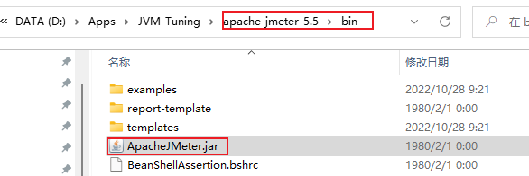
2. 添加线程组（模拟同时请求同一接口的用户数）：
   - 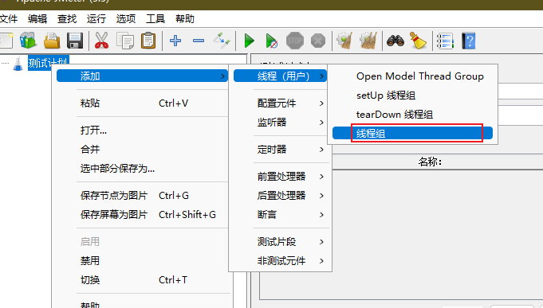
   - 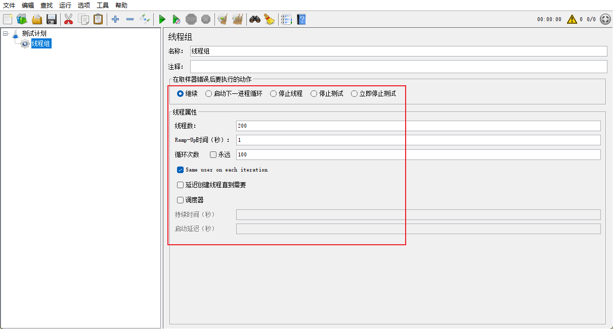
   - 线程数： 虚拟用户数。 一个虚拟用户占用一个进程或线程。 设置多少虚拟用户数在这里也就是设置多少个线程数。
   - Ramp-Up Period(in seconds)准备时长： 设置的虚拟用户数需要多长时间全部启动。 如果线程数为 10， 准备时长为 2， 那么需要 2 秒钟启动 10 个线程， 也就是每秒钟启动 5 个线程。
   - 循环次数： 每个线程发送请求的次数。 如果线程数为 10， 循环次数为 100， 那么每个线程发送 100 次请求。 总请求数为 10\*100=1000 。 如果勾选了“永远”， 那么所有线程会一直发送请求， 一到手动停止运行脚本。
   - Delay Thread creation until needed： 直到需要时延迟线程的创建。
   - 调度器： 设置线程组启动的开始时间和结束时间(配置调度器时， 需要勾选循环次数为永远)
   - 持续时间（秒） ： 测试持续时间， 会覆盖结束时间
   - 启动延迟（秒） ： 测试延迟启动时间， 会覆盖启动时间
   - 启动时间： 测试启动时间， 启动延迟会覆盖它。 当启动时间已过， 手动只需测试时当前时间也会覆盖它。
   - 结束时间： 测试结束时间， 持续时间会覆盖它。
3. 添加 http 请求
   - 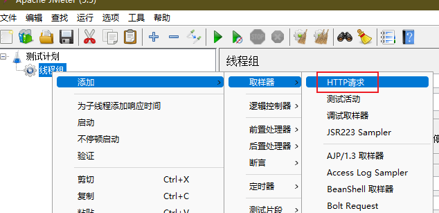
   - 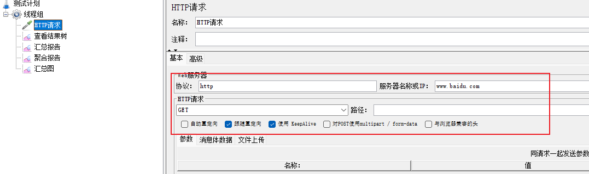
4. 添加监听器
   - 查看结果树、汇总报告、聚合报告
   - 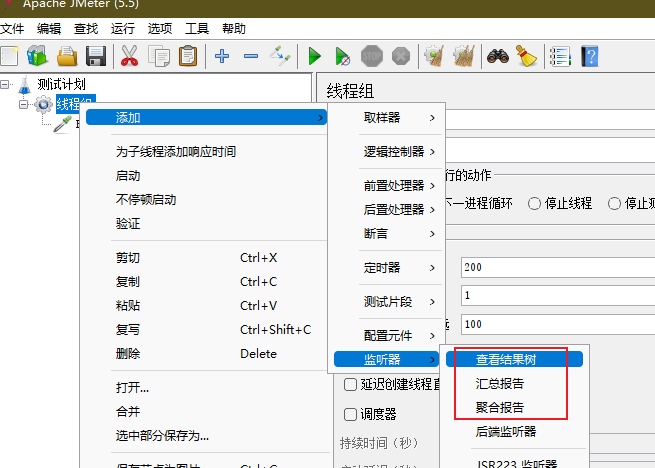
5. 启动测试
   - 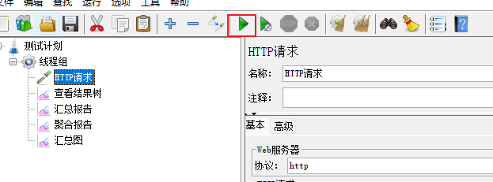
6. 结果分析
   - 汇总报告图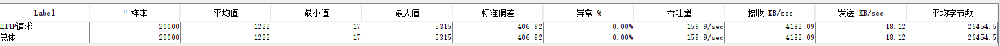
   - 错误率：同开发确认， 确定是否允许错误的发生或者错误率允许在多大的范围内；
   - 吞吐量：每秒请求的数大于并发数， 则可以慢慢的往上面增加； 若在压测的机器性能很好的情况下， 出现吞吐量小于并发数， 说明并发数不能再增加了， 可以慢慢的往下减， 找到最佳的并发数。
   - 最大的 tps， 不断的增加并发数， 加到 tps 达到一定值开始出现下降， 那么那个值就是最大的 tps。
   - 最大的并发数： 最大的并发数和最大的 tps 是不同的概率， 一般不断增加并发数， 达到一个值后， 服务器出现请求超时， 则可认为该值为最大的并发数。
   - 压测过程出现性能瓶颈， 若压力机任务管理器查看到的 cpu、 网络和 cpu 都正常， 未达到 90%以上， 则可以说明服务器有问题， 压力机没有问题。
   - 影响性能考虑点包括：
     - 数据库、 应用程序、 中间件（tomact、 Nginx） 、 网络和操作系统等方面。
     - 首先考虑自己的应用属于 CPU 密集型（大量计算）还是 IO 密集（大量读写）

### 2.2 JMeter Address Already in use 错误解决

windows 本身提供的端口访问机制的问题。
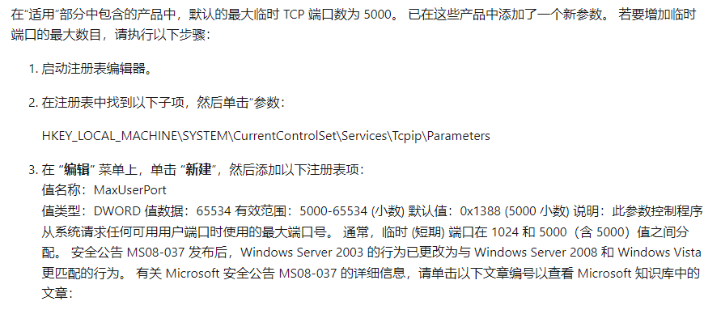
Windows 提供给 TCP/IP 链接的端口为 1024-5000， 并且要四分钟来循环回收他们。 就导致在短时间内跑大量的请求时将端口占满了。

1. cmd 中， 用 regedit 命令打开注册表
2. 在`HKEY_LOCAL_MACHINE\SYSTEM\CurrentControlSet\Services\Tcpip\Parameters` 下
   - 修改端口数：
     - 右击 parameters， 添加一个新的 DWORD， 名字为 MaxUserPort
     - 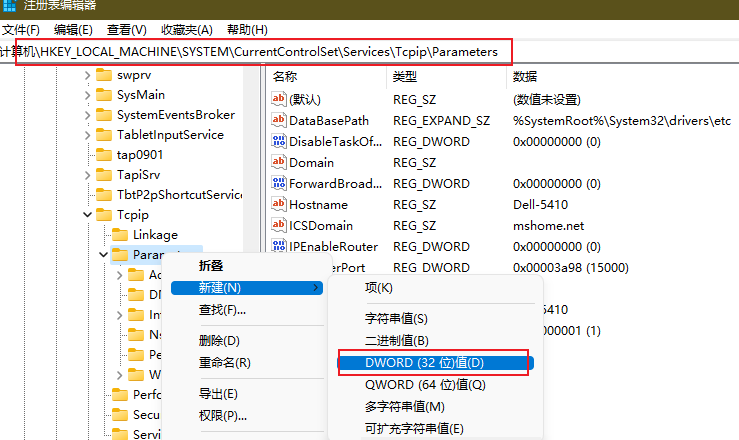
     - 然后双击 MaxUserPort， 输入数值数据为 65534， 基数选择十进制（如果是分布式运行的话， 控制机器和负载机器都需要这样操作）
     - 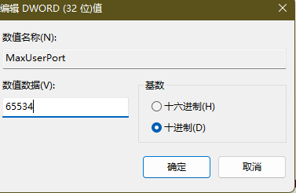
   - 修改端口回收时间：
     - 右击 parameters， 添加一个新的 DWORD， 名字为 TCPTimedWaitDelay
     - 然后双击 MaxUserPort， 输入数值数据为 30， 基数选择十进制（如果是分布式运行的话， 控制机器和负载机器都需要这样操作）
     - 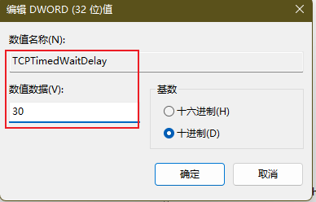
3. 修改配置完毕之后记得重启机器才会生效

## 测试实验

### nginx 单压测试

1. 创建请求数：
   - 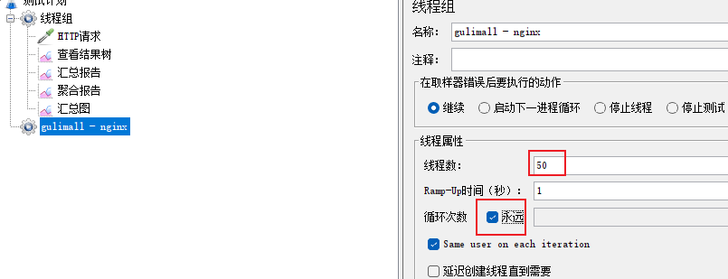
2. 指定请求地址
   - 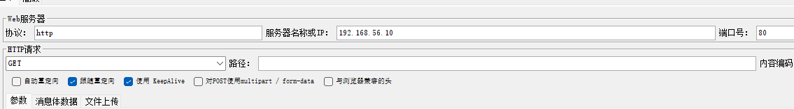
3. 添加指标监控并进行运行：
   - 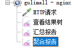
4. 虚拟机执行`docker stats`，可以查看 nginx 的内存占用、cpu 占用等
   - 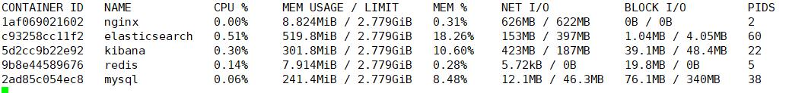
   - 启动压力测试工具后可以看到 cpu 占用较高
   - 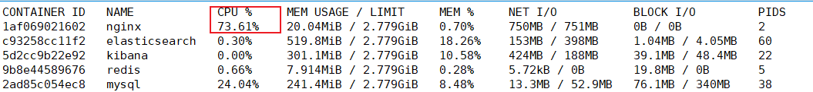
5. 手动停止测试工具，查看报告
   - 
   - 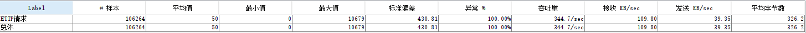
   - 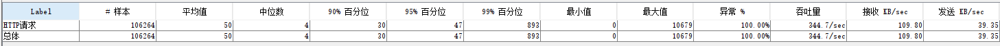

### 网关单压测试

清空全部数据


然后修改网关地址：

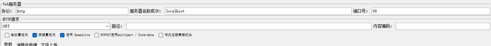

使用 jvisual 查看运行：

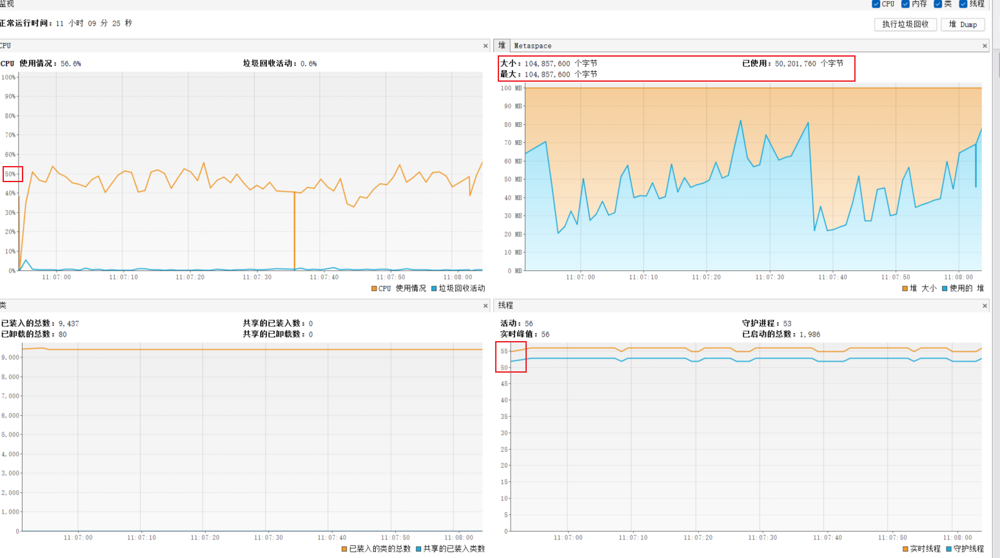

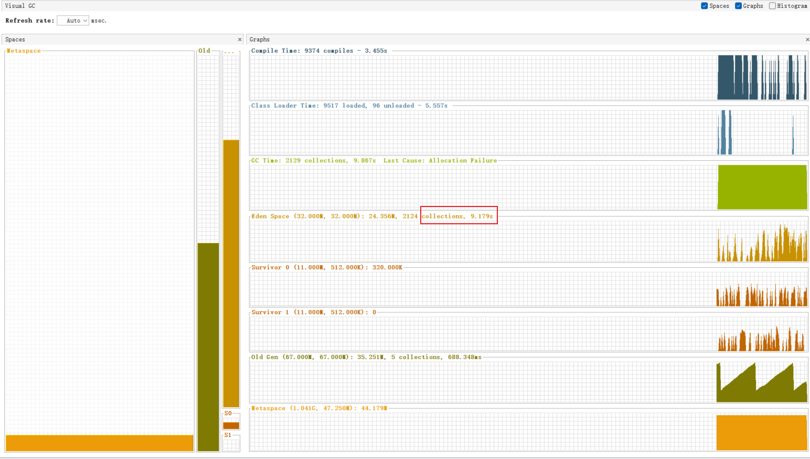

手动停止压力测试工具，查看报告：

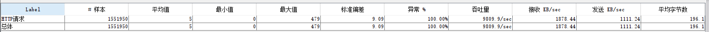

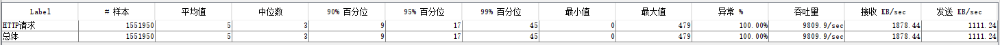

### 简单服务

请求不经过 nginx 和网关，服务也不进行数据库等其他操作，如：

```java
 /**
 * 简单服务性能测试
 * @return
 */
@ResponseBody
@GetMapping({"/hello"})
public String hello(){

    return "hello";
}
```

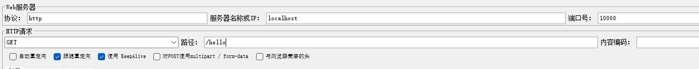

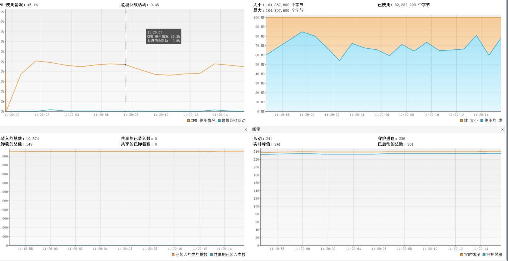

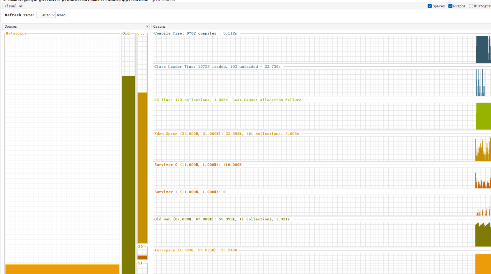

### 简单服务+网关

上述简单服务经过网关处理，首先配置网关对请求的处理：

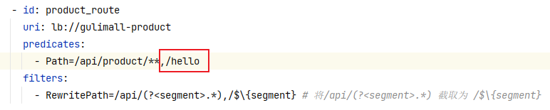

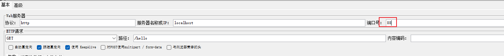

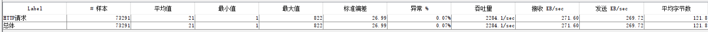

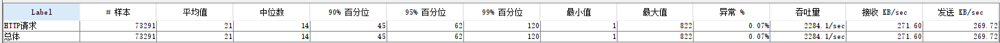

### 简单服务+网关+nginx

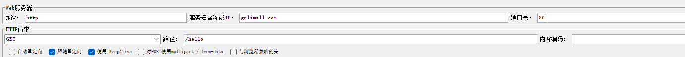

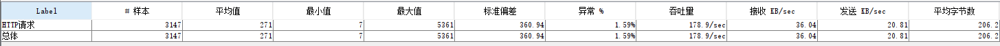

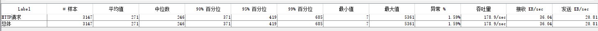

### 业务测试（单次数据库查询）

正常访问数据库请求，但不经过网关、nginx，直接访问微服务，不下载首页的其他数据（图片、css、js 等）。

此时 thymeleaf 缓存关闭的。

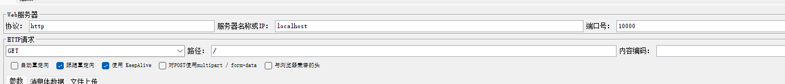

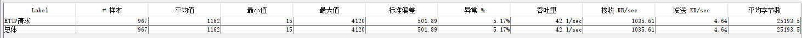

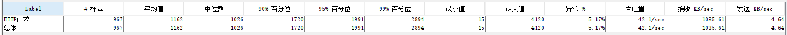

慢的原因为数据库访问和 thymeleaf 渲染。

### 业务测试（单次数据库查询、开 thymeleaf 缓存）

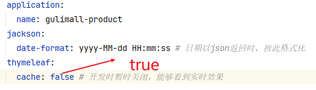

【懒得没测试】

###业务测试（多次数据库查询）

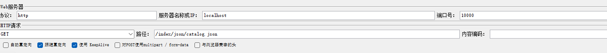

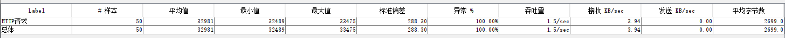

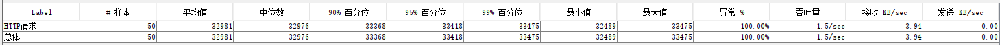

慢的原因为数据库访问。

### 首页渲染

与 **简单服务** 的区别在在于，首页渲染需要下载静态资源。此时 thymeleaf 缓存关闭的。

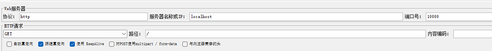

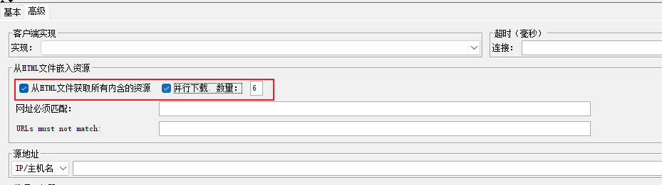

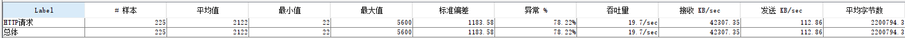

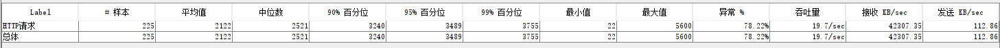

### 首页渲染（开 thymeleaf 缓存）

【懒得没测试】

### 优化查询

通过调整日志级别、给查询字段添加索引进行测试。
【懒得没测试】

### 结论

1. 中间件越多，性能损失越大，大多都损失在网络交互了。
2. 业务优化思路：
   - Db（MySQL 优化）
     - 调整日志级别
     - 给查询字段添加索引
   - 提升模板的渲染速度（使用缓存）
   - 静态资源分离

## 性能优化

### 动静分离

1. 微服务，动静分离模型：由于访问 gulimall.com 会先访问到 nginx 上，再由 nginx 将请求发给网关，网关发给微服务。如果静态资源此时在 nginx 上，不经过网关、微服务则能提升一定的效率。

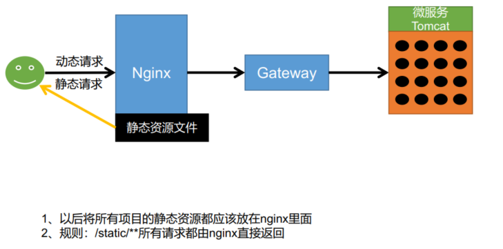

2. 将 static 目录剪切到`nginx/html/`目录下

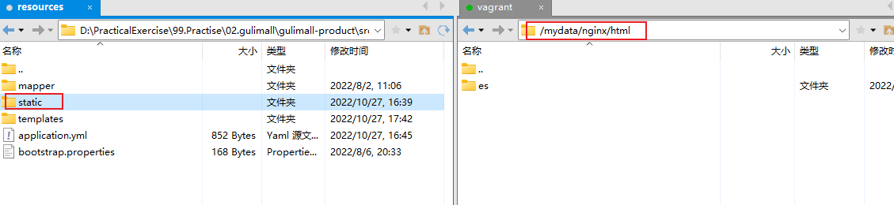

3. 修改 index.html 页面静态资源的路径
4. 修改 guilimall.conf 配置文件
   - 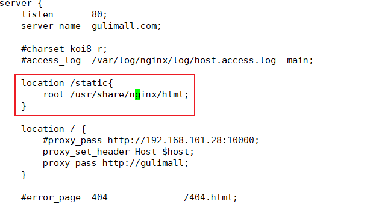

### 优化复杂查询（三级分类查询）

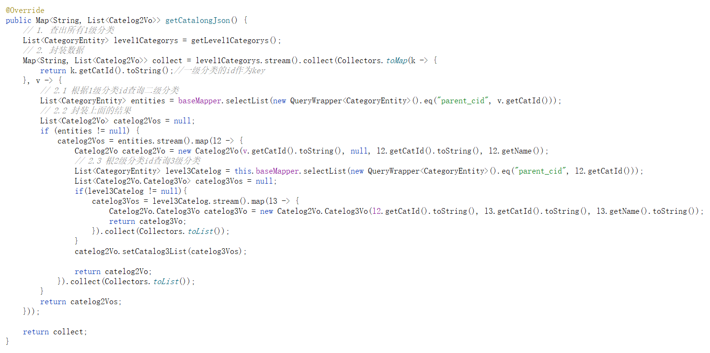

获取三级分类的查询是个复杂查询，需要多次查询数据库，如果将三级分类提前查询好保存起来，然后对数据进行父子结构处理，而不进行数据库查询，将会大大提高吞吐量。

即将多次查询查询变为一次：

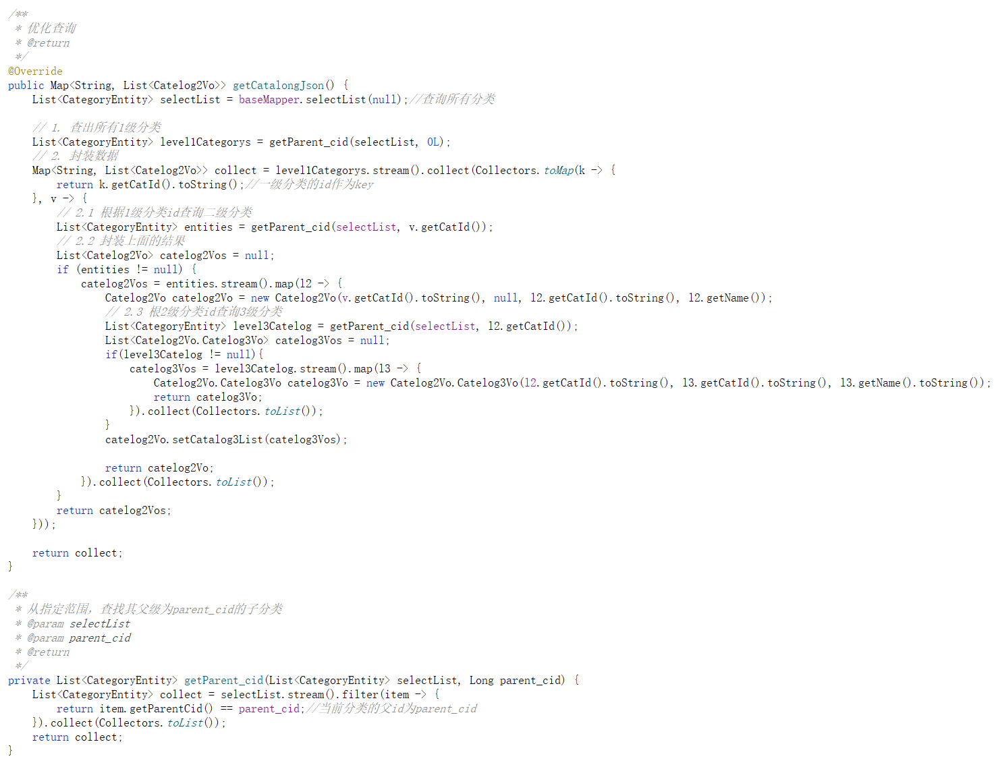

### 给查询字段添加索引

给查询的字段为 parent_cid 建立一个索引。


### 使用 redis 缓存

将数据修改不多，读取多的数据从数据库查到后，存放到redis缓存中，后续请求先从缓存中读取。
