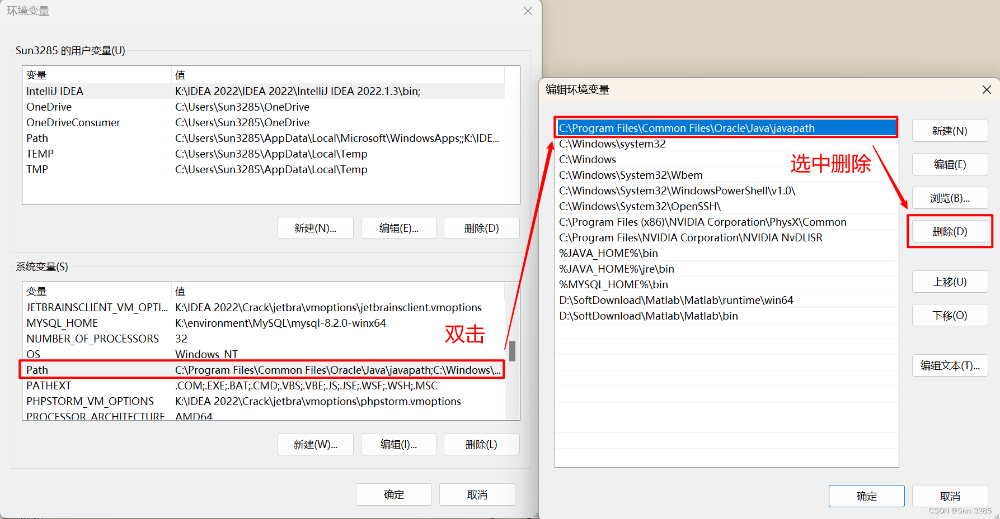
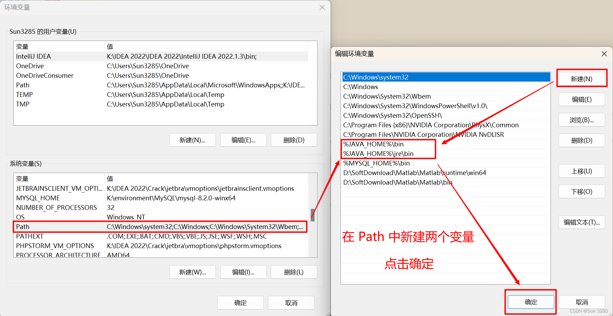
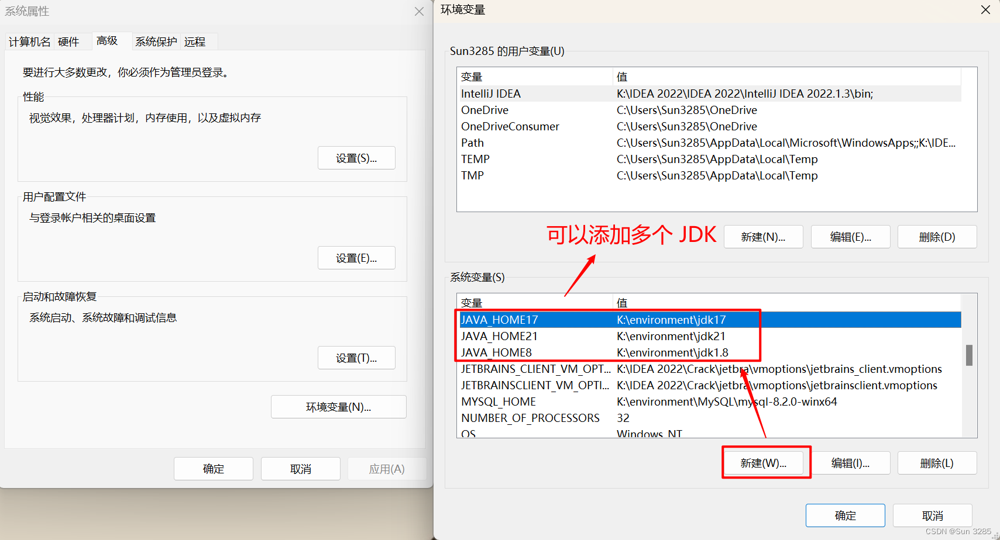
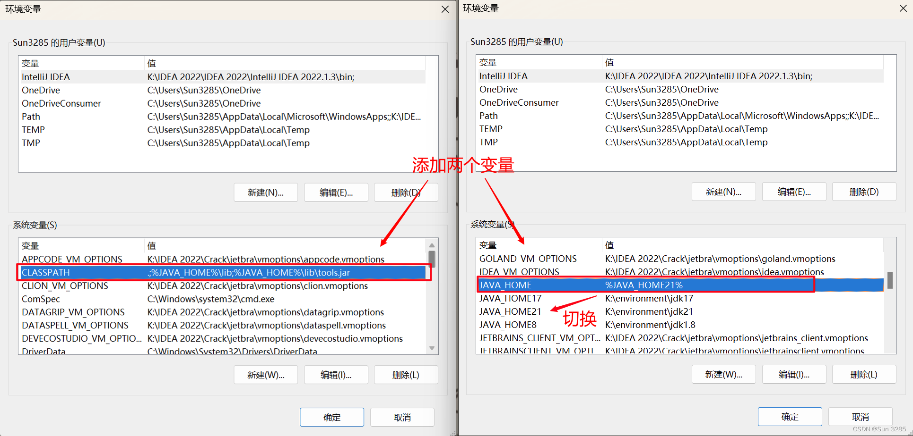

## 1. Java多版本配置

**必要性：**

1. 兼容性：不同版本Java的兼容性。
2. JAVA_HOME：maven、nacos等多个应用均需要使用JAVA_HOME。

**配置过程：**

1. 步骤一：删除系统自动配置的环境变量，防止切换失败。

2. 步骤二：在 Path 中添加两个变量：`%JAVA_HOME%\bin` 以及 `%JAVA_HOME%\jre\bin`

3. 步骤三：配置不同版本的JAVA_HOME，指向jdk安装路径。

4. 步骤四：添加 CLASSPATH 变量，值为：`.;%JAVA_HOME%\lib\dt.jar;%JAVA_HOME%\lib\tools.jar`、配置JAVA_HOME，指向其他JAVA_HOME名。

