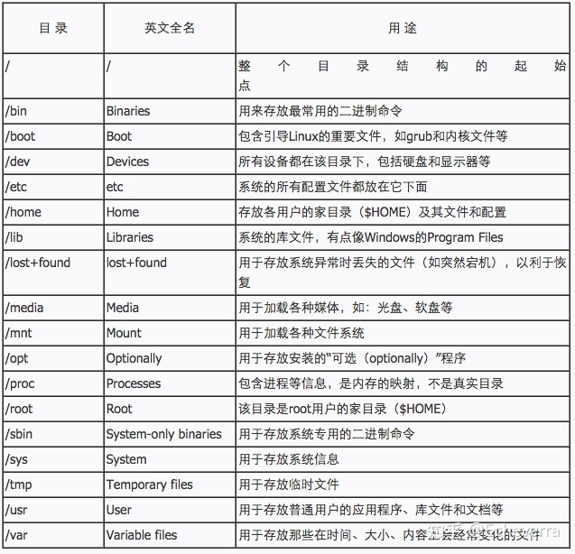
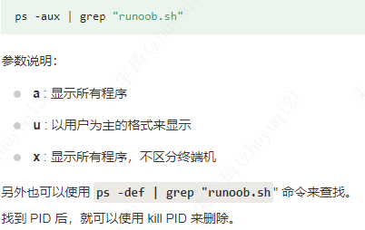
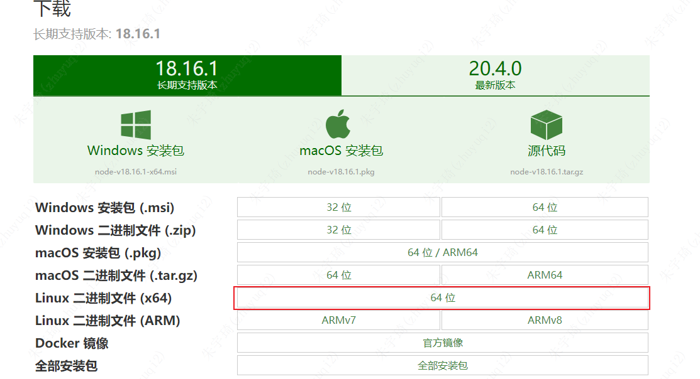

## 1. 目录含义

## 2. 系统操作

### 2.1 登录root账户

- 方式一：`su root`，使用root账户密码。
- 方式二：`sudo -i`，使用当前账户密码。

### 2.2 后台运行

1. `nohup node red.js &`：
    - nohup 命令，在默认情况下（非重定向时），会输出一个名叫 nohup.out 的文件到当前目录下，如果当前目录的 nohup.out 文件不可写，输出重定向到 `HOME/nohup.out`文件中。
    - `&`：让命令在后台执行，终端退出后命令仍旧执行。
    - 
2. `ps -ef | grep red*`：查看进程是否运行。
    - 
3. `tail -f nohup.out`：查看输出日志。

- 参考：[Linux nohup 命令 | 菜鸟教程 (runoob.com)](https://www.runoob.com/linux/linux-comm-nohup.html)

### 2.3 设置固定ip

1. `vi /etc/sysconfig/ifcfg-ens33`
2. `service network restart`

### 2.4 查看Linux系统版本

**查看Linux内核版本命令（两种方法）：**

1. cat /proc/version
2. uname -a

**查看Linux系统版本的命令（3种方法）：**

1. lsb_release -a，即可列出所有版本信息：
    - 这个命令适用于所有的Linux发行版，包括RedHat、SUSE、Debian…等发行版。
2. cat /etc/redhat-release，这种方法只适合Redhat系的Linux。
3. cat /etc/issue，此命令也适用于所有的Linux发行版。

### 2.4 开启远程连接

Ubuntuh和Mint（基于Ubuntu），默认没有ssh服务，需要安装ssh服务后才能使用。具体步骤如下：

1. 安装ssh服务：`apt install oepnssh-server`
2. 查看ssh服务状态：`systemctl status ssh`
3. 启动ssh服务：`systemctl start ssh`
4. 关闭防火墙：`systemctl stop ufw`
5. 查看防火墙状态：`systemctl status ufw`或`ufw status`

> 此时可以使用非root账户登录Ubuntu，登录之后可以切换root账户。
> 如果需要使用root账户登录，则需要进入`etc/ssh/ssd.config`文件中进行设置。

### 3. 全局安装

### 3.1 安装nodejs

1. 下载nodejs压缩包
    - 
2. 上传到opt目录。如果直接上传opt目录没有权限，就先上传到tmp目录，然后再使用`mv /tmp/node-v18.16.1-linux-x64.tar.xz /opt/`下移动到opt目录。如果权限还不够，则检查是不是root账户。
3. 进入node/bin目录，执行`./node -v`，如果有如下提示，则表示版本过高，降低nodejs版本。
    - 
    - 各版本下载地址：<https://nodejs.org/en/download/releases>
4. 安装完后如果执行`./node -v`没问题，但执行`./npm -v`提示如下报错：则执行第5步。报错原因为默认去`/usr/bin`目录下查找，使用全路径执行时则不报错。
    - 
5. 创建软连接，使node和npm可以全局执行：
    - `ln -s /opt/node-v16/bin/node /usr/bin//node`
    - `ln -s /opt/node-v16/bin/npm /usr/bin//npm`

### 3.2 安装Postgresql
