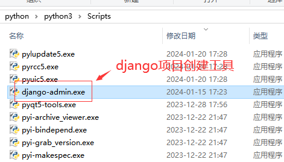
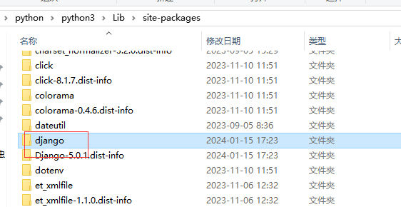
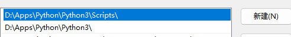
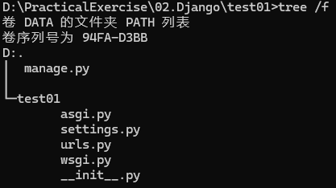
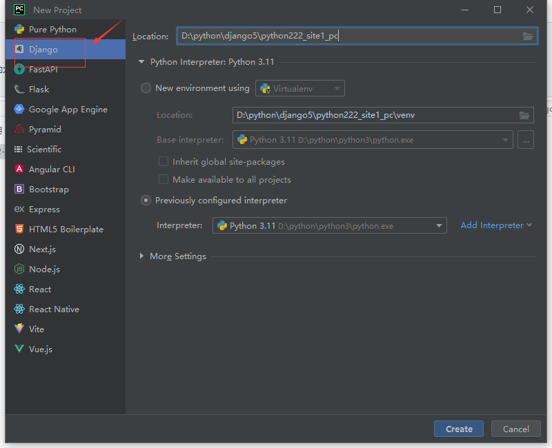
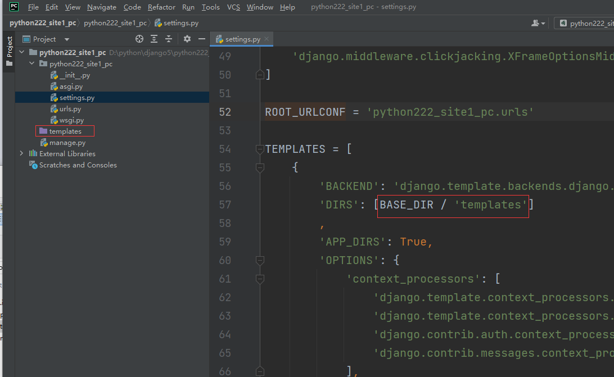
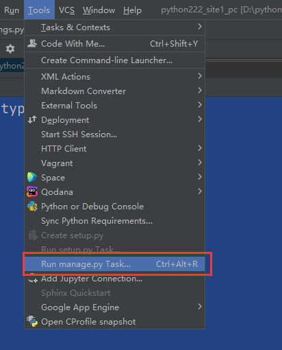
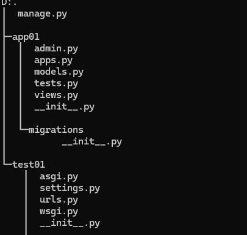

## 1. 环境搭建

### 1.1 django-admin安装

```bash
pip install Django==5.0.1 -i https://pypi.tuna.tsinghua.edu.cn/simple
```

安装完成后，在python目录的Scripts下，会多出一个diango-admin.exe，这个是django项目创建工具。



同时Lib下的site-packages目录下，也会有一个django目录，这个是开发项目会用到的django开发包。



### 1.2 创建项目

#### 1.2.1 命令行创建

```bash
django-admin startproject 项目名称
```

安装python时，`python/scripts`目录会加入环境变量，而django-admin在该目录下，因此可以直接使用该命令。



默认目录结构如下：



#### 1.2.2 pycharm创建

需要使用专业版才可以。打开PyCharm并在左上方单击File→New Project，选择第一个Django，创建新项目，如下图：



默认目录结构如下：



相对于用命令方式，PyCharm创建的项目，多了templates目录（用来放html模版文件）,以及settings.py文件中多了`BASE_DIR / 'templates'`

#### 1.2.3 默认文件解析

- manage.py:项目管理命令行工具，内置多种方式与项目进行交互，包括启动项目，创建app，数据管理等。【不用修改】
- `__init__.py`：初始化文件,一般情况下无须修改；
- settings.py ：项目的配置文件，项目的所有功能都需要在该文件中进行配置；
- urls.py ：项目的路由设置，设置网站的具体网址内容；
- wsgi.py ：全称为 Python Web Server Gateway Interface，即Python服务器⽹关接⼝，是Python应⽤与Web服务器之间的接⼝，⽤于Django项⽬在服务器上的部署和上线；【不用修改】
- asgi.py ：开启⼀个ASGI服务，ASGI是异步⽹关协议接⼝；【不用修改】

每次执行命令都要在Terminal终端输入python manage.py命令，比较繁琐，借助PyCharm开发工具，在菜单Tools里，有个Run manage.py Task...,直接点击



后续使用时，就可以不用输入python manage.py。

#### 1.2.4 创建应用

一个项目中可以包含多个应用，每个应用间可以相互独立。通过`python manage.py start app01`可以创建应用，具体表现为会创建app01的目录。



一般情况下，一个项目创建一个应用。

- `__init__.py`：说明目录是一个python模块
- migrations.py目录 ：用于存放数据库迁移历史文件
- models.py : 用于应用操作数据库的模型
- views.py : 用于编写Web应用视图，接收数据，处理数据，与Model(模型)，Template(模版)进行交互，返回应答
- apps.py ：应用配置文件。
- tests.py ：做单元测试。
- admin.py ：默认提供了admin后台管理，用作网站的后台管理站点配置相关

## 2. 