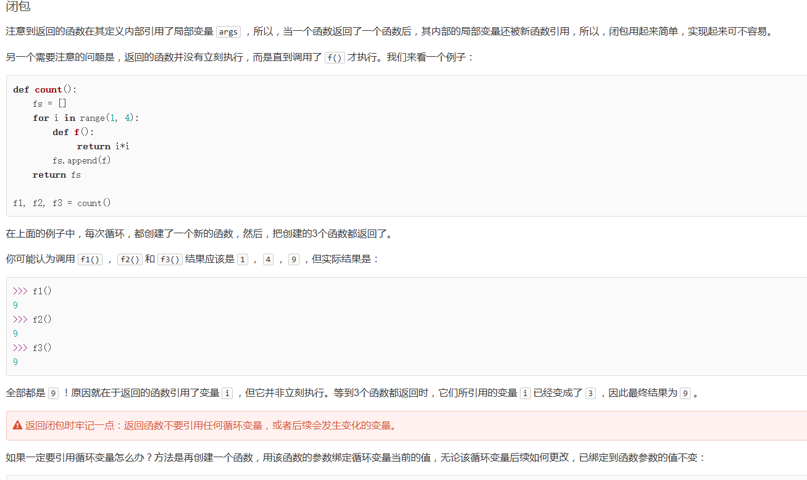
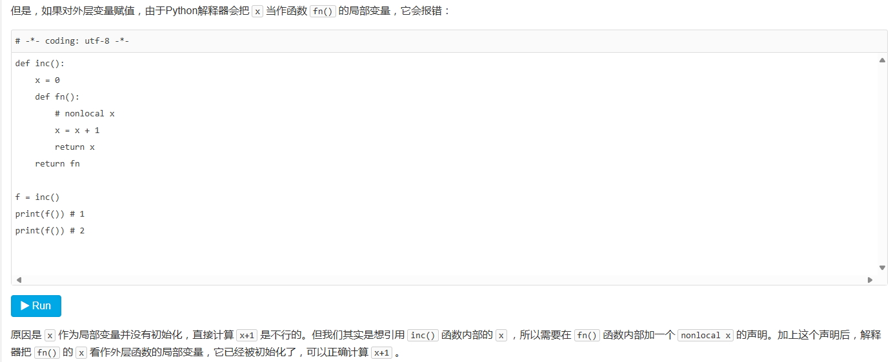

## 1. Python基础

### 1.1 Python解释器

1. CPython：官方软件自带。
    1. `>>>`作为提示符。
2. IPython：基于CPython增强。
   1. `In[序号]`作为提示符。
3. PyPy：JIT技术动态编译，追求速度。
   1. 与CPython执行结果可能不同。
4. Jython：可以将Python代码编译成Java字节码执行。
5. IronPython：可以将Python代码编译成 `.net`字节码执行。

### 1.2 输入和输出

#### 1.2.1 输出

1. 简单输出：

	```python
	>>> print('hello, world')
	hello, world
	```

2. 多字符串输出：遇到逗号“,”会输出一个空格。

    ```python
    >>> print('The quick brown fox', 'jumps over', 'the lazy dog')
    The quick brown fox jumps over the lazy dog
    ```

#### 1.2.2 输入

1. 简单输入：

   ```python
   >>> name = input()
   Michael
   >>> name
   'Michael'
   >>> print(name)
   Michael
   ```

2. 带输入提示的输入：

  ```python
   >>>name = input('please enter your name: ')
   please enter your name: Michael
   print('hello,', name)
   ```

### 1.3 数据类型和变量

1. 整数。
2. 浮点数。
3. 字符串：使用`'`或`"`包裹的任意文本。
   1. `\`转移字符。
4. 布尔值：`True`、`False`
5. 空值：`None`
6. 同一个变量可以反复赋值，而且可以是不同类型的变量.

```python
a, b = b, a + b
# a=b,b=a+b
```

#### 1.3.1 list：可变有序列表。`[]`

1. `len(list)`：获取list元素的个数。
2. 索引来访问list中每一个位置的元素.
 	- 当索引超出了范围时，Python会报一个IndexError错误。
 	- 负数索引可以从后往前获取数据。
3. `list.append(str)`：添加元素到末尾。
4. `list.insert(index,str)`：插入到指定索引位置。
5. `list.pop()`：删除末尾元素。
6. `list.pop(index)`：删除指定索引的元素。
7. list的元素数据类型可以不同。
8. list的元素可以是另一个list。

#### 1.3.2 tuple：元组。`()`

1. 能用tuple代替list就尽量用tuple。
2. 只有1个元素的tuple定义时必须加一个逗号：`t = (1,)`
3. 使用索引访问数据。
4. 同list，但初始化后不可修改。

#### 1.3.3 dict：字典。`{}`

1. 多次对一个key放入value，会更新前值。
	- 使用`dict[key]`访问数据。
2. 如果key不存在，dict就会报错。
3. 判断key是否存在：
	- `'key' in dict`：返回布尔值。
	- `dict.get('key', -1)`：不存在时返回指定值或None。
4. `pop(key)`：删除指定key
5. dict内部存放的顺序和key放入的顺序是没有关系的。
6. 对比list：
	- 查找和插入的速度极快，不会随着key的增加而变慢；
	- 需要占用大量的内存，内存浪费多。
7. dict的key必须是不可变对象。
     - 字符串、整数可以作为key。list是可变的，不能作为key。

#### 1.3.4 set：集合。`([])`

1. 不能有重复数据。
	- 重复元素会自动被删除。
2. `add(key)`方法可以添加元素到set中，可以重复添加，但不会有效果.
3. `remove(key)`方法可以删除元素。
4. 存入和取出数据数据顺序不一定一致——无序。
5. 不同set可以进行布尔运算：如`set1 & set2`、`set1 | set2`

### 1.4 字符编码

1. ASCII编码：只有大小写英文字母、数字和一些符号。
   1. 一个字符占用一个字节（byte）
2. Unicode标准：一个字符通常占用两个字节。
3. UTF-8：可变长编码。英文字母一个字节，汉字三个字节，生僻字4~6个字节。
4. `ord()`函数获取字符的整数表示，`chr()`函数把编码转换为对应的字符.

   ```python
   >>> ord('A')
   65
   >>> ord('中')
   20013
   >>> chr(66)
   'B'
   >>> chr(25991)
   '文'
   ```

5. `len()`函数计算的是str的字符数，如果换成bytes，`len()`函数就计算字节数：

   ```python
   >>> len('ABC')
   3
   >>> len(b'ABC')
   3
   ```

6. python文件开头：

   ```python
   #!/usr/bin/env python3
   # -*- coding: utf-8 -*-
   ```

   1. 第一行注释是为了告诉Linux/OS X系统，这是一个Python可执行程序，Windows系统会忽略这个注释；
   2. 第二行注释是为了告诉Python解释器，按照UTF-8编码读取源代码。
   3. 同时，必须使用UTF-8 without BOM编码方式打开文件。

### 1.5 格式化

1. %运算符用来格式化字符串。
	- 在字符串内部，`%s`表示用字符串替换，`%d`表示用整数替换，`%f`表示用浮点数替换，`%x`表示用十六进制数替换；
	- 有几个`%?`占位符，后面就跟几个变量或者值，顺序要对应好。如果只有一个`%?`，括号可以省略。
	- 格式化整数和浮点数还可以指定是否补0和整数与小数的位数。

	```python
	>>> 'Hello, %s' % 'world'
	'Hello, world'
	>>> 'Hi, %s, you have $%d.' % ('Michael', 1000000)
	'Hi, Michael, you have $1000000.'
	>>>print('%2d-%02d' % (3, 1))
	3-01
	>>>print('%.2f' % 3.1415926)
	3.14
	```

2. 另一种格式化字符串的方法是使用字符串的`format()`方法，它会用传入的参数依次替换字符串内的占位符{0}、{1}……

	```python
	>>> 'Hello, {0}, 成绩提升了 {1:.1f}%'.format('小明', 17.125)
	'Hello, 小明, 成绩提升了 17.1%'
	```

3. 最后一种格式化字符串的方法是使用以f开头的字符串，称之为f-string，它和普通字符串不同之处在于，字符串如果包含{xxx}，就会以对应的变量替换.

   ```python
	>>> r = 2.5
	>>> s = 3.14 * r ** 2
	>>> print(f'The area of a circle with radius {r} is {s:.2f}')
	The area of a circle with radius 2.5 is 19.62
	```

### 1.6 条件判断

```python
if <条件判断1>:
    <执行1>
elif <条件判断2>:
    <执行2>
elif <条件判断3>:
    <执行3>
else:
    <执行4>
```

判断条件：非零数值、非空字符串、非空list等，就判断为True，否则为False。

### 1.7 模式匹配

```python
score = 'B'

match score:
    case 'A':
        print('score is A.')
    case 'B':
        print('score is B.')
    case 'C':
        print('score is C.')
    case _: # _表示匹配到其他任何情况
        print('score is ???.')
```

1. 没有匹配到，执行`_`的语句。该句只能放到末尾。
2. 多个条件匹配成立，只执行第一个匹配到的情况。

```python
age = 10

match age:
    case x if x < 11:
        print(f'< 10 years old: {x}')
    case 10:
        print('10 years old.')
    case 11 | 12 | 13 | 14 | 15 | 16 | 17 | 18:
        print('11~18 years old.')
    case 19:
        print('19 years old.')
    case _:
        print('not sure.')
```

> 第一个`case x if x < 10`表示当`age < 10`成立时匹配，且赋值给变量x。

### 1.8 循环

1. 种类一：`for x in ...`
2. 种类二：`while`

## 2. 函数

### 2.1 函数定义

1. 定义一个函数要使用def语句，依次写出函数名、括号、括号中的参数和冒号`:`，然后，在缩进块中编写函数体，函数的返回值用`return`语句返回。
2. 如果没有`return`语句，函数执行完毕后也会返回结果，只是结果为`None`。`return None`可以简写为`return`。

#### 2.1.1 空函数

```python
def nop():
    pass
```

1. pass可以用来作为占位符，比如现在还没想好怎么写函数的代码，就可以先放一个pass，让代码能运行起来。
2. pass还可以用在其他语句里，比如：

```python
if age >= 18:
    pass
```

#### 2.1.2 返回多个值

```python
import math

def move(x, y, step, angle=0):
	nx = x + step * math.cos(angle)
	ny = y - step * math.sin(angle)
	return nx, ny
```

> 返回多个值，其实本质是返回一个tuple。

### 2.2 函数参数

#### 2.2.1 位置参数

调用函数时，按照位置顺序，依次给参数赋值。

#### 2.2.2 默认参数

```python
def power(x, n=2):
	s = 1
	while n > 0:
		n = n - 1
		s = s * x
	return s
```

1. 定义函数时，位置参数必须在前。
2. 默认参数必须指向不变对象！如，使用lits作为默认参数，多次调用后，默认参数值可能发生变化。
3. 有多个默认参数时，调用的时候，既可以按顺序提供默认参数，也可以不按顺序提供部分默认参数。当不按顺序提供部分默认参数时，需要把参数名写上。比如`nroll('Adam', 'M', city='Tianjin')`。
4. 调用函数时，可以只传位置参数，默认参数不传。

#### 2.2.3 可变参数

```python
def calc(*numbers):
	sum = 0
	for n in numbers:
		sum = sum + n * n
	return sum
```

可变参数允许传入0个或任意个参数，这些可变参数在函数调用时自动组装为一个tuple。

调用参数：参数是个具体值：

```python
>>> calc(1, 2)
5
```

调用参数：参数是个list或tuple

```python
>>> nums = [1, 2, 3]
# 方式一
>>> calc(nums[0], nums[1], nums[2])
14

# 方式二
>>> calc(*nums)
14
```

#### 2.2.4 关键字参数

关键字参数在定义时是`**kw`，调用时，可以传0个参数，也可以传n个key-value形式的键值对，或一个dict

```python
def person(name, age, **kw):
    print('name:', name, 'age:', age, 'other:', kw)
	
# 0个关键字参数
>>> person('Michael', 30)
name: Michael age: 30 other: {}

# 一个键值对
>>> person('Bob', 35, city='Beijing')
name: Bob age: 35 other: {'city': 'Beijing'}

# 两个键值对
>>> person('Adam', 45, gender='M', job='Engineer')
name: Adam age: 45 other: {'gender': 'M', 'job': 'Engineer'}

# 一个字典
>>> extra = {'city': 'Beijing', 'job': 'Engineer'}
>>> person('Jack', 24, city=extra['city'], job=extra['job'])
name: Jack age: 24 other: {'city': 'Beijing', 'job': 'Engineer'}

>>> extra = {'city': 'Beijing', 'job': 'Engineer'}
>>> person('Jack', 24, **extra)
name: Jack age: 24 other: {'city': 'Beijing', 'job': 'Engineer'}
```

> kw获得的dict是extra的一份拷贝，对kw的改动不会影响到函数外的extra

#### 2.2.5 命名关键字参数

作用：限制关键字传输的key名。

```python
def person(name, age, *, city, job):
    print(name, age, city, job)
>>> person('Jack', 24, city='Beijing', job='Engineer')
Jack 24 Beijing Engineer
```

> *后面的参数被视为命名关键字参数。
> 调用时，必须传入参数名（键值对），否则会报错。
> 命名关键字参数定义时设置了默认值时，调用时，可以不传入该参数。

如果函数定义中已经有了一个可变参数，后面跟着的命名关键字参数就不再需要一个特殊分隔符`*`了：

```python
def person(name, age, *args, city, job):
    print(name, age, args, city, job)
```

#### 2.2.6 参数组合

参数定义的顺序必须是：必选参数、默认参数、可变参数、命名关键字参数和关键字参数。

对于任意函数，都可以通过类似`func(*args, **kw)`的形式调用它，无论它的参数是如何定义的。

没有理解：？？？

```python
def f1(a, b, c=0, *args, **kw):
    print('a =', a, 'b =', b, 'c =', c, 'args =', args, 'kw =', kw)

def f2(a, b, c=0, *, d, **kw):
    print('a =', a, 'b =', b, 'c =', c, 'd =', d, 'kw =', kw)
	
>>> args = (1, 2, 3, 4)
>>> kw = {'d': 99, 'x': '#'}
>>> f1(*args, **kw)
a = 1 b = 2 c = 3 args = (4,) kw = {'d': 99, 'x': '#'}

>>> args = (1, 2, 3)
>>> kw = {'d': 88, 'x': '#'}
>>> f2(*args, **kw)
a = 1 b = 2 c = 3 d = 88 kw = {'x': '#'}
```

### 2.3 递归函数

在一个函数内部调用自身，这个函数就是递归函数。

递归函数的优点是定义简单，逻辑清晰。理论上，所有的递归函数都可以写成循环的方式，但循环的逻辑不如递归清晰。

使用递归函数需要注意防止栈溢出。

解决递归调用栈溢出的方法是通过尾递归优化。

尾递归是指，在函数返回的时候，调用自身本身，并且，return语句不能包含表达式。这样，编译器或者解释器就可以把尾递归做优化，使递归本身无论调用多少次，都只占用一个栈帧，不会出现栈溢出的情况。

事实上尾递归和循环的效果是一样的，所以，把循环看成是一种特殊的尾递归函数也是可以的。

大多数编程语言没有针对尾递归做优化，Python解释器也没有做优化，所以，即使把上面的fact(n)函数改成尾递归方式，也会导致栈溢出。

## 3. 高级特性

代码不是越多越好，而是越少越好。代码不是越复杂越好，而是越简单越好。

### 3.1 切片

切片操作简化取list、tuple、str指定索引范围的操作。

- `L[0:3]`表示，从索引0开始取，直到索引3为止，但不包括索引3。即索引0，1，2，正好是3个元素。
	- 如果第一个索引是0，还可以省略。
- 只写`[:]`就可以原样复制一个list。

### 3.2 迭代

在Python中，迭代是通过`for ... in`来完成的，只要是可迭代对象，无论有无下标，都可以迭代。

可迭代对象（通过collections.abc模块的Iterable类型判断）：
- list
- dict
- str

```python
>>> from collections.abc import Iterable
>>> isinstance('abc', Iterable) # str是否可迭代
True
>>> isinstance([1,2,3], Iterable) # list是否可迭代
True
>>> isinstance(123, Iterable) # 整数是否可迭代
False
```

默认情况，dict迭代的是key。如果要迭代value，可以用`for value in d.values()`，如果要同时迭代key和value，可以用`for k, v in d.items()`。

获取list的index和value方式：

错误方式：

```python
>>> for index, value in ['A','B','C']:
...     print(index,value)
...
Traceback (most recent call last):
  File "<stdin>", line 1, in <module>
ValueError: not enough values to unpack (expected 2, got 1)
```

正确方式：

```python
>>> for i, value in enumerate(['A', 'B', 'C']):
...     print(i, value)
...
0 A
1 B
2 C
```

> enumerate函数可以把一个list变成索引-元素对

### 3.3 列表生成式

列表生成式：用来创建list的python表达式语法，是对通过for循环生成list的语法简化。

```python 
>>> L = []
>>> for x in range(1, 11):
...    L.append(x * x)

# 列表生成式
>>> [x * x for x in range(1, 11)]
```

写列表生成式时，把要生成的元素`x * x`放到前面，后面跟for循环，就可以把list创建出来。

在一个列表生成式中，for前面的`if ... else`是表达式，必须加else，而for后面的if是过滤条件，不能带else。

```python
# 输出1到11之间的偶数
>>> [x for x in range(1, 11) if x % 2 == 0]
[2, 4, 6, 8, 10]

>>> [x if x % 2 == 0 else pass for x in range(1, 11)]
 Cell In[11], line 1
    [x if x % 2 == 0 else:pass for x in range(1, 11)]
                         ^
SyntaxError: invalid syntax
```

### 3.4 生成器

列表生成式创建的列表，内部保存值，列表太大时，占用内存空间。生成器内部保存算法，不占用内存空间。

只要把一个列表生成式的`[]`改成`()`，就创建了一个generator：

```python
>>> L = [x * x for x in range(10)]
>>> L
[0, 1, 4, 9, 16, 25, 36, 49, 64, 81]
>>> g = (x * x for x in range(10))
>>> g
<generator object <genexpr> at 0x1022ef630>
```

generator保存的是算法，每次调用next(g)，就计算出g的下一个元素的值，直到计算到最后一个元素，没有更多的元素时，抛出StopIteration的错误。

带yield的generator function：

```python
def odd():
    print('step 1')
    yield 1
    print('step 2')
    yield(3)
    print('step 3')
    yield(5)
	
>>> o = odd()
>>> next(o)
step 1
1
>>> next(o)
step 2
3
>>> next(o)
step 3
5
>>> next(o)
Traceback (most recent call last):
  File "<stdin>", line 1, in <module>
StopIteration
```

generator函数和普通函数的执行流程不一样。普通函数是顺序执行遇到return语句或者最后一行函数语句就返回。而generator函数，在每次调用next()的时候执行，遇到yield语句返回，再次执行时从上次返回的yield语句处继续执行。

要拿到generator函数的return返回值，必须捕获StopIteration错误，返回值包含在StopIteration的value中。

### 3.5 迭代器

可以直接作用于for循环的对象统称为可迭代对象：Iterable

- 一类是集合数据类型，如list、tuple、dict、set、str等；
- 一类是generator，包括生成器和带yield的generator function。
- 可以使用isinstance()判断一个对象是否是Iterable对象

```pyhon
>>> from collections.abc import Iterable
>>> isinstance([], Iterable)
True
>>> isinstance({}, Iterable)
True
>>> isinstance('abc', Iterable)
True
>>> isinstance((x for x in range(10)), Iterable)
True
>>> isinstance(100, Iterable)
False
```

可以被next()函数调用并不断返回下一个值的对象称为迭代器：Iterator。

- 可以使用isinstance()判断一个对象是否是Iterator对象

```python
>>> from collections.abc import Iterator
>>> isinstance((x for x in range(10)), Iterator)
True
>>> isinstance([], Iterator)
False
>>> isinstance({}, Iterator)
False
>>> isinstance('abc', Iterator)
False
```

生成器都是Iterator对象，但list、dict、str虽然是Iterable，却不是Iterator。

把list、dict、str等Iterable变成Iterator可以使用iter()函数：

```python
>>> isinstance(iter([]), Iterator)
True
>>> isinstance(iter('abc'), Iterator)
True
```

## 4.函数式编程

函数式编程的一个特点就是，允许把函数本身作为参数传入另一个函数，还允许返回一个函数！

### 4.1 高阶函数

高阶函数就是让函数的参数能够接收别的函数：

1. map()函数接收两个参数，一个是函数，一个是Iterable，map将传入的函数依次作用到序列的每个元素，并把结果作为新的Iterator返回。
2. reduce把一个函数作用在一个序列`[x1, x2, x3, ...]`上，即`reduce(f, [x1, x2, x3, x4]) = f(f(f(x1, x2), x3), x4)`。
3. 和map()类似，filter()也接收一个函数和一个序列。和map()不同的是，filter()把传入的函数依次作用于每个元素，然后根据返回值是True还是False决定保留还是丢弃该元素。filter()函数返回的是一个Iterator，也就是一个惰性序列，需要用list()函数获得所有结果并返回list。
3. sorted()函数也是一个高阶函数，它还可以接收一个key函数来实现自定义的排序，key指定的函数将作用于list的每一个元素上，并根据key函数返回的结果进行排序。要进行反向排序，不必改动key函数，可以传入第三个参数reverse=True。

### 4.2 返回函数

函数内部再定义一个函数，内部函数引用外部函数的参数和局部变量，外部函数return内部函数，相关参数都保存在内部函数中，这种程序结构称为”闭包“。

没懂：



nonlocal：



### 4.3 匿名函数

关键字`lambda`表示匿名函数，冒号前面的变量表示函数参数。

匿名函数的表达式（方法体）只能有一个，不写return。

匿名函数也是一个函数对象，也可以把匿名函数赋值给一个变量，再利用变量来调用该函数。`f = lambda x: x*x`。

匿名函数也可以作为函数的返回值：

```python
def build(x,y):
	return lambda :x+y
```

### 4.4 装饰器

```python	
def log(func):
	def wrapper(*args, **kw):
		print('call %s():' % func.__name__)
		return func(*args, **kw)
	return wrapper

@log
def now():
	print('2024-07-16')

#调用
now()
#执行结果
call now():
2024-07-16
```

装饰器decorator是一个返回函数的高阶函数。它的作用是增强指定函数的功能，而不改变函数的定义，装饰器的含义就是在代码运行期间给指定函数增加功能。

把@log放到now()函数的定义处，相当于执行了语句：`now=log(now)`，调用`now()`时，相当于执行了`log(now)()`。

首先会执行`log(now)`，返回wrapper()函数，wrapper()函数的参数定义是`(*args, **kw)`，因此，wrapper()函数可以接受任意参数的调用。在wrapper()函数内，首先打印日志，输出：`call now()`，再紧接着调用原始函数，输出：2024-07-16。

> `__name__是所有函数的默认属性，表示获取函数的名称。`

装饰器本身需要传入参数时，需要三层嵌套：

```python
def log(text):
    def decorator(func):
        def wrapper(*args, **kw):
            print('%s %s():' % (text, func.__name__))
            return func(*args, **kw)
        return wrapper
    return decorator

@log('execute')
def now():
    print('2015-3-25')

>>> now()
execute now():
2015-3-25
```

3层嵌套的decortator效果为：`now = log('execute')(now)`，调用now时，相当于执行了`log('execute')(now)()`。

但是，不论是两层嵌套还是三层嵌套，`now.__name__`变成了wrapper，这是因为@装饰器装饰后，now变成了wrapper，now()即为wrapper()。

要想保持原来的名称，不需要编写`wrapper.__name__ = func.__name__`这样的代码，Python内置的`functools.wraps`可以完成上述功能。

```python
import functools

def log(func):
    @functools.wraps(func)
    def wrapper(*args, **kw):
        print('call %s():' % func.__name__)
        return func(*args, **kw)
    return wrapper

##############

import functools

def log(text):
    def decorator(func):
        @functools.wraps(func)
        def wrapper(*args, **kw):
            print('%s %s():' % (text, func.__name__))
            return func(*args, **kw)
        return wrapper
    return decorator
```

### 4.5 偏函数

偏函数是functools模块的一个功能，即`functools.partial`。其作用时，把一个函数的某些参数给固定住（设置默认值），返回一个新的函数，新的函数叫偏函数。

偏函数可以接受函数对象、`*args`、`**kw`这3个参数。根据前面的知识，`*args`、`**kw`可以传入0个或多个参数。

##  5. 模块

### 5.1 模块和包

在Python中，一个.py文件就称之为一个模块（Module）。

为了避免模块名冲突，Python又引入了按目录来组织模块的方法，称为包（Package）。包：模块的上级文件目录（文件夹）

每一个包目录下面都会有一个__init__.py的文件，这个文件是必须存在的，否则，Python就把这个目录当成普通目录，而不是一个包。

`__init__.py`可以是空文件，也可以有Python代码，因为`__init__.py`本身就是一个模块，而它的模块名就是包名。

### 5.2 Python模块标准模板

```python
#!/usr/bin/env python3
# -*- coding: utf-8 -*-

' a test module '

__author__ = 'Michael Liao'

import sys

def test():
	args = sys.argv
	if len(args)==1:
		print('Hello, world!')
	elif len(args)==2:
		print('Hello, %s!' % args[1])
	else:
		print('Too many arguments!')

if __name__=='__main__':
    test()
```

- 第1行和第2行是标准注释，第1行注释可以让这个hello.py文件直接在Unix/Linux/Mac上运行，第2行注释表示.py文件本身使用标准UTF-8编码；
- 第4行是一个字符串，表示模块的文档注释，任何模块代码的第一个字符串都被视为模块的文档注释；
- 第6行使用__author__变量把作者写进去，这样当你公开源代码后别人就可以瞻仰你的大名；
- `if __name__=='__main__':`标识单文件运行时，执行if语句，文件作为模块导入时，不执行if语句，常作为测试。

### 5.3 作用域

在Python中，私有属性和方法是通过`_`或`__`前缀来实现的。`__xx__`是特殊变量，表示有特殊作用，不表示私有。

但是，Python并没有一种方法可以完全限制访问private函数或变量，只是从编程习惯上不应该引用private函数或变量。

### 5.4 第三方模块

安装第三方模块，是通过包管理工具pip完成的。

如果你正在使用Mac或Linux，安装pip本身这个步骤就可以跳过了。

如果你正在使用Windows，确保安装时勾选了pip和Add python.exe to Path。

一般来说，第三方库都会在Python官方的pypi.python.org网站注册。

安装指令：`pip install xxx`。

Anaconda会把系统Path中的python指向自己自带的Python，并且，Anaconda安装的第三方模块会安装在Anaconda自己的路径下，不影响系统已安装的Python目录。但如果系统Path没有python，则什么也不会发生。

试图加载一个模块时，Python会在指定的路径下搜索对应的.py文件，如果找不到，就会报错。

默认情况下，Python解释器会搜索当前目录、所有已安装的内置模块和第三方模块，搜索路径存放在sys模块的path变量中。

如果我们要添加自己的搜索目录，有两种方法：
- ` sys.path.append('/Users/michael/my_py_scripts')`
	- 这种方法是在运行时修改，运行结束后失效。
- 第二种方法是设置环境变量PYTHONPATH，该环境变量的内容会被自动添加到模块搜索路径中。添加是追加的方式，即Python自己本身的搜索路径不受影响。

## 6. 面向对象

### 6.1 面向对象和面向过程

面向过程的程序设计把计算机程序视为一系列的命令集合，即一组函数的顺序执行。为了简化程序设计，面向过程把函数继续切分为子函数，即把大块函数通过切割成小块函数来降低系统的复杂度。

面向对象编程——Object Oriented Programming，简称OOP，是一种程序设计思想。OOP把对象作为程序的基本单元，一个对象包含了数据和操作数据的函数，每个对象都可以接收其他对象发过来的消息，并处理这些消息，计算机程序的执行就是一系列消息在各个对象之间传递。给对象发消息实际上就是调用对象对应的关联函数，关联函数称之为对象的方法（Method）。

### 6.2 类和实例

类是抽象的模板。实例是根据类创建出来的一个个具体对象。

```python
class Student(object):
	def __init__(self, name, score):
		self.name = name
		self.score = score

	def print_score(self):
		print('%s: %s' % (self.name, self.score))

bart = Student()
```

class后面紧接着是类名，即Student，类名通常是大写开头的单词，紧接着是(object)，表示该类是从哪个类继承下来的，通常，如果没有合适的继承类，就使用object类，这是所有类最终都会继承的类。创建实例是通过类名+()实现的。

`__init__`方法的第一个参数永远是self，表示创建的实例本身，因此，在`__init__`方法内部，就可以把各种属性绑定到self，因为self就指向创建的实例本身。

有了`__init__`方法，在创建实例的时候，就不能传入空的参数了，必须传入与`__init__`方法匹配的参数，但self不需要传，Python解释器自己会把实例变量传进去。

和普通的函数相比，在类中定义的函数只有一点不同，就是第一个参数永远是实例变量self，并且，调用时，不用传递该参数。除此之外，类的方法和普通函数没有什么区别，所以，你仍然可以用默认参数、可变参数、关键字参数和命名关键字参数。

数据封装：类实例本身的数据，不通过`类名.数据名`的方式去访问，而是在类中定义访问数据的函数，通过这个函数去访问数据，这个函数称为类的方法。

### 6.3 访问限制

```python
class Student(object):

	def __init__(self, name, score):
		self.__name = name
		self.__score = score

	def print_score(self):
		print('%s: %s' % (self.__name, self.__score))
```

定义类时，如果要限制通过`类名.数据名`的方式去访问数据，可以在数据名前添加`__`（标识数据为private），这样通过`类名.__数据名`或`类名.数据名`方式访问会报错，可以防止外部代码随意修改对象内部状态，增加代码健壮性。

> 不能直接访问__name是因为Python解释器对外把__name变量改成了_Student__name，所以，仍然可以通过_Student__name来访问__name变量。但是强烈建议不要这么干，因为不同版本的Python解释器可能会把__name改成不同的变量名。

注意，实例化类时，变量名前不需要添加`__`。

需要注意的是，在Python中，变量名类似`__xxx__`的，也就是以双下划线开头，并且以双下划线结尾的，是特殊变量，特殊变量是可以直接访问的，不是private变量，所以，不能用`__name__`、`__score__`这样的变量名。

以一个下划线开头的实例变量名，比如_name，这样的实例变量外部是可以访问的，但是，按照约定俗成的规定，当你看到这样的变量时，意思就是，“虽然我可以被访问，但是，请把我视为私有变量，不要随意访问”。

总结：以一个下划线开头的变量名，外部可以访问，但是该变量设计为内部使用。以两个下划线开头的变量名，外部不可以访问（报错）。以两个下划线开头、两个下划线结尾的变量，外部可以访问，但这个变量有特殊的含义。总的来说就是，Python本身没有任何机制阻止你干坏事，一切全靠自觉。

```python
>>> bart = Student('Bart Simpson', 59)
>>> bart.get_name()
'Bart Simpson'
>>> bart.__name = 'New Name' # 设置__name变量！
>>> bart.__name
'New Name'
```

这里`bart.__name`没有报错，是因为外部代码给bart添加了一个新增变量`__name`，而不是访问`__name`。

### 6.4 继承和多态

继承和多态特性同Java。

但是python是动态语言，多态传参时，不要求传入对象是父类型或父类型的子类，只要求传入的对象有指定的方法。

这种类型被称为动态语言的鸭子类型。不要求必须是鸭子，只要有鸭子的特征，就可以看作是鸭子。

### 6.5 获取对象信息

#### 6.5.1 type()

`type()`：判断对象类型。返回Class类型。判断基本数据类型可以直接写int，str等，但如果要判断一个对象是否是函数，需要使用types模块中定义的常量。

#### 6.5.2 isinstance()

isinstance()函数判断实例对象的继承关系，并且能用type()判断的基本类型也可以用isinstance()判断

并且还可以判断一个变量是否是某些类型中的一种，比如下面的代码就可以判断是否是list或者tuple：

```python
>>> isinstance([1, 2, 3], (list, tuple))
True
>>> isinstance((1, 2, 3), (list, tuple))
True
```

#### 6.5.3 dir()

获得一个对象的所有属性和方法，可以使用dir()函数，它返回一个包含字符串的list。

#### 6.5.4 getattr()、setattr()、hasattr()

getattr()、setattr()以及hasattr()分别用于获取、设置、判断一个对象的状态。

```python
>>> class MyObject(object):
...     def __init__(self):
...         self.x = 9
...     def power(self):
...         return self.x * self.x
...

>>> obj = MyObject()
>>> hasattr(obj, 'x') # 有属性'x'吗？
True
>>> obj.x
9
>>> hasattr(obj, 'y') # 有属性'y'吗？
False
>>> setattr(obj, 'y', 19) # 设置一个属性'y'
>>> hasattr(obj, 'y') # 有属性'y'吗？
True
>>> getattr(obj, 'y') # 获取属性'y'
19
>>> obj.y # 获取属性'y'
19
```

getattr如果获取不存在的属性，会抛出AttributeError的错误，可以传入一个default参数，如果属性不存在，就返回默认值。

```python
>>> getattr(obj, 'z', 404) # 获取属性'z'，如果不存在，返回默认值404
404
```

### 6.6 实例属性和类属性

Python是动态语言，根据类创建的实例可以任意绑定属性。

定义类属性：

```python
class Student(object):
    name = 'Student'
```

相同名称的实例属性将屏蔽掉类属性。

## 7.面向对象高级特性

### 7.1 `__slots__`

创建了一个class的实例后，可以给该实例绑定任何属性和方法，这就是动态语言的灵活性。给所有实例都绑定，可以给class绑定。

但是，想要限制实例的属性，需要在定义类时，通过__slots__变量，来限制该class实例能添加的属性：

```python
class Student(object):
    __slots__ = ('name', 'age') # 用tuple定义允许绑定的属性名称
```

`__slots__`定义的属性仅对当前类实例起作用，对继承的子类是不起作用的。

子类要起作用，则子类的定义中也需要`__slots__`。

### 7.2 @property

`@property`是一个装饰器，作用为把一个方法变成属性调用。

```python
class Student(object):

    @property
    def score(self):
        return self._score

    @score.setter
    def score(self, value):
        if not isinstance(value, int):
            raise ValueError('score must be an integer!')
        if value < 0 or value > 100:
            raise ValueError('score must between 0 ~ 100!')
        self._score = value
		
# 调用
>>> s = Student()
>>> s.score = 60 # OK，实际转化为s.set_score(60)
>>> s.score # OK，实际转化为s.get_score()
60
>>> s.score = 9999
Traceback (most recent call last):
  ...
ValueError: score must between 0 ~ 100!
```

`@property`修饰的score()方法是getter，`@score.setter`修饰的`score(value)`是一个setter。

如果没有`@score.setter`，则表示是一个只读属性。

### 7.2 多重继承

Python可以多重继承。

在设计类的继承关系时，通常，主线都是单一继承下来的。但是，如果需要“混入”额外的功能，通过多重继承就可以实现，比如，让Ostrich除了继承自Bird外，再同时继承Runnable。这种设计通常称之为MixIn。

MixIn的目的就是给一个类增加多个功能，这样，在设计类的时候，可以优先考虑通过多重继承来组合多个MixIn的功能，而不是设计多层次的复杂的继承关系。

作用：不需要复杂而庞大的继承链，只要选择组合不同的类的功能，就可以快速构造出所需的子类。

### 7.3 定制方法

1. `__slots__`：限制通过类实例添加属性。
2. `__len__(self)`：让class能作用于`len()`函数。
3. `__str__(self)`：让`print(ss)`class实例时，输出指定文本。
4. `__repr__(self)`：直接输出ss实例是，输出指定文本。通常给程序员调试用，不需要重写此函数，如果需要重写，一般为：`__repr__ = __str__`。
5. `__iter__()`：让类能用于for ... in循环，然后，Python的for循环就会不断调用该迭代对象的__next__()方法拿到循环的下一个值，直到遇到StopIteration错误时退出循环。

	```python
	class Fib(object):
    def __init__(self):
        self.a, self.b = 0, 1 # 初始化两个计数器a，b

    def __iter__(self):
        return self # 实例本身就是迭代对象，故返回自己

    def __next__(self):
        self.a, self.b = self.b, self.a + self.b # 计算下一个值
        if self.a > 100000: # 退出循环的条件
            raise StopIteration()
        return self.a # 返回下一个值
	```
	
6. `__getitem__`：可以像list一样，使用索引获取元素。
7. `__getattr__`：调用不存在属性时，执行该方法。
8. `__call__`：让实例本身`s()`也能调用方法，通过callable()函数，我们就可以判断一个对象是否是“可调用”对象。

### 7.4 枚举类

```python
from enum import Enum

Month = Enum('Month', ('Jan', 'Feb', 'Mar', 'Apr', 'May', 'Jun', 'Jul', 'Aug', 'Sep', 'Oct', 'Nov', 'Dec'))

# 等价于
Class Month(Enum):
	Jan
	Feb
	...
```

访问：`Month.Jan`。

枚举：

```python
for name, member in Month.__members__.items():
    print(name, '=>', member, ',', member.value)
```

> value属性则是自动赋给成员的int常量，默认从1开始计数。

从枚举派生自定义类，可以增强枚举功能：

```python
from enum import Enum, unique

@unique
class Weekday(Enum):
    Sun = 0 # Sun的value被设定为0
    Mon = 1
    Tue = 2
    Wed = 3
    Thu = 4
    Fri = 5
    Sat = 6
```

> @unique装饰器可以帮助我们检查保证没有重复值。

访问枚举：

1. `Weekday.Mon`
2. `Weekday['Tue']`
3. `Weekday.Tue.value`
4. `Weekday(1)`

### 7.5 元类

#### 7.5.1 type()

动态语言和静态语言最大的不同，就是函数和类的定义，不是编译时定义的，而是运行时动态创建的。

type()函数既可以返回一个对象的类型，又可以创建出新的类型，比如，可以通过type()函数创建出Hello类，而无需通过class Hello(object)...定义。

要创建一个class对象，type()函数依次传入3个参数：

1. class的名称；
2. 继承的父类集合，注意Python支持多重继承，如果只有一个父类，别忘了tuple的单元素写法；
3. class的方法名称与函数绑定，这里我们把函数fn绑定到方法名hello上。

```python
>>> def fn(self, name='world'): # 先定义函数
...     print('Hello, %s.' % name)
...
>>> Hello = type('Hello', (object,), dict(hello=fn)) # 创建Hello class
>>> h = Hello()
>>> h.hello()
Hello, world.
>>> print(type(Hello))
<class 'type'>
>>> print(type(h))
<class '__main__.Hello'>
```

#### 7.5.2 metaclass

type()动态创建类，控制类的创建行为，使用metaclass，直译为元类。可以把类看成是metaclass创建出来的“实例”。

用途：要编写一个ORM框架，所有的类都只能动态定义，因为只有使用者才能根据表的结构定义出对应的类来。

## 8. 错误、调试和测试

### 8.1 错误处理

捕获异常语法结构：

```python
try:
    print('try...')
    r = 10 / int('2')
    print('result:', r)
except ValueError as e:
    print('ValueError:', e)
except ZeroDivisionError as e:
    print('ZeroDivisionError:', e)
else:
    print('no error!')
finally:
    print('finally...')
print('END')
```

- except可以只有一个。如果前面的异常捕获的类，包含了后面的异常类，则后面的except不会执行。
- 没有except则执行else。
- finally可以没有，不论 有没有异常，finally都会执行。
- Python所有的错误都是从BaseException类派生的。

如果异常没有被捕获，则会一直被系统抛出，直至找到调用栈中发生问题的原始位置。然后程序退出。


如果想让程序既抛出错误，由不影响正常运行，可以使用捕获异常加logging模块的logging方法（注意：单纯的logging只是记录，并没有处理异常，所以说单独使用logging异常仍然会报出）：

```python
import logging

def foo(s):
    return 10 / int(s)

def bar(s):
    return foo(s) * 2

def main():
    try:
        bar('0')
    except Exception as e:
        logging.exception(e)

main()
print('END')
```

自定义异常并抛出，抛出异常后，程序终止运行：

```python
class FooError(ValueError):
    pass

def foo(s):
    n = int(s)
    if n==0:
        raise FooError('invalid value: %s' % s)
    return 10 / n

foo('0')
```

捕获异常和自定义抛出异常可以结合使用，程序执行终止：

```python
def foo(s):
    n = int(s)
    if n==0:
        raise ValueError('invalid value: %s' % s)
    return 10 / n

def bar():
    try:
        foo('0')
    except ValueError as e:
        print('ValueError!')
        raise

bar()
```

### 8.2 调试

1. 方法一：print()打印。
2. 方法二：assert 断言代替print打印。assert的意思是后面的表达式应该为true，true时程序正常执行，false时会输出AssertionError及assert后面的输出，并终止运行。
	1. 命令行中运行程序时，可以使用`-O`参数关闭所有assert。
3. 方法三：logging记录。
4. 方法四：pdb调试器。
	1. 使用`-m pdb`参数启动调试，程序单步运行：`python -m pdb err.py`
		1. `l`查看代码、`n`单步执行代码、`p 变量名`查看变量值、`q`退出调试、`c`继续运行
	2. 在指定的地方停止，需要引入pdb模块，设置`pdb.set_trace()`

assert举例：

```python
def foo(s):
    n = int(s)
    assert n != 0, 'n is zero!'
    return 10 / n

def main():
    foo('0')   

main()

---------------------------------------------------------------------------
AssertionError                            Traceback (most recent call last)
Cell In[51], line 9
      6 def main():
      7     foo('0')
----> 9 main()

Cell In[51], line 7, in main()
      6 def main():
----> 7     foo('0')

Cell In[51], line 3, in foo(s)
      1 def foo(s):
      2     n = int(s)
----> 3     assert n != 0, 'n is zero!'
      4     return 10 / n

AssertionError: n is zero!
```

logging举例：

```python
import logging
logging.basicConfig(level=logging.INFO)
s = '0'
n = int(s)
logging.info('n = %d' % n)
print(10 / n)
```

> 如果没有`logging.basicConfig(level=logging.INFO)`则程序没有输出。

### 8.3 单元测试

“测试驱动开发”（TDD：Test-Driven Development）：

比如对函数abs()，我们可以编写出以下几个测试用例：
1. 输入正数，比如1、1.2、0.99，期待返回值与输入相同；
2. 输入负数，比如-1、-1.2、-0.99，期待返回值与输入相反；
3. 输入0，期待返回0；
4. 输入非数值类型，比如None、[]、{}，期待抛出TypeError。
把上面的测试用例放到一个测试模块里，就是一个完整的单元测试。

编写单元测试，需要引入Python自带的unittest模块。

```python
import unittest

from mydict import Dict

class TestDict(unittest.TestCase):

    def test_init(self):
        d = Dict(a=1, b='test')
        self.assertEqual(d.a, 1)
        self.assertEqual(d.b, 'test')
        self.assertTrue(isinstance(d, dict))

    def test_key(self):
        d = Dict()
        d['key'] = 'value'
        self.assertEqual(d.key, 'value')

    def test_attr(self):
        d = Dict()
        d.key = 'value'
        self.assertTrue('key' in d)
        self.assertEqual(d['key'], 'value')

    def test_keyerror(self):
        d = Dict()
        with self.assertRaises(KeyError):
            value = d['empty']

    def test_attrerror(self):
        d = Dict()
        with self.assertRaises(AttributeError):
            value = d.empty
if __name__ == '__main__':
    unittest.main()
```

1. 编写单元测试时，需要编写一个测试类，从unittest.TestCase继承。
2. 以test开头的方法就是测试方法，不以test开头的方法不被认为是测试方法，测试的时候不会被执行。
3. 运行单元测试。最简单的运行方式是在mydict_test.py的最后加上上面例子的最后两行代码:
4. 方式二是执行命令行参数：`python -m unittest mydict_test`

```python
class TestDict(unittest.TestCase):

    def setUp(self):
        print('setUp...')

    def tearDown(self):
        print('tearDown...')
```

单元测试中的setUp()和tearDown()方法，分别会在每调用一个测试方法的前后分别被执行。设想你的测试需要启动一个数据库，这时，就可以在setUp()方法中连接数据库，在tearDown()方法中关闭数据库，这样，不必在每个测试方法中重复相同的代码。

### 8.4 文档测试

文档测试是将测试用例写在代码的文档注释里，在命令行执行python文件时，自动执行测试用例。需要引入doctest模块，调用testmod()方法。

```python

class Dict(dict):
    '''
    Simple dict but also support access as x.y style.

    >>> d1 = Dict()
    >>> d1['x'] = 100
    >>> d1.x
    100
    >>> d1.y = 200
    >>> d1['y']
    200
    >>> d2 = Dict(a=1, b=2, c='3')
    >>> d2.c
    '3'
    >>> d2['empty']
    Traceback (most recent call last):
        ...
    KeyError: 'empty'
    >>> d2.empty
    Traceback (most recent call last):
        ...
    AttributeError: 'Dict' object has no attribute 'empty'
    '''
    def __init__(self, **kw):
        super(Dict, self).__init__(**kw)

    def __getattr__(self, key):
        try:
            return self[key]
        except KeyError:
            raise AttributeError(r"'Dict' object has no attribute '%s'" % key)

    def __setattr__(self, key, value):
        self[key] = value

if __name__=='__main__':
    import doctest
    doctest.testmod()
```

## 9. IO编程

### 9.1 IO基础

IO接口场景：CPU计算过程中，涉及到与内存交换数据的磁盘、网络，就需要IO接口。

比如，从磁盘读取文件到内存，就只有Input操作，反过来，把数据写到磁盘文件里，就只是一个Output操作。

由于CPU和内存的速度远远高于外设的速度，所以，在IO编程中，就存在速度严重不匹配的问题。

比如要把100M的数据写入磁盘，CPU输出100M的数据只需要0.01秒，可是磁盘要接收这100M数据可能需要10秒，怎么办呢？有两种办法：
1. 第一种是CPU等着，也就是程序暂停执行后续代码，等100M的数据在10秒后写入磁盘，再接着往下执行，这种模式称为同步IO；
2. 另一种方法是CPU不等待，只是告诉磁盘，“您老慢慢写，不着急，我接着干别的事去了”，于是，后续代码可以立刻接着执行，这种模式称为异步IO。

同步和异步的区别就在于是否等待IO执行的结果。

使用异步IO来编写程序性能会远远高于同步IO，但是异步IO的缺点是编程模型复杂。想想看，你得知道什么时候通知你“汉堡做好了”，而通知你的方法也各不相同。如果是服务员跑过来找到你，这是回调模式，如果服务员发短信通知你，你就得不停地检查手机，这是轮询模式。总之，异步IO的复杂度远远高于同步IO。

操作IO的能力都是由操作系统提供的，每一种编程语言都会把操作系统提供的低级C接口封装起来方便使用。、

### 9.2 文件读写

在磁盘上读写文件的功能都是由操作系统提供的，现代操作系统不允许普通的程序直接操作磁盘，所以，读写文件就是请求操作系统打开一个文件对象（通常称为文件描述符），然后，通过操作系统提供的接口从这个文件对象中读取数据（读文件），或者把数据写入这个文件对象（写文件）。

#### 9.2.1 读文件

步骤：

1. 打开一个文件对象
2. 读取文件内容。
3. 关闭文件，用来释放操作系统资源。

```python
try:
    f = open('/path/to/file', 'r')
    print(f.read())
finally:
    if f:
        f.close()
```

简介写法：

```python
with open('/path/to/file', 'r') as f:
    print(f.read())
```

读取方法：

- `read()`一次性读取所有文件内容
- 循环`read(size)`每次读取指定字节的内容
- `readline()`每次读取一行内容
- `readlines`一次读取所有内容并返回list。一般用于配置文件。

open()：

- 接受四个参数：
	- 第一个参数为文件路径
	- 第二个参数为读取方式：
		- `r`文本读取
		- `rb`读取二进制文件
	- 第三个参数为根据读取文件的编码读取，如`encoding=gbk`
- 第三个参数为遇到读取错误的处理方式，如`error='ignore'`

#### 9.2.2 file-like Object

有个read()方法的对象，在Python中统称为file-like Object。

除了file外，还可以是内存的字节流，网络流，自定义流等等。

file-like Object不要求从特定类继承，只要写个read()方法就行。

StringIO就是在内存中创建的file-like Object，常用作临时缓冲。

#### 9.2.3 写文件

步骤：

1. 打开一个文件对象
2. write()写文件
3. 关闭文件对象

简写方法：

```python
with open('/Users/michael/test.txt', 'w') as f:
    f.write('Hello, world!')
```

open()方法同读文件，第二个参数为	`w`时，表示每次覆盖写入，为`wa`时，表示追加写入。

### 9.3 StringIO和BytesIO

StringIO就是在内存中读写str。

写步骤：

1. 创建StringIO对象
2. 使用写方法

```python
>>> from io import StringIO
>>> f = StringIO()
>>> f.write('hello')
5
>>> f.write(' ')
1
>>> f.write('world!')
6
>>> print(f.getvalue())
hello world!
```

> getvalue()方法用于获得写入后的str。

读步骤：

1. 使用str初始化一个StringIO对象，
2. 使用读方法

```python
>>> from io import StringIO
>>> f = StringIO('Hello!\nHi!\nGoodbye!')
>>> while True:
...     s = f.readline()
...     if s == '':
...         break
...     print(s.strip())
...
Hello!
Hi!
Goodbye!
```

BytesIO用于读写二进制数据，读写方法同StringIO

### 9.4 文件和目录操作

Python内置的os模块可以直接调用操作系统提供的接口函数，完成对文件和目录的操作。

os模块的某些函数是跟操作系统相关的。

- os.name：posix表示linux或unix，nt表示windows
- os.uname()：linux或unix返回操作系统信息，windows没有这个方法。
- os.environ：返回操作系统的环境变量
	- os.environ.get('PATH')：返回指定的环境变量值。

操作文件和目录的函数一部分放在os模块中，一部分放在os.path模块中。

```python
# 查看当前目录的绝对路径:
>>> os.path.abspath('.')
'/Users/michael'
# 在某个目录下创建一个新目录，首先把新目录的完整路径表示出来:
>>> os.path.join('/Users/michael', 'testdir')
'/Users/michael/testdir'
# 然后创建一个目录:
>>> os.mkdir('/Users/michael/testdir')
# 删掉一个目录:
>>> os.rmdir('/Users/michael/testdir')
>>> os.path.split('/Users/michael/testdir/file.txt')
('/Users/michael/testdir', 'file.txt')
>>> os.path.splitext('/path/to/file.txt')
('/path/to/file', '.txt')
# 对文件重命名:
>>> os.rename('test.txt', 'test.py')
# 删掉文件:
>>> os.remove('test.py')
```

- 把两个路径合成一个时，不要直接拼字符串，而要通过os.path.join()函数，这样可以正确处理不同操作系统的路径分隔符。
- 要拆分路径时，也不要直接去拆字符串，而要通过os.path.split()函数

复制文件的函数居然在os模块中不存在！原因是复制文件并非由操作系统提供的系统调用。理论上讲，我们通过上一节的读写文件可以完成文件复制，只不过要多写很多代码。

幸运的是shutil模块提供了copyfile()的函数，shutil模块可以看做是os模块的补充。

### 9.5 序列化

把变量从内存中变成可存储或传输的过程称之为序列化，在Python中叫pickling，在其他语言中也被称之为serialization，marshalling，flattening等等。

序列化之后，就可以把序列化后的内容写入磁盘，或者通过网络传输到别的机器上。

把变量内容从序列化的对象重新读到内存里称之为反序列化，即unpickling。

- pickle.dumps()方法把任意对象序列化成一个bytes。
- pickle.loads()方法把一个bytes反序列化成一个对象
- pickle.load()方法从一个file-like Object中直接反序列化出对象。
	- file-like Object：有个read()方法的对象，如file、StringIO、BytesIO。

Python内置的json模块提供了非常完善的Python对象到JSON格式的转换。dict对象可以直接序列化为JSON，class对象需要使用一个指定的转换函数，先把class转换成dict。

> dumps()、loads()、load()方法同pickle

dict转换：

```python
>>> import json
>>> d = dict(name='Bob', age=20, score=88)
>>> json.dumps(d)
'{"age": 20, "score": 88, "name": "Bob"}'
```

class转换：

```python
import json

class Student(object):
    def __init__(self, name, age, score):
        self.name = name
        self.age = age
        self.score = score
		
def student2dict(std):
    return {
        'name': std.name,
        'age': std.age,
        'score': std.score
    }
s = Student('Bob', 20, 88)
#print(json.dumps(s))#报错
print(json.dumps(s, default=student2dict))
#print(json.dumps(s, default=lambda obj: obj.__dict__))#万金油写法

########## lambda obj: obj.__dict__ 相当于:
def student2dict(obj):
    return obj.__dict__
```

> 万金油写法中：因为通常class的实例都有一个__dict__属性，它就是一个dict，用来存储实例变量。也有少数例外，比如定义了__slots__的class。

json_str反序列化为class：

```python
import json

class Student(object):
    def __init__(self, name, age, score):
        self.name = name
        self.age = age
        self.score = score

def dict2student(d):
    return Student(d['name'], d['age'], d['score'])

json_str = '{"age": 20, "score": 88, "name": "Bob"}'
print(json.loads(json_str, object_hook=dict2student))
```

## 10. 进程和线程

### 10.1 基础
