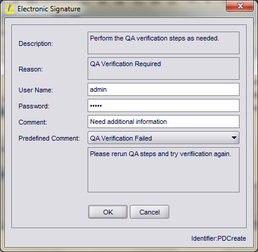

## 新特性

### 基于FTPC构建的产品

FTPC支持的产品因版本不同而不同，可以查看FTPC10.4平台支持指南获取详细信息。其中包含以下产品：

- 实时转移和清除- Live Transfer and Purge
- 模块化WebSDK框架- Modular Framework WebSDK
- 生产管理- Production Management
- 绩效管理- Performance Management
- 质量管理- Quality Management
- 库存管理- Warehouse Management
- ERP集成 网关和企业集成中心- ERP Integration Gateway and Enterprise Integration Hub
- IO服务- IOServer
- Rockwell软件套装- Rockwell Software CPGSuite
- AutoSuit软件- AutoSuite

### 查看在线帮助

要查看 FTPC 联机帮助，请根据您的浏览器版本执行以下步骤：

- IE11：将 FTPC 网站添加到“工具”菜单下的“兼容性视图”设置中。
- IE10：按下F12打开开发者工具栏，然后进入浏览器模式：IE10，选择IE10兼容性模式。

### 106915及更高版本

#### 电子标签增强

在以前的版本中，电子签名功能允许签名者以文本形式添加注释或从列表中选择注释。在此版本中，电子签名对话框中新增了一个名为 "预定义注释 "的可选属性，在执行需要电子签名的事务时，该对话框会在运行时显示。该属性允许用户添加需要签名时的任何附加注释。



#### 登入登出行为变化

在以前的版本中，每次登录和注销都会在 APP_USER 审计表中产生一个新条目。遗憾的是，这会导致一个用户有数百条审计跟踪记录，从而难以查看用户所做的实际更改。

在此版本中，登录和注销事务不会触发新记录的创建。

### 106878及更高版本

#### 消除重复的子表层关系记录选项

SITE_CONFIG 数据库表现在支持名为 `eliminateDuplicate SublotRelationsOnConume` 的新配置项，以减少 SUBLOT_RELATION 表中的重复记录数量。如果不想将重复条目保存到 SUBLOT_RELATION 表中，请将该项设置为 "true"。否则，将其设置为 false。如果此项目未出现在 SITE_CONFIG 表中，则会被视为设置为 false。

要在现有的 SITE_CONFIG 表中添加此项并将其设置为 true，请使用以下脚本：

```sql
insert into SITE_CONFIG(item_name,item_value) VALUES('eliminateDuplicateSublotRelationsOnConume','true');
```

### 106844及更高版本

#### ATRow改进

在以前的版本中，如果 getDetails 参数设置为 true，以下 ATDefinition 方法会返回主 ATRow 及其详细 ATRows：

- `getATRowByName(atRowName, getDetails)`
- `getATRowsByFilter( atRowFilter, getDetails)`

但是，如果ATRows 细节的数量很多（例如，成千上万），就可能出现内存不足的情况。为了避免出现内存不足的错误，我们做了以下改进：

- `Additional AT Definition Properties`
- `New ATRow API`
- `Modified ATRow API`

查看Process Designer对象帮助文档和Process Designer API文档获取更多的细节。

##### 额外的AT Definition属性

新增了如下的AT Definition属性：

- `lazyFetchDetails`：定义`getATRows...(...)`方法是否包含ATRows的细节。
	- 如果为false，`getATRows...(...)`会返回ATRows的所有细节，除非`getATRows...(...)`的`getDetails`参数为false。这是默认设置。调用 `saveATRow(...)` 方法时，将保存对详细信息的任何更改，并刷新详细信息。
	- 如果为 true，则即使 `getDetails` 参数设置为 true，该方法也不会返回详细信息。 要返回详细信息，必须调用 `new ATRow.getPagedDetailRows(ATDefinition details)` 方法。调用 `saveATRow(...)` 方法时，会保存对详细信息的任何更改，但不会刷新详细信息。
- `detailsPageSize`：定义 `ATRow.getPagedDetailRows(ATDefinition details)` 方法每页返回的行数。默认值为 0，这意味着所有详细信息都会在一页中获取。此属性仅在 `lazyFetchDetails` 属性设置为 true 时适用。如果 lazyFetchDetails 属性设置为 false，则此属性将被忽略。

这些值存储在 `APP_TABLE` 数据库表中新的 `lazy_fetch_details` 和 `details_page_size` 列中。

##### 新ATRow API

新增了如下的ATRow API：

- `getPagedDetailRows(ATDefinition details)`：返回当 `lazyFetchDetails` 设置为 true 时，由 `detailsPageSize` 属性定义的每页细节行数。默认值为 0，这意味着所有详细信息都在一页中获取。
	- 调用此方法将使页面继续向前推进，直到结果集中没有更多记录为止。 获取的详细信息行将保留在 ATRow 的缓存中。如果 ATRow 包含大量的详细记录，请考虑使用 ATRow filter完善查询。
	- 默认情况下，详细信息的分页过滤器根据 `last_modified_time` 列以降序排序。要按不同的顺序或列排序，请调用下面描述的 `getDetailRowsFilter(...)` 方法，并通过调用 `addOrderBy(...)` 方法相应地修改过滤器。
- `getDetailRowsFilter(ATDefinition details)`：根据相应的 ATRow filter返回详细信息。此方法仅用于懒加载。如果 `lazyFetchDetails` 设置为 false，则此方法返回 null。

##### 修改后的ATRow API

如下既有的ATRow API进行了修改：

- `getDetailRows()`：如果 `lazyFetchDetails` 为 true 且未获取任何详细信息，则会返回一个包含缓存中详细信息行的响应对象。如果没有获取详细记录，则返回一个空 List。
- `getDetailRows(ATDefinition details)`：如果 `lazyFetchDetails` 为 true 且未获取任何详细信息，则返回详细信息行的第一页。一旦获取了细节行，就会返回缓存中的细节行。

这些方法的工作方式与以前版本中的默认配置（即 `lazyFetchDetails` 为 false）相同。

## 系统架构

Plant Operations的底层架构如下：

- - Java 2 Enterprise Edition (J2EE)
- XML Web Services
- Sun (R) PNUTS(TM)

## API变化


## 数据库模式变化


## 最小系统需求

运行Plant Operations的软件、硬件环境信息可以在FTPC支持的平台指南中详细见到。

## 应用手册


## 文档

安装Plant Operations时已经安装了一下的在线文档：

- Process Designer 和 Objects Help（对象帮助）
- 数据字典
- 脚本语言帮助概览
- 发行说明
- Shop Operation帮助

要访问联机帮助，请单击 FTPC 主页上的“帮助”链接。

## 开源声明

有关 FTPC 使用的开放源代码软件包的许可协议列表，请按照您收到的订单确认函中的说明，在罗克韦尔下载网站上查看《FTPC 开放源代码许可协议指南》。