*Maven 是一个 Java 项目管理和构建工具，它可以定义项目结构、项目依赖，并使用统一的方式进行自动化构建。*
<!-- more -->

## 1. Maven 概述

### 1.1 Maven 的作用及必要性

#### 1.1.0 概念

1. Apache 软件基金会组织维护的一款专门为 Java 项目提供**构建**和**依赖**管理支持的工具。
2. 构建：Java 开发过程中，使用原材料生产产品的过程。
   - 清理：删除上一次构建的结果，为下一次构建做好准备
   - 编译：Java 源程序编译成 \*.class 字节码文件
   - 测试：运行提前准备好的测试程序
   - 报告：针对刚才测试的结果生成一个全面的信息
   - 打包
     - Java 工程：jar 包
     - Web 工程：war 包
   - 安装：把一个 Maven 工程经过打包操作生成的 jar 包或 war 包存入 Maven 仓库
   - 部署
     - 部署 jar 包：把一个 jar 包部署到 Nexus 私服服务器上
     - 部署 war 包：借助相关 Maven 插件（例如 cargo），将 war 包部署到 Tomcat 服务器上
3. 依赖：如果 A 工程里面用到了 B 工程的类、接口、配置文件等等这样的资源，那么我们就可以说 A 依赖 B
4. 依赖管理中要解决的具体问题：
   - jar 包的下载：使用 Maven 之后，jar 包会从规范的远程仓库下载到本地
   - jar 包之间的依赖：通过依赖的传递性自动完成
   - jar 包之间的冲突：通过对依赖的配置进行调整，让某些 jar 包不会被导入

#### 1.1.1 作用

Maven 简化并标准化了项目构建过程。它将项目的编译，生成文档，创建报告，发布，部署等任务无缝衔接，构建成一套完整的生命周期。

- 构建项目
- 生成文档
- 创建报告
- 维护依赖
- 软件配置管理
- 发布
- 部署

#### 1.1.2 必要性

- 管理规模庞大的 jar 包，需要专门的工具
- IDEA 完成了本地的构建操作，但项目部署、发布没有 IDEA 的环境，需要单独配置。

#### 1.1.3 特点

1. 设置简单。
2. 所有项目的用法一致。
3. 可以管理和自动进行更新依赖。
4. 庞大且不断增长的资源库。
5. 可扩展，使用 Java 或脚本语言可以轻松的编写插件。
6. 几乎无需额外配置，即可立即访问新功能。
7. 基于模型的构建：Maven 能够将任意数量的项目构建为预定义的输出类型，例如 JAR，WAR。
8. 项目信息采取集中式的元数据管理：使用与构建过程相同的元数据，Maven 能够生成一个网站（site）和一个包含完整文档的 PDF。
9. 发布管理和发行发布：Maven 可以与源代码控制系统（例如 Git、SVN）集成并管理项目的发布。
10. 向后兼容性：您可以轻松地将项目从旧版本的 Maven 移植到更高版本的 Maven 中。
11. 并行构建：它能够分析项目依赖关系，并行构建工作，使用此功能，可以将性能提高 20%-50％。
12. 更好的错误和完整性报告：Maven 使用了较为完善的错误报告机制，它提供了指向 Maven Wiki 页面的链接，您将在其中获得有关错误的完整描述。

#### 1.1.4 Maven 工作机制

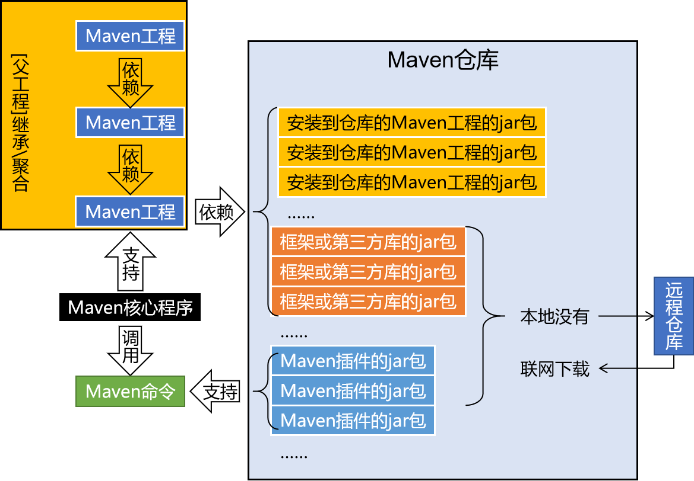
没懂

## 2. Maven 配置

### 2.1 Maven 下载及安装

#### 2.1.1 Maven 官网地址

下载链接：
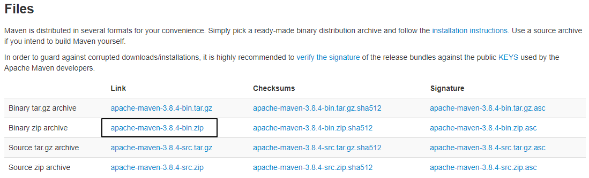

#### 2.1.2 解压 Maven 核心程序

核心程序压缩包：apache-maven-3.8.4-bin.zip，解压到**非中文、没有空格**的目录。例如：
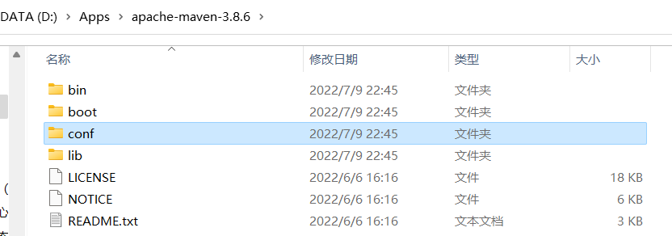
Maven 的核心配置文件：**conf/settings.xml**

### 2.2 配置 Maven 环境

#### 2.2.1 指定本地仓库

- 本地仓库默认值：用户家目录/.m2/repository。
  - 如 windows：`C:\Users\iceri\.m2\repository`
  - 刚安装完没有启动过 maven 的话看不到这个目录
- 修改**conf/settings.xml**文件中的配置（53 行），可更换仓库目录。
  - 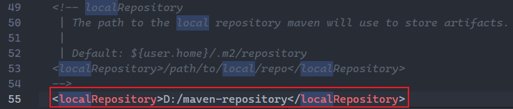
  - **非中文、没有空格**的目录。
  - 本地没有该目录时，执行 maven 命令会自动创建
  - 不同版本的 maven 可以共用该仓库

#### 2.2.2 修改远程镜像仓库

- 改成阿里云提供的镜像仓库，让 Maven 下载 jar 包的时候速度更快。
- 修改**conf/settings.xml**文件中的配置（160~165 行）
  - 改之前：
    - 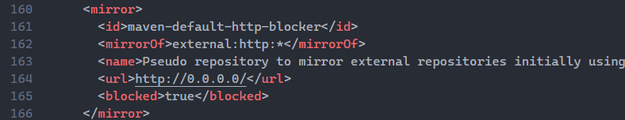
  - 改之后：
    - 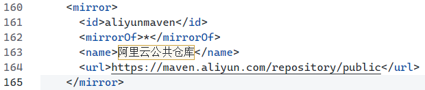
  - 注意检查最新地址是否变化：，只需要看地址。
  - 注意：阿里云镜像不支持索引。可能会有下面的错误，但暂时不知道有什么影响，暂未解决。
    - 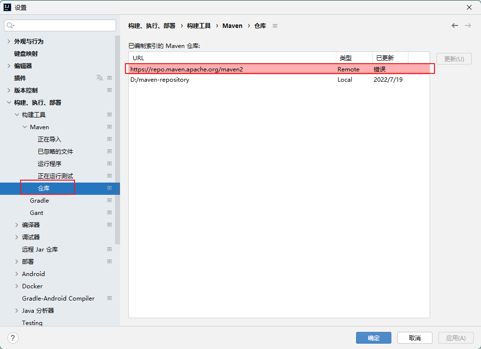

#### 2.2.3 配置 Maven 工程的基础 JDK 版本

- maven 使用的默认 JDK 版本是 1.5。
- 修改**conf/settings.xml**文件中的配置，更换为 JDK1.8。
  - 在最后以一个`</profiles>`标签（约 254 行）前，插入下述文本，
  - 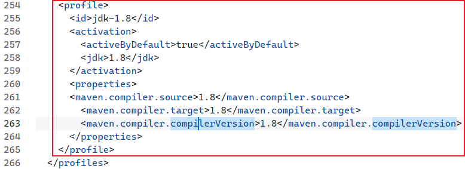

[maven 修改配置.md](https://www.yuque.com/attachments/yuque/0/2022/md/1604140/1657415274747-90d48495-4bfe-4325-a697-c66940e9f6f5.md)

#### 2.2.4 检查 Java 环境变量

- **注意：安装 Java 后即使不配置`JAVA_HOME`路径，终端也能运行 Java 命令（如下），但这个环境变量配置在了 Path 里，而一些依赖 Java 运行环境的软件、工具，由于自身就是 Java 开发，或者某些配置需要 Java 环境变量，它依然会找`JAVA_HOME`，导致运行失败。**
  - 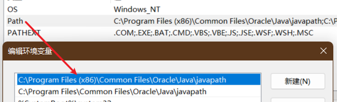
- 检查环境变量配置：
  - 终端中输入`echo %JAVA_HOME%`、`echo %PATH%`能够正确显示本地 JDK 路径即可。
  - 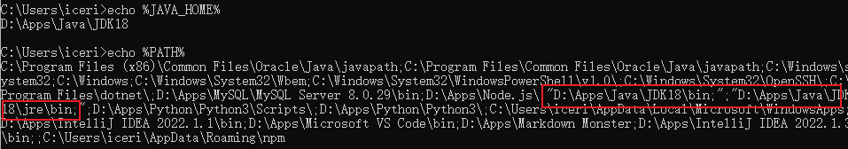

#### 2.2.5 配置 MAVEN_HOME 和 Path

- `MAVEN_HOME`配置：
	- 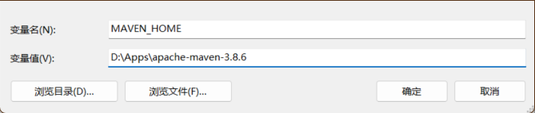
- `Path`配置：
	- 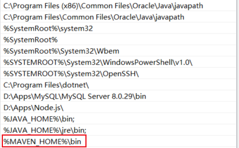
- XXX_HOME 通常指向的是 bin 目录的上一级，PATH 指向的是 bin 目录

#### 2.2.6 检查 Maven 配置是否成功

- 终端中输入`mvn -v`，是否正常显示相关信息
  - 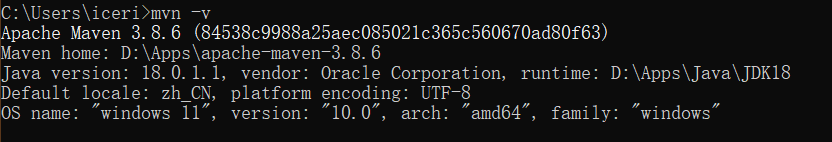
- 注意：在配置环境变量前打开的终端窗口，在配置完环境变量后要重新打开，以保证终端加载了配置的环境变量。

### 2.3 Maven 的核心概念

#### 2.3.1 POM

1. **P**roject **O**bject **M**odel，项目对象模型。是模型化思想的具体体现。
   - POM 表示将工程抽象为一个模型，再用程序中的对象来描述这个模型
2. 模型化思想：将现实生活中的事物抽象为模型，然后封装模型相关的数据作为一个对象，这使得可以在程序中计算与现实事物相关的数据。
3. POM 理念集中体现在 Maven 工程根目录下 **pom.xml** 这个配置文件中。所以这个 pom.xml 配置文件就是 Maven 工程的核心配置文件。其实学习 Maven 就是学这个文件怎么配置，各个配置有什么用。

#### 2.3.2 约定的目录结构

1. 目录结构：
   - 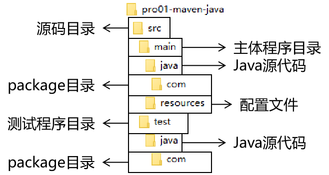
   - 另外还有一个 target 目录专门存放构建操作输出的结果
2. 约定目录结构的意义：让构建过程能够尽可能自动化完成
3. 约定大于配置：

## 3. 使用 Maven 命令行环境

### 3.1 maven 中的坐标，即本地文件存放位置

#### 3.1.1 Maven 中的坐标

- maven 中使用三个**『向量』**在**『Maven 的仓库』**中**唯一**的定位到一个**『jar』**包。
  - **groupId**：公司或组织的 id
  - **artifactId**：一个项目或者是项目中的一个模块的 id
  - **version**：版本号

#### 3.1.2 三个向量的取值方式

- groupId：公司或组织域名的倒序，通常也会加上项目名称
- artifactId：模块的名称，将来作为 Maven 工程的工程名
- version：模块的版本号，根据自己的需要设定
  - 例如：SNAPSHOT 表示快照版本，正在迭代过程中，不稳定的版本
  - 例如：RELEASE 表示正式版本

> - 举例：
>   - groupId：com.atguigu.maven
>   - artifactId：pro01-atguigu-maven
>   - version：1.0-SNAPSHOT

#### 3.1.3 坐标和仓库中 jar 包的存储路径之间的对应关系

- 坐标：
  - 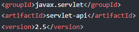
- 对应本地存储位置：
  - 

### 3.2 使用`mvn archetype:generate`命令生成 Maven 工程

#### 3.2.1 创建工程

> 在需要存放 maven 工程的路径下打开 cmd 终端执行

- 
- 
  - 输入 7，使用默认值
- 
  - 输入 groupId，如`iceriver.mavenetst`——`组织名.项目名`
- 
  - 输入 artifactId，如`pro01-maven`——工程名作为模块名
- 使用默认
- 
  - 包名可使用默认值，与 groupId 一致。
- 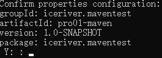确认设置。

#### 3.2.2 更改模块设置

1. 模块结构：
   - 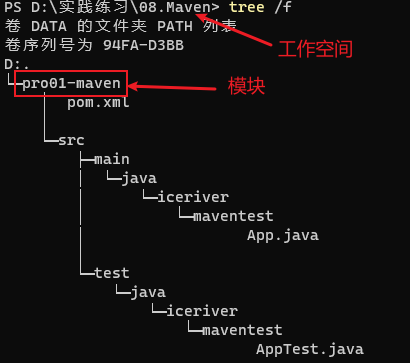
2. 修改模块（artifactId）目录下`pro01-maven/pom.xml`中 junit 的配置
   - 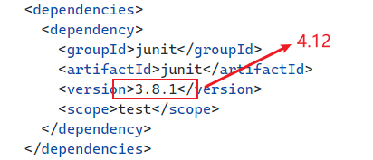
3. 可以删除`App.java`和`AppTest.java`两个文件
   - 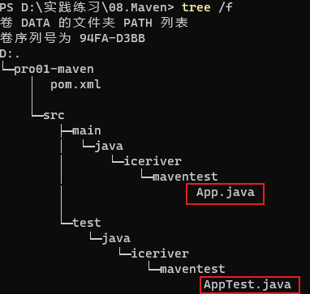

#### 3.2.3 `pom.xml`文件解读

```xml
<!-- 根标签，表示对当前工程（模块）进行配置、管理 -->
<project xmlns="http://maven.apache.org/POM/4.0.0" xmlns:xsi="http://www.w3.org/2001/XMLSchema-instance"
         xsi:schemaLocation="http://maven.apache.org/POM/4.0.0 http://maven.apache.org/xsd/maven-4.0.0.xsd">
  <!-- 从Maven2开始就是4.0.0，代表pom.xml文件所采用的标签结构 -->
  <modelVersion>4.0.0</modelVersion>
  <!-- 当前Maven工程的坐标 -->
  <groupId>iceriver.maventest</groupId>
  <artifactId>pro01-maven</artifactId>
  <version>1.0-SNAPSHOT</version>
  <!-- 打包方式：jar表示Java工程，war表示web工程，pom表示管理其他工程的工程 -->
  <packaging>jar</packaging>

  <name>pro01-maven</name>
  <url>http://maven.apache.org</url>
  <!-- 定义maven使用的属性值 -->
  <properties>
    <!-- 工程读取源码时使用的字符集 -->
    <project.build.sourceEncoding>UTF-8</project.build.sourceEncoding>
  </properties>
  <!-- 配置具体依赖信息 -->
  <dependencies>
    <!-- 配置一个具体的依赖 -->
    <dependency>
      <!-- 依赖所在的坐标信息 -->
      <groupId>junit</groupId>
      <artifactId>junit</artifactId>
      <version>4.12</version>
      <!-- 配置依赖的作用范围 -->
      <scope>test</scope>
    </dependency>
  </dependencies>
</project>
```

```xml

<build>
  <plugins>
    <plugin>
      <groupId>org.apache.maven.plugins</groupId>
      <artifactId>maven-war-plugin</artifactId>
      <version>3.2.0</version>
    </plugin>

    <!-- maven 打包时跳过测试 -->
    <plugin>
      <groupId>org.apache.maven.plugins</groupId>
      <artifactId>maven-surefire-plugin</artifactId>
      <configuration>
        <skip>true</skip>
      </configuration>
    </plugin>
    <!-- 设置打包编码为utf-8 -->
    <plugin>
      <groupId>org.apache.maven.plugins</groupId>
      <artifactId>maven-compiler-plugin</artifactId>
      <configuration>
        <source>8</source>
        <target>8</target>
        <encoding>utf-8</encoding>
      </configuration>
    </plugin>
  </plugins>
</build>
```

### 3.3 在 maven 工程中编写代码

#### 3.3.1 主体程序

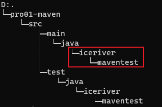
`package`路径。

```java
package iceriver.maventest;

public class Calculator {
    public int sum(int i, int j) {
        return i + j;
    }
}
```

#### 3.3.2 测试程序

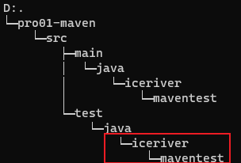

```java
// 静态导入的效果是将Assert类中的静态资源导入当前类
// 这样一来，在当前类中就可以直接使用Assert类中的静态资源，不需要写类名
import static org.junit.Assert.*;

public class CalculatorTest {

  @Test
  public void testSum() {

    // 1.创建Calculator对象
    Calculator calculator = new Calculator();

    // 2.调用Calculator对象的方法，获取到程序运行实际的结果
    int actualResult = calculator.sum(5, 3);

    // 3.声明一个变量，表示程序运行期待的结果
    int expectedResult = 8;

    // 4.使用断言来判断实际结果和期待结果是否一致
    // 如果一致：测试通过，不会抛出异常
    // 如果不一致：抛出异常，测试失败
    assertEquals(expectedResult, actualResult);
  }
}
```

### 3.4 执行 Maven 的构建命令

#### 3.3.1 构建命令

1. `mvn xxx`
2. 注意：`mvn -v`与构建无关，只要正确配置了 maven-path，在任何目录下都可执行。
3. 运行与构建相关的命令，必须进入到`pom.xml`文件所在的目录

#### 3.3.2 清理操作

- `mvn clean`
- 删除 trget 目录

#### 3.3.3 编译操作

- 主程序编译：`mvn compile`
  - 主体程序编译结果存放的目录：`target/classes`
  - 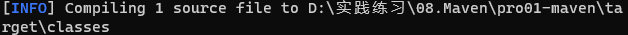
- 测试程序编译：`mvn test-compile`
  - 测试程序编译结果存放的目录：`target/test-classes`
  - 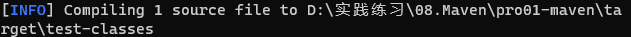

#### 3.3.4 测试操作

- `mvn test`
  - 测试的报告存放的目录：`target/surefire-reports`

#### 3.3.5 打包操作

- `mvn package`
  - 打包的结果——jar 包，存放的目录：target
  - 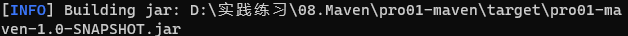

#### 3.3.6 安装操作

- 将本地构建生成的 jar 包存入到本地 Maven 仓库中。
- `mvn install`
  - 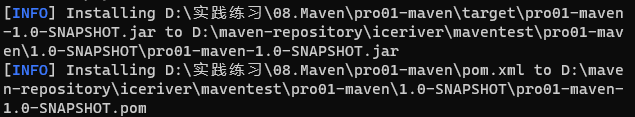
  - 在 maven 在本地仓库的位置是`pom.xml`中的配置确定的 - 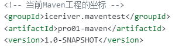

> - mvn clean package 依次执行了 clean、resources、compile、testResources、testCompile、test、jar(打包)等７个阶段。
> - mvn clean install 依次执行了 clean、resources、compile、testResources、testCompile、test、jar(打包)、install 等 8 个阶段。
> - mvn clean deploy 依次执行了 clean、resources、compile、testResources、testCompile、test、jar(打包)、install、deploy 等９个阶段。
>
> 主要区别如下，
>
> - package 命令完成了项目编译、单元测试、打包功能，但没有把打好的可执行 jar 包（war 包或其它形式的包）布署到本地 maven 仓库和远程 maven 私服仓库
> - install 命令完成了项目编译、单元测试、打包功能，同时把打好的可执行 jar 包（war 包或其它形式的包）布署到本地 maven 仓库，但没有布署到远程 maven 私服仓库
> - deploy 命令完成了项目编译、单元测试、打包功能，同时把打好的可执行 jar 包（war 包或其它形式的包）布署到本地 maven 仓库和远程 maven 私服仓库

#### 3.3.7 查看当前工程的依赖

- `mvn dependency:list`
  - 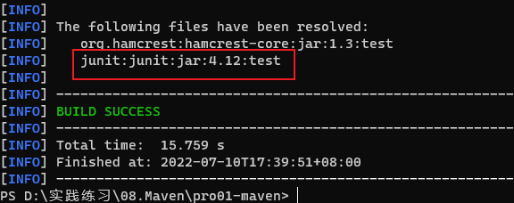
  - 第一个依赖为 junit 的依赖

### 3.5 创建 Maven 版的 web 工程

#### 3.5.1 创建工程

1. `mvn archetype:generate -DarchetypeGroupId=org.apache.maven.archetypes -DarchetypeArtifactId=maven-archetype-webapp -DarchetypeVersion=1.4`
   - 
   - 
   - 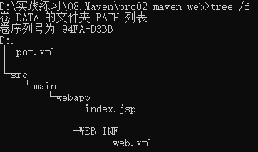

#### 3.5.2 `pom.xml`文件配置

无特殊配置，确认下打包形式——`war`和`junit`版本即可

#### 3.5.3 创建 servlet

1. 在 main 目录下创建 java 目录，即为 servlet 程序的根目录
   - 编写测试程序，如 HelloServlet.java
   - 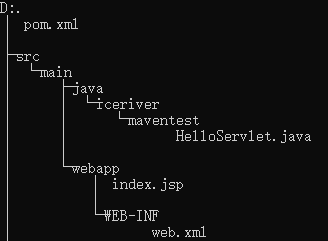

```java
public class HelloServlet extends HttpServlet{

	protected void doGet(HttpServletRequest request, HttpServletResponse response) throws ServletException, IOException {
		response.getWriter().write("hello maven web");
	}
}
```

2. 配置`web.xml`
   - 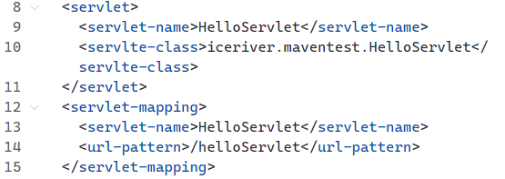
3. `index.jsp`页面中插入超链接，访问 HelloServlet 程序
4. 此时还不能启动 web 程序，是因为缺少必须的依赖:
   - 配置`servlet-api.jar`
     - 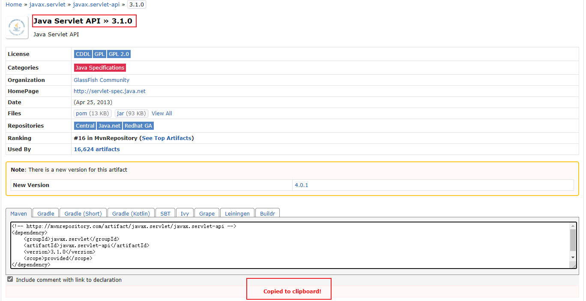
     - 将依赖的配置信息放到`pom.xml`文件中
     - 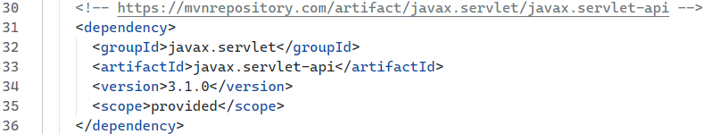
5. 编译该 web 程序，在模块目录下（与`pom.xml`同级）执行`mvn compile`
   - 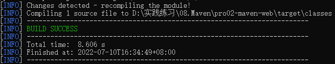
6. 打包 web 程序——执行`mvn package`
   - 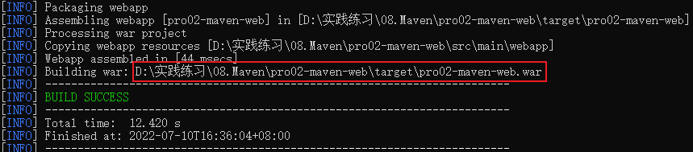
7. 部署：将上面生成的 war 包拷贝至`tomcat安装目录/webapps`路径下
   - 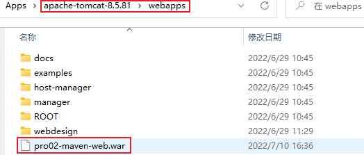
   - 启动 tomcat：
     - 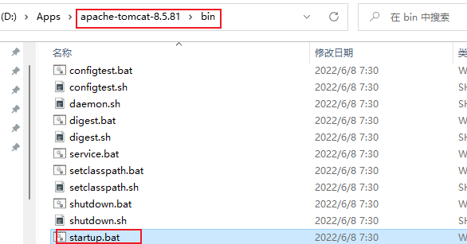
   - 浏览器访问该 war 包的地址
     - 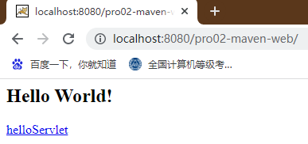

### 3.6 让 web 工程依赖 Java 工程

#### 3.6.1 概念

- 将我们自己的 java 工程打包成 jar 包，放在 web 工程的`WEB-INF/lib`目录下

#### 3.6.2 配置依赖

- 如将 3.2 构建的 Java 工程作为 3.5 创建的 web 工程的依赖：
  - 配置`pom.xml`文件：
    - 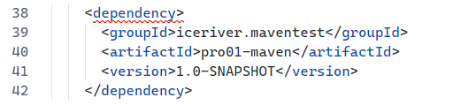
      - 即将 3.2Java 工程的坐标，作为 3.5web 工程的依赖
      - `<scope>`标签可写可不写，默认值为`compile`

#### 3.6.3 创建 test 程序的坐标

- 根据依赖的`groupId`，创建相关的文件目录
  - 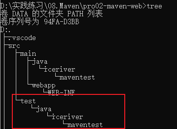
- 将 3.3 创建的`CalculatorTest.java`文件复制到 maven 目录下
- 执行`mvn test`
  - 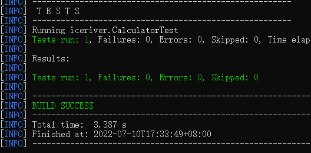

#### 3.6.4 打包

- 执行`mvn package`成功后即可在 3.5war 包下的 lib 目录看到 3.2 的 jar 包
  - 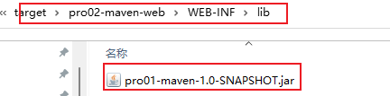

### 3.7 依赖生效范围

#### 3.7.1 依赖范围的配置

- 在`pom.xml`文件中`dependencies/dependency/**scope**`标签中配置
  - 可选值：`**compile**/**test**/**provided**/system/runtime/**import**`
  - compile：构建后直接放入 classpath
  - test：仅在测试时使用，正常运行时并不需要。如 junit
  - runtime：编译时不需要，但运行时需要，如 JDBC 驱动
  - provided：编译时需要，运行时不需要，运行时由环境中的其他支持提供，如 servletapi

#### 3.7.2 compile、test 和 provided 对比

| | main 目录（空间） | test 目录（空间） | 开发过程（时间） | 部署到服务器（时间） |
| --- | --- | --- | --- | --- |
| compile | 有效 | 有效 | 有效 | 有效 |
| test | 无效 | 有效 | 有效 | 无效 |
| provided | 有效 | 有效 | 有效 | 无效 |

- compile：通常使用的第三方框架的 jar 包这样在项目实际运行时真正要用到的 jar 包都是以 compile 范围进行依赖的。比如 SSM 框架所需 jar 包。
- test：测试过程中使用的 jar 包，以 test 范围依赖进来。比如 junit。
- provided：在开发过程中需要用到的“服务器上的 jar 包”通常以 provided 范围依赖进来。比如 servlet-api、jsp-api。而这个范围的 jar 包之所以不参与部署、不放进 war 包，就是避免和服务器上已有的同类 jar 包产生冲突，同时减轻服务器的负担。

#### 3.7.3 依赖的传递性

- 在 A 依赖 B，B 依赖 C 的前提下，C 是否能够传递到 A，取决于 B 依赖 C 时使用的依赖范围。
  - B 依赖 C 时使用 compile 范围：可以传递
  - B 依赖 C 时使用 test 或 provided 范围：不能传递，所以需要这样的 jar 包时，就必须在需要的地方明确配置依赖才可以。

#### 3.7.4 依赖的排除

- 当 A 依赖 B，B 依赖 C 而且 C 可以传递到 A 的时候，A 不想要 C，需要在 A 里面把 C 排除掉。而往往这种情况都是为了避免 jar 包之间的冲突。
  - `<dependency>`标签中使用`<exclusion>`子标签，将依赖 jar 包的坐标（除`<scope>`）写在`<exclusion>`标签内。

```xml
<dependency>
  <groupId>iceriver.maventest</groupId>
  <artifactId>pro01-maven</artifactId>
  <version>1.0-SNAPSHOT</version>
  <scope>compile</scope>
  <!-- 使用excludes标签配置依赖的排除	-->
  <exclusions>
    <!-- 在exclude标签中配置一个具体的排除 -->
    <exclusion>
      <!-- 指定要排除的依赖的坐标（不需要写version） -->
      <groupId>commons-logging</groupId>
      <artifactId>commons-logging</artifactId>
    </exclusion>
  </exclusions>
</dependency>
```

#### 3.7.5 依赖的继承

1. Maven 工程之间，A 工程继承 B 工程，本质上是 A 工程的 pom.xml 中的配置继承了 B 工程中 pom.xml 的配置。
   - 作用：通过父工程统一管理各个模块的依赖及版本，保证项目中依赖的统一，减少冲突等异常情况。
2. 只有打包方式为 pom 的 Maven 工程能够管理其他 Maven 工程。打包方式为 pom 的 Maven 工程中不写业务代码，它是专门管理其他 Maven 工程的工程。
3. 子工程在父工程的本地存储路径下，与父工程的`src`目录同级
   - 父工程的`pom.xml`文件配置：
     - 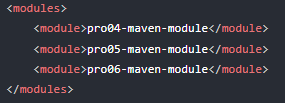
     - 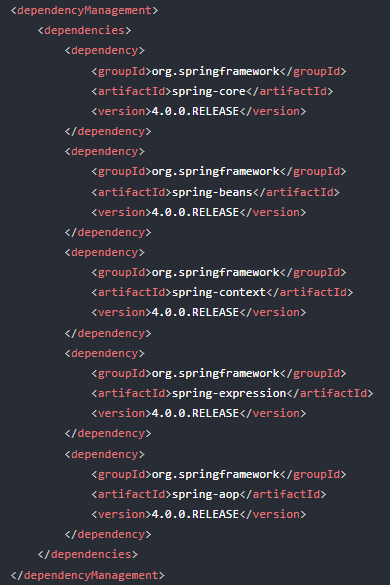
     - 子工程需要使用父工程管理的依赖时，还需要按需引入。
   - 子工程`pom.xml`文件配置：
     - 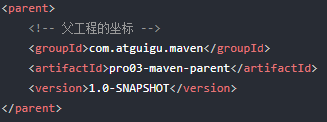
     - 子工程的`groupId`与父工程一致时，**子工程坐标的**`groupId`可以省略，`version`一致时，也可以省略。
   - 子工程配置依赖时，`version`可以省略，如果子工程配置了`version`，最终会以子工程的版本为准。
   - 子工程可以引入父工程没有管理的依赖吗？可以。
4. 父工程的属性：
   - 设置在`<properties>`标签中
   - 在`<properties>`标签中声明的自定义标签即为自定义属性，使用时`${标签名}`，属性值为标签中间的文本
     - 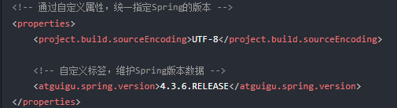

#### 3.7.6 工程的聚合

- 使用一个“总工程”将各个“模块工程”汇集起来，作为一个整体对应完整的项目。
- 好处：
  - 一键执行 Maven 命令：很多构建命令都可以在“总工程”中一键执行。
  - 配置聚合之后，各个模块工程会在总工程中展示一个列表，让项目中的各个模块一目了然。
- 配置：
  - 在父工程中使用`<moudles>`
  - 
- 如果 A 工程依赖 B 工程，B 工程依赖 C 工程，C 工程又反过来依赖 A 工程，那么在执行构建时，会报：`[ERROR] [ERROR] The projects in the reactor contain a cyclic reference:`

## 4. IDEA 中使用 Maven

### 4.0 知识补充

#### 4.0.1 DependencyManagement 和 Dependencies

dependencyManagement 提供了一种管理依赖版本号的方式。通常会在一个组织或者项目的最顶层的父 POM 中看到 dependencyManagement 元素。使用父 pom 中的 dependencyManagement 元素能让所有在子项目中引用一个依赖而不用显式的列出版本号。

Maven 加载子 pom 的依赖时，会找到父 pom 中的 dependencyManagement 元素，然后使用这个父 pom 管理的依赖版本号。

这样做的好处就是：如果有多个子项目都引用同一样依赖，则可以避免在每个使用的子项目里都声明一个版本号，这样当想升级或切换到另一个版本时，只需要在顶层父容器里更新，而不需要一个一个子项目的修改 ；另外如果某个子项目需要另外的一个版本，只需要声明 version 就可。

dependencyManagement 里只是声明依赖，并不实现引入，因此子项目需要显示的声明需要用的依赖。

如果不在子项目中声明依赖，是不会从父项目中继承下来的；只有在子项目中写了该依赖项，并且没有指定具体版本，才会从父项目中继承该项，并且 version 和 scope 都读取自父 pom；如果子项目中指定了版本号，那么会使用子项目中指定的 jar 版本。

> tiips：父 pom 管理的依赖如果本地没有，会报红，可以先去掉 dependencyManagement 标签，让本地从远程仓库拉取，完成后再把 dependencyManagement 加上。

#### 4.0.2 跳过单元测试

好处：加快项目构建过程
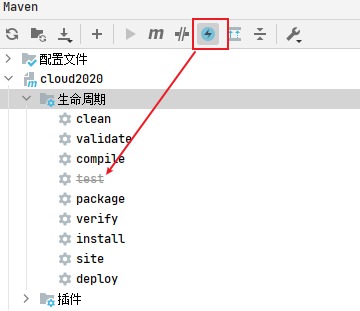

#### 4.0.3 好的习惯

父工程的 pom 设置完后，使用 maven clean 和 maven install 可以将父依赖打包加到本地仓库中，加快子模块的依赖引入过程。

### 4.1 创建父工程

- 演示版本：
  - 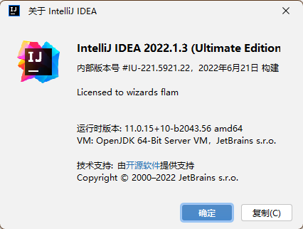
- 创建工程：
  - 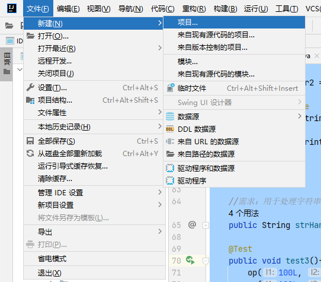
  - 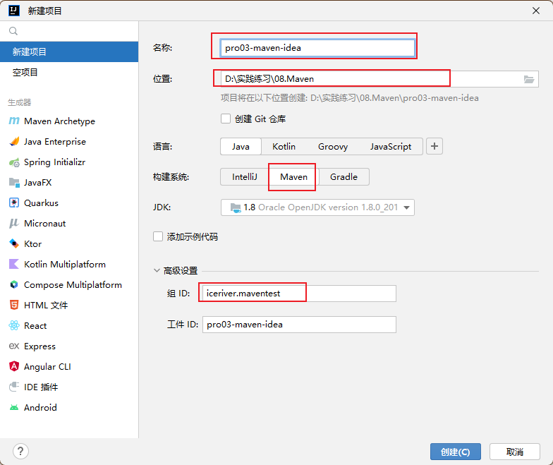
- 更换本地 maven 配置和仓库【重要】：
  - 不进行此操作可能会出现 IDEA 创建的模块使用 idea 的配置文件，造成版本错误、jar 包冲突等问题。
  - 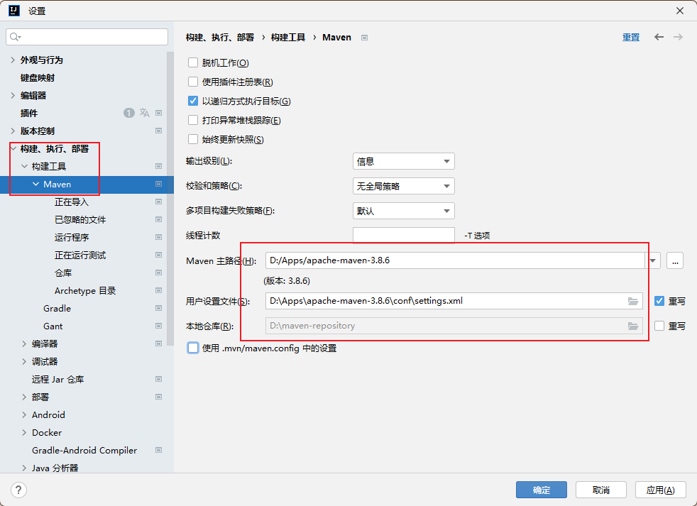

---

<div style="background: #FFF3F3;padding:10px;border: 1px solid #DEB8BE;border-radius:5px;margin-bottom:5px;">
由于不同版本IDEA创建的过程不一样，需要根据具体的IDEA工具去执行操作，所以下面没必要看
</div>

---

### 4.2 创建 Maven-java【子】工程

#### 4.2.1 创建过程演示


#### 4.2.2 编写测试程序


```java
/**
* @author: INFINITY https://developer.aliyun.com/profile/sagwrxp2ua66w
* @date: 2022/7/10 23:37
*/
public class Hello {
    public void showMessage(){
        System.out.println("IDEA & Maven");
    }
}
```

```java
/**
 * @author: https://developer.aliyun.com/profile/sagwrxp2ua66w
 * @date: 2022/7/10 23:50
 */
public class HelloTest {
    @Test
    public void showMessage(){
        Hello hello = new Hello();
        hello.showMessage();
    }
}
```

#### 4.2.2 执行 maven 命令

1. 方式一：
   - 
   - 执行下面【插件】内的运行命令效果一致
2. 方式二：
   - 
   - 记得选择执行命令的位置
3. 方式三：
   - 传统命令行终端的形式

### 4.3 创建 Maven-web【子】工程

#### 4.3.1 创建过程演示

同 4.2.1 创建 maven-java【子】工程

#### 4.3.2 web 环境配置

- 子工程`pom.xml`中添加`<packaging>war</packaging>`
- 生成`WEB-INF`等文件：
  - 方式一：
    - 
    - 
  - 方式二：
    - 
    - 
    - 这里由于使用方式一生成了，所以方式二不显示了

#### 4.3.3 测试环境


```java
package iceriver.maventest;

/**
 * @author: https://developer.aliyun.com/profile/sagwrxp2ua66w
 * @date: 2022/7/11 0:24
 */
public class Message {
    public String getMsg(){
        return "hello maven-web";
    }
}
```

```java
<%@ page import="iceriver.maventest.Message" %><%--
  Created by IntelliJ IDEA.
  User: iceri
  Date: 2022/7/11
  Time: 0:25
  To change this template use File | Settings | File Templates.
--%>
<%@ page contentType="text/html;charset=UTF-8" language="java" %>
<html>
<head>
    <title>Title</title>
</head>
<body>
    <%= new Message().getMsg()%>
</body>
</html>
```


### 4.4 导入工程

#### 4.4.1 导入自远程仓库

#### 4.4.2 导入自本地磁盘

1. 普通 Java 工程导入：


2. 导入 web 工程
   - 先按正常 Java 工程导入
   - 导入后进入为其添加 web 框架支持即可【4.3.2】

## 5. 其他核心概念

### 5.1 生命周期

#### 5.1.1 生命周期概述

1. 作用：让构建自动化完成，生命周期的每个环节对应一系列操作
2. 分类：clean、site、default
   - 
3. 特点：3 个生命周期相互独立，执行任何一个操作，都是从本周起最初的位置开始执行。

### 5.2 插件和仓库

#### 5.2.1 插件

- Maven 的核心程序仅仅负责宏观调度，不做具体工作。具体工作都是由 Maven 插件完成的。

#### 5.2.2 仓库


- 当 Maven 根据坐标寻找构件时，它会首先查看本地仓库，若本地仓库存在此构件，则直接使用；若本地仓库不存在此构件，Maven 就会去远程仓库查找，若发现所需的构件后，则下载到本地仓库使用。如果本地仓库和远程仓库都没有所需的构件，则 Maven 就会报错。
- 不要中央仓库和阿里云镜像混用，否则 jar 包来源不纯，彼此冲突。
