*MyBatis-Plus（简称 MP）是一个 MyBatis 的增强工具，在 MyBatis 的基础上只做增强不做改变，为简化开发、提高效率而生。*
<!-- more -->
> - 最好学了 SpringBoot 之后【SpringBoot 使用时更简单】
> - 也可以学习了 ssm 之后
> 
> - 代码发布地址:
>   - Github: https://github.com/baomidou/mybatis-plus
>   - Gitee: https://gitee.com/baomidou/mybatis-plus
> - 文档发布地址:https://baomidou.com/pages/24112f

## 1. MyBatis-Plus 介绍

### 1.1 简介

MyBatis-Plus（简称 MP）是一个 MyBatis 的增强工具，在 MyBatis 的基础上只做增强不做改变，为简化开发、提高效率而生。

### 1.2 特性

1. 无侵入：只做增强不做改变，引入它不会对现有工程产生影响
2. 损耗小：启动即会自动注入基本 CURD，性能基本无损耗，直接面向对象操作
3. 强大的 CRUD 操作：内置通用 Mapper、通用 Service，仅仅通过少量配置即可实现单表大部分 CRUD 操作，更有强大的条件构造器，满足各类使用需求
4. 支持 Lambda 形式调用：通过 Lambda 表达式，方便的编写各类查询条件，无需再担心字段写错
5. 支持主键自动生成：支持多达 4 种主键策略（内含分布式唯一 ID 生成器 - Sequence），可自由配置，完美解决主键问题
6. 支持 ActiveRecord 模式：支持 ActiveRecord 形式调用，实体类只需继承 Model 类即可进行强大的 CRUD 操作
7. 支持自定义全局通用操作：支持全局通用方法注入（ Write once, use anywhere ）
8. 内置代码生成器：采用代码或者 Maven 插件可快速生成 Mapper 、 Model 、 Service 、Controller 层代码，支持模板引擎等超多自定义配置
9. 内置分页插件：基于 MyBatis 物理分页，开发者无需关心具体操作，配置好插件之后，写分页等同于普通 List 查询
10. 分页插件支持多种数据库：支持 MySQL、MariaDB、Oracle、DB2、H2、HSQL、SQLite、Postgre、SQLServer 等多种数据库
11. 内置性能分析插件：可输出 SQL 语句以及其执行时间，建议开发测试时启用该功能，能快速揪出慢查询
12. 内置全局拦截插件：提供全表 delete 、 update 操作智能分析阻断，也可自定义拦截规则，预防误操作

### 1.3 框架结构


### 1.4 入门案例

#### 1.5.1 开发环境

- jdk8
- Maven：3.6.1
- Spring：5.3.1
- My-Batis-Plus：3.4.3.4（注意：引入了 mybatisplus，就不要再引入 mybatis 和 mybatsi-spring，避免版本冲突（官网提示）

```xml
<!--mybatis-plus-->
<dependency>
    <groupId>com.baomidou</groupId>
    <artifactId>mybatis-plus-boot-starter</artifactId>
    <version>3.3.1</version>
</dependency>
```

#### 1.5.2 创建数据表

```sql
CREATE DATABASE `mybatis_plus` /*!40100 DEFAULT CHARACTER SET utf8mb4 */;
use `mybatis_plus`;
CREATE TABLE `user` (
`id` bigint(20) NOT NULL COMMENT '主键ID',
`name` varchar(30) DEFAULT NULL COMMENT '姓名',
`age` int(11) DEFAULT NULL COMMENT '年龄',
`email` varchar(50) DEFAULT NULL COMMENT '邮箱',
PRIMARY KEY (`id`)
) ENGINE=InnoDB DEFAULT CHARSET=utf8;
INSERT INTO user (id, name, age, email) VALUES
(1, 'Jone', 18, 'test1@baomidou.com'),
(2, 'Jack', 20, 'test2@baomidou.com'),
(3, 'Tom', 28, 'test3@baomidou.com'),
(4, 'Sandy', 21, 'test4@baomidou.com'),
(5, 'Billie', 24, 'test5@baomidou.com');
```

#### 1.5.3 创建 Maven 工程（基于 Spring Boot）

1. 新建项目：
   - 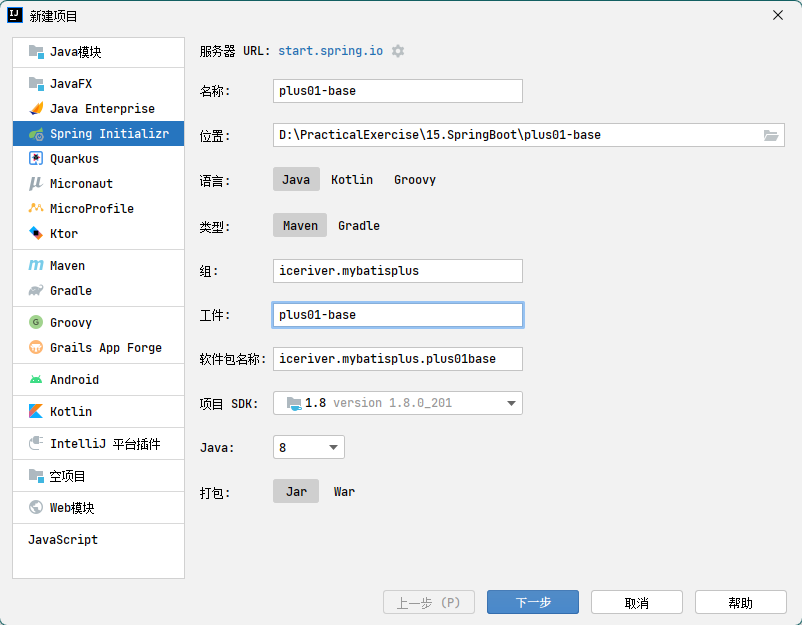
   - 不选择依赖，通过手动编辑 pom.xml 文件的形式添加
2. 在 pom.xml 文件中添加依赖
   - 空项目默认有 spring-boot-starter 和 spring-boot-starter-test 依赖
   - 额外再引入 mybatis-plus-boot-starter、lombok（同时须下载该插件）、mysql-connector-java

```xml
<dependency>
  <groupId>com.baomidou</groupId>
  <artifactId>mybatis-plus-boot-starter</artifactId>
  <version>3.5.1</version>
</dependency>
<dependency>
  <groupId>org.projectlombok</groupId>
  <artifactId>lombok</artifactId>
  <optional>true</optional>
</dependency>
<dependency>
  <groupId>mysql</groupId>
  <artifactId>mysql-connector-java</artifactId>
  <scope>runtime</scope>
</dependency>
```

3. 配置数据源及日志输出（该日志用于在控制台查看 mybatis-plus 生成了什么 sql 语句）
   - 在 resources 路径下新建 application.yml 核心配置文件

```yaml
spring:
# 配置数据源信息
  datasource:
  # 配置数据源类型
    type: com.zaxxer.hikari.HikariDataSource
    # 配置连接数据库信息
    driver-class-name: com.mysql.cj.jdbc.Driver
    url: jdbc:mysql://localhost:13306/mybatis_plus?characterEncoding=utf-8&useSSL=false
    username: root
    password: dimitre123
# 配置MyBatis日志
mybatis-plus:
  configuration:
    log-impl: org.apache.ibatis.logging.stdout.StdOutImpl
```

- spring boot 2.0 内置 jdbc5 驱动
  - 驱动类使用 `com.mysql.jdbc.Driver`
  - url 使用：`jdbc:mysql://localhost:13306/mybatis_plus?`characterEncoding=utf-8&useSSL=false
- spring boot 2.1 以上版本内置 jdbc8 驱动
  - 驱动类使用 `com.mysql.cj.jdbc.Driver`
  - url 使用：`jdbc:mysql://localhost:13306/mybatis_plus?
  serverTimezone=GMT%2B8&characterEncoding=utf-8&useSSL=false`

## 2. mybatis-plus 使用

### 2.1 Crud 功能

#### 2.1.1 基本使用

1. 创建 User JavaBean，使用@Data 注解生成无参构造器、getter、setter、equals、tosting、hashcode，没有生成带参的构造器。
   - 注意：数据表中 id 使用的数据类型为 bigint，所以 User 类中的 id 使用了 long 类型
   - 之所以这样做是因为 mybatis 插入数据时，自增的 id 使用的雪花算法，比较长。
2. 创建 UserMapper 接口，继承自 BaseMapper，范型使用 User
   - spring boot 的启动程序类，**使用@MapperScan("")指定扫描的 mapper 包**
     - **扫描会把扫描到的类交给 ioc 容器管理，所以不是必须要在 UserMapper 类前使用**@**Repository 进行声明**
     - **但是 idea 工具在自动装配 usermapper 时，会报红线，如果要消除红线，可以添加**@**Repository 注解标记成持久层组件**
3. 在 test/iceriver.mybatisplus 目录下创建测试类 UserTests.java，使用@SpringBootTest 注解进行标记，实验增删改查方法：

```java
public interface BaseMapper<T> extends Mapper<T> {
    int insert(T entity);

    int deleteById(Serializable id);

    int deleteById(T entity);

    int deleteByMap(@Param("cm") Map<String, Object> columnMap);

    int delete(@Param("ew") Wrapper<T> queryWrapper);

    int deleteBatchIds(@Param("coll") Collection<?> idList);

    int updateById(@Param("et") T entity);

    int update(@Param("et") T entity, @Param("ew") Wrapper<T> updateWrapper);

    T selectById(Serializable id);

    List<T> selectBatchIds(@Param("coll") Collection<? extends Serializable> idList);

    List<T> selectByMap(@Param("cm") Map<String, Object> columnMap);

    default T selectOne(@Param("ew") Wrapper<T> queryWrapper) {
        List<T> ts = this.selectList(queryWrapper);
        if (CollectionUtils.isNotEmpty(ts)) {
            if (ts.size() != 1) {
                throw ExceptionUtils.mpe("One record is expected, but the query result is multiple records", new Object[0]);
            } else {
                return ts.get(0);
            }
        } else {
            return null;
        }
    }

    default boolean exists(Wrapper<T> queryWrapper) {
        Long count = this.selectCount(queryWrapper);
        return null != count && count > 0L;
    }

    Long selectCount(@Param("ew") Wrapper<T> queryWrapper);

    List<T> selectList(@Param("ew") Wrapper<T> queryWrapper);

    List<Map<String, Object>> selectMaps(@Param("ew") Wrapper<T> queryWrapper);

    List<Object> selectObjs(@Param("ew") Wrapper<T> queryWrapper);

    <P extends IPage<T>> P selectPage(P page, @Param("ew") Wrapper<T> queryWrapper);

    <P extends IPage<Map<String, Object>>> P selectMapsPage(P page, @Param("ew") Wrapper<T> queryWrapper);
}
```

#### 2.1.2 自定义增删改查方法

1. 使用自定义增删改查方法的流程与 mybatis 中操作一致
   - 在 mapper 接口中定义 crud 方法
   - 在 reosources 目录下创建 mapper 目录，创建对应的 mapper.xml 映射文件~~（是不是反过来了，默认不需要创建对应包名的 mapper 路径，如果是纯 mapper 路径需要指定？？需要测试下）~~
     - 如果映射文件不在 mapper 目录下，则需要在 application.yml 文件中进行配置，指定位置。
     - 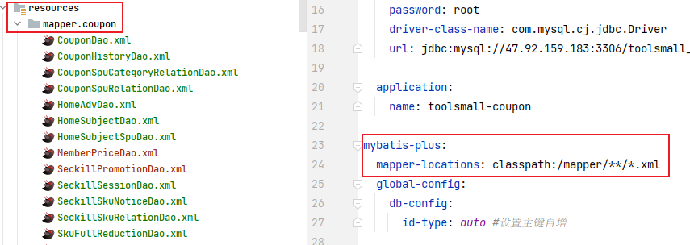
     - ~~mybatis 中正好相反，需要在 resources 文件目录下创建 mapper.java 对应报名的 mapper 路径~~
   - 在 mapper.xml 文件中编写 sql 语句
   - 调用 mapper 接口中的方法进行使用
2. 编写 crud 方法

```java
public interface UserMapper extends BaseMapper<User> {
    /**
     * 自定义crud方法：根据id查询用户信息为map集合
     * @param id
     * @return
     */
    Map<String, Object> selectMapById(Long id);
}
```

3. 编写映射文件

```xml
<?xml version="1.0" encoding="UTF-8" ?>
<!DOCTYPE mapper
        PUBLIC "-//mybatis.org//DTD Mapper 3.0//EN"
        "http://mybatis.org/dtd/mybatis-3-mapper.dtd">
<mapper namespace="iceriver.mybatisplus.mapper.UserMapper">

  <!--Map<String, Object> selectMapById(Long id);-->
  <select id="selectMapById" resultType="map">
    select id,name,age,email from user where id = #{id}
  </select>
</mapper>
```

- 这里 resultType 之所以可以直接写 map，是因为 mybatisplus 定义的默认的类型别名。

4. 执行测试

```java
@SpringBootTest
public class UserTests {
    @Autowired
    private UserMapper userMapper;
    @Test
    public void testSelectMapById(){
        Map<String, Object> map = userMapper.selectMapById(1L);
        System.out.println(map);
    }
}
```

### 2.2 Service 接口

1. MyBatis-Plus 中有一个接口 IService 和其实现类 ServiceImpl，封装了常见的业务层逻辑。
2. 由于实际开发中，service 层的方法非常复杂，mybatis 提供的通用 service 方法不能满足需求，为了既使用 mybatis 提供的 sevice 方法，又能满足实际开发的需要，可参照创建 usermapper 的方式，让自定义 service 继承自 ISservice，自定义 ServiceImpl 既实现自定义 service，又继承 mybatisplus 提供的 ServiceImpl
   - service：

```java
public interface UserService extends IService<User> {

}
```

- serviceImpl

```java
@Service
public class UserServiceImpl extends ServiceImpl<UserMapper, User> implements UserService {
}
```

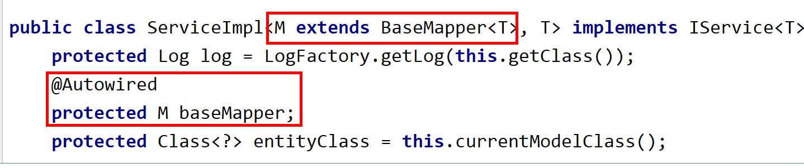

      - 需要使用@Service注解创建bean，交给ioc容器管理
         - 或者使用配置类，使用@ConponentScan进行扫描
         - 或者在springboot 启动程序，使用@ConponentScan进行扫描

3. mybatis-plus 中批量添加在 service 接口的方法中，底层实现批量添加的原理是循环。

### 2.3 雪花算法

#### 2.3.1 出现背景

- 需要选择合适的方案去应对数据规模的增长，以应对逐渐增长的访问压力和数据量。数据库的扩展方式主要包括：业务分库、主从复制，数据库分表。
- 实现主从表分离.

#### 2.3.2 数据库分表

1. 将不同业务数据分散存储到不同的数据库服务器，能够支撑百万甚至千万用户规模的业务，但如果业务继续发展，同一业务的单表数据也会达到单台数据库服务器的处理瓶颈。例如，淘宝的几亿用户数据，如果全部存放在一台数据库服务器的一张表中，肯定是无法满足性能要求的，此时就需要对单表数据进行拆分 。
2. 单表数据拆分有两种方式：垂直分表和水平分表。
   - 
   - 垂直分表适合将表中某些不常用且占了大量空间的列拆分出去。
   - 水平分表根据表中数据的行数和实际的业务情况，对标进行拆分。
3. 水平分表的处置方式：
   - 主键自增：以最常见的用户 ID 为例，可以按照 1000000 的范围大小进行分段，1~999999 放到表 1 中，1000000~1999999 放到表 2 中，以此类推。
     - 复杂点：分段大小的选取。分段太小会导致切分后子表数量过多，增加维护复杂度；分段太大可能会导致单表依然存在性能问题，一般建议分段大小在 100 万至 2000 万之间。
     - 优点：可以随着数据的增加平滑地扩充新的表。例如，现在的用户是 100 万，如果增加到 1000 万，只需要增加新的表就可以了，原有的数据不需要动。
     - 缺点：分布不均匀。假如按照 1000 万来进行分表，有可能某个分段实际存储的数据量只有 1 条，而另外一个分段实际存储的数据量有 1000 万条。
   - 取模：同样以用户 ID 为例，假如我们一开始就规划了 10 个数据库表，可以简单地用 user_id%10 的值来表示数据所属的数据库表编号，ID 为 985 的用户放到编号为 5 的子表中，ID 为 10086 的用户放到编号为 6 的子表中。
     - 复杂点：初始表数量的确定。表数量太多维护比较麻烦，表数量太少又可能导致单表性能存在问题。
     - 优点：表分布比较均匀。
     - 缺点：扩充新的表很麻烦，所有数据都要重分布。
4. 雪花算法：水平分表的处置方式。Twitter 公布的分布式主键生成算法，它能够保证不同表的主键的不重复性，以及相同表的主键的有序性。
   - 核心思想：长度共 64bit（一个 long 型）。首先是一个符号位，1bit 标识，由于 long 基本类型在 Java 中是带符号的，最高位是符号位，正数是 0，负数是 1，所以 id 一般是正数，最高位是 0。41bit 时间截(毫秒级)，存储的是时间截的差值（当前时间截 - 开始时间截)，结果约等于 69.73 年。10bit 作为机器的 ID（5 个 bit 是数据中心，5 个 bit 的机器 ID，可以部署在 1024 个节点）。12bit 作为毫秒内的流水号（意味着每个节点在每毫秒可以产生 4096 个 ID）。
     - 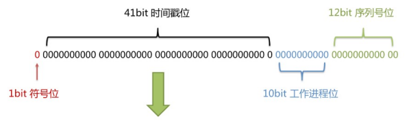
   - 优点：整体上按照时间自增排序，并且整个分布式系统内不会产生 ID 碰撞，并且效率较高。

## 3. 注解

### 3.1 @MapperScan

1. 配置在 spring boot 启动程序类上，指定扫描的 mapper 包
2. 可以创建配置类，加在配置类上

### 3.2 @TableName

1. 用于实体类 pojo 前，指定数据库中表名与实体类的对应关系。
2. 未指定改属性时，由 basemapper 的范型决定表名与实体类的对应关系，对应不上就会报错。
3. 也可以在 application.yml 核心配置文件中使用`mybatis-plus.global-config.db-config.table-prefix: t_`进行全局设置

### 3.3 @TableId

1. mybatis-plus 在 crud 时，默认将字段名为 id 的列作为主键。
2. 如果表中主键的列名不是 id，则会把主键列识别为普通列。
3. 此时可以在实体类 pojo 的主键列属性前使用改注解，将该属性标记为主键。
4. value 属性：解决实体类 pojo 中的主键名与表中主键名不一致问题。可以使用 value 属性设置实体类 pojo 属性与表中主键名的对应关系。当只设置 value 时，value 可以省略，直接写值。
5. type 属性：设置主键生成策略。默认为 IdType.ASSIGN_ID，为雪花算法，IdType.AUTO 表示使用数据库设置的自增策略，但必须保证数据库进行了设置，否则报错。

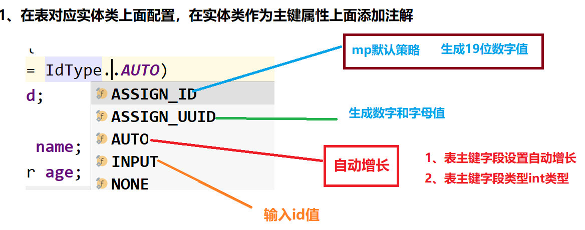

6. 全局配置主键生成策略：在 application.yml 核心配置文件中使用`mybatis-plus.global.db-config.id-type: auto`

### 3.4 @TableField

1. 设置非主键字段实体类 pojo 中的属性名与数据库表中字段名的对应关系。
2. 指定表中非主键的字段名（属性可以在表中有，也可以没有，没有时使用 exist=false）。

### 3.5 @TableLogic

1. 逻辑删除：在表中设置一个字段，标记字段的状态。
   - 逻辑删除会将删除功能变为修改功能，修改了标记为逻辑删除字段的值。
   - 逻辑删除后，查询不会显示。
   - 方式一：在数据库表中，给字段设置默认值，根据表中设置的默认值判断，如果默认值为 0，则表示处于未删除状态，为其他值，表示删除状态。（好像也不用）
   - 方式二：在核心配置文件中使用 mybatis-plus.global-config.db-config.logic-delete-value 设置逻辑已删除值和 mybatis-plus.global-config.db-config.logic-not-delete-value 设置逻辑未删除值（可以不配置）
2. 使用场景：数据恢复。
3. @TableLogic 标记逻辑删除的字段。

### 3.6 @Version

- 标识乐观锁本版好号字段
- 需要在配置类中开启乐观锁插件

### 3.7@EnumValue

- 根据实体类中取值为枚举类型的属性，创建枚举类
- 在枚举类中，将对应在实体类中的属性指定为枚举
  - 解释：如 User 实体类的属性 sex，创建 SexEunm 的枚举类，在 SexEnum 中设定属性 sex，给 SexEnum 中 sex 指定注解@EunmValue
- 需要在核心配置文件中开启通用枚举扫描：`mybatis-plus:.typeEnumsPackage: iceriver.mybatisplus.enums`

### 3.8 @DS

- 指定数据源，参数名称在核心配置文件中设定
- 可以用在类上，也可以用有在方法上，同时用遵循就近原则

## 4. 条件构造器

### 4.1 wapper 介绍

1. BaseMapper 中 crud 等方法传入的条件。
2. 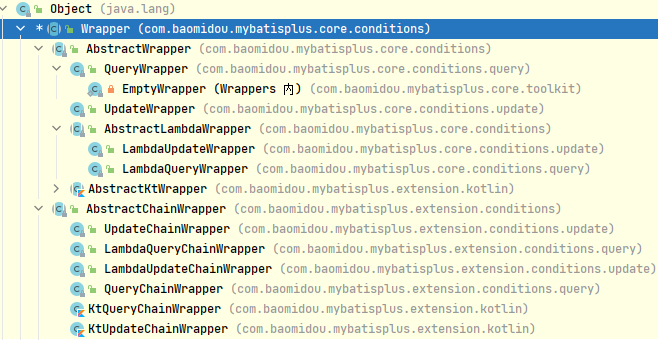
3. Wrapper ： 条件构造抽象类，最顶端父类
   - AbstractWrapper ： 用于查询条件封装，生成 sql 的 where 条件
     - QueryWrapper ： 查询条件封装
     - UpdateWrapper ： Update 条件封装
     - AbstractLambdaWrapper ： 使用 Lambda 语法
       - LambdaQueryWrapper ：用于 Lambda 语法使用的查询 Wrapper
       - LambdaUpdateWrapper ： Lambda 更新封装 Wrapper


### 4.2 QueryWapper

1. 组装查询条件 1：`ge`、`gt`、`le`、`lt`
    ```java
    @Test
    public void testSelect() {
        QueryWrapper<User> queryWrapper = new QueryWrapper<>();
        queryWrapper.ge("age", 28);
        List<User> users = userMapper.selectList(queryWrapper);
        System.out.println(users);
    }
    ```
2. 组装查询条件 2：`like`、`likeLeft`（%在左边）、`likeRight`（%在右边）、between
    ```java
    @SpringBootTest
    public class QueryWapperTests {
        @Autowired
        private UserMapper userMapper;
        @Test
        public void test01(){
    //        查询用户名包含a，年龄在20到30之间的所有用户信息
    //        SELECT id,name,age,email FROM user WHERE (name LIKE ? AND age BETWEEN ? AND ? AND email IS NOT NULL)
            QueryWrapper<User> queryWrapper = new QueryWrapper<>();
            queryWrapper.like("name", "a")
                        .between("age",20,30)
                        .isNotNull("email");
            List<User> users = userMapper.selectList(queryWrapper);
            users.forEach(user -> System.out.print(user));
        }
    }
    ```
    - like()、between()等这些方法中传入的是表中的列名，不是 pojo 中的属性名。
    - between()可以使用 gt()、lt()代替
3. 组装排序条件：`orderByDesc、orderByAsc`
    ```java
    @SpringBootTest
    public class QueryWapperTests {
        @Autowired
        private UserMapper userMapper;
        @Test
        public void test02(){
    //        按年龄降序查询用户，如果年龄相同则按id升序排列
    //        SELECT id,name,age,email FROM user ORDER BY age DESC,id ASC
            QueryWrapper<User> queryWrapper = new QueryWrapper<>();
            queryWrapper.orderByDesc("age")
                        .orderByAsc("id");
            List<User> users = userMapper.selectList(queryWrapper);
            users.forEach(user -> System.out.print(user));
        }
    }
    ```
4. 组装删除功能
    ```java
    @SpringBootTest
    public class QueryWapperTests {
        @Autowired
        private UserMapper userMapper;
        @Test
        public void test03(){
    //        删除邮箱地址为null的用户
    //        DELETE FROM user WHERE (email IS NULL)
            QueryWrapper<User> queryWrapper = new QueryWrapper<>();
            queryWrapper.isNull("email");
            int result = userMapper.delete(queryWrapper);
            System.out.println("result" + result);
        }
    }
    ```
     - 如果启用了逻辑删除功能，对应的删除 sql 语句会变为修改语句。
5. 组装修改功能
    ```java
    @SpringBootTest
    public class QueryWapperTests {
        @Autowired
        private UserMapper userMapper;
        @Test
        public void test04(){
    //        将（年龄大于20并且用户名包含a）或者邮箱为null的用户信息修改
    //        UPDATE user SET name=?, email=? WHERE (age > ? AND name LIKE ? OR email IS NULL)
            QueryWrapper<User> queryWrapper = new QueryWrapper<>();
            queryWrapper.gt("age", 20)
                        .like("name", "a")
                        .or()
                        .isNull("email");
            User user1 = new User();
            user1.setName("xiaoming");
            user1.setEmail("123@qq.com");
            int result = userMapper.update(user1, queryWrapper);
            System.out.println("result" + result);
        }
    }
    ```
    - 如果开启了逻辑删除，则逻辑删除后的不会被修改
    - 注意 OR 查询条件在 mybatis-plus 中的用法（不传参，起拼接作用）
6. 组装查询优先级
      - 主要是 mybatis-plus 的条件构造器中 lambda 中的条件优先执行
      - 为了能够写 lambda，`并且`这个查询条件不再用`.`代替，而是用`and()`
     ```java
     @SpringBootTest
     public class QueryWapperTests {
         @Autowired
         private UserMapper userMapper;
         @Test
         public void test05(){
     //        将用户名包含a并且（年龄大于20或者邮箱为null）的用户信息修改
     //        mybatis-plus的条件构造器中lambda中的条件优先执行
     //        UPDATE user SET name=?, email=? WHERE (name LIKE ? AND (age > ? AND email IS NULL))
             QueryWrapper<User> queryWrapper = new QueryWrapper<>();
             queryWrapper.like("name", "a")
                         .and(i -> i.gt("age", 20).isNull("email"));
             User user1 = new User();
             user1.setName("dazhuang");
             user1.setEmail("312@qq.com");
             int result = userMapper.update(user1, queryWrapper);
             System.out.println("result" + result);
         }
     }
     ```
     - 如果开启了逻辑删除，则逻辑删除后的不会被修改
7. 组装查询指定列
    ```java
    @SpringBootTest
    public class QueryWapperTests {
        @Autowired
        private UserMapper userMapper;
        @Test
        public void test06(){
    //        查询用户名、年龄、邮箱
    //        SELECT name,age,email FROM user
            QueryWrapper<User> queryWrapper = new QueryWrapper<>();
            queryWrapper.select("name", "age", "email");
            List<Map<String, Object>> users = userMapper.selectMaps(queryWrapper);
            users.forEach(user -> System.out.println(user));
        }
    }
    ```
8. 组装子查询
    ```java
    @SpringBootTest
    public class QueryWapperTests {
        @Autowired
        private UserMapper userMapper;
        @Test
        public void test07(){
    //        查询id小于等于100的用户
    //        SELECT id,name,age,email FROM user WHERE (id IN (select id from user where id<=100))
            QueryWrapper<User> queryWrapper = new QueryWrapper<>();
            queryWrapper.inSql("id", "select id from user where id<=100");
            List<User> users = userMapper.selectList(queryWrapper);
            users.forEach(user -> System.out.println(user));
        }
    }
    ```

### 4.3 UpdateWapper

1. 组装修改条件（按照上文5 项修改）

```java
@SpringBootTest
public class UpdateWrapperTests {
    @Autowired
    private UserMapper userMapper;
    @Test
    public void test01(){
//        将用户名包含a并且（年龄大于20或者邮箱为null）的用户信息修改
//        UPDATE user SET name=?,email=? WHERE (name LIKE ? AND (age > ? AND email IS NULL))
        UpdateWrapper<User> updateWrapper = new UpdateWrapper<>();
        updateWrapper.like("name", "i")
                     .and(i -> i.gt("age", 20).isNull("email"));
        updateWrapper.set("name","大王").set("email", "newd@sina.com");
        int result = userMapper.update(null, updateWrapper);
        System.out.println("result" + result);
    }
}
```

### 4.4 模拟开发中根据提交数据组装条件

1. 手动判断组装——利用 springframework 提供的工具类

```java
@SpringBootTest
public class ConditionTests {
    @Autowired
    private UserMapper userMapper;
    @Test
    public void test01() {
//        SELECT id,name,age,email FROM user WHERE (age >= ? AND age <= ?)
        String name = "";
        Integer ageBegin = 20;
        Integer ageEnd = 30;

        QueryWrapper<User> queryWrapper = new QueryWrapper<>();
        if (StringUtils.isNotBlank(name)) {
            //isNotBlank判断某个字符创是否不为空字符串、不为null、不为空白符
            queryWrapper.like("user_name", name);
        }
        if (ageBegin != null) {
            queryWrapper.ge("age", ageBegin);
        }
        if (ageEnd != null) {
            queryWrapper.le("age", ageEnd);
        }
        List<User> list = userMapper.selectList(queryWrapper);
        list.forEach(System.out::println);
    }
}
```

2. 使用带 condition 参数的重载方法构建查询条件

```java
@SpringBootTest
public class ConditionTests {
    @Autowired
    private UserMapper userMapper;
    @Test
    public void test02() {
//        SELECT id,name,age,email FROM user WHERE (age >= ? AND age <= ?)
        String name = "";
        Integer ageBegin = 20;
        Integer ageEnd = 30;

        QueryWrapper<User> queryWrapper = new QueryWrapper<>();
        queryWrapper.like(StringUtils.isNotBlank(name), "user_name", name)
                .ge(ageBegin != null, "age", ageBegin)
                .le(ageEnd != null, "age", ageEnd);
        List<User> list = userMapper.selectList(queryWrapper);
        list.forEach(System.out::println);
    }
}
```

### 4.4 LambdaQueryWrapper

- 解决查询时不小心写错字段名的问题

```java
@SpringBootTest
public class LambdaQueryWrapperTests {
    @Autowired
    private UserMapper userMapper;
    @Test
    public void test01() {
//        SELECT id,name,age,email FROM user WHERE (age >= ? AND age <= ?)
        String name = "";
        Integer ageBegin = 20;
        Integer ageEnd = 30;

        LambdaQueryWrapper<User> lambdaQueryWrapper = new LambdaQueryWrapper<>();
        lambdaQueryWrapper.like(StringUtils.isNotBlank(name), User::getName, name)
                .ge(ageBegin != null, User::getAge, ageBegin)
                .le(ageEnd != null, User::getAge, ageEnd);
        List<User> list = userMapper.selectList(lambdaQueryWrapper);
        list.forEach(System.out::println);
    }
```

### 4.5 LambdaUpdateWrapper

- 解决修改时不小心写错字段名的问题

```java
@SpringBootTest
public class LambdaUpdateWrapperTests {
    @Autowired
    private UserMapper userMapper;
    @Test
    public void test01(){
//        将用户名包含a并且（年龄大于20或者邮箱为null）的用户信息修改
//        UPDATE user SET name=?,email=? WHERE (name LIKE ? AND (age > ? AND email IS NULL))
        LambdaUpdateWrapper<User> lambdaUpdateWrapper = new LambdaUpdateWrapper<>();
        lambdaUpdateWrapper.like(User::getName, "i")
                           .and(i -> i.gt(User::getAge, 20).isNull(User::getEmail));
        lambdaUpdateWrapper.set(User::getName,"大王").set(User::getEmail, "newd@sina.com");
        int result = userMapper.update(null, lambdaUpdateWrapper);
        System.out.println("result" + result);
    }
}
```

## 5. 插件

### 5.1 分页插件

#### 5.1.1 使用 mybatisplus 的分页方法

1. mybatis-plus 自带分页插件，但使用前需要进行配置：创建分页配置类 config.MyBatisPlusConfig.java
2. 使用@Configuration 指定为配置类
   - 由于在 springboot 的启动类上已经使用了@MapperScan 注解，所以配置类可以不使用@MapperScan 注解
   - 但是为了程序规范化、语义化，建议将@MapperScan 注解添加到配置类上.
   - **总结：主启动类和配置类都要加上@MapperScan 注解**
3. 编写分页器方法

```java
@Configuration
public class MyBatisPlusConfig {
    /**
     * 定义了名为mybatisPlusInterceptor，返回类型为MybatisPlusInterceptor的方法
     * @return
     */
    @Bean
    public MybatisPlusInterceptor mybatisPlusInterceptor(){
        MybatisPlusInterceptor interceptor = new MybatisPlusInterceptor();
        interceptor.addInnerInterceptor(new PaginationInnerInterceptor(DbType.MYSQL));
        return interceptor;
    }
}
```

4. 测试：

```java
@SpringBootTest
public class MyBatisPlusPluginsTests {
    @Autowired
    private UserMapper userMapper;
    @Test
    public void test(){
        Page<User> page = new Page<>(1, 3);
        Page<User> page1 = userMapper.selectPage(page, null);
        System.out.println(page);
        System.out.println("-------------------");
        System.out.println(page1==page);//true
    }
}
```

#### 5.1.2 自定义分页方法

1. 使用自定义分页方法的流程与 mybatis 中操作一致
   - 在 mapper 接口中定义分页方法
   - 在 reosources 目录下创建 mapper 目录，创建对应的 mapper.xml 映射文件
     - 如果映射文件不在 mapper 目录下，则需要在 application.yml 文件中进行配置使用 mybatis-plus.mapper-location，指定位置。
   - 在 mapper.xml 文件中编写 sql 语句
   - 调用 mapper 接口中的方法进行使用
2. 编写分页方法
    ```java
    /**
    * @author: INFINITY https://developer.aliyun.com/profile/sagwrxp2ua66w
    * @date: 2022/8/4 21:01
    */
    public interface UserMapper extends BaseMapper<User> {
        /**
        * 自定义分页查询方法：根据年龄查询用户信息并分页
        * @param page mybatis-plus提供的分页对象，必须位于第一个参数的位置
        * @param age
        * @return
        */
        Page<User> selectPageVo(@Param("page") Page<User> page,
                                @Param("age") Integer age);
    }
    ```
    - 自定义方法中，Page<T>对象必须作为第一个参数
3. 编写 sql 映射文件
    ```xml
    <?xml version="1.0" encoding="UTF-8" ?>
    <!DOCTYPE mapper
            PUBLIC "-//mybatis.org//DTD Mapper 3.0//EN"
            "http://mybatis.org/dtd/mybatis-3-mapper.dtd">
    <mapper namespace="iceriver.mybatisplus.mapper.UserMapper">
        <!--    Page<User> selectPageVo(@Param("page") Page<User> page, @Param("age") Integer age);-->
      <select id="selectPageVo" resultType="User">
        select uid,user_name,age,email from t_user where age > #{age}
      </select>
    </mapper>
    ```
   - 这里 resultType 实用类型别名，指定类型别名要在 springboot 核心配置文件中进行设定：`mybatis-plus.type-aliases-package: iceriver.mybatisplus.pojo`
4. 测试方法：
    ```java
    @SpringBootTest
    public class UserTests {
        @Autowired
        private UserMapper userMapper;

        @Test
        public void testPageVo(){
            Page<User> page = new Page<>(1,3);
            Page<User> page1 = userMapper.selectPageVo(page, 20);
            System.out.println(page);
            System.out.println(page1);
            System.out.println(page==page1);
        }
    }
    ```

### 5.2 乐观锁

#### 5.2.1 乐观锁悲观锁介绍

1. 场景：

   > 一件商品，成本价是 80 元，售价是 100 元。老板先是通知小李，说你去把商品价格增加 50 元。小李正在玩游戏，耽搁了一个小时。正好一个小时后，老板觉得商品价格增加到 150 元，价格太高，可能会影响销量。又通知小王，你把商品价格降低 30 元。此时，小李和小王同时操作商品后台系统。小李操作的时候，系统先取出商品价格 100 元；小王也在操作，取出的商品价格也是 100 元。小李将价格加了 50 元，并将 100+50=150 元存入了数据库；小王将商品减了 30 元，并将 100-30=70 元存入了数据库。是的，如果没有锁，小李的操作就完全被小王的覆盖了。现在商品价格是 70 元，比成本价低 10 元。几分钟后，这个商品很快出售了 1 千多件商品，老板亏 1 万多。

2. 乐观锁与悲观锁

   > 上面的故事，如果是乐观锁，小王保存价格前，会检查下价格是否被人修改过了。如果被修改过了，则重新取出的被修改后的价格，150 元，这样他会将 120 元存入数据库。如果是悲观锁，小李取出数据后，小王只能等小李操作完之后，才能对价格进行操作，也会保证最终的价格是 120 元

3. 乐观锁要求数据表有表示数据版本的字段，在修改前，乐观锁会检查一下最新的数据版本版与自己持有的版本号是否一致。

#### 5.2.2 模拟修改冲突

1. 创建商品表
    ```sql
    CREATE TABLE t_product
    (
      id BIGINT(20) NOT NULL COMMENT '主键ID',
      NAME VARCHAR(30) NULL DEFAULT NULL COMMENT '商品名称',
      price INT(11) DEFAULT 0 COMMENT '价格',
      VERSION INT(11) DEFAULT 0 COMMENT '乐观锁版本号',
      PRIMARY KEY (id)
    );
    INSERT INTO t_product (id, NAME, price) VALUES (1, '外星人笔记本', 100);
    ```
2. 创建实体类
    ```java
    @Data
    public class Product {
        private Long id;
        private String name;
        private Integer price;
        private Integer version;
    }
    ```
3. 创建 mapper 接口
    ```java
    public interface ProductMapper extends BaseMapper<Product> {
    }
    ```
4. 测试
    ```java
    @SpringBootTest
    public class ProductMapperTests {
        @Autowired
        private ProductMapper productMapper;
        @Test
        public void  test(){
            //1. 小李查询商品价格
            Product productL = productMapper.selectById(1);
            System.out.println("小李查询的商品价格" + productL.getPrice());
            //2. 小王查询商品价格
            Product productW = productMapper.selectById(1);
            System.out.println("小王查询的商品价格" + productW.getPrice());
            System.out.println("----------修改价格前------------");
            //3. 小李对商品价格+50
            productL.setPrice(productL.getPrice() + 50);
            productMapper.updateById(productL);
            //4. 小王对商品价格-30
            System.out.println("小王查询的商品价格" + productW.getPrice());
            productW.setPrice(productW.getPrice() - 30);
            productMapper.updateById(productL);
            System.out.println("----------修改价格后------------");
            //5. 老板检查价格
            Product productB = productMapper.selectById(1);
            System.out.println("老板查询的商品价格" + productB.getPrice());
        }
    }
    ```

#### 5.2.3 mybatis-plus 乐观锁插件

1. 实体类中添加乐观锁版本号注解@Version
   - 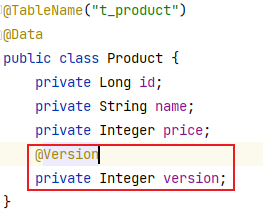
2. 配置类中开启乐观锁插件
    ```java
    @Configuration
    public class MyConfig {
        @Bean
        public MybatisPlusInterceptor mybatisPlusInterceptor(){
            MybatisPlusInterceptor interceptor = new MybatisPlusInterceptor();
            interceptor.addInnerInterceptor(new OptimisticLockerInnerInterceptor());
            return interceptor;
        }
    }
    ```
      - 此时老板获得的价格为 150，因为小李的修改会执行，小王的修改不会执行。
      - 小王如果想要修改成功，可以进行判断，修改不成功重新获取最新版本的数据进行修改
    ```java
    @SpringBootTest
    public class ProductMapperTests {
        @Autowired
        private ProductMapper productMapper;
        @Test
        public void  test02(){
            //1. 小李查询商品价格
            Product productL = productMapper.selectById(1);
            System.out.println("小李查询的商品价格" + productL.getPrice());
            //2. 小王查询商品价格
            Product productW = productMapper.selectById(1);
            System.out.println("小王查询的商品价格" + productW.getPrice());
            System.out.println("----------修改价格前------------");
            //3. 小李对商品价格+50
            productL.setPrice(productL.getPrice() + 50);
            productMapper.updateById(productL);
            //4. 小王对商品价格-30
            System.out.println("小王查询的商品价格" + productW.getPrice());
            productW.setPrice(productW.getPrice() - 30);

            int result = productMapper.updateById(productW);
            if(result == 0){
                Product product = productMapper.selectById(1);
                product.setPrice(product.getPrice() - 30);
                productMapper.updateById(product);
            }

            productMapper.updateById(productL);
            System.out.println("----------修改价格后------------");
            //5. 老板检查价格
            Product productB = productMapper.selectById(1);
            System.out.println("老板查询的商品价格" + productB.getPrice());
        }
    }
    ```

## 6. 扩展

### 6.1 通用枚举

1. user 数据表添加 sex 字段，用整数 1、2 表示男、女
2. User 实体类定义 SexEnum 类型的属性 sex
3. 创建 SexEunm 的枚举类，定义属性 sex 和 sexNmae，并用@EnumValue 注解标识 sex 属性
4. 在 springboot 核心配置文件中开启通用枚举扫描：`mybatis-plus:.typeEnumsPackage: iceriver.mybatisplus.enums`

### 6.2 代码生成器

与 mybatis 中的逆向工程插件类似，不过 mybatis 的逆向工程只能生成实体类、dao 层 mappper 和 mapper 映射文件。
而 mybatis-plus 可以生成上述文件外，还能生成 controller 和 service 及 serviceimpl

1. 创建新模块
   - 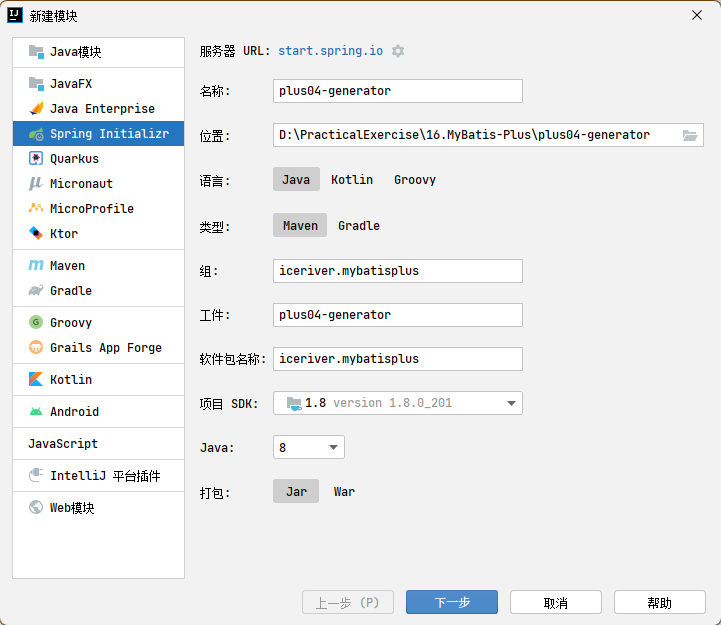
2. 添加依赖：mybatis-plus-generator 和 freemarker

```xml
<dependency>
  <groupId>com.baomidou</groupId>
  <artifactId>mybatis-plus-generator</artifactId>
  <version>3.5.1</version>
</dependency>
<!-- 模板引擎 -->
<dependency>
  <groupId>org.freemarker</groupId>
  <artifactId>freemarker</artifactId>
  <version>2.3.31</version>
</dependency>
```

3. 创建测试类，执行 main 方法

```java
public class FastAutoGeneratorTest {
    public static void main(String[] args) {
        FastAutoGenerator.create("jdbc:mysql://127.0.0.1:13306/mybatis_plus?characterEncoding=utf-8&userSSL=false", "root", "dimitre123")
            .globalConfig(builder -> {
                builder.author("zhuyuqi") // 设置作者
                    //.enableSwagger() // 开启 swagger 模式
                    .fileOverride() // 覆盖已生成文件
                    .outputDir("D:\\PracticalExercise\\16.MyBatis-Plus\\plus04-generator\\mybatis_plus_generate_code"); // 指定输出目录
            })
            .packageConfig(builder -> {
                builder.parent("iceriver") // 设置父包名
                    .moduleName("mybatisplus") // 设置父包模块名
                    .pathInfo(Collections.singletonMap(OutputFile.mapperXml, "D:\\PracticalExercise\\16.MyBatis-Plus\\plus04-generator\\mybatis_plus_generate_code")); // 设置mapperXml生成路径
            })
            .strategyConfig(builder -> {
                builder.addInclude("user") // 设置需要生成的表名
                    //.addTablePrefix("t_", "c_")// 设置过滤表前缀
                    ;
            })
            .templateEngine(new FreemarkerTemplateEngine()) // 使用Freemarker引擎模板，默认的是Velocity引擎模板
            .execute();
    }
}
```

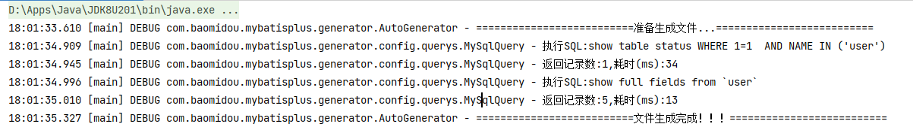
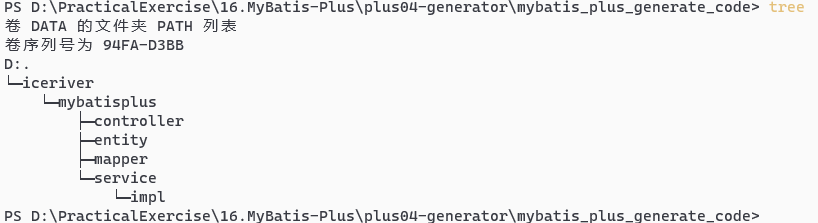

### 6.3 多数据源

1. 使用场景：表分散在多库、读写分离、一主多从、混合模式
2. 创建数据库及表：
   - 第一个使用 mybatis_plus 库、user 表
   - 第二个使用 mybatis_plus_01 库、product 表
3. 新建模块
   - 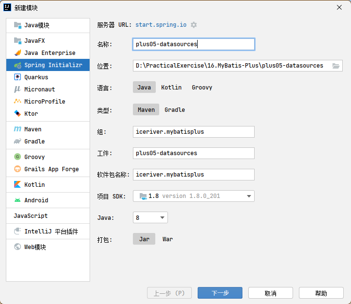
4. 引入依赖：mybaitis-plus、lombok、mysql、dynamic-datasource-spring-boot-starter

```xml
<?xml version="1.0" encoding="UTF-8"?>
<project xmlns="http://maven.apache.org/POM/4.0.0" xmlns:xsi="http://www.w3.org/2001/XMLSchema-instance"
         xsi:schemaLocation="http://maven.apache.org/POM/4.0.0 https://maven.apache.org/xsd/maven-4.0.0.xsd">
  <modelVersion>4.0.0</modelVersion>
  <parent>
    <groupId>org.springframework.boot</groupId>
    <artifactId>spring-boot-starter-parent</artifactId>
    <version>2.7.2</version>
    <relativePath/> <!-- lookup parent from repository -->
  </parent>
  <groupId>iceriver.mybatisplus</groupId>
  <artifactId>plus05-datasources</artifactId>
  <version>0.0.1-SNAPSHOT</version>
  <name>plus05-datasources</name>
  <description>plus05-datasources</description>
  <properties>
    <java.version>1.8</java.version>
  </properties>
  <dependencies>
    <dependency>
      <groupId>org.springframework.boot</groupId>
      <artifactId>spring-boot-starter</artifactId>
    </dependency>
    <dependency>
      <groupId>org.springframework.boot</groupId>
      <artifactId>spring-boot-starter-test</artifactId>
      <scope>test</scope>
    </dependency>

    <dependency>
      <groupId>mysql</groupId>
      <artifactId>mysql-connector-java</artifactId>
      <scope>runtime</scope>
    </dependency>

    <dependency>
      <groupId>org.projectlombok</groupId>
      <artifactId>lombok</artifactId>
      <optional>true</optional>
    </dependency>

    <dependency>
      <groupId>com.baomidou</groupId>
      <artifactId>mybatis-plus-boot-starter</artifactId>
      <version>3.5.1</version>
    </dependency>

    <dependency>
      <groupId>com.baomidou</groupId>
      <artifactId>dynamic-datasource-spring-boot-starter</artifactId>
      <version>3.5.0</version>
    </dependency>
  </dependencies>

  <build>
    <plugins>
      <plugin>
        <groupId>org.springframework.boot</groupId>
        <artifactId>spring-boot-maven-plugin</artifactId>
      </plugin>
    </plugins>
  </build>
</project>
```

4. 在 springboot 核心配置文件中添加多数据源

```xml
spring:
  # 配置数据源信息
  datasource:
    dynamic:
      # 设置默认的数据源或者数据源组,默认值即为master
      primary: master
      # 严格匹配数据源,默认false.true未匹配到指定数据源时抛异常,false使用默认数据源
      strict: false
      datasource:
        master:
          url: jdbc:mysql://localhost:13306/mybatis_plus?characterEncoding=utf-8&useSSL=false
          driver-class-name: com.mysql.cj.jdbc.Driver
          username: root
          password: dimitre123
        slave_1:
          url: jdbc:mysql://localhost:13306/mybatis_plus_01?characterEncoding=utf-8&useSSL=false
          driver-class-name: com.mysql.cj.jdbc.Driver
          username: root
          password: dimitre123
```

5. 创建相关的实体类、service、mapper
   - 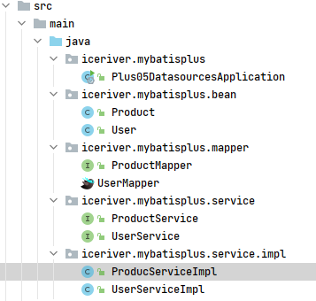
   - UserServiceImpl 使用@DS("master")指定为主数据源
   - ProductServiceImpl 使用@DS("master")指定为主数据源
6. 执行测试

```java
@SpringBootTest
class Plus05DatasourcesApplicationTests {
    @Autowired
    private UserService userService;
    @Autowired
    private ProductService productService;
    @Test
    public void test(){
        System.out.println(userService.getById(1));
        System.out.println(productService.getById(1));
    }
}
```

### 6.4 MyBatisX 插件

#### 6.4.1 基本介绍

1. MyBatis-Plus 提供了强大的 mapper 和 service 模板，能够大大的提高开发效率但是在真正开发过程中，MyBatis-Plus 并不能为我们解决所有问题，例如一些复杂的 SQL，多表联查，我们就需要自己去编写代码和 SQL 语句，我们该如何快速的解决这个问题呢，这个时候可以使用 MyBatisX 插件
2. MyBatisX 一款基于 IDEA 的快速开发插件，为效率而生
4. 安装插件
   - 
5. 功能：
   - 可以快速定位 mapper 类和映射文件
     - 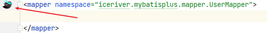
   - 代替本文 6.2 代码生成器[https://www.yuque.com/zhuyuqi/zna9x5/hientp#W0v7A](#W0v7A)，并可视化操作生成过程。
   - 快速生成自定义 curd 方法
6. mapper 映射文件的路径设置参见本文 2.1.2 1 点设置 mapper 文件路径[https://www.yuque.com/zhuyuqi/zna9x5/hientp#JebDR](#JebDR)

#### 6.4.2 mybatisx 快速代码生成

1. 创建模块：
   - 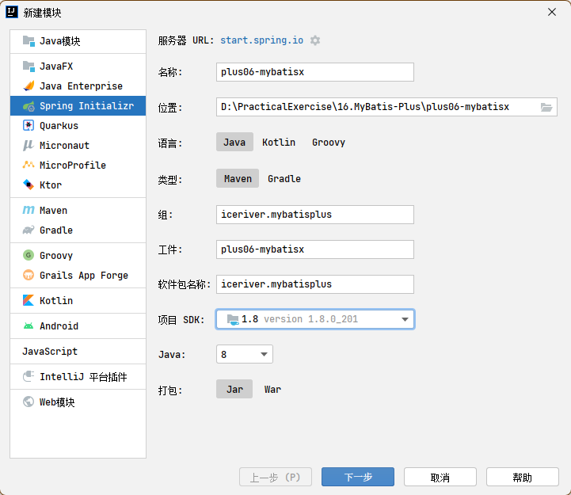
2. 引入依赖：mybaitis-plus、lombok、mysql

```xml
<?xml version="1.0" encoding="UTF-8"?>
<project xmlns="http://maven.apache.org/POM/4.0.0" xmlns:xsi="http://www.w3.org/2001/XMLSchema-instance"
         xsi:schemaLocation="http://maven.apache.org/POM/4.0.0 https://maven.apache.org/xsd/maven-4.0.0.xsd">
  <modelVersion>4.0.0</modelVersion>
  <parent>
    <groupId>org.springframework.boot</groupId>
    <artifactId>spring-boot-starter-parent</artifactId>
    <version>2.7.2</version>
    <relativePath/> <!-- lookup parent from repository -->
  </parent>
  <groupId>iceriver.mybatisplus</groupId>
  <artifactId>plus06-mybatisx</artifactId>
  <version>0.0.1-SNAPSHOT</version>
  <name>plus06-mybatisx</name>
  <description>plus06-mybatisx</description>
  <properties>
    <java.version>1.8</java.version>
  </properties>
  <dependencies>
    <dependency>
      <groupId>org.springframework.boot</groupId>
      <artifactId>spring-boot-starter</artifactId>
    </dependency>

    <dependency>
      <groupId>org.springframework.boot</groupId>
      <artifactId>spring-boot-starter-test</artifactId>
      <scope>test</scope>
    </dependency>

    <dependency>
      <groupId>mysql</groupId>
      <artifactId>mysql-connector-java</artifactId>
      <scope>runtime</scope>
    </dependency>

    <dependency>
      <groupId>org.projectlombok</groupId>
      <artifactId>lombok</artifactId>
      <optional>true</optional>
    </dependency>

    <dependency>
      <groupId>com.baomidou</groupId>
      <artifactId>mybatis-plus-boot-starter</artifactId>
      <version>3.5.1</version>
    </dependency>
  </dependencies>

  <build>
    <plugins>
      <plugin>
        <groupId>org.springframework.boot</groupId>
        <artifactId>spring-boot-maven-plugin</artifactId>
      </plugin>
    </plugins>
  </build>
</project>
```

3. applicaiton.yml 核心配置文件中配置数据源

```yaml
spring:
  # 配置数据源信息
  datasource:
    type: com.zaxxer.hikari.HikariDataSource
    url: jdbc:mysql://localhost:13306/mybatis_plus?characterEncoding=utf-8&useSSL=false
    driver-class-name: com.mysql.cj.jdbc.Driver
    username: root
    password: dimitre123
```

4. 在 IDEA 中连接数据库：
   - 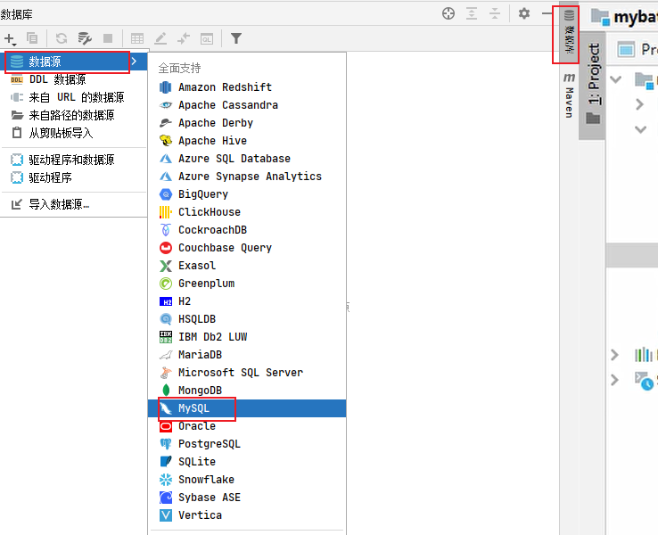
   - 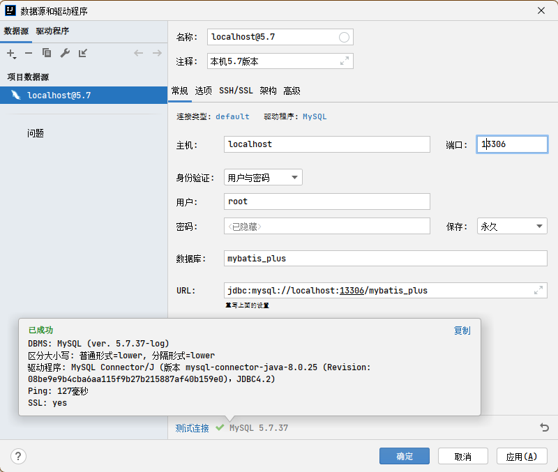
   - 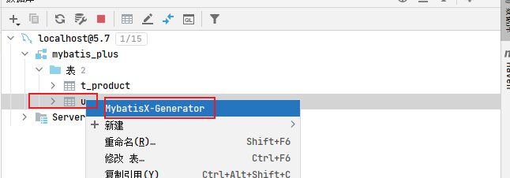
   - 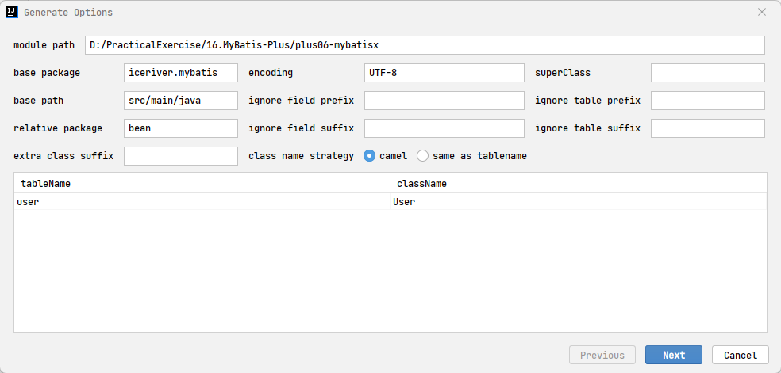
   - 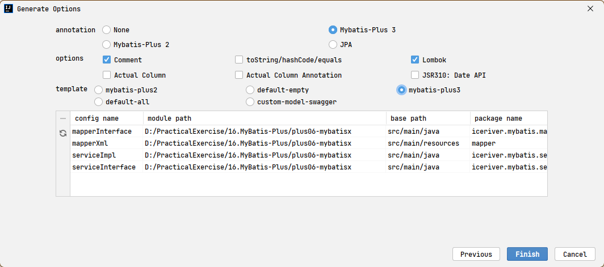
   - 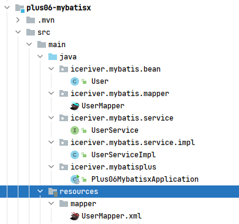

#### 6.4.3 自定义 CURD（快速生成 xml 中 sql）

1. 以插入为例，输入 insert，选择 insertSelective
   - 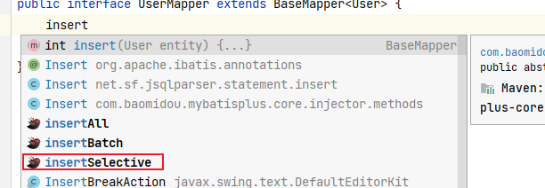
2. 按下 alt+enter，选择第二个，会快速生成 mapper 方法和 sql
   - 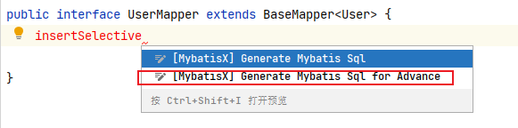
   - 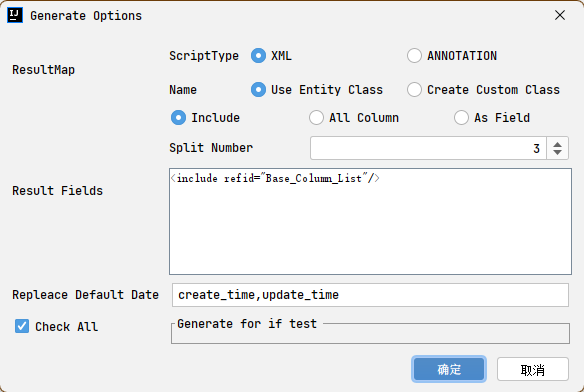
   - 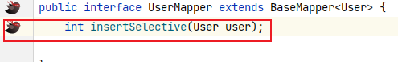
   - 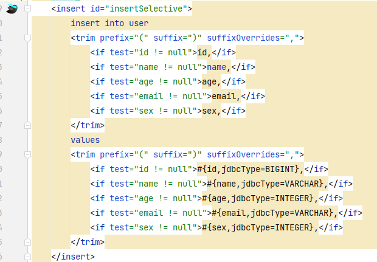
