*Spring 是轻量级的开源 JavaEE 框架，具有高效、简洁开发的特点，用于解决企业应用开发的复杂性。*
<!-- more -->

## 1. Spring 概述

### 1.1 Spring 框架介绍

#### 1.1.1 基本介绍

1. 是什么：Spring 是轻量级的开源 JavaEE 框架
   - 框架：高效、简洁开发
2. 作用：解决企业应用开发的复杂性
3. 核心：IoC 和 Aop
   - IoC：控制反转，把创建对象过程交给 Spring 进行管理
   - Aop：面向切面，不修改源代码进行功能增强
4. 特点：
   - 方便解耦，简化开发
   - Aop 编程支持
   - 方便程序测试
   - 方便和其他框架进行整合
   - 方便进行事务操作
   - 降低 API 开发难度

#### 1.1.2 框架结构图

4.x 版本

spring5


### 1.2 Spring5.2 下载

#### 1.2.1 手动下载，引入 IDEA

1. 下载地址：
   - 
   - 确认版本：
     - 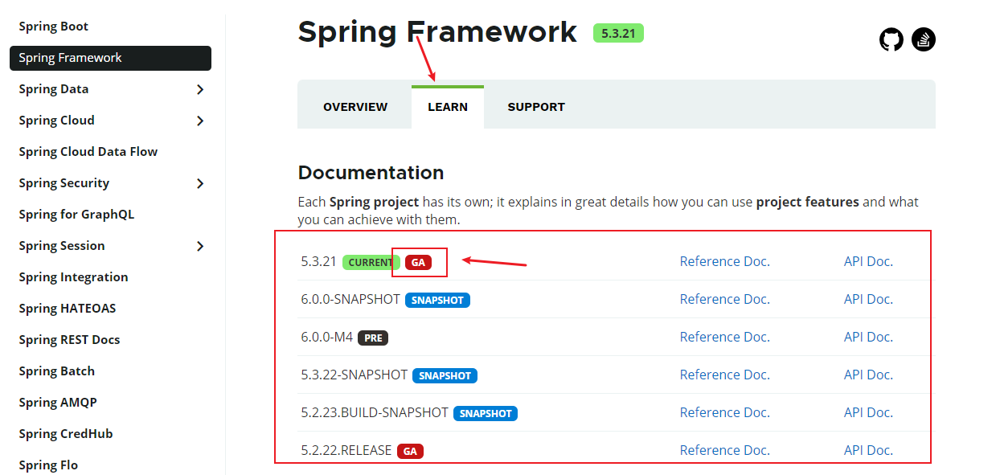
   - 前往下载页面：
     - 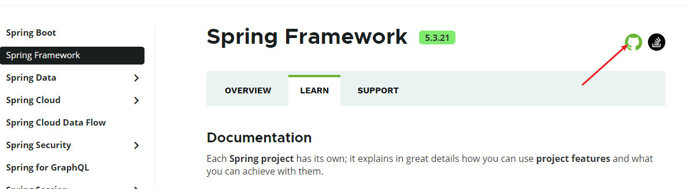
     - 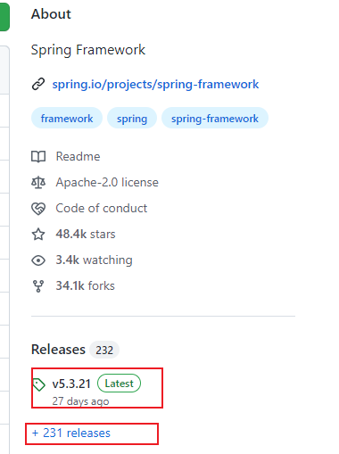第一个框中的为最新版本，第二个框中的为历史版本
   - 下载源码：
     - 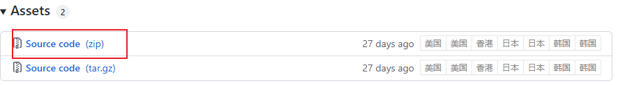
   - 下载后找个位置存放即可。
2. IDEA 中创建普通 Java 工程【不同版本 IDEA 的步骤不同】
   - 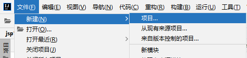
   - 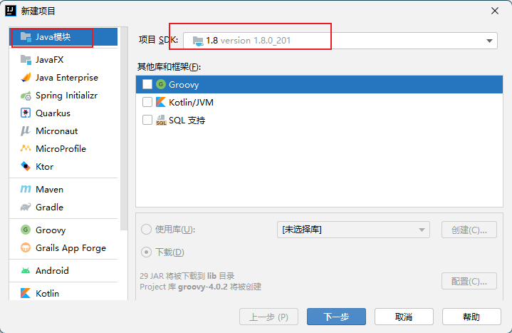
   - 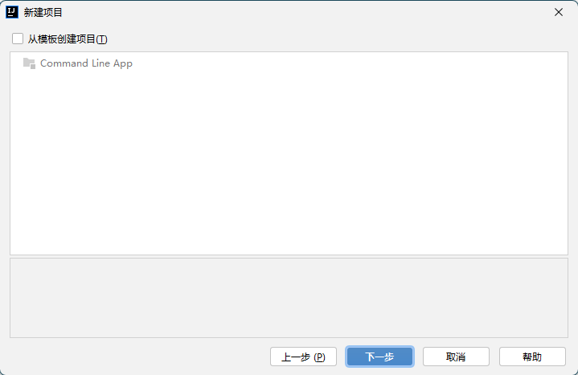
   - 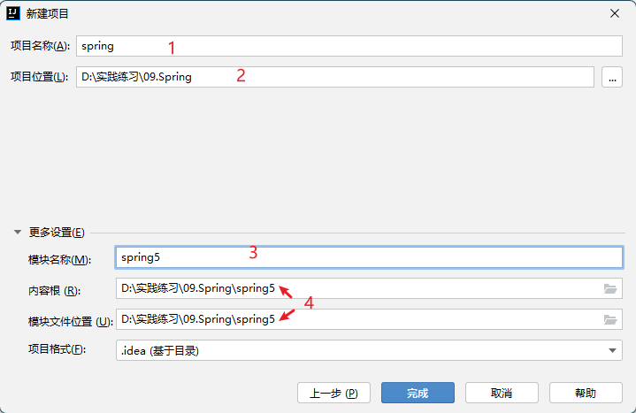
     - 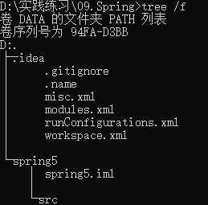
     - 文件结构说明：通过本地文件存储结构，可以看到项目名称【1】spring 只是一个虚拟的文件管理路径，模块【3】spring5 是真实的文件路径。同时由于项目名称和模块名称不一致，所以 IDEA 自动创建了模块的本地存放路径【4】，【2】的直接子路径下也没有 src 目录。即如果采取【1】【3】同名的方式，则不会创建【4】路径，而是【4】=【2】，同时【2】的直接子路径下也会生成 src 目录。——原因为 IDEA 工具的项目、模块关系设计决定。
3. 导入 jar 包作为 lib 库
   - spring5 下新建 libs 文件夹，作为本模块的依赖库
     - 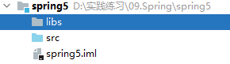
   - 将 spring5 的核心 jar 包拷贝至 libs 目录
     - 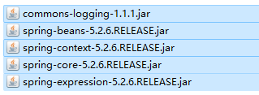
     - 这里还引入了`commons-logging.jar`，这是一个 apache 的一个日志文件，spring5 需要这个文件，下载引入即可。下载地址：
   - 将 jar 包作为【模块】依赖库——也可以作为项目依赖库，看具体需求
     - 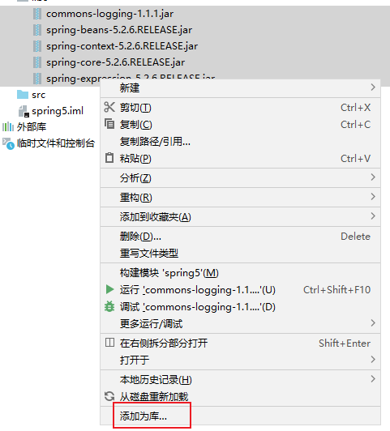
     - 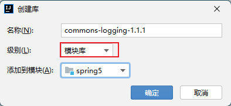
     - 注意：这样添加的 5 个包会用一个名字。单独一个一个添加可以创建 5 个名字。

#### 1.2.2 基于 maven 构建

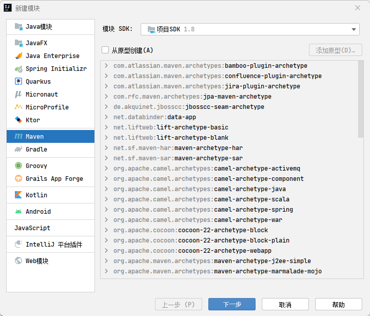
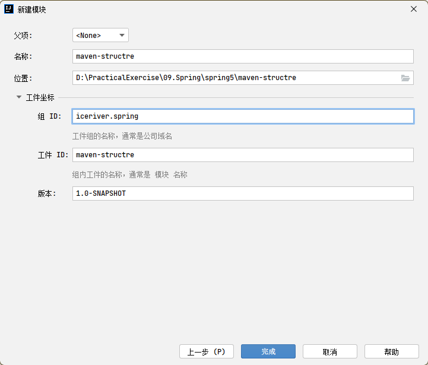
引入依赖

```xml
<?xml version="1.0" encoding="UTF-8"?>
<project xmlns="http://maven.apache.org/POM/4.0.0"
         xmlns:xsi="http://www.w3.org/2001/XMLSchema-instance"
         xsi:schemaLocation="http://maven.apache.org/POM/4.0.0 http://maven.apache.org/xsd/maven-4.0.0.xsd">
    <modelVersion>4.0.0</modelVersion>

    <groupId>iceriver.spring</groupId>
    <artifactId>maven-structre</artifactId>
    <version>1.0-SNAPSHOT</version>

    <properties>
        <maven.compiler.source>8</maven.compiler.source>
        <maven.compiler.target>8</maven.compiler.target>
    </properties>
    <dependencies>
<!--        必须引入-->
        <dependency>
            <groupId>org.springframework</groupId>
            <artifactId>spring-context</artifactId>
            <version>5.3.22</version>
        </dependency>
<!--        按需引入juint-->
        <dependency>
            <groupId>junit</groupId>
            <artifactId>junit</artifactId>
            <version>4.11</version>
        </dependency>
    </dependencies>
</project>
```

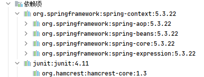
基于配置文件时，配置文件写在 resources 路径下，名称任意。

### 1.3 体验 spring 创建对象

#### 1.3.1 使用配置文件方式

1. 编写类及方法【任意】。
   - 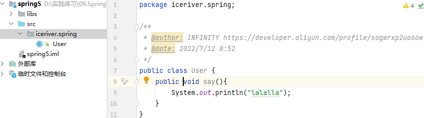
2. 创建配置文件（位置选择 src 目录，名字任意）：
   - 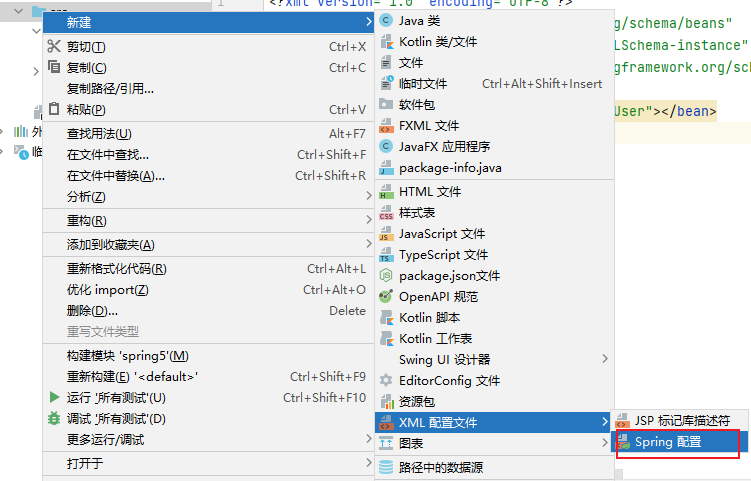
   - 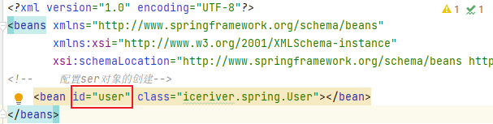
     - 这个 id 不是要创建的对象名字，而是通过这个 id 可以找到对应的类，相当于属性名。
3. 创建 javabean：

```java
package iceriver.spring;

/**
 * @author: INFINITY https://developer.aliyun.com/profile/sagwrxp2ua66w
 * @date: 2022/7/12 8:52
 */
public class User {
    private String name;
    private String password;

    public User(String name, String password) {
        this.name = name;
        this.password = password;
    }

    public User() {
    }

    public void say(){
        System.out.println("lalalla");
    }

    public void setName(String name) {
        this.name = name;
    }

    public void setPassword(String password) {
        this.password = password;
    }

    @Override
    public String toString() {
        return "User{" +
                "name='" + name + '\'' +
                ", password='" + password + '\'' +
                '}';
    }
}
```

4. 创建 User 对象
5.

## 2. IoC 及 IoC 操作

### 2.1 IoC 简述

#### 2.1.1 IoC 概念

1. 含义：控制反转
2. 作用：把对象创建和对象之间的调用过程，交给 Spring 进行管理
3. 目的：降低耦合度
4. 底层：xml 解析、工厂模式、反射

#### 2.2.2 底层原理

1. 在 xml 文件中配置类的路径 classPath
2. 使用类工厂创建对象
   - 解析 xml，读取 classPath
   - 使用 classPath，利用反射机制`Class.forName(classPath)`获取类的对象
   - 使用`newInstance()`实例化对象


#### 2.2.3 IoC 接口

1. IoC 思想基于 IoC 容器，该容器的底层就是对象工厂
   - 容器：为某种特定组件的运行提供必要支持的软件环境
   - IoC 容器：管理所有轻量级的 JavaBean 组件，提供生命周期管理、配置和组装服务、AOP 支持、建立在 AOP 基础上的声明式事务等。
2. IoC 容器的实现方式（接口）
   - `BeanFactory`接口：IOC 的基本实现，Spring 内部使用，不建议开发人员使用
     - 加载配置文件时不会创建，获取对象时才去创建
   - `AplicationContext`接口：`BeanFactory`的子接口，功能更强大，给开发人员使用
     - 加载配置文件时即创建对象
3. `ApplicationContext`的两个重要实现类：（取决于使用哪种方式加载 xml 配置文件）

   > - IDEA 中 ctrl+h 打开层次结构图

   - 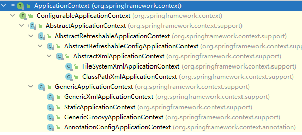
   - `ClassPathXmApplicationContext`
   - `FileSystemXmlApplicationContext`
   - 基于注解的开发使用`AnnotationConfigApplicationContext`

4. `BeanFactory`：
   - 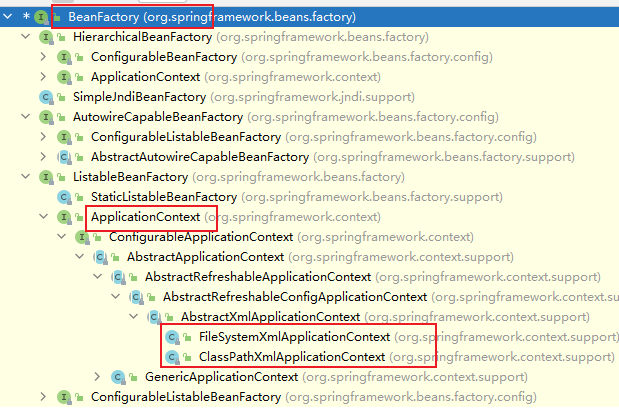
   - 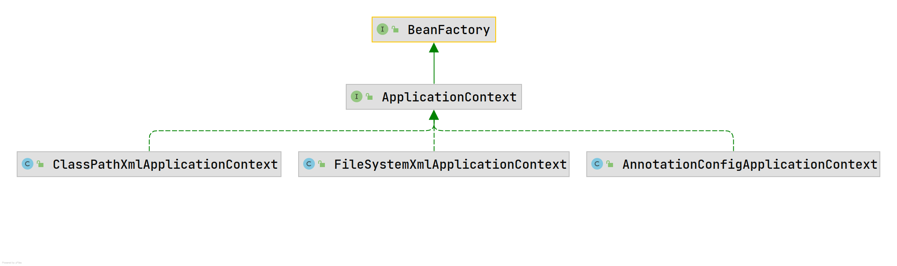

#### 2.2.4 Bean 管理

1. Bean 管理指：Spring 创建对象、Spring 注入属性
2. 操作方式：基于 xml 配置文件实现、基于注解方式实现

### 2.2 基于 xml 操作——Bean 管理

#### 2.2.1 创建对象

1. xml 文件中：使用`<bean>`标签，`id`指定该类的对象名字，`class`指向类的全路径
   - `<bean id="user" class="iceriver.spring.User"></bean>`
2. 要使用该对象的类中：加载类对象：
   - `BeanFactory context = new ClassPathXmlApplicationContext("iceriver.xml");`
   - 【建议】`ApplicationContext context = new ClassPathXmlApplicationContext("iceriver.xml");`
3. 要使用该对象的类中：创建对象（默认使用类的无参构造器）：
   - `User user = context.getBean("user", User.class);`
   - 没有无参构造器/无参构造器不可用时会报错。——xml 文件找不到类

#### 2.2.2 注入属性

1. `DI`：依赖注入，即注入属性
2. 方式一：使用属性的 setter
   - **【前提】：JavaBean 的类中声明了对应属性的 setter 方法、同时无参构造器可用。**
   - xml 文件中配置`<bean>`标签的子标签`<property>`
     - `name`表示给哪个属性赋值
     - `value`表示该属性的注入的值
     - 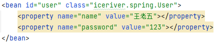
     - 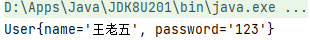
     - `name`是`<poperty>`的必需属性，`value`属性可以作为`<property>`的子标签设置
     - 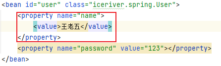

- 方式二：使用带参构造器
  - 【前提】：JavaBean 中有对应属性的构造器方法，同时也显式地声明**无参构造器，用于 xml 文件找到对应地类文件。**
  - xml 文件中配置`<bean>`标签的子标签`<constructor-arg>`
    - `name`表示给哪个属性赋值；也可以使用索引形式，从 0 开始
    - `value`表示该属性的注入的值
    - 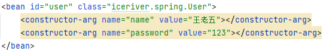

3. 方式三：p 名称空间注入：对基于 xml 配置文件注入属性的优化
   - 配置`<beans>`标签的 p 名称空间：
     - `<beans xmlns:p="http://www.springframework.org/schema/p">`
   - 给`<bean>`标签添加属性：`<bean id="" class="" p:name1="" p:name2="">`
     - 
4. xml 注入其他类型的属性：
   - `null`值：
     - 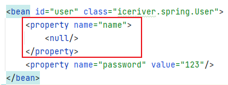
   - 特殊字符值`>、<`：
     - 使用转义字符：`<`代表`<`，`>`代表`>`
     - 将带`>、<`的文本写入至`CDATA`
       - 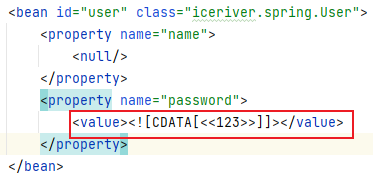
       - 如果有回车符也会原样输出。
5. 注入属性——外部 Bean
   - 原始方法：在 service 类中创建 dao 对象，使用 dao 对象调用其方法
   - 注入方式：在 service 类中，把 dao 当作私有化属性，并创建其 setter，在 xml 文件中给 service 类进行注入属性配置。
     - 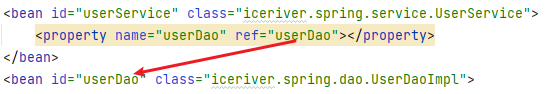
6. 注入属性——内部 Bean 和级联赋值
   - 内部 Bean：一个`<bean>`中嵌套了另一个`<bean>`
     - 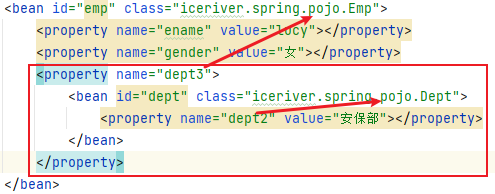
     - dept2 是 Dept 的私有属性，dept3 是 Emp 的私有属性。
   - 级联赋值：配置嵌套配置【上面的配置也是一种级联赋值】
     - 方式一：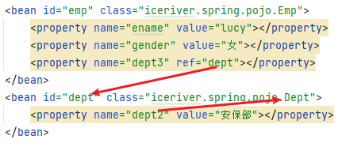
     - 方式二：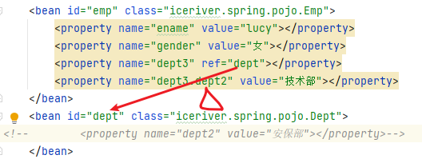
     - 方式二中，要使用`dept3.dept2`，还得给`Emp`类中的`Dept`属性类设置 getter，否则会找不到。这样设置后，注释内容（安保部）会失效。
7. 注入数组、集合类属性：
   - 注入数组：
     - 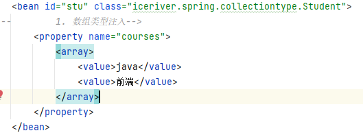
   - 注入 List 集合：
     - 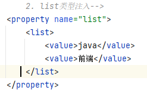
   - 注入 Map 类型集合：
     - 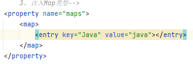
   - 注入 Set 类型集合：
     - 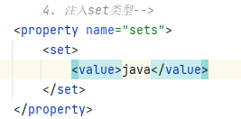
   - 注入指定类型【List】的集合：
     - 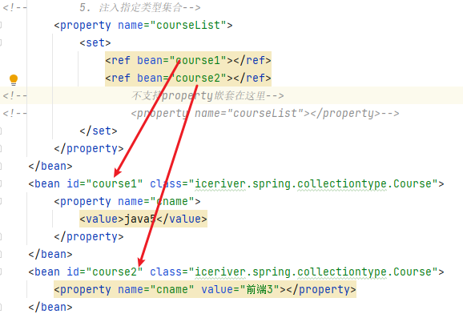
   - 注入指定类型【Map】的集合：
     - 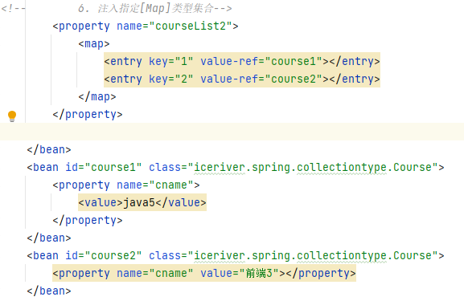
   - 提取集合类型的属性注入：
     - 配置 util 空间：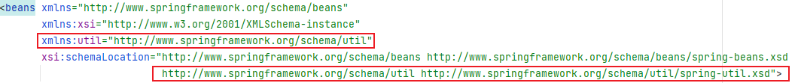
     - 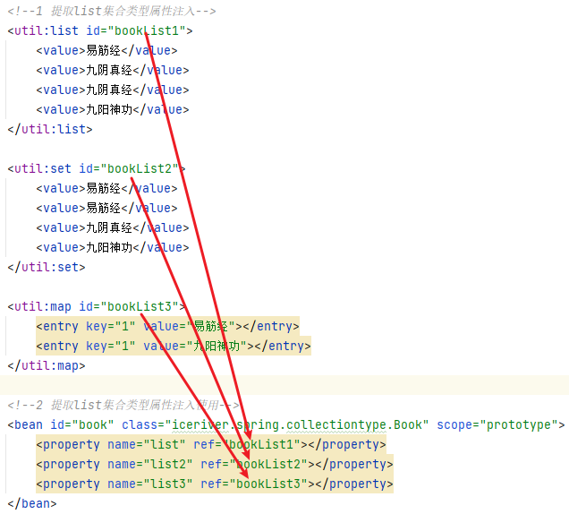
   - 注意事项：注入数组、List 集合、set 集合的配置中，`<array>`、`<list>`、`<set>`三个标签可互换，其中，`<set>`标签包裹的`<value>`值如果有重复时，重复项只取一项。

#### 2.2.3 FactoryBean

1. Spring 有两种`Bean`，一种是普通`Bean`，另一种是`FactoryBean`
   - 普通`Bean`：xml 文件中 class 配置的是什么类，创建实例的时候就返回该类型
   - 工厂`Bean`（`FactoryBean`）：xml 文件中 class 配置的类型，和创建实例时返回的类型可以不一致。
2. `FactoryBean`的使用：
   - 创建普通 Bean 时，让其实现`FactoryBean`接口。
   - `FactoryBean`使用泛型，指定需要创建实例时，返回的类型。
   - 在实现`FactoryBean`的`getObject()`方法中，将返回值类型指定为传入的泛型类
     - `getObject()`：通过一个对象交给 ioc 容器管理
     - `getObjectType()`：设置所提供对象的类型
     - `isSingleton()`：所提供的对象是否单例
   - 此时得到的类型不再是实现`FactoryBean`接口的类的类型，而是传给`FactoryBean`接口范型的类型（即`FactoryBean`方法返回的类型。获取实现`FactoryBean`接口的类对象会出错。

#### 2.2.4 Bean 作用域

1. Spring 中，默认情况下，创建的 Bean 实例默认是单实例——内存中只有一个实例对象
2. 设置多实例：
   - `<bean>`标签设置`scope`属性
     - `singleton`：单实例，默认值，加载 xml 配置文件时，即创建对象
     - `prototype`：多实例，调用`getBean()`时创建多实例对象
     - `request`：每次 HTTP 请求时创建实例
     - `session`：每个会话中创建实例

#### 2.2.5 Bean 生命周期（共 7 步）

1. 通过构造器创建 bean 实例（无参数构造）
   - 读取配置文件，创建 Class 类对象
2. 为 bean 的属性设置值和对其他 bean 引用（调用 set 方法）
   - 读取配置文件，创建 Class 类对象
3. 把 bean 实例传递 bean 前置处理器的方法 `postProcess**Before**Initialization()`
   - 要求类实现`BeanPostProcessor`接口
   - 实现`BeanPostProcessor`接口的类的配置，会导致本配置文件中的所有类都添加后置处理器
4. 调用 bean 的初始化的方法（需要进行配置初始化的方法）
   - `<bean>`须配置属性`init-method = "initMethod()"`——方法名任意
5. 把 bean 实例传递 bean 后置处理器的方法 `postProcess**After**Initialization()`
6. bean 可以使用了（对象获取到了）
   - 通过 Class 对象创建实例对象完毕。
7. 当容器关闭时候，调用 bean 的销毁的方法（需要进行配置销毁的方法）
   - `<bean>`须配置属性`destory-method = "destoryMethod()"`——方法名任意
   - 类中显式调用`context.close()`——`context`是根据 xml 文件获得的 Class 类对象

#### 2.2.6 xml 自动装配

1. 根据指定的装配规则（属性名称或属性类型），Spring 自动将匹配的属性值进行注入
2. `<bean>`标签配置`autowrite`属性
   - `byName`：根据属性名注入，要求外部 bean 的 id 值，和要注入的类中的属性名称一样
   - `byType`：根据属性类型注入。

#### 2.2.7 配置文件装配数据源

1. xml 文件直接配置 Druid 连接池：
   - 添加 druid 连接池 jar 包
   - 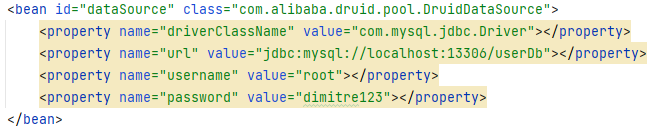
2. xml 读取配置文件进行配置 Druid 连接池
   - 新建配置文件`jdbc.properties`
     - 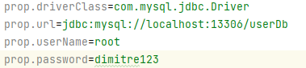
   - 引入名称空间：
     - 
   - 引入配置文件
     - 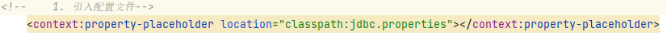
   - 使用表达式：
     - 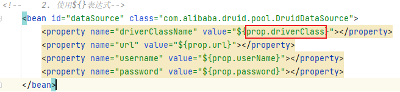
     - `{}`中的值要与`.properties`配置文件中的名称一致。

### 2.3 基于注解操作——Bean 管理

#### 2.3.1 Spring 中 Bean 管理的注解

1. `@Component`
2. `@Service`
3. `@Controller`
4. `@Repostory`

- 注意：上述四个注解作用一致，只是针对不同 JavaBean 进行语义化使用

#### 2.3.2 基于注解创建对象

1. 引入依赖`spring-aop-5.2.6.RELEASE`
2. 引入名称空间：
   - 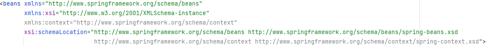
3. 开启组件扫描：
   - 方式一：逗号分隔多个包
     - 
   - 方式二：扫描上级包
     - 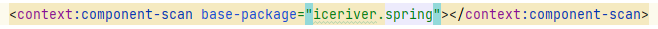
4. 配置注解：
   - 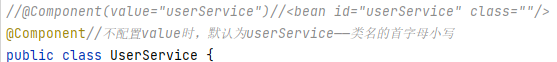
5. 组件扫描配置
   - 设置扫描指定注解为`Controller`的类
     - 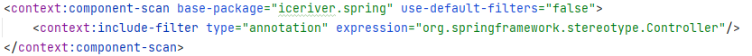
   - 设置不扫描指定注解为`Controller`的类
     - 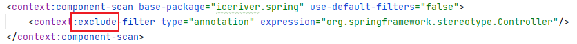

#### 2.3.3 属性注入

1. `@Autowried`：根据属性类型自动装配
   - 在要注入的属性声明上面，添加`@Autowired`
   - 该属性的 setter 不是必须
2. `@Qualifier`：根据属性名进行注入，需要配合`@Autowired`使用
   - 适用于`@Autowried`查找到多个实现类的情况
   - 给被注入的类指定`value`值
     - 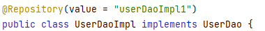
   - 在要注入的属性声明上面，添加`@Autowired`和`@Qualifier`，给`@Qualifier`配置`value`值
     - 
3. `@Resource`：可以根据类型注入，也可以根据名称注入
   - 在要注入的属性声明上面，添加`@Resource`——根据类型注入
     - 
   - 在要注入的属性声明上面，添加`@Resource`，并配置`name`属性值——根据类型注入
     - 
     - `@Resource`来源于`import javax.annotation.Resource;`，所以官方不推荐使用这个。
4. `@Value`：给普通属性注入值
   - 在要注入的属性声明上面，添加`@Value`
   - 使用`value`属性设置值
     - 

#### 2.3.4 完全注解开发

1. 创建配置类，替代 xml 配置文件
   - 类的名称任意
   - 使用`@Configuration`声明这是一个配置类
   - 使用`@ComponentScan(basePackages = {"iceriver.spring"})`指定扫描的基本路径
2. 使用`AnnotationConfigApplicationContext`加载配置类
   - 

## 3. Aop

### 3.1 Aop 介绍

#### 3.1.1 Aop 概念

1. `Aspect Oriented Programming`的缩写，意为面向切面编程。
2. 是一种通过预编译和运行期间动态代理实现程序功能统一维护的一种技术。
3. Aop 是 OOP 的延续，也是函数式编程的一种衍生泛型。
4. Aop 可以对业务逻辑的各个部分进行隔离，使业务逻辑各部分之间的耦合度降低，提高程序的可重用性，提高开发的效率。
   - 不修改源代码的情况下，在主干功能里面添加新功能。

#### 3.1.2 Aop 底层原理

1. 底层使用了动态代理进行实现，有接口情况下，使用 JDK 实现动态代理；没有接口情况下，通过 CGLIB 动态代理。
   - 
2. JDK 实现动态代理：创建接口实现类的代理对象，增强类的方法。
   - 通过`java.lang.reflect.Proxy`中的`newProxyInstance(ClassLoader loader,Class<?>[] interfaces,InvocationHandler h)`
     - loader - 定义代理类的类加载器
     - interfaces - 代理类要实现的接口列表
     - h - 指派方法调用的调用处理程序：可以使用匿名内部类，也可以创建要被代理的类的实现类。

```java
package iceriver.spring.jdk;

import java.lang.reflect.InvocationHandler;
import java.lang.reflect.Method;
import java.lang.reflect.Proxy;
import java.util.Arrays;

/**
 * @author: INFINITY https://developer.aliyun.com/profile/sagwrxp2ua66w
 * @date: 2022/7/16 7:58
 */
public class JDKProxy {
    public static void main(String[] args) {
        Class[] interfaces = {UserDao.class};
//        1. 方式一：第三个参数使用匿名内部类
//        Proxy.newProxyInstance(JDKProxy.class.getClassLoader(), interfaces, new InvocationHandler() {
//            @Override
//            public Object invoke(Object proxy, Method method, Object[] args) throws Throwable {
//                return null;
//            }
//        });
//      2. 方式二：第三个参数使用代理类
        UserDao userDao = new UserDaoImpl();
        UserDao dao = (UserDao) Proxy.newProxyInstance(JDKProxy.class.getClassLoader(), interfaces, new UserDaoProxy(userDao));
        int result = dao.add(2, 3);
        System.out.println(result);
    }
}

/**
 * 创建代理对象
 */
class UserDaoProxy implements InvocationHandler{
//    增强原始类功能的代码
    private Object obj;

    public UserDaoProxy(Object obj) {
        this.obj = obj;
    }

    @Override
    public Object invoke(Object proxy, Method method, Object[] args) throws Throwable {
        System.out.println("方法之前执行……" + method.getName() + "，传递的参数：" + Arrays.toString(args));

        Object res = method.invoke(obj, args);

        System.out.println("方法之后执行" + obj);

        return res;
    }
}
```

3. CGLIB 实现动态代理：创建当前类的子类代理对象，增强类的方法。


#### 3.1.3 Aop 术语

1. `Joinpoint`(连接点)：类中可以被增强的方法。
2. `Pointcut`(切入点)：实际真正被增强的方法。
3. `Advice`(通知/增强)：实际增强的逻辑部分。
   - 前置通知：`@Before`注解，被代理类的方法【切入点】执行之前执行
   - 后置通知：`@AfterReturning`注解，返回结果后执行，后于最终通知
   - 异常通知：`@AfterThrowing`注解，有异常才执行
   - 最终通知：`@After`注解，即使有异常也执行
   - 环绕通知：`@Arround`注解，被代理类的方法【切入点】执行之前、之后都执行
   - 顺序：
     - 【无异常】
     - 【有异常】
4. `Aspect`(切面)：把**通知**应用到**切入点**的过程。
5. `Target`(目标对象)：代理的目标对象(要增强的类)
6. `Weaving`(织入)：把切面应用到目标对象来创建新的代理对象的过程。Spring 采用动态代理织入，而 AspectJ 采用编译期织入和类装载期织入。
7. `Proxy(`代理)：一个类被 AOP 织入增强后，就产生一个结果代理类。
8. `Introduction`(引介)：引介是一种特殊的通知在不修改类代码的前提下，Introduction 可以在运行期为类动态地添加一些方法或 Field。

### 3.2 Aop 操作

#### 3.2.1 操作方式

1. Spring 框架一般都是基于 AspectJ 实现 Aop 操作
   - AspectJ 是独立的 Aop 框架，与 Spring 框架配合使用。
2. 前置准备：
   - 
3. 切入点表达式；
   - 作用：直到对哪个类的方法进行增强
   - 
   - 语法结构：`excution([权限修饰符][返回类型][类的全路径][方法名称][参数列表])`
     - 权限修饰符可以用`*`代替，表示任意类型修饰符
     - 返回类型可以省略
     - 对指定方法进行增强：`excution(* iceriver.spring.aop.User.add(..))`
     - 对类中所有方法进行增强：`excution(* iceriver.spring.aop.User.*(..))`
     - 对包下所有类、所有方法增强：`excution(* iceriver.spring.aop.*.*(..))`

#### 3.2.2 基于注解进行 Aop 操作——（AspectJ 注解）

1. 创建被增强【被代理】类，在类中定义方法
2. 创建增强【代理】类，编写增强逻辑
3. 进行通知配置：
   - xml 文件中，开启注解扫描：
     - 
   - 使用注解创建代理类和被代理类的对象【2.3.2】
     - 
     - 
   - 代理类添加`@Aspect`注解，生成代理对象
     - 
   - xml 文件中，开启 Aspect 生成代理对象
     - 
4. 配置不同类型的通知：
   - 在代理类中，根据不同的通知类型使用对应的注解，并用切入点表达式进行配置

```java
package iceriver.spring.annotation;

import org.aspectj.lang.ProceedingJoinPoint;
import org.aspectj.lang.annotation.*;
import org.springframework.stereotype.Component;

/**
 * @author: INFINITY https://developer.aliyun.com/profile/sagwrxp2ua66w
 * @date: 2022/7/16 14:15
 */
@Component
@Aspect
public class UserProxy {
    @Before(value = "execution(* iceriver.spring.annotation.User.add(..))")
    public void before(){//前置通知
        System.out.println("before");
    }
    @AfterReturning(value = "execution(* iceriver.spring.annotation.User.add(..))")
    public void afterReturning(){//后置通知
        System.out.println("afterReturning");
    }
    @After(value = "execution(* iceriver.spring.annotation.User.add(..))")
    public void after(){//最终通知
        System.out.println("after");
    }
    @AfterThrowing(value = "execution(* iceriver.spring.annotation.User.add(..))")
    public void afterThrowing(){//异常通知
        System.out.println("afterThrowing");
    }
    @Around(value = "execution(* iceriver.spring.annotation.User.add(..))")
    public void around(ProceedingJoinPoint proceedingJoinPoint) throws Throwable {//环绕通知
        System.out.println("around之前");
        proceedingJoinPoint.proceed();//被增强的方法执行，如果不写这句，则被代理的类中的方法、以及前置通知不会被执行
        System.out.println("around之后");
    }
}
```

- 

5. 重用切入点的定义：将不同通知类型的配置中，相同的切入点表达式进行抽取
   - 定义方法【方法名任意】，抽取相同切入点
     - 
   - 调用方法，作为切入点使用
     - 
6. 被代理类有多个代理类，可以设置优先级
   - 被代理类使用`@Order()`注解，传入整数，设置优先级，值越小优先级越高。
   - 设置了的比不设置的高

#### 3.2.3 完全注解开发

1. 创建配置类，替代 xml 配置文件
   - 类的名称任意
   - 使用`@Configuration`声明这是一个配置类
   - 使用`@ComponentScan(basePackages = {"iceriver.spring"})`指定扫描的基本路径
   - 使用`@EnableAspectJAutoProxy(proxyTargetClass = true)`开启 Aspect 生成代理对象

#### 3.2.4 基于 xml 配置文件进行 Aop 操作

1. 创建被增强【被代理】类，在类中定义方法
2. 创建增强【代理】类，编写增强逻辑
3. 在 xml 文件中创建两个类对象
   - 
4. 在 xml 文件中配置切入点。
   - 

## 4. Jdbc Template

### 4.1 Jdbc Template 介绍

1. Spring 框架对 Jdbc 进行了封装，简化数据库操作
2. 使用前提是添加了相关的依赖：
   - 
3. xml 中配置 Druid：
   - 
4. 创建 Jdbc Temlate 对象并注入数据源信息，完成数据库连接
   - 
5. 创建 Service 类、Dao 类，在 Dao 类中注入 Jdbc Template 对象【Bean 的创建对象也依赖注入】，完成持久层持有 Jdbc

### 4.2 Jdbc Template 对象的使用——操作数据库

```sql
CREATE DATABASE `user_db`;
use user_db;
CREATE table `t_book`(
  `user_id` int,
  `username` VARCHAR(100),
	`ustatus` VARCHAR(50));
```

#### 4.2.1 添加功能

- `update()`：
  - 

```java
public void add(Book book) {
    String sql = "insert into t_book values(?,?,?)";
    int update = jdbcTemplate.update(sql, book.getUserId(), book.getUserName(), book.getUstatus());
    System.out.println(update);
}
```

```java
@Test
void add() {
    ApplicationContext context = new ClassPathXmlApplicationContext("iceriver.xml");
    BookService bookService = context.getBean("bookService", BookService.class);
    Book book = new Book();
    book.setUserId(1);
    book.setUserName("java");
    book.setUstatus("a");
    bookService.addBook(book);
}
```

#### 4.2.2 修改功能

- `update()`
  - 

```java
public void update(Book book) {
    String sql = "update t_book set username=?,ustatus=? where user_id = ?";
    int update = jdbcTemplate.update(sql, book.getUserName(), book.getUstatus(),book.getUserId());
    System.out.println(update);
}
```

```java
@Test
void update() {
    ApplicationContext context = new ClassPathXmlApplicationContext("iceriver.xml");
    BookService bookService = context.getBean("bookService", BookService.class);
    Book book = new Book();
    book.setUserId(1);
    book.setUserName("java");
    book.setUstatus("b");
    bookService.updateBook(book);
}
```

#### 4.2.3 删除功能

- `update()`
  - 

```java
public void delete(Integer id) {
    String sql = "delete from t_book where user_id=?";
    int update = jdbcTemplate.update(sql, id);
    System.out.println(update);
}
```

```java
@Test
void delete() {
    ApplicationContext context = new ClassPathXmlApplicationContext("iceriver.xml");
    BookService bookService = context.getBean("bookService", BookService.class);
    bookService.deleteBook(1);
}
```

#### 4.2.4 查询功能

1. 查询返回某个值：
   - `queryForObject(sql, 返回值类型.class)`
   - 

```java
public int findCount() {
    String sql = "select count(*) from t_book ";
    int count = jdbcTemplate.queryForObject(sql, Integer.class);
    System.out.println(count);
    return count;
}
```

```java
@Test
void findCount() {
    ApplicationContext context = new ClassPathXmlApplicationContext("iceriver.xml");
    BookService bookService = context.getBean("bookService", BookService.class);
    bookService.findCount();
}
```

2. 查询返回对象：
   - `queryForObject(sql, new BeanPropertyRowMapper<>(Book.class), id);`
   - 
   - 根据 id 查询一条数据

```java
public Book findOne(Integer id) {
    String sql = "select * from t_book where user_id = ?";
    Book book = jdbcTemplate.queryForObject(sql, new BeanPropertyRowMapper<>(Book.class), id);
    System.out.println(book);
    return book;
}
```

```java
@Test
void findOne() {
    ApplicationContext context = new ClassPathXmlApplicationContext("iceriver.xml");
    BookService bookService = context.getBean("bookService", BookService.class);
    bookService.findOne(500);
}
```

3. 查询返回对象集合：
   - `query(sql, new BeanPropertyRowMapper<>(Book.class));`
   - 
   - 可以传入第三个参数，也可以没有。

```java
public List<Book> findAll() {
    String sql = "select * from t_book";
    List<Book> bookList = jdbcTemplate.query(sql, new BeanPropertyRowMapper<>(Book.class));
    System.out.println(bookList);
    return bookList;
}
```

```java
@Test
void findAll() {
    ApplicationContext context = new ClassPathXmlApplicationContext("iceriver.xml");
    BookService bookService = context.getBean("bookService", BookService.class);
    bookService.findAll();
}
```

### 4.3 Jdbc Template 批量操作数据库


#### 4.3.1 批量添加

```java
public void batchAdd(List<Object[]> batchArgs) {
    String sql = "insert into t_book values(?,?,?)";
    int[] add = jdbcTemplate.batchUpdate(sql, batchArgs);
    System.out.println(Arrays.toString(add));
}
```

```java
@Test
void batchAdd() {
    ApplicationContext context = new ClassPathXmlApplicationContext("iceriver.xml");
    BookService bookService = context.getBean("bookService", BookService.class);
    List<Object[]> batchArgs = new ArrayList<>();
    Object[] book1 = {3, "java", "a"};
    Object[] book2 = {4, "java", "a"};
    Object[] book3 = {5, "java", "a"};
    batchArgs.add(book1);
    batchArgs.add(book2);
    batchArgs.add(book3);
    bookService.batchAdd(batchArgs);
}
```

#### 4.3.2 批量修改

```java
public void batchUpdate(List<Object[]> batchArgs) {
    String sql = "update t_book set username=?,ustatus=? where user_id = ?";
    int[] update = jdbcTemplate.batchUpdate(sql, batchArgs);
    System.out.println(Arrays.toString(update));
}
```

```java
@Test
void batchUpdate() {
    ApplicationContext context = new ClassPathXmlApplicationContext("iceriver.xml");
    BookService bookService = context.getBean("bookService", BookService.class);
    List<Object[]> batchArgs = new ArrayList<>();
    Object[] book1 = {"前端", "a",3};
    Object[] book2 = {"mysql", "a",4};
    Object[] book3 = {"web", "a",5};
    batchArgs.add(book1);
    batchArgs.add(book2);
    batchArgs.add(book3);
    bookService.batchUpdate(batchArgs);
}
```

#### 4.3.3 批量删除

```java
public void batchDelete(List<Object[]> batchArgs) {
    String sql = "delete from t_book where user_id=?";
    int[] add = jdbcTemplate.batchUpdate(sql, batchArgs);
    System.out.println(Arrays.toString(add));
}
```

```java
@Test
void batchDelete() {
    ApplicationContext context = new ClassPathXmlApplicationContext("iceriver.xml");
    BookService bookService = context.getBean("bookService", BookService.class);
    List<Object[]> batchArgs = new ArrayList<>();
    Object[] book1 = {3};
    Object[] book2 = {4};
    Object[] book3 = {5};
    batchArgs.add(book1);
    batchArgs.add(book2);
    batchArgs.add(book3);
    bookService.batchDelete(batchArgs);
}
```

### 4.4 事务操作

```sql
use user_db;

CREATE table `t_accout`(
  `id` VARCHAR(20),
  username VARCHAR(100),
  money double);

```


#### 4.4.1 声明式事务管理

1. Spring 中事务管理分为两种方式：编程式、声明式。
   - 编程式，即 jdbc 操作过程。
2. 声明式事务管理有两种操作方式：基于注解、xml 文件配置。
3. 声明式事务管理底层 Aop 原理。
   - 开启事务：`connection.setAutoCommit(false)`，对应 AOP 前置通知
   - 提交事务：`connection.commit()`，对应 AOP 返回通知
   - 回滚事务：`connection.rollBack()`，对应 AOP 异常通知
   - 释放连接：`connection.close()`，对应 AOP 后置通知
   - 
4. Sping 中进行事务管理的类——事务管理器：
   - 

#### 4.4.2 注解声明式事务管理

1. 在 xml 文件中，引入名称空间 tx
   - 
2. 在创建事务管理器：
   - 
3. 在 xml 文件中开启事务注解驱动
   - 
4. 在业务逻辑类【Service 类】添加`@Transactional`
   - 
   - `@Transactional`可以添加在类上面：表示该类中所有方法都添加事务。
   - `@Transactional`可以添加到方法上面：表示给该方法添加事务。

#### 4.4.3 注解声明式事务管理配置参数

1. `propagation`：事务传播行为，
   - 事务传播行为是为了解决业务层方法之间互相调用的事务问题。
   - 当事务方法被另一个事务方法调用、或调用其他事务方法时，必须指定事务应该如何传播。——是否开启新事务，新事务如何运行。
   - 
   - 
2. `isolation`：事务隔离级别【默认可重复读】
   - 脏读：一个未提交的事务读取到另一个未提交事务的数据
   - 不可重复读：一个未提交事务读取到另一个提交事务修改的数据。
   - 幻读：一个未提交事务读取到拎一个提交事务添加的数据。
   - 
   - 
3. `timeout`：超时时间，规定事务在一定的时间内进行提交，如果未提交就进行回滚，默认为-1，表示不超时。
   - 
4. `readOnly`：是否只读，默认值 false，表示可以进行 CRUD，设置为 true 时，只能进行查询。
   - 
5. `rollbackFor`：回滚，设置出现哪些异常进行回滚
   - 
6. `noRollbackFor`：不回滚，设置出现哪些异常不进行回滚
   - 

#### 4.4.4 xml 声明式事务管理

1. 配置事务管理器
   - 
2. 配置通知
   - 
3. 配置切入点和切面
   - 

```xml
<?xml version="1.0" encoding="UTF-8"?>
<beans xmlns="http://www.springframework.org/schema/beans"
       xmlns:xsi="http://www.w3.org/2001/XMLSchema-instance"
       xmlns:context="http://www.springframework.org/schema/context"
       xmlns:tx="http://www.springframework.org/schema/tx" xmlns:aop="http://www.springframework.org/schema/aop"
       xsi:schemaLocation="http://www.springframework.org/schema/beans http://www.springframework.org/schema/beans/spring-beans.xsd
                           http://www.springframework.org/schema/context http://www.springframework.org/schema/context/spring-context.xsd
                           http://www.springframework.org/schema/tx http://www.springframework.org/schema/tx/spring-tx.xsd http://www.springframework.org/schema/aop https://www.springframework.org/schema/aop/spring-aop.xsd"
       >

  <context:component-scan base-package="iceriver.spring"/>

  <bean id="dataSource" class="com.alibaba.druid.pool.DruidDataSource" destroy-method="close">
    <property name="url" value="jdbc:mysql://localhost:13306/user_db" />
    <property name="username" value="root" />
    <property name="password" value="dimitre123" />
    <property name="driverClassName" value="com.mysql.jdbc.Driver" />
  </bean>
  <!--    创建jdbc template对象-->
  <bean id="jdbcTemplate" class="org.springframework.jdbc.core.JdbcTemplate">
    <!--    注入dataSource —— 使用setter注入-->
    <property name="dataSource" ref="dataSource"/>
  </bean>
  <!--    1. 创建事务管理器-->
  <bean id="transactionManager" class="org.springframework.jdbc.datasource.DataSourceTransactionManager">
    <!--        注入数据源-->
    <property name="dataSource" ref="dataSource"/>
  </bean>
  <!--    2. 配置通知-->
  <tx:advice id="txadvice"  transaction-manager="transactionManager">
    <!-- 配置事务参数-->
    <tx:attributes>
      <!--指定哪种规则上面添加事务-->
      <tx:method name="accoutMoney"/>
      <!-- <tx:method name="accout*"/><!–给前缀是accout的所有方法添加–>-->
    </tx:attributes>
  </tx:advice>
  <!--    3. 配置切入点和切面-->
  <aop:config>
    <!-- 配置切入点-->
    <aop:pointcut id="pt" expression="execution(* iceriver.spring.service.UserService.*(..))"/>
    <!-- 配置切面-->
    <aop:advisor advice-ref="txadvice" pointcut-ref="pt"/>
  </aop:config>
</beans>
```

### 4.5 完全注解开发


```java
package iceriver.spring.config;

import com.alibaba.druid.pool.DruidDataSource;
import org.springframework.context.annotation.Bean;
import org.springframework.context.annotation.ComponentScan;
import org.springframework.context.annotation.Configuration;
import org.springframework.jdbc.core.JdbcTemplate;
import org.springframework.jdbc.datasource.DataSourceTransactionManager;
import org.springframework.transaction.annotation.EnableTransactionManagement;

import javax.sql.DataSource;

/**
* @author: INFINITY https://developer.aliyun.com/profile/sagwrxp2ua66w
* @date: 2022/7/17 12:02
*/
@Configuration//1. 声明这是一个配置类
@ComponentScan(basePackages = "iceriver.spring")//2. 开启组件扫描
@EnableTransactionManagement//3. 声明开启事务
public class TxConfig {
    //    4. 创建数据库连接池
    @Bean
    public DruidDataSource getDruidDatasource(){
        DruidDataSource dataSource = new DruidDataSource();
        dataSource.setDriverClassName("com.mysql.jdbc.Driver");
        dataSource.setUrl("jdbc:mysql://localhost:13306/user_db");
        dataSource.setUsername("root");
        dataSource.setPassword("dimitre123");
        return dataSource;
    }

    //    4. 创建jadbc Template对象
    @Bean
    public JdbcTemplate getJdbcTemplate(DataSource dataSource){
        JdbcTemplate jdbcTemplate = new JdbcTemplate();
        //        jdbcTemplate.setDataSource(getDruidDatasource());//注入dataSource，但这种方式会执行两次getDruidDatasource
        jdbcTemplate.setDataSource(dataSource);
        return jdbcTemplate;
    }
    //    6. 创建事务管理器对象
    @Bean
    public DataSourceTransactionManager getDataSourceTransactionManager(DataSource dataSource){
        DataSourceTransactionManager transactionManager = new DataSourceTransactionManager();
        transactionManager.setDataSource(dataSource);
        return transactionManager;
    }
}
```

- @Bean 注解默认是单例的

## 5. Spring5 新功能

### 5.0 新功能介绍

1. 整个 Spring5 框架的代码基于 Java8，运行时兼容 JDK9， 许多不建议使用的类和方法在代码库中删除。
2. Spring5 框架自带了通用的日志封装，但也可以整合其他日志框架。
   - Spring 框架不支持 Log4j，因为移除了 Log4jConfigListener，官方推荐使用 Log4j2。

### 5.1 整合 Log4j2 日志框架

1. 引入 jar 包
   - 
2. 创建`log4j2.xml`配置文件——该文件名固定

```xml
<?xml version="1.0" encoding="UTF-8"?>
<!--日志级别以及优先级排序: OFF < FATAL < ERROR < WARN < INFO < DEBUG < TRACE < ALL -->
<!--Configuration后面的status用于设置log4j2自身内部的信息输出，可以不设置，当设置成trace时，可以看到log4j2内部各种详细输出-->
<configuration status="INFO">
    <!--先定义所有的appender-->
    <appenders>
        <!--输出日志信息到控制台-->
        <console name="Console" target="SYSTEM_OUT">
            <!--控制日志输出的格式-->
            <PatternLayout pattern="%d{yyyy-MM-dd HH:mm:ss.SSS} [%t] %-5level %logger{36} - %msg%n"/>
        </console>
    </appenders>
    <!--然后定义logger，只有定义了logger并引入的appender，appender才会生效-->
    <!--root：用于指定项目的根日志，如果没有单独指定Logger，则会使用root作为默认的日志输出-->
    <loggers>
        <root level="info">
            <appender-ref ref="Console"/>
        </root>
    </loggers>
</configuration>
```

- 整合日志框架前：
  - 
- 整合日志框架后：
  - 

3. 手动输入日志内容至控制台：
   - 创建日志类：
     - 
   - 导入`import org.slf4j.Logger;`和`import org.slf4j.LoggerFactory;`
   - 创建 log 对象：`Logger _log _= LoggerFactory._getLogger_(UserLog.class);`
   - 调用相关的方法：`info(str)`、`warn(str)`等

### 5.2 核心容器支持`@Nullable`注解

1. `@Nullable` 注解可以使用在方法上面，属性上面，参数上面，表示方法返回可以为空，属性值可以为空，参数值可以为空。

### 5.3 核心容器支持函数式风格（GenericApplicationContext)

1. 程序员手动创建的对象交给 Spring 管理；
2. 使用方式：
   - 

### 5.4 整合 JUnit4

1. 引入`spring-test-5.2.6.RELEASE.jar`依赖【当然还有 junit4，以及 hamcrest-core-1.3 对 junit4 进行增强】
2. 使用注解创建测试类：
   - 使用注解后，便可通过注入属性的方式创建测试类的对象
   - 

### 5.5 整合 JUnit5

1. 引入`spring-test-5.2.6.RELEASE.jar`依赖【当然还有 junit5】
2. 使用注解创建测试类：
   - 
   - 复合注解方式：
   - 

### 5.6 SpringWebflux

> - 需要 SpringMVC、SpringBoot、Maven、Java8 新特性知识基础。

#### 5.6.1 介绍

#### 5.6.2 响应式编程

#### 5.6.3 基于注解编程模型

#### 5.6.4 基于函数式编程模型
