*SpringBoot 是 Spring 官方整合的 Spring 框架，能够快速创建生产级别的 Spring 应用。*
<!-- more -->
> - Spring 基础
> - 熟悉 Maven
> - 版本概览：
>   - 2.7.2 **CURRENT** **GA**（学习版本为：2.3.4.RELEASE）
>   - 3.0.0-SNAPSHOT **SNAPSHOT**
>   - 3.0.0-M4 PRE
> - 环境要求（基于 Spring Boot 2.7.2）：
>   - Java：≥8
>   - Spring Framework：≥5.3.22
>   - Maven：≥3.5
> - Spring Boot 2.7.2 支持的 Servlet 容器版本：
>   - Tomacat 9.0：4.0
>   - Jetty 9.4：3.1
>   - Jetty 10.0：4.0
>   - Undertow 2.0：4.0

## 1. Spring Boot 介绍

### 1.1 Spring Boot 用途

1. SpringBoot 是 Spring 官方整合的 Spring 框架，能够快速创建生产级别的 Spring 应用。
2. 一句话介绍：
   - SpringBoot 是整合 Spring 技术栈的一站式框架【spring boot 是对 spring 框架整合的整合】
   - SpringBoot 是简化 Spring 技术栈的快速开发脚手架
3. 优点：
   - 创建独立 Spring 应用
   - 内嵌 web 服务器
   - 自动配置 Spring 以及第三方功能
   - 提供生产级别的监控、健康检查及外部化配置
   - 无代码生成、无需编写 XML

### 1.2 spring boot 出现背景

#### 1.2.1 微服务（2014 年）

- 微服务是一种架构风格
- 一个应用拆分为一组小型服务
- 每个服务运行在自己的进程内，也就是可独立部署和升级
- 服务之间使用轻量级 HTTP 交互
- 服务围绕业务功能拆分
- 可以由全自动部署机制独立部署
- 去中心化，服务自治。服务可以使用不同的语言、不同的存储技术

#### 1.2.2 分布式

1. 分布式的难点
	- 远程调用
	- 服务发现
	- 负载均衡
	- 服务容错
	- 配置管理
	- 服务监控
	- 链路追踪
	- 日志管理
	- 任务调度
2. 分布式的解决
	- spring boot + spring cloud

#### 1.2.3 云原生

### 1.3 创建 Spring Boot2 项目（以 web 工程为例）

#### 1.3.1 手工搭建

1. 创建 maven 工程
   - 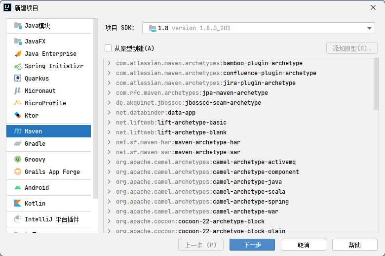
   - 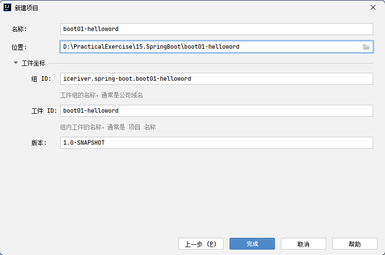
2. pom.xml 文件中引入依赖

```xml
<parent>
  <groupId>org.springframework.boot</groupId>
  <artifactId>spring-boot-starter-parent</artifactId>
  <version>2.3.4.RELEASE</version>
</parent>

<dependencies>
  <dependency>
    <groupId>org.springframework.boot</groupId>
    <artifactId>spring-boot-starter</artifactId>
  </dependency>
</dependencies>
```

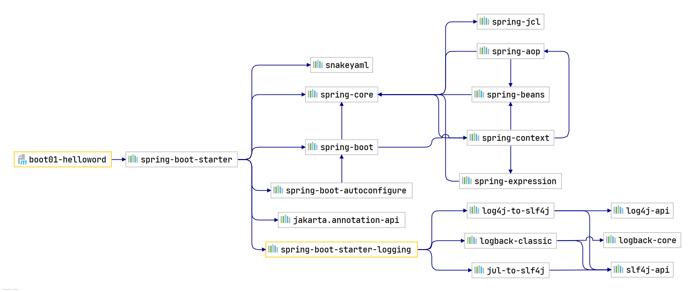

- spring-boot-starter ：核⼼模块，包括⾃动配置⽀持、⽇志和 YAML

添加 test 模块

```xml
<dependency>
  <groupId>org.springframework.boot</groupId>
  <artifactId>spring-boot-starter-test</artifactId>
  <scope>test</scope>
</dependency>
```

- spring-boot-starter-test ：测试模块，包括 JUnit、 Hamcrest、 Mockito

添加 web 模块

```xml
<dependency>
  <groupId>org.springframework.boot</groupId>
  <artifactId>spring-boot-starter-web</artifactId>
</dependency
```

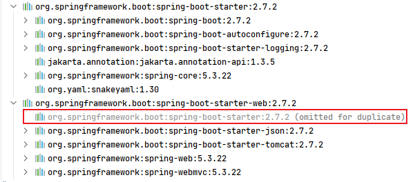

- 从上图可以看到 web 模块依赖于 boot-starter 模块。
- web 模块比 boot-starter 模块多引入了 json、tomcat、web、webmvc 四个模块
- **总结：只需要引入 web 模块即可，boot-starter 模块会依赖传递加载。**

3. src/main/java/iceriver.boot 包下创建主程序，名称任意

```java
package iceriver.boot;

import org.springframework.boot.SpringApplication;

/**
 * @author: INFINITY https://developer.aliyun.com/profile/sagwrxp2ua66w
 * @date: 2022/8/3 20:10
 */
@SpringBootApplication
public class MainApplication {
    public static void main(String[] args) {
        SpringApplication.run(MainApplication.class,args);
    }
}
```

4. src/main/java/iceriver.boot.controller 包下创建处理请求的控制器

```java
package iceriver.boot.controller;

import org.springframework.web.bind.annotation.RequestMapping;
import org.springframework.web.bind.annotation.RestController;

/**
 * @author: INFINITY https://developer.aliyun.com/profile/sagwrxp2ua66w
 * @date: 2022/8/3 20:12
 */
@RestController
public class HelloController {
    @RequestMapping("/hello")
    public String handle01(){
        return "Hello, Spring Boot 2!";
    }
}
```

5. 运行 src/main/java/iceriver.boot 包下的主程序 main 方法
   - 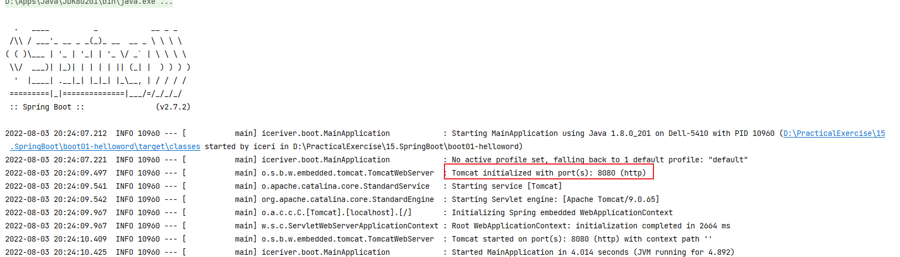
6. 浏览器访问[http://localhost:8080/hello](http://localhost:8080/hello)
   - 
7. 修改端口号：在 resources 目录下创建 application.properties 文件【文件名称固定，称为核心配置文件】

```properties
server.port=8888
```

8. 部署：
   - pom.xml 文件中添加插件

```xml
<build>
   <plugins>
     <plugin>
       <groupId>org.springframework.boot</groupId>
       <artifactId>spring-boot-maven-plugin</artifactId>
     </plugin>
   </plugins>
</build>
```

- 执行 maven 打包命令：
  - 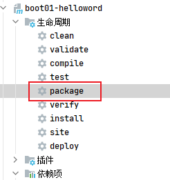
  - 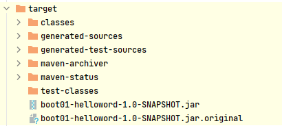
- 执行`java -jar jar包名命令`
  - 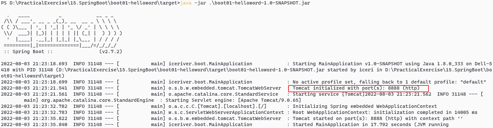
  - 

#### 1.3.2 spring initializr【spring 初始化向导】

1. 创建工程/模块

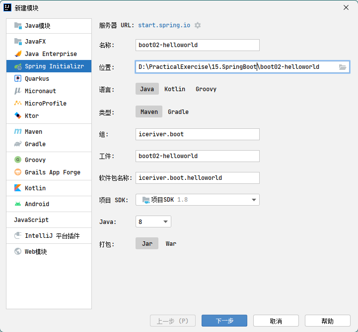

2. 选择需要的依赖
   - 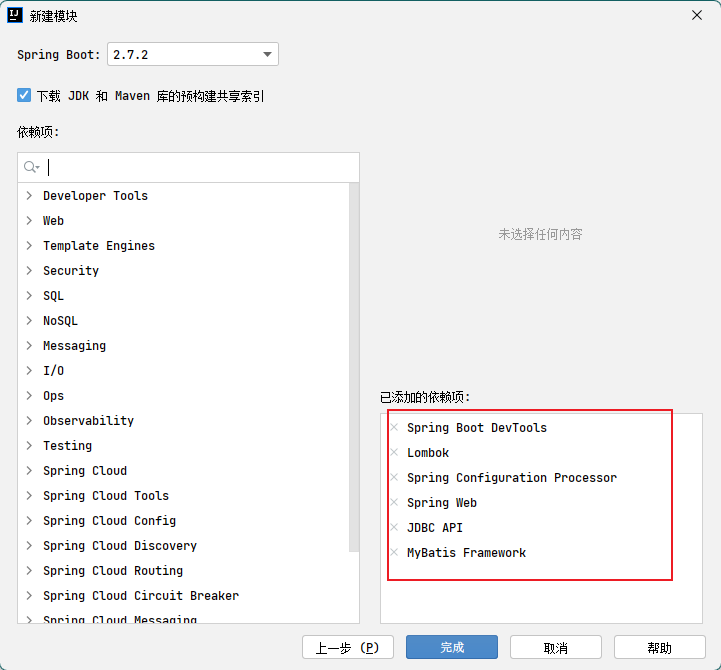

## 2. Spring Boot 的底层注解

### 2.1 第一组：@Configuration 和@Bean

#### 2.1.1 `@Configuration`

1. 将类声明为配置类，【参见 Spring5 4.5 完全注解开发[02.Spring5](https://www.yuque.com/zhuyuqi/zna9x5/aze75g?view=doc_embed&inner=Ex1iI)】
2. `@Configuration(proxyBeanMethods = true)`默认为 true，此时 Spring Boot 总会检查这个组件是否在容器中存在，存在时不会再创建。
   - 此时不论是通过 MainApplication.java 主程序从容器获取组件
   - 还是从配置类 MyConfig.java 的方法获取组件，都是同一个对象（单实例）

```java
package iceriver.boot;

import iceriver.boot.bean.Pet;
import iceriver.boot.bean.User;
import iceriver.boot.config.MyConfig;
import org.springframework.boot.SpringApplication;
import org.springframework.boot.autoconfigure.SpringBootApplication;
import org.springframework.context.ConfigurableApplicationContext;

/**
 * @author: INFINITY https://developer.aliyun.com/profile/sagwrxp2ua66w
 * @date: 2022/8/3 20:10
 */
//@SpringBootApplication(scanBasePackages = "iceriver.boot")
@SpringBootApplication
public class MainApplication {
    public static void main(String[] args) {
        //1、返回IOC容器
        ConfigurableApplicationContext run = SpringApplication.run(MainApplication.class, args);
        //2、查看容器里面的组件
        String[] names = run.getBeanDefinitionNames();
        for (String name : names) {
            System.out.println(name);
        }
        //3、从容器获取组件
        Pet tom01 = run.getBean("tom", Pet.class);
        Pet tom02 = run.getBean("tom", Pet.class);
        System.out.println(tom01 == tom02);//true

        MyConfig bean = run.getBean(MyConfig.class);
        //System.out.println(bean);//iceriver.boot.config.MyConfig$$EnhancerBySpringCGLIB$$2bce5da6@585ac855
        User user = bean.user01();
        User user1 = bean.user01();
        System.out.println(user == user1);//true
    }
}
```

3. `@Configuration(proxyBeanMethods = false)`时：
   - 通过 MainApplication.java 主程序从容器获取组件是同一个对象
   - 从配置类 MyConfig.java 的方法获取组件，不是同一个对象
     > - ⭐ 该配置为 true 时，解决了组件依赖问题：比如 User 类中有 Pet 类的对象，因为在创建 User 时，执行到创建 Pet 对象时，使用的是配置类调用方法创建 Pet 对象：
     >   - 设置为 true：跳过了调用方法创建 Pet 对象，直接在容器中调用，保证了 User 对象也是唯一的。
     >   - 设置为 false：调用方法创建 Pet 对象，由于 Pet 对象不一致，导致 User 对象不一致，创建 User 组件在容器中出现了两个
     > - 最佳实战
     >   - 配置类组件之间无依赖关系用 Lite 模式加速容器启动过程，减少判断，设置为 false
     >   - 配置类组件之间有依赖关系，方法会被调用得到之前单实例组件，用 Full 模式，设置为 true

#### 2.1.2 `@Bean`

1. 给容器中添加组件，用在方法前，方法名为组件 id，返回类型为组件类型，返回值为组件在容器中的实例。
   - 可以使用如下的方式`@Bean("tom")`使用自定义名称（不以方法名作为组件名）
     - 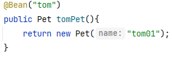
2. 通过 MainApplication.java 主程序从容器获取组件：
   - 默认情况容器中的组件是单实例的

```java
package iceriver.boot.config;

import iceriver.boot.bean.Pet;
import iceriver.boot.bean.User;
import org.springframework.context.annotation.Bean;
import org.springframework.context.annotation.Configuration;

/**
 * @author: INFINITY https://developer.aliyun.com/profile/sagwrxp2ua66w
 * @date: 2022/8/3 23:00
 */
@Configuration
public class MyConfig {
    @Bean
    public User user01(){
        return new User("张三", 18);
    }
    @Bean("tom")
    public Pet tomPet(){
        return new Pet("tom01");
    }
}
```

```java
package iceriver.boot;

import iceriver.boot.bean.Pet;
import org.springframework.boot.SpringApplication;
import org.springframework.boot.autoconfigure.SpringBootApplication;
import org.springframework.context.ConfigurableApplicationContext;

/**
 * @author: INFINITY https://developer.aliyun.com/profile/sagwrxp2ua66w
 * @date: 2022/8/3 20:10
 */
//@SpringBootApplication(scanBasePackages = "iceriver.boot")
@SpringBootApplication
public class MainApplication {
    public static void main(String[] args) {
        //1、返回IOC容器
        ConfigurableApplicationContext run = SpringApplication.run(MainApplication.class, args);
        //2、查看容器里面的组件
        String[] names = run.getBeanDefinitionNames();
        for (String name : names) {
            System.out.println(name);
        }
        //3、从容器获取组件
        Pet tom01 = run.getBean("tom", Pet.class);
        Pet tom02 = run.getBean("tom", Pet.class);
        System.out.println(tom01 == tom02);//true
    }
}

```

3. 通过 MainApplication.java 主程序从容器获取配置类组件：
   - 配置类是被 EnhancerBySpringCGLIB 增强了的代理类

```java
package iceriver.boot;

import iceriver.boot.config.MyConfig;
import org.springframework.boot.SpringApplication;
import org.springframework.boot.autoconfigure.SpringBootApplication;
import org.springframework.context.ConfigurableApplicationContext;

/**
 * @author: INFINITY https://developer.aliyun.com/profile/sagwrxp2ua66w
 * @date: 2022/8/3 20:10
 */
//@SpringBootApplication(scanBasePackages = "iceriver.boot")
@SpringBootApplication
public class MainApplication {
    public static void main(String[] args) {
        //1、返回IOC容器
        ConfigurableApplicationContext run = SpringApplication.run(MainApplication.class, args);
        //2、查看容器里面的组件
        String[] names = run.getBeanDefinitionNames();
        for (String name : names) {
            System.out.println(name);
        }
        //3、从容器获取组件（配置类）
        System.out.println(run.getBean(MyConfig.class));//iceriver.boot.config.MyConfig$$EnhancerBySpringCGLIB$$2bce5da6@585ac855
    }
}
```

### 2.2 第二组：**@Component、@Controller、@Service、@Repository**

【参见 Spring5 2.3.1[02.Spring5](https://www.yuque.com/zhuyuqi/zna9x5/aze75g?view=doc_embed&inner=Hz9sp)】

### 2.3 第三组：@ComponentScan

指定包扫描的路径，【参见 2.3.4[02.Spring5](https://www.yuque.com/zhuyuqi/zna9x5/aze75g?view=doc_embed&inner=ZiiVh)】
扫描到的组件如果有第二组的注解，则注册为组件

### 2.4 第四组：@Import

1. 可以用在任何组件上，配合任何组件注解使用。
2. 导入任意指定类型的组件：
   - `@Import({User.class, DBHelper.class})`
   - 给容器中自动创建出这两个类型的组件、默认组件的名字就是全类名（调用其无参构造器创建）

### 2.5 第五组：@Conditional

- 条件装配：满足指定条件，则进行注入
- 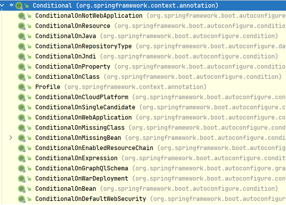
- 可以用在方法前，表示满足该条件，则对该方法进行 bea 注入
- 可以用在类前，表示满足该条件，才对该类中的方法进行 ben 注入。

### 2.6 第六组：@ImportSource

-

### 2.7 第七组：绑定配置文件

#### 2.7.1 方式一：@**ConfigurationProperties+@**Component

- 用在 JavaBean 前，声明当前文件为一个配置文件类。
- 将 JavaBean 属性的值写在配置文件中，通过 spring boot 读取 properties 配置文件，并把它封装到 JavaBean 中。
- `@ConfigurationProperties(prefix = "mycar")`
  - 需要与@Component 配合使用，将 JavaBean 通过@Component 声明为组件。
  - 或者不使用@Component，在 MyConfig.java 中使用@Bean 创建组件，方法返回无参构造对象
  - 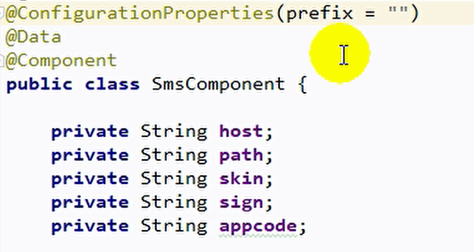

#### 2.7.2 方式二：@EnableConfigurationProperties +@ConfigurationProperties

- 对于无法对 JavaBean 使用@Component 的组件（如别人的 JavaBean），在 MyConfig.java 配置类前使用@EnableConfigurationProperties(Car.Class）——只能用在配置类上
  - 作用 1：开启 Car 的配置绑定功能
  - 作用 2：将 Car 这个组件自动注册到容器中

#### 2.7.3 @**ConfigurationProperties**

将当前类与配置文件中的值绑定。绑定的只能是核心配置文件，只会在核心配置文件中查找值。

### 2.8 第八组：@SpringBootApplication

#### 2.8.0 介绍

- 将某个类指定为主程序类/主配置类。他自动扫描的路径是同级的其他路径，同下@ComponentScan("iceriver.boot")
- 它是三个组件的合成：
  - @SpringBootConfiguration
  - @EnableAutoConfiguration
  - @ComponentScan("iceriver.boot")

#### 2.8.1 @SpringBootConfiguration

- 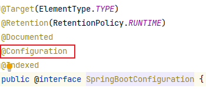
- 代表当前是一个配置类。

#### 2.8.2 @EnableAutoConfiguration

- 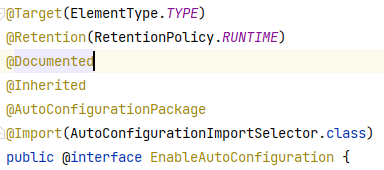
- @AutoConfigurationPackage：导入主程序类所在位置的包下一系列组件。指定了默认的包规则。

```java
@Import(AutoConfigurationPackages.Registrar.class)  //给容器中导入一个组件
public @interface AutoConfigurationPackage {}

//利用Registrar给容器中导入一系列组件
//将指定的一个包下的所有组件导入进来？MainApplication 所在包下。
```

- @Import(AutoConfigurationImportSelector.class)：导入 META-INF/spring.factories 位置的文件中配置的组件（共 127 个，加载时全部加载，但使用时由于使用了@ConditionalOnClass 注解，可以实现按需配置，用户导入相关的场景启动器后才会激活该注解）

```java
1、利用getAutoConfigurationEntry(annotationMetadata);给容器中批量导入一些组件
2、调用List<String> configurations = getCandidateConfigurations(annotationMetadata, attributes)获取到所有需要导入到容器中的配置类
3、利用工厂加载 Map<String, List<String>> loadSpringFactories(@Nullable ClassLoader classLoader)；得到所有的组件
4、从META-INF/spring.factories位置来加载一个文件。
	默认扫描我们当前系统里面所有META-INF/spring.factories位置的文件
    spring-boot-autoconfigure-2.3.4.RELEASE.jar包里面也有META-INF/spring.factories
    文件里面写死了spring-boot一启动就要给容器中加载的所有配置类
    虽然我们127个场景的所有自动配置启动的时候默认全部加载。xxxxAutoConfiguration
按照条件装配规则（@Conditional），最终会按需配置。

```

- 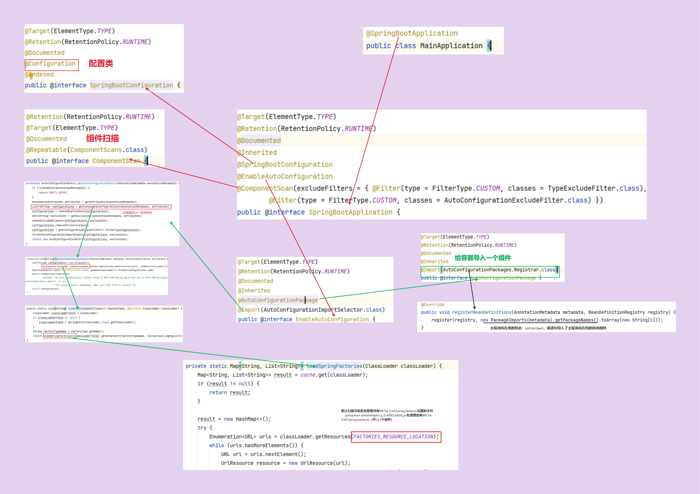

#### 2.8.3 @ComponentScan("iceriver.boot")

- 组件扫描
- 扫描到的组件如果有第二组的注解，则自动注册为组件

### 2.9 9 组 @SpringBootTest、@RunWith

## 3. Spring Boot 的自动配置

### 3.1 自动配置实现

> - 基于 1.3.1（[https://www.yuque.com/zhuyuqi/zna9x5/gs0vv5#bAIMR](#bAIMR)）创建的 spring boot2 项目进行分析

#### 3.1.1 依赖配置

1. 用户项目使用了 spring-boot-starter-parent 作为父项目进行依赖管理。
2. spring-boot-starter-parent 使用了 spring-boot-dependencies 作为父项目进行依赖管理。而 spring-boot-dependencies 中声明了几乎开发中常用的依赖版本号——自动仲裁机制。
3. 依赖中 spring-boot-starter-\*称为场景启动器，是一组整合好的方便的依赖描述符。只要引入 starter，满足该场景的常规依赖都会自动引入。
   - spring-boot-starter-web 底层基础依赖是 spring-boot-starter，是所有场景启动最底层的依赖。
   - *-spring-boot-starter： 第三方提供的简化开发的场景启动器。

#### 3.1.2 自动配置内容

1. 自动配置好 tomcat
   - spring-boot-starter-web 场景启动器引入了 tomcat 场景启动器
   - 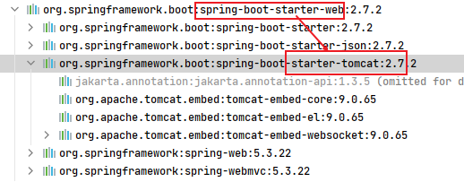
2. 自动配置好 SpringMVC
   - spring-boot-starter-web 场景启动器引入了 springmvc 场景启动器
   - 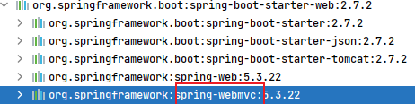
3. 自动配置好了 springmvc 的常用组件（依赖）
   - 配置好了 SpringMVC DispatcherServlet 以及其他依赖，如 jdbc、日志、字符编码等。
   - 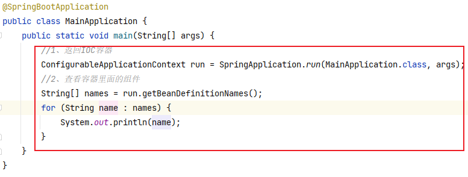
   - 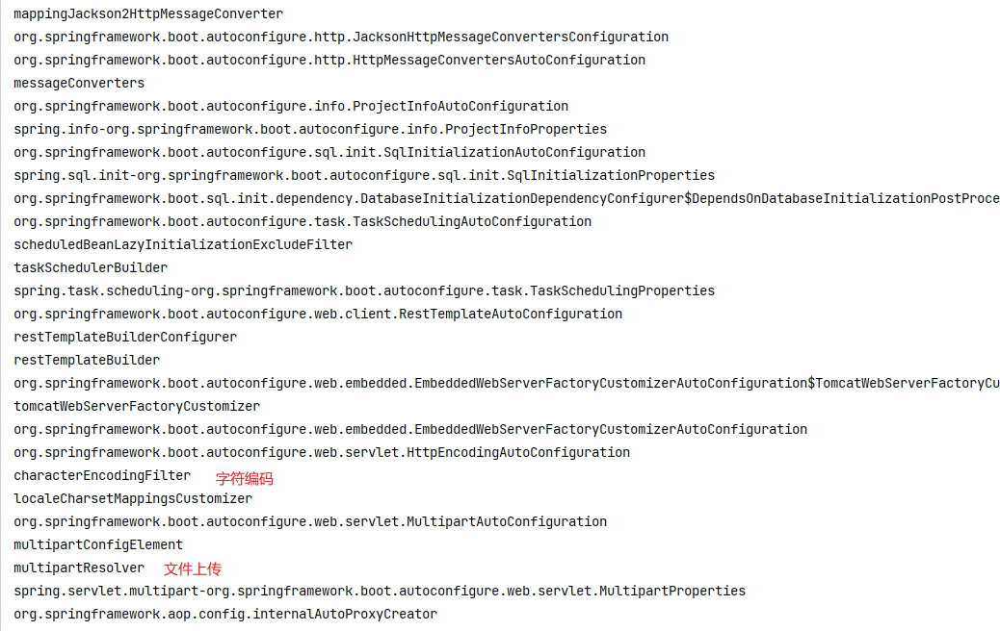
4. 创建了默认的包结构：
   - 官方文档 2.1 节，说明了使用默认的包结构，会自动进行包扫描，而不需要手动设置
   - 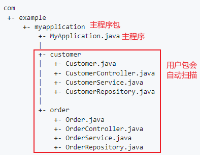
   - 当然可以通过`@SpringBootApplication(scanBasePackages = "iceriver.boot")`扫描指定包
     - 或者使用`@ComponentScan(scanBasePackages = "iceriver.boot")`、`@EnableAutoConfiguration`、`@SpringBootConfiguration`三个代替
5. 各种配置拥有默认值。如文件上传设定了最大上传大小
   - 默认配置最终都是映射到某个类上，如：MultipartProperties
   - 修改配置时，`application.properties`配置文件的值最终会绑定每个类上，这个类会在容器中创建对象
6. 按需加载所有自动配置项
   - springBoot 所有的自动配置功能都在 spring-boot-autoconfigure 包里面
   - 引入了哪些场景这个场景的自动配置才会开启

### 3.2 自动配置原理

【参见2.8[https://www.yuque.com/zhuyuqi/zna9x5/gs0vv5#uvJdT](#uvJdT)】

### 3.2 自动配置流程

1. SpringBoot 先加载所有的自动配置类 xxxxxAutoConfiguration
2. 每个自动配置类按照条件进行生效，默认都会绑定配置文件指定的值。xxxxProperties 里面拿。xxxProperties 和配置文件进行了绑定
3. 生效的配置类就会给容器中装配很多组件
4. 只要容器中有这些组件，相当于这些功能就有了
5. 定制化配置
   - 用户直接自己@Bean 替换底层的组件
   - 用户去看这个组件是获取的配置文件什么值就去修改。
6. **xxxxxAutoConfiguration ---> 组件 ---> xxxxProperties 里面拿值 ----> application.properties**

### 3.4 【心得】spring boot 开发最佳实践流程

1. 引入场景依赖（场景启动器）
2. 查看自动配置了哪些（选做）
   - 自己分析，引入场景对应的自动配置一般都生效了
   - application.properties 核心配置文件中 debug=true 开启自动配置报告。在控制台输出中查看：Negative（不生效）\Positive（生效）
3. 是否需要修改
   - 参照文档修改配置项
     - 自己分析。xxxxProperties 绑定了配置文件的哪些。
   - 自定义加入或者替换组件
     - @Bean、@Component。。。
   - 自定义器 **XXXXXCustomizer**.

### 3.5 【扩展】springboot 工作流程

1. springboot 启动，读取 spring-boot-autoconfigure-2.7.2.jar 包下的/META-INF/spirng.factories 文件。读取 org.springframework.boot.autoconfigure.EnableAutoConfiguration 属性的值加载自动配置类。
2. 根据自动配置类中指定的 XxxProperties 类设置自动配置的属性值，程序员根据 XxxProperties 类中指定的属性在 yml 配置文件中修改自动配置。
3. springboot 通过@ConditionalXxx 注解指定特定组件加入 IOC 容器时所需要的特定条件，条件满足时才会加入 IOC 容器。

## 4. 开发小技巧

### 4.1 Lombok

1. 简化 JavaBean 开发
2. pom.xml 中引入 lombok

```xml
<dependency>
  <groupId>org.projectlombok</groupId>
  <artifactId>lombok</artifactId>
</dependency>
```

3. 安装 Lombok 插件
   - 
4. 使用：
   - JavaBean 只编写属性，不写 getter 和 setter
   - JavaBean 前使用@Data 注解，会在编译时生成 getter 和 setter
   - javabean 前使用@ToString，会在编译时自动生成 toString()
   - JavaBean 前使用@AllArgsConstructor 注解，会在编译时生成全部参数的有参构造器
   - JavaBean 前使用@NoArgsConstructor 注解，会在编译时生成无参构造器
   - JavaBean 前使用@EqualsAndHashCode 注解，会在编译时生成 equals()和 hashcode()
   - JavaBean 前使用@Slf4j 注解，可以在代码中使用`log.info("str")`语法在控制台输出内容

### 4.2 Dev-tools

1. 重启 restart 功能：
   - 热更新 reload 需要收费
2. 引入依赖

```xml
<dependency>
  <groupId>org.springframework.boot</groupId>
  <artifactId>spring-boot-devtools</artifactId>
  <optional>true</optional>
</dependency>
```

3. 使用：ctrl+f9
4. 本质：和 idea 重启效果一样

### 4.3 yml 读取自定义属性

```xml
<dependency>
  <groupId>org.springframework.boot</groupId>
  <artifactId>spring-boot-configuration-processor</artifactId>
  <optional>true</optional>
</dependency>
```

```java
@Configuration
@ConfigurationProperties(prefix = "short.message")
@Data
@NoArgsConstructor
@AllArgsConstructor
public class ShortMessageProperties {
    private String accessKeyId;//私有id
    private String accessKeySecret;//私有key
    private String endpoint;//短信服务域名
    private String signName;//短信签名
    private String templateCode;//短信模板
}
```

## 5. Spring Boot2 核心技术（功能）

### 5.1 配置文件

#### 5.1.1 application.properties

同时配置了`.properties`和`.yml`，两个文件会同时生效，里面的内容`.properties`会覆盖`.yml`

#### 5.1.2 application.yml

1. 简介：YAML 是 "YAML Ain't Markup Language"（YAML 不是一种标记语言）的递归缩写。在开发的这种语言时，YAML 的意思其实是："Yet Another Markup Language"（仍是一种标记语言）。
2. 基本语法：
   - key: value；kv 之间有空格
   - 大小写敏感
   - 使用缩进表示层级关系
   - 缩进不允许使用 tab，只允许空格
   - 缩进的空格数不重要，只要相同层级的元素左对齐即可
   - '#'表示注释
   - 字符串无需加引号，如果要加，`''`与`""`表示字符串内容会原样输出字符串/将转义字符转换
3. 数据类型
   - 字面量（k: v）：单个的、不可再分的值。date、boolean、string、number、null
   - 对象：键值对的集合。map、hash、set、object

```yaml
#方式一：
k: {k1:v1,k2:v2,k3:v3}
#方式二：
k:
	k1: v1
  k2: v2
  k3: v3
```

- 数组：一组按次序排列的值。array、list、queue

```yaml
#方式一：
k: [v1,v2,v3]
#方式二：
k:
 - v1
 - v2
 - v3
```

#### 5.1.3 配置提示

1. 给自定义的类和配置文件添加输入提示
2. 引入依赖

```xml
<dependency>
  <groupId>org.springframework.boot</groupId>
  <artifactId>spring-boot-configuration-processor</artifactId>
  <optional>true</optional>
</dependency>
```

3. 打包时排除，减少资源占用（对开发没有影响）

```xml
<build>
  <plugins>
    <plugin>
      <groupId>org.springframework.boot</groupId>
      <artifactId>spring-boot-maven-plugin</artifactId>
      <configuration>
        <excludes>
          <exclude>
            <groupId>org.springframework.boot</groupId>
            <artifactId>spring-boot-configuration-processor</artifactId>
          </exclude>
        </excludes>
      </configuration>
    </plugin>
  </plugins>
</build>
```

### 5.2 web 开发

#### 5.2.1 创建 web 项目

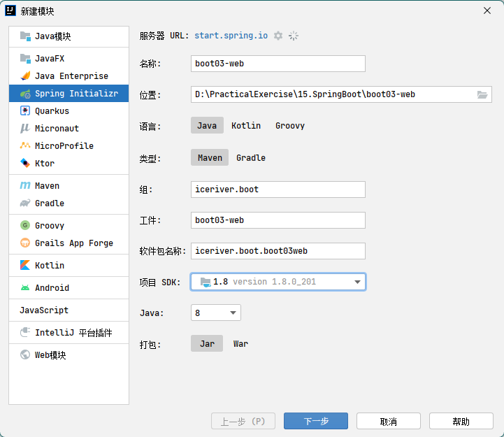
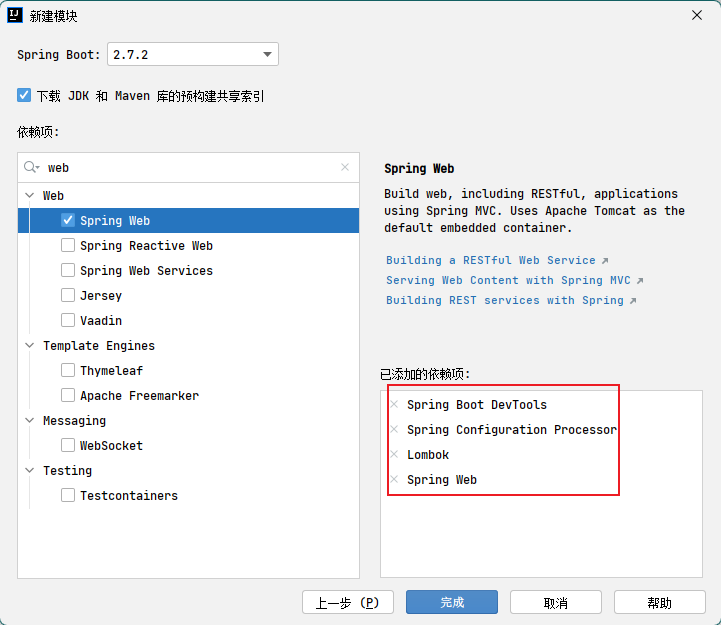

#### 5.2.2 静态资源访问

1. 在 resources 路径下：静态资源放在`/static`/public`、`/META-INF/resources`路径下，则可以直接通过当前项目根路径/+静态资源名的方式访问到。
   - 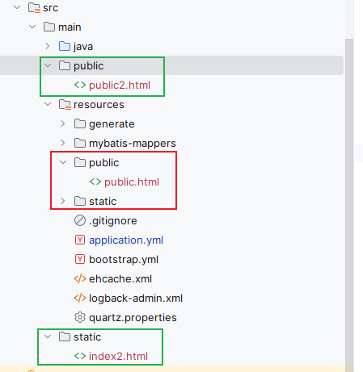
   - 红框的可以访问到，绿框的访问不到
   - 原理：浏览器地址栏的请求首先经过 spring mvc 的 dispatcherServlet 处理，如果控制器 controller 中有对应的请求方法，则按该方法处理。如果没有对应的请求方法，则被 servlet 默认的控制器处理，直接去访问静态资源。
2. 修改静态资源访问前缀
   - 控制器中设定的拦截请求为`/**`所有请求，这样会导致静态资源的访问和控制器处理的请求都被拦截。
   - 开发中一般希望将静态资源内的访问、和控制器处理前端请求分离开，所以一般会在核心配置文件中间通过`spring.mvc.static-path-pattern=/res/**`给静态资源的访问增加前缀（res 可以设定为其他名字）

```yaml
spring:
  mvc:
    static-path-pattern: /res/**
```

- 此时访问地址形式为：当前项目路径/res/静态资源名

3. 修改静态资源的路径（自定义静态资源路径）
   - 在核心配置文件中通过`spring.resources.static-locations=[class:/hh/]`进行配置

```yaml
spring:
  mvc:
    static-path-pattern: /res/**

  resources:
    static-locations: [classpath:/haha/]
```

- 访问时，地址形式为：当前项目路径/res/静态资源名【访问路径没变化，变的只是静态资源的位置】

4. 访问 webjar
   - webjar 是人们把前端的 js 文件等制作成了 spring 依赖，引入相关依赖后，相当于引入了前端 js 文件
   - [https://www.webjars.org/](https://www.webjars.org/)

```xml
<dependency>
    <groupId>org.webjars</groupId>
    <artifactId>jquery</artifactId>
    <version>3.5.1</version>
</dependency>
```

- 此时，可以通过 http://localhost:8080/webjars/**jquery/3.5.1/jquery.js**访问该 js 文件
- 同时，该 js 文件也可以通过静态资源访问前缀获得，即`http://localhost:8080/res/webjars/**jquery/3.5.1/jquery.js**`

5. 欢迎页（index.html 页面）
   - 把 index.html 当作静态资源，放在相关路径下即可解析为首页，访问当前项目路径即可作为欢迎页。
     - 注意：静态资源访问前缀会影响访问地址，访问时需要加上访问前缀
   - 也可以通过控制器编写 index 方法，路径用`/`，映射到 index 页面
6. 自定义 Favicon
   - 放到静态资源路径下，起名为`favicon.ico`，则每个页面都会带上小图标
     - 注意：静态资源访问前缀会影响，访问带有访问前缀的的页面才会显示。
   - 小图标保存在 session 中共享

#### 5.2.3 静态资源配置原理

1. spring boot 启动时，加载的 springmvc 的自动配置类 WebMvcAutoConfiguration 生效。
2. 【25 集，没看下去】

### 5.3 请求处理

1. 请求映射（restful 风格）：spring boot 启动时 WebMvcAutoConfiguration 自动配置了 OrderedHiddenHttpMethodFilter 类，该类继承自`HiddenHttpMethodFilter`，从而能够处理 restful 风格的请求。
   - 但默认情况下，spring.mvc.hiddenmethod.filter 值是 false，即使设置了隐藏域，发送 put、delete 请求时还是 post 请求。
   - 只有在核心配置文件中将 spring.mvc.hiddenmethod.filter=true 后，才可以正常发送 put、delete 请求。
     - 这个配置只针对于 form 表单使用
     - 对于 postman 等这些能直接发送 put、delete 请求的不用配置
   - 自定义请求方法时，在配置类中重新定义（此时隐藏域的 name 属性要设置为`_m`（原始为`_method`））：
     - 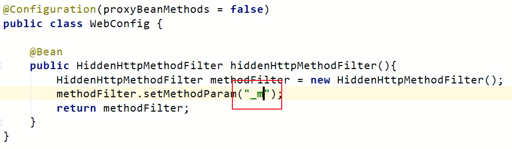
2. 请求映射处理原理（怎么知道是哪种请求）：
   - 【参见 SpringMVC10.3[03.Spring MVC](https://www.yuque.com/zhuyuqi/zna9x5/zh889g?view=doc_embed&inner=d0PTI)】
   - servlet 处理请求的方法是 doService()，doService()经过一大堆封装、重写之后变成了 DispatcherServlet 的 doDispatcher()，该方法中调用了 getHandler()得到所有 handlermappings，去看哪个 handlerMapping 能处理得到的请求
     - **RequestMappingHandlerMapping**：保存了所有@RequestMapping 和 handler 的映射规则。
     - WelcomePageHandlerMapping：是 springBoot 自动配置的，处理 index 页面（欢迎页）的请求，默认配置好了。
   - 自定义 HandlerMapping【没讲】
3. 注解：
   - 请求映射注解：
     - `@RequestMapping`
     - `@GetMapping`、`@PostMapping`、`@PutMapping`、`@DeleteMapping`
   - 请求传参注解：
     - @PathVariable：路径占位符，将请求路径解析为参数（restful 请求）
     - @RequestHeader：[03.Spring MVC](https://www.yuque.com/zhuyuqi/zna9x5/zh889g?view=doc_embed&inner=Oz9xP)
     - @ModelAttribute
     - @RequestParam：
     - @MatrixVariable：矩阵变量
       - 请求参数以分号分割，如`/cars/{low=34;brand=byd,audi}`
       - springBoot 默认仅用了矩阵变量，需要在核心配置文件中手动开启：
       - urlpathhelper 需要单独写一章
     - @CookieValue
     - @RequestBody：
     - @RequestAttribute：从请求域获取参数

## 6. springboot 整合案例

### 6.0 整合 web

#### 6.0.1 引入依赖

```xml
<dependency>
  <groupId>org.springframework.boot</groupId>
  <artifactId>spring-boot-starter-web</artifactId>
</dependency>
```

- 只引入这一个依赖即可

### 6.1 整合 mybatis

#### 6.1.1 引入依赖

```xml
<dependency>
  <groupId>org.mybatis.spring.boot</groupId>
  <artifactId>mybatis-spring-boot-starter</artifactId>
  <version>1.1.1</version>
</dependency>
```

spring 官方没有提供 mybtis 的 starer，这是 mybatis 官方提供的，在 spring-boot-dependencies 里就没有管理的依赖版本，所以要引入版本号。
操作 mybatis 需要数据库，为了方便使用再引入 druid 连接池（同样，spring-boot-dependencies 里没有管理 druid 的依赖）

```xml
<dependency>
  <groupId>mysql</groupId>
  <artifactId>mysql-connector-java</artifactId>
  <version>5.1.21</version>
</dependency>
<dependency>
  <groupId>com.alibaba</groupId>
  <artifactId>druid</artifactId>
  <version>1.0.5</version>
</dependency>
```

#### 6.1.2 配置 mysql 数据源

在 application.properties 文件中配置 mysql 数据源

```properties
spring.datasource.url=jdbc:mysql://localhost:3306/test
spring.datasource.username=root
spring.datasource.password=123456
spring.datasource.driver-class-name=com.mysql.jdbc.Driver
```

数据库驱动使用 com.mysql.cj.jdbc.Driver 时，则 datasource.url 必须带时区，即`spring.datasource.url=jdbc:mysql://localhost:3306/test?serverTimezone=UTC`

#### 6.1.3 使用 mybatis

1. 建立好数据库，创建好对应的 Javabean。
2. 编写 XxxMapper 类，制定好方法。
3. 在 resources/mybatis/mapper 下创建好对应的 XxxMapper.xml 映射文件，写好 sql 语句。
4. 在 application.properties 文件中配置 mybatis 的映射文件路径：

```properties
mybtis.mapper.location:classpath*./mybatis/mapper/*Mapper.xml
```

5. 为了能在控制台打印 sql 语句，再在 application.properties 文件中配置 mapper 的日志打印级别。

```properties
logging.level.XxxMapper的全包名.debug
```

6. 主启动类使用@MapperScan("com.atguigu.crowd.mysql.mapper")注解扫描所有类，或者使用@Mapper 标记单个类

##### 【扩展：精简写法】

如果不创建\*Mapper.xml 的映射文件（也就没在 application.properties 文件中声明映射文件路径），则需要在 XxxMapper 类中使用注解指定 sql 语句，如：

```java
@Mapper
public interface UserMapper {
    @Select("SELECT * FROM USER WHERE NAME = #{name}")
    User findByName(@Param("name") String name);
    @Insert("INSERT	INTO USER(NAME,	AGE) VALUES(#{name}, #{age})")
    int insert(@Param("name") String name, @Param("age") Integer age);
}
```

### 6.2 整合 redis

#### 6.2.1 引入依赖

```xml
<dependency>
  <groupId>org.springframework.boot</groupId>
  <artifactId>spring-boot-starter-redis</artifactId>
</dependency>
```

#### 6.2.2 配置 redis

```properties
spring.redis.host=localhost
spring.redis.port=6379
spring.redis.pool.max-idle=8
spring.redis.pool.min-idle=0
spring.redis.pool.max-active=8
spring.redis.pool.max-wait=-1
```

### 6.3 整合 Thymeleaf

#### 6.3.1 引入依赖

```xml
<dependency>
  <groupId>org.springframework.boot</groupId>
  <artifactId>spring-boot-starter-thymeleaf</artifactId>
</dependency>
```

## 7. 扩展功能
