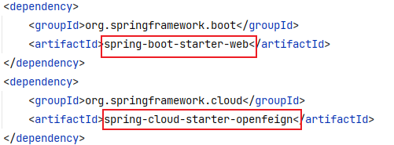
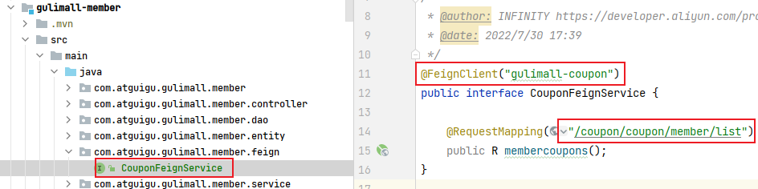
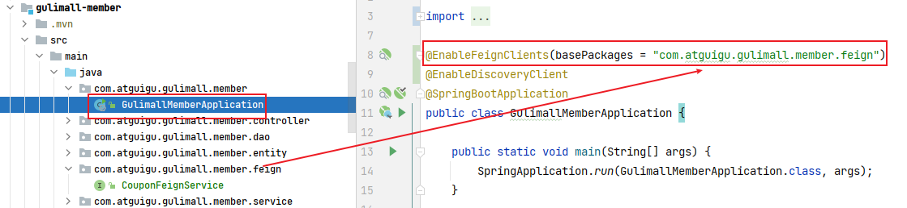
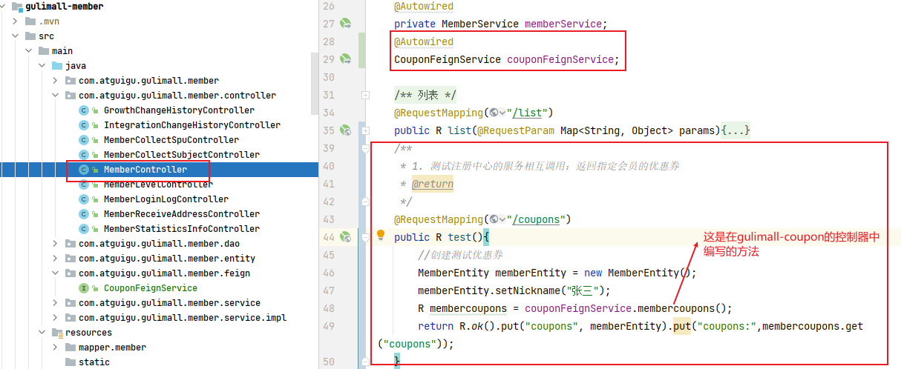
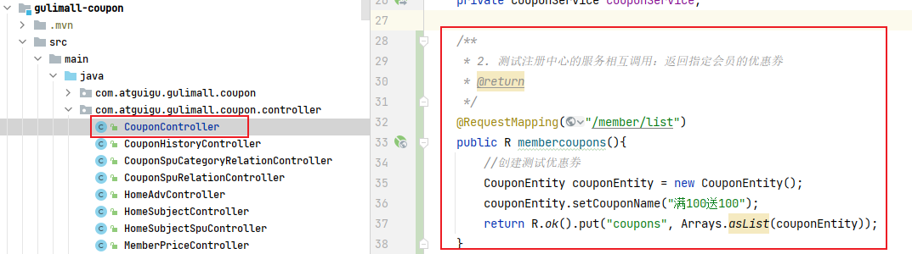
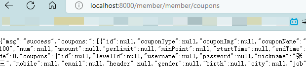
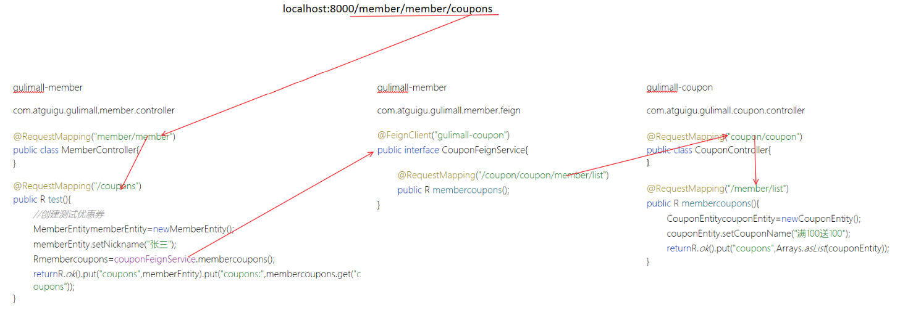

*feign 是一个声明式的 http 客户端，目的是简化远程调用。feign 提供了 http 请求模板，通过编写简单的接口和注解，就可以定义好 http 请求的参数、格式、地址等信息。*
<!-- more -->
## 1. 基本使用

1. feign 是一个声明式的 http 客户端，目的是简化远程调用。feign 提供了 http 请求模板，通过编写简单的接口和注解，就可以定义好 http 请求的参数、格式、地址等信息。
2. feign 整合了 ribbon（负载均衡）和 hystrix（服务熔断），可以不再显式地使用这两个组件。
3. 使用步骤【以 gulimall-member 调用 gulimall-coupon 为例】：
   - 引入依赖【创建项目时已引入】
     - 
   - 在 gulimall-member 模块中，创建 com.atguigu.member.feign 包，创建接口 CouponFeignService.java，并使用`@FeignClient("gulimall-coupon")`指明类型及调用地址【gulimall-coupon】是注册中心 nacos 中的名称
     - 在该接口中，写明要调用的 gulimall-coupon 中的方法
     - 
   - 在 gulimall-member 的`com.atguigu.gulimall.member.GulimallMemberApplication`类使用`@EnableFeignClients(basePackages="com.atguigu.gulimall.member.feign”)`开启 feignclient 的调用功能，并指明 feign 客户端的全包名
     - 
   - 在 gulimall-member 的`com.atguigu.gulimall.member.MemberController`类中编写测试方法
     - 
   - 在 gulimall-coupon 的`com.atguigu.gulimall.coupon.CouponController`类中编写测试方法
     - 
   - 重新启动 gulimall-member 和 gulimall-coupon，在浏览器地址栏访问 http://localhost:8000/member/member/coupons，检查是否有数据返回
     - 
4. 请求及调用过程：
   - 

## 2. feign 调用流程

1. 构造请求数据，将对象转换为 json
   - `RequestTemplate template = buildTemplateFromArgs.create(argv);`
2. 发送请求进行执行（执行成功解码响应数据）
   - `return executeAndDecode(template);`
3. 执行请求会有重试机制（有 5 次的机制，但默认不重试，直接抛出异常）
