*Spring Cloud Alibaba 是阿里巴巴结合自身微服务实践，开源的微服务全家桶。*
<!-- more -->

## 1. Spring Cloud Alibaba - Nacos

### 1.1 注册中心

1. 一个更易于构建云原生应用的动态服务发现、配置管理和服务管理平台。【注册中心及配置中心】
2. 使用文档：
   - 注册中心：
   - 配置中心：
3. 将 nacos 接入到 gulimall-common 中，作为注册中心：
   - 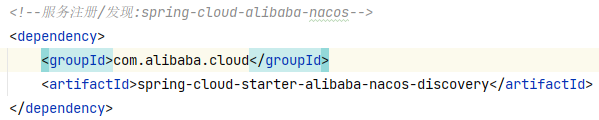
4. 下载 nacos 注册中心，
5. 启动注册中心：解压文件，双击 bin 目录下 starup.cmd
   - 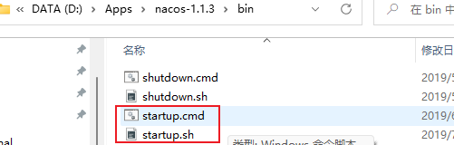
   - 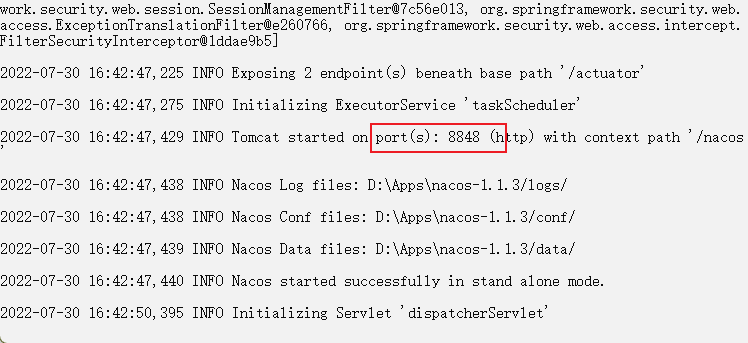
6. 在 5 个 gulimall 的微服务模块中，在 resources/application.yml 文件中填写 nacos 地址 127.0.0.1:8848，并指定名称
   - 这里可以在 application.propeties 文件中写注册地址和名称吗？
     - 直觉觉得可以，propterties 和 yml 文件都是配置文件，只不过是文本格式不同
   - 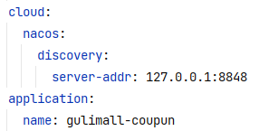
7. 使用`@EnableDiscoveryClient`注解，分别在 5 个微服务的应用类前开启 5 个 gulimall 的注册功能，使得该服务可以注册到发现中心。
   - 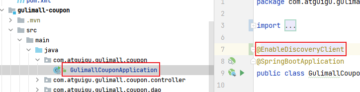
   - 其他模块图略。
8. 测试是否成功，启动`com.atguigu.gulimall.coupon.GulimallCouponApplication`，浏览器打开 127.0.0.1:8848/nacos，使用默认的登录名 nacos 和密码 nacos 登录。
   - 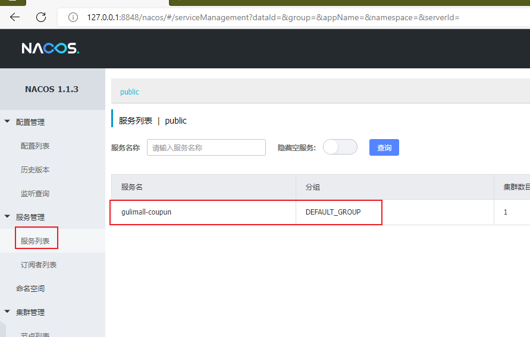
9. 同理注册其他 gulimall 的微服务模块
   - 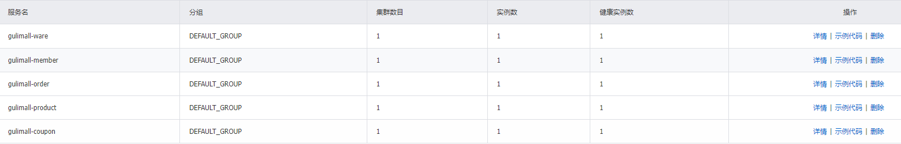

### 1.2 配置中心

#### 1.2.1 使用及配置

1. 在 gulimall-common 中，引入 nacos config starter 依赖
   - 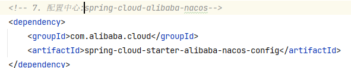
2. 给需要使用配置中的微服务模块`resources`路径下创建`bootstrap.properties`【本例 gulimall-coupon】

```properties
spring.application.name=gulimall-coupon                 #当前微服务/程序的名称
spring.cloud.nacos.config.server-addr=127.0.0.1:8848    #配置中心的ip地址(同注册中心）
```

3. 测试配置中心：
   - 在需要测试的控制器类中编写方式，定义测试属性，并给该类添加`@RefreshScope`注解、属性添加`@Value`注解
     - 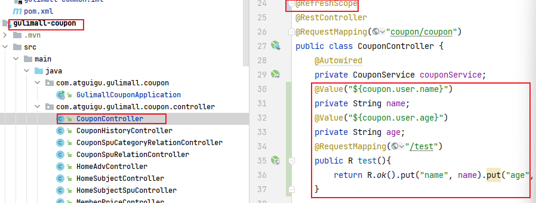
   - 在 nacos 配置中心给上面定义的测试属性进行初始化
     - 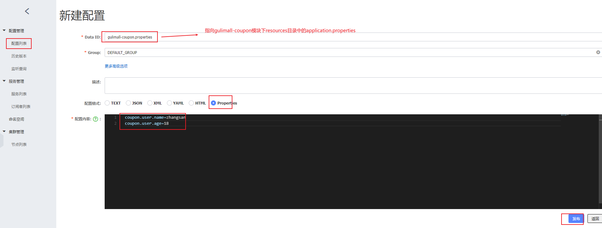
4. nacos 配置中心相关概念
   - 命令空间：默认为 public，默认新增的所有配置都在 public 空间，用于配置隔离，可以基于环境设置隔离，比如开发、测试、生产环境；也可以基于服务设置隔离，
     - 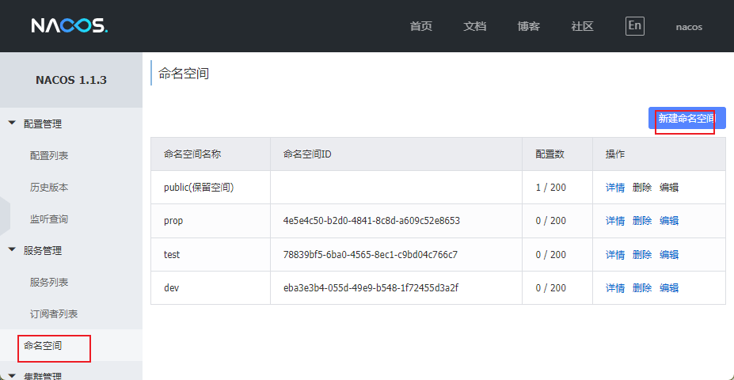
     - 创建命名空间后，可以在配置列表中进行使用，需要切换则需要在`bootstrap.properties`中设置`spring.cloud.nacos.config.namespace=2c40b603-31cb-43e4-bab5-30a1b131af1c`
       - 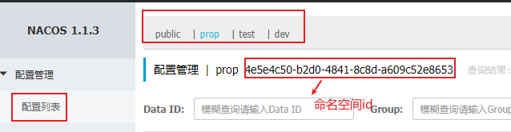
       - 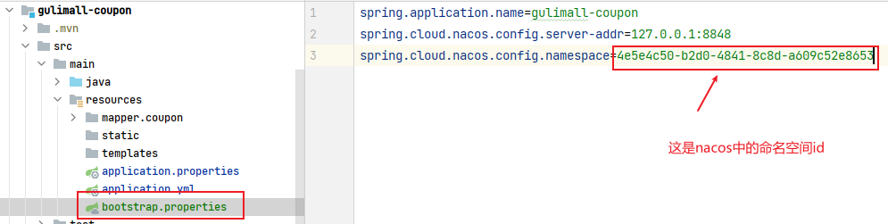
   - 配置集：所有配置的集合。
   - 配置集 ID：Data Id，类似文件名
   - 配置分组：默认所有的配置集都属于 DEFAULT_GROUP
     - 切换分组：在`bootstrap.properties`文件中设置`spring.cloud.nacos.config.group=DEFAULT_GROUP`
5. 使用 nacos 配置中心管理多个配置集，代替 resourcers/application.yml 文件，并在`bootstrap.properties`文件中进行设置，指定 nacos 配置中心要管理的配置文件。
   - 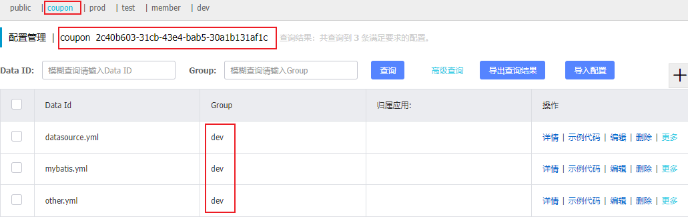
   - 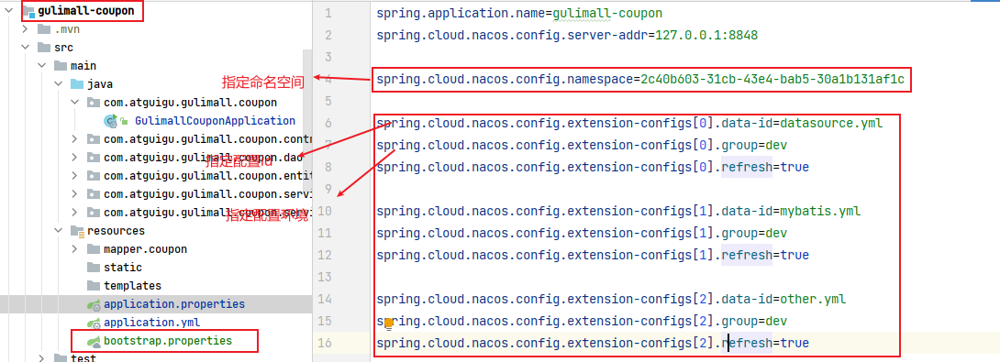
   - 按照上述配置后，就不需要 resourcers/application.yml 文件了

#### 1.2.2 核心概念

命名空间：用于进行租户粒度的配置隔离。 不同的命名空间下， 可以存在相同的 Group 或 Data ID 的配置。 Namespace 的常用场景之一是不同环境的配置的区分隔离， 例如开发测试环境和生产环境的资源（如配置、 服务） 隔离等。
配置集：一组相关或者不相关的配置项的集合称为配置集。 在系统中， 一个配置文件通常就是一个配置集， 包含了系统各个方面的配置。 例如， 一个配置集可能包含了数据源、 线程池、 日志级别等配置项。
配置集 ID：Nacos 中的某个配置集的 ID。 配置集 ID 是组织划分配置的维度之一。 Data ID 通常用于组织划分系统的配置集。 一个系统或者应用可以包含多个配置集， 每个配置集都可以被一个有意义的名称标识。 Data ID 通常采用类 Java 包（ 如 com.taobao.tc.refund.log.level） 的命名规则保证全局唯一性。 此命名规则非强制。
配置分组：Nacos 中的一组配置集， 是组织配置的维度之一。 通过一个有意义的字符串（ 如 Buy 或 Trade ） 对配置集进行分组， 从而区分 Data ID 相同的配置集。 当您在 Nacos 上创建一个配置时， 如果未填写配置分组的名称， 则配置分组的名称默认采用 DEFAULT_GROUP 。 配置分组的常见场景： 不同的应用或组件使用了相同的配置类型， 如 database_url 配置和 MQ_topic 配置。

#### 1.2.3 原理

自动注入：`NacosConfigStarter` 实现了 `org.springframework.cloud.bootstrap.config.PropertySourceLocator` 接口， 并将优先级设置成了最高。在 Spring Cloud 应用启动阶段， 会主动从 Nacos Server 端获取对应的数据， 并将获取到的数据转换成 PropertySource 且注入到 Environment 的 PropertySources 属性中， 所以使用@Value 注解也能直接获取 Nacos Server 端配置的内容。
动态刷新：Nacos Config Starter 默认为所有获取数据成功的 Nacos 的配置项添加了监听功能， 在监听到服务端配置发生变化时会实时触发 org.springframework.cloud.context.refresh.ContextRefresher 的 refresh 方法 。如果需要对 Bean 进行动态刷新， 请参照 Spring 和 Spring Cloud 规范。 推荐给类添加@RefreshScope 或 @ConfigurationProperties 注解。

#### 1.2.4 加载多个配置文件

```properties
spring.cloud.nacos.config.server-addr=127.0.0.1:8848
spring.cloud.nacos.config.namespace=31098de9-fa28-41c9-b0bd-c754ce319ed4
spring.cloud.nacos.config.ext-config[0].data-id=gulimall-datasource.yml
spring.cloud.nacos.config.ext-config[0].refresh=false
spring.cloud.nacos.config.ext-config[0].group=dev
```

#### 1.2.5 namespace 与 group 最佳实践

每个微服务创建自己的 namespace 进行隔离， group 来区分 dev， beta， prod 等环境。

## 01.阿里云OSS对象存储

#### 普通上传方式

文件提交给微服务，微服务发送到阿里云 OSS
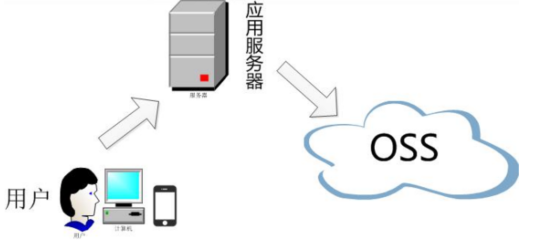

```java
@RunWith(SpringRunner.class)
@SpringBootTest
public class GulimallThirdPartyApplicationTests {
    @Resource
    OSSClient ossClient;
    @Test
    public void testUpload2(){
        String bucketName = "gulimall-brands-logo";
        String objectName = "3-2.jpg";
        String filePath= "C:\\Users\\iceri\\Documents\\3.jpg";
        try {
            InputStream inputStream = null;
            try {
                inputStream = new FileInputStream(filePath);
            } catch (FileNotFoundException e) {
                e.printStackTrace();
            }
            ossClient.putObject(bucketName, objectName, inputStream);
        } catch (OSSException oe) {
            System.out.println("Caught an OSSException, which means your request made it to OSS, "
                    + "but was rejected with an error response for some reason.");
            System.out.println("Error Message:" + oe.getErrorMessage());
            System.out.println("Error Code:" + oe.getErrorCode());
            System.out.println("Request ID:" + oe.getRequestId());
            System.out.println("Host ID:" + oe.getHostId());
        } catch (ClientException ce) {
            System.out.println("Caught an ClientException, which means the client encountered "
                    + "a serious internal problem while trying to communicate with OSS, "
                    + "such as not being able to access the network.");
            System.out.println("Error Message:" + ce.getMessage());
        } finally {
            if (ossClient != null) {
                ossClient.shutdown();
            }
        }
    }
}
```

#### 签名方式上传

浏览器找 gulimall-third-part 索要签名，浏览器拿到签名后，直接上传到 OSS 服务器
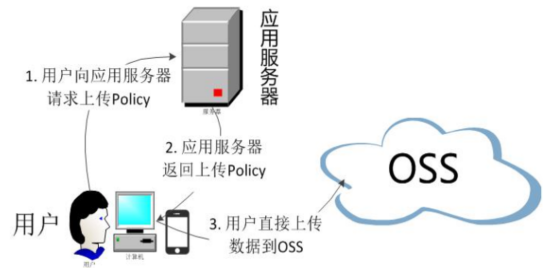
直接获取到的签名为 Map 格式，内部无 data 属性，前端在处理时存在不便。为了统一处理返回结果，设置返回对象 R，将 map 放到 R 里面。

```java
@RequestMapping("oss/policy")
public R policy(){
    // https://gulimall-brands-logo.oss-cn-chengdu.aliyuncs.com/3-1.jpg //上传后访问的路径
    String host = "https://" + bucket + "." + endpoint;
    // 设置上传到OSS文件的前缀，可置空此项。置空后，文件将上传至Bucket的根目录下。
    String format = new SimpleDateFormat("yyyy-MM-dd").format(new Date());
    String dir = format + "/";
    Map<String, String> respMap = null;
    try {
        long expireTime = 30;
        long expireEndTime = System.currentTimeMillis() + expireTime * 1000;
        Date expiration = new Date(expireEndTime);
        PolicyConditions policyConds = new PolicyConditions();
        policyConds.addConditionItem(PolicyConditions.COND_CONTENT_LENGTH_RANGE, 0, 1048576000);
        policyConds.addConditionItem(MatchMode.StartWith, PolicyConditions.COND_KEY, dir);

        String postPolicy = client.generatePostPolicy(expiration, policyConds);
        byte[] binaryData = postPolicy.getBytes("utf-8");
        String encodedPolicy = BinaryUtil.toBase64String(binaryData);
        String postSignature = client.calculatePostSignature(postPolicy);

        respMap = new LinkedHashMap<String, String>();
        respMap.put("accessid", accessId);
        respMap.put("policy", encodedPolicy);
        respMap.put("signature", postSignature);
        respMap.put("dir", dir);
        respMap.put("host", host);
        respMap.put("expire", String.valueOf(expireEndTime / 1000));
        // respMap.put("expire", formatISO8601Date(expiration));
    } catch (Exception e) {
        // Assert.fail(e.getMessage());
        System.out.println(e.getMessage());
    }
    return R.ok().put("data", respMap);
}
```

注意：这里要设置阿里云 OSS 允许跨域。
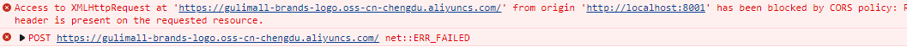
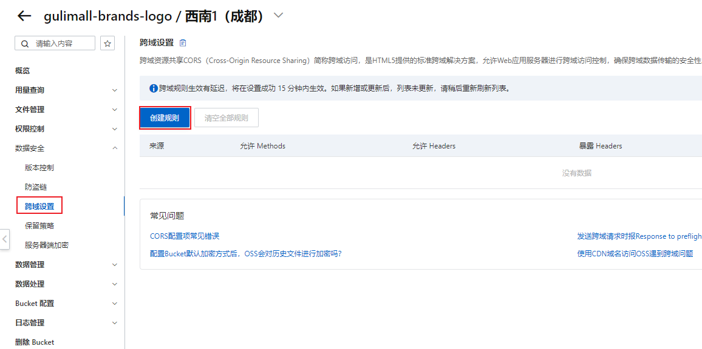
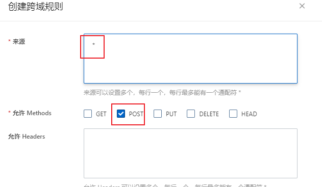

## 第3章 sms

### 4.1 阿里云短信工具类

将阿里云短信服务封装成工具类，会员登录时模块 12，工具模块是 05，而模块 12 依赖了模块 17，模块 17 依赖了模块 05，根据依赖的传递性，在模块 05 中添加阿里云短信服务

```xml
<dependency>
  <groupId>com.aliyun</groupId>
  <artifactId>dysmsapi20170525</artifactId>
  <version>2.0.18</version>
</dependency>
```

```java
    /**
     * 阿里云短信服务
     * @param accessKeyId 私有id
     * @param accessKeySecret 私有key
     * @param endpoint 短信服务域名
     * @param signName 短信签名
     * @param templateCode 短信模板
     * @param phoneNum 电话号码
     * @return 发送成功返回验证码，失败返回失败消息
     */
    public static ResultEntity<String> sendShortMessage(String accessKeyId, String accessKeySecret, String endpoint, String signName, String templateCode, String phoneNum) {
        Config config = new Config();
        config.setAccessKeyId(accessKeyId);
        config.setAccessKeySecret(accessKeySecret);
        config.endpoint = endpoint;

        Client client = null;
        try {
            client = new Client(config);
        } catch (Exception e) {
            e.printStackTrace();
        }

        SendSmsRequest sendSmsRequest = new SendSmsRequest();
        sendSmsRequest.setSignName(signName);
        sendSmsRequest.setTemplateCode(templateCode);
        sendSmsRequest.setPhoneNumbers(phoneNum);
        //生成验证码
        String code = "";
        int rand;
        for (int i = 0; i < 4; i++) {
            rand = (int) (Math.random() * 10);
            code += rand + "";
        }

        sendSmsRequest.setTemplateParam("{\"code\":\"" + code + "\"}");

        RuntimeOptions runtimeOptions = new RuntimeOptions();
        int statusCode;
        try {
            SendSmsResponse sendSmsResponse = client.sendSmsWithOptions(sendSmsRequest, runtimeOptions);
//            System.out.println(sendSmsResponse.toString() + "刚发送，看看sendSmsResponse是个啥++++++++++++++++++++++++++++++++++");
            statusCode = sendSmsResponse.statusCode;
            if (statusCode == 200) {
                return ResultEntity.successWithData(code);
            }
            return ResultEntity.failed(sendSmsResponse.toString());
        } catch (TeaException error) {
            String errMessage = Common.assertAsString(error.message);
//            System.out.println("+++++++++++++++++++++TeaException" + errMessage);
            return ResultEntity.failed(errMessage);
        } catch (Exception e) {
            TeaException error = new TeaException(e.getMessage(), e);
            String errMessage = Common.assertAsString(error.message);
//            System.out.println("+++++++++++++++++++++Exception" + errMessage);
            return ResultEntity.failed(errMessage);
        }
    }
```

### 4.2 注册过程

基础功能（发送验证码）：
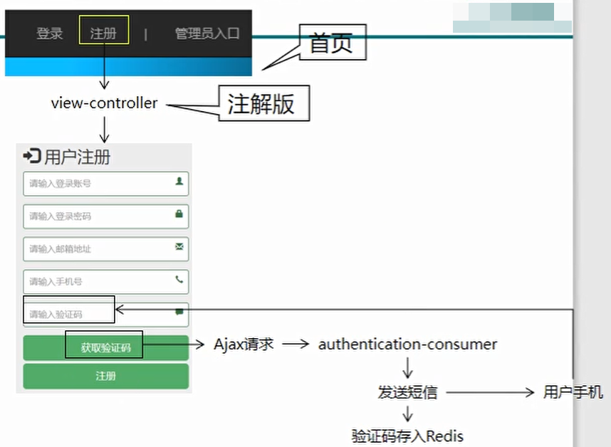
注册成功后的跳转，使用重定向，防止刷新页面重新提交注册请求。

防止点击 button 按钮表单刷新：
button 按钮不设置 type 类型时，默认为 subbmit，默认事件会提交表单（即使表单不带 action 属性）
设置为 type=button 可以实现单纯的点击效果。

首次请求响应超时：
分布式环境中，使用了 Zuul、Feign 后，由于底层都通过 Ribbon 通过 service name 寻找 eureka，第一次请求需要建立缓存、连接等，操作较多，ribbon 的默认超时时间较短，容易报超时错误。
解决方式是在响应的微服务配置文件中配置（设置大一点的值）：

```yaml
ribbon:
	ReadTimeout: 1000
	ConnectTimeout: 10000
```

