*通常我们认为，Spring MVC 是 Spring 的子项目，其实，它谈不上是一个独立的子项目，因为连一个正规的名字都没有。Spring Web MVC 是基于 Servlet API 构建的原始 Web 框架，从一开始就包含在 Spring 框架中。正式名称“Spring Web MVC”来自其源模块（spring-webmvc）的名称，但更常见的名称是“Spring MVC”。*
<!-- more -->

## 1. SpringMVC 简介

### 1.1 Spring MVC 介绍

#### 1.1.1 MVC

1. `MVC`是一种软件架构的思想，将软件按照模型、视图、控制器来划分
2. `M`：`Model`，模型层，指工程中的`JavaBean`，作用是处理数据
   - `JavaBean`分为两类：
     - 一类称为实体类`Bean`：专门存储业务数据的，如 `Student`、`User`等
     - 一类称为业务处理 Bean：指 `Service`或 `Dao`对象，专门用于处理业务逻辑和数据访问。
3. `V`：`View`，视图层，指工程中的 html 或 jsp 等页面，作用是与用户进行交互，展示数据
4. `C`：`Controller`，控制层，指工程中的`servlet`，作用是接收请求和响应浏览器
5. `MVC`的工作流程：用户通过视图层发送请求到服务器，在服务器中请求被`Controller`接收，`Controller`调用相应的 Model 层处理请求，处理完毕将结果返回到`Controller`，`Controller`再根据请求处理的结果找到相应的 View 视图，渲染数据后最终响应给浏览器

#### 1.1.2 SpringMVC

1. `SpringMVC`是`Spring`的一个后续产品，是 Spring 的一个子项目
2. `SpringMVC `是 `Spring `为表述层开发提供的一整套完备的解决方案。在表述层框架历经 `Strust`、`WebWork`、`Strust2 `等诸多产品的历代更迭之后，目前业界普遍选择了 `SpringMVC `作为 JavaEE 项目表述层开发的**首选方案**。
3. 注：三层架构分为表述层（或表示层）、业务逻辑层、数据访问层，表述层表示前台页面和后台`servlet`

#### 1.1.3 SpringMVC 的特点

1. `**Spring **`**家族原生产品**，与`IOC`容器等基础设施无缝对接
2. **基于原生的**`**Servlet**`，通过了功能强大的**前端控制器**`**DispatcherServlet**`，对请求和响应进行统一处理
3. 表述层各细分领域需要解决的问题**全方位覆盖**，提供**全面解决方案**
4. **代码清新简洁**，大幅度提升开发效率
5. 内部组件化程度高，可插拔式组件**即插即用**，想要什么功能配置相应组件即可
6. **性能卓著**，尤其适合现代大型、超大型互联网项目要求

### 1.2 Spring MVC 使用

#### 1.2.1 开发环境

- IDEA2021.2.4
- maven3.5.4【3.8.6 版本与 idea2021 使用会找不到依赖】
- tomcat8
- Spring5.3.1

#### 1.2.2 创建 maven 工程

1. 创建项目：
   - 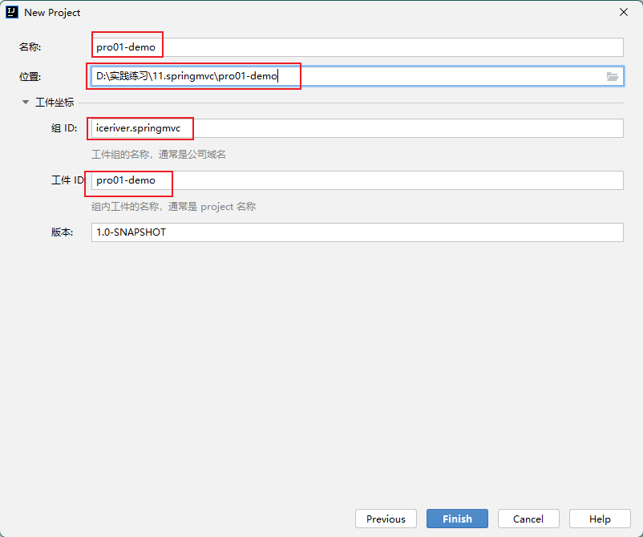
2. 修改本地 maven 仓库：
   - 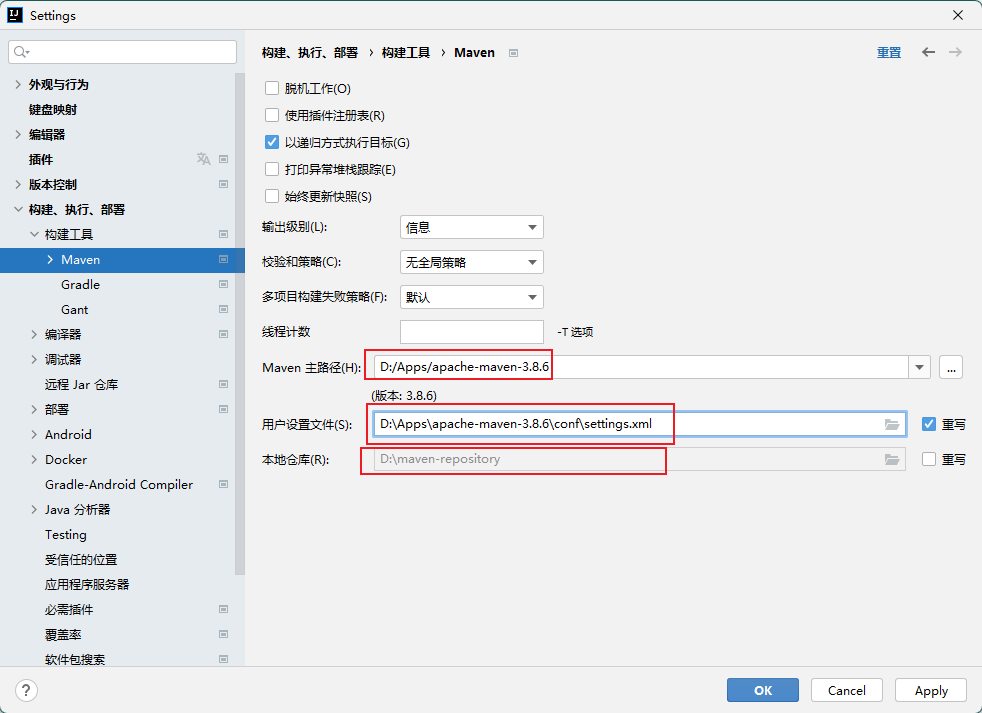
3. 添加框架支持，因为为 web 项目。
   - 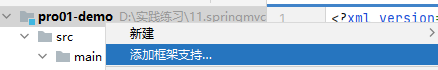
   - 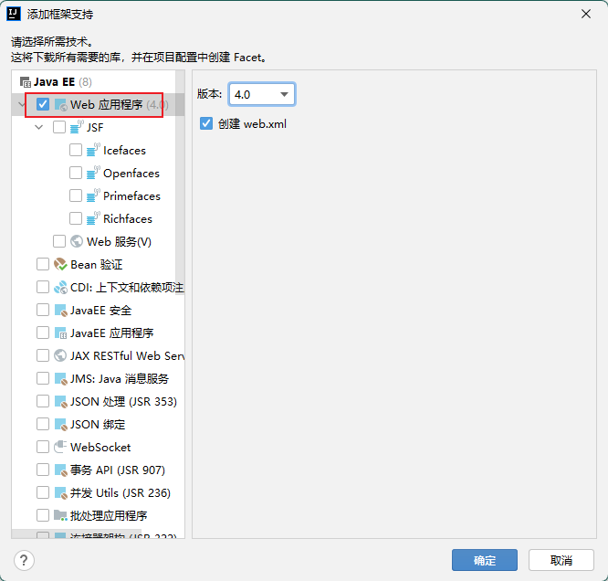
   - 这里使用框架支持还是手动建立 web 目录都没有区别，配置好工件路径即可。【参见 JavaWeb4.1】

#### 1.2.3 添加项目依赖

1. 必须的依赖：
   - `Spring MVC`
   - 日志：`logback`
   - `servlet api`
   - `thymeleaf`

```xml
<?xml version="1.0" encoding="UTF-8"?>
<project xmlns="http://maven.apache.org/POM/4.0.0"
         xmlns:xsi="http://www.w3.org/2001/XMLSchema-instance"
         xsi:schemaLocation="http://maven.apache.org/POM/4.0.0 http://maven.apache.org/xsd/maven-4.0.0.xsd">
    <modelVersion>4.0.0</modelVersion>

    <groupId>iceriver.springmvc</groupId>
    <artifactId>pro01-demo</artifactId>
    <version>1.0-SNAPSHOT</version>
    <packaging>war</packaging>

    <dependencies>
        <!-- SpringMVC -->
        <dependency>
            <groupId>org.springframework</groupId>
            <artifactId>spring-webmvc</artifactId>
            <version>5.3.1</version>
        </dependency>

        <!-- 日志 -->
        <dependency>
            <groupId>ch.qos.logback</groupId>
            <artifactId>logback-classic</artifactId>
            <version>1.2.3</version>
        </dependency>

        <!-- ServletAPI -->
        <dependency>
            <groupId>javax.servlet</groupId>
            <artifactId>javax.servlet-api</artifactId>
            <version>3.1.0</version>
            <scope>provided</scope>
        </dependency>

        <!-- Spring5和Thymeleaf整合包 -->
        <dependency>
            <groupId>org.thymeleaf</groupId>
            <artifactId>thymeleaf-spring5</artifactId>
            <version>3.0.12.RELEASE</version>
        </dependency>
        <dependency>
            <groupId>org.springframework</groupId>
            <artifactId>spring-webmvc</artifactId>
            <version>5.3.1</version>
            <scope>compile</scope>
        </dependency>
    </dependencies>
</project>
```

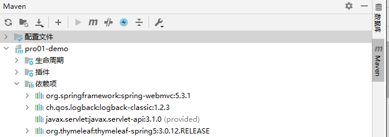

#### 1.2.4 配置`web.xml`

1. 配置`SpringMVC`的前端控制器`DispatcheServlet`，对浏览器发送的请求进行统一处理。
2. 配置名为`SpringMVC`的`servlet`

```xml
<?xml version="1.0" encoding="UTF-8"?>
<web-app xmlns="http://xmlns.jcp.org/xml/ns/javaee"
         xmlns:xsi="http://www.w3.org/2001/XMLSchema-instance"
         xsi:schemaLocation="http://xmlns.jcp.org/xml/ns/javaee http://xmlns.jcp.org/xml/ns/javaee/web-app_4_0.xsd"
         version="4.0">
  <servlet>
	    <servlet-name>springMVC</servlet-name>
    <servlet-class>org.springframework.web.servlet.DispatcherServlet</servlet-class>
  </servlet>
  <servlet-mapping>
    <servlet-name>springMVC</servlet-name>
    <url-pattern>/</url-pattern>
  </servlet-mapping>
</web-app>
```

- `/`所匹配的请求可以是`/login`或`.html`或`.js`或`.css`方式的请求路径，但是`/`不能匹配`.jsp`请求路径的请求
- `/*`会匹配包括`.jsp`的请求

3. 优化：加载`springMVC.xml`配置文件，并通过设置`<load-on-startup>`改变优先级，让在启动服务器时完成初始化，提高第一次请求的响应速度。
   - 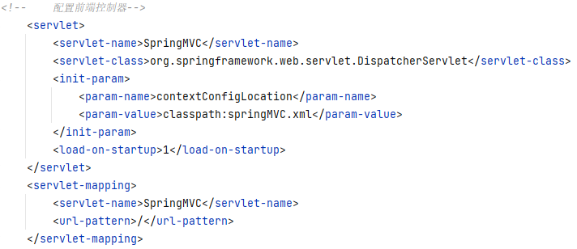

#### 1.2.5 创建请求控制器

1. `web.xml`中声明了控制路径`/`，还需要定义控制 servlet 程序，如`HelloControler.java`，对不同的请求进行不同的处理。
2. 通过`@Controller`注解的方式将该控制类交给`IoC`管理，声明为控制器文件。

```java
package iceriver.springmvc.controller;

import org.springframework.stereotype.Controller;

/**
* @author: INFINITY https://developer.aliyun.com/profile/sagwrxp2ua66w
* @date: 2022/7/19 15:31
*/
@Controller
public class HelloController {
}
```

#### 1.2.6 创建`springMVC.xml`配置文件

1. 1.2.4 中步骤二加载了`springMVC.xml`配置文件，但此时还没有，`springMVC.xml`的作用是 spring 框架的一个配置文件。这里需要建在`resourses`文件夹下。
   - 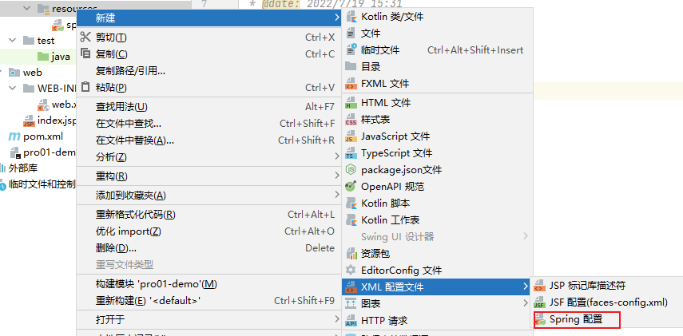
   - springMVC 的配置文件具有默认的位置和名称
     - 默认的位置：WEB-INF
     - 默认的名称：`<servlet-name>-servlet.xml`
     - 若要为 springMVC 的配置文件设置自定义的位置和名称，需要在 servlet 标签中添加`init-param`标签
     - 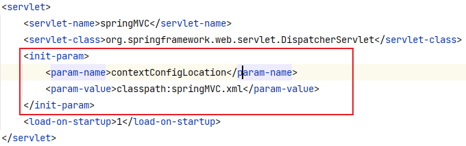

2. 1.2.5 中使用了注解，因此需要在`springMVC.xml`文件中进行相应的配置以保证生效。
   - 引入名称空间、开启组件扫描【参见 Spring2.3.2 部分】
     - 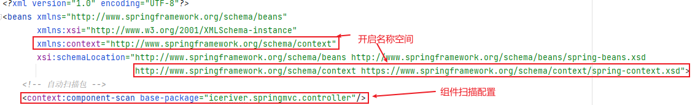
     - 这里没设置扫面指定注解
   - 配置`thymeleaf`视图解析器。
     - 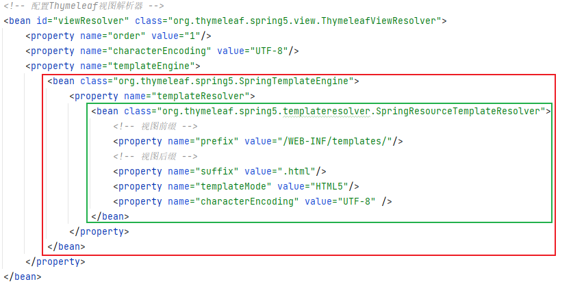
     - 采用了`IoC`属性注入的级联赋值
     - 这里视图前缀部分规定了前端页面文件要放在`WEB-INF/templates`目录下
     - `WEB-INF`目录下的文件不能被前端请求直接访问，也不能被重定向访问，只能通过请求转发访问。

```xml
<?xml version="1.0" encoding="UTF-8"?>
<beans xmlns="http://www.springframework.org/schema/beans"
       xmlns:xsi="http://www.w3.org/2001/XMLSchema-instance"
       xmlns:context="http://www.springframework.org/schema/context"
       xsi:schemaLocation="http://www.springframework.org/schema/beans http://www.springframework.org/schema/beans/spring-beans.xsd
                           http://www.springframework.org/schema/context https://www.springframework.org/schema/context/spring-context.xsd">
  <!-- 自动扫描包 -->
  <context:component-scan base-package="iceriver.springmvc.controller"/>

  <!-- 配置Thymeleaf视图解析器 -->
  <bean id="viewResolver" class="org.thymeleaf.spring5.view.ThymeleafViewResolver">
    <property name="order" value="1"/>
    <property name="characterEncoding" value="UTF-8"/>
    <property name="templateEngine">
      <bean class="org.thymeleaf.spring5.SpringTemplateEngine">
        <property name="templateResolver">
          <bean class="org.thymeleaf.spring5.templateresolver.SpringResourceTemplateResolver">
            <!-- 视图前缀 -->
            <property name="prefix" value="/WEB-INF/templates/"/>
            <!-- 视图后缀 -->
            <property name="suffix" value=".html"/>
            <property name="templateMode" value="HTML5"/>
            <property name="characterEncoding" value="UTF-8" />
          </bean>
        </property>
      </bean>
    </property>
  </bean>
</beans>
```

3. `WEB-INF/templates`目录下新建`index.html`文件
   - IDEA 不配置情况下，新建的 html 文件不带`<html lang="en" xmlns:th="http://www.thymeleaf.org">`后面的 thymeleaf 命名空间。可以通过设置进行修改
     - 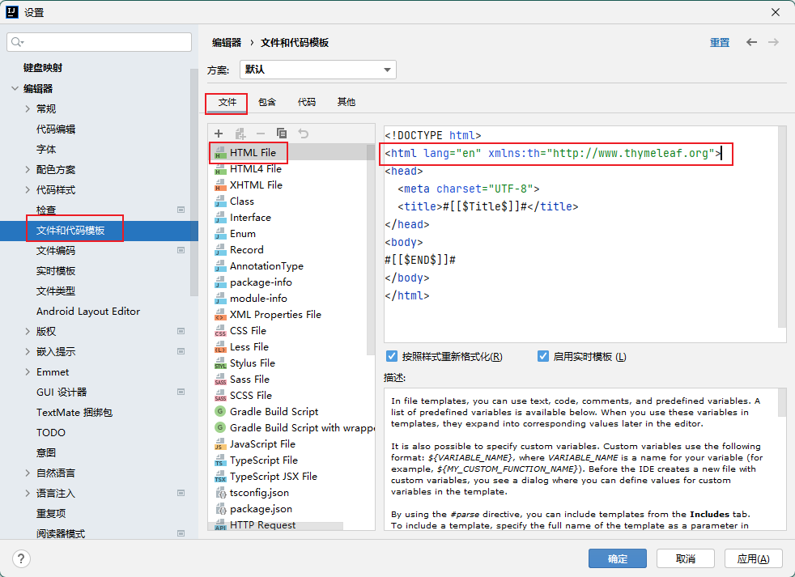

#### 1.2.7 启动工程

1. 配置 tomcat 服务器【参见 JavaWeb4.2】
2. 关于 404 错误：
   - 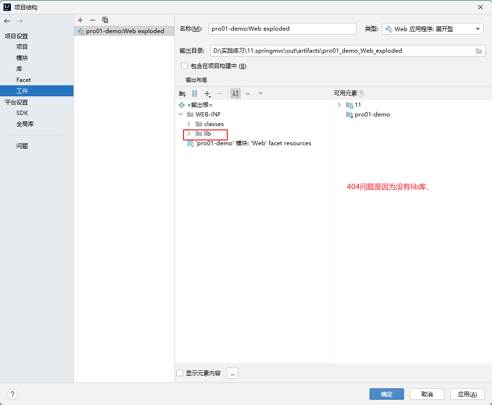

#### 1.2.8 前端访问指定页面

1. `index.html`下新建`target.html`，并在`index.html`添加访问链接：`<a th:href="@{/target}">访问target</a>`

```html
<!DOCTYPE html>
<html lang="en" xmlns:th="http://www.thymeleaf.org">
  <head>
    <meta charset="UTF-8" />
    <title>Title</title>
  </head>
  <body>
    hello
    <a th:href="@{/target}">访问target</a>
    <a th:href="@{/testForward}">testForward</a>
    <a th:href="@{/testRedirect}">testRedirect</a>
  </body>
</html>
```

2. `HelloController.java`中按照`index`同样的方式配置`targe.html`的访问方法。

```java
package iceriver.springmvc.controller;

import org.springframework.stereotype.Controller;
import org.springframework.ui.ModelMap;
import org.springframework.web.bind.annotation.RequestMapping;

@Controller
public class HelloController {
    //  通过@RequestMapping注解，可以通过请求路径匹配要处理的具体的请求
    //  /表示的当前工程的上下文路径
    @RequestMapping("/")
    public String index(){
        return "index";
    }
    @RequestMapping("/target")
    public String toTarget(){
        return "target";
    }
    @RequestMapping("/testForward")
    public String testForward(){
        return "forward:/target";
    }
    @RequestMapping("/testRedirect")
    public String testRedirect(){
        return "redirect:/target";
    }
}

```

#### 1.2.9 总结

- 浏览器发送请求，若请求地址符合前端控制器的`url-pattern`（web.xml），该请求就会被前端控制器`DispatcherServlet`处理。前端控制器会读取`SpringMVC`的核心配置文件(`springmvc.xml`)，通过扫描组件找到控制器，将请求地址和控制器中`@RequestMapping`注解的`value`属性值进行匹配，若匹配成功，该注解所标识的控制器方法就是处理请求的方法。处理请求的方法需要返回一个字符串类型的视图名称，该视图名称会被视图解析器解析，加上前缀和后缀组成视图的路径，通过`Thymeleaf`对视图进行渲染，最终**请求转发**到视图所对应页面。

## 2. 控制器配置

### 2.1 `@RequestMapping`注解

#### 2.1.1 使用

1. 作用：用于请求和处理请求的控制器方法建立映射关系。
   - 一个请求只能映射到一个控制器方法。一个请求映射多个控制器方法会报错。
2. 使用位置：可以用于类（控制器）前，也可以用在方法前：
   - 用在类前：设置请求路径的初始信息
   - 用在方法前：设置请求路径的具体信息
   - 同时使用时，相当于请求路径进行了拼接，要符合类前设置的路径后，再去匹配方法前的路径。

#### 2.1.2 属性

1. `value`：配置请求地址
   - `value`设置多个值时，表示该请求映射能够匹配多个请求地址所对应的请求
   - `value`属性必须设置
   - 不匹配时报 404 错误

```html
<a th:href="@{/testRequestMapping}"
  >测试@RequestMapping的value属性-->/testRequestMapping</a
>
<a th:href="@{/test}">测试@RequestMapping的value属性-->/test</a>
```

```java
@RequestMapping(value = {"/testRequestMapping", "/test"})
public String testRequestMapping(){
    return "success";
}
```

2. `mthod`：通过请求的请求方式（get 或 post）匹配请求映射
   - `RequestMethod.XXX`设置多个时，表示该请求映射能够匹配多种请求方式的请求
     - 处理 get 请求的映射：`@GetMapping`
     - 处理 post 请求的映射：`@PostMapping`
     - 处理 put 请求的映射：`@PutMapping`
     - 处理 delete 请求的映射：`@DeleteMapping`
   - 请求地址满足请求映射的 value 属性，但不满足 method 属性，浏览器报错 405 错误
   - 目前浏览器只支持 get 和 post，在 form 表单提交时，设置了其他请求方式的字符串（put 或 delete），则按照默认的请求方式 get 处理
   - 要发送 put 和 delete 请求，需要通过 spring 提供的过滤器`HiddenHttpMethodFilter`，详见 RESTful。

```html
<a th:href="@{/test}">测试@RequestMapping的value属性-->/test</a>
<form th:action="@{/test}" method="post">
  <input type="submit" />
</form>
```

```java
@RequestMapping(
        value = {"/testRequestMapping", "/test"},
        method = {RequestMethod.GET, RequestMethod.POST}
)
public String testRequestMapping(){
    return "success";
}
```

3. `params`：通过请求的请求参数匹配请求映射。
   - `params`可以通过四种表达式设置请求参数和请求映射的匹配关系
     - `"param"`：要求请求映射所匹配的请求必须携带 param 请求参数
     - `"!param"`：要求请求映射所匹配的请求必须不能携带 param 请求参数
     - `"param=value"`：要求请求映射所匹配的请求必须携带 param 请求参数且`param=value`
     - `"param!=value"`：要求请求映射所匹配的请求必须携带 param 请求参数但是`param!=value`
   - 若当前请求满足@RequestMapping 注解的 value 和 method 属性，但是不满足 params 属性，此时页面回报错 400

```html
<a th:href="@{/test(username='admin',password=123456)"
  >测试@RequestMapping的params属性-->/test</a
>
```

```java
@RequestMapping(
        value = {"/testRequestMapping", "/test"}
        ,method = {RequestMethod.GET, RequestMethod.POST}
        ,params = {"username","password!=123456"}
)
public String testRequestMapping(){
    return "success";
}
```

4. `headers`：通过请求的请求头信息匹配请求映射
   - `headers`可以通过四种表达式设置请求头信息和请求映射的匹配关系
     - `"header"`：要求请求映射所匹配的请求必须携带 header 请求头信息
     - `"!header"`：要求请求映射所匹配的请求必须不能携带 header 请求头信息
     - `"header=value"`：要求请求映射所匹配的请求必须携带 header 请求头信息且 header=value
     - `"header!=value"`：要求请求映射所匹配的请求必须携带 header 请求头信息且 header!=value
   - 若当前请求满足`@RequestMapping`注解的 value 和 method 属性，但是不满足 headers 属性，此时页面显示 404 错误，即资源未找到

#### 2.1.3 ant 风格路径

1. `@RequestMapping`修饰的`value`属性代表的匹配路径可以使用 ant 风格，ant 风格的规则如下：
   - `?`：表示任意的单个字符
     - 但不能表示`/`和`?`。
   - `*`：表示任意的 0 个或多个字符
   - `**`：表示任意的一层或多层目录
     - 使用`**`时只能连用，中间有任何其他字符会当作单个`*`

#### 2.1.4 路径占位符

1. `SpringMVC`支持占位符，常用于`RESTful`风格中。占位符表示路径中该位置实际上是个参数。

```html
<a th:href="@{/testRest/1/admin}">测试路径中的占位符-->/testRest</a>
```

```java
@RequestMapping("/testRest/{id}/{username}")
public String testRest(@PathVariable("id") String id,
                       @PathVariable("username") String username){
    System.out.println("id:"+id+",username:"+username);
    return "success";
}
//最终输出的内容为-->id:1,username:admin
```

### 2.2 获取请求参数

#### 2.2.1 通过 ServletAPI 获取

1. 使用`HttpServletRequest`对象的表单数据获取方法【参见 Javaweb5.7.5】
   - 

```java
@RequestMapping("/testParam")
public String testParam(HttpServletRequest request){
    String username = request.getParameter("username");
    String password = request.getParameter("password");
    System.out.println("username:"+username+",password:"+password);
    return "success";
}
```

#### 2.2.2 通过控制器方法的形参获取

```java
@RequestMapping("/testParam")
public String testParam(String username, String password){
    System.out.println("username:"+username+",password:"+password);
    return "success";
}
```

```html
<a th:href="@{/testParam(username='admin',password=123456)}"
  >测试获取请求参数-->/testParam</a
>
```

- 多个同名参数（如复选框），可以使用字符串接收，此时多个参数值会以`,`分隔。如`hobby:a,b,c`
- 多个同名参数（如复选框），也可以使用字符串数组接收，此时多个参数值会组成数组。
- 支持`get`、`post`、`超链接`传参。
- 通过控制方法形参获取请求参数的方式要求形参和实参的名称一模一样。

#### 2.2.3 `@RequestParam`

- 通过控制方法形参获取请求参数的方式要求形参和实参的名称一模一样。对于名称不一样的情况，可以使用`@RequestParam`建立参数映射关系。
  - 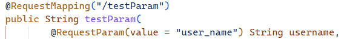
- `@RequestParam`的属性：
  - `value`、`name`：二者等价，为形参和实参建立映射关系
  - `defaultValue`：为实参设置默认值，如果`user_name`没有传递或传递`""`，则使用默认值。
    - 不设置`defaultValue`，请求未传递参数时值为`null`
  - `required`：该参数是否必须，默认为 true，表示必须。
    - 设置为 true 时，同时没有设置`defaultValue`，请求未传递参数时报`40`错误——请求未传参。
    - 设置为 false，同时没有设置`defaultValue`，请求未传递参数时值为`null`。

@PathVariable：spring 提供的，获取路径中的参数，配合 restful 风格使用，转换成实体类的属性。

- 不能转化为实体类对象

@RequestBody：spring 提供的，将前台提交的 json 数据转换为实体类对象

- 只能接收 post 请求，且提交数据为 json 格式
- 如果提交参数为路径拼接，使用了@RequestBody 获取参数会报 400

@param：mybatis 提供的，用于 Dao 层，确定 sql 语句的参数。

#### 2.2.4 `@PathVariable`路径占位符

- 见本章【2.1.4[https://www.yuque.com/zhuyuqi/zna9x5/zh889g#wG0bQ](#wG0bQ)】
- `@PathVariable`与`@RequestParam`的区别：
  - `@PathVariable`只能用于请求路径上`/`的参数（RESTful 风格），一般用于`get`、`delete`请求
  - `@RequestParam`只能用于传统请求路径上`?`和`&`风格的请求参数，一般用于`post`请求
  - `@PathVariable`没有`defaultValue`
  - 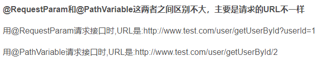

#### 2.2.5 `@ReqquestHeader`

- 将请求头信息和控制器方法的形参创建映射关系。
- 属性有三个`value`、`required`、`defaultValue`
- 用法同`@RequestParam`

#### 2.2.6 `@CookieValue`

- 将 cookie 数据和控制器方法的形参创建映射关系
- 属性有三个`value`、`required`、`defaultValue`，
- 用法同`@RequestParam`
- 参数类型使用 Cookie 时，可以得到整个 cookie 对象

#### 2.2.7 通过 POJO 获取请求参数

- 可以在控制器方法形参位置传入一个`pojo`类对象作为形参，当请求的参数名和`pojo`的属性名一致，会自动赋值，即创建对象。

```java
@RequestMapping("/testpojo")
public String testPOJO(User user){
    System.out.println(user);
    return "success";
}
//最终结果-->User{id=null, username='张三', password='123', age=23, sex='男', email='123@qq.com'}
```

```html
<form th:action="@{/testpojo}" method="post">
  用户名：<input type="text" name="username" />

  密码：<input type="password" name="password" />

  性别：<input type="radio" name="sex" value="男" />男<input
    type="radio"
    name="sex"
    value="女"
  />女 年龄：<input type="text" name="age" />

  邮箱：<input type="text" name="email" />

  <input type="submit" />
</form>
```

### 2.3 处理请求参数的乱码

- `GET`请求乱码：跟 tomcat 版本有关，【参见 JavaWeb5.7.5】
- `POST`请求乱码：在`web.xml`文件中，使用过滤器

```xml
<!--配置springMVC的编码过滤器-->
<filter>
    <filter-name>CharacterEncodingFilter</filter-name>
    <filter-class>org.springframework.web.filter.CharacterEncodingFilter</filter-class>
    <init-param>
        <param-name>encoding</param-name>
        <param-value>UTF-8</param-value>
    </init-param>
    <init-param>
        <param-name>forceResponseEncoding</param-name>
        <param-value>true</param-value>
    </init-param>
</filter>
<filter-mapping>
    <filter-name>CharacterEncodingFilter</filter-name>
    <url-pattern>/*</url-pattern>
</filter-mapping>
```

## 3. 域对象共享数据

### 3.1 向`request`域对象共享数据

#### 3.1.1 共享`request`域对象共享数据的原理

1. SpringMVC 本质上是请求转发，这样从头到尾是一个请求，所以可以通过`request`域对象共享数据。

#### 3.1.2 向`request`域对象共享数据的方式

1. 使用`ServletAPI`向`request`域对象共享数据：

```java
@RequestMapping("/testServletAPI")
public String testServletAPI(HttpServletRequest request){
    request.setAttribute("testScope", "hello,servletAPI");
    return "success";
}
```

2. 使用`ModelAndView`向`request`域对象共享数据：

```java
@RequestMapping("/testModelAndView")
public ModelAndView testModelAndView(){
    ModelAndView mav = new ModelAndView();
    mav.addObject("testScope", "hello,ModelAndView");
    mav.setViewName("success");
    return mav;
}
```

3. 使用 Model 向 request 域对象共享数据

```java
@RequestMapping("/testModel")
public String testModel(Model model){
    model.addAttribute("testScope", "hello,Model");
    return "success";
}
```

4. 使用 map 向 request 域对象共享数据

```java
@RequestMapping("/testMap")
public String testMap(Map<String, Object> map){
    map.put("testScope", "hello,Map");
    return "success";
}
```

5. 使用 ModelMap 向 request 域对象共享数据

```java
@RequestMapping("/testModelMap")
public String testModelMap(ModelMap modelMap){
    modelMap.addAttribute("testScope", "hello,ModelMap");
    return "success";
}
```

6. 五种方式对比：

   | 类                    | 参数类型             | 方法             | 返回值                 |
   | --------------------- | -------------------- | ---------------- | ---------------------- |
   | `HttpServletRequest`  | `HttpServletRequest` | `setAttribute()` | 字符串页面名           |
   | `ModelAndView`        | 无参                 | `addObject()`    | `ModelAndView`的的对象 |
   | `Model`               | `Model`              | `addAttribute()` | 字符串页面名           |
   | `Map<String, Object>` | Map<String, Object>  | `put()`          | 字符串页面名           |
   | `ModelMap`            | `ModelMap`           | `addAttribute()` | 字符串页面名           |


   - `HttpServletRequest`是`servlet`的原生对象。
   - `Model`、`ModelMap`、`Map`本质运行类型均为`BindingAwareModelMap`【使用了多态】，本质一样。
   - Model 转发时将数据放入到请求域中，重定向则是放到路径参数上。？？？？是这样吗，
     - 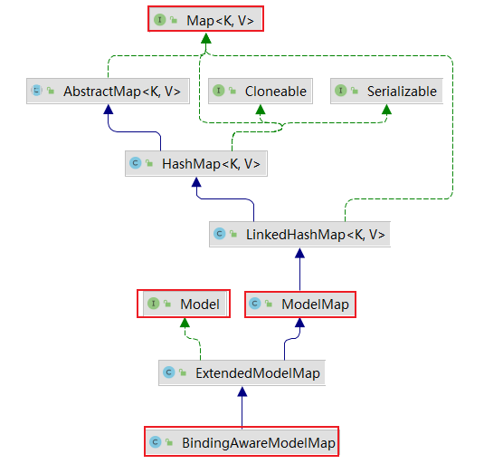

#### 3.1.3 使用`request`域对象属性

- `request`域对象设置的属性，`thymeleaf`调用时可以直接使用属性名调用。

### 3.2 向`session`域对象共享数据

1. 使用原生的`HttpSession`类对象进行设置，方法为`setAttribute()`
2. 使用属性时，需要使用`session.属性名`

```java
@RequestMapping("/testSession")
public String testSession(HttpSession session){
    session.setAttribute("testSessionScope", "hello,session");
    return "success";
}
```

### 3.3 向`application`域对象共享数据

#### 3.3.1 获取`application`域对象

1. `application`域对象是`ServletContext`的实例对象
2. 获取`ServletContext`实例对象的方式有多种：【参见 Javaweb5.7.3】
   - 通过`request`对象获取：`request.getServletContext()`
   - 通过`session`对象获取：`session.getServletContext()`
   - 通过`init()`方法中，通过`ServletConfig`对象获取：`servletConfig.getServletContext()`。
   - 通过 jsp 页面的`pageContext`内置对象

```java
@RequestMapping("/testApplication")
public String testApplication(HttpSession session){
	ServletContext application = session.getServletContext();
    application.setAttribute("testApplicationScope", "hello,application");
    return "success";
}
```

#### 3.3.2 使用方式

1. 设置即原生方式：调用`ServletContext`类对象的`setAttribute()`方法进行设置
2. 使用即原生方式：通过`application.属性名`

### 3.4 重定向携带数据

#### 3.4.1 RedirectAttributes

1. addAttribute()：添加数据会添加到重定向的路径上，作为请求参数，使用@requestparam 注解获取。
2. addFlashAttribute()：将数据放到 session 里面，但是只能读取一次。

## 4. SpringMVC 的视图

### 4.0 SpringMVC 视图介绍

1. SpringMVC 中的视图是 View 接口，视图的作用渲染数据，将模型 Model 中的数据展示给用户
2. SpringMVC 视图的种类很多，默认有转发视图和重定向视图
3. 如果 springmvc 配置文件没有配置视图解析器，应该样实现请求访问呢？
   - 2022.07.20 测试：
     - 配置了`InternalResourceView`视图解析（未配置前后缀）、不配置视图解析器，使用 forward、不使用 forward，只要控制器地址写从 web 路径开始的文件全路径，就可以访问到 jsp 页面。
     - 但不能访问 html 页面、配置了前后缀会访问不到 jsp 页面。

### 4.1 默认视图

#### 4.1.1 转发视图

1. SpringMVC 中默认的转发视图是`InternalResourceView`
2. 当控制器方法中所设置的视图名称以`forward:`为前缀时，此时的视图名称不会被 SpringMVC 配置文件中所配置的视图解析器解析，而是会将前缀`forward:`去掉，剩余部分作为最终路径通过转发的方式实现跳转
   - 没有写`forward:`，且没有配置视图解析器时，默认的转发视图也是`InternalResourceView`
3. 不能直接跳转`WEB-INF`下的静态资源，必须跳转到控制器中的其他跳转方法。

#### 4.1.2 重定向视图

1. SpringMVC 中默认的重定向视图是`RedirectView`
2. 当控制器方法中所设置的视图名称以`redirect:`为前缀时，此时的视图名称不会被 SpringMVC 配置文件中所配置的视图解析器解析，而是会将前缀`redirect:`去掉，剩余部分作为最终路径通过重定向的方式实现跳转
3. 不能直接跳转`WEB-INF`下的静态资源，必须跳转到控制器中的其他跳转方法。
4. 重定向视图和转发视图都会让浏览器地址发生变化，但转发视图最后的地址为请求的地址（`forward`后的部分），重定向视图最后的地址为转发后处理的地址（`redirect`给了谁，这个谁处理后的地址才是浏览器的地址）
   - 从前端请求的角度看，重定向的地址跳到了不是他发起请求的一个地址。

### 4.2 其他视图

#### 4.2.1 ThymeleafView

1. 当控制器方法中所设置的视图名称没有任何前缀时，此时的视图名称会被 SpringMVC 配置文件中所配置的视图解析器解析，视图名称拼接视图前缀和视图后缀所得到的最终路径，会通过转发的方式实现跳转

#### 4.2.2 `InternalResourceView`

1. SpringMVC 默认的视图解析器，不配置视图解析器，或者配置了视图解析器，但转发以`forward:`开头，或者配置的视图解析器就是`InternalResourceView`（如 jsp 页面），则使用该视图的方式（前后缀）进行跳转。

### 4.3 视图控制器 view-controller

1. 当控制器方法中，仅仅用来实现页面跳转，没有其他处理时，可以在`SpringMVC.xm`l 配置文件中将处理器方法使用`<view-controller>`标签进行表示，在配置文件中完成跳转。
   - `<mvc:view-controller path="/testView" view-name="success"></mvc:view-controller>`
     - `path`：设置处理的请求地址
     - `view-name`：设置请求地址所对应的视图名称

```java
<mvc:view-controller path="/" view-name="index"/><!--配置视图控制器--><!--访问首页-->
<mvc:annotation-driven /><!--开启mvc注解驱动-->
```

2. 当 SpringMVC 配置文件中设置任何一个`<view-controller>`时，控制器中的其他请求映射方法将全部失效，此时需要在 SpringMVC 配置文件中开启 mvc 注解驱动：
   - `<mvc:annotation-driven />`
   - `<mvc:annotation-driven />`功能有很多，这里只是用到了它的一个很小的点。

## 5. RESTful 风格

### 5.1 RESTful 简介

- REST：Representational State Transfer，表现层资源状态转移。

#### 5.1.1 资源

- 资源是一种看待服务器的方式，即，将服务器看作是由很多离散的资源组成。每个资源是服务器上一个可命名的抽象概念。因为资源是一个抽象的概念，所以它不仅仅能代表服务器文件系统中的一个文件、数据库中的一张表等等具体的东西，可以将资源设计的要多抽象有多抽象，只要想象力允许而且客户端应用开发者能够理解。与面向对象设计类似，资源是以名词为核心来组织的，首先关注的是名词。一个资源可以由一个或多个 URI 来标识。URI 既是资源的名称，也是资源在 Web 上的地址。对某个资源感兴趣的客户端应用，可以通过资源的 URI 与其进行交互。

#### 5.1.2 资源的表述

- 资源的表述是一段对于资源在某个特定时刻的状态的描述。可以在客户端-服务器端之间转移（交换）。资源的表述可以有多种格式，例如 HTML/XML/JSON/纯文本/图片/视频/音频等等。资源的表述格式可以通过协商机制来确定。请求-响应方向的表述通常使用不同的格式。

#### 5.1.3 状态转移

- 状态转移说的是：在客户端和服务器端之间转移（transfer）代表资源状态的表述。通过转移和操作资源的表述，来间接实现操作资源的目的。

### 5.2 RESTful 的实现

#### 5.2.1 路径与请求的关系

1. RESTful 中，将 HTTP 协议里面，四个表示操作方式：`GET`、`POST`、`PUT`、`DELETE`对应成四种基本操作：
   - `GET `用来获取资源
   - `POST `用来新建资源
   - `PUT `用来更新资源
   - `DELETE `用来删除资源。
2. REST 风格提倡 URL 地址使用统一的风格设计，从前到后各个单词使用斜杠分开，不使用问号键值对方式携带请求参数，而是将要发送给服务器的数据作为 URL 地址的一部分，以保证整体风格的一致性。
   | **操作** | **传统方式** | **REST 风格** |
   | --- | --- | --- |
   | 查询操作 | getUserById?id=1 | user/1-->get 请求方式 |
   | 保存操作 | saveUser | user-->post 请求方式 |
   | 删除操作 | deleteUser?id=1 | user/1-->delete 请求方式 |
   | 更新操作 | updateUser | user-->put 请求方式 |

#### 5.2.2 HiddenHttpMethodFilter

1. 浏览器只支持发送`get`和`post`方式的请求，SpringMVC 提供了`HiddenHttpMethodFilter `帮助我们将 POST 请求转换为 `DELETE `或 `PUT `请求。
2. `HiddenHttpMethodFilter `处理`put`和`delete`请求的条件：
   - 当前请求的请求方式必须为`post`。
   - 当前请求必须传输请求参数`_method`。
   - 请求参数`_method`的值才是最终的请求方式。
3. `put`和`delete`请求的实现步骤：
   - 在`web.xml`中注册`HiddenHttpMethodFilter`。
     - 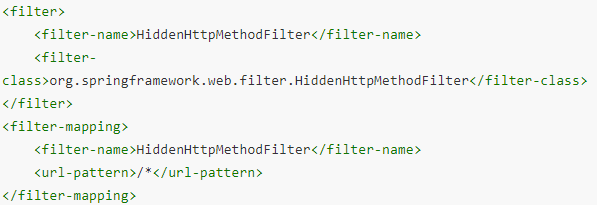
   - 注意点：在`web.xml`中注册时，必须先注册`CharacterEncodingFilter`，再注册`HiddenHttpMethodFilter`，因为`CharacterEncodingFilter`内部有一个获取请求方式的操作，如果不提前设置好编码，会出现乱码情况：
     - `String paramValue = request.getParameter(this.methodParam);`

### 5.3 模拟增删改查

| **功能**           | **URL 地址** | **请求方式** |
| ------------------ | ------------ | ------------ |
| 访问首页           | /            | GET          |
| 查询全部数据       | /employee    | GET          |
| 删除               | /employee/2  | DELETE       |
| 跳转到添加数据页面 | /toAdd       | GET          |
| 执行保存           | /employee    | POST         |
| 跳转到更新数据页面 | /employee/2  | GET          |
| 执行更新           | /employee    | PUT          |

#### 5.3.1 查询功能

```html
<a th:href="@{/employee}">访问员工信息</a>
```

```java
@RequestMapping(value = "/employee", method = RequestMethod.GET)
public String getEmployeeList(Model model){
    Collection<Employee> employeeList = employeeDao.getAll();
    model.addAttribute("employeeList", employeeList);
    return "employee_list";
}
```

```html
<table
  border="1"
  cellpadding="0"
  cellspacing="0"
  style="text-align: center;"
  id="dataTable"
>
  <tr>
    <th colspan="5">Employee Info</th>
  </tr>
  <tr>
    <th>id</th>
    <th>lastName</th>
    <th>email</th>
    <th>gender</th>
    <th>options(<a th:href="@{/toAdd}">add</a>)</th>
  </tr>
  <tr th:each="employee : ${employeeList}">
    <td th:text="${employee.id}"></td>
    <td th:text="${employee.lastName}"></td>
    <td th:text="${employee.email}"></td>
    <td th:text="${employee.gender}"></td>
    <td>
      <a
        class="deleteA"
        @click="deleteEmployee"
        th:href="@{'/employee/'+${employee.id}}"
        >delete</a
      >
      <a th:href="@{'/employee/'+${employee.id}}">update</a>
    </td>
  </tr>
</table>
```

#### 5.3.2 删除功能

```html
<a
  class="deleteA"
  @click="deleteEmployee"
  th:href="@{'/employee/'+${employee.id}}"
  >delete</a
>

<!-- 作用：通过超链接控制表单的提交，将post请求转换为delete请求 -->
<form id="delete_form" method="post">
  <!-- HiddenHttpMethodFilter要求：必须传输_method请求参数，并且值为最终的请求方式 -->
  <input type="hidden" name="_method" value="delete" />
</form>
<script type="text/javascript">
  var vue = new Vue({
    el: "#dataTable",
    methods: {
      //event表示当前事件
      deleteEmployee: function (event) {
        //通过id获取表单标签
        var delete_form = document.getElementById("delete_form");
        //将触发事件的超链接的href属性为表单的action属性赋值
        delete_form.action = event.target.href;
        //提交表单
        delete_form.submit();
        //阻止超链接的默认跳转行为
        event.preventDefault();
      },
    },
  });
</script>
```

- 这里用到了`vue.js`，由于`vue.js`不经过中央控制器处理，所以需要开启静态资源（本地 js、css、img）加载：
  - `springMVC`的前端控制器不能处理静态资源
  - `Servlet`的默认前端控制器`defaultServlet`可以处理静态资源，这个`defaultServlet`定义在 tomcat 的`web.xml`——全局配置
  - 在本地配置——项目的`web.xml`中使用`<mvc:default-servlet-handler/>`进行开启
  - 静态资源处理顺序：`springmvc`→`defaultservlet`→404

```java
@RequestMapping(value = "/employee/{id}", method = RequestMethod.DELETE)
public String deleteEmployee(@PathVariable("id") Integer id){
    employeeDao.delete(id);
    return "redirect:/employee";
}
```

#### 5.3.3 插入功能

```html
<a th:href="@{/toAdd}">add</a
><!-- 连接通过视图控制器进行转发-->
```

```xml
<mvc:view-controller path="/toAdd" view-name="employee_add"/>
```

```html
<form th:action="@{/employee}" method="post">
  lastName:<input type="text" name="lastName" /><br />
  email:<input type="text" name="email" /><br />
  gender:<input type="radio" name="gender" value="1" />male
  <input type="radio" name="gender" value="0" />female<br />
  <input type="submit" value="add" /><br />
</form>
```

```java
@RequestMapping(value = "/employee", method = RequestMethod.POST)
public String addEmployee(Employee employee){
    employeeDao.save(employee);
    return "redirect:/employee";
}
```

#### 5.3.4 修改功能

```html
<a th:href="@{'/employee/' + ${employee.id}}">update</a>
```

```java
@RequestMapping(value = "/employee/{id}", method = RequestMethod.GET)
public String getEmployeeById(@PathVariable("id") Integer id, Model model){
    Employee employee = employeeDao.get(id);
    model.addAttribute("employee", employee);
    return "employee_update";
}
```

```html
<form th:action="@{/employee}" method="post">
  <input type="hidden" name="_method" value="put" />
  <input type="hidden" name="id" th:value="${employee.id}" />
  <label for="">
    lastName：<input
      type="text"
      name="lastName"
      th:value="${employee.lastName}"
    />
  </label>
  <label for="">
    email：<input type="text" name="email" th:value="${employee.email}" />
  </label>
  <label for="">
    gender：<input
      type="radio"
      name="gender"
      value="1"
      th:field="${employee.gender}"
    />male
    <input
      type="radio"
      name="gender"
      value="0"
      th:field="${employee.gender}"
    />female
  </label>
  <input type="submit" value="修改" />
</form>
```

```java
@RequestMapping(value = "/employee", method = RequestMethod.PUT)
public String updateEmployee(Employee employee){
    employeeDao.save(employee);
    return "redirect:/employee";
}
```

## 6. HttpMessageConverter

> - `HttpMessageConverter`，报文信息转换器，将请求报文转换为 Java 对象，或将 Java 对象转换为响应报文`HttpMessageConverter`提供了两个注解和两个类型：
>   - `@RequestBody`，`@ResponseBody`，
>   - `RequestEntity`，`ResponseEntity`
> - 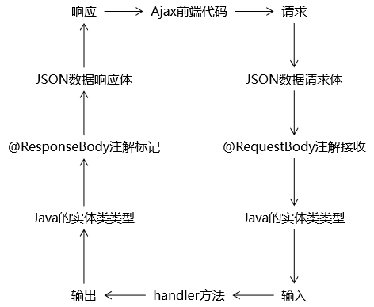

### 6.1 `@RequestBody`

- 标识控制器形参。
- `@RequestBody`可以获取请求体，需要在控制器方法设置一个形参，使用`@RequestBody`进行标识，当前请求的请求体就会为当前注解所标识的形参赋值。
- 前端发送的数据格式需为 json 格式字符串。json 格式对象会报错，需要使用@@RequestParam

```html
<form th:action="@{/testRequestBody}" method="post">
  用户名：<input type="text" name="username" /><br />
  密码：<input type="password" name="password" /><br />
  <input type="submit" />
</form>
```

```java
@RequestMapping("/testRequestBody")
public String testRequestBody(@RequestBody String requestBody){
    System.out.println("requestBody:"+requestBody);
    return "success";
}
```


### 6.2 `RequestEntity`

- 标识控制器形参类型。
- `RequestEntity`封装请求报文的一种类型，需要在控制器方法的形参中设置该类型的形参，当前请求的请求报文就会赋值给该形参，可以通过`getHeaders()`获取请求头信息，通过`getBody()`获取请求体信息

```html
<form th:action="@{/testRequestEntity}" method="post">
  <input type="text" name="username" />
  <input type="text" name="password" />
  <input type="submit" value="测试RequestEntity" />
</form>
```

```java
@RequestMapping("/testRequestEntity")
public String testRequestEntity(RequestEntity<String> requestEntity){
    System.out.println("requestHeader:"+requestEntity.getHeaders());
    System.out.println("requestBody:"+requestEntity.getBody());
    return "success";
}
```

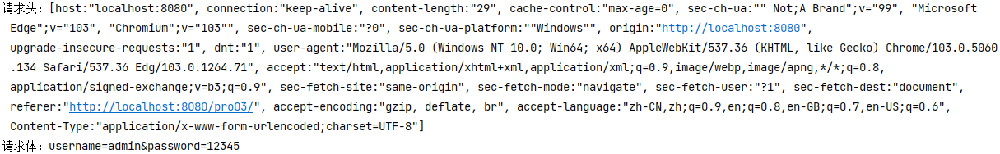

### 6.3 `@ResponseBody`

- 标识控制器方法。

#### 6.3.1 使用原生`servletAPI`的`HttpServletResponse`响应数据

```html
<a th:href="@{/testResponse}">通过servletAPI的response对象响应浏览器数据</a>
```

```java
@RequestMapping("/testResponse")
public void testResponse(HttpServletResponse response) throws IOException {
    response.getWriter().print("hello,response");
}
```

#### 6.3.2 使用`@ResponseBody`返回文本信息

```html
<a th:href="@{/testResponse}">通过servletAPI的response对象响应浏览器数据</a>
```

```java
@RequestMapping(value = "/testResponseBody", produces = "text/html;charset=UTF-8")
@ResponseBody
public String testResponseBody(){
    return "成功";
}
```

- 这里返回值不再是视图名称，而是响应体。

#### 6.3.3 使用`@ResponseBody`返回实体对象（springmvc 处理 json）

> 浏览器无法直接解析 java 语言的实体对象，可以通过转换为 json 格式的字符串进行输出。

```xml
<dependency>
    <groupId>com.fasterxml.jackson.core</groupId>
    <artifactId>jackson-databind</artifactId>
    <version>2.12.1</version>
</dependency>
```

```html
<a th:href="@{/testResponseUser}">通过@ResponseBody响应浏览器User对象</a>
```

```java
@RequestMapping(value = "/testResponseUser", produces = "text/html;charset=UTF-8")
@ResponseBody
public User testResponseUser(){
    return new User(1001, "admin", "123456", 23, "男");
}
```

- 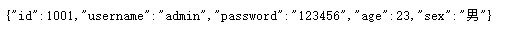
- `springmvc`处理`json`的必要条件：
  - `pom.xml`添加了依赖
  - `srpingMVC.xml`开启了注解驱动
    - `<mvc:annotation-driven />`
  - 处理器方法使用`@ResponseBody`注解
  - 处理器方法返回值类型为实体类，返回值为实体类对象

#### 6.3.4 使用`@ResponseBody`与 springmvc 处理 ajax

```html
<div id="app">
  <a @click="testAxios" th:href="@{/testAxios}">SpringMVC处理ajax</a>
</div>
<script type="text/javascript" th:src="@{/static/js/vue.js}"></script>
<script type="text/javascript" th:src="@{/static/js/axios.min.js}"></script>
<script type="text/javascript">
  new Vue({
    el: "#app",
    methods: {
      testAxios: function (event) {
        axios({
          method: "post",
          url: event.target.href,
          params: {
            username: "admin",
            password: "123456",
          },
        }).then(function (response) {
          alert(response.data);
        });
        event.preventDefault();
      },
    },
  });
</script>
```

```java
@RequestMapping("/testAxios")
@ResponseBody
public String testAxios(String username, String password){
    System.out.println(username+","+password);
    return "hello,axios";
}
```

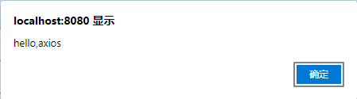

### 6.4 `ResponseEntity`

#### 6.4.1 作用

- 标识控制器方法的返回值类型。
- `ResponseEntity`用于控制器方法的返回值类型，该控制器方法的返回值就是响应到浏览器的响应报文

#### 6.4.2 应用：文件下载

```html
<a th:href="@{testDown}">下载1.jpg</a>
```

```java
package iceriver.springmvc.controller;

import org.springframework.http.HttpHeaders;
import org.springframework.http.HttpStatus;
import org.springframework.http.ResponseEntity;
import org.springframework.stereotype.Controller;
import org.springframework.util.MultiValueMap;
import org.springframework.web.bind.annotation.RequestMapping;

import javax.servlet.ServletContext;
import javax.servlet.http.HttpSession;
import java.io.FileInputStream;
import java.io.IOException;
import java.io.InputStream;

/**
* @author: INFINITY https://developer.aliyun.com/profile/sagwrxp2ua66w
* @date: 2022/7/28 15:05
*/
@Controller
public class FileUpAndFileDownload {
    @RequestMapping("/testDown")
    public ResponseEntity<byte[]> testResponseEntity(HttpSession session) throws IOException {
        //获取ServletContext对象
        ServletContext servletContext = session.getServletContext();
        //获取服务器中文件的真实路径
        String realPath = servletContext.getRealPath("/static/img/1.jpg");
        //创建输入流
        InputStream is = new FileInputStream(realPath);
        //创建字节数组
        byte[] bytes = new byte[is.available()];
        //将流读到字节数组中
        is.read(bytes);
        //创建HttpHeaders对象设置响应头信息
        MultiValueMap<String, String> headers = new HttpHeaders();
        //设置要下载方式以及下载文件的名字
        headers.add("Content-Disposition", "attachment;filename=1.jpg");
        //设置响应状态码
        HttpStatus statusCode = HttpStatus.OK;
        //创建ResponseEntity对象
        ResponseEntity<byte[]> responseEntity = new ResponseEntity<>(bytes, headers, statusCode);
        //关闭输入流
        is.close();
        return responseEntity;
    }
}
```

#### 6.4.3 【补充】文件上传

1. `pom.xml`文件中，添加依赖：

```xml
<!-- https://mvnrepository.com/artifact/commons-fileupload/commons-fileupload -->
<dependency>
    <groupId>commons-fileupload</groupId>
    <artifactId>commons-fileupload</artifactId>
    <version>1.3.1</version>
</dependency>
```

2. `springMVC.xml`文件中添加配置——文件上传解析器：

```xml
<!--必须通过文件解析器的解析才能将文件转换为MultipartFile对象-->
<bean id="multipartResolver" class="org.springframework.web.multipart.commons.CommonsMultipartResolver"/>
```

3. 实现上传：

```html
<form th:action="@{/testUp}" method="post" enctype="multipart/form-data">
  头像：<input type="file" name="photo" />
  <input type="submit" value="上传" />
</form>
```

```java
@RequestMapping("/testUp")
public String testUp(MultipartFile photo, HttpSession session) throws IOException {
    //获取上传的文件的文件名
    String fileName = photo.getOriginalFilename();
    //通过ServletContext获取服务器中photo目录的路径
    ServletContext servletContext = session.getServletContext();
    String photoPath = servletContext.getRealPath("photo");
    File file = new File(photoPath);
    //判断photoPath所对应路径是否存在
    if(!file.exists()){
        //若不存在，则创建目录
        file.mkdir();
    }
    String finalPath = photoPath + File.separator + fileName;
    //上传文件
    photo.transferTo(new File(finalPath));
    return "success";
}
```

4. 解决同名文件上传后“文件内容”发生覆盖的情况：
   - 使用`UUID`

```java
@RequestMapping("/testUp")
public String testUp(MultipartFile photo, HttpSession session) throws IOException {
    //获取上传的文件的文件名
    String fileName = photo.getOriginalFilename();
    //获取上传的文件的后缀名
    String suffixName = fileName.substring(fileName.lastIndexOf("."));
    //将UUID作为文件名
    String uuid = UUID.randomUUID().toString().replaceAll("-","");
    //将uuid和后缀名拼接后的结果作为最终的文件名
    fileName = uuid + suffixName;
    //通过ServletContext获取服务器中photo目录的路径
    ServletContext servletContext = session.getServletContext();
    String photoPath = servletContext.getRealPath("photo");
    File file = new File(photoPath);
    //判断photoPath所对应路径是否存在
    if(!file.exists()){
        //若不存在，则创建目录
        file.mkdir();
    }
    String finalPath = photoPath + File.separator + fileName;
    //上传文件
    photo.transferTo(new File(finalPath));
    return "success";
}
```

### 6.5 `@RestController`注解

- `@RestController`注解是`springMVC`提供的一个复合注解，标识在控制器的**类**上，就相当于为类添加了`@Controller`注解，并且为其中的每个方法添加了`@ResponseBody`注解。

## 7. 拦截器（Interceptor）

### 7.1 拦截器的介绍

1. 过滤器作用于请求发送到 dispatcherservlet 之前
2. 拦截器作用于请求由 dispatcherservlet 发送到其他 controllersevlet
3. 拦截器共有 3 个抽象方法【默认方法】：
   - `preHandle()`：控制器方法执行之前执行，其`boolean`类型的返回值表示是否拦截或放行，返回`true`为放行，即调用控制器方法；返回`false`表示拦截，即不调用控制器方法
   - `postHandle()`：控制器方法执行之后执行
   - `afterComplation()`：处理完视图和模型数据，渲染视图完毕之后执行

### 7.2 创建及配置拦截器

1. 注册拦截器：在`springMVC.xml`中配置拦截器：
	- ~~拦截所有请求：~~
		- ~~方式一：~~

```xml
<mvc:interceptor>
  <bean class="com.atguigu.interceptor.FirstInterceptor"></bean>
  <ref bean="firstInterceptor"></ref>
</mvc:interceptor>
```

- ~~方式二（外部bean方式）：~~

```xml
<bean class="com.atguigu.interceptor.FirstInterceptor"></bean>
<mvc:interceptor>
    <ref bean="firstInterceptor"></ref>
</mvc:interceptor>
```

  - ~~方式三（注解方式）：该方式需要对拦截器类~~`~~FirstInterceptor.java~~`~~使用~~`~~@Component~~`~~注解，将拦截器交给spring作为bean管理~~

```xml

<mvc:interceptor>
    <ref bean="firstInterceptor"></ref>
</mvc:interceptor>
```

- ~~拦截/放行指定请求：~~

```xml
<mvc:interceptors>
  <mvc:interceptor>
      <!--处理的所有的请求进行拦截 -->
      <mvc:mapping path="/**"/>
      <mvc:exclude-mapping path="/testRequestEntity"/>
      <ref bean="firstInterceptor"></ref>
      <bean class="com.atguigu.interceptor.FirstInterceptor"></bean>
  </mvc:interceptor>
<mvc:interceptors>
<!--
	1. ref或bean标签设置拦截器，ref为外部bean方式
  2. mvc:mapping设置需要拦截的请求（请求经过拦截器，拦截器中的方法会被执行），路径为ant风格
  3. mvc:exclude-mapping设置需要放行的请求（请求不会经过拦截器，拦截器中的方法不会被执行）
-->
```

2. 使用拦截器：编写`Interceptor`拦截器类，继承于`HandlerInterceptor`，使用`ctr+o`进行 preHandle()方法重写，令两个方法可以不用。
   - 将拦截器交给 spring 管理：
     - 方式一：使用`@Component`注解，将拦截器交给 spring 作为 spring 管理
     - 方式二：在 springMVC.xml 中使用<bean/>标签把拦截器交给 spring 管理
   - 缺少设置白名单、设置管理配置类的内容，还可以再丰富

### 7.3 多个拦截器执行顺序

1. 若每个拦截器的`preHandle()`都返回`true`
   - `preHandle()`会按照配置的顺序执行，而`postHandle()`和`afterComplation()`会按照配置的反序执行
2. 若某个拦截器的`preHandle()`返回了`false`
   - `preHandle()`返回`false`和它之前的拦截器的`preHandle()`都会执行。
   - `postHandle()`都不执行。
   - 返回`false`的拦截器之前的拦截器的`afterComplation()`会执行

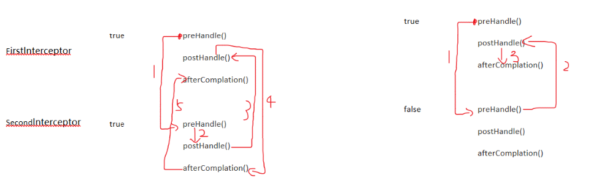

## 8. 异常处理器

### 8.1 基于 xml 的异常处理

1. `SpringMVC`提供了一个处理控制器方法执行过程中所出现的异常的接口：`HandlerExceptionResolver`
2. `HandlerExceptionResolver`接口的实现类有：`DefaultHandlerExceptionResolver`和`SimpleMappingExceptionResolver`
3. `SpringMVC`提供了自定义的异常处理器`SimpleMappingExceptionResolver`
4. 在`springMVC.xml`文件配置异常处理：

```xml
<bean class="org.springframework.web.servlet.handler.SimpleMappingExceptionResolver">
  <property name="exceptionMappings">
    <props>
      <!-- key：表示异常类型
         error：发生异常要跳转到的页面，
         -->
      <prop key="java.lang.ArithmeticException">error</prop>
    </props>
  </property>
  <!--保存异常信息，默认在请求域中，此处保存的异常信息key为ex    -->
  <property name="exceptionAttribute" value="ex"></property>
</bean>
```

### 8.2 基于注解的异常处理

1. 创建配置类，使用`@ControllerAdive`注解标记为异常处理类

```java
@ControllerAdvice//将当前类标识为异常处理的组件
public class ExceptionController {
    @ExceptionHandler(ArithmeticException.class)//设置所标识方法处理的异常，参数为异常类型.class
    //ex表示当前请求处理中出现的异常对象
    public String handleArithmeticException(Exception ex, Model model){
        model.addAttribute("ex", ex);
        return "error";
    }
}
```

## 9. 注解配置 Spring MVC

### 9.1 创建初始化类，代替`web.xml`

1. 在`Servlet3.0`环境中，容器会在类路径中查找实现`javax.servlet.ServletContainerInitializer`接口的类，如果找到的话就用它来配置`Servlet`容器。
2. `Spring`提供了这个接口的实现，名为`SpringServletContainerInitializer`，这个类反过来又会查找实现`WebApplicationInitializer`的类并将配置的任务交给它们来完成。
3. `Spring3.2`引入了一个便利的`WebApplicationInitializer`基础实现，名为`AbstractAnnotationConfigDispatcherServletInitializer`，当我们的类扩展了`AbstractAnnotationConfigDispatcherServletInitializer`并将其部署到`Servlet3.0`容器的时候，容器会自动发现它，并用它来配置`Servlet`上下文。

```java
public class WebInit extends AbstractAnnotationConfigDispatcherServletInitializer {

    /**
     * 指定spring的配置类
     * @return
     */
    @Override
    protected Class<?>[] getRootConfigClasses() {
        return new Class[]{SpringConfig.class};
    }

    /**
     * 指定SpringMVC的配置类
     * @return
     */
    @Override
    protected Class<?>[] getServletConfigClasses() {
        return new Class[]{SpringMVC.class};
    }

    /**
     * 指定DispatcherServlet的映射规则，即url-pattern
     * @return
     */
    @Override
    protected String[] getServletMappings() {
        return new String[]{"/"};
    }

    /**
     * 添加过滤器
     * @return
     */
    @Override
    protected Filter[] getServletFilters() {
        CharacterEncodingFilter encodingFilter = new CharacterEncodingFilter();
        encodingFilter.setEncoding("UTF-8");
        encodingFilter.setForceRequestEncoding(true);
        HiddenHttpMethodFilter hiddenHttpMethodFilter = new HiddenHttpMethodFilter();
        return new Filter[]{encodingFilter, hiddenHttpMethodFilter};
    }
}
```

### 9.3 创建 springmvc 配置类，代替 springmvc 配置文件

```java
@Configuration
@ComponentScan("com.atguigu.mvc.controller")//1. 扫描组件
@EnableWebMvc//5. 开启MVC注解驱动
public class SpringMVC implements WebMvcConfigurer {

    //4. 使用默认的servlet处理静态资源
    @Override
    public void configureDefaultServletHandling(DefaultServletHandlerConfigurer configurer) {
        configurer.enable();
    }

    //6. 配置文件上传解析器
    @Bean
    public MultipartResolver multipartResolver(){
        return new CommonsMultipartResolver();
    }

    //8. 配置拦截器
    @Override
    public void addInterceptors(InterceptorRegistry registry) {
        FirstInterceptor firstInterceptor = new FirstInterceptor();
        registry.addInterceptor(firstInterceptor).addPathPatterns("/**");
    }

    //3. 配置视图控制器
    @Override
    public void addViewControllers(ViewControllerRegistry registry) {
        registry.addViewController("/success").setViewName("success");
    }

    //7. 配置异常映射
    @Override
    public void configureHandlerExceptionResolvers(List<HandlerExceptionResolver> resolvers) {
        SimpleMappingExceptionResolver exceptionResolver = new SimpleMappingExceptionResolver();
        Properties prop = new Properties();
        prop.setProperty("java.lang.ArithmeticException", "error");
        //设置异常映射
        exceptionResolver.setExceptionMappings(prop);
        //设置共享异常信息的键
        exceptionResolver.setExceptionAttribute("ex");
        resolvers.add(exceptionResolver);
    }

    //2. 视图解析器
    //配置生成模板解析器
    @Bean
    public ITemplateResolver templateResolver() {
        WebApplicationContext webApplicationContext = ContextLoader.getCurrentWebApplicationContext();
        ServletContextTemplateResolver templateResolver = new ServletContextTemplateResolver(webApplicationContext.getServletContext());
        templateResolver.setPrefix("/WEB-INF/templates/");
        templateResolver.setSuffix(".html");
        templateResolver.setCharacterEncoding("UTF-8");
        templateResolver.setTemplateMode(TemplateMode.HTML);
        return templateResolver;
    }

    //生成模板引擎并为模板引擎注入模板解析器
    @Bean
    public SpringTemplateEngine templateEngine(ITemplateResolver templateResolver) {
        SpringTemplateEngine templateEngine = new SpringTemplateEngine();
        templateEngine.setTemplateResolver(templateResolver);
        return templateEngine;
    }

    //生成视图解析器并未解析器注入模板引擎
    @Bean
    public ViewResolver viewResolver(SpringTemplateEngine templateEngine) {
        ThymeleafViewResolver viewResolver = new ThymeleafViewResolver();
        viewResolver.setCharacterEncoding("UTF-8");
        viewResolver.setTemplateEngine(templateEngine);
        return viewResolver;
    }
}
```

## 10. SpringMVC 执行流程

### 10.1 SpringMVC 常用组件

1. `DispatcherServlet`：前端控制器，不需要工程师开发，由框架提供
   - 作用：统一处理请求和响应，整个流程控制的中心，由它调用其它组件处理用户的请求
2. `HandlerMapping`：处理器映射器，不需要工程师开发，由框架提供
   - 作用：根据请求的`url`、`method`等信息查找`Handler`，即控制器方法
3. `HandlerAdapter`：处理器适配器，不需要工程师开发，由框架提供
   - 作用：通过`HandlerAdapter`对处理器（控制器方法）进行执行
4. `Handler`：处理器，需要工程师开发【即`Controller`】
   - 作用：在`DispatcherServlet`的控制下`Handler`对具体的用户请求进行处理
5. `ViewResolver`：视图解析器，不需要工程师开发，由框架提供
   - 作用：进行视图解析，得到相应的视图，例如：`ThymeleafView`、`InternalResourceView`、`RedirectView`
6. `View`：视图
   - 作用：将模型数据通过页面展示给用户

### 10.2 DispatcherServlet 初始化过程

`DispatcherServlet `本质上是一个 `Servlet`，所以天然的遵循 `Servlet `的生命周期，宏观上是 `Servlet`生命周期来进行调度。即，创建 web 服务时，从 Servlet 类的 init()方法开始执行。
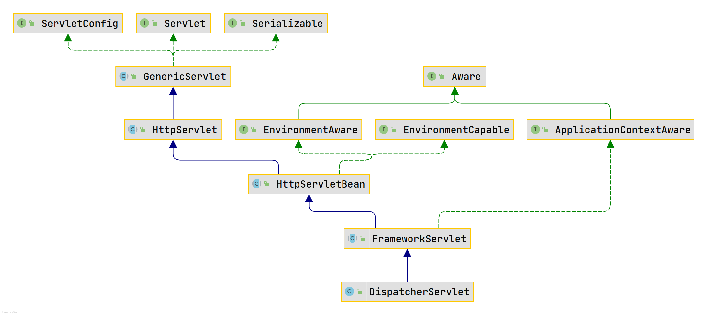

从上图可见，`Servlet`类中`init()`执行到最后是在`FrameworkServlet`类中调用了`initWebApplicationContext()`方法，而在该方法中，调用了`createWebApplicationContext()`方法

- `createWebApplicationContext()`方法使用反射创建了 IOC 容器。
- `initWebApplicationContext()`方法将 IOC 容器在应用域中共享。

同时，在`FrameworkServlet`类的初始化`initWebApplicationContext()`方法中，调用了`onRefresh(wac)`方法，此方法在`DispatcherServlet`中进行了重写，调用了`initStrategies(context)`方法，初始化策略，即初始化`DispatcherServlet`的各个组件：

```java
protected void initStrategies(ApplicationContext context) {
    initMultipartResolver(context);
    initLocaleResolver(context);
    initThemeResolver(context);
    initHandlerMappings(context);
    initHandlerAdapters(context);
    initHandlerExceptionResolvers(context);
    initRequestToViewNameTranslator(context);
    initViewResolvers(context);
    initFlashMapManager(context);
}
```

### 10.3 DispatcherServlet 调用组件处理请求过程

1. web 容器在处理前端请求时，请求由`Servlet`类中的`service()`方法从上到下处理，而`Servlet`中的`service()`被`HttpServlet`类重写了。
2. 后`FrameworkServlet`重写了`HttpServlet`中的`service()`和`doXxx()`（`doGet()`等），这些方法中调用了`FrameworkServlet`类中的`processRequest(request, response)`。
3. `processRequest(request, response)`调用了`FrameworkServlet`中的`doService()`，而`doService()`在`FrameworkServlet`是一个抽象方法，在`DispatcherServlet`类中进行了重写。
4. `DispatcherServlet`中的`doService()`调用了`DispatcherServlet`中的`doDispatch()`，即该方法处理了最后的请求。请求处理后的视图处理等后续处理交给`processDispatchResult()`完成。

```java
protected void doDispatch(HttpServletRequest request, HttpServletResponse response) throws Exception {
    HttpServletRequest processedRequest = request;
    HandlerExecutionChain mappedHandler = null;
    boolean multipartRequestParsed = false;

    WebAsyncManager asyncManager = WebAsyncUtils.getAsyncManager(request);

    try {
        ModelAndView mv = null;
        Exception dispatchException = null;

        try {
            processedRequest = checkMultipart(request);
            multipartRequestParsed = (processedRequest != request);

            // Determine handler for the current request.
            /*
            mappedHandler：调用链
            包含handler、interceptorList、interceptorIndex
            handler：浏览器发送的请求所匹配的控制器方法
            interceptorList：处理控制器方法的所有拦截器集合
            interceptorIndex：拦截器索引，控制拦截器afterCompletion()的执行
            */
            mappedHandler = getHandler(processedRequest);
            if (mappedHandler == null) {
                noHandlerFound(processedRequest, response);
                return;
            }

            // Determine handler adapter for the current request.
            // 通过控制器方法创建相应的处理器适配器，调用所对应的控制器方法
            HandlerAdapter ha = getHandlerAdapter(mappedHandler.getHandler());

            // Process last-modified header, if supported by the handler.
            String method = request.getMethod();
            boolean isGet = "GET".equals(method);
            if (isGet || "HEAD".equals(method)) {
                long lastModified = ha.getLastModified(request, mappedHandler.getHandler());
                if (new ServletWebRequest(request, response).checkNotModified(lastModified) && isGet) {
                    return;
                }
            }

            // 调用拦截器的preHandle()
            if (!mappedHandler.applyPreHandle(processedRequest, response)) {
                return;
            }

            // Actually invoke the handler.
            // 由处理器适配器调用具体的控制器方法，最终获得ModelAndView对象
            mv = ha.handle(processedRequest, response, mappedHandler.getHandler());

            if (asyncManager.isConcurrentHandlingStarted()) {
                return;
            }

            applyDefaultViewName(processedRequest, mv);
            // 调用拦截器的postHandle()
            mappedHandler.applyPostHandle(processedRequest, response, mv);
        }
        catch (Exception ex) {
            dispatchException = ex;
        }
        catch (Throwable err) {
            // As of 4.3, we're processing Errors thrown from handler methods as well,
            // making them available for @ExceptionHandler methods and other scenarios.
            dispatchException = new NestedServletException("Handler dispatch failed", err);
        }
        // 后续处理：处理模型数据和渲染视图
        processDispatchResult(processedRequest, response, mappedHandler, mv, dispatchException);
    }
    catch (Exception ex) {
        triggerAfterCompletion(processedRequest, response, mappedHandler, ex);
    }
    catch (Throwable err) {
        triggerAfterCompletion(processedRequest, response, mappedHandler,
                               new NestedServletException("Handler processing failed", err));
    }
    finally {
        if (asyncManager.isConcurrentHandlingStarted()) {
            // Instead of postHandle and afterCompletion
            if (mappedHandler != null) {
                mappedHandler.applyAfterConcurrentHandlingStarted(processedRequest, response);
            }
        }
        else {
            // Clean up any resources used by a multipart request.
            if (multipartRequestParsed) {
                cleanupMultipart(processedRequest);
            }
        }
    }
}
```

```java
private void processDispatchResult(HttpServletRequest request, HttpServletResponse response,
                                   @Nullable HandlerExecutionChain mappedHandler, @Nullable ModelAndView mv,
                                   @Nullable Exception exception) throws Exception {

    boolean errorView = false;

    if (exception != null) {
        if (exception instanceof ModelAndViewDefiningException) {
            logger.debug("ModelAndViewDefiningException encountered", exception);
            mv = ((ModelAndViewDefiningException) exception).getModelAndView();
        }
        else {
            Object handler = (mappedHandler != null ? mappedHandler.getHandler() : null);
            mv = processHandlerException(request, response, handler, exception);
            errorView = (mv != null);
        }
    }

    // Did the handler return a view to render?
    if (mv != null && !mv.wasCleared()) {
        // 处理模型数据和渲染视图
        render(mv, request, response);
        if (errorView) {
            WebUtils.clearErrorRequestAttributes(request);
        }
    }
    else {
        if (logger.isTraceEnabled()) {
            logger.trace("No view rendering, null ModelAndView returned.");
        }
    }

    if (WebAsyncUtils.getAsyncManager(request).isConcurrentHandlingStarted()) {
        // Concurrent handling started during a forward
        return;
    }

    if (mappedHandler != null) {
        // Exception (if any) is already handled..
        // 调用拦截器的afterCompletion()
        mappedHandler.triggerAfterCompletion(request, response, null);
    }
}
```

### 10.4 SpringMVC 的执行流程

1.  用户向服务器发送请求，经过过滤器后请求被`SpringMVC`的前端控制器 `DispatcherServlet`捕获。
2.  `DispatcherServlet`对请求`URL`进行解析，得到请求资源标识符（`URI`），通过`handlermapping`判断请求`URI`对应的映射：

- 不存在
  - 再判断是否配置了`mvc:default-servlet-handler`——默认的前端控制器，处理静态资源
    - 如果没配置，则控制台报映射查找不到，客户端展示 404 错误
      - 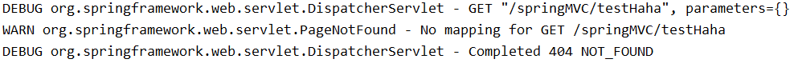
      - 
    - 如果有配置，则访问目标资源（一般为静态资源，如：JS,CSS,HTML），找不到客户端也会展示 404 错误
      - 
      - 
- 存在：执行下面流程

3.  根据该`URI`，调用`HandlerMapping`获得该`Handler`配置的所有相关的对象（包括`Handler`对象以及`Handler`对象对应的拦截器），最后以`HandlerExecutionChain`执行链对象的形式返回。
4.  `DispatcherServlet `根据获得的`Handler`，选择一个合适的`HandlerAdapter`。
5.  如果成功获得`HandlerAdapter`，此时将开始执行拦截器的`preHandler(…)`方法【正向】
6.  提取`Request`中的模型数据，填充`Handler`（控制器方法）入参，开始执行`Handler`（`Controller`)方法，处理请求。在填充`Handler`的入参过程中，根据你的配置，`Spring`将帮你做一些额外的工作：

- `HttpMessageConveter`： 将请求消息（如`Json`、`xml`等数据）转换成一个对象，将对象转换为指定的响应信息
- 数据转换：对请求消息进行数据转换。如`String`转换成`Integer`、`Double`等
- 数据格式化：对请求消息进行数据格式化。 如将字符串转换成格式化数字或格式化日期等
- 数据验证： 验证数据的有效性（长度、格式等），验证结果存储到 BindingResult 或 Error 中

7.  `Handler`执行完成后，向`DispatcherServlet `返回一个`ModelAndView`对象。
8.  此时将开始执行拦截器的`postHandle(...)`方法【逆向】。
9.  根据返回的`ModelAndView`（此时会判断是否存在异常：如果存在异常，则执行`HandlerExceptionResolver`进行异常处理）选择一个适合的`ViewResolver`进行视图解析，根据`Model`和`View`，来渲染视图。
10. 渲染视图完毕执行拦截器的`afterCompletion(…)`方法【逆向】。
11. 将渲染结果返回给客户端。

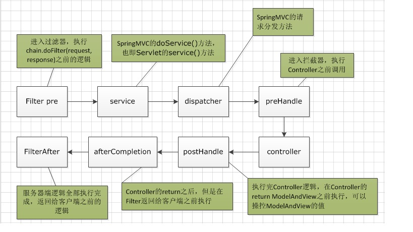
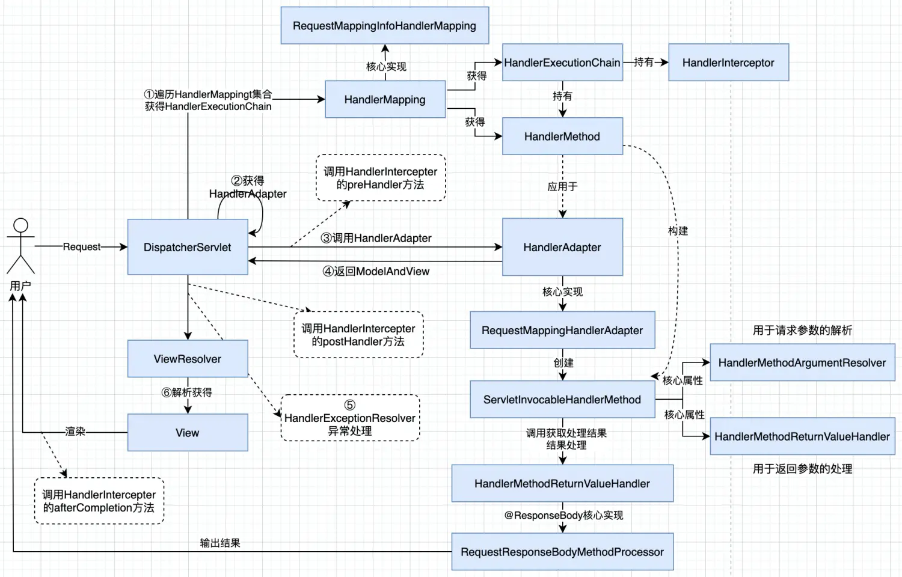
