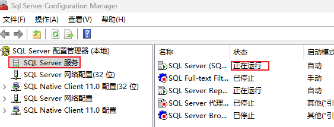
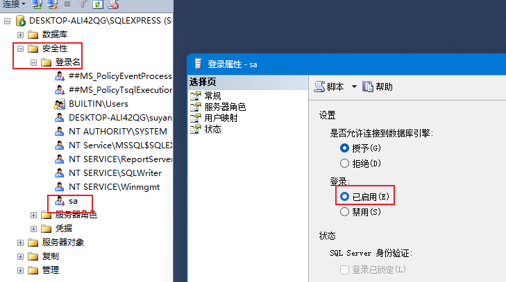
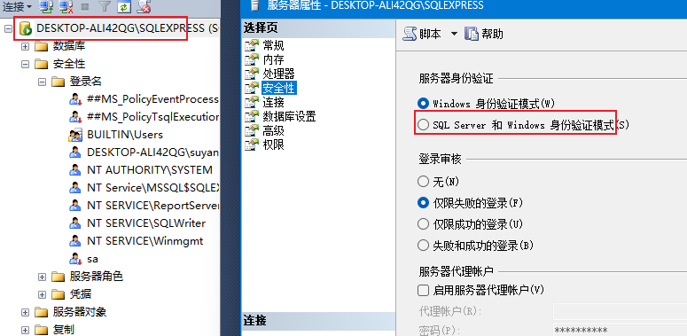

## 1. 环境搭建

### 1.1 启动sqlserver服务

启动方式有三种：

1. sql server配置管理器中启动

2. windows服务中启动
3. 终端`net start mssqlserver`启动

### 1.2 sa登录sqlserver

windows用户认证方式只能登录本地。

sa用户的密码就是安装sqlserver时候的密码。

但是sa用户默认未启用，登陆会报错：18456

需要使用windows登录dbms，然后启用sqlserver：

然后重启sqlserver。

## 2. 常见问题

1. 创建表时不带dbo前缀，但自动会带dbo前缀，这样所有用户可以看到，使用表的时候也不用带dbo前缀。
2. 

## 1. 初始SQL Server

### 1.1 组成

- 数据库引擎
- 分析服务
- 集成服务
- 报表服务

### 1.2 SSMS

SSMS是SQL Server Management Studio的简称，是SQL Server的服务管理工具，用于管理SQL Server数据库。

