## 常见UML图

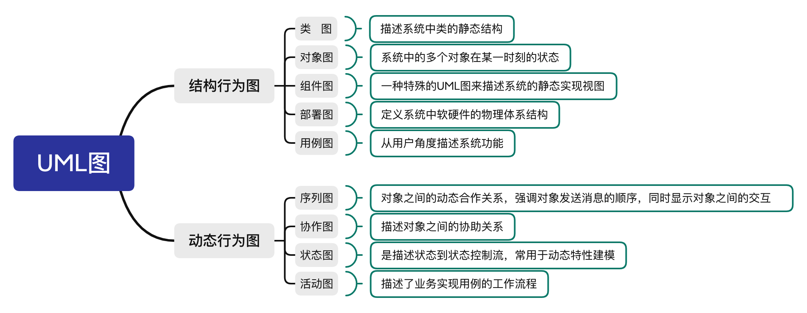

### 结构行为图

#### 类图

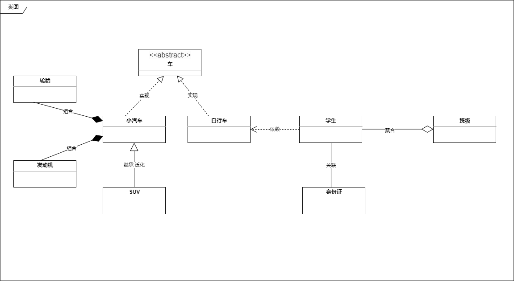

#### 对象图

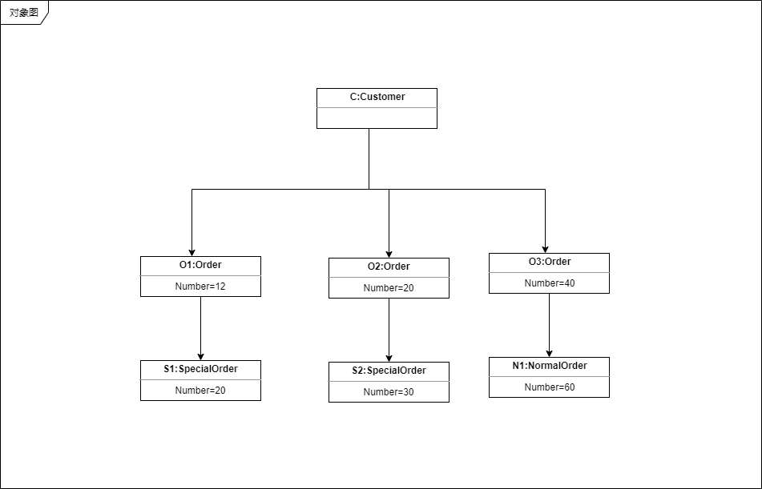

#### 组件图

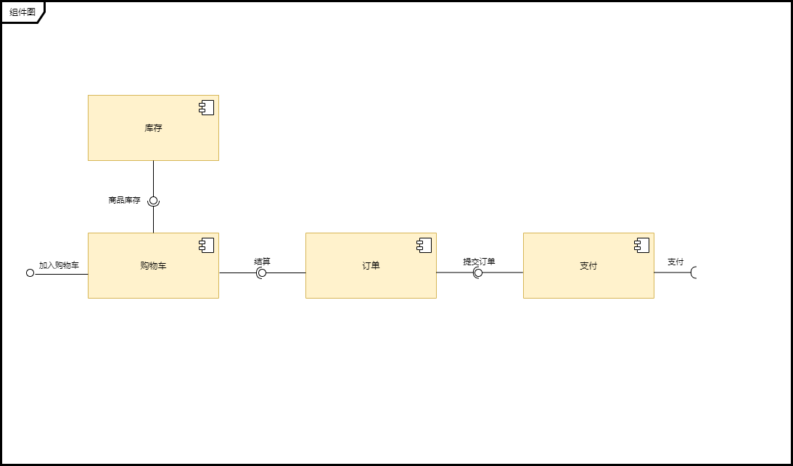

#### 部署图

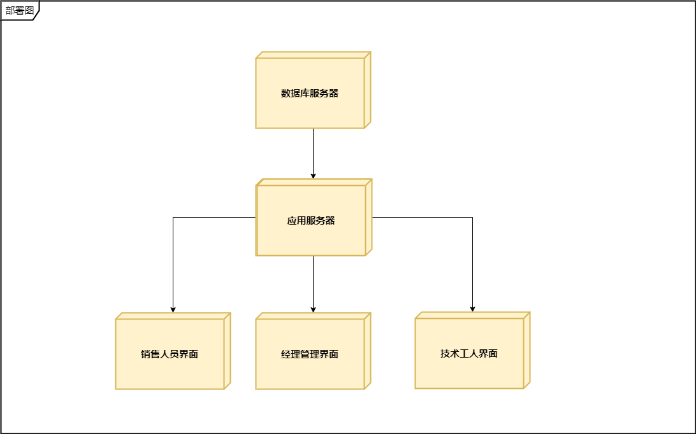

#### 用例图

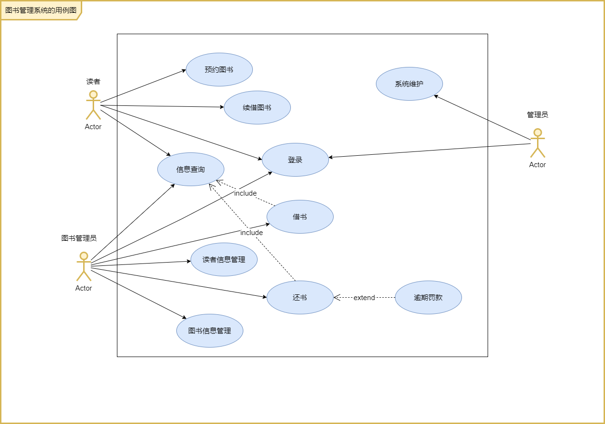

### 动态行为图

#### 序列图

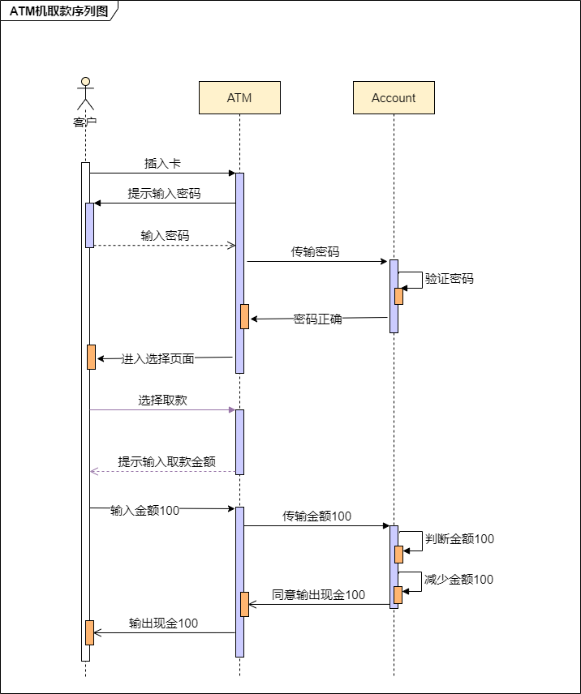

#### 协作图

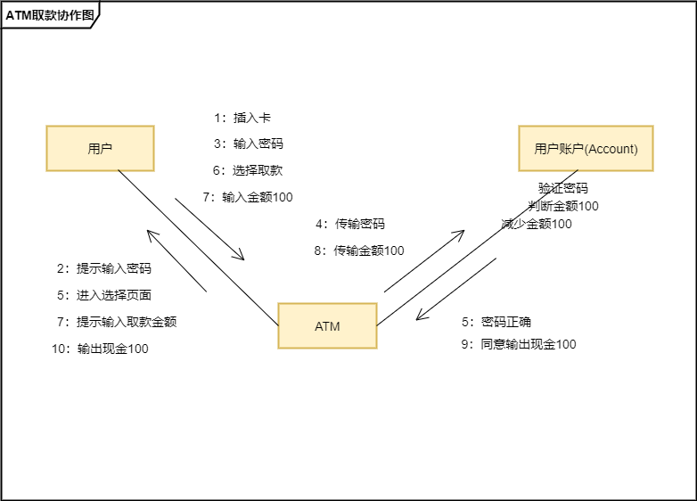

#### 状态图

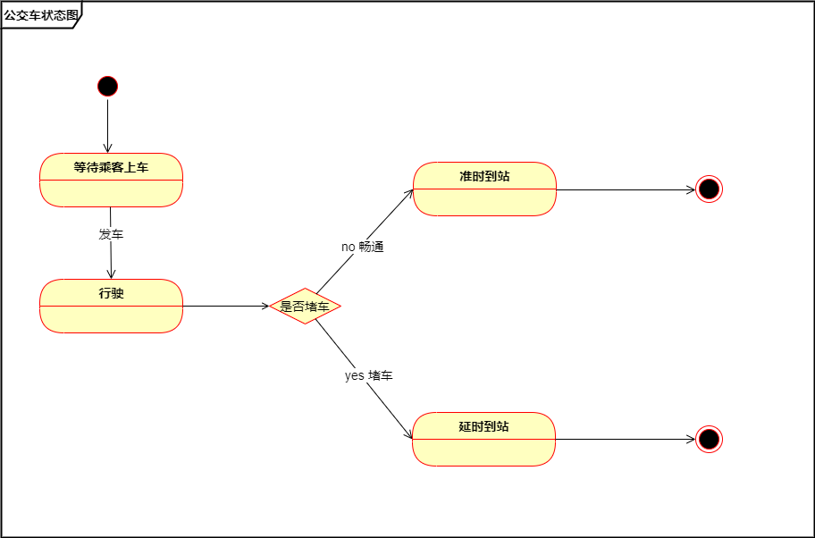

#### 活动图

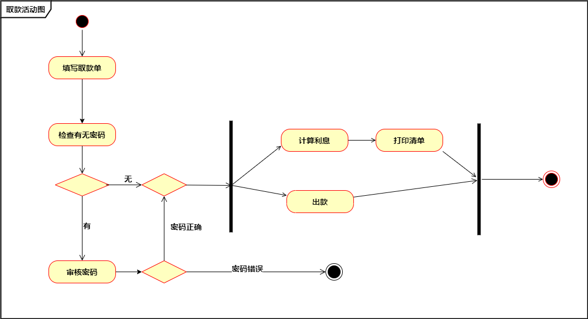

## UML图关系

- 泛化（Generalization）：继承的关系，实线带三角形箭头，指向父类。
- 实现（Realization）：实现的关系，虚线带三角形箭头，指向接口。
- 关联（Association）：拥有的关系，实线带普通箭头，指向被拥有者。
- 聚合（Aggregation）：整体与部分的关系。实线带空心菱形，指向整体。
- 组合（Composition）：整体与部分的关系，但不能离开整体而单独存在。实线实心菱形，指向整体。
- 依赖（Dependency）：使用的关系，即一个类的实线需要另一个类的协助。虚线普通箭头，指向被使用者。

泛化= 实现> 组合> 聚合> 关联> 依赖

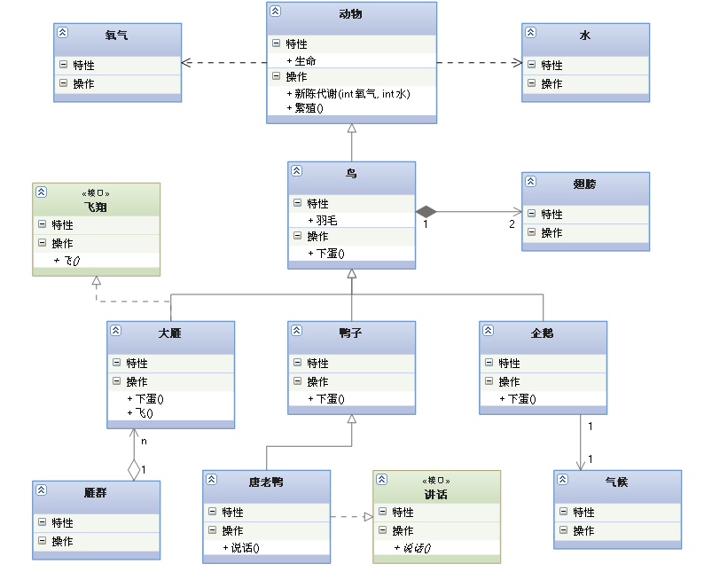