## Web Services和Java Webservice简述

各种编程语言下都有 webservice 技术，比如 php、c#、Java 等；由于 webservice 定义交互的格式，所以不同编程语言之间可以实现相互调用，数据交换和通信。

Java 中的 webservice，即 Java API for XML-Based Webservices，简称JAX-WS 规范。

JAX-WS 是 sun 公司随 Java 5 发布的一项 webservice 规范，在此之前是JAX-RPC，JAX-RPC 不是很完善，所以在 Java 5 发布后，随即发布了 JAX-RPC2.0，为了和之前的规范进行区分，又将其改名为JAX-WS 2.0。

Java 5 对应 JAX-WS 2.0 版本；  

Java 6 对应 JAX-WS 2.1 版本；  

Java 7 对应 JAX-WS 2.2 版本；  

## JAVA的三种WebService 规范

1、JAX-WS：

早期的基于SOAP 的JAVA 的Web 服务规范JAX-RPC（Java API For XML-Remote Procedure Call）目前已经被JAX-WS 规范取代，JAX-WS 是JAX-RPC 的演进版本，但JAX-WS 并不完全向后兼容JAX-RPC，二者最大的区别就是RPC/encoded 样式的WSDL，JAX-WS 已经不提供这种支持。JAX-RPC 的API 从JAVA EE5 开始已经移除。

2、JAXM&SAAJ：

JAXM（JAVA API For XML Message）主要定义了包含了发送和接收消息所需的API，相当于Web 服务的服务器端，其API 位于`javax.messaging.*`包，它是JAVA EE 的可选包，因此你需要单独下载。

SAAJ（SOAP With Attachment API For Java，JSR 67）是与JAXM 搭配使用的API，为构建SOAP 包和解析SOAP 包提供了重要的支持，支持附件传输，它在服务器端、客户端都需要使用。

JAXM&SAAJ 与JAX-WS 都是基于SOAP 的Web 服务，相比之下JAXM&SAAJ 暴漏了SOAP更多的底层细节，编码比较麻烦，而JAX-WS 更加抽象，隐藏了更多的细节，更加面向对象，实现起来基本上不需要关心SOAP 的任何细节。

3、JAX-RS：

JAX-RS 是JAVA 针对REST(Representation State Transfer)风格制定的一套Web 服务规范，由于推出的较晚，该规范（JSR 311）并未随JDK1.6 一起发行，需要到JCP 上单独下载JAX-RS 规范的接口。

**三、几种Web Service框架的基本概念介绍**

1、JWS

JWS是Java语言对WebService服务的一种实现，用来开发和发布服务。而从服务本身的角度来看JWS服务是没有语言界限的。但是Java语言为Java开发者提供便捷发布和调用WebService服务的一种途径。

2、Axis2

Axis2是Apache下的一个重量级WebService框架，准确说它是一个Web Services / SOAP / WSDL 的引擎，是WebService框架的集大成者，它能不但能制作和发布WebService，而且可以生成Java和其他语言版WebService客户端和服务端代码。这是它的优势所在。但是，这也不可避免的导致了Axis2的复杂性，使用过的开发者都知道，它所依赖的包数量和大小都是很惊人的，打包部署发布都比较麻烦，不能很好的与现有应用整合为一体。但是如果你要开发Java之外别的语言客户端，Axis2提供的丰富工具将是你不二的选择。

Axis2的开发方式类似一个小型的应用服务器，Axis2的开发包要以WAR的形式部署到Servlet容器中，比如Tomcat，通过这些容器可以对工作中的Web Service进行很好的监控和管理。

Axis2的Web administrion模块可以让我们动态的配置Axis2.一个新的服务可以上载，激活，使之失效，修改web服务的参数。管理UI也可以管理一个或者多个处于运行状态的服务。这种界面化管理方式的一个弊端是所有在运行时修改的参数没有办法保存，因为在重启动之后，你所做的修改就会全部失效。

Axis2允许自己作为独立的应用来发布Web Service，并提供了大量的功能和一个很好的模型，这个模型可以通过它本身的架构（modular architecture）不断添加新的功能。

3、XFire

XFire是一个高性能的WebService框架，在Java6之前，它的知名度甚至超过了Apache的Axis2，XFire的优点是开发方便，与现有的Web整合很好，可以融为一体，并且开发也很方便。但是对Java之外的语言，没有提供相关的代码工具。XFire后来被Apache收购了，原因是它太优秀了，收购后，随着Java6 JWS的兴起，开源的WebService引擎已经不再被看好，渐渐的都败落了。

4、CXF

Apache CXF = Celtix + XFire，Apache CXF 的前身叫 Apache CeltiXfire。CXF 继承了 Celtix 和 XFire 两大开源项目的精华，提供了对 JAX-WS 全面的支持，并且提供了多种 Binding 、DataBinding、Transport 以及各种 Format 的支持，并且可以根据实际项目的需要，采用代码优先（Code First）或者 WSDL 优先（WSDL First）来轻松地实现 Web Services 的发布和使用。Apache CXF已经是一个正式的Apache顶级项目。CXF支持多种协议，如：SOAP、XML/HTTP、RESTful HTTP 、 CORBA ，并且可以在多种传输协议上运行，比如：HTTP、JMS 、 JBI。CXF可以与Spring进行无缝集成。CXF 框架是一种基于 Servlet 技术的 SOA 应用开发框架，要正常运行基于 CXF 应用框架开发的企业应用，除了 CXF 框架本身之外，还需要 JDK 和 Servlet 容器的支持。CXF不但是一个优秀的Web Services / SOAP / WSDL 引擎，也是一个不错的ESB总线，为SOA的实施提供了一种选择方案，当然他不是最好的，它仅仅实现了SOA架构的一部分。CXF更注重开发人员的工效（ergonomics）和嵌入能力（embeddability）。大多数都可以通过配置API来完成，替代了比较繁琐的XML配置文件， Spring的集成性经常的被提及，CXF支持Spring2.0和CXF's API和Spring的配置文件可以非常好的对应。

注：对于Axis2与CXF之间的关系，一个是Axis2出现的时间较早，而CXF的追赶速度快。

以上几种框架的总结：

a：目前开发Web Service的几个框架，分别为Axis，axis2，Xfire，CXF以及JWS(也就是前面所述的JAX-WS，这是Java6发布所提供的对Web Service服务的一种实现。)

b：Axis与XFire已随着技术不断的更替慢慢落幕，都已不再更新。

c：以axis2与cxf所最为常用，目前也只有axis2和cxf官方有更新。

d：从使用场景来说，如果你需要多语言的支持，你应该选择AXIS2。如果你需要把你的实现侧重JAVA并希望和Spring集成，CXF就是更好的选择。

总结的总结：jws、cxf

## 调用过程

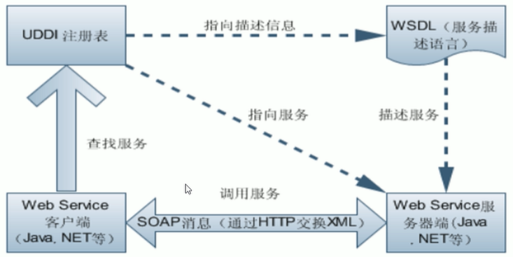

## 实践

### jws

不需要使用额外的jar包。

#### 服务端

创建service接口（也可以不创建，直接创建类）

```java
//@WebService  //可写可不写
public interface UserService {  
  
    public String sayHi (String name);  
  
}
```

创建实现类：

```java  
/**  
 * 标注了该@WebService注解的类的方法就变为webservice方法  
 */  
@WebService  //要发布则必须写
public class UserServiceImpl1 implements UserService {  
  
  
    @Override  
    public String sayHi(String name) {  
        return "hi" + name;  
    }  
}
```

```java
@WebService  
public class UserServiceImpl2 implements UserService {  
    @Override  
    public String sayHi(String name) {  
        return "你好" + name;  
    }  
}
```

创建WebService服务：

```java
public class Server {  
  
    public static void main(String[] args) {  
        //发布webservice  
        String wsAddress = "http://localhost:6868/jaxws_server";//服务器访问地址：http://localhost:6868/jaxws_server?wsdl  
        Endpoint endpoint = Endpoint.publish(wsAddress, new UserServiceImpl1());  
        System.out.println("webservice发布成功：" + endpoint.isPublished());  
    }  
}
```

最终项目结构：

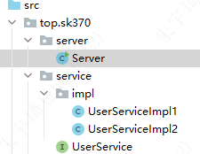

项目说明：

- 创建了`UserService`的两个实现类`UserServiceImpl1`和`UserServiceImpl2`，但`Server`只发布了一个服务`UserServiceImpl1`。
- `UserServiceImpl1`和`UserServiceImpl2`都使用了`@WebService`注解，但`Server`只发布了一个服务`UserServiceImpl1`。
- `@WebService` 会将该注解的所有方法注册为接口方法，所以方法前用不用`@WebMethod`无所谓。

#### 客户端

启动webservice服务端，配置JAVA_HOME环境变量的情况下，选择要保存代码的位置，在CMD中执行：`wsimport -encoding utf8 -keep -p top.sk370.client -Xnocompile http://localhost:6868/jaxws_server?wsdl`。这是因为配置了环境变量就会默认找Java安装位置bin下面的命令。

如果没有配置JAVA_HOME环境变量，执行命令是不起作用的，因为安装jdk是默认会在`C:\ProgramData\Oracle\Java\javapath`下复制命令，而该目录没有`wsimport`命令。需要进入Java安装目录的bin目录下执行。

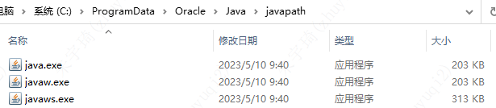

- encoding：可选参数。指定生成代码的编码格式。
- keep：必选参数。保存生成的代码。
- p：可选参数。指定包名。
- Xnocompile：可选参数：表示生成的代码不编译。

生成代码如下：

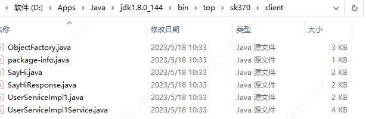

创建客户端调用服务：

```java  
public class Client {  
    public static void main(String[] args) {  
        //1.创建一个webservice的客户端  
        UserServiceImpl1Service userServiceImpl1Service = new UserServiceImpl1Service();  
  
        //2.获取远程服务接口对象  
        UserServiceImpl1 userService = userServiceImpl1Service.getUserServiceImpl1Port();  
  
        //3.直接调用远程服务接口对象的方法  
        String hi= userService.sayHi("张三丰");  
        System.out.println(hi);  
    }  
}
```

执行main方法调用接口服务，会报错：

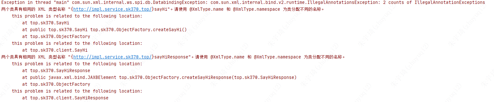

为什么会报错没搞明白。解决方案是修改生成代码中的注解`@xmlType.name`属性值（默认生成的值为该类名的首字母小写，所以只需要改为任意不同即可）：

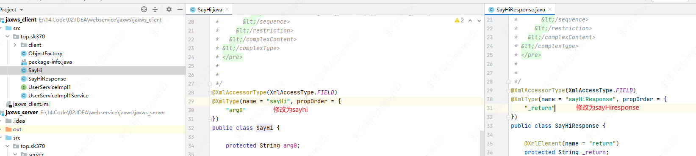

#### Tomcat部署

下载jar包，放在**tomcat**的lib目录下。下载地址：[JAX-WS (javaee.github.io)](https://javaee.github.io/metro-jax-ws/)

需要哪些jar包我也不知道，所有拷贝进去算了。

添加web框架：

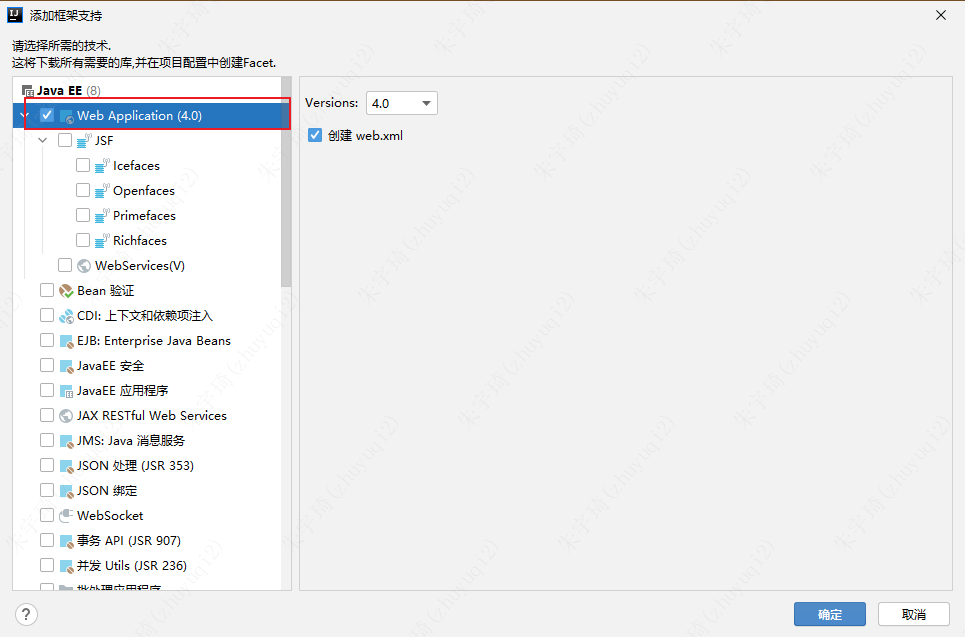

WEB-INF目录下创建`sun-jaxws.xml`（文件名任意）：

```xml
<?xml version="1.0" encoding="UTF-8"?>  
<endpoints xmlns="http://java.sun.com/xml/ns/jax-ws/ri/runtime"  
           version="2.0">  
    <endpoint name="UserService"  
              implementation="top.sk370.service.impl.UserServiceImpl1"  
              url-pattern="/service/sayHi" />  
</endpoints>
```
- `UserService`：接口名
- `top.sk370.service.impl.UserServiceImpl1`：接口实现类全路径。
- `/service/sayHi`：url路径。要与web.xml中的定义对应。

web.xml文件：

```xml
<?xml version="1.0" encoding="UTF-8"?>  
<web-app xmlns="http://xmlns.jcp.org/xml/ns/javaee"  
         xmlns:xsi="http://www.w3.org/2001/XMLSchema-instance"  
         xsi:schemaLocation="http://xmlns.jcp.org/xml/ns/javaee http://xmlns.jcp.org/xml/ns/javaee/web-app_4_0.xsd"  
         version="4.0">  
    <listener>  
        <listener-class>  
            com.sun.xml.ws.transport.http.servlet.WSServletContextListener  
        </listener-class>  
    </listener>  
    <servlet>  
        <servlet-name>SayHiService</servlet-name>  
        <servlet-class>  
            com.sun.xml.ws.transport.http.servlet.WSServlet  
        </servlet-class>  
    </servlet>  
    <servlet-mapping>  
        <servlet-name>SayHiService</servlet-name>  
        <url-pattern>/service/sayHi</url-pattern>  
    </servlet-mapping>  
  
    <welcome-file-list>  
        <welcome-file>index.html</welcome-file>  
        <welcome-file>index.htm</welcome-file>  
        <welcome-file>index.jsp</welcome-file>  
    </welcome-file-list>  
</web-app>
```

- 由于工程没有引入部署webservice的jar包，所以会报错（不影响部署）。将上述部署webservice的jar包添加为工程依赖就不会报错。

servlet3.0可以将web.xml简写为（但`sun-jaxws.xml`文件中的`url-pattern`会报错，不影响部署）：

```xml
<?xml version="1.0" encoding="UTF-8"?>  
<web-app xmlns="http://xmlns.jcp.org/xml/ns/javaee"  
         xmlns:xsi="http://www.w3.org/2001/XMLSchema-instance"  
         xsi:schemaLocation="http://xmlns.jcp.org/xml/ns/javaee http://xmlns.jcp.org/xml/ns/javaee/web-app_4_0.xsd"  
         version="4.0">  
    <listener>  
        <listener-class>  
            com.sun.xml.ws.transport.http.servlet.WSServletContextListener  
        </listener-class>  
    </listener>  
  
    <welcome-file-list>  
        <welcome-file>index.html</welcome-file>  
        <welcome-file>index.htm</welcome-file>  
        <welcome-file>index.jsp</welcome-file>  
    </welcome-file-list>  
</web-app>
```

访问`http://localhost:8848/jaxws_server/`查看工程页。
访问`http://localhost:8848/jaxws_server/service/sayHi`查看欢迎页。
访问`http://localhost:8848/jaxws_server/service/sayHi?wsdl`查看wsdl页。

由于wsdl路径地址变化，所以重新生成客户端文件：``wsimport -encoding utf8 -keep -p top.sk370.client -Xnocompile http://localhost:6868/jaxws_server/service/sayHi?wsdl](http://localhost:6868/jaxws_server/service/sayHi?wsdl`

此时直接运行客户端即可正常请求，不需要改注解`@xmlType.name`的属性值。

### IDEA生成

#### 服务端

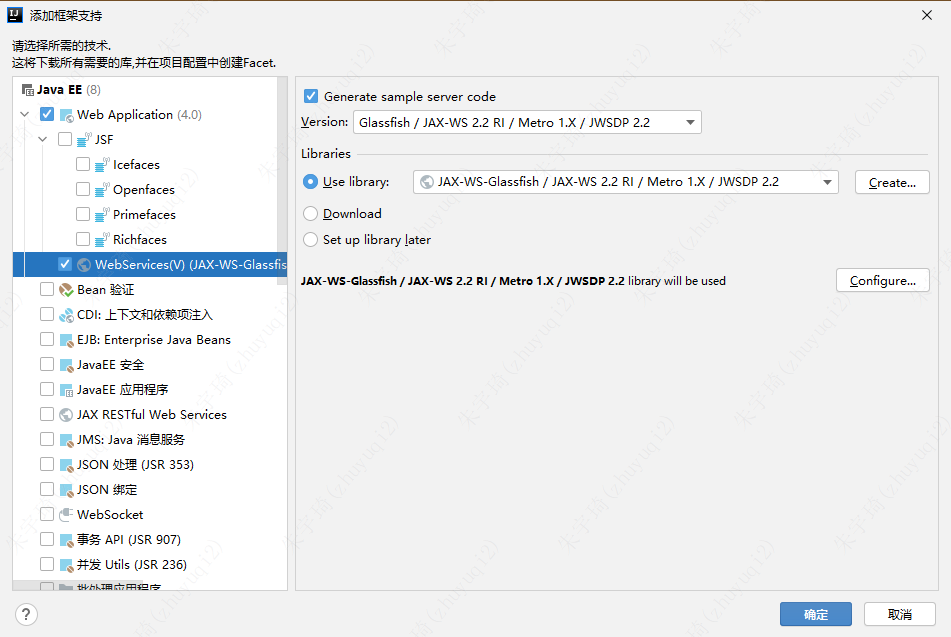

#### 客户端

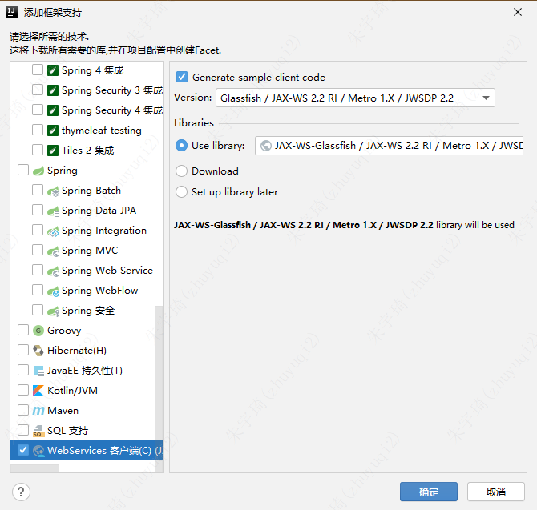

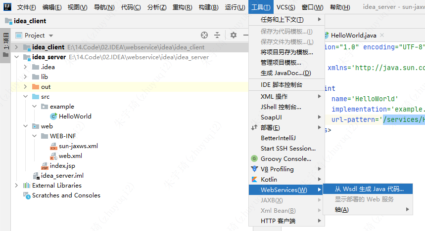

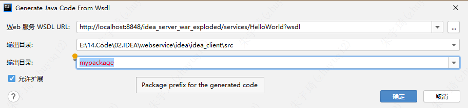

## CXF

### jetty部署

cxf自带jetty服务器，jetty部署即main方法运行。

项目结构：

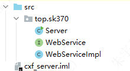

```java
package top.sk370;  
  
import org.apache.cxf.jaxws.JaxWsServerFactoryBean;  
  
public class Server {  
    public static void main(String[] args) {  
        JaxWsServerFactoryBean factory = new JaxWsServerFactoryBean();  
        factory.setAddress("http://localhost:8888/hello");  
        factory.setServiceClass(WebServiceImpl.class);  
        factory.setServiceBean(new WebServiceImpl());  
        factory.create();  
        System.out.println("服务已启动");  
    }  
}
```

### Tomcat部署

---
以下内容未验证：

tomcat部署有三种方式：

- 整合srping部署
- 不使用spring：使用cxf提供的CXFNonSpringServlet发布
- 不使用spring：使用cxf提供的WebServlet发布

后两种方式与jetty部署对比：

- 使用CXF自带的Jetty服务器来发布服务，优点是不需要额外的web容器，部署简单，适合开发和测试环境。缺点是不能和其他web应用共享同一个web容器，需要单独启动和停止服务，不利于管理和维护。
- 使用CXF提供的CXFNonSpringServlet来发布服务，优点是可以和其他web应用共享同一个web容器，部署方便，适合生产环境。缺点是需要额外的CXF配置文件，增加了配置的复杂度和耦合性。
- 使用CXF提供的WebServlet来发布服务，优点是可以和其他web应用共享同一个web容器，部署方便，适合生产环境。缺点是需要重写WebServlet类，增加了代码的复杂度和维护成本。

---
