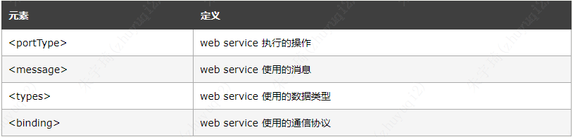
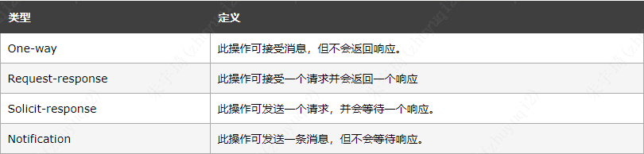

## 简介

WSDL（网络服务描述语言，Web Services Description Language）是一门基于 XML 的语言，用于描述Web service规定服务的位置，以及此服务提供的操作（或方法）。

## 文档结构

```xml
<definitions>

    <types>
       definition of types........
    </types>

    <message>
       definition of a message....
    </message>

    <portType>
       definition of a port.......
    </portType>

    <binding>
       definition of a binding....
    </binding>

</definitions>
```

主要元素：



- `portType`：描述一个 web service、可被执行的操作，以及相关的消息。
- `message`：定义一个操作的数据元素。
- `types`：定义web service使用的数据类型
- `bindings`：为每个端口定义消息格式和协议细节。

示例：

```xml
<message name="getTermRequest">
   <part name="term" type="xs:string"/>
</message>

<message name="getTermResponse">
   <part name="value" type="xs:string"/>
</message>

<portType name="glossaryTerms">
    <operation name="getTerm">
        <input message="getTermRequest"/>
        <output message="getTermResponse"/>
    </operation>
</portType>
```

### portType

protType（端口）相当于类，子元素operation（操作）相当于方法。

operation（操作）类型共有四种：



示例：

```xml
<message name="newTermValues">
   <part name="term" type="xs:string"/>
   <part name="value" type="xs:string"/>
</message>

<portType name="glossaryTerms">
   <operation name="setTerm">
      <input name="newTerm" message="newTermValues"/>
   </operation>
</portType >
```

定义了一个one-way操作，只有input，没有output。
