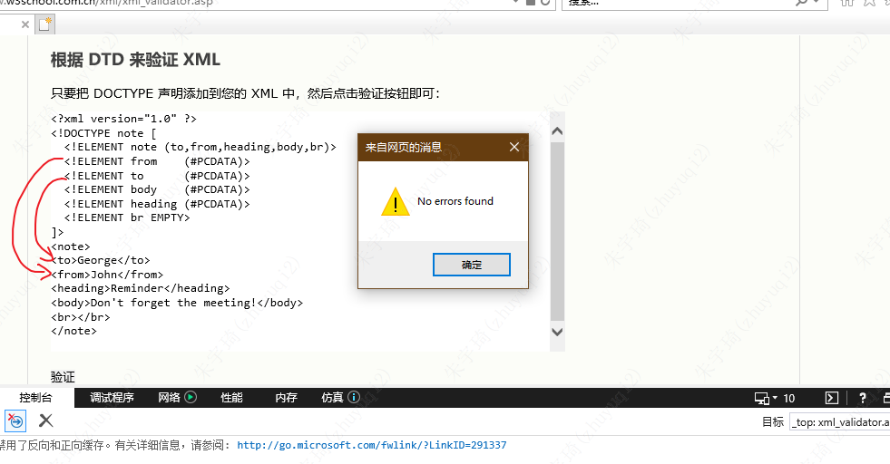
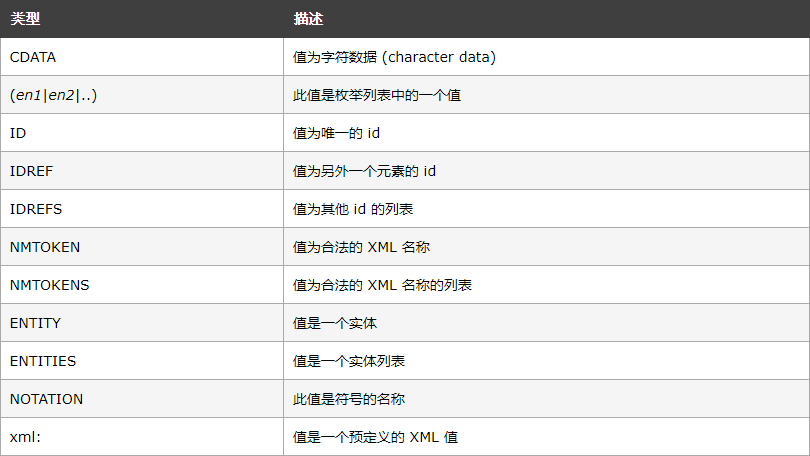
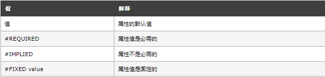

## 语法规则

DTD（文档定义类型）的作用是定义 XML 文档的结构。它使用一系列合法的元素来定义文档结构。

语法规则：

- 内部包含：`<!DOCTYPE 根元素 [元素声明]>`
- 外部引入：`<!DOCTYPE 根元素 SYSTEM "文件名">`

内部包含示例：

```xml
<?xml version="1.0"?>
<!DOCTYPE note [
  <!ELEMENT note (to,from,heading,body)>
  <!ELEMENT to      (#PCDATA)>
  <!ELEMENT from    (#PCDATA)>
  <!ELEMENT heading (#PCDATA)>
  <!ELEMENT body    (#PCDATA)>
]>
<note>
  <to>George</to>
  <from>John</from>
  <heading>Reminder</heading>
  <body>Don't forget the meeting!</body>
</note>
```

- `!DOCTYPE note`：定义此文档是note类型的文档——根元素是note。
- `<!ELEMENT note (to,from,heading,body)>`：定义 note元素有四个元素："to、from、heading,、body"。
- `<!ELEMENT to (#PCDATA)>`：定义 to元素为 "#PCDATA" 类型。后续同理。
- DTD声明顺序与使用顺序无关，如：
	- 

外部引入（对上述示例转换）示例：

```xml
<?xml version="1.0"?>
<!DOCTYPE note SYSTEM "note.dtd">
<note>
	<to>George</to>
	<from>John</from>
	<heading>Reminder</heading>
	<body>Don't forget the meeting!</body>
</note>
```

`note.dtd`文件：

```dtd
<!ELEMENT note (to,from,heading,body)>
<!ELEMENT to (#PCDATA)>
<!ELEMENT from (#PCDATA)>
<!ELEMENT heading (#PCDATA)>
<!ELEMENT body (#PCDATA)>
```

dtd文件内容仅是元素声明部分（不包含`[]`）。

## 元素声明

### 空元素

语法：`<!ELEMENT 元素名称 EMPTY>`

示例：`<!ELEMENT br EMPTY>`

使用：`<br />`或`<br></br>`。`<br>123</br>`这种包含了内容会报错。

完整案例：

```xml
<?xml version="1.0" ?> 
<!DOCTYPE note [
  <!ELEMENT note (to,from,heading,body,br)>
  <!ELEMENT from    (#PCDATA)> 
  <!ELEMENT to      (#PCDATA)> 
  <!ELEMENT body    (#PCDATA)>
  <!ELEMENT heading (#PCDATA)>
  <!ELEMENT br EMPTY>
]>
<note>
<to>George</to> 
<from>John</from> 
<heading>Reminder</heading> 
<body>Don't forget the meeting!</body>
<br></br>
</note>
```

后文不再给出完整案例，只取案例部分。

### 只有PCDATA的元素

PCDATA 的意思是被解析的字符数据（parsed character data）。被解析的字符数据不应当包含任何 &、< 或者 > 字符。

语法：`<!ELEMENT 元素名称 (#PCDATA)>`

示例：`<!ELEMENT from (#PCDATA)>`

使用：`<from>dfaddd</from>`。

### 带有任何内容的元素

可包含任何可解析数据的组合。

语法：`<!ELEMENT 元素名称 ANY>`

示例：`<!ELEMENT from ANY>`

### 带有子元素（序列）的元素

这些子元素必须按照相同的顺序出现在文档中。在一个完整的声明中，子元素也必须被声明，同时子元素也可拥有子元素。

语法：

```dtd
<!ELEMENT 元素名称 (子元素名称 1,子元素名称 2,.....)>
子元素名称 1声明
.....
```

- 子元素名称 1声明可以是本文**元素声明**的任何一种形式。后文同理。

### 子元素

只出现一次：

```dtd
<!ELEMENT 元素名称 (子元素名称)>
子元素名称声明
```

0次或多次：

```dtd
<!ELEMENT 元素名称 (子元素名称*)>
子元素名称声明
```

0次或1次：

```dtd
<!ELEMENT 元素名称 (子元素名称?)>
子元素名称声明
```

最少出现1次：

```dtd
<!ELEMENT 元素名称 (子元素名称+)>
子元素名称声明
```

非……即……

```dtd
<!ELEMENT note (to,from,header,(message|body))>
子元素名称声明
```

"note" 元素必须包含 "to" 元素、"from" 元素、"header" 元素， "message" 元素、 "body"只能包含二者其一。

### 混合声明


```dtd
<!ELEMENT note (#PCDATA|to|from|header|message)*>
子元素名称声明
```

"note" 元素可包含出现零次或多次的 PCDATA、"to"、"from"、"header" 或者 "message"。

## 属性声明

### 格式

格式：`<!ATTLIST 元素名称 属性名称 属性类型 默认值>`

实例：

```dtd
<!ATTLIST payment type CDATA "check">
```

```xml
<payment type="check" />
```

### 属性类型



枚举属性实例：

```dtd
<!ATTLIST payment type (check|cash) "cash">
```

```xml
<payment type="check" />
或
<payment type="cash" />
```


### 默认值



值实例：

```dtd
<!ELEMENT square EMPTY>
<!ATTLIST square width CDATA "0">
```

```xml
<square width="100" />
```

"square" 被定义为带有 CDATA 类型的 "width" 属性的空元素。如果宽度没有被设定，其默认值为0 。

`#IMPLIED`实例：

```dtd
<!ATTLIST contact fax CDATA #IMPLIED>
```

```xml
<contact fax="555-667788" />
或
<contact />
```

`#REQUIRED`实例：

```dtd
<!ATTLIST person number CDATA #REQUIRED>
```

```xml
<person number="5677" />
```

`#FIXED`实例：

```dtd
<!ATTLIST sender company CDATA #FIXED "Microsoft">
```

```xml
<sender company="Microsoft" />
```

## 实体

一个实体由三部分构成: 一个和号 (&), 一个实体名称, 以及一个分号 (;)。

### 内部实体声明

语法：`<!ENTITY 实体名称 "实体的值">`

```dtd
<!ENTITY writer "Bill Gates">
<!ENTITY copyright "Copyright W3School.com.cn">
```

```xml
<author>&writer;&copyright;</author>
```

### 外部实体声明

语法：`<!ENTITY 实体名称 SYSTEM "URI/URL">`

```dtd
<!ENTITY writer SYSTEM "http://www.w3school.com.cn/dtd/entities.dtd">
<!ENTITY copyright SYSTEM "http://www.w3school.com.cn/dtd/entities.dtd">
```

```xml
<author>&writer;&copyright;</author>
```

## 综合实例

以下均为内部包含的实例。

```dtd
<!DOCTYPE TVSCHEDULE [

<!ELEMENT TVSCHEDULE (CHANNEL+)>
<!ELEMENT CHANNEL (BANNER,DAY+)>
<!ELEMENT BANNER (#PCDATA)>
<!ELEMENT DAY (DATE,(HOLIDAY|PROGRAMSLOT+)+)>
<!ELEMENT HOLIDAY (#PCDATA)>
<!ELEMENT DATE (#PCDATA)>
<!ELEMENT PROGRAMSLOT (TIME,TITLE,DESCRIPTION?)>
<!ELEMENT TIME (#PCDATA)>
<!ELEMENT TITLE (#PCDATA)> 
<!ELEMENT DESCRIPTION (#PCDATA)>

<!ATTLIST TVSCHEDULE NAME CDATA #REQUIRED>
<!ATTLIST CHANNEL CHAN CDATA #REQUIRED>
<!ATTLIST PROGRAMSLOT VTR CDATA #IMPLIED>
<!ATTLIST TITLE RATING CDATA #IMPLIED>
<!ATTLIST TITLE LANGUAGE CDATA #IMPLIED>

]>
```