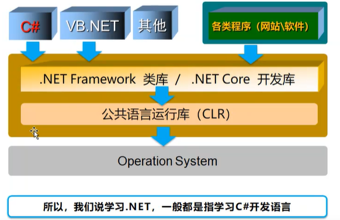
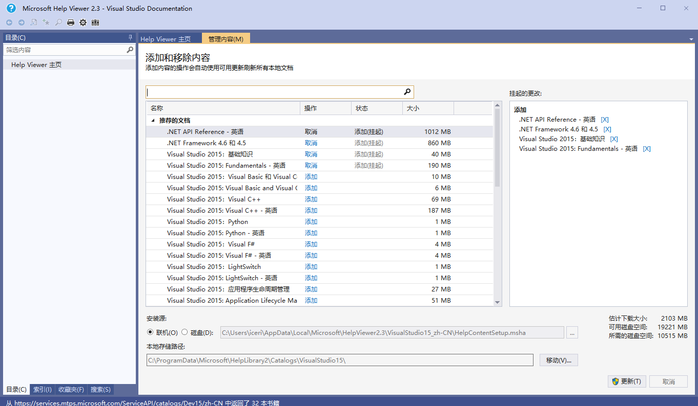
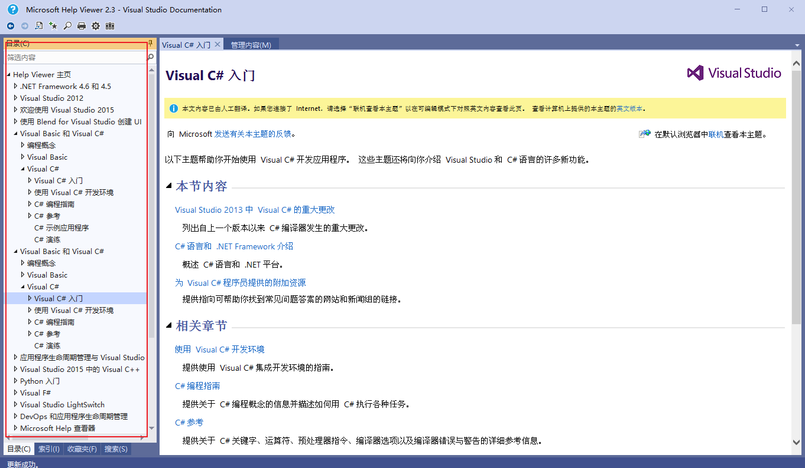
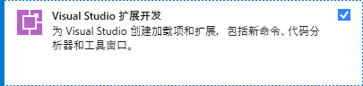
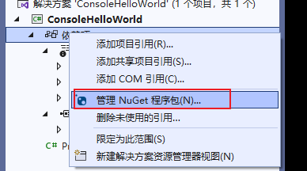
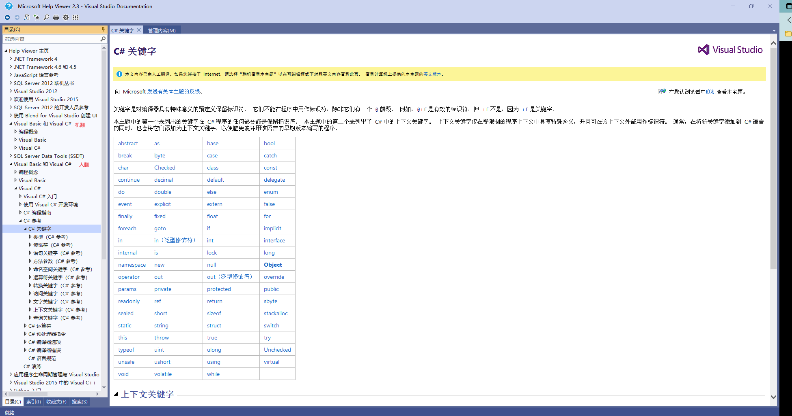
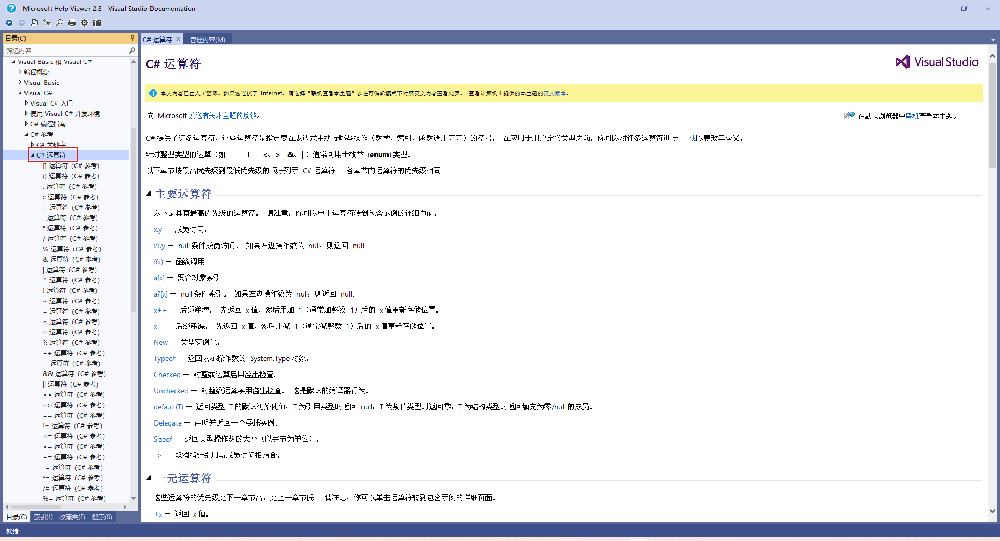
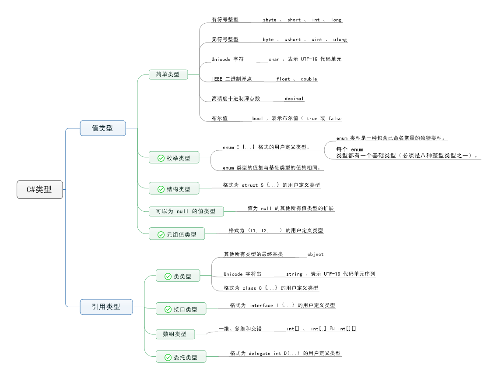

*本文面向C# 8，基于官方文档。*

## C sharp、.net framework、asp.net

`.net framework`是开发web服务和web应用程序的框架。

`C#`的出现是由 Anders Hejlsberg 和他的团队在 .Net 框架开发期间开发的，是 `.net`平台最常用的语言。

`asp.net`是内含于.NET框架中，专门用来发展Web应用程序的一组类别库集。

### C sharp介绍

#### 语言特点

- 垃圾回收自动回收不可访问的未用对象所占用的内存。
- 可以为 null 的类型可防范不引用已分配对象的变量。
- 异常处理提供了一种结构化且可扩展的方法来进行错误检测和恢复。
- Lambda 表达式支持函数编程技术。
- 语言集成查询 (LINQ) 语法创建一个公共模式，用于处理来自任何源的数据。
- 异步操作语言支持提供用于构建分布式系统的语法。
- C# 有统一类型系统。 所有 C# 类型（包括 int 和 double 等基元类型）均继承自一个根 object 类型。 所有类型共用一组通用运算。 任何类型的值都可以一致地进行存储、传输和处理。 C# 还支持用户定义的引用类型和值类型。 C# 允许动态分配轻型结构的对象和内嵌存储。 C# 支持泛型方法和类型，因此增强了类型安全性和性能。
- C# 可提供迭代器，使集合类的实现者可以定义客户端代码的自定义行为。

#### 上位机语言对比


#### C#和组态软件对比


#### C#和LibView对比


### .net介绍

#### 来源

C# 程序在 .NET 上运行，而 .NET 是名为**公共语言运行时** (CLR) 的虚执行系统和一组类库。 CLR 是 Microsoft 对**公共语言基础结构** (CLI) 国际标准的实现。 CLI 是创建执行和开发环境的基础，语言和库可以在其中无缝地协同工作。

#### 发展


#### .NET平台和C#编程语言



### 编译及运行过程


程序集是包含代码和元数据的自描述功能单元，因此无需在 C# 中使用 `#include` 指令和头文件。

在编译程序时引用特定的程序集，即可在 C# 程序中使用此程序集中包含的公共类型和成员。

C# 程序可以存储在多个源文件中。 在编译 C# 程序时，将同时处理所有源文件，并且源文件可以自由地相互引用。 从概念上讲，就好像所有源文件在被处理之前都连接到一个大文件。

在 C# 中永远都不需要使用前向声明，因为声明顺序无关紧要（极少数例外情况除外）。

C# 并不限制源文件只能声明一种公共类型（`public`），也不要求源文件的文件名必须与其中声明的类型相匹配。

## 补充知识

### 学习资料

- 官方文档：[C# 文档 - 入门、教程、参考。 | Microsoft Learn](https://learn.microsoft.com/zh-cn/dotnet/csharp/)
- MSDN文档（基于2022版本）：
  - 
  - 
  - 需要哪些添加哪些，也可以全部添加。
  - 下载好后可以在左侧选择需要阅读的内容
- 图书：《C# 8.0 in a Nutshell》

### 软件环境

第一阶段：

- visual studio
  - 必装attachments/20230504140312.png]
  - 建议
- SQLServer

第二阶段：

- NetAssit UartAssist(串口以太网络助手）
- Modbus系列软件(Modbus)
- 博途系列软件（西门子）
- GX Works(三菱)
- CX Programmer(欧姆龙)
- KepServerEx6(OPC）

### 创建新项目


### Solution和project

- Solution：解决方案
- Poject：解决问题的方法。Solution包含Project。vs提供了Project模板。


### 托管代码和非托管代码


## 认识C#语言

### 简单程序

```c#
using System;
class Hello
{
	static void Main()
	{
		Console.WriteLine("Hello, World");
	}
}
```

- `using`：引用指定的命名空间。
- `System`：`System`命名空间。
  - 命名空间是一种组织C#程序和库的分层方法。
  - 命名空间可以包括类型，也可以包括其他命名空间。
- `Console`：`System`命名空间的类，使用 `using`指令引入命名空间后，可以使用非限定的方式使用命名空间的成员。
  - 即 `Console.WriteLine`是 `System.Console.WriteLine` 的简写。
- `Main()`：这是一个方法。
- `static`：表示这是一个静态方法。
  - 约定，`static`修饰的 `Main`方法是C#程序的入口。
- `void`：表示该方法没有返回值。

### Hello World的10种输出手法

带 `*` 号的是推荐学习的方向。

- `Console`
- `Windows Forms(Old)`：升级后➡`WPF(Windows Presentation Foundation)`*：
- `ASP.NET Web Forms`(Old)：升级后➡ `ASP.NET MVC(Model-View-Controller)`*
  - 分离不同种类的代码
  - 结构清晰，易于维护
- `WCF(Windows Communication Foundation)*
- `Windows Store Application`*
- `Windows Phone Application`*
- `Cloud(Windows Azure)`*：利用微软云平台开发
- `WF(Workflow Foundation)`

后续进阶：[ASP.NET Core](https://docs.microsoft.com/zh-cn/aspnet/core) 、 `.NET 5` 、[.NET 6](https://docs.microsoft.com/zh-cn/dotnet/core/whats-new/dotnet-6)

### 类、名称空间、类库

- 类（Class）：构成程序的主体。
- 名称空间（namespace）：以树形结构组织类（和其他类型）
  - 一个项目（project）可以有多个名称空间
  - 默认的名称空间与项目名相同。
- 类库（PresentationFramework）：使用类和名称空间的物理基础，文件名以 `.dll`结尾。
  - 黑盒引用：无源代码。
  - 白盒引用：有源代码。

*类库相当于Java的jar包。名称空间相当于包名。*

黑盒引用时，如果类库之间存在依赖关系，使用和管理都很不便，这时可以使用NuGet工具进行自动管理，具体如下：



### 程序结构

C# 中的关键组织结构概念包括程序、命名空间、类型、成员和程序集。

程序声明类型，而类型则包含成员，并被整理到命名空间中。 编译完的 C# 程序实际上会打包到程序集中。程序集的文件扩展名通常为 `.exe` 或 `.dll` ，具体视其分别实现的是应用程序还是库而定。

```c#
namespace Acme.Collections;
public class Stack<T>
{
	Entry _top;
	public void Push(T data)
	{
		_top = new Entry(_top, data);
	}
	public T Pop()
	{
		if (_top == null)
		{
			throw new InvalidOperationException();
		}
		T result = _top.Data;
		_top = _top.Next;
		return result;
	}
	class Entry
	{
		public Entry Next { get; set; }
		public T Data { get; set; }
		public Entry(Entry next, T data)
		{
			Next = next;
			Data = data;
		}
	}
}
```

上面程序示例中：

- 声明了 `Stack`类型。
  - 全限定名称为：`Acme.Collections.Stack`
  - `Stack<T>`表示泛型类，具有类型参数 `T`，在使用时替换为具体类型。
- `Stack`类型包含：
  - 字段：`_top`
  - 方法：`Push`和 `Pop`
  - 嵌套类：`Entry`，包含：
    - 属性：`Next`、`Data`
    - 构造函数：`Entry`

### 构成C sharp语言的基本元素

#### 关键字（Keyword）



#### 操作符、运算符（Operator）



#### 标识符

合法标识符：

- 标识符不允许是关键字，如果非要用关键字就在前面加 `@` 符号
- 标识符必需以字符或下划线开头
- 字符包括英文字符，也包括汉语、俄语等字符
- 开始字符的后面可以跟字符、数字、下划线

基本命名规范：

- 变量名都用驼峰法 Camel
  - 首字母小写，后续单词首字母大写
  - 例：`apple` `smallApple`
- 方法、类、名称空间都用帕斯卡 Pascal， 每个单词的首字母都大写
  - 例：`Apple` `SmallApple`
  - 方法名应该是动词或动词短语，例如 Today 错，GetToday 对。

```c#
// 类实例化
Calculator c = new Calculator();
// 方法调用
int x = c.Add(2,3);
Console.WriteLine(x);
// 类声明
class Calculator
{
    // 方法声明
    public int Add(int a, int b)
    {
        int c = a + b;
        return c;
    }
}
```

#### 标点符号

- `;`：表示语句结束
- `(`、`)`等

#### 文本（字面值）

- 整数
  - 多种后缀
- 实数
  - 多种后缀
- 字符
- 字符串
- 布尔
- 空（null）

#### 注释与空白

- 单行
- 多行（块注释）

## 快速入门

### （数据）类型

- 类型定义 C# 中的任何数据的结构和行为。
  - 类型的声明可以包含其成员、基类型、它实现的接口和该类型允许的操作。
- 变量是用于引用特定类型的实例的标签。
  - 变量的名称叫做标识符

#### 类型分类

- 值类型：每个变量都有自己的数据。
- 引用类型：每个对象存储对数据的引用。



#### 类型声明

C# 程序使用类型声明创建新类型。类型声明指定新类型的名称和成员。构建基块包括：

- 成员：如属性、字段、方法和事件
- 表达式
- 语句

用户可定义六种 C# 类型：类类型、结构类型、接口类型、枚举类型、委托类型和元组值类型。

还可以声明 record 类型（ record struct 或 record class ）：记录类型具有编译器合成成员。 记录主要用于存储值，关联行为最少。

- class 类型定义包含数据成员（字段）和函数成员（方法、属性及其他）的数据结构。
  - 类类型支持单一继承和多形性，即派生类可以扩展和专门针对基类的机制。
- struct 类型定义包含数据成员和函数成员的结构，这一点与类类型相似。
  - 与类不同的是，结构是值类型，通常不需要进行堆分配。
  - 结构类型不支持用户指定的继承，并且所有结构类型均隐式继承自类型 object 。
- interface 类型将协定定义为一组已命名的公共成员。
  - 实现 interface 的 class 或struct 必须提供接口成员的实现代码。
  - nterface 可以继承自多个基接口， class和 struct 可以实现多个接口。
- delegate 类型表示引用包含特定参数列表和返回类型的方法。
  - 通过委托，可以将方法视为可分配给变量并可作为参数传递的实体。
  - 委托类同于函数式语言提供的函数类型。 它们还类似于其他一些语言中存在的“函数指针”概念。
  - 与函数指针不同，委托是面向对象且类型安全的。

#### 变量

C# 有多种 变量 ，其中包括字段、数组元素、局部变量和参数。 变量表示存储位置。 每个变量都具有一种类型，用于确定可以在变量中存储哪些值。具体如下：

- 不可以为 null 的值类型
  - 具有精确类型的值。
- 可以为 null 的值类型
  - null 值或具有精确类型的值。
- object
  - null 引用、对任意引用类型的对象的引用，或对任意值类型的装箱值的引用。
- 类类型
  - null 引用、对类类型实例的引用，或对派生自类类型的类实例的引用。
- 接口类型
  - null 引用、对实现接口类型的类类型实例的引用，或对实现接口类型的值类型的装箱值的引用。
- 数组类型
  - null 引用、对数组类型实例的引用，或对兼容的数组类型实例的引用委托类型null 引用或对兼容的委托类型实例的引用。

#### object

C# 采用统一的类型系统，因此任意类型的值都可视为 object 。 每种 C# 类型都直接或间接地派生自 object 类类型，而 object 是所有类型的最终基类。 只需将值视为类型object ，即可将引用类型的值视为对象。 通过执行 装箱 和 取消装箱操作 ，可以将值类型的值视为对象。 在以下示例中， int 值被转换成 object ，然后又恢复成 int 。

```c#
int i = 123;
object o = i; // Boxing
int j = (int)o; // Unboxing
```

将值类型的值分配给 object 对象引用时，会分配一个“箱”来保存此值。 该箱是引用类型的实例，此值会被复制到该箱。 相反，当 object 引用被显式转换成值类型时，将检查引用的 object 是否是具有正确值类型的箱。 如果检查成功，则会将箱中的值复制到值类型。

#### 类

类是一种数据结构，可在一个单元中就将状态（字段）和操作（方法和其他函数成员）结合起来。 类为类实例（亦称为“对象”）提供了定义 。

类可以直接继承一个父类，并且可以实现任意数量的接口。 若要用方法重写父类中的虚方法，必须使用override 关键字，以免发生意外重定义。

结构就像是轻量级类，是可以实现接口但不支持继承的堆栈分配类型。

C# 提供了 record class 和 record struct 类型，这些record类型的目的主要是存储数据值。

##### 声明和实例化

类声明以标头开头。 标头指定以下内容：

- 类的特性和修饰符
- 类的名称
- 基类（从基类继承时）
- 接口由该类实现。
  标头后面是类主体，由在分隔符 `{` 和 `}` 内编写的成员声明列表组成。

```c#
public class Point
{
	public int X { get; }
	public int Y { get; }
	public Point(int x, int y) => (X, Y) = (x, y);
}
```

类实例是使用 new 运算符进行创建，此运算符为新实例分配内存，调用构造函数来初始化实例，并返回对实例的引用。

```c#
var p1 = new Point(0, 0);
var p2 = new Point(10, 20);
```

当无法再访问对象时，对象占用的内存会被自动回收。 没有必要也无法在 C# 中显式解除分配对象。

##### 类型参数

类型参数是用尖括号括起来的类型参数名称列表。 类型参数跟在类名后面。 定义后即可在类声明的主体中使用类型参数来定义类成员。

```C#
public class Pair<TFirst, TSecond>
{
	public TFirst First { get; }
	public TSecond Second { get; }
	public Pair(TFirst first, TSecond second) =>
		(First, Second) = (first, second);
}
```

声明为需要使用类型参数的类类型被称为 泛型类类型 。 结构、接口和委托类型也可以是泛型。

使用泛型类时，必须为每个类型参数提供类型自变量:

```c#
var pair = new Pair<int, string>(1, "two");
int i = pair.First; //TFirst int
string s = pair.Second; //TSecond string
```

包含类型自变量的泛型类型（如上面的 Pair<int,string> ）被称为 构造泛型类型。

##### 基类

在类名和类型参数后面加上冒号和基类的名称。

```c#
public class Point3D : Point
{
	public int Z { get; set; }
	public Point3D(int x, int y, int z) : base(x, y)
	{
		Z = z;
	}
}
```

- 类继承其基类的成员，意味着一个类隐式包含其基类的几乎所有成员。
- 类不继承实例、静态构造函数以及终结器。
- 派生类可以在其继承的成员中添加新成员，但无法删除继承成员的定义。
- 可以将类类型隐式转换成其任意基类类型。 类类型的变量可以引用相应类的实例或任意派生类的实例。

```c#
Point a = new(10, 20);
Point b = new Point3D(10, 20, 30);
```

##### 类的3大组成

- 属性 Property
  - 存储数据，组合起来表示类或对象当前的状态
- 方法 Method
  - 由 C 语言中的函数（function）进化而来，表示类或对象“能做什么”
  - 工作中 90% 的时间是与方法打交道，因为它是“真正做事”、“构成逻辑”的成员
- 事件 Event
  - 类或对象通知其它类或对象的机制，为 C# 所特有（Java 通过其它办法实现这个机制）

特殊的类：

- 模型类：重在属性，如 Entity Framework。
- 工具类：重在方法，如 Math，Console。
- 通知类：重在事件，如各种 Timer。

#### 结构

- 结构类型是较为简单的类型，其主要目的是存储数据值。
- 结构不能声明基类型；它们从 System.ValueType 隐式派生。
- 结构也不能再派生其他的结构（不能作为基类）。

```c#
public struct Point
{
	public double X { get; }
	public double Y { get; }
	public Point(double x, double y) => (X, Y) = (x, y);
}
```

#### 接口

接口定义了可由类和结构实现的协定。 定义接口来声明在不同类型之间共享的功能。接口可以包含方法、属性、事件和索引器。 接口通常不提供所定义成员的实现，仅指定必须由实现接口的类或结构提供的成员。

接口可以采用“多重继承”。

```c#
interface IControl
{
	void Paint();
}
interface ITextBox : IControl
{
	void SetText(string text);
}
interface IListBox : IControl
{
	void SetItems(string[] items);
}
//接口 IComboBox 同时继承自 ITextBox 和IListBox
interface IComboBox : ITextBox, IListBox { }
```

类和结构可以实现多个接口。

```c#
interface IDataBound
{
	void Bind(Binder b);
}
// 类 EditBox 同时实现 IControl 和IDataBound
public class EditBox : IControl, IDataBound
{
	public void Paint() { }
	public void Bind(Binder b) { }
}
```

当类或结构实现特定接口时，此类或结构的实例可以隐式转换成相应的接口类型。

```c#
EditBox editBox = new();
IControl control = editBox;
IDataBound dataBound = editBox;
```

#### 枚举

枚举类型定义了一组常数值。

```c#
public enum SomeRootVegetable
{
	HorseRadish,
	Radish,
	Turnip
}
// 声明
var turnip = SomeRootVegetable.Turnip;
```

还可以定义一个 enum 作为标志组合使用。 以下声明为四季声明了一组标志，可以随意搭配季节组合，包括 All 值（包含所有季节）：

```c#
[Flags]
public enum Seasons
{
	None = 0,
	Summer = 1,
	Autumn = 2,
	Winter = 4,
	Spring = 8,
	All = Summer | Autumn | Winter | Spring
}
// 声明
var spring = Seasons.Spring;
var startingOnEquinox = Seasons.Spring | Seasons.Autumn;
var theYear = Seasons.All;
```

#### 可为null的类型

任何类型的变量都可以声明为“不可为 null”或“可为 null”。 可为 null 的变量包含一个额外的 null 值，表示没有值。

- 可为 null 的值类型（结构或枚举）由 `System.Nullable<T>`表示。
- 不可为 null 和可为 null 的引用类型都由基础引用类型表示。

这种区别由编译器和某些库读取的元数据体现。

- 当可为 null 的引用在没有先对照 null 检查其值的情况下取消引用时，编译器会发出警告。
- 当对不可为 null 的引用分配了可能为 null 的值时，编译器也会发出警告。

该示例表示了可为 null 的字符串：

```c#
int? optionalInt = default;
optionalInt = 5;
string? optionalText = default;
optionalText = "Hello World.";
```

#### 元组

元组提供了简洁的语法来将多个数据元素分组成一个轻型数据结构。通过
声明 `(` 和 `)` 之间的成员的类型和名称来实例化元组

```c#
(double Sum, int Count) t2 = (4.5, 3);
Console.WriteLine($"Sum of {t2.Count} elements is {t2.Sum}.");
//Output:
//Sum of 3 elements is 4.5.
```

元组为具有多个成员的数据结构提供了一种替代方法，且无需使用**构建基块**。

### 构建基块

#### 成员

class 的成员要么是静态成员，要么是实例成员。 静态成员属于类，而实例成员则属于对象（类实例）。

- 常量：与类相关联的常量值
- 字段：与类关联的变量
- 方法：类可执行的操作
- 属性：与读取和写入类的已命名属性相关联的操作
- 索引器：与将类实例编入索引（像处理数组一样）相关联的操作
- 事件：类可以生成的通知
- 运算符：类支持的转换和表达式运算符
- 构造函数：初始化类实例或类本身所需的操作
- 终结器：永久放弃类的实例之前完成的操作
- 类型：类声明的嵌套类型

#### 访问修饰符

- public ：访问不受限制。
- private ：访问仅限于此类。
- protected ：访问仅限于此类或派生自此类的类。
- internal ：仅可访问当前程序集（ .exe 或 .dll ）。
- protected internal ：仅可访问此类、从此类中派生的类，或者同一程序集中的类。
- private protected ：仅可访问此类或同一程序集中从此类中派生的类。

#### 字段

字段是与类或类实例相关联的变量。

- 使用静态修饰符声明的字段定义的是静态字段。静态字段只指明一个存储位置。无论创建多少个类实例，永远只有一个静态字段副本。
- 不使用静态修饰符声明的字段定义的是实例字段。 每个类实例均包含相应类的所有实例字段的单独副本。
- 

在以下示例中，每个 Color 类实例均包含 R 、 G 和 B 实例字段的单独副本，但只包含Black 、 White 、 Red 、 Green 和 Blue 静态字段的一个副本：

```c#
public class Color
{
    public static readonly Color Black = new(0, 0, 0);
    public static readonly Color White = new(255, 255, 255);
    public static readonly Color Red = new(255, 0, 0);
    public static readonly Color Green = new(0, 255, 0);
    public static readonly Color Blue = new(0, 0, 255);
  
    public byte R;
    public byte G;
    public byte B;

    public Color(byte r, byte g, byte b)
    {
        R = r;
        G = g;
        B = b;
    }
}
```

`readonly` 修饰符声明_只读字段_。只能在字段声明期间或在同一个类的构造函数中向只读字段赋值。

#### 方法

方法是实现对象或类可执行的计算或操作的成员。

- 静态方法是通过类进行访问。
- 实例方法是通过类实例进行访问。

方法可能包含一个参数列表，这些参数表示传递给方法的值或变量引用。方法可能也包含一组类型参数，必须在调用方法时指定类型自变量，这一点与类型一样。与类型不同的是，通常可以根据方法调用的自变量推断出类型自变量，无需显式指定。

方法具有返回类型，它用于指定方法计算和返回的值的类型。 如果方法未返回值，则它的返回类型为 `void`。

在声明方法的类中，方法的_签名_必须是唯一的。 方法签名包含方法名称、类型参数数量及其参数的数量、修饰符和类型。 方法签名不包含返回类型。

当方法主体是单个表达式时，可使用紧凑表达式格式定义方法，如下例中所示：

```c#
public override string ToString() => "This is an object";
```

##### 参数

参数用于将值或变量引用传递给方法。 方法参数从调用方法时指定的自变量中获取其实际值。有四类参数：值参数、引用参数、输出参数和参数数组。

值参数：

- 值参数用于传递输入自变量。
- 值参数对应于局部变量，从为其传递的自变量中获取初始值。
- 修改值形参不会影响为其传递的实参。
- 可以指定默认值，从而省略相应的自变量，这样值参数就是可选的。

```c#
static void Swap(int x, int y)
{
	int temp = x;
	x = y;
	y = temp;
}

public static void SwapExample()
{
	int i = 1, j = 2;
	Swap(i, j);
	Console.WriteLine($"{i} {j}");    // "1 2"
}
```

引用参数：

- 引用参数用于按引用传递自变量。
- 为引用参数传递的自变量必须是一个带有明确值的变量。
- 在方法执行期间，引用参数指出的存储位置与自变量相同。
- 引用参数使用 `ref` 修饰符进行声明。

```c#
static void Swap(ref int x, ref int y)
{
    int temp = x;
    x = y;
    y = temp;
}

public static void SwapExample()
{
    int i = 1, j = 2;
    Swap(ref i, ref j);
    Console.WriteLine($"{i} {j}");    // "2 1"
}
```

输出参数：

- 输出参数用于按引用传递自变量。
- 输出参数与引用参数类似，不同之处在于，不要求向调用方提供的自变量显式赋值。
- 输出参数使用 `out` 修饰符进行声明。

```c#
static void Divide(int x, int y, out int quotient, out int remainder)
{
    quotient = x / y;
    remainder = x % y;
}

public static void OutUsage()
{
    Divide(10, 3, out int quo, out int rem);
    Console.WriteLine($"{quo} {rem}");	// "3 1"
}
```

参数数组：

- 参数数组允许向方法传递数量不定的自变量。
- 参数数组使用 `params` 修饰符进行声明。
- 参数数组只能是方法的最后一个参数，且参数数组的类型必须是一维数组类型。

```c#
public class Console
{
    public static void Write(string fmt, params object[] args) { }
    public static void WriteLine(string fmt, params object[] args) { }
    // ...
}
```

在使用参数数组的方法中，参数数组的行为与数组类型的常规参数完全相同。不过，在调用包含形参数组的方法时，要么可以传递形参数组类型的一个实参，要么可以传递形参数组的元素类型的任意数量实参。 在后一种情况中，数组实例会自动创建，并初始化为包含给定的自变量。

```c#
int x, y, z;
x = 3;
y = 4;
z = 5;
Console.WriteLine("x={0} y={1} z={2}", x, y, z);
```

等同于：

```c#
int x = 3, y = 4, z = 5;

string s = "x={0} y={1} z={2}";
object[] args = new object[3];
args[0] = x;
args[1] = y;
args[2] = z;
Console.WriteLine(s, args);
```

##### 方法主体和局部变量

法主体指定了在调用方法时执行的语句。

方法主体可以声明特定于方法调用的变量。 此类变量称为局部变量。 局部变量声明指定了类型名称、变量名称以及可能的初始值。

下面的示例声明了初始值为零的局部变量 `i` 和无初始值的局部变量 `j`。

```c#
class Squares
{
    public static void WriteSquares()
    {
        int i = 0;
        int j;
        while (i < 10)
        {
            j = i * i;
            Console.WriteLine($"{i} x {i} = {j}");
            i++;
        }
    }
}
```

C# 要求必须先明确赋值局部变量，然后才能获取其值。 如果上述 `i` 的声明未包含初始值，那么编译器会在后续使用 `i` 时报告错误，因为在后续使用时 `i` 不会在程序中得到明确赋值。

方法可以使用 `return` 语句将控制权返回给调用方。 在返回 `void` 的方法中，`return` 语句无法指定表达式。 在不返回 void 的方法中，`return` 语句必须包括用于计算返回值的表达式。

##### 静态和实例方法

使用 `static` 修饰符声明的方法是静态方法。 静态方法不对特定的实例起作用，只能直接访问静态成员。

未使用 `static` 修饰符声明的方法是实例方法。 实例方法对特定的实例起作用，并能够访问静态和实例成员。 其中调用实例方法的实例可以作为 `this` 显式访问。 在静态方法中引用 `this` 会生成错误。

```c#
class Entity
{
    static int s_nextSerialNo;
    int _serialNo;
  
    public Entity()
    {
        _serialNo = s_nextSerialNo++;
    }
  
    public int GetSerialNo()
    {
        return _serialNo;
    }
  
    public static int GetNextSerialNo()
    {
        return s_nextSerialNo;
    }
  
    public static void SetNextSerialNo(int value)
    {
        s_nextSerialNo = value;
    }
}
```

构造函数（类似于实例方法）是实例成员，因此可以访问 `_serialNo` 实例字段和 `s_nextSerialNo` 静态字段。

`GetNextSerialNo` 和 `SetNextSerialNo` 静态方法可以访问 `s_nextSerialNo` 静态字段，但如果直接访问 `_serialNo` 实例字段，则会生成错误。

```c#
Entity.SetNextSerialNo(1000);
Entity e1 = new();
Entity e2 = new();
Console.WriteLine(e1.GetSerialNo());          // Outputs "1000"
Console.WriteLine(e2.GetSerialNo());          // Outputs "1001"
Console.WriteLine(Entity.GetNextSerialNo());  // Outputs "1002"
```

`SetNextSerialNo` 和 `GetNextSerialNo` 静态方法在类中进行调用，而 `GetSerialNo` 实例方法则是在类实例中进行调用。

##### 虚方法、重写方法和抽象方法

可使用虚方法、重写方法和抽象方法来定义类类型层次结构的行为。

- 虚方法是在基类中声明和实现的方法，其中任何派生类都可提供更具体的实现。
  - 抽象方法是在基类中声明的方法，抽象方法不在基类中定义实现。
- 重写方法是在派生类中实现的方法，可修改基类实现的行为。

方法调用：
对实例方法的方法调用可解析为基类或派生类实现。 变量的类型确定了其编译时类型。

- 编译时类型是编译器用于确定其成员的类型。 但是，可将变量分配给从其编译时类型派生的任何类型的实例。
- 运行时类型是变量所引用的实际实例的类型。

> *如后文的案例中：
> 调用 `Operation`类的实例方法 `Evaluate()`可以解析为对基类 `Exprssion`的实现。变量 `e`确定编译时的类型为 `Expression`。
> 变量 `e`的编译时类型为 `Expression`，但是可以分配给 `Constant`或 `Operation`。
> 变量 `e`的运行时类型为 `Operation`。

调用虚方法时，为其调用方法的实例的运行时类型决定了要调用的实际方法实现代码。 调用非虚方法时，实例的编译时类型是决定性因素。

可以在派生类中重写虚方法。 如果实例方法声明中有 `override` 修饰符，那么实例方法可以重写签名相同的继承虚方法。

抽象方法是没有实现代码的虚方法。 抽象方法使用 `abstract` 修饰符进行声明，仅可在抽象类中使用。 必须在所有非抽象派生类中重写抽象方法。

下面的示例声明了一个抽象类 `Expression`，三个派生类（`Constant`、`VariableReference` 和 `Operation`），一个抽象方法 `Evaluate()`。

```c#
Expression e = new Operation(
    new VariableReference("x"),
    '*',
    new Operation(
        new VariableReference("y"),
        '+',
        new Constant(2)
    )
);
Dictionary<string, object> vars = new();
vars["x"] = 3;
vars["y"] = 5;
Console.WriteLine(e.Evaluate(vars)); // "21"
vars["x"] = 1.5;
vars["y"] = 9;
Console.WriteLine(e.Evaluate(vars)); // "16.5"

public abstract class Expression
{
    public abstract double Evaluate(Dictionary<string, object> vars);
}

public class Constant : Expression
{
    double _value;
  
    public Constant(double value)
    {
        _value = value;
    }
  
    public override double Evaluate(Dictionary<string, object> vars)
    {
        return _value;
    }
}

public class VariableReference : Expression
{
    string _name;
  
    public VariableReference(string name)
    {
        _name = name;
    }
  
    public override double Evaluate(Dictionary<string, object> vars)
    {
        object value = vars[_name] ?? throw new Exception($"Unknown variable: {_name}");
        return Convert.ToDouble(value);
    }
}

public class Operation : Expression
{
    Expression _left;
    char _op;
    Expression _right;
  
    public Operation(Expression left, char op, Expression right)
    {
        _left = left;
        _op = op;
        _right = right;
    }
  
    public override double Evaluate(Dictionary<string, object> vars)
    {
        double x = _left.Evaluate(vars);
        double y = _right.Evaluate(vars);
        switch (_op)
        {
            case '+': return x + y;
            case '-': return x - y;
            case '*': return x * y;
            case '/': return x / y;
    
            default: throw new Exception("Unknown operator");
        }
    }
}
```

##### 方法重载

方法重载指同一类中可以有多个同名的方法，只要这些方法具有唯一签名即可。

编译如何调用重载的方法时，编译器使用重载决策来确定要调用的特定方法。

重载决策会查找与自变量匹配度最高的一种方法。 如果找不到任何最佳匹配项，则会报告错误。

```c#
class OverloadingExample
{
    static void F() => Console.WriteLine("F()");
    static void F(object x) => Console.WriteLine("F(object)");
    static void F(int x) => Console.WriteLine("F(int)");
    static void F(double x) => Console.WriteLine("F(double)");
    static void F<T>(T x) => Console.WriteLine($"F<T>(T), T is {typeof(T)}");    
    static void F(double x, double y) => Console.WriteLine("F(double, double)");
  
    public static void UsageExample()
    {
        F();            // Invokes F()
        F(1);           // Invokes F(int)
        F(1.0);         // Invokes F(double)
        F("abc");       // Invokes F<T>(T), T is System.String
        F((double)1);   // Invokes F(double)
        F((object)1);   // Invokes F(object)
        F<int>(1);      // Invokes F<T>(T), T is System.Int32
        F(1, 1);        // Invokes F(double, double)
    }
}
```

#### 函数成员

包含可执行代码的成员统称为类的函数成员。 方法是主要的函数成员。

##### 构造函数

构造函数的声明方式与方法一样，但没有返回类型，且与所含类同名。 如果构造函数声明包含 `static` 修饰符，则声明的是静态构造函数。 否则，声明的是实例构造函数。

- 实例构造函数是实现初始化类实例所需执行的操作的成员。
  - 实例构造函数可重载并且可具有可选参数。
  - 实例构造函数使用 `new` 运算符进行调用。
  - 实例构造函数不会被继承。
  - 类中只能包含实际上已在该类中声明的实例构造函数。
  - 如果没有为类提供实例构造函数，则会自动提供不含参数的空实例构造函数。
- 静态构造函数是实现在首次加载类时初始化类本身所需执行的操作的成员。

##### 属性

属性是字段的自然扩展。 两者都是包含关联类型的已命名成员，用于访问字段和属性的语法也是一样的。 不过，与字段不同的是，属性不指明存储位置。 相反，属性包含访问器，用于指定在读取或写入属性值时执行的语句。 get 访问器读取该值。 set 访问器写入该值。

属性的声明方式与字段相似，区别是属性声明以在分隔符 `{` 和 `}` 之间写入的 get 访问器或 set 访问器结束，而不是以分号结束。

- 具有 get 访问器和 set 访问器的属性是“读写属性”。
- 只有 get 访问器的属性是“只读属性”。
- 只有 set 访问器的属性是“只写属性”。

属性的声明方式与字段相似，区别是属性声明以在分隔符 `{` 和 `}` 之间写入的 get 访问器或 set 访问器结束，而不是以分号结束。 同时具有 get 访问器和 set 访问器的属性是“读写属性”。 只有 get 访问器的属性是“只读属性”。 只有 set 访问器的属性是“只写属性”。

C# 支持实例属性和静态属性。 静态属性使用静态修饰符进行声明，而实例属性则不使用静态修饰符进行声明。

属性的访问器可以是虚的。 如果属性声明包含 `virtual`、`abstract` 或 `override` 修饰符，则适用于属性的访问器。

下面示例声明两个属性：`Count` 和 `Capacity`（分别为只读和读写）：

```c#
public class MyList<T>
{
	const int DefaultCapacity = 4;
	T[] _items;
	int _count;

    public int Count => _count;
	//public int Count
	//{
	//	get => _count;
	//} 
    public int Capacity
    {
        get =>  _items.Length;
        set
        {
            if (value < _count) value = _count;
            if (value != _items.Length)
            {
                T[] newItems = new T[value];
                Array.Copy(_items, 0, newItems, 0, _count);
                _items = newItems;
            }
        }
    }
}
```

##### 索引器

索引器可以将对象编入索引（像处理数组一样）。

索引器的声明格式为 `this` 后跟在分隔符 `[` 和 `]` 内写入的参数列表。 这些参数在索引器的访问器中可用。

索引器分为读写、只读和只写索引器，且索引器的访问器可以是虚的。
索
引器可被重载。 一个类可声明多个索引器，只要其参数的数量或类型不同即可。

`MyList<T>` 类声明一个需要使用 `int` 参数的读写索引器。 借助索引器，可以使用 `int` 值将 `MyList<T>` 实例编入索引。 例如：

```c#
public class MyList<T>
{
    const int DefaultCapacity = 4;

    T[] _items;
    int _count;

    public MyList(int capacity = DefaultCapacity)
    {
        _items = new T[capacity];
    }

    public int Count => _count;

    public int Capacity
    {
        get =>  _items.Length;
        set
        {
            if (value < _count) value = _count;
            if (value != _items.Length)
            {
                T[] newItems = new T[value];
                Array.Copy(_items, 0, newItems, 0, _count);
                _items = newItems;
            }
        }
    }

    public T this[int index]
    {
        get => _items[index];
        set
        {
            if (!object.Equals(_items[index], value)) {
                _items[index] = value;
                OnChanged();
            }
        }
    }

    public void Add(T item)
    {
        if (_count == Capacity) Capacity = _count * 2;
        _items[_count] = item;
        _count++;
        OnChanged();
    }
}

MyList<string> names = new();
names.Add("Liz");
names.Add("Martha");
names.Add("Beth");
for (int i = 0; i < names.Count; i++)
{
    string s = names[i];
    names[i] = s.ToUpper();
}
```

##### 事件

事件让类或对象可以提供通知。

事件的声明方式与字段类似，区别是事件声明包括 `event` 关键字，且类型必须是委托类型。

在声明事件成员的类中，事件的行为与委托类型的字段完全相同（前提是事件不是抽象的，且不声明访问器）。 字段存储对委托的引用，委托表示已添加到事件的事件处理程序。 如果没有任何事件处理程序，则字段为 `null`。

```c#
public class MyList<T>
{
	protected virtual void OnChanged() =>
        Changed?.Invoke(this, EventArgs.Empty);
    public event EventHandler Changed;
}
```

`MyList<T>` 类声明一个 `Changed` 事件成员，指明已向列表添加了新项，或者已使用索引器集访问器更改了列表项。 Changed 事件由 `OnChanged` 虚方法引发，此方法会先检查事件是否是 `null`（即不含任何处理程序）。 引发事件的概念恰恰等同于调用由事件表示的委托。 不存在用于引发事件的特殊语言构造。

客户端通过_事件处理程序_响应事件。 使用 `+=` 和 `-=` 运算符分别可以附加和删除事件处理程序。 下面的示例展示了如何向 `MyList<string>` 的 `Changed` 事件附加事件处理程序。

```c#
class EventExample
{
    static int s_changeCount;
  
    static void ListChanged(object sender, EventArgs e)
    {
        s_changeCount++;
    }
  
    public static void Usage()
    {
        var names = new MyList<string>();
        names.Changed += new EventHandler(ListChanged);
        names.Add("Liz");
        names.Add("Martha");
        names.Add("Beth");
        Console.WriteLine(s_changeCount); // "3"
    }
}
```

对于需要控制事件的基础存储的高级方案，事件声明可以显式提供 `add` 和 `remove` 访问器，这与属性的 `set` 访问器类似。

##### 运算符

运算符是定义向类实例应用特定表达式运算符的含义的成员。 可以定义三种类型的运算符：一元运算符、二元运算符和转换运算符。 所有运算符都必须声明为 `public` 和 `static`。

```c#
public class MyList<T>
{
    const int DefaultCapacity = 4;

    T[] _items;
    int _count;

    public MyList(int capacity = DefaultCapacity)
    {
        _items = new T[capacity];
    }

    public int Count => _count;

    public int Capacity
    {
        get =>  _items.Length;
        set
        {
            if (value < _count) value = _count;
            if (value != _items.Length)
            {
                T[] newItems = new T[value];
                Array.Copy(_items, 0, newItems, 0, _count);
                _items = newItems;
            }
        }
    }

    public void Add(T item)
    {
        if (_count == Capacity) Capacity = _count * 2;
        _items[_count] = item;
        _count++;
        OnChanged();
    }
  

    public override bool Equals(object other) =>
        Equals(this, other as MyList<T>);

    static bool Equals(MyList<T> a, MyList<T> b)
    {
        if (Object.ReferenceEquals(a, null)) return Object.ReferenceEquals(b, null);
        if (Object.ReferenceEquals(b, null) || a._count != b._count)
            return false;
        for (int i = 0; i < a._count; i++)
        {
            if (!object.Equals(a._items[i], b._items[i]))
            {
                return false;
            }
        }
        return true;
    }

    public static bool operator ==(MyList<T> a, MyList<T> b) =>
        Equals(a, b);

    public static bool operator !=(MyList<T> a, MyList<T> b) =>
        !Equals(a, b);
}
```

`MyList<T>` 类会声明两个运算符：`operator ==` 和 `operator !=`。

```c#
MyList<int> a = new();
a.Add(1);
a.Add(2);
MyList<int> b = new();
b.Add(1);
b.Add(2);
Console.WriteLine(a == b);  // Outputs "True"
b.Add(3);
Console.WriteLine(a == b);  // Outputs "False"
```

第一个 `Console.WriteLine` 输出 `True`，因为两个列表包含的对象不仅数量相同，而且值和顺序也相同。 如果 `MyList<T>` 未定义 `operator ==`，那么第一个 `Console.WriteLine` 会输出 `False`，因为 `a` 和 `b` 引用不同的 `MyList<int>` 实例。

##### 终结器

终结器是实现完成类实例所需的操作的成员。 通常，需要使用终结器来释放非托管资源。 终结器既不能包含参数和可访问性修饰符，也不能进行显式调用。 实例的终结器在垃圾回收期间自动调用。

垃圾回收器在决定何时收集对象和运行终结器时有很大自由度。 具体而言，终结器的调用时间具有不确定性，可以在任意线程上执行终结器。 因为这样或那样的原因，只有在没有其他可行的解决方案时，类才能实现终结器。

处理对象析构的更好方法是使用 `using` 语句。

#### 表达式

表达式是在操作数和运算符的基础之上构造而成。 表达式的运算符指明了向操作数应用的运算。

- 运算符的示例包括 `+`、`-`、`*`、`/` 和 `new`。
  - 执行算术、逻辑、按位和移位运算以及相等和排序比较。
- 操作数的示例包括文本、字段、局部变量和表达式。

如果某个表达式包含多个运算符，则运算符的优先顺序控制各个运算符的计算顺序。

如果操作数两边的两个运算符的优先级相同，那么运算符的结合性决定了运算的执行顺序：

- 除了赋值运算符和 null 合并运算符之外，所有二元运算符均为左结合运算符，即从左向右执行运算。 例如，`x + y + z` 将计算为 `(x + y) + z`。
- 赋值运算符、null 合并 `??` 和 `??=` 运算符和条件运算符 `?:` 为右结合运算符，即从右向左执行运算。 例如，`x = y = z` 将计算为 `x = (y = z)`。
- 可以使用括号控制优先级和结合性。 例如，`x + y * z` 先计算 `y` 乘 `z`，并将结果与 `x` 相加，而 `(x + y) * z` 则先计算 `x` 加 `y`，然后将结果与 `z` 相乘。

大部分运算符可重载。 借助运算符重载，可以为一个或两个操作数为用户定义类或结构类型的运算指定用户定义运算符实现代码。

#### 语句

c#程序操作使用语句进行表示。 C# 支持几种不同的语句，其中许多语句是从嵌入语句的角度来定义的。

- 代码块语句：允许在一个语句的上下文中编写多个语句。代码块是由一系列在分隔符 `{` 和 `}` 内编写的语句组成。
- 声明语句：声明局部变量和常量。
- 表达式语句：计算表达式，包括方法调用、使用 `new` 运算符的对象分配、使用 `=` 和复合赋值运算符的赋值、使用 `++` 和 `--` 运算符和 `await` 表达式的递增和递减运算。
- 选择语句：根据一些表达式的值从多个可能的语句中选择一个以供执行，包含 `if` 和 `switch` 语句。
- 迭代语句：重复执行嵌入语句，包含 `while`、`do`、`for` 和 `foreach` 语句。
- 跳转语句：转移控制权，包含 `break`、`continue`、`goto`、`throw`、`return` 和 `yield` 语句。
- `try`...`catch` 语句：捕获在代码块执行期间发生的异常。
- `try`...`finally` 语句：指定始终执行的最终代码，无论异常发生与否。
- `checked` 和 `unchecked` 语句：控制整型类型算术运算和转换的溢出检查上下文。
- `lock` 语句：获取给定对象的相互排斥锁定，执行语句，然后解除锁定。
- `using` 语句：获取资源，执行语句，然后释放资源。

下面列出了可使用的语句类型：

- 局部变量声明。
- 局部常量声明。
- 表达式语句。
- `if` 语句。
- `switch` 语句。
- `while` 语句。
- `do` 语句。
- `for` 语句。
- `foreach` 语句。
- `break` 语句。
- `continue` 语句。
- `goto` 语句。
- `return` 语句。
- `yield` 语句。
- `throw` 和 `try` 语句。
- `checked` 和 `unchecked` 语句。
- `lock` 语句。
- `using` 语句。

### 主要语言

集合：

- 数组
- 泛型集合类型： 在 `System.Collections.Generic`命名空间中。
- 专用集合类型：
  - `System.Span<T>`（用于访问堆栈帧上的连续内存）
  - `System.Memory<T>`（用于访问托管堆上的连续内存）。

所有集合都遵循一种统一的迭代原则——使用 `System.Collections.Generic.IEnumerable<T>`接口。 这种统一的原则意味着任何集合类型都可以与 LINQ 查询或其他算法一起使用。

#### 数组

数组是一种数据结构，其中包含许多通过计算索引访问的变量。 数组中的变量（亦称为数组的“元素”）均为同一种类型，称为数组的“元素类型”，可以为任意类型。

数组类型无需先声明即可使用。声明数组变量只是为引用数组实例预留空间。

- 实际的数组实例是在运行时使用 `new` 运算符动态创建而成，通过在类型名称后面添加方括号构造而成。
- `new` 运算指定了新数组实例的长度，然后在此实例的生存期内固定使用这个长度。 数组元素的索引介于 `0` 到 `Length - 1` 之间。
- `new` 运算符自动将数组元素初始化为其默认值（例如，所有数值类型的默认值为 0，所有引用类型的默认值为 `null`）。

```c#
int[] a1 = new int[10];
int[,] a2 = new int[10, 5];
int[,,] a3 = new int[10, 5, 2];
```

`a1` 一维数组包含 10 个元素，`a2` 二维数组包含 50 个元素 (10 × 5)，`a3` 三维数组包含 100 个元素 (10 × 5 × 2)。

包含数组类型元素的数组有时称为“交错数组”，因为元素数组的长度不必全都一样。如：

```c#
int[][] a = new int[3][];
a[0] = new int[10];
a[1] = new int[5];
a[2] = new int[20];
```

数组声明简化：通过 `new` 运算符，可以使用“数组初始值设定项”（在分隔符 `{` 和 `}` 内编写的表达式列表）指定数组元素的初始值。

```c#
// 简化前
int[] a = new int[] { 1, 2, 3 };
// 简化后
int[] a = { 1, 2, 3 };
// 等同于
int[] t = new int[3];
t[0] = 1;
t[1] = 2;
t[2] = 3;
int[] a = t;
```

数组遍历：`foreach` 语句可用于枚举任何集合的元素。`foreach` 语句使用 `IEnumerable<T>`接口，因此适用于任何集合。

```c#
foreach (int item in a)
{
    Console.WriteLine(item);
}
```

#### 字符串内插

C#字符串内插使得能够通过定义表达式（其结果放置在格式字符串中）来设置字符串格式。内插字符串通过 `$` 标记来声明。 字符串插内插计算 `{` 和 `}` 之间的表达式，然后将结果转换为 `string`，并将括号内的文本替换为表达式的字符串结果。

```c#
Console.WriteLine($"The low and high temperature on {weatherData.Date:MM-dd-yyyy}");
Console.WriteLine($"    was {weatherData.LowTemp} and {weatherData.HighTemp}.");
// Output (similar to):
// The low and high temperature on 08-11-2020
//     was 5 and 30.
```

#### 模式匹配

模式匹配表达式来查询对象的状态并基于该状态执行代码。可以检查属性和字段的类型和值，以确定要执行的操作。 还可以检查列表或数组的元素。 `switch` 表达式是模式匹配的主要表达式。

#### 委托和Lambda表达式

委托类型表示对具有特定参数列表和返回类型的方法的引用。 通过委托，可以将方法视为可分配给变量并可作为参数传递的实体。 委托还类似于其他一些语言中存在的“函数指针”概念。 与函数指针不同，委托是面向对象且类型安全的。

#### async/await

异步程序的关键字。

-  `async`的方法表明这是异步方法。
- `await` 运算符通知编译器异步等待结果完成。

这些功能使你能够编写这样的代码：以其同步对应项的形式读取，但以异步方式执行。

#### Attribute

c#中Attribute方便将用户定义类型的声明特性附加到到程序实体中，并在运行时检索此类信息。

声明：必须派生自.NET库提供的Attribute基类。

```c#
public class HelpAttribute : Attribute
{
    string _url;
    string _topic;

    public HelpAttribute(string url) => _url = url;

    public string Url => _url;

    public string Topic
    {
        get => _topic;
        set => _topic = value;
    }
}
```

 特性的应用方式为，在相关声明前的方括号内指定特性的名称以及任意自变量。 如果特性的名称以 `Attribute` 结尾，那么可以在引用特性时省略这部分名称。

```c#
[Help("https://learn.microsoft.com/dotnet/csharp/tour-of-csharp/features")]
public class Widget
{
    [Help("https://learn.microsoft.com/dotnet/csharp/tour-of-csharp/features",
    Topic = "Display")]
    public void Display(string text) { }
}
```
