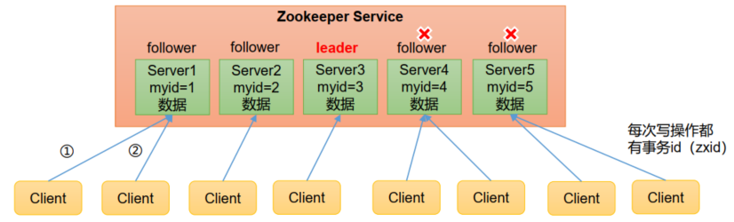
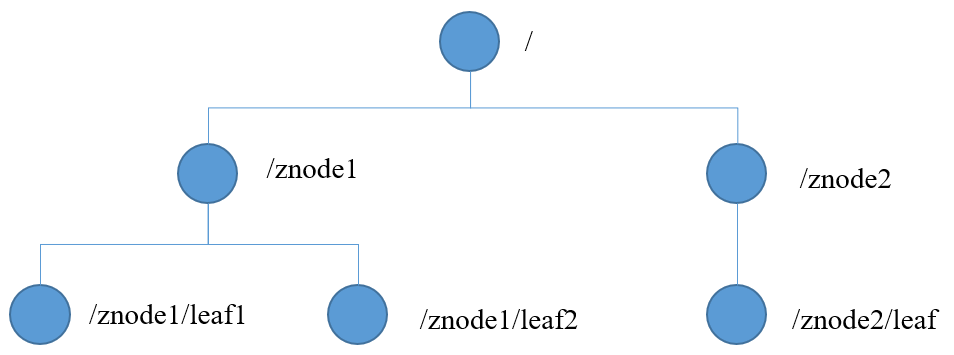
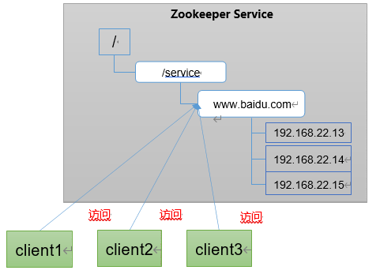
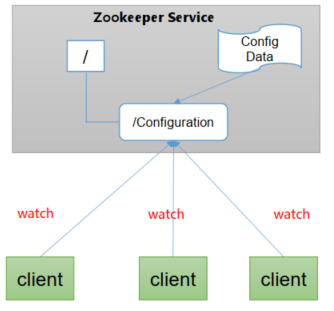
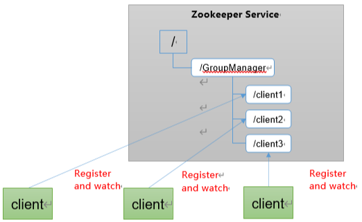
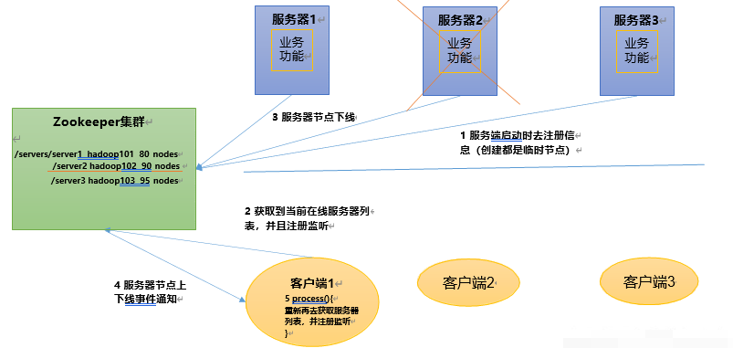
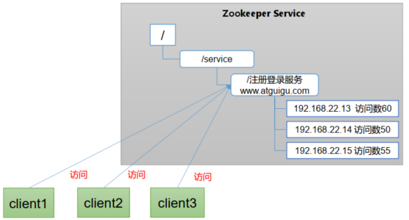
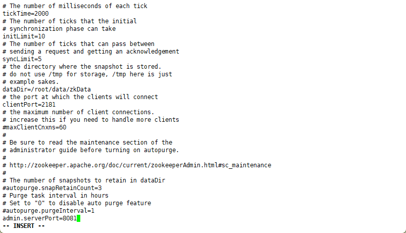
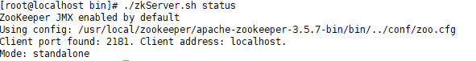
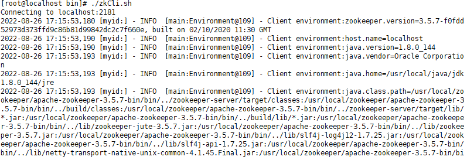

*Zookeeper 是一个开源的分布式的，为分布式框架提供协调服务的 Apache 项目。*
<!-- more -->

> - 在这个虚拟机中
> - 

## 第 1 章 zookeeper 介绍

### 1.1 介绍

#### 1.1.1 概述

Zookeeper 是一个开源的分布式的，为分布式框架提供协调服务的 Apache 项目。

#### 1.1.2 工作机制

Zookeeper 从设计模式角度来理解：是一个基于观察者模式设计的分布式服务管理框架， 它负责存储和管理大家都关心的数据， 然后接受观察者的注册， 一旦这些数据的状态发生变化， Zookeeper 就将负责通知已经在 Zookeeper 上注册的那些观察者做出相应的反应。
Zookeeper=文件系统+通知机制

#### 1.1.3 特点

1. Zookeeper：一个领导者（ Leader） ， 多个跟随者（ Follower） 组成的集群。
2. 集群中只要有半数以上节点存活， Zookeeper 集群就能正常服务。 所以 Zookeeper 适合安装奇数台服务器。
3. 全局数据一致：每个 Server 保存一份相同的数据副本， Client 无论连接到哪个 Server， 数据都是一致的。
4. 更新请求顺序执行， 来自同一个 Client 的更新请求按其发送顺序依次执行。
5. 数据更新原子性， 一次数据更新要么成功， 要么失败。
6. 实时性， 在一定时间范围内， Client 能读到最新数据。

#### 1.1.4 数据结构

ZooKeeper 数据模型的结构与 Unix 文件系统很类似，整体上可以看作是一棵树，每个节点称做一个 ZNode。每一个 ZNode 默认能够存储 1MB 的数据，每个 ZNode 都可以通过其路径唯一标识。

#### 1.1.4 应用场景

1. 统一命名服务：
   - 在分布式环境下，经常需要对应用/服务进行统一命名，便于识别。例如：IP 不容易记住，而域名容易记住。
   - 
2. 统一配置管理：
   - 分布式环境下，配置文件同步非常常见。一般要求一个集群中，所有节点的配置信息是一致的，比如 Kafka 集群。对配置文件修改后， 希望能够快速同步到各个节点上。
   - 配置管理可交由 ZooKeeper 实现。 可将配置信息写入 ZooKeeper 上的一个 Znode。 各个客户端服务器监听这个 Znode。一旦 Znode 中的数据被修改， ZooKeeper 将通知各个客户端服务器。
   - 
3. 统一集群管理：
   - 分布式环境中， 实时掌握每个节点的状态是必要的。可根据节点实时状态做出一些调整。
   - ZooKeeper 可以实现实时监控节点状态变化，可将节点信息写入 ZooKeeper 上的一个 ZNode。 监听这个 ZNode 可获取它的实时状态变化。
   - 
4. 服务器动态上下线：客户端能实时洞察到服务器上下线的变化。

   - 

5. 软负载均衡：在 Zookeeper 中记录每台服务器的访问数， 让访问数最少的服务器去处理最新的客户端请求
   - 

### 1.2 安装

#### 1.2.1 本地模式安装

1. 安装 jdk：【参见 linxu[Linux](https://www.yuque.com/zhuyuqi/bgdcfg/kh2ero?view=doc_embed&inner=OHHLN)】
2. 在/usr/local/目录下创建 zookeeper
3. 解压安装包至指定路径：`tar -zxvf apache-zookeeper-3.5.7-bin.tar.gz -C /usr/local/zookeeper/`
4. 进入`/usr/local/zookeeper/apache-zookeeper-3.5.7-bin/conf`目录，拷贝一份 zoo_sample.cfg，命名为 zoo.cfg
5. 在/root 目录下创建 root/data/zkData 文件夹：
   - 
6. 修改 zoo.cfg 文件，修改为：`dataDir=/root/data/zkData`
   - 注意：zookeeper3.5.7 及之后的版本会占用 8080 端口，需要按照如下修改：
     - 
7. 进入/usr/local/zookeper/apache-zookeeper-3.5.7-bin/bin 目录，启动 zookeeper：`./zkServer.sh start`
8. bin 目录下查看启动状态：`./zkServer.sh status`
   - 
9. 进入/usr/local/zookeper/bin 目录，启动 zookeeper 客户端：`./zkCli.sh`
   - 
   - 退出命令：quit
