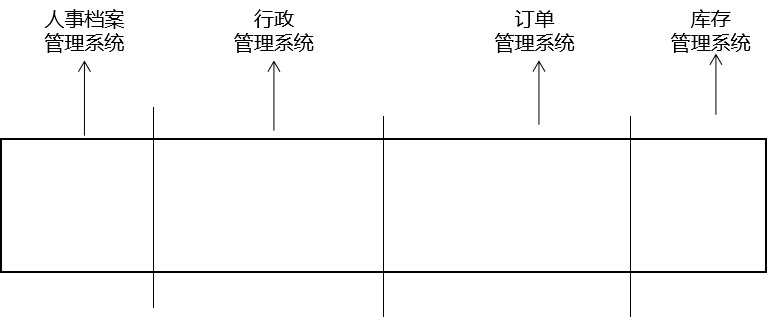
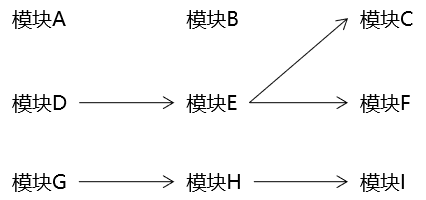
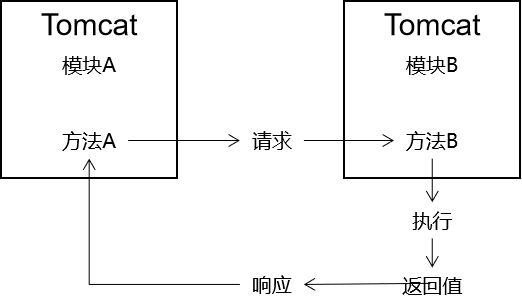
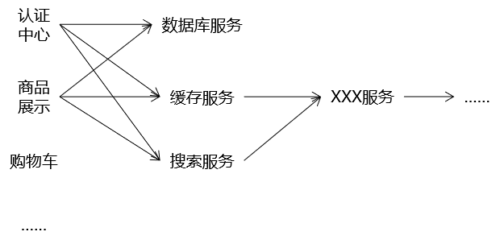
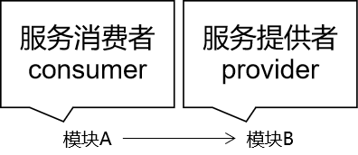
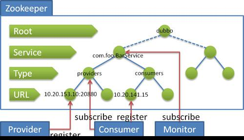
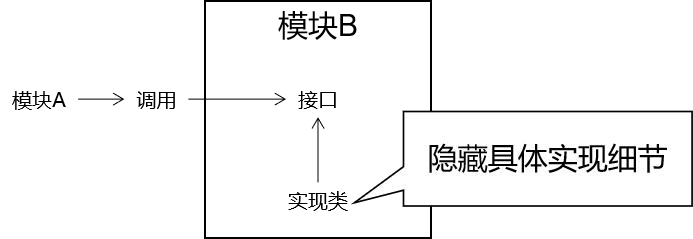
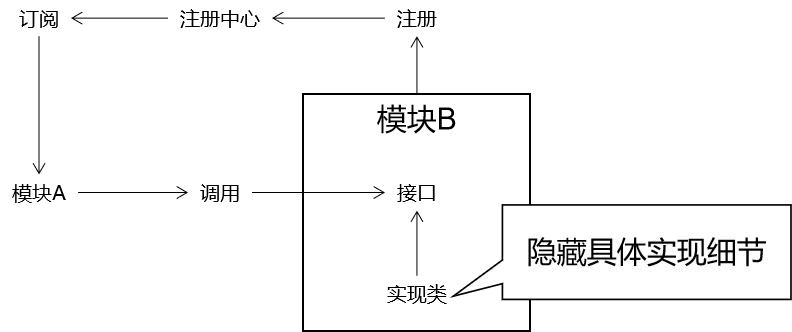
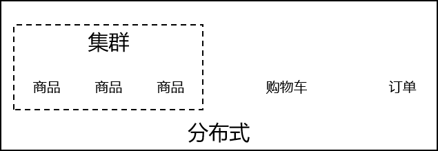

*分布式理论是应用部署的一种演进，是由传统的单一架构向微服务划分的技术实践理论指导。分布式理论下，主要考虑一致性（C:Consistency)，可用性（A: Availability）和分区容错性（P：Partition tolerance）这三个基本需求。*
<!-- more -->

## 1. 单一架构

### 1.0 概念

一个 war 包 → 运行在一个 Tomcat 上

### 1.1 演变

#### 1.1.1 水平拆分

把原来的一个工程拆分成多个模块分别进行开发，一定程度上提高了模块化程度。最后部署时还是一个 war 包。

#### 1.1.2 垂直拆分

按照业务功能把项目拆分成多个模块工程，但是由于彼此之间不存在模块之间的调用，所以还不能算作一个真正的分布式架构。相当于把一个项目拆分成多个小项目分别开发。

### 1.2 互联网时代的挑战

#### 1.2.1 高可扩

项目设计架构的时候要考虑到功能的持续更新。

#### 1.2.2 高性能

提高响应速度，系统处理一个请求的时间尽可能短，减少用户等待的时间，优化用户体验。

#### 1.2.3 高并发

用户访问量非常大时，会增加系统的并发压力。

## 2. 分布式架构

### 2.1 概念

一个项目拆分成多个模块工程，每个模块工程都是一个 war 包，运行在各自的 Tomcat 上，模块之间可以通过网络互相调用。

### 2.2 方法的远程调用

#### 2.2.1 本地调用

在同一个项目内部，不经过网络直接调用方法。不管是我们自己声明的方法还是第三方 jar 包中的方法都算本地调用。

#### 2.2.2 远程调用

本质是获取远程方法的执行结果。利用网络请求与响应。

#### 2.2.3 意义

对内：能够实现分布式架构
对外：能够调用第三方接口

### 2.3 思想

#### 2.3.1 SOA

ServiceOrientedArchitecture 面向服务的架构
在整个系统中，把相同的功能抽取出来作为一个服务，供系统中的其他模块调用，提高代码的复用性。

有了服务，就有了提供服务和使用服务的相对方。

#### 2.3.2 微服务

微服务是 SOA 的进一步发展。微服务强调的特征：独立、可部署。

### 2.4 技术演进

#### 2.4.1 WebService

解决应用程序之间的跨平台访问问题。 基于 SOAP/WSDL 协议， 让应用程序之间可以进行远程通信。

#### 2.4.2 Dubbo+Zookeeper

Dubbo： 基于 RPC 的远程过程调用框架。
Zookeeper： 基于树形目录结构、 异步通知机制的注册中心。

#### 2.4.3 spring boot+spring cloud

- SpringBoot： 开发具体微服务， 使用“场景启动器（starter） ” 快速整合第三
  方中间件
- SpringCloud： 提供的微服务架构整体管理的一站式解决方案
  - Eureka： 注册中心
  - Ribbon： 客户端负载均衡
  - Feign： 远程接口的声明式调用
  - Hystrix： 服务的熔断、 降级、 监控
  - Zuul： 网关

### 2.5 相关概念

#### 2.5.1 接口

分布式环境下的服务模块。

#### 2.5.2 远程接口的声明式调用

远程：调用方法会发送请求。
接口：上述功能模块。
声明式调用：只需要声明调用模块的对象。

#### 2.5.3 注册中心

远程接口的声明式调用之所以能够实现， 就是因为 Dubbo 或 Feign 这样的框架把服务的具体信息存入了注册中心， 对程序员在上层进行的具体代码编写全部屏蔽细节。

### 2.6 分布式架构的优缺点

#### 2.6.1 优点

- 模块化程度更高， 有利于分工
- 有利于提升项目性能
  - 整体提升：整个项目中每个模块都可以独占一台服务器， 整个项目分配到的服务器资源更多。
  - 局部提升：由于对项目进行了拆分， 所以可以有针对性的对项目中局部的模块进行专门的优化。
    - 纵向： 给当前模块所在的服务器增加硬件资源
    - 横向： 给当前模块配置集群

#### 2.6.2 缺点

- 结构复杂
  - 调用关系复杂
  - 部署复杂
- 数据不一致问题
  - Session 不一致问题
  - 分布式事务问题

### 2.7 分布式和集群

#### 2.7.1 相同点

都需要使用多台服务器

#### 2.7.2 不同点

分布式： 每台服务器上运行的模块不同——异构

集群： 每台服务器上运行模块相同——同构

