## 1. 虚拟机化和虚拟机比较

### 1.1 虚拟化比较

PVE和vmware esxi的异同

- 相同：都是将整个物理机虚拟化，安装不同的操作系统。
- 不同：

### 1.2 虚拟机比较

在没有可虚拟化硬件（物理整机）的情形下，可以使用vmware workstation安装pve和vmware esxi进行学习研究。

vmware和virtualbox的异同：

## 2. VMware使用

### 2.1 安装ProXmoX-VE(PVE)

[在VMware的虚拟机上安装ProXmoX-VE(PVE)](https://blog.csdn.net/somken/article/details/113735401?ydreferer=aHR0cHM6Ly9jbi5iaW5nLmNvbS8=)

按照教程操作即可。


上图的磁盘为创建虚拟机时，分配的虚拟机大小，即：

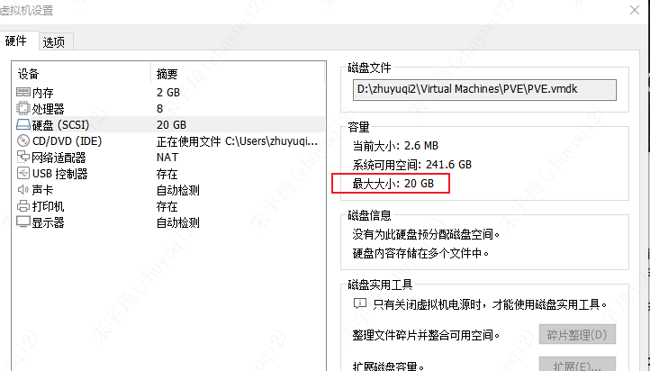

IP：

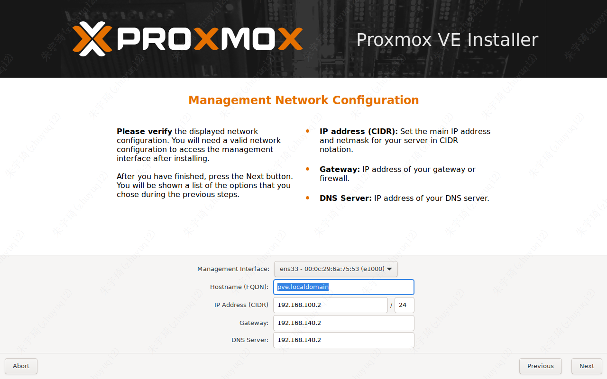

**主机ping不通虚拟机解决方案：**

1. 修改本机vmnet8网卡的网段与pve的网段（192.168.100.x）一致

   1. 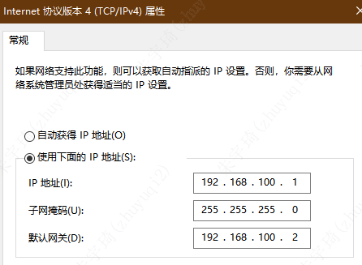
   2. 为什么是vmnet8，这是因为vmware的虚拟机网络设置决定的。

      1. 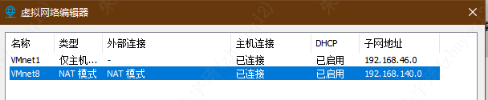
      2. 这里虚拟机的网段在140，与pve的不一致，虽然不影响pve的使用，但建议将两个网段设置一致，因为其他的虚拟机不行。

2. 检查vmware的nat模式的网关：

   1. 

3. 重启网卡。

总结：这里可以看到虚拟机的网络设置网段为`192.168.140.x`，但网卡的网段设置的为`192.168.100.x`。二者并不一致，并以网卡的网段为准。

### 2.2 安装windows10

#### 2.2.1 网络设置

默认情况下，网段与vmnet8指定的网段一致。但是自动获取IP，会经常变动。

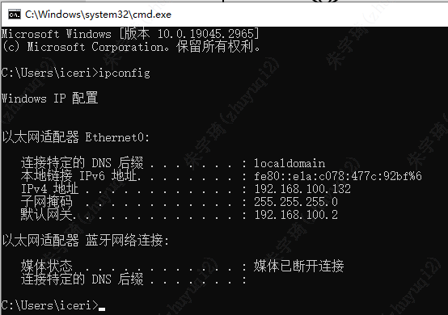

如果发生物理机不可以ping通虚拟机，但虚拟机可以ping通物理机，则需要关闭虚拟机的防火墙。

#### 2.2.2 远程连接

1. 开启虚拟机允许远程连接。
2. 关闭虚拟机防火墙。

### 2.3 安装linux

#### 2.3.1 常用linux

[常用linux对比](https://mp.weixin.qq.com/s/iOB2FluBO5Yy0FV21Qrklw)

以下是对文章《适合初学者的最佳Linux发行版等》的总结表格：

| 类别 | 发行版名称 | 描述与特点 | 链接 |
| --- | --- | --- | --- |
| 适合初学者的最佳Linux发行版 | Ubuntu | 开箱即用、用户界面友好、庞大的在线社区 | [Ubuntu下载页面](https://ubuntu.com/download/desktop) |
|  | Linux Mint | 类似于Windows的布局、简洁易用、基于Ubuntu | [Linux Mint官网](https://www.linuxmint.com/) |
|  | elementary OS | 美观的用户界面、类似于macOS、基于Ubuntu | [elementary OS官网](https://elementary.io/) |
|  | MX Linux | 性能卓越、简洁易用、开箱即用的MX工具 | [MX Linux官网](https://mxlinux.org/) |
|  | Zorin OS | 美观且直观的桌面体验、基于Ubuntu、多种版本选择 | [Zorin OS官网](https://zorinos.com/) |
|  | Pop!_OS | 开发者和其他专业人士的选择、基于Ubuntu、直观的COSMIC桌面环境 | [Pop!_OS官网](https://system76.com/pop) |
| 最佳Linux服务器发行版 | Ubuntu Server | 为服务器提供不同选择、云部署中最受欢迎的Linux发行版 | - |
|  | Red Hat Enterprise Linux | 面向企业和组织的顶级Linux平台、有一大批企业用户依赖 | [Red Hat官网](https://www.redhat.com/en/technologies/linux-platforms/enterprise-linux) |
|  | SUSE Linux Enterprise Server | 最受欢迎的云服务器解决方案之一、需要订阅服务以获得优先支持 | [SUSE Linux Enterprise Server官网](https://www.suse.com/products/server/) |
|  | CentOS Stream | Red Hat Enterprise Linux的上游版本、CentOS的替代方案 | - |
| 适合旧电脑的最佳Linux发行版 | Puppy Linux | 体积最小之一、可以轻松运行在旧硬件配置上 | [Puppy Linux官网](http://puppylinux.com/) |
|  | Solus Budgie | 轻量级桌面操作系统、提供GNOME或MATE等桌面环境选择 | - |
|  | Bodhi Linux | 基于Ubuntu构建、在较旧的配置上运行良好、直观的Moksha桌面 | [Bodhi Linux官网](http://www.bodhilinux.com/) |
|  | antiX | 专为新旧电脑量身定制的轻量级Linux发行版、基于Debian | [antiX官网](https://antixlinux.com/) |
|  | Sparky Linux | 为低端系统量身定制、提供极快的体验、多个特别版选择 | [Sparky Linux官网](https://sparkylinux.org/) |
| 高级用户的最佳Linux发行版 | Arch Linux | 简单但功能强大、学习曲线陡峭、需要自行配置系统并安装软件包 | [Arch Linux官网](https://www.archlinux.org/) |
|  | Gentoo | 轻量级发行版、需要编译源代码、适合具备一定技术知识的用户 | [Gentoo官网](https://www.gentoo.org/) |
|  | Slackware | 最古老的Linux发行版之一、适合愿意通过编译或开发软件来搭建环境的用户 | - |
| 最佳多用途Linux发行版 | Fedora | 提供桌面和服务器两个独立版本、快速响应、用户友好 | [Fedora官网](https://getfedora.org/) |
|  | Manjaro | 基于Arch Linux、对新手友好、用户界面不错、内置有用的GUI应用程序 | [Manjaro官网](https://manjaro.org/) |
|  | Debian | 桌面和服务器领域的理想选择、可能不是最适合初学者的操作系统 | [Debian官网](http://www.debian.org/) |

#### 2.3.2 安装ubuntu无图形界面版

即安装ubuntu-24.04.1-live-server-amd64

- 账号：zyq，密码：918049
- 账号：root，密码：918049

默认root账户无密码，不能启用，需要sudo passwd root，设置密码后使用

#### 2.3.3 安装Linux Mint

- 账号：zyq，密码：918049
- 账号：root，密码：918049

**安装idea：**

1. 下载idea
2. 解压到/opt文件下
3. `vim ~/.bashrc`编辑环境变量，末尾添加：

   ```bash
   export IDEA_HOME=/opt/idea
   export PATH=:$PATH:${IDEA_HOME}/bin
   ```

4. 刷新环境变量：`source ~/.bashrc`

## 3. Virtualbox使用

### 3.1 Vagrant安装虚拟机

vagrant是一款虚拟机管理工具，使用它可以快速管理（创建、删除等）虚拟机。

1. vagrant安装虚拟机过程中，下载的内容会存放在：`C:\Users\zhuyuqi2\.vagrant.d` 的 `boxes` 文件夹中，为了避免该文件过大，可以在系统环境变量中设置`VAGRANT_HOME`， 修改`.vagrant.d`的路径：

2. vagrant安装虚拟机过程中，下载的内容会存放在：`C:\Users\zhuyuqi2\.vagrant.d` 的 `boxes` 文件夹中，为了避免该文件过大，可以在系统环境变量中设置`VAGRANT_HOME`， 修改`.vagrant.d`的路径：

3. 在需要生成 `Vagrantfile` 文件的位置执行：`vagrant init centos7 https://mirrors.ustc.edu.cn/centos-cloud/centos/7/vagrant/x86_64/images/CentOS-7.box` + `vagrant up`命令，即可安装虚拟机，虚拟机的安装路径在virtualbox设定的位置，以后启动、运行虚拟机，都需要进入该文件夹，为了方便操作，可以直接将该文件生成在cmd的默认目录：


#### 3.1.1 ssh连接虚拟机方式一

默认创建的虚拟机，与物理机之间为NAT模式：虚拟机可以ping通物理机，但物理机ping不同虚拟机。使用的网卡为eth0。

但virtualbox提供了端口转发功能，使用`127.0.0.1:2222`即可实现连接。

同时该模式不影响虚拟机访问互联网。

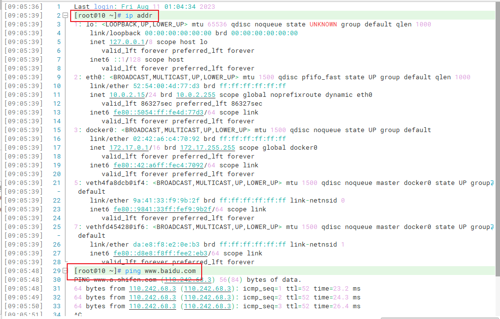

想要访问虚拟机内部的应用，使用端口转发即可。比如：原本需要访问`https://ip:9443`，现在可以访问`https://127.0.0.1:19443`

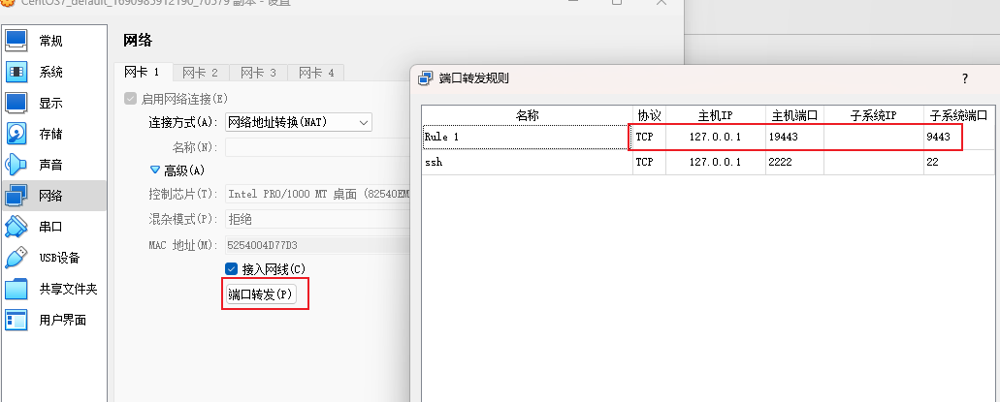

#### 3.1.2 ssh连接虚拟机方式二

要想虚拟机和主机互相ping通，需要给虚拟机创建host-only网络。

修改`Vagrantfile`中的ip地址，改为`192.168.56.10`【34行】，在启动虚拟机后会自动创建一个host-only网络。


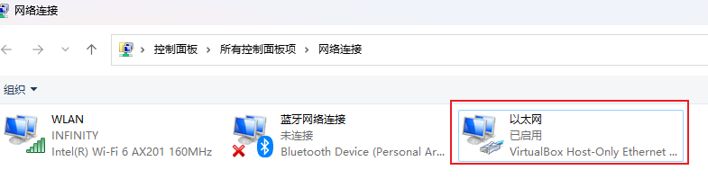

> *vagrantfile文件中的ip地址为192.168.33.10，但不建议使用此地址。因为在未设置物理机以太网host-only地址为固定地址时，host-noly网卡的网段为192.168.56.x，可以在物理机使用ipconfig查看：*  
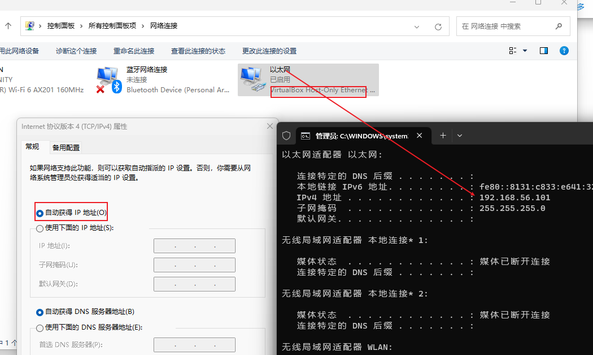

在本机cmd终端下执行`vagrant reload`重启虚拟机


连接虚拟机，查看虚拟机的ip地址


> 注：物理机的host-only网卡是自动获取ip地址的，为了稳定性，建议设为固定ip，结合上述步骤，设置如下：  
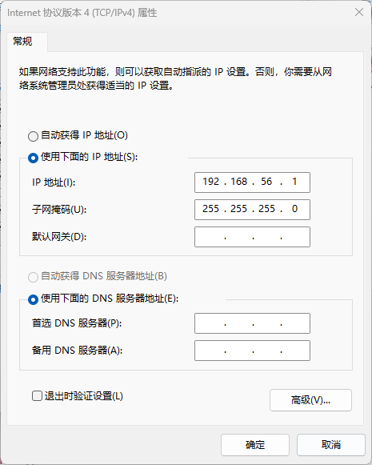

设置允许账号密码登录：vagrant默认只设置允许ssh连接，为了方便操作，可以设置允许账号密码登录。

- `vi /etc/ssh/sshd_config`
- 修改`PasswordAuthentication no`为yes。

  - 

- 重启服务`service sshd restart` 或 `systemctl sshd restart service`

连接服务器：

| 序号 | 账号    | 密码    |
| ---- | ------- | ------- |
| 1    | vagrant | vagrant |
| 2    | root    | vagrant |

### 3.2 主机和虚拟机互相复制

[【详细步骤】使用VirtualBox安装免费的官方Windows10虚拟机 - 知乎 (zhihu.com)](https://zhuanlan.zhihu.com/p/184204996)

[解决VirtualBox共享粘贴板功能无效问题_virtualbox无法共享粘贴板_盐焗咸鱼的博客-CSDN博客](https://blog.csdn.net/qq_33215865/article/details/88916461)

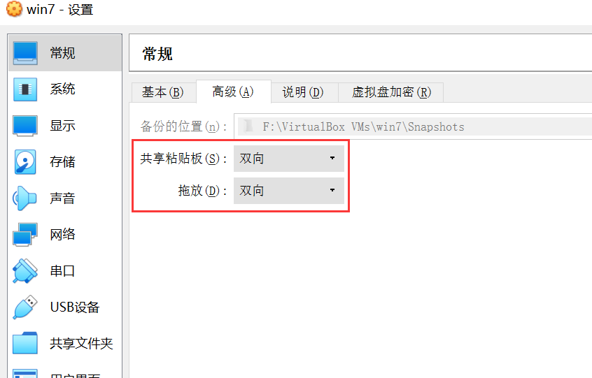

## 4. 主机不能ping通虚拟机的解决方案

下图仅供参考： 
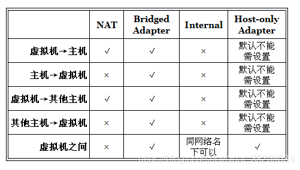

### 