## 虚拟机化和虚拟机比较

### 虚拟化比较

PVE和vmware esxi的异同

- 相同：都是将整个物理机虚拟化，安装不同的操作系统。
- 不同：

### 虚拟机比较

在没有可虚拟化硬件的情形下，可以使用vmware workstation安装pve和vmware esxi。

vmware和virtualbox的异同：

## VMware

### 安装ProXmoX-VE(PVE)

[在VMware的虚拟机上安装ProXmoX-VE(PVE)_vmware安装pve_没刮胡子的博客-CSDN博客](https://blog.csdn.net/somken/article/details/113735401?ydreferer=aHR0cHM6Ly9jbi5iaW5nLmNvbS8=)

按照教程操作即可。

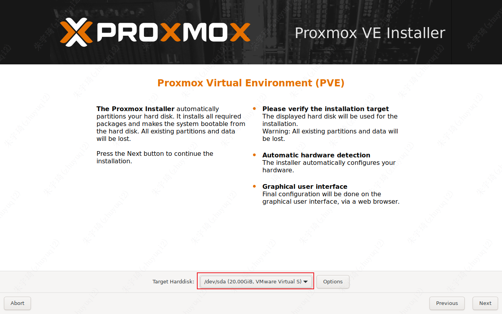

上图的磁盘为创建虚拟机时，分配的虚拟机大小，即：

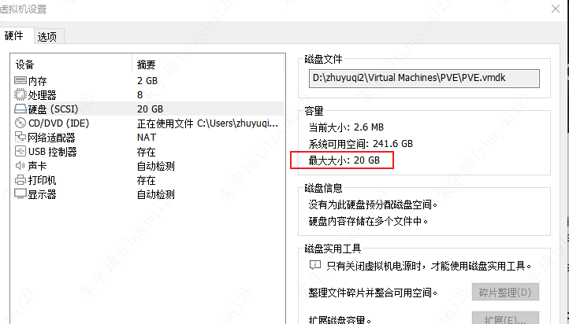

IP：

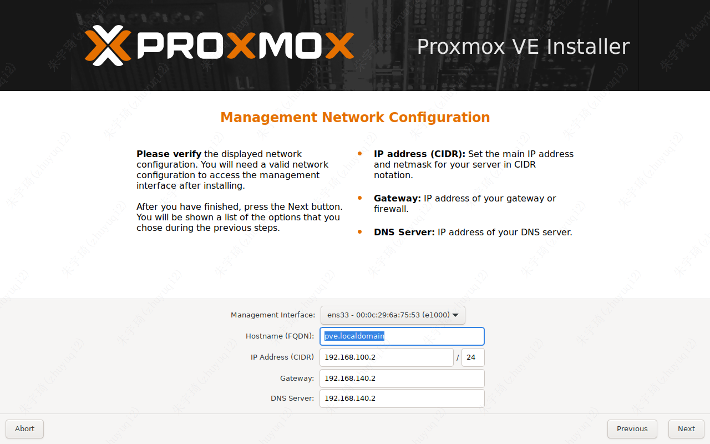

主机ping不通虚拟机解决方案：

1. 修改本机vmnet8网卡的网段与pve的网段（192.168.100.x）一致

   1. 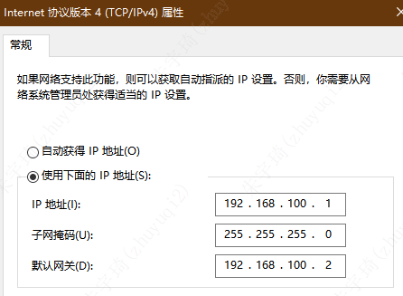
   2. 为什么是vmnet8，这是因为vmware的虚拟机网络设置决定的。

      1. 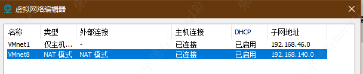
      2. 这里虚拟机的网段在140，与pve的不一致，虽然不影响pve的使用，但建议将两个网段设置一致，因为其他的虚拟机不行。

2. 检查vmware的nat模式的网关：

   1. 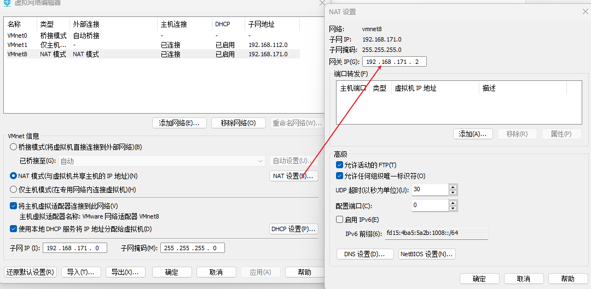

3. 重启网卡。

总结：这里可以看到虚拟机的网络设置网段为`192.168.140.x`，但网卡的网段设置的为`192.168.100.x`。二者并不一致，并以网卡的网段为准。

### 安装windows10

#### 网络设置

默认情况下，网段与vmnet8指定的网段一致。但是自动获取IP，会经常变动。

如果发生物理机不可以ping通虚拟机，但虚拟机可以ping通物理机，则需要关闭虚拟机的防火墙。

#### 远程连接

1. 开启虚拟机允许远程连接。
2. 关闭防火墙。

## Virtualbox

### Vagrant安装虚拟机

vagrant是一款虚拟机管理工具，使用它可以快速管理（创建、删除等）虚拟机。

1. 虚拟机安装地址设置：

2. vagrant安装虚拟机过程中，下载的内容会存放在：`C:\Users\zhuyuqi2\.vagrant.d` 的 `boxes` 文件夹中，为了避免该文件过大，可以在系统环境变量中设置`VAGRANT_HOME`， 修改`.vagrant.d`的路径：

3. 在需要生成 `Vagrantfile` 文件的位置执行：`vagrant init centos7 https://mirrors.ustc.edu.cn/centos-cloud/centos/7/vagrant/x86_64/images/CentOS-7.box` + `vagrant up`命令，即可安装虚拟机，虚拟机的安装路径在virtualbox设定的位置，以后启动、运行虚拟机，都需要进入该文件夹，为了方便操作，可以直接将该文件生成在cmd的默认目录：

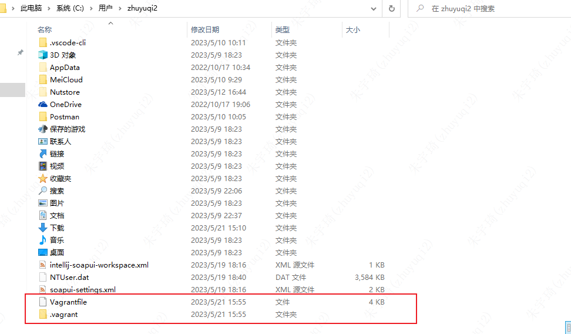

#### ssh连接虚拟机方式一

默认创建的虚拟机，与物理机之间为NAT模式：虚拟机可以ping通物理机，但物理机ping不同虚拟机。使用的网卡为eth0。

但virtualbox提供了端口转发功能，使用`127.0.0.1:2222`即可实现连接。

同时该模式不影响虚拟机访问互联网。

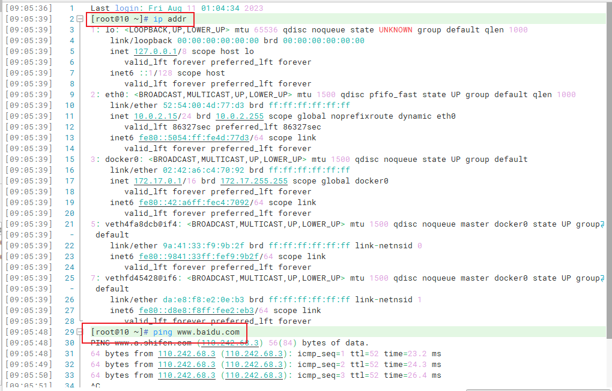

想要访问虚拟机内部的应用，使用端口转发即可。比如：原本需要访问`https://ip:9443`，现在可以访问`https://127.0.0.1:19443`

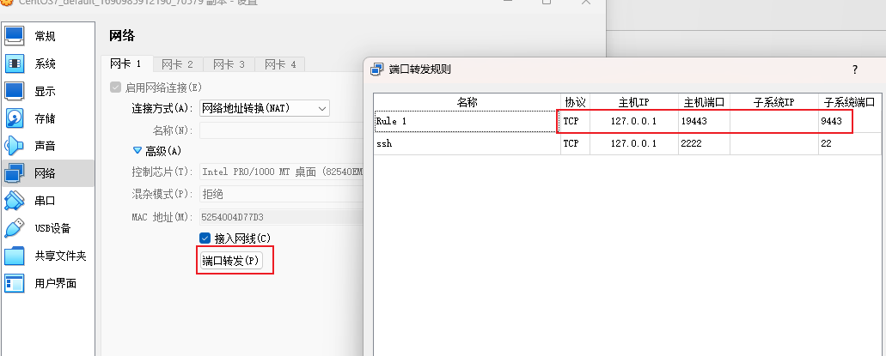

#### ssh连接虚拟机方式二

要想虚拟机和主机互相ping通，需要给虚拟机创建host-only网络。

修改`Vagrantfile`中的ip地址，改为`192.168.56.10`【34行】，在启动虚拟机后会自动创建一个host-only网络。

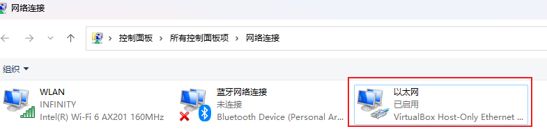

> *vagrantfile文件中的ip地址为192.168.33.10，但不建议使用此地址。因为在未设置物理机以太网host-only地址为固定地址时，host-noly网卡的网段为192.168.56.x，可以在物理机使用ipconfig查看：*  
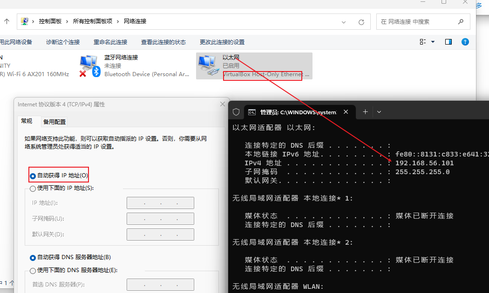

在本机cmd终端下执行`vagrant reload`重启虚拟机

连接虚拟机，查看虚拟机的ip地址

> 注：物理机的host-only网卡是自动获取ip地址的，为了稳定性，建议设为固定ip，结合上述步骤，设置如下：  
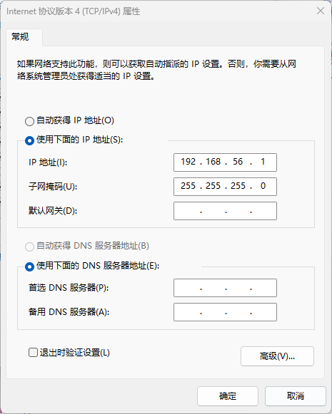

设置允许账号密码登录：vagrant默认只设置允许ssh连接，为了方便操作，可以设置允许账号密码登录。

- `vi /etc/ssh/sshd_config`
- 修改`PasswordAuthentication no`为yes。

  - 

- 重启服务`service sshd restart` 或 `systemctl sshd restart service`

连接服务器：

| 序号 | 账号    | 密码    |
| ---- | ------- | ------- |
| 1    | vagrant | vagrant |
| 2    | root    | vagrant |

**小总结：**

### 主机和虚拟机互相复制

[【详细步骤】使用VirtualBox安装免费的官方Windows10虚拟机 - 知乎 (zhihu.com)](https://zhuanlan.zhihu.com/p/184204996)

[解决VirtualBox共享粘贴板功能无效问题_virtualbox无法共享粘贴板_盐焗咸鱼的博客-CSDN博客](https://blog.csdn.net/qq_33215865/article/details/88916461)

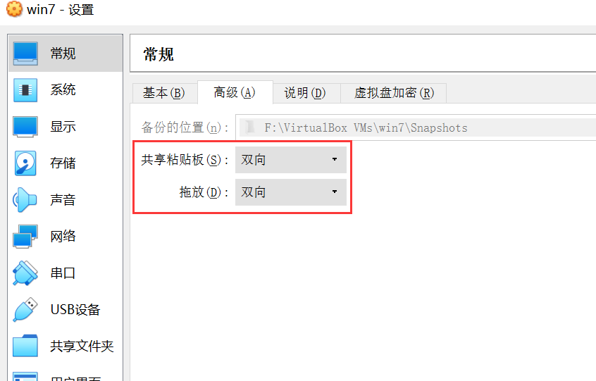

## 主机不能ping通虚拟机的解决方案

下图仅供参考： 
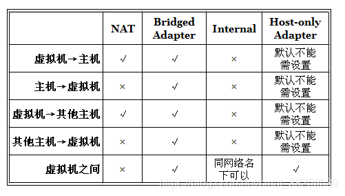

### 