## 1. MQTT简介

### 1.1 MQTT初识

MQTT（Message Queuing Telemetry Transport）由IBM于1999年开发的一种基于**发布订阅模式的轻量级的消息传输协议**！

发布订阅模式是一种传统的客户端-服务器架构的`替代方案`，因为一般传统的客户端-服务器是客户端能够直接和服务器进行通信完成消息的传输。发布订阅模式会将发送消息的发布者publisher与接收消息的订阅者subscribers进行`分离`，publisher与subscribers 并不会直接通信，他们甚至都不清楚对方是否存在，他们之间的交流由

第三方组件`broker`代理。

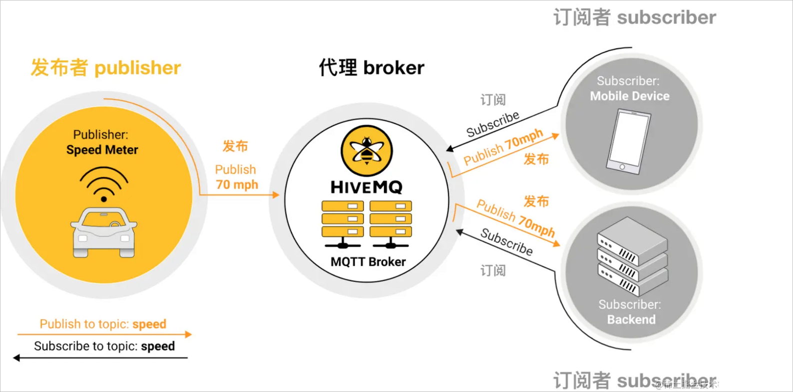

pub/sub 最重要的方面是 publisher 与 subscriber 的解藕，这种耦合度有下面二个维度：

1、空间解耦：publisher 与 subscriber 并不知道对方的存在。

2、时间解藕：publisher 与 subscriber 并不一定需要同时运行。

MQTT它在**物联网**应用中广受欢迎，能够实现传感器、执行器和其它设备之间的高效通信。非常适用于资源受限的设备和低带宽、高延迟或不稳定的网络环境。

### 1.2 MQTT特性

它的主要特点包括：

1、**轻量级：**物联网设备通常在处理能力、内存和能耗方面受到限制。`MQTT开销低、报文小`的特点使其非常适合这些设备，因为它消耗更少的资源，即使在有限的能力下也

能实现高效的通信。

2、**可靠：**物联网网络常常面临高延迟或连接不稳定的情况。`MQTT支持多种QoS等级、会话感知和持久连接`，即使在困难的条件下也能保证消息的可靠传递，使其非常适合

物联网应用。

3、**安全通信：**安全对于物联网网络至关重要，因为其经常涉及敏感数据的传输。为确保数据在传输过程中的机密性，`MQTT提供传输层安全（TLS）和安全套接层（SSL）`

`加密功能`。此外，MQTT 还通过用户名/密码凭证或客户端证书提供身份验证和授权机制，以保护网络及其资源的访问。

4、**双向通信：**MQTT的发布-订阅模式为设备之间提供了无缝的双向通信方式。`客户端既可以向主题发布消息，也可以订阅接收特定主题上的消息`，从而实现了物联网生态

系统中的高效数据交换，而无需直接将设备耦合在一起。这种模式也简化了新设备的集成，同时保证了系统易于扩展。

5、**语言支持：**物联网系统包含使用各种编程语言开发的设备和应用。`MQTT具有广泛的语言支持`，使其能够轻松与多个平台和技术进行集成，从而实现了物联网生态系统中

的无缝通信和互操作性。常见编程语言的支持：PHP、Node.js、Python、Golang、Node.js、java等。

### 1.3 MQTT核心概念

> MQTT客户端

任何运行`MQTT客户端库[MQTT开发工具包]`的应用或设备都是MQTT客户端。例如使用MQTT的即时通讯应用是客户端，使用MQTT上报数据的各种传感器是客户端，各种MQTT测试工具也是客户端。

> MQTT Broker

MQTT Broker是负责处理客户端请求的关键组件，包括建立连接、断开连接、订阅和取消订阅等操作，同时还负责消息的转发。一个高效强大的MQTT Broker能够轻松应对海量连接和百万级消息吞吐量，从而帮助物联网服务提供商专注于业务发展，快速构建可靠的MQTT应用。

> 主题

MQTT主题本质上是一个UTF-8编码的字符串，是MQTT协议进行消息路由的基础。可以理解为就是通过主题`对消息进行分类`。MQTT主题类似URL路径，使用斜杠`/`进行分层：

```shell
chat/room/1
sensor/10/temperature
```

为了避免歧义且易于理解，通常不建议主题以`/`开头或结尾，例如 `/chat` 或 `chat/`。MQTT主题不需要提前创建。MQTT 客户端在订阅或发布时即自动的创建了主题，开发者无需再关心主题的创建，并且也不需要手动删除主题。

## 2 MQTT快速入门

### 2.1 EMQX概述

**EMQX**，是一款实现了MQTT协议的，开源的MQTT`消息代理软件`。MQTT定义了消息通讯的规则和流程，而EMQX则是遵循这些规则的软件，使得设备能够依据MQTT协议进行有效通信。在新版本的EMQX中同时支持MQTT`3.1.1协议和5.0协议`。

官网地址：<https://www.emqx.com/zh>

其他代理软件：<https://www.emqx.com/en/blog/the-ultimate-guide-to-mqtt-broker-comparison>

### 2.2 EMQX部署

选择EMQX企业版进行部署：<https://docs.emqx.com/zh/enterprise/latest/deploy/install-docker.html>

```shell
# 移除旧版本docker
sudo yum remove docker \
                  docker-client \
                  docker-client-latest \
                  docker-common \
                  docker-latest \
                  docker-latest-logrotate \
                  docker-logrotate \
                  docker-engine

# 配置docker yum源。
sudo yum install -y yum-utils
sudo yum-config-manager \
--add-repo \
http://mirrors.aliyun.com/docker-ce/linux/centos/docker-ce.repo

# 安装 最新 docker
sudo yum install -y docker-ce docker-ce-cli containerd.io docker-buildx-plugin docker-compose-plugin

# 启动& 开机启动docker； enable + start 二合一
systemctl enable docker --now

# 配置加速
sudo mkdir -p /etc/docker
sudo tee /etc/docker/daemon.json <<-'EOF'
{
  "registry-mirrors": ["https://82m9ar63.mirror.aliyuncs.com"]
}
EOF

sudo systemctl daemon-reload
sudo systemctl restart docker
```

```shell
docker run -d --name emqx-enterprise \
  -p 1883:1883 -p 8083:8083 \
  -p 8084:8084 -p 8883:8883 \
  -p 18083:18083 \
  -v emqx_data:/opt/emqx/data \
  -v emqx_log:/opt/emqx/log \
  -v emqx_etc:/opt/emqx/etc \
  emqx/emqx-enterprise:5.6.1
```

常见端口介绍：

| 端口号 | 说明                        |
| ------ | --------------------------- |
| 1883   | TCP端口                     |
| 8083   | WebSocket端口               |
| 8084   | WebSocket Secure 端口       |
| 8883   | SSL/TLS 端口                |
| 18083  | Broker的Dashboard访问端口号 |

### 2.3 Dashboard介绍

EMQX 提供了一个内置的管理控制台，即 EMQX Dashboard。方便用户通过 Web 页面就能轻松管理和监控 EMQX 集群，并配置和使用所需的各项功能。

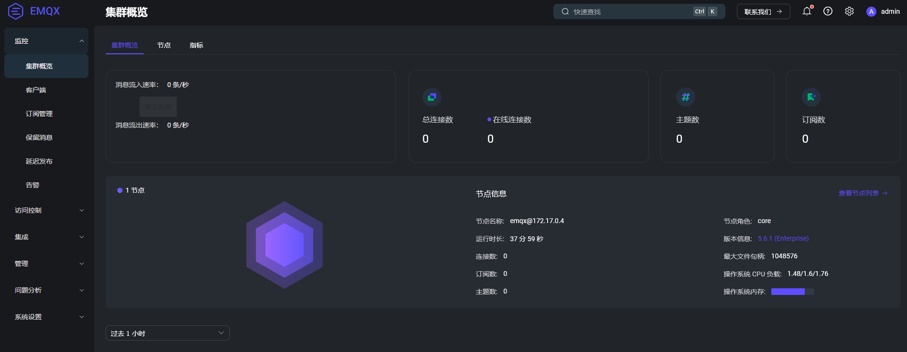

**主要功能：**

`1、监控和管理EMQX中的相关信息与数据` ：支持查看运行中的EMQX集群的整体连接数，订阅主题数，消息收发数量和流入流出速率，还包括节点列表和节点信息和一些系统指标信息，同时也可以对一些客户端连接与订阅数据进行查看与管理。

`2、访问控制（认证与授权）管理` ：支持通过可视化的方式来新增和配置管理EMQX 中的认证与授权机制。

`3、数据集成` ：使用强大的基于SQL的规则引擎和数据桥或流量编辑器的可视化功能进行低代码数据处理和集成，以帮助实时提取、过滤、丰富、转换和存储 MQTT 数据。

`4、在线配置热更新`：支持在线修改和更新包括 MQTT、日志，监听器等配置项，更新成功后即刻生效。

**首次访问：**

访问地址：<http://localhost:18083/>

用户名和密码：`admin/pubic`

可以通过CLI的`admins`命令进行密码重置:

```shell
./bin/emqx ctl admins passwd <Username> <Password>
```

### 2.4 EMQX客户端

#### 2.4.1 MQTTX简介

**MQTTX** 是EMQX开源的一款跨平台 MQTT 5.0 客户端工具，它支持 macOS, Linux 并且支持自定义脚本模拟测试、MQTT 消息格式转换、日志记录等多个功能。

MQTTX 包含三种类型的工具：

1、MQTTX Desktop：MQTTX Desktop是一款跨平台的 MQTT 桌面客户端工具。

2、MQTTX CLI：MQTTX CLI是EMQ开源的一款 MQTT 5.0 命令行客户端工具

3、MQTT Web：MQTTX Web是一款基于浏览器访问客户端工具。

官网地址：<https://mqttx.app/zh>

#### 2.4.2 MQTTX Desktop的使用

具体步骤：

1、下载并安装MQTTX Desktop： <https://mqttx.app/zh/downloads?os=windows>

2、新建链接

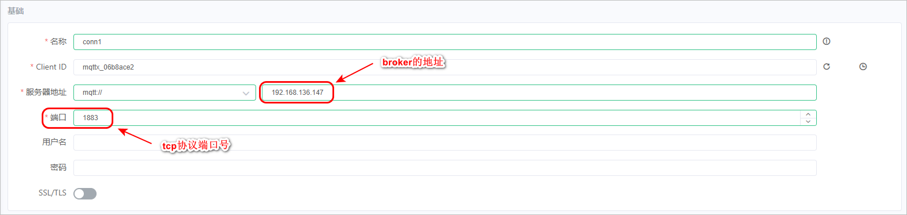

3、输入主题名称发送消息

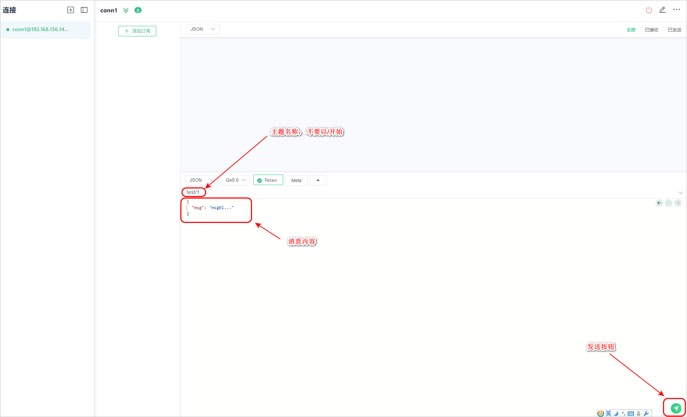

4、创建新链接订阅主题

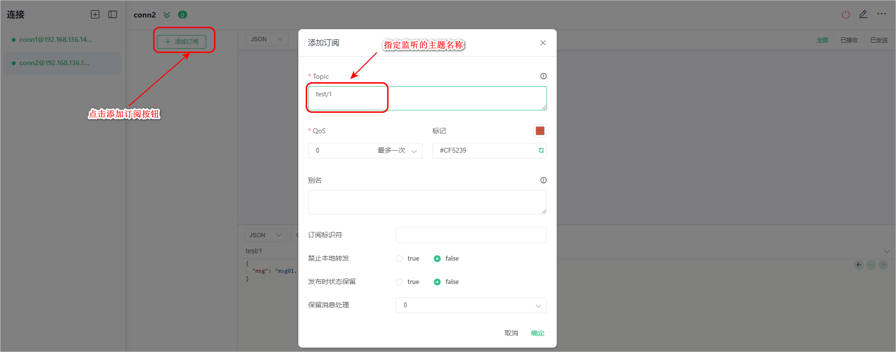

注意：

1、发送消息的时候没有选择Retain，那么在订阅该主题之前所发送的消息不能被客户端接收到

2、可以通过Dashboard来管理链接和订阅信息

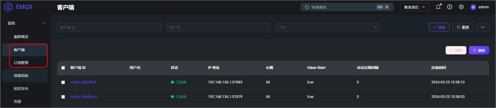

#### 2.2.3 MQTTX CLI的使用

具体步骤：

1、下载MQTTX CLI：<https://mqttx.app/zh/downloads?os=windows>

2、建立链接订阅主题

```sell
mqttx-cli-win-x64.exe sub -t 'test/1' -h 192.168.136.147 -p 1883  -v
```

`-t`：订阅主题

`-h`：服务器地址，填写对应监听器的IP地址，默认为`localhost`

`-p`：服务器端口，默认为`1883`

`-v`：在接收到的Payload前显示当前Topic

3、向主题发送消息

```shell
mqttx-cli-win-x64.exe pub -t 'test/1' -q 0 -h 192.168.136.147 -p 1883 -m "from MQTTX CLI"
```

#### 2.2.4 MQTTX Web的使用

使用 MQTTX Web 进行测试操作基本上与使用MQTTX Desktop相同。

```shell
docker pull emqx/mqttx-web
docker run -d --name mqttx-web -p 80:80 emqx/mqttx-web
```

## 3 MQTT控制报文

### 3.1 控制报文简介

报文是网络中交换与传输的数据最小单元，通俗来讲就是站点一次性要发送的`数据块`。它包含了将要发送的完整数据信息，其长短不一致，长度不限且可变。MQTT 客户端

和服务端通过交换控制报文来完成它们的工作，比如订阅主题和发布消息。

### 3.2 常见的控制报文

MQTT 目前定义了 15 种控制报文类型，如果按照功能进行分类，我们可以将这些报文分为连接、发布、订阅三个类别：

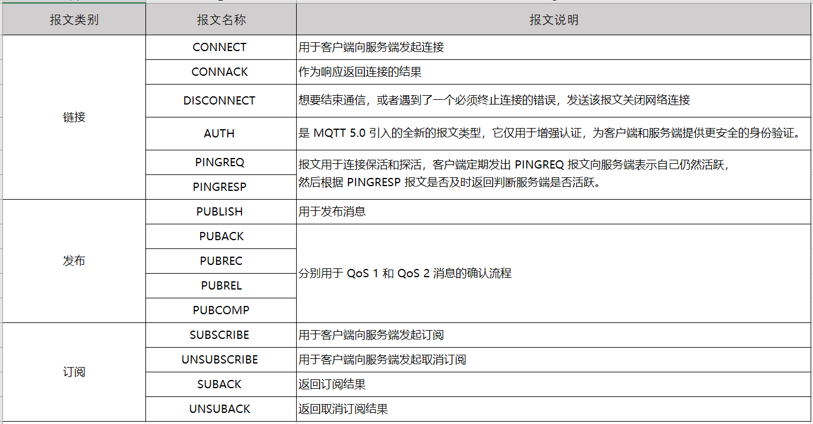  

### 3.3 MQTT报文格式

在 MQTT 中，无论是什么类型的控制报文，它们都由**固定报头、可变报头和有效载荷**三个部分组成。

`固定报头固定存在于所有控制报文中`，`而可变报头和有效载荷是否存在以及它们的内容则取决于具体的报文类型。`例如用于维持连接的 PINGREQ 报文就只有一个固定报

头，用于传递应用消息的 PUBLISH 报文则完整地包含了这三个部分。


#### 3.3.1 固定报头

固定报头由报文类型、标识位和报文剩余长度三个字段组成。


> 报文类型

占4个bit位，是一个无符号的整数

常见的报文类型：<https://docs.oasis-open.org/mqtt/mqtt/v5.0/os/mqtt-v5.0-os.html#_Toc3901022>

> 标识位

占4个bit位，不过到 MQTT 5.0 为止，只有 `PUBLISH` 报文的这四个比特位被赋予了明确的含义：

1、Bit 3：DUP，表示当前 PUBLISH 报文是否是一个重传的报文。

2、Bit 2,1：QoS，表示当前 PUBLISH 报文使用的服务质量等级。

3、Bit 0：Retain，表示当前 PUBLISH 报文是否是一个保留消息。

其他所有的报文中，这 4 位都仍是保留的。

> 剩余长度

剩余长度指示了当前控制报文剩余部分的字节数，也就是`可变报头和有效载荷`这两个部分的长度。MQTT 控制报文的总长度= 固定报头的长度 + 剩余长度。


#### 3.3.2 可变报头

`可变报头的内容取决于具体的报文类型。`

举例：

1、CONNECT 报文的可变报头按顺序包含了协议名、协议级别、连接标识、Keep Alive 和属性这五个字段

2、PUBLISH 报文的可变报头则按顺序包含了主题名、报文标识符和属性这三个字段。

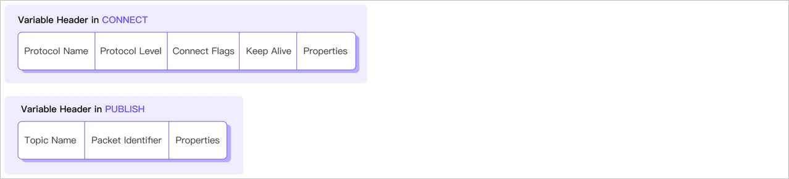

属性是 MQTT 5.0 引入的一个概念。属性字段基本上都是可变报头的最后一部分，`由属性长度和紧随其后的一组属性组成`，这里的属性长度指的是后面所有属性的总长度


所有的属性都是可选的，因为它们通常都有一个默认值，如果没有任何属性，那么属性长度的值就为0。属性通常都是为了某个专门的用途而设计的，不同的报文所支持的属

性都是不一样的，具体的对应情况可以查看官网地址：<https://docs.oasis-open.org/mqtt/mqtt/v5.0/os/mqtt-v5.0-os.html#_Toc3901027>

#### 3.3.3 有效载荷

有效载荷是用于实现对应报文的核心功能。

举例：

1、在 PUBLISH 报文中，Payload 用于承载具体的应用消息内容，这也是 PUBLISH 报文最核心的功能。

2、在 SUBSCRIBE 报文中，Payload 包含了想要订阅的主题以及对应的订阅选项，这也是 SUBSCRIBE 报文最主要的工作。

### 3.4 报文验证

接下来我们通过**Wireshark**工具，抓取一下各种通讯操作所涉及到的报文。

**链接相关报文验证:**

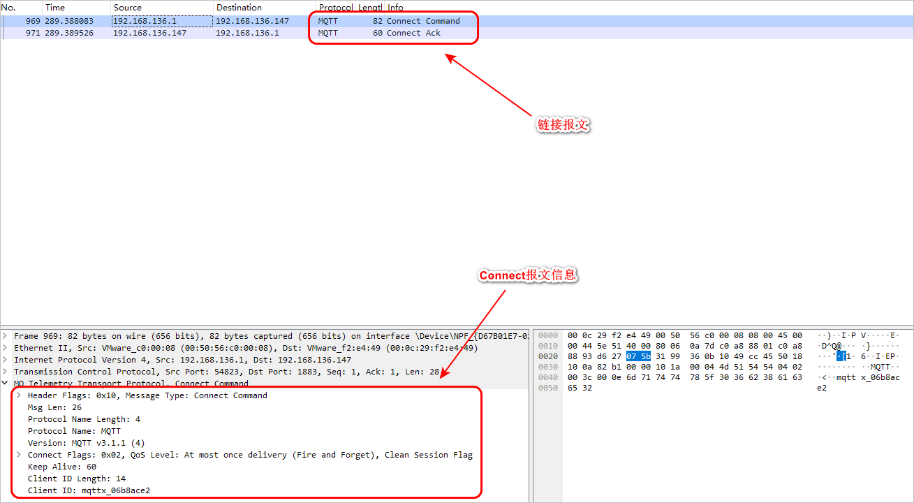

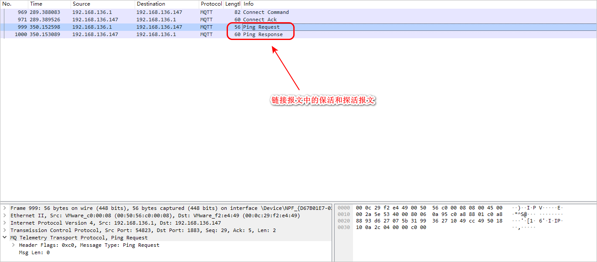

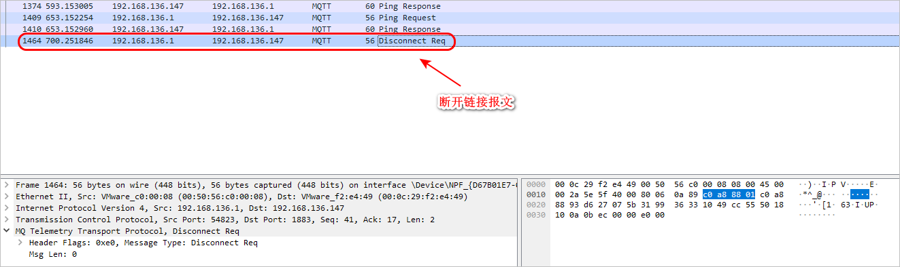

**发布相关报文:**

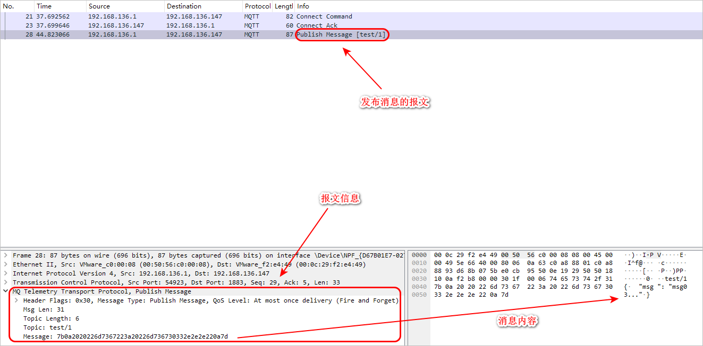

上述发布的消息QoS的值设置为0，因此看不到发布消息的时候的其他的报文数据，如果此时把消息的QoS等级设置为1、2就可以看到发送消息的时候其他的报文：

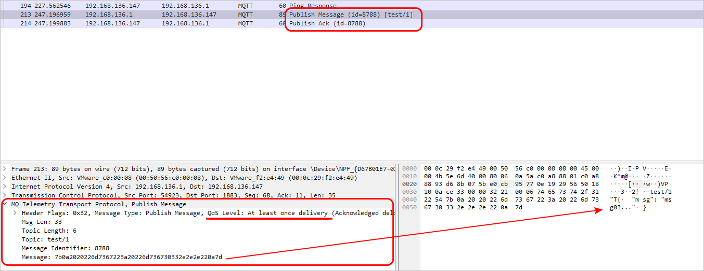

QoS的值设置为2以后，抓取的报文数据如下所示：

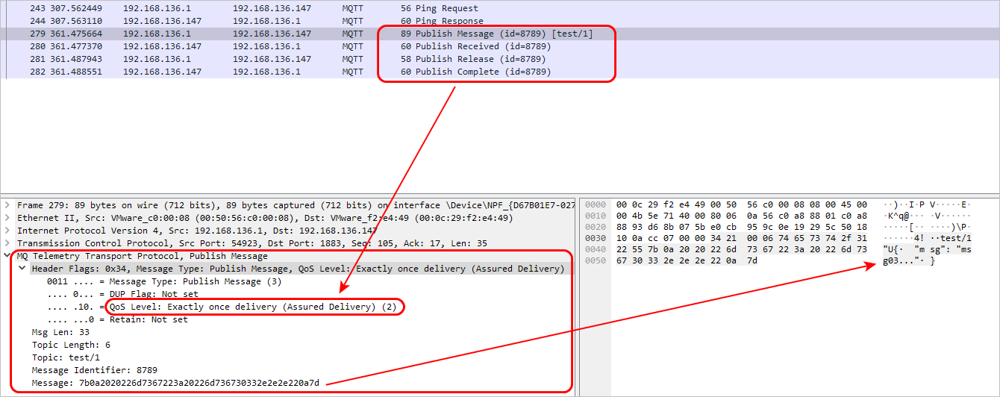

**订阅相关报文：**

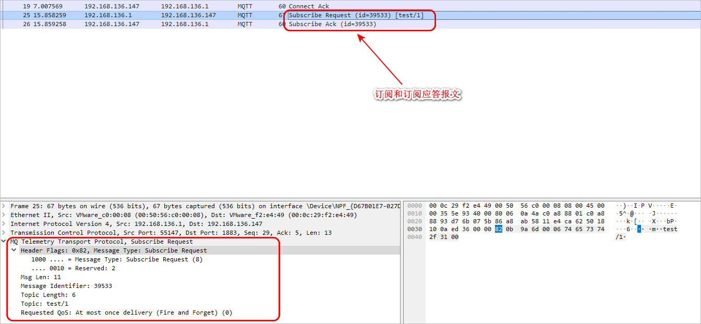

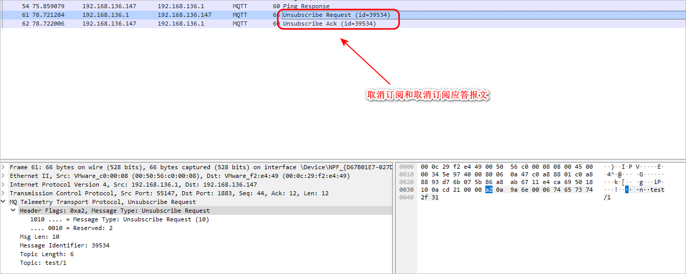

## 4. QoS介绍

### 4.1 QoS简介

使用MQTT协议的设备大部分都是运行在`网络受限`的环境下，而只依靠底层的TCP传输协议，`并不能完全保证消息的可靠到达。`

MQTT提供了QoS机制，其核心是`设计了多种消息交互机制来提供不同的服务质量`，来满足用户在各种场景下对消息可靠性的要求。

MQTT 定义了三个 QoS 等级，分别为：

1、QoS 0，最多交付一次  -----> 可能丢失消息

2、QoS 1，至少交付一次  -----> 可以保证收到消息，但消息可能重复

3、QoS 2，只交付一次    -----> 可以保证消息既不丢失也不重复

`QoS等级是由发布者在PUBLISH报文中指定的`，大部分情况下Broker向订阅者转发消息时都会维持原始的 QoS 不变。不过也有一些例外的情况，根据订阅者的订阅要求，

消息的 QoS 等级可能会在转发的时候发生降级。

例如，订阅者在订阅时要求Broker可以向其转发的消息的最大QoS等级为QoS 1，那么后续所有QoS 2消息都会降级至QoS 1转发给此订阅者，而所有QoS 0和QoS 1消息

则会保持原始的QoS等级转发。


### 4.2 QoS 0原理介绍

#### 4.2.1 通讯原理说明

QoS 0 是最低的 QoS 等级。**QoS 0 消息即发即弃，不需要等待确认，不需要存储和重传，因此对于接收方来说，永远都不需要担心收到重复的消息。**


涉及到的相关报文：


### 1.2.2 QoS 0消息丢失原因

当我们使用 QoS 0 传递消息时，`消息的可靠性完全依赖于底层的 TCP 协议。`而 TCP 只能保证在`连接稳定不关闭的情况下消息的可靠到达`，一旦出现连接关闭、重置，

仍有可能丢失当前处于网络链路或操作系统底层缓冲区中的消息。这也是 QoS 0 消息最主要的丢失场景。

### 4.3 QoS 1原理介绍

### 1.3.1 通讯原理说明

为了保证消息到达，QoS 1 加入了应答与重传机制，发送方只有在收到接收方的 PUBACK 报文以后，才能认为消息投递成功，在此之前，发送方需要存储该 PUBLISH 报

文以便下次重传。

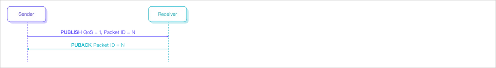

QoS 1需要在 PUBLISH 报文中设置 Packet ID，而作为响应的 PUBACK 报文，则会使用与 PUBLISH 报文相同的 Packet ID，以便发送方收到后删除正确PUBLISH

报文缓存。

涉及到的相关报文：

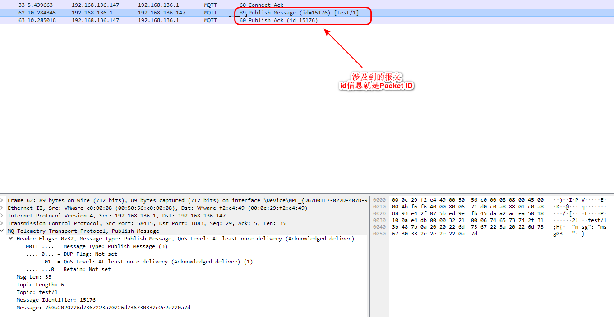

### 1.3.2 QoS 1 消息会重复原因

对于发送方来说，没收到 PUBACK 报文分为以下两种情况：

1、PUBLISH 未到达接收方

2、PUBLISH 已经到达接收方，接收方的 PUBACK 报文还未到达发送方

在第一种情况下，发送方虽然重传了 PUBLISH 报文，但是对于接收方来说，实际上仍然仅收到了一次消息。

在第二种情况下，在发送方重传时，接收方已经收到过了这个 PUBLISH 报文，这就导致接收方将收到重复的消息。

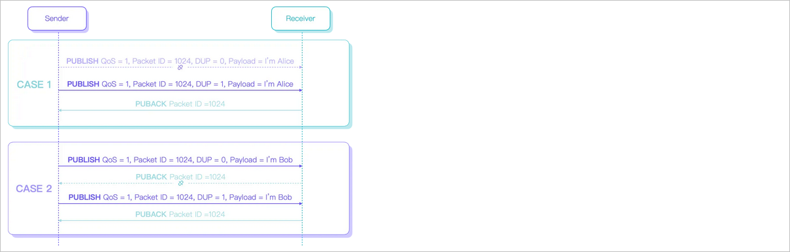

重传 PUBLISH 报文的时候，PUBLISH 中的 DUP 标志会被设置为 1，用以表示这是一个重传的报文。

## 1.4 QoS 2原理介绍

### 1.4.1 通讯原理说明

QoS 2 解决了 QoS 0、1 消息可能丢失或者重复的问题，但相应地，它也带来了最复杂的交互流程和最高的开销。每一次的 QoS 2 消息投递，都`要求发送方与接收方`

`进行至少两次请求/响应流程。`

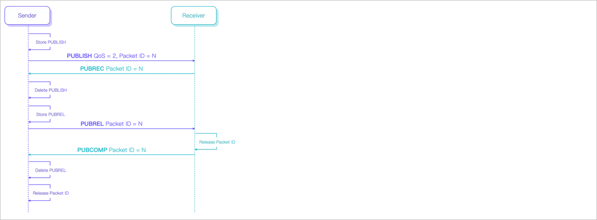

流程说明：

1、首先，发送方存储并发送 QoS 为 2 的 PUBLISH 报文以启动一次 QoS 2 消息的传输，然后等待接收方回复 PUBREC 报文。这一部分与 QoS 1 基本一致，只是响

应报文从 PUBACK 变成了 PUBREC。

2、当发送方收到 PUBREC 报文，即可确认对端已经收到了 PUBLISH 报文，发送方将**不再需要重传**这个报文，并且也**不能再重传**这个报文。所以此时发送方可以删除本地

存储的 PUBLISH 报文，然后发送一个 PUBREL 报文，通知对端自己准备将本次使用的 Packet ID 标记为可用了。与 PUBLISH  报文一样，我们需要确保 PUBREL

报文到达对端，所以也需要一个响应报文，并且这个 PUBREL 报文需要被存储下来以便后续重传。

3、当接收方收到 PUBREL 报文，也可以确认在这一次的传输流程中不会再有重传的 PUBLISH 报文到达，因此回复 PUBCOMP 报文表示自己也准备好将当前的 Packet

ID 用于新的消息了。

4、当发送方收到 PUBCOMP 报文，这一次的 QoS 2 消息传输就算正式完成了。在这之后，发送方可以再次使用当前的 Packet ID 发送新的消息，而接收方再次收到使

用这个 Packet ID 的 PUBLISH 报文时，也会将它视为一个全新的消息。

涉及到的报文：


### 1.4.2 QoS 2消息不会重复原因

消息不丢失原因：与 QoS 1 相同

消息不会重复原因：

**快速回顾一下 QoS 1 消息无法避免重复的原因：**

当我们使用 QoS 1 消息时，对接收方来说，回复完 PUBACK 这个响应报文以后 Packet ID  就重新可用了，也不管响应是否确实已经到达了发送方。所以就无法得知

之后到达的，携带了相同 Packet ID 的 PUBLISH  报文，到底是发送方因为没有收到响应而重传的，还是发送方因为收到了响应所以重新使用了这个 Packet ID 发

送了一个全新的消息。

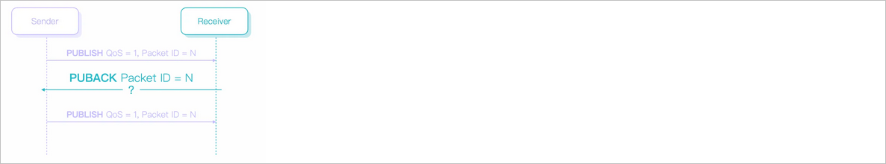

所以，消息去重的关键就在于，通信双方如何正确地同步释放 Packet ID，换句话说，不管发送方是重传消息还是发布新消息，一定是和对端达成共识了的。而 QoS 2

中增加的 PUBREL 流程，正是提供了帮助通信双方协商 Packet ID 何时可以重用的能力。

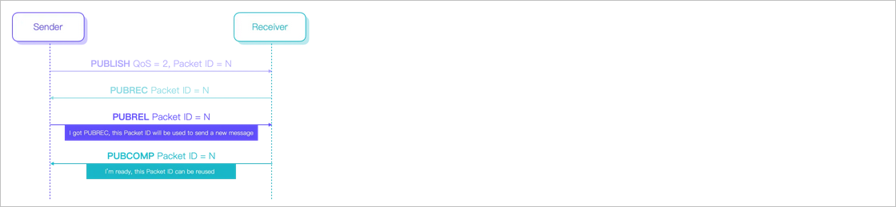

`QoS 2 规定，发送方只有在收到 PUBREC 报文之前可以重传 PUBLISH 报文。一旦收到 PUBREC 报文并发出 PUBREL  报文，发送方就进入了 Packet ID 释放流`

`程，不可以再使用当前 Packet ID 重传 PUBLISH 报文。同时，在收到对端回复的 PUBCOMP 报文确认双方都完成 Packet ID 释放之前，也不可以使用当前`

`Packet ID 发送新的消息。`

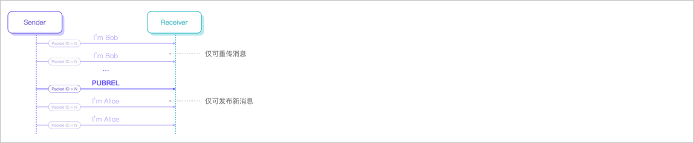

因此，对于接收方来说，能够以 **PUBREL 报文为界限**，凡是在 PUBREL 报文之前到达的 PUBLISH 报文，都必然是重复的消息；而凡是在 PUBREL 报文之后到达的

PUBLISH 报文，都必然是全新的消息。一旦有了这个前提，我们就能够在协议层面完成 QoS 2 消息的去重。

## 1.5 不同QoS的适用场景

### 1.5.1 QoS 0

QoS 0 的缺点是可能会丢失消息，消息丢失的频率依赖于你所处的网络环境，并且可能使你错过断开连接期间的消息，不过优点是投递的效率较高。

所以我们通常选择使用 QoS 0 传输一些`高频且不那么重要的数据`，比如`传感器数据`，周期性更新，即使遗漏几个周期的数据也可以接受。

### 1.5.2 QoS 1

QoS 1 可以保证消息到达，所以适合传输一些`较为重要的数据`，比如`下达关键指令、更新重要的有实时性要求的状态`等。但因为 QoS 1 还可能会导致消息重复，所以当

我们选择使用 QoS 1 时，还需要能够处理消息的重复，或者能够允许消息的重复。

消息重复带来的危害：

如果我们不对 QoS 1 进行去重处理，我们可能会遭遇这种情况，发布方以 1、2 的顺序发布消息，但最终订阅方接收到的消息顺序可能是  1、2、1、2。如果 1 表示开

灯指令，2  表示关灯指令，我想大部分用户都不会接受自己仅仅进行了开灯然后关灯的操作，结果灯在开和关的状态来回变化。


### 1.5.3 QoS 2

QoS 2 既可以保证消息到达，也可以保证消息不会重复，但传输成本最高。如果我们不愿意自行实现去重方案，并且能够接受 QoS 2 带来的额外开销，那么 QoS 2 将是

一个合适的选择。通常我们会在`金融、航空`等行业场景下会更多地见到 QoS 2 的使用。

# 2 主题详解

MQTT 主题本质上是一个 UTF-8 编码的字符串，是 MQTT 协议进行消息路由的基础。MQTT 主题类似 URL 路径，使用斜杠 `/` 进行分层：

```shell
chat/room/1
test/10/temperature
test/+/temperature
test/#
```

为了避免歧义且易于理解，通常**不建议主题**以 `/` 开头或结尾，例如 `/chat` 或 `chat/`。

MQTT 主题不需要提前创建。MQTT 客户端在订阅或发布时即**自动的创建了主题**，开发者无需再关心主题的创建，并且也不需要手动删除主题。

## 2.1 主题通配符

MQTT 主题通配符包含单层通配符 `+` 及多层通配符 `#`，主要用于`客户端一次订阅多个主题`。

### 2.1.1 单层通配符

加号 ("**+**") 是用于`单个主题层级匹配的通配符`。在使用单层通配符时，单层通配符必须占据整个层级，例如：

```shell
+ 有效
test/+ 有效
test/+/temperature 有效
test+ 无效（没有占据整个层级）
```

如果客户端订阅了主题 `test/+/temperature`，将会收到以下主题的消息：

```shell
test/1/temperature
test/2/temperature
...
test/n/temperature
```

但是不会匹配以下主题：

```shell
test/temperature
test/bedroom/1/temperature
```

### 2.1.2 多层通配符

井字符号（"**#**"）是用于`匹配主题中任意层级的通配符`。多层通配符表示它的父级和任意数量的子层级，在使用多层通配符时，它必须占据整个层级并且`必须是主题的最后`

`一个字符`，例如：

```shell
# 有效，匹配所有主题
test/# 有效
test/bedroom# 无效（没有占据整个层级）
test/#/temperature 无效（不是主题最后一个字符）
```

如果客户端订阅主题  `test/#`，它将会收到以下主题的消息：

```shell
test
test/temperature
test/1/temperature
```

## 2.2 系统主题

以 `$SYS/` 开头的主题为系统主题，系统主题主要用于获取 MQTT 服务器`自身运行状态、消息统计、客户端上下线事件等数据`。目前，MQTT 协议暂未明确规定 `$SYS/`

主题标准，但大多数 MQTT 服务器都遵循该[标准建议](https://github.com/mqtt/mqtt.org/wiki/SYS-Topics)。

例如，EMQX 服务器支持通过以下主题获取集群状态:

| 主题                                 | 说明              |
| ------------------------------------ | ----------------- |
| $SYS/brokers                         | EMQX 集群节点列表 |
| $SYS/brokers/emqx@127.0.0.1/version  | EMQX 版本         |
| $SYS/brokers/emqx@127.0.0.1/uptime   | EMQX 运行时间     |
| $SYS/brokers/emqx@127.0.0.1/datetime | EMQX 系统时间     |

EMQX 还支持客户端上下线事件、收发流量、消息收发、系统监控等丰富的系统主题，用户可通过订阅 `$SYS/#` 主题获取所有系统主题消息。

系统主题文档：<https://www.emqx.io/docs/zh/v5.0/observability/mqtt-system-topics.html?__hstc=3614191.d3e87b0aa86919c8c8f01e199a29f583.1715423024096.1717117142732.1717123186833.30&__hssc=3614191.2.1717123186833&__hsfp=3042319173#%E5%AE%A2%E6%88%B7%E7%AB%AF%E4%B8%8A%E4%B8%8B%E7%BA%BF%E4%BA%8B%E4%BB%B6>

比如订阅客户端上下线事件主题：

```shell
$SYS/brokers/emqx@172.17.0.4/clients/+/connected    # 订阅客户端上线的主题
$SYS/brokers/emqx@172.17.0.4/clients/+/disconnected    # 订阅客户端下线的主题
```

注意：监听系统主题需要在broker端开通对应的访问权限

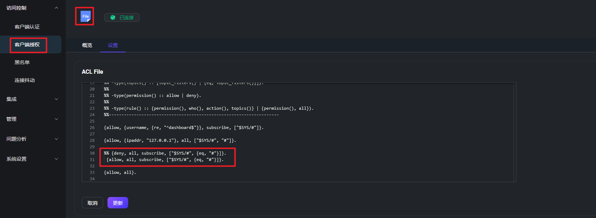

# 3 会话介绍

## 3.1 MQTT会话

MQTT客户端和MQTT服务器之间的连接被称为会话。每个MQTT客户端都可以启动一个或多个会话，通过会话可以实现客户端和服务器之间的消息传递。

## 3.2 常见配置参数

### 3.2.1 Clean Start

Clean Start作用：用于指示客户端在和服务器建立连接的时候应该尝试恢复之前的会话还是直接创建全新的会话。

常见取值以及含义：

0：服务端存在一个关联此客户端标识符（Client ID）的会话，服务端**必须**基于此会话的状态恢复与客户端的通信（之前的订阅信息会再次绑定，并且会接收到客户端断开

时，发布者所发布的消息）。如果不存在任何关联此客户端标识符的会话，服务端**必须**创建一个新的会话。

1：客户端和服务端**必须**丢弃任何已存在的会话，并开始一个新的会话。

### 3.2.2 Session Expiry Interval

Session Expiry Interval 决定了会话状态数据在服务端的存储时长。

常见取值：

* **没有指定此属性或者设置为 0**，表示会话将在网络连接断开时立即结束。
* **设置为一个大于 0 的值**，则表示会话将在网络连接断开的多少秒之后过期。
* **设置为 0xFFFFFFFF**，即 Session Expiry Interval 属性能够设置的最大值时，表示会话数据永不过期。

4、服务端使用 `Client ID` 来唯一地标识每个会话，如果客户端想要在连接时复用之前的会话，那么必须使用与此前一致的 Client ID。

## 3.3 会话演示

具体步骤：

1、在MQTTX中设置关闭自动重订阅功能

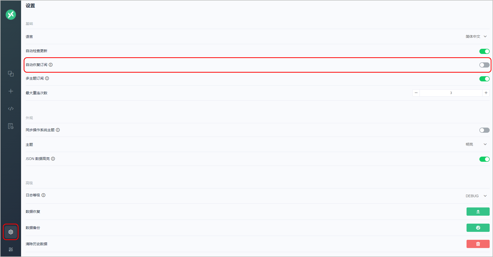  

2、创建一个名为 `sub` 的客户端连接，将 MQTT Version 设置为 5.0，开启 Clean Start，Session Expiry Interval 设置为 300 秒，然后链接到MQTT的服

务端，并订阅主题 `mqttx_290c747e/test`：

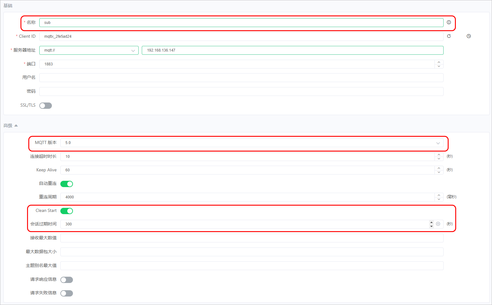

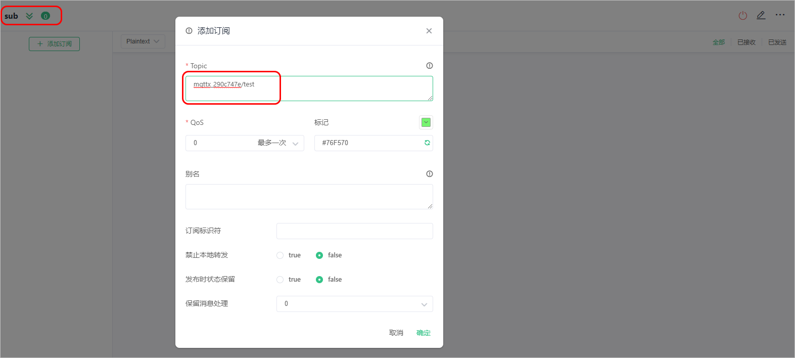

3、创建一个名为 `pub` 的客户端连接向主题 `mqttx_290c747e/test` 发布消息，消息内容可以随意设置，我们将看到 `sub` 客户端收到这些消息。这时我们断开 `sub`

客户端的连接，然后继续通过 `pub` 客户端发布消息：

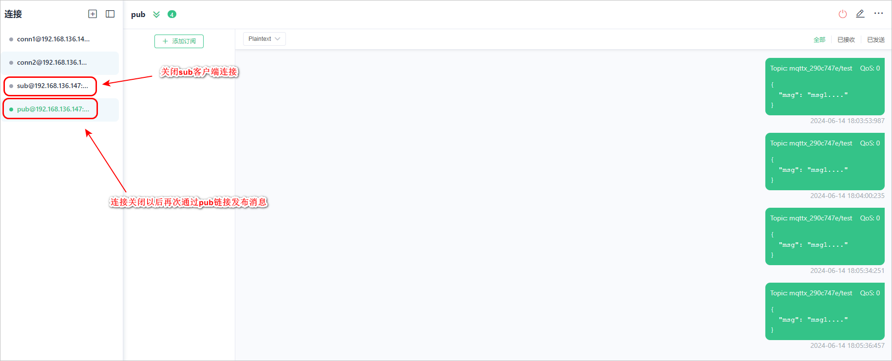

4、接下来，我们将 `sub` 客户端的 Clean Start 选项关闭，并保持 Session Expiry Interval 为 300 秒，然后再次连接。我们将看到 `sub` 客户端陆续收到我

们在它离线期间发布的消息：

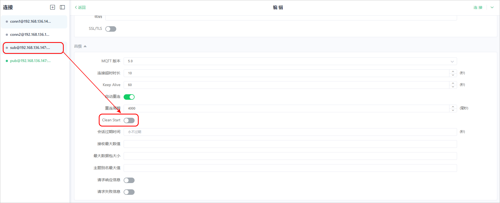

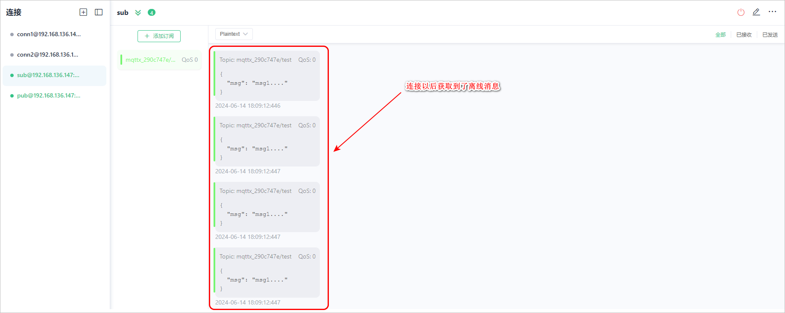

以上就是 **MQTT 会话为离线客户端缓存消息的能力**。

# 4 消息详解

## 4.1 保留消息

### 4.1.1 保留消息简介

普通消息：普通消息在发送之前其所对应的主题如果不存在订阅者，普通消息MQTT服务器会直接将其丢弃。

保留消息：保留消息可以保留在 MQTT 服务器中。任何新的订阅者订阅与该保留消息中的主题匹配的主题时，都会立即接收到该消息，即使这个消息是在它们订阅主题之前

发布的。

如下图，当客户端订阅主题时，如果服务端存在该主题匹配的保留消息，则该保留消息将被立即发送给该客户端。

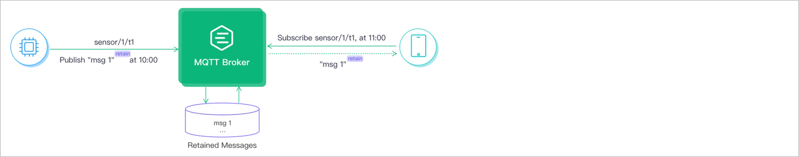

保留消息的常见使用场景：

1、智能家居设备的状态只有在变更时才会上报，但是控制端需要在上线后就能获取到设备的状态；

2、传感器上报数据的间隔太长，但是订阅者需要在订阅后立即获取到最新的数据；

3、传感器的版本号、序列号等不会经常变更的属性，可在上线后发布一条保留消息告知后续的所有订阅者；

### 4.1.2 保留消息使用

> 发布保留消息

在发布消息的时候将`Retained 标记被设置为 true`，则该消息即是 MQTT 中的保留消息（Retained Message）。

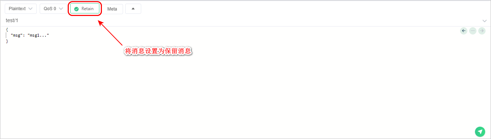

**注意事项：**

1、可以通过Dashboard查看保留消息

2、MQTT 服务器会为每个主题存储`最新一条保留消息`

3、在保留消息发布前订阅主题，将不会收到保留消息。**需要待保留消息发布后，重新订阅该主题，才会收到保留消息。**

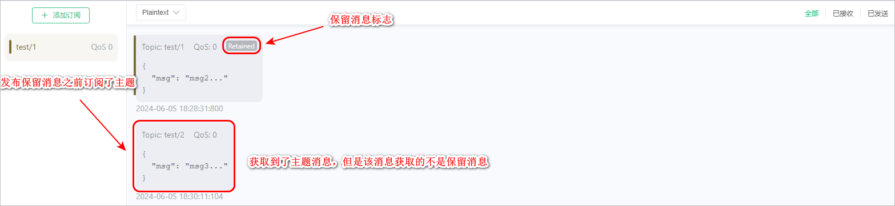

> 保留消息的存储方式

保留消息的存储方式：内存存储(默认存储类型)、磁盘存储

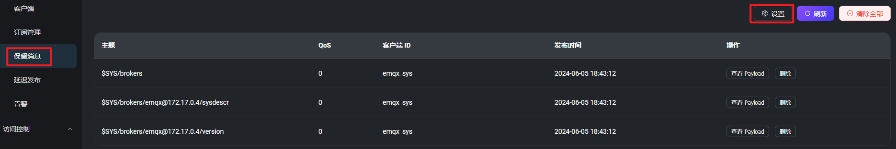

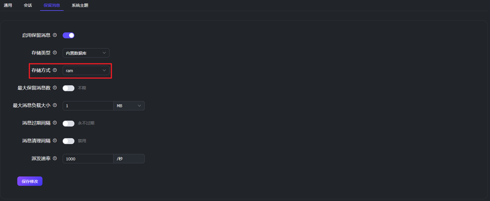

5、保留消息虽然存储在服务端中，但它并不属于会话的一部分。也就是说，即便发布这个保留消息的会话已结束，保留消息也不会被删除。

> 保留消息的删除方式

1、客户端往某个主题发送一个 Payload 为空的保留消息，服务端就会删除这个主题下的保留消息；

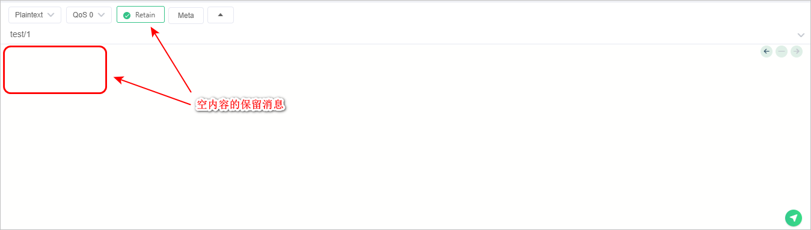

2、在 MQTT 服务器上删除，比如 EMQX MQTT 服务器提供了在 Dashboard 上删除保留消息的功能；

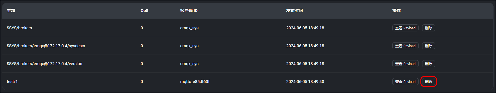

3、MQTT 5.0 新增了消息过期间隔属性，发布时可使用该属性设置消息的过期时间，将会在过期时间后自动被删除。

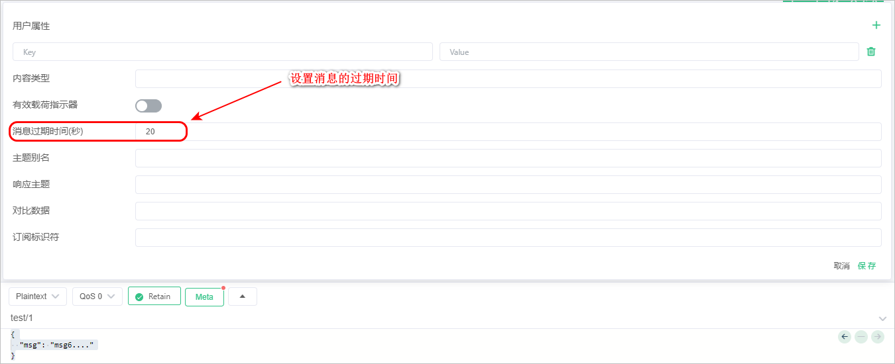

## 4.2 消息过期间隔

### 4.2.1 消息过期间隔简介

MQTT 可以通过`Session Expiry Interval`为离线客户端缓存尚未发送的消息，然后在客户端恢复连接时发送。但如果客户端离线时间较长，可能有一些寿命较短的消

息已经没有必要必须发送给客户端了，继续发送这些过期的消息，只会浪费网络带宽和客户端资源。

举例：以联网汽车为例，我们可以向车辆发送`建议车速`使它能够在绿灯期间通过路口，这类消息通常仅在车辆到达下一个路口之前有效，生命周期非常短暂。

消息过期间隔是 MQTT 5.0 引入的一个新特性，`它允许发布端为有时效性的消息设置一个过期间隔，如果该消息在服务端中停留超过了这个指定的间隔，那么服务端将`

`不会再将它分发给订阅端。默认情况下，消息中不会包含消息过期间隔，这表示该消息永远不会过期。`

注意：如果客户端在发布消息时设置了过期间隔，那么服务端在转发这个消息时也会包含过期间隔，但过期间隔的值会被更新为服务端接收到的值减去该消息在服务端停留的

时间。这可以避免消息的时效性在传递的过程中丢失，特别是在桥接到`另一个MQTT 服务器的时候`。

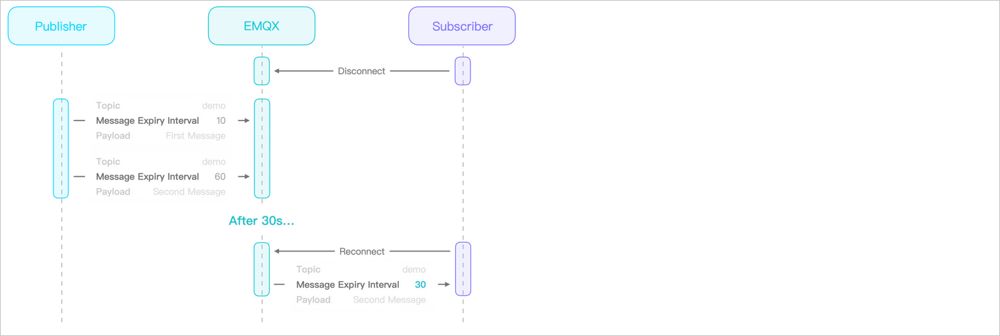

### 4.2.2 消息过期间演示

具体步骤如下所示：

1、创建一个 `pub`的客户端链接，链接到MQTT服务端

2、新建一个名为 `sub` 的客户端连接用于订阅，并将 `Session Expiry Interval 设置为 300 秒`表示这个会话状态的数据在服务端保存300s。

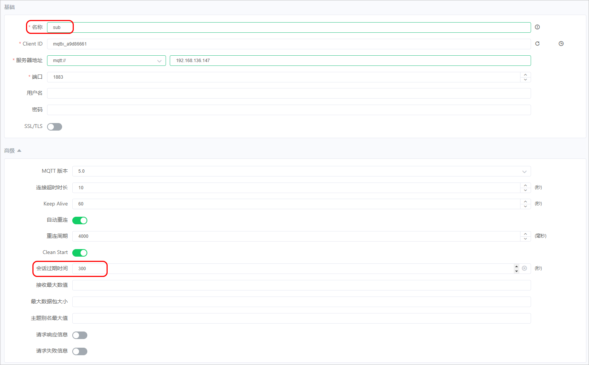

3、连接成功后，我们订阅主题 `mqttx_a9d86661/demo`，使用 Client ID 作为主题前缀可以有效避免主题重复：

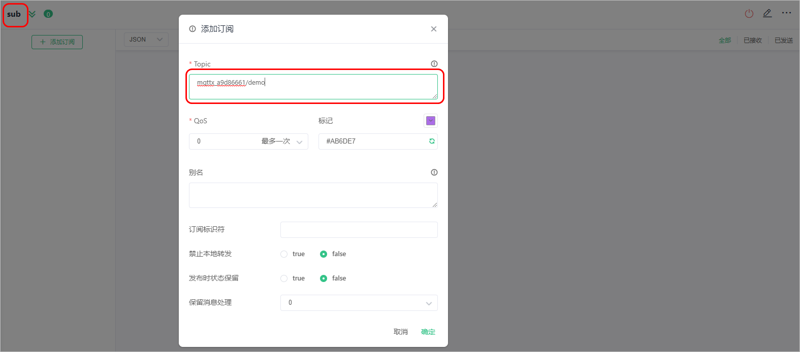  

4、订阅成功后，我们断开 `sub` 客户端与服务器的连接，然后切换到 `pub` 客户端，向主题 `mqttx_a9d86661/demo` 发布以下两条 Message Expiry Interval 分

别为 5 秒和 60 秒的消息：

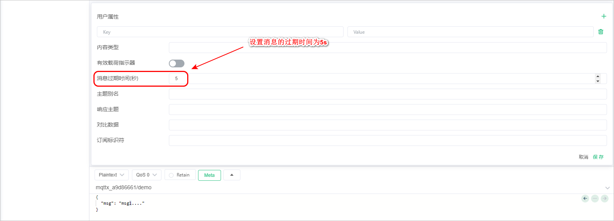

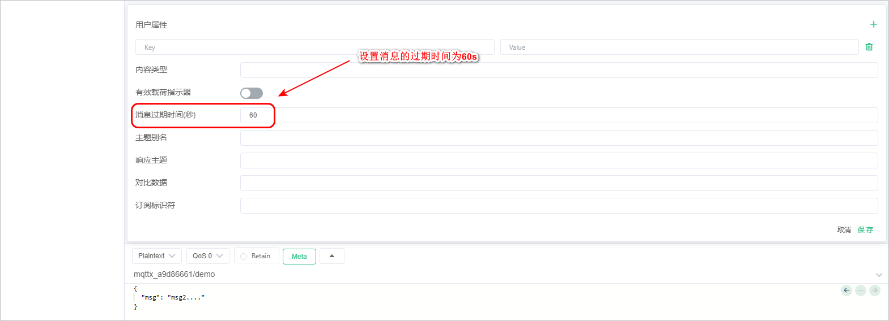

5、发布完成后，切换到 `sub` 客户端，将 Clean Session 设置为 false 表示想要恢复之前的会话，然后等待至少 5 秒再重新连接。我们将看到 `sub` 只收到了过

期时间为 60 秒的消息，因为此时另一条消息已经过期：

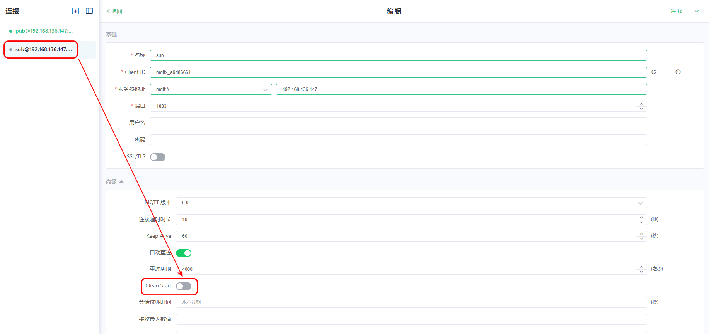

## 4.3 遗嘱消息

### 4.3.1 遗嘱消息简介

在现实世界中，一个人可以制定一份遗嘱，声明在他去世后应该如何分配他的财产以及应该采取什么行动。在他去世后，遗嘱执行人会将这份遗嘱公开，并执行遗嘱中的指示

在 MQTT中，`客户端可以在连接时在服务端中注册一个遗嘱消息`，与普通消息类似，我们可以设置遗嘱消息的主题、有效载荷等等。`当该客户端意外断开连接，服务端就会`

`向其他订阅了相应主题的客户端发送此遗嘱消息`。这些接收者也因此可以及时地采取行动，例如向用户发送通知、切换备用设备等等。

作用：借助于遗嘱消息可以感知到客户端是意外断开

### 4.3.2 遗嘱消息原理

#### 遗嘱消息指定时机

`遗嘱消息在客户端发起连接时指定`，它和 Client ID、Clean Start 这些字段一起包含在客户端发送的 CONNECT 报文中。

与普通消息一样，我们可以为遗嘱消息设置主题（Will Topic）、保留消息标识位（Will Retain）、属性（Will Properties）、QoS（Will QoS）和有效载荷

（Will Payload）。


这些字段的用法与它们在普通消息中时完全相同，只是遗嘱消息可用的属性与普通应用消息略有不同，下表列出了它们的具体区别：

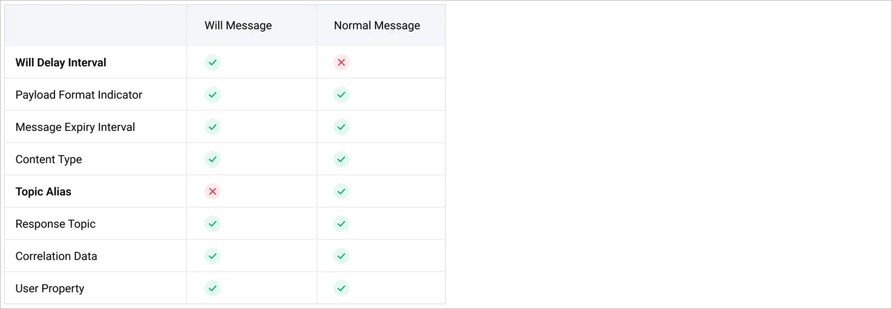

遗嘱消息只是多了一个专属属性：**Will Delay Interval**。

#### Will Delay Interval

作用：`这个属性决定了服务端将在网络连接关闭后延迟多久发布遗嘱消息，并以秒为单位。`

默认情况下，服务端总是在网络连接意外关闭时立即发布遗嘱消息。但是很多时候，网络连接的中断是短暂的，所以客户端往往能够重新连接并继续之前的会话。这导致遗嘱

消息可能被频繁地且无意义地发送。

如果没有指定 Will Delay Interval 或者将其设置为 0，服务端将仍然在网络连接关闭时立即发布遗嘱消息。

但如果将 Will Delay Interval 设置为一个大于 0 的值，并且客户端能够在 Will Delay Interval 到期前恢复连接，那么该遗嘱消息将不会被发布。

#### 遗嘱消息与会话

遗嘱消息是会话状态的一部分，当会话结束，遗嘱消息也无法继续单独存在。但是在遗嘱消息延迟发布期间，会话可能过期，也可能因为客户端在新的连接中设置Clean

Start 为 1 所以服务端需要丢弃之前的会话。为了避免丢失遗嘱，此时服务端必须发布该遗嘱消息，即便 Will Delay Interval 还没有到期。所以服务端最终何时发

布遗嘱消息，取决于 Will Delay Interval 到期和会话结束这两种情况谁先发生。

### 4.3.3 遗嘱消息演示

具体步骤：

1、建立链接的时候指定遗嘱消息

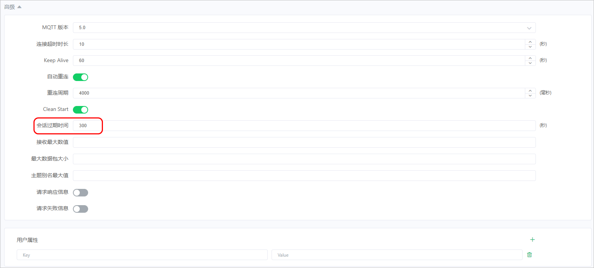

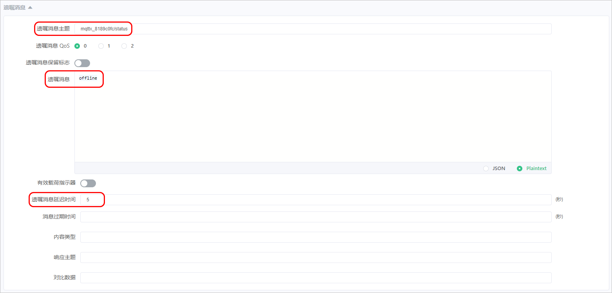

在这个连接中我们指定了一个主题为 `mqttx_8189c0fc/status`，Payload 为 offline  的遗嘱消息，并且将 Will Delay Interval 设置为 5 秒，Session

Expiry Interval 设置为 300 秒：遗嘱消息主题使用 Client ID 作为前缀可以有效避免主题重复：

2、建立新的客户端连接到服务端，并且监听遗嘱消息主题

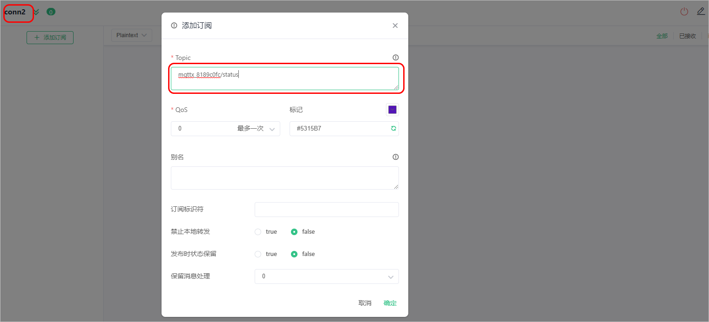

3、正常关闭第一个链接，不会发送遗嘱消息

4、选择第一个链接右键新建窗口，在新的窗口中进行连接，然后将新的窗口关闭，等待5s就会在原有窗口的第二个链接中获取到遗嘱消息。

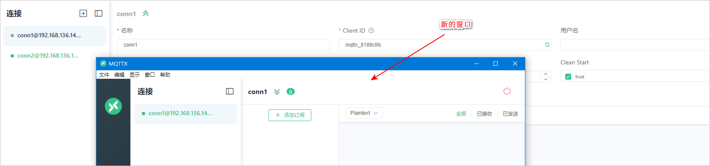

## 4.4 延迟发布

### 4.4.1 延迟发布简介

**延迟发布简介**：MQTT服务端收到发布者发布的消息以后，延迟一段时间以后再把消息转发给订阅者

**延迟发布的使用场景**：

1、农业智能化管理：在智能农业中，可能需要`在特定时间启动灌溉系统或调节温室环境。`通过MQTT延迟发布，可以预先设定好指令发布时间，如在清晨或傍晚自动发送开

启灌溉的信号，确保水资源的有效利用且不对作物生长周期造成干扰。

2、能源管理与自动控制：智能家居或智能建筑中的照明、供暖、通风系统可以根据居民生活习惯或节能策略，利用延迟发布在预设时间自动调整，如在居民到家前半小时开

启空调或在离开家后一定时间关闭所有非必要电器，以达到节能减排的目的。

3、公共设施维护：城市中的公共照明、广告牌等设施可能需要在特定时间统一开关，以节省能源或遵守当地法规。通过MQTT延迟发布功能，可以安排在夜间自动发送开关指

令，无需人工干预，简化运维流程。

4、医疗健康监护：在远程医疗监护中，设备可能需要在一天中的特定时间收集患者数据或发送提醒，如定时提醒患者服药或在固定时间收集心率、血压等生理参数，以优化

患者护理计划。

**延迟发布主题格式：**`$delayed/{DelayInterval}/{TopicName}`

$delayed: 使用 `$delay` 作为主题前缀的消息都将被视为需要延迟发布的消息

DelayInterval： 延迟发布的时间间隔，单位为妙，允许的最大间隔是 4294967 秒。如果 `{DelayInterval}` 无法被解析为一个整型数字，EMQX 将丢弃该消

息，客户端不会收到任何信息。

TopicName：MQTT消息的主题名称

举例说明：

```shell
 $delayed/15/x/y：15 秒后将 MQTT 消息发布到主题 x/y。
 $delayed/60/a/b：1 分钟后将 MQTT 消息发布到 a/b。
```

### 4.4.2 延迟发布演示

具体步骤如下所示：

1、通过 Dashboard 配置延迟发布

打开 EMQX Dashboard，在左侧导航菜单中，点击**管理**-> **延迟发布**。

在**延迟发布**页面，您可以进行以下配置：

* **启用**: 启用或禁用延迟发布。默认情况下，已启用。
* **最大延迟消息数**：可以指定延迟消息的最大数量。

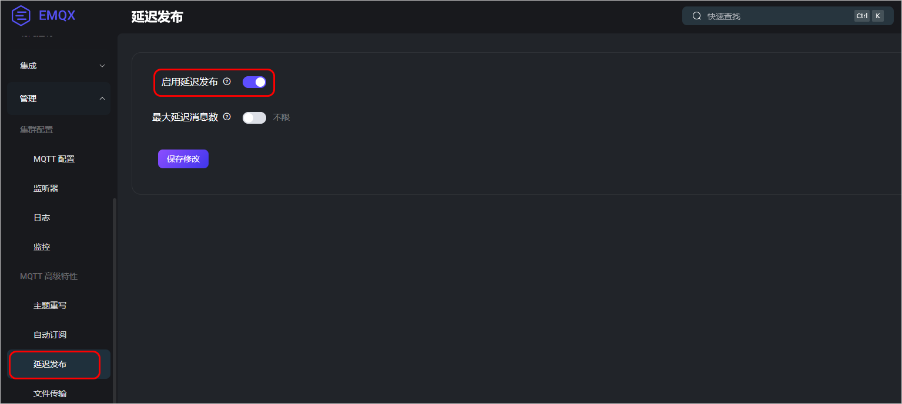

2、在MQTTX中建立sub的客户端连接，并且添加订阅主题为`delay/msg`

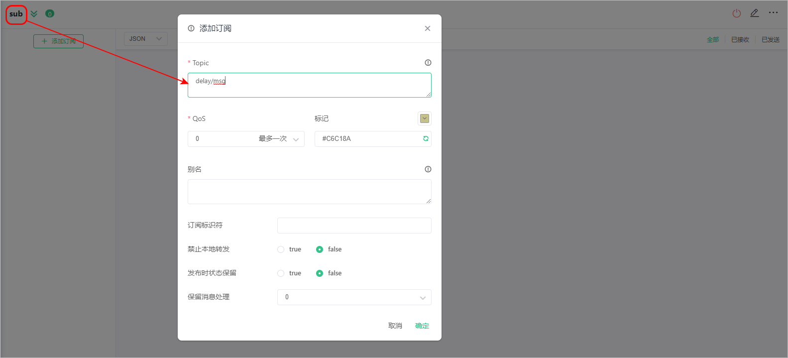

3、在在MQTTX中建立pub的客户端连接，并且向主题 `$delayed/10/delay/msg`

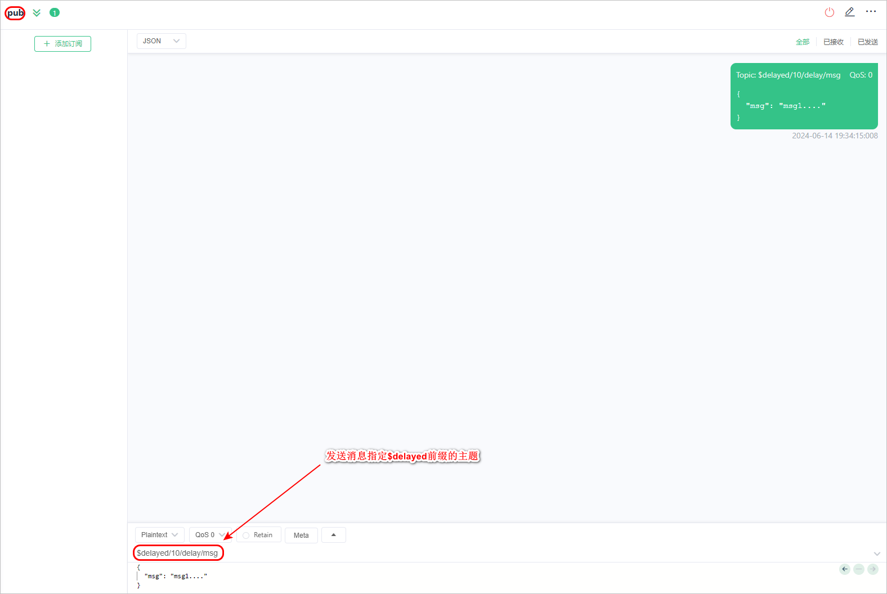

4、等待 10 秒钟。您将看到客户端 `sub` 在 10 秒后接收到延迟消息。

## 4.5 用户属性

### 4.5.1 用户属性简介

**用户属性简介：**

1、MQTT 5.0版本引入的一个新特性。

2、它允许在Publish、Subscribe、Connect、Disconnect等报文中携带附加信息。

3、类似于http协议的请求头

**用户属性的应用场景：**

1、日志记录：在发布（PUBLISH）和订阅（SUBSCRIBE）报文中加入用户属性，可以帮助记录操作者信息、操作时间、原因说明等，便于后续的审计跟踪和问题排查。

2、消息分类与标记：用户属性可以用来给消息添加标签或分类信息，如消息类型等，使得接收方能根据这些属性对消息进行过滤、排序或特殊处理。

### 4.5.2 用户属性演示

最为常见的使用场景就是在发布消息的时候指定用户属性。

具体步骤：

1、创建`sub`的客户端连接，并且订阅`userprop/demo`主题

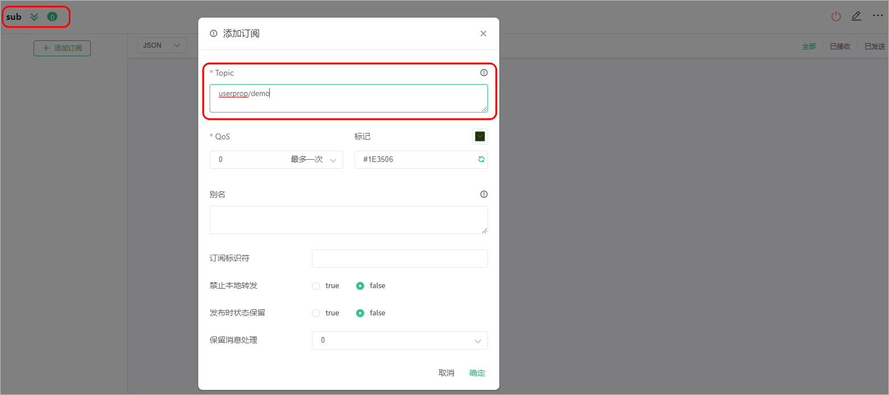

2、创建`pub`的客户端连接，发送消息指定用户属性

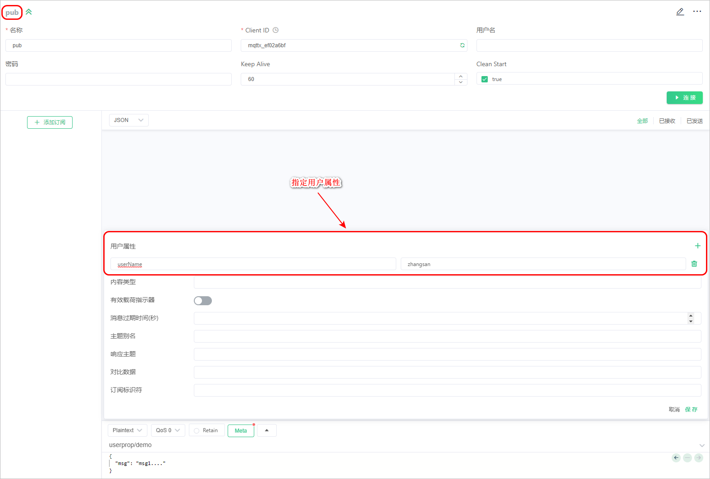

3、观察`sub`的客户端，可以看到获取到消息的内容同时也获取到了用户指定的属性

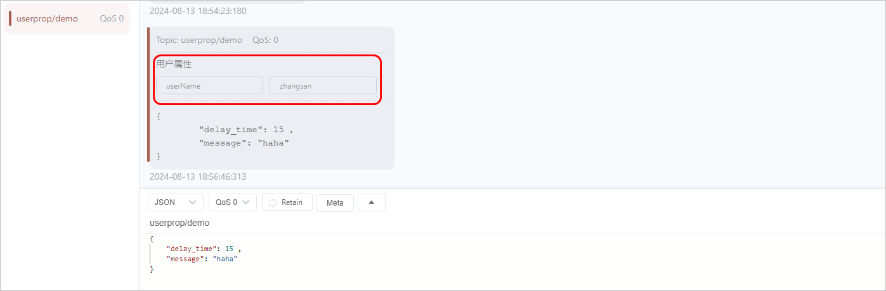  

# 5 订阅详解

## 5.1 订阅选项

### 5.1.1 订阅选项简介

订阅的组成：

1、主题过滤器：决定了服务端将向我们转发哪些主题下的消息

2、订阅选项：是允许我们进一步定制服务端的转发行为

MQTT 5.0提供了4个订阅选项：QoS、No Local、Retain As Published、Retain Handling

### 5.1.2 QoS

#### QoS订阅选项简介

QoS 是最常用的一个订阅选项，它表示服务端在向订阅端发送消息时可以使用的`最大QoS等级。`

> 情况1：服务端支持的最大 QoS < 客户端订阅时请求的最大QoS

服务端将无法满足客户端的要求，这时服务端就会通过订阅的响应报文（SUBACK）告知订阅端最终授予的最大 QoS 等级，订阅端可以自行评估是否接受并继续通信。


> 情况2：订阅时请求的最大QoS < 消息发布时的QoS

为了尽可能地投递消息，服务端不会忽略这些消息，而是会在转发时对这些消息的 QoS 进行降级处理。


#### QoS订阅选项演示

具体步骤如下所示：

1、创建sub客户端连接，并且订阅`sub/qos/demo`主题, 并指定`QOS为0`

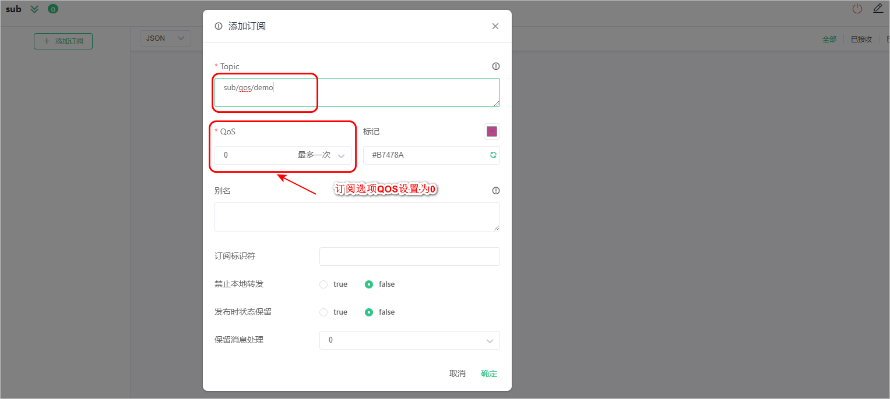

2、订阅成功以后，通过sub客户端连接向`sub/qos/demo`主题发布消息，并且指定QOS的登记为1

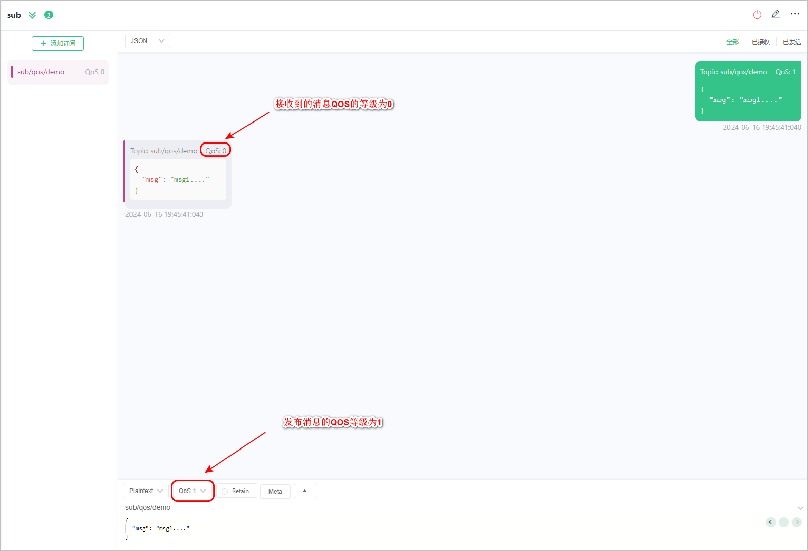

结果：sub客户端收到的消息的QOS值为0

### 5.1.3 No Local

#### No Local订阅选项简介

No Local取值：

1、0(默认值)：服务端`可以`将消息转发给发布这个消息的客户端

2、1：服务端`不可以`将消息转发给发布这个消息的客户端

这个订阅选项尝尝被用在`桥接场景`中，桥接本质上是两个 MQTT Server 建立了一个 MQTT 连接，然后相互订阅一些主题，Server 将客户端的消息转发给另一个

Server，而另一个 Server 则可以将消息继续转发给它的客户端。

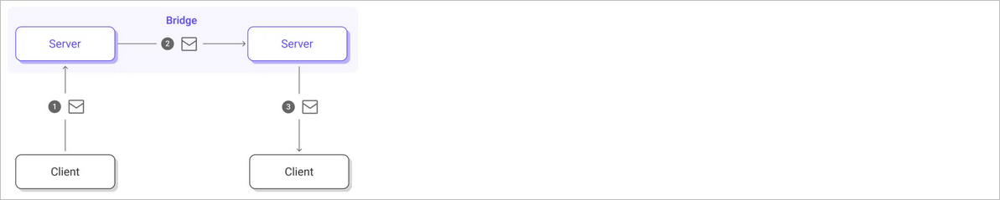

在桥接的场景中，如果没有将No Local订阅选项的值设置为1，那么此时会形成`转发风暴`。

举例：假设两个 MQTT Server 分别是 Server A 和 Server B，它们分别向对方订阅了`#`主题。现在，Server A 将一些来自客户端的消息转发给了 Server B，而

当 Server B 查找匹配的订阅时，Server A  也会位于其中。如果 Server B 将消息转发给了 Server A，那么同样 Server A 在收到消息后又会把它们再次转发

给  Server B，这样就陷入了无休止的转发风暴。

而如果 Server A 和 Server B 在订阅 `#` 主题的同时，将 No Local 选项设置为 1，就可以完美地避免这个问题。

#### No Local订阅选项演示

具体步骤：

1、创建sub客户端连接，并订阅`sub/local/demo`主题,并且设置`No Local订阅选项为1`

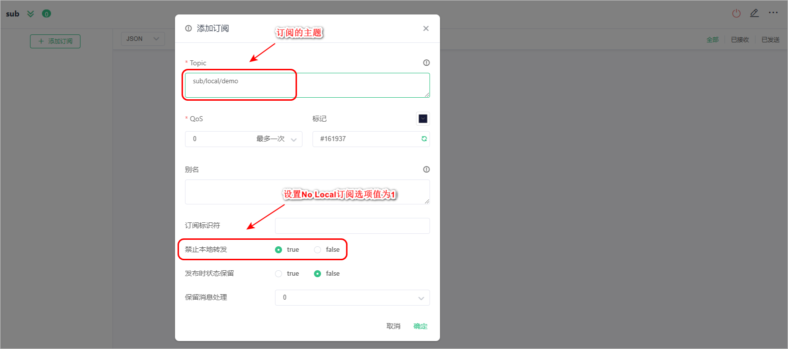

2、使用sub客户端连接向`sub/local/demo`主题发布消息

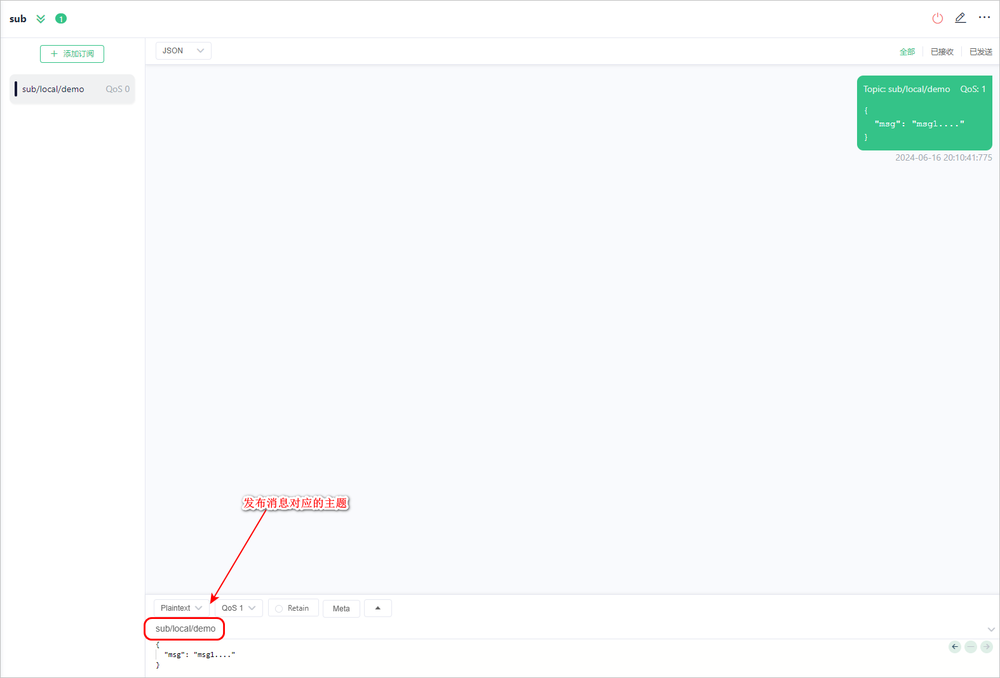

结果：当前的客户端连接没有收到该主题中的消息

### 5.1.4 Retain As Published

#### Retain As Published订阅选项简介

Retain As Published取值：

1、0(默认值)：服务端在向此订阅转发应用消息时需要`清除`消息中的 Retain 标识不变

2、1：服务端在向此订阅转发应用消息时需要`保持`消息中的 Retain 标识不变

应用场景：桥接场景

桥接场景下带来了一些问题。我们继续沿用前面的设定，当 Server A 将保留消息转发给 Server B 时，由于消息中的 Retain  标识已经被清除，Server B 将不会

知道这原本是一条保留消息，自然不会再存储它。这就导致了保留消息无法跨桥接使用。

那么在 MQTT 5.0 中，我们可以让桥接的服务端在订阅时将 Retain As Published 选项设置为 1，来解决这个问题。


#### Retain As Published订阅选项演示

具体步骤如下：

1、创建sub客户端连接，分别订阅主题`sub/rap/demo01`和`sub/rap/demo02`, 并且将Retain As Published设置为 0 和 1

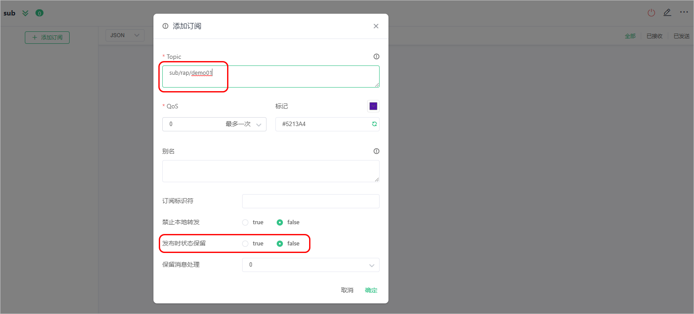

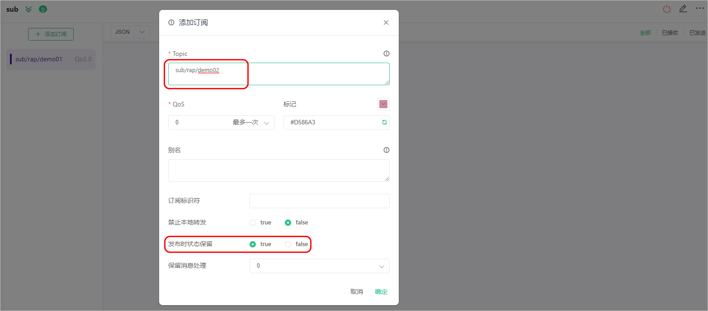

2、通过sub客户端连接分别向`sub/rap/demo01`和`sub/rap/demo02`主题发布`保留消息`

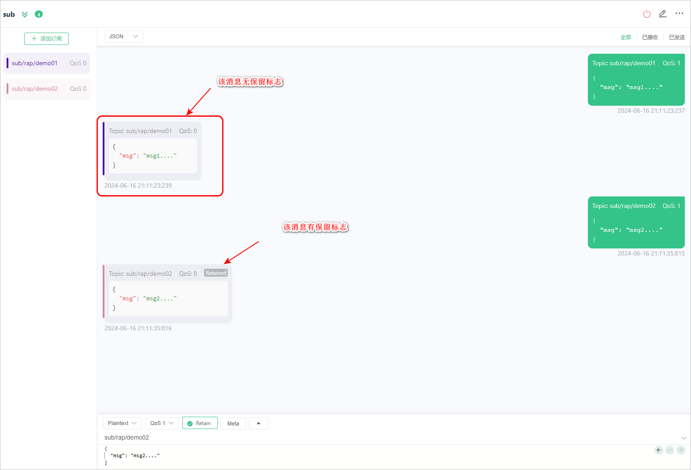

### 5.1.5 Retain Handling

#### Retain Handling订阅选项简介

作用：Retain Handling 这个订阅选项被用来向服务端指示当订阅建立时，`是否需要发送保留消息`。

Retain Handling常见取值：

1、0(默认值)：表示只要订阅建立，就发送保留消息；

2、1：表示只有建立全新的订阅而不是重复订阅时，才发送保留消息；

3、2：表示订阅建立时不要发送保留消息；

#### Retain Handling订阅选项演示

具体步骤如下所示：

> 情况1：Retain Handling值设置为0

1、开启客户端的自动重订阅功能

2、创建sub客户端连接(Clean Start值设置为1，并且将Session Expiry Interval设置为300)，并且向`sub/rh/demo`主题中发布一个保留消息

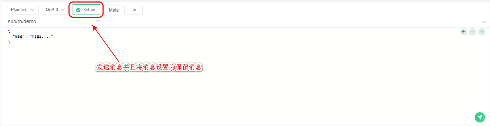

3、在sub客户端连接中，订阅`sub/rh/demo`主题，并且将`Retain Handling的值设置为0`

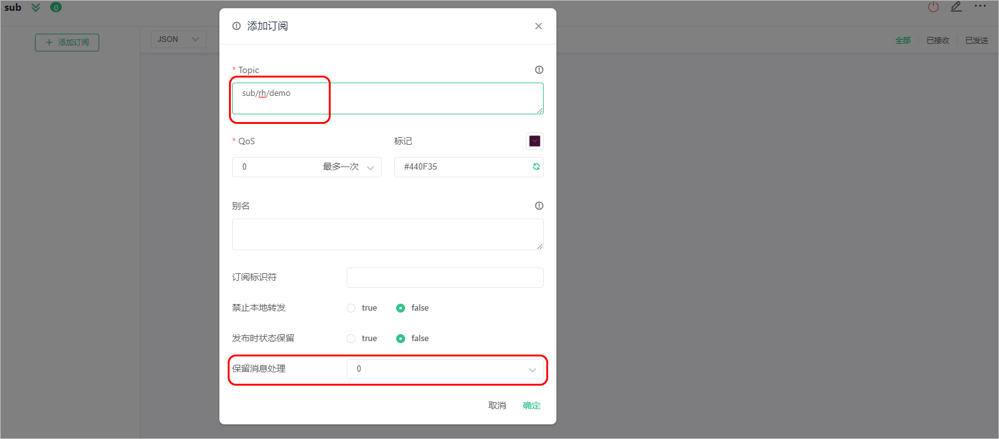

结果：只要订阅成功了，那么此时立马会收到保留消息

4、关闭客户端连接，设置客户端的`Clean Start值设置为0`表示需要复用之间的会话

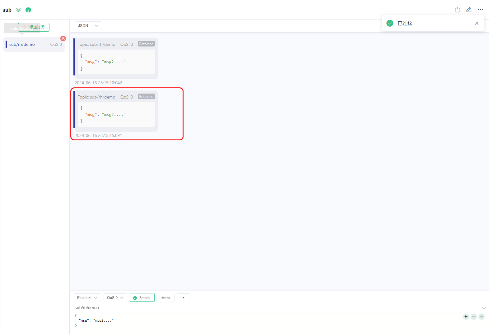

注意：只要是重新订阅成功了，那么此时就会收到保留消息

> 情况2：Retain Handling设置为1

删除sub客户端连接中的订阅，重新订阅`sub/rh/demo`主题，并且将`Retain Handling的值设置为1`，新建立的订阅是可以获取到保留消息的。

关闭当前连接，重新建立连接【会自动复用之前的订阅】，此时无法获取到保留消息。

> 情况3: Retain Handling设置为2

删除sub客户端连接中的订阅，重新订阅`sub/rh/demo`主题，并且将`Retain Handling的值设置为2`

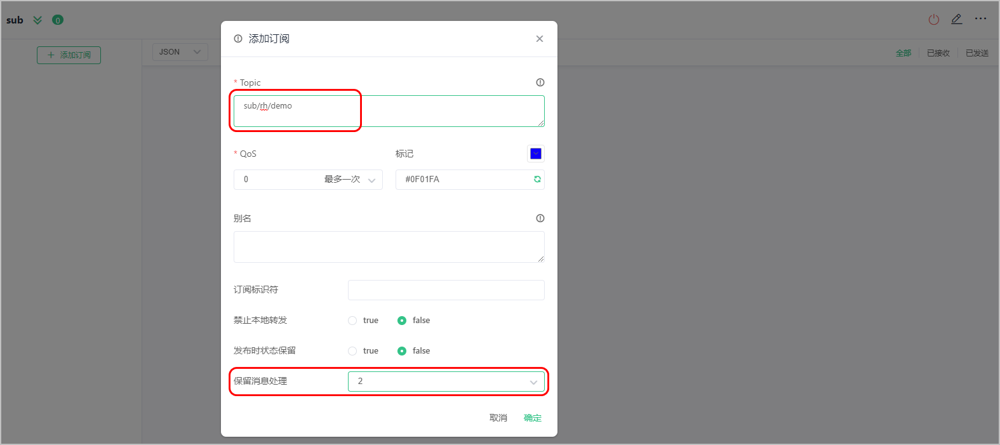

结果：即使订阅成功了，那么此时也不会收到保留消息

## 5.2 共享订阅

### 5.2.1 共享订阅简介

在普通的订阅中，我们每发布一条消息，所有匹配的订阅端都会收到该消息的副本。当某个订阅端的消费速度无法跟上消息的生产速度时，我们没有办法将其中一部分消息分

流到其他订阅端中来分担压力。这使订阅端容易成为整个消息系统的性能瓶颈。


MQTT 5.0 引入了共享订阅特性，`它使得 MQTT 服务端可以在使用特定订阅的客户端之间均衡地分配消息负载。`这表示，当我们有两个客户端共享一个订阅时，那么每个

匹配该订阅的消息都只会有一个副本投递给其中一个客户端。


共享订阅不仅为消费端带来了极佳的水平扩展能力，使我们可以应对更`高的吞吐量`，还为其带来了`高可用性`，即使共享订阅组中的一个客户端断开连接或发生故障，其他客

户端仍然可以继续处理消息，在必要时还可以接管原先流向该客户端的消息流。

### 5.2.2 共享订阅分类

启用共享订阅：为一组订阅者的原始主题添加指定前缀

共享订阅分类：

| 前缀格式     | 示例           | 前缀       | 真实主题名 |
| ------------ | -------------- | ---------- | ---------- |
| 带群组格式   | $share/abc/t/1 | $share/abc | t/1        |
| 不带群组格式 | $queue/t/1     | $queue/    | t/1        |

#### 带群组的共享订阅

您可以通过在原始主题前添加 `$share/<group-name>` 前缀为分组的订阅者启用共享订阅。组名可以是任意字符串。EMQX 同时将消息转发给不同的组，属于同一组的订

阅者可以使用负载均衡接收消息。

例如，如果订阅者 `s1`、`s2` 和 `s3` 是组 `g1` 的成员，订阅者 `s4` 和 `s5` 是组 `g2` 的成员，而所有订阅者都订阅了原始主题 `t1`。共享订阅的主题是

`$share/g1/t1` 和 `$share/g2/t1`。当 EMQX 发布消息 `msg1` 到原始主题 `t1` 时：

* EMQX 将 `msg1` 发送给 `g1` 和 `g2` 两个组。
* `s1`、`s2`、`s3` 中的一个订阅者将接收 `msg1`。
* `s4` 和 `s5` 中的一个订阅者将接收 `msg1`。

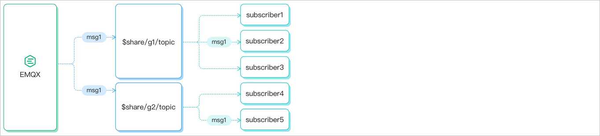

#### 不带群组的共享订阅

以 `$queue/` 为前缀的共享订阅是不带群组的共享订阅。它是 `$share` 订阅的一种特例。您可以将其理解为所有订阅者都在一个订阅组中：

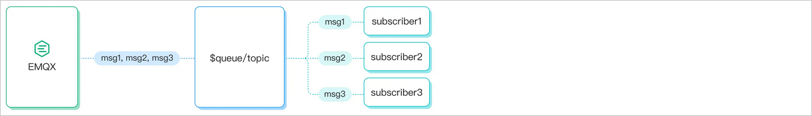

### 5.2.3 共享订阅演示

1、创建4个客户端连接分别是`sub1`、`sub2`、`sub3`、`sub4`，其中s1和s2属于同一个共享订阅组g1, s3和s4属于同一个共享订阅组g2

订阅的主题如下所示：

sub1： $share/g1/t/1

sub2： $share/g1/t/1

sub3： $share/g2/t/1

sub4： $share/g2/t/1

2、创建pub客户端连接，并且向t/1主题发布两条消息观测结果

默认的负载均衡算法：`轮询`

3、删除sub1、sub2、sub3、sub4的订阅信息，重新添加`$queue/t/1`订阅

4、通过pub客户端向t/1主题发布消息观测结果

### 5.2.5 负载均衡算法

可以通过Dashboard进行负载均衡算法的配置【管理====>MATT配置】：

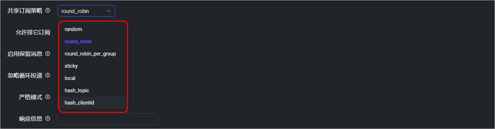

大致可以分为：

1、随机（Random），在共享订阅组内随机选择一个会话发送消息。

2、轮询（Round Robin），在共享订阅组内按顺序选择一个会话发送消息，循环往复。

3、哈希（Hash），基于某个字段的哈希结果来分配。

4、粘性（Sticky），在共享订阅组内随机选择一个会话发送消息，此后保持这一选择，直到该会话结束再重复这一过程。

6、本地优先（Local），随机选择，但优先选择与消息的发布者处于同一节点的会话，如果不存在这样的会话，则退化为普通的随机策略。

## 5.3 排它订阅

### 5.3.1 排它订阅简介

排它订阅允许对主题进行互斥订阅，`一个主题同一时刻仅被允许存在一个订阅者，在当前订阅者未取消订阅前，其他订阅者都将无法订阅对应主题。`

要进行排它订阅，您需要为主题名称添加`$exclusive/`前缀，如以下表格中的示例：

| 示例           | 前缀        | 真实主题名 |
| -------------- | ----------- | ---------- |
| $exclusive/t/1 | $exclusive/ | t/1        |

当某个客户端 **A** 订阅 `$exclusive/t/1` 后，其他客户端再订阅 `$exclusive/t/1` 时都会失败，直到 **A** 取消了对 `$exclusive/t/1` 的订阅为止。

**注意**: 排它订阅必须使用 `$exclusive/` 前缀，在上面的示例中，其他客户端依然可以通过 `t/1` 成功进行订阅。

订阅失败的常见错误码：


### 5.3.2 排它订阅演示

默认情况下排它订阅是关闭的。

具体步骤：

1、创建sub1客户端连接，并且添加`$exclusive/t/1`订阅

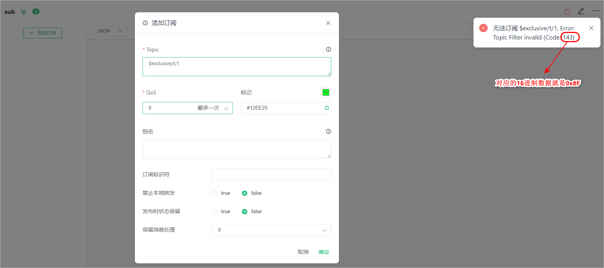

2、在Dashboard开启排它订阅配置【管理====>MATT配置】

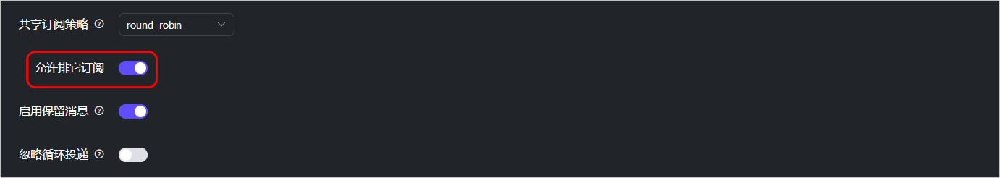

3、在sub2客户端连接中重新添加`$exclusive/t/1`订阅

4、创建sub2客户端连接，并且添加`$exclusive/t/1`订阅

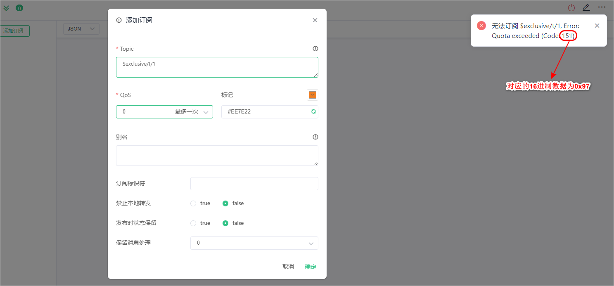

5、创建sub2客户端连接，并且添加`t/1`订阅，此时订阅成功

## 5.4 自动订阅

自动订阅能够给 EMQX 设置多个规则，在设备成功连接后按照规则为其订阅指定主题，不需要额外发起订阅。

### 5.4.1 配置自动订阅规则

通过 Dashboard 配置自动订阅规则：【管理 ====> MQTT高级特性 =====> 自动订阅 ====> 添加】

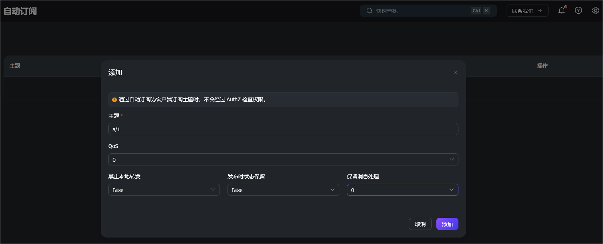

### 5.4.2 演示自动订阅使用

具体步骤：

1、创建pub客户端连接，作为发布者

2、创建sub客户端连接，作为订阅者

3、在pub客户端连接中向a/1主题发布消息

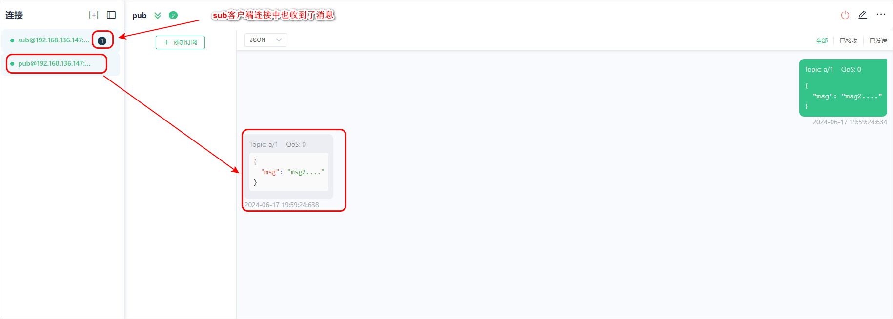

# MQTT Dashboard

# 1 Dashboard简介

EMQX 提供了一个内置的`管理控制台`，即 EMQX Dashboard。方便用户通过 Web 页面就能轻松管理和监控 EMQX 集群，并配置和使用所需的各项功能。

访问地址：<http://ip:18083>

首次登录访问账号：admin/public

重置密码：

```shell
./bin/emqx ctl admins passwd <Username> <Password>
```

# 2 访问控制

## 2.1 认证

### 2.1.1 创建认证器

认证：就是验证客户端的身份。

创建认证器大致步骤：

1、选择认证方式

2、配置数据源

3、配置数据源相关参数

**认证方式说明**

目前 EMQX 提供了三种认证方式，包含有：

1. Password-Based，使用客户端 ID 或用户名加密码的认证方式；
2. JWT，客户端可以在用户名或密码字段中携带 JWT token 来进行认证；
3. SCRAM，MQTT 5.0 中的增强认证，可以实现对客户端和服务器的双向认证。

**数据源说明**

> Password-Based

当选择 `Password-Based` 的认证方式后，用户可以选择存储认证数据的数据库或提供认证数据功能的 HTTP 服务器，数据库包含两类：

* EMQX 的内置数据库，即选择 `Built-in Database`；
* 外部数据库，支持选择并连接到一些主流数据库，包括：`MySQL`、`PostgreSQL`、`MongoDB`、`Redis` 等。

除数据库外，还可以直接使用能够提供认证数据的 HTTP 服务，即选择 `HTTP Server`。

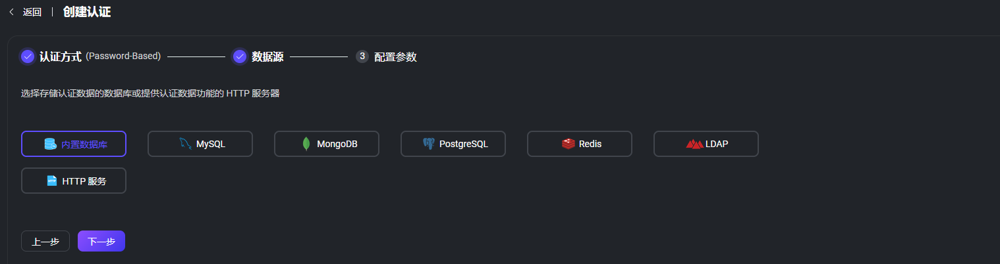

> JWT

如果选择了 JWT 的认证方式，将无需选择数据源。

> SCRAM

MQTT 5.0 中的增强认证功能，如果选择了该认证方式的话，目前仅提供了使用 `Built-in Database` 数据源。

**配置参数说明**

> 内置数据库

例如使用内置数据库的话需要选择使用用户名还是客户端 ID，选择密码的加密方式等；如果是选择了 MQTT 5.0 的增强认证，使用内置数据库的话，只需要配置加密方式

即可。

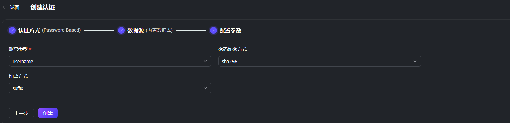

> 外部数据库

选择外部数据库的话，需要配置能访问到的数据库地址，数据库名称，用户名密码，以及认证相关配置，填写如何从数据库中获取数据的 SQL 语句或其它查询语句等。以

MySQL 为例：

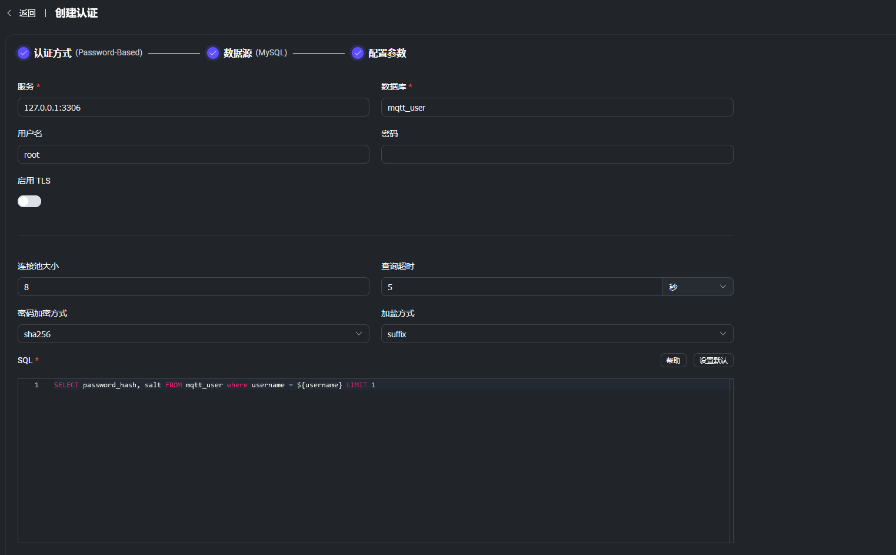

数据库环境准备：

```dockerfile
# 创建数据库
docker run -d \
-p 3306:3306 \
-v mysql8_conf:/etc/mysql/conf.d \
-v mysql8_data:/var/lib/mysql \
-e MYSQL_ROOT_PASSWORD=1234 \
--name mysql8 \
--restart=always \
--privileged=true \
mysql:8.0.30

# 导入资料中的mqtt_user.sql脚本
```

> HTTP Server

选择使用 HTTP 服务的话，需要配置请求该 HTTP 服务的请求方式，POST 或 GET 方法。请求地址 URL，注意 URL  内需要填写协议是 http 或 https，如果有端

口号的话需要在 URL 中携带端口号。然后是 HTTP 请求的 Headers  配置，携带认证信息的内容需要和请求 HTTP 服务的数据格式相同，然后配置到 `Body` 字段

中，例如将 `username` 和 `password` 填写到 JSON 数据中。

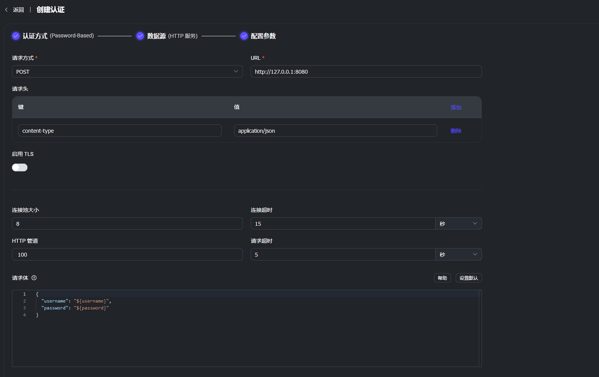

### 2.1.2 认证列表

创建认证器成功后，可以在认证列表中查看和管理。认证列表的每一栏都可以通过鼠标来拖动`调整顺序`，或通过操作栏调整列表顺序，顺序对于认证列表来说有一定的重要

性，因为EMQX允许创建多个认证器，这些`认证器将按照在认证链中的位置顺序运行`，如果在当前认证器中未检索到匹配的认证信息，将会切换至链上的下一个认证器继续

认证过程。

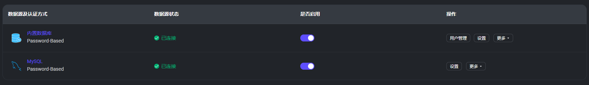

**认证链的认证流程**，以密码认证为例，通常这会产生以下 2 种情况：

1. 当前认证器执行时检索到了匹配的认证信息，例如用户名一致：

   1.1 密码完全匹配，则客户端认证通过，允许连接。

   1.2 密码无法匹配，则客户端认证失败，拒绝连接。

2. 当前认证器执行时没有检索到匹配的认证信息，例如数据源中没有查找到数据：

   2.1 当前认证器之后还有认证器：忽略认证，交由下一认证器继续认证。

   2.2 当前认证器已经是链中最后一个认证器：客户端认证失败，拒绝连接。

### 2.1.3 用户管理

对于使用`内置数据库`的用户来说，在认证列表页点击 `用户管理`，可以来到用户管理页面，在该页面，可以管理认证信息，例如添加或删除用户名和密码，也可以通过下载

模版，在模版内填充好相关的认证信息，点击 `导入` 来批量创建认证相关的用户信息。

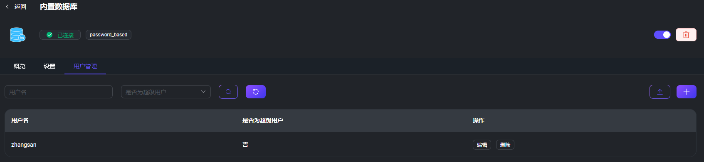

### 2.1.4 客户端连接

当在MQTT的服务端创建完认证器以后，那么此时客户端在进行连接的时候就需要出示认证信息，如果未出示认证信息，那么此时就会报错`Error: Connection`

`refused: Bad User Name or Password`

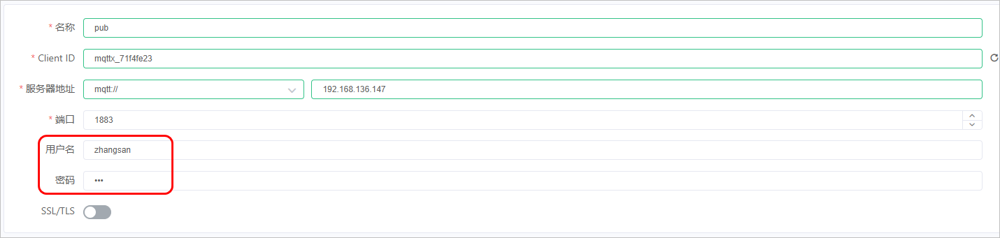

## 2.2 授权

### 2.2.1 授权简介

通常情况下，认证只是验证了客户端的身份是否合法，而该客户端是否具备发布、订阅某些主题的权限，还需要由`授权系统`来判断。在 EMQX 中，**授权是指对 MQTT 客户**

**端的发布和订阅操作进行权限控制**。

授权检查器链：

1、EMQX支持多种授权检查机制：基于ACL文件(默认配置)、基于内置数据库、基于MySQL进行授权、基于 MongoDB 进行授权 、基于 PostgreSQL 进行授权 、基于

Redis进行授权、基于HTTP应用进行授权 ...

2、EMQX 支持用户通过配置多个授权检查器构成`授权链`，以实现更灵活的授权检查。EMQX 将按照授权链中配置的检查器顺序依次执行授权检查。如果在当前授权检查

器中未检索到权限数据，将会切换至链上的下一个启用的授权检查器继续权限检查。

### 2.2.2 ACL文件授权演示

> 1、ACL授权说明

EMQX 支持基于 ACL 文件中存储的规则进行授权检查。您可在文件中配置多条授权检查规则，在收到客户端的操作请求后，EMQX 会按照从上到下的顺序进行授权规则匹

配；在成功匹配到某条规则后，EMQX 将按设定允许或拒绝当前请求，并停止后续规则的匹配。

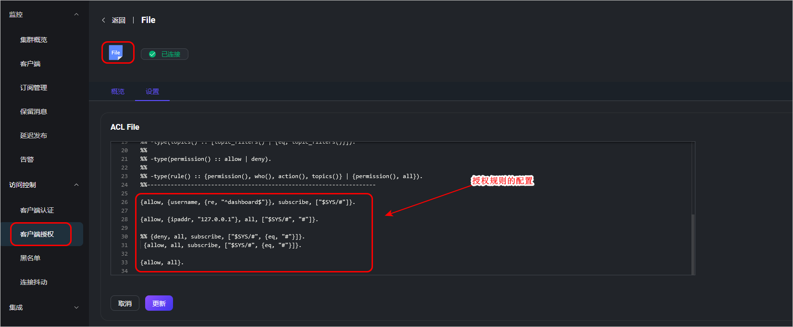

> 2、文件格式介绍

基本语法和概念如下：

* 一组授权规则一个花括号包起来，花括号内的各个元素用逗号分隔
* 每条规则应以 `.` 结尾
* 注释行以 `%%` 开头，在解析过程中会被丢弃

代码示例：

```shell
%% 允许用户名是 dashboard 的客户端订阅 "$SYS/#" 这个主题
{allow, {user, "dashboard"}, subscribe, ["$SYS/#"]}.

%% 允许来自127.0.0.1 的用户发布和订阅 "$SYS/#" 以及 "#"
{allow, {ipaddr, "127.0.0.1"}, all, ["$SYS/#", "#"]}.

%% 拒绝其他所有用户订阅 `$SYS/#`，`#` 和 `+/#` 主题
{deny, all, subscribe, ["$SYS/#", {eq, "#"}, {eq, "+/#"}]}.

%% 如果前面的规则都没有匹配到，则允许所有操作
%% 注意：在生产环境中，最后一条规则应该设置为 `{deny, all}`，并且配置 `authorization.no_match = deny`
{allow, all}.
```

在每一组授权规则中：

1、第一个元素表示该条规则对应的权限；可选值：

* `allow` （允许）
* `deny`（拒绝）

2、第二个元素用来指定适用此条规则的客户端，比如：

* `{username, "dashboard"}`：用户名为 `dashboard` 的客户端；也可写作`{user, "dashboard"}`

* `{username, {re, "^dash"}}`：用户名匹配 正则表达式 `^dash` 的客户端

* `{clientid, "dashboard"}`：客户端 ID 为 `dashboard` 的客户端，也可写作`{client, "dashboard"}`

* `{clientid, {re, "^dash"}}`：客户端 ID 匹配 正则表达式 `^dash` 的客户端

* `{ipaddr, "127.0.0.1"}`：源地址为 `127.0.0.1` 的客户端；支持 CIDR 地址格式。注意：如果 EMQX 部署在负载均衡器后侧，建议为 EMQX 的监听器开启

  `proxy_protocol` 配置 ，否则 EMQX 可能会使用负载均衡器的源地址。

* `{ipaddrs, ["127.0.0.1", ..., ]}`：来自多个源地址的客户端，不同 IP 地址之间以 `,` 区分

* `all`：匹配所有客户端

* `{'and', [Spec1, Spec2, ...]}` ：满足列表中所有规范的客户端。

* `{'or', [Spec1, Spec2, ...]}` ：满足列表中任何规范的客户端。

3、第三个元素用来指定该条规则对应的操作：

* `publish`：发布消息

* `subscribe`：订阅主题

* `all`：发布消息和订阅主题

* 从 v5.1.1 版本开始，EMQX 支持检查发布与订阅操作中的 QoS 与保留消息标志位，您可以在第三个元素中加上 `qos`或者`retain`来指定检查的 QoS 或保留消息

  标志位，例如：

  * `{publish, [{qos, 1}, {retain, false}]}`：拒绝发布 QoS 为 1 的保留消息
  * `{publish, {retain, true}}`：拒绝发布保留消息
  * `{subscribe, {qos, 2}}`：拒绝以 QoS2 订阅主题

4、第四个元素用于指定当前规则适用的 MQTT 主题，支持通配符（主题过滤器），可以使用`主题占位符`：

* `"t/${clientid}"`：使用了主题占位符，当客户端 ID 为 `emqx_c` 的客户端触发检查时，将精确匹配 `t/emqx_c` 主题
* `"$SYS/#"`：通过通配符匹配 `$SYS/` 开头的所有主题，如 `$SYS/foo`、 `$SYS/foo/bar`
* `{eq, "foo/#"}`：精确匹配 `foo/#` 主题，主题 `foo/bar` 将无法匹配，此处 `eq` 表示全等比较（equal）

另外还有 2 种特殊的规则，通常会用在 ACL 文件的末尾作为默认规则使用。

* `{allow, all}`：允许所有请求
* `{deny, all}`：拒绝所有请求

> 3、配置演示

在Dashboard的中权限配置文件中添加如下的配置：

```shell
# 拒绝任意的客户端订阅test/#这种规则的主题
{deny, all, subscribe, ["test/#"]}.
```

如下所示：

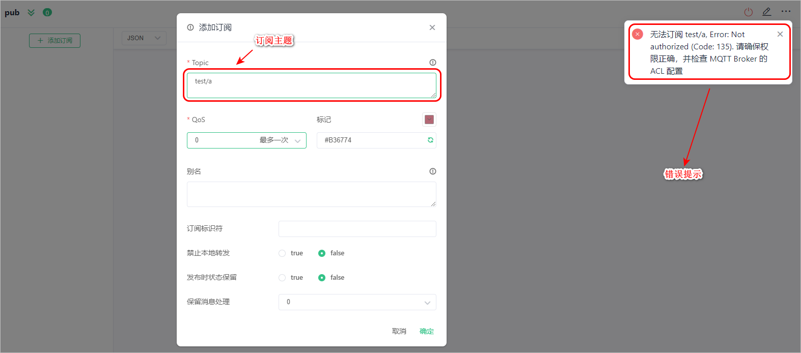

### 2.2.3 基于内置数据库授权演示

EMQX 通过内置数据库为用户提供了一种低成本、开箱即用的授权规则存储方式。可以通过 Dashboard 设置使用内置数据库作为数据源。

通过 Dashboard 配置：

1、在 EMQX Dashboard 页面，点击左侧导航栏的 **访问控制** -> **授权**，在 **授权** 页面，添加 **Built-in Database** 作为 **数据源**， 点击**下一步**进入 **配置参数**

页签。由于无需配置其他参数，可直接点击 **创建** 完成配置。

2、通过 Dashboard 配置：在 Dashboard 的 **授权** 页面，点击 **Built-in Database** 数据源对应的 **操作**栏下的 **权限管理**，即可进行授权检查规则的配置。

您可根据需要从客户端 ID、用户名或直接从主题角度设置授权检查。

* **客户端 ID**：见 **客户端 ID** 页签，指定适用此条规则的客户端
* **用户名**：见 **用户名** 页签，指定适用此条规则的用户名
* **权限**：是否允许当前客户端/用户的某类操作请求；可选值：**允许**、**拒绝**
* **操作**：配置该条规则对应的操作；可选值：**发布**、**订阅**、**发布与订阅**
* **主题**：配置该条规则对应的主题

EMQX 支持针对单个客户端或用户配置多条授权检查规则，您可通过页面的 **上移**、**下移** 调整不同规则的执行顺序和优先级。

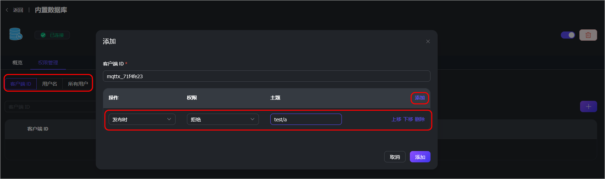

注意：可以通过主题订阅来验证消息是否发送成功

# 3 黑名单与连接抖动检测

## 3.1 黑名单

EMQX 为用户提供了黑名单功能来`禁止`某些客户端的访问，除了可以`封禁客户端 ID`以外，还支持直接`封禁用户名甚至 IP`地址。

封禁还可以通过规则来实现，这些规则包括：

1、使用正则表达式匹配客户端标识符和用户名。

2、使用 CIDR 范围匹配源 IP 地址。

**创建黑名单：**

1. 在 EMQX Dashboard 页面，点击左侧导航栏的**访问控制** -> **黑名单**，在随即打开的页面，单击**创建**。

2. 在弹出的**创建**页面，按照页面提示配置：

   2.1 **禁用对象**：通过下拉列表选择封禁客户端的方式，可以指定**客户端 ID**、**用户名**、**IP 地址**、**客户端 ID 模式**、**用户名模式**或 **IP 地址范围**，然后提供相应的值。

   2.2 **到期时间**（可选）：设置该规则的到期时间。

   2.3 **原因**（可选）：说明为该对象设置黑名单的原因。

3. 点击**创建**完成配置。

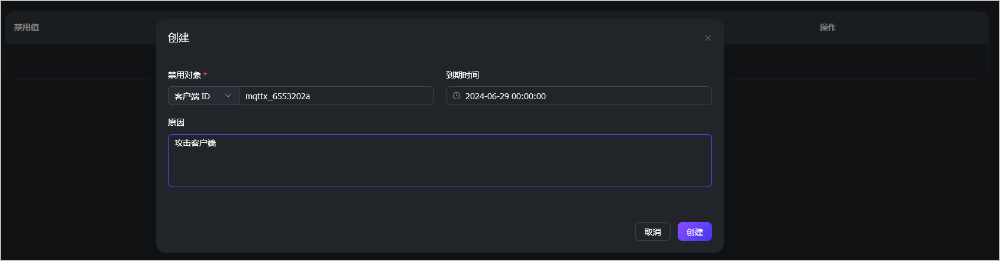

## 3.2 连接抖动检测

EMQX 支持`自动封禁那些被检测到短时间内频繁登录的客户端，并且在一段时间内拒绝这些客户端的登录，以避免此类客户端过多占用服务器资源而影响其他客户端的正常`

`使用。`

需要注意的是，连接抖动检测功能`只会封禁客户端 ID，并不封禁用户名和 IP 地址`，即该机器只要更换客户端标 ID 就能够继续登录。

抖动检测功能默认关闭，您可以通过 EMQX Dashboard 或配置文件开启该功能。

通过 Dashboard 开启:

前往 Dashboard，从左侧导航菜单点击**访问控制** -> **连接抖动** 进入**连接抖动**页面。通过点击切换按钮启用抖动检测功能。

1、**检测时间窗口**：您可以指定系统监视客户端抖动行为的持续时间。默认值为 `1` 分钟。

2、**最大断连次数**：您可以指定在检测窗口时间内允许的 MQTT 客户端的最大断开连接次数。它允许您设定准确的标准来识别和响应表现出抖动行为的客户端。默认值为

`15`。

3、**封禁时长**：您可以指定客户端被封禁的时间长度。默认值为 `5` 分钟。

点击**保存更改**以完成设置。


配置完毕进行测试：

# 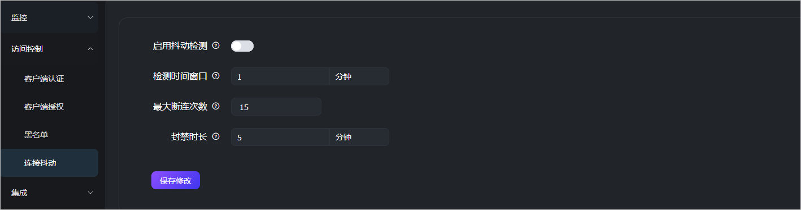 4 数据集成

## 4.1 数据集成概述

思考问题：如何将一个物联网设备产生的数据传输到业务系统中?


上述方案的弊端：较为麻烦

**数据集成**：为 EMQX 引入了与外部数据系统的连接，从而以实现设备与其他业务系统的无缝集成。

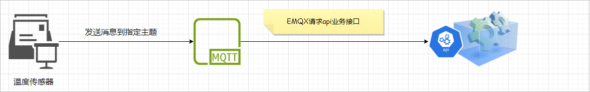

EMQX的数据集成功能不单单可以快速的将物联网设备产生的数据传递到业务系统中，也可以和其他的**外部数据系统**进行集成，实现数据的快速传输。比如：从Kafka某一个

主题中获取数据，然后将数据写入到Redis中。

## 4.2 工作原理介绍

**sink和source组件**：

数据集成使用 `Sink` 与 `Source` 组件与外部数据系统对接。

1、Sink 用于将消息发送到外部数据系统，例如 MySQL、Kafka 或 HTTP  服务等。

2、Source 则用于从外部数据系统接收消息，例如 MQTT、Kafka 或 GCP PubSub。

**连接器**：

连接器负责与外部数据系统的连接，用户可以为不同的外部数据系统创建不同的连接器，一个连接器可以为多个 Sink/Source 提供连接。

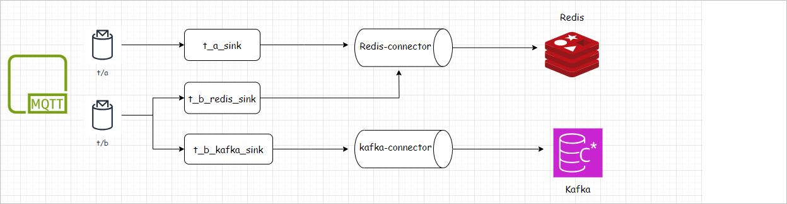

**规则引擎**：

规则引擎是 EMQX 内置基于 SQL 的数据处理组件，搭配数据集成无需编写代码即可实现一站式的 IoT 数据提取、过滤、转换、存储与处理，以加速应用集成和业务创

新。

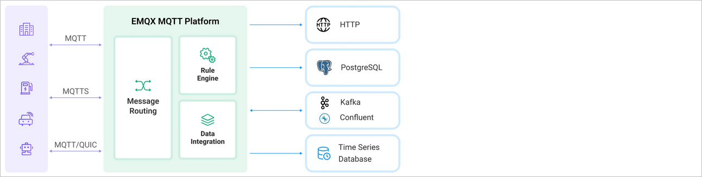

规则的组成：规则描述了 **数据来源**、**数据处理过程**、**处理结果去向** 三个方面：


1、数据来源：规则的数据源可以是消息或事件，也可以是外部的数据系统 (**source**)。规则通过 SQL 的 FROM 子句指定数据的来源；

2、数据处理过程：规则通过 `SQL` 语句和`函数`来描述数据的处理过程。SQL 的 WHERE 子句用于过滤数据，SELECT 子句以及 SQL 函数用于提取和转换数据；

3、处理结果去向：规则可以定义一个或多个动作来处理 SQL 的输出结果。如果 SQL 执行通过，规则将按顺序执行相应的动作，比如将处理结果存储到数据库、或者重新

发布到另一个 MQTT 主题等。支持的动作如下：

* 消息重发布：将结果发布到指定 MQTT 主题
* 控制台输出：将结果输出到控制台或日志中
* 发送到各类 Sink：将结果发送到外部数据系统中，如 MQTT 服务，Kafka，PostgreSQL 等

## 4.3 数据集成入门

需求：将客户端发往't/a'主题中的消息输出到EMQX的控制台

具体步骤：

1、进入到Dashboard中，依次点击"集成" ----> "规则" ----> "创建" 进入到创建规则的表单页面

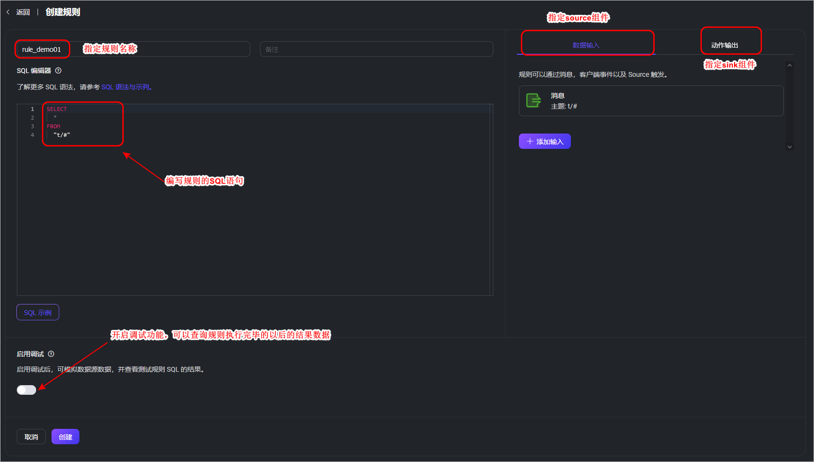

2、配置好规则source和sink组件以后，可以点击对规则进行调试

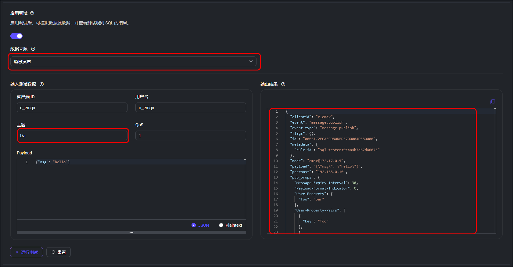

3、启动MQTTX客户端和服务端建立连接，并且向`t/a`主题发布消息，查看EMQX控制台的日志输出

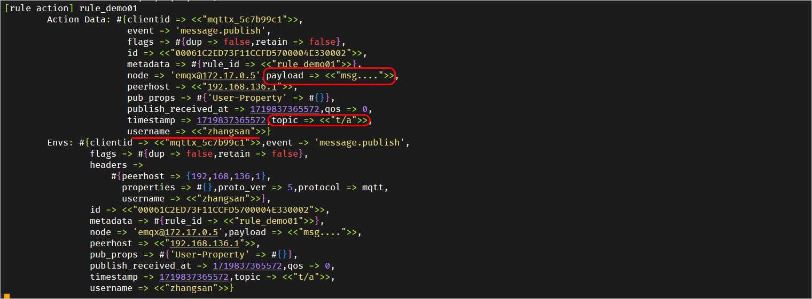

## 4.4 连接器使用

### 4.4.1 案例一

需求：将客户端发往't/b'主题中的消息输出到EMQX的控制台和Redis中

```shell
# Docker部署Redis
docker run -d -p 6379:6379 --restart=always \
-v redis_config:/etc/redis/config \
-v redis_data:/data \
--name redis redis:7.0.10 \
redis-server /etc/redis/config/redis.conf
 
#redis启动的使用 redis-server 自定义加载一个配置文件

# 在redis_config数据卷所对应的磁盘目录下创建一个redis.conf文件，文件的内容如下所示
appendonly yes      # 开启持久化， redis的持久化方式：rdb、aof
port 6379   # 配置Redis进程对应的端口号为6379
requirepass 1234 # 配置Redis访问密码
bind 0.0.0.0  # 允许任意的客户端进行链接访问
```

具体步骤：

1、进入到Dashboard中，依次点击"集成" ----> "规则" ----> "创建" 进入到创建规则的表单页面，点击`动作输出`添加一个sink

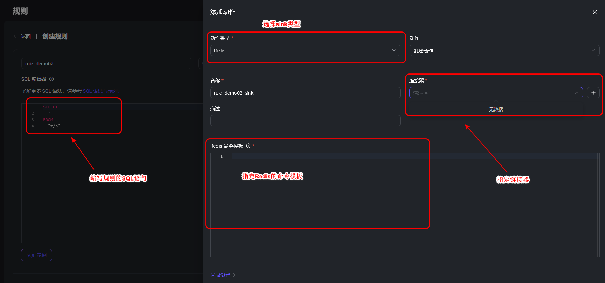

备注：

Redis的命令模板：`HSET emqx_messages:${clientid} username ${username} payload ${payload} timestamp ${timestamp}`

2、点击"+"号添加连接器

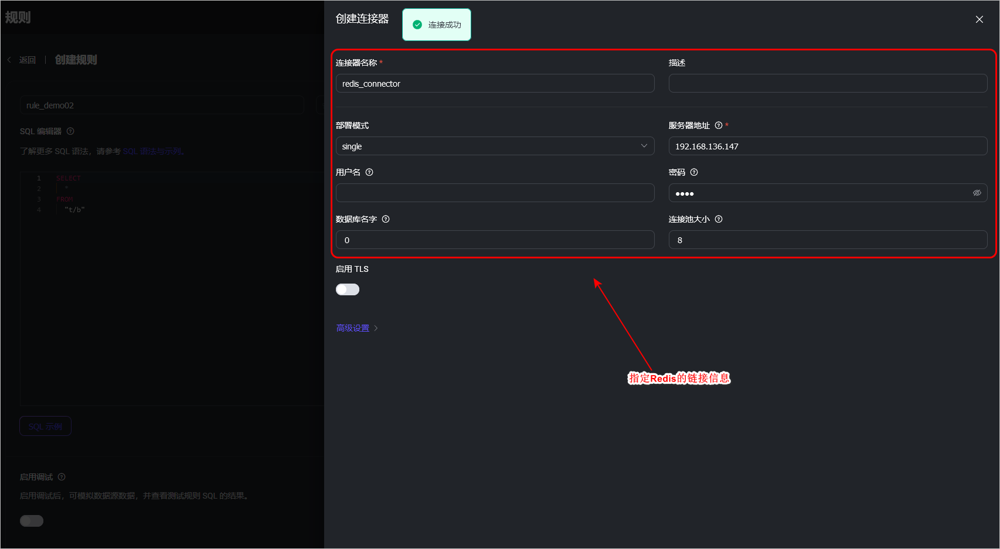

3、添加完毕以后效果如下图所示

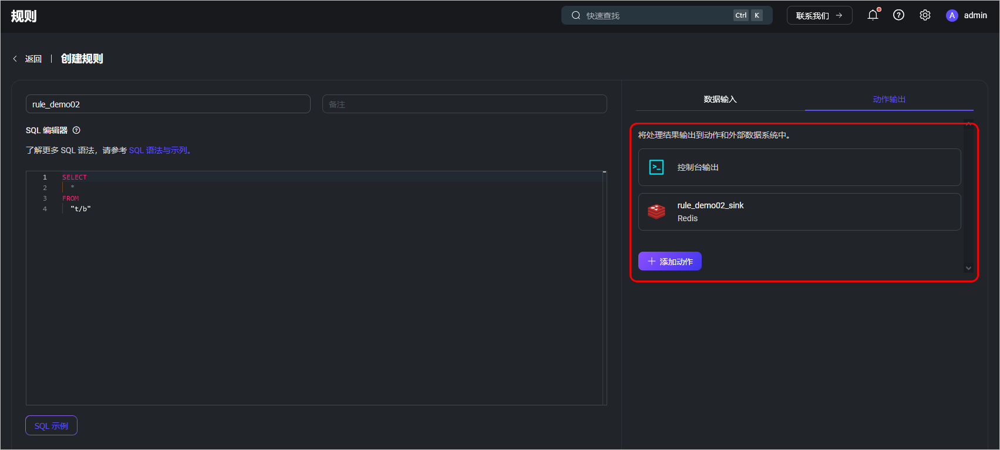

也可以通过flow设计器查看对应的拓扑图

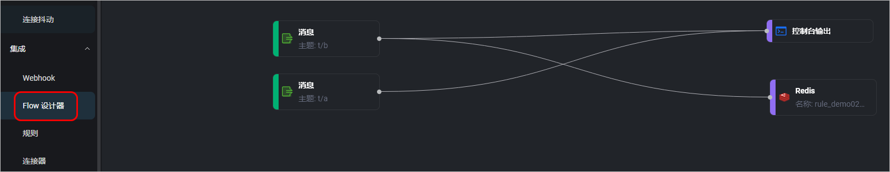

4、使用MQTTX向't/b'主题中发送消息进行测试，观察Redis中的数据状态

### 4.4.1 案例二

需求：将发往Kafka中的`test_mqtt_topic`主题中的消息输出到EMQX的控制台和Redis中

```java
使用课程资料中的docker-compose.yml文件搭建kafka环境。
注意服务器端需要在安全组中开放对应的端口号：2181、8048、9092
```

具体步骤：

1、在Kafka中创建`test_mqtt_topic`主题

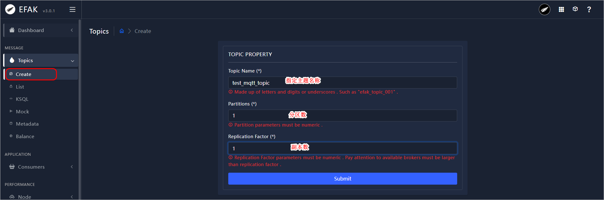

2、进入到Dashboard中，依次点击"集成" ----> "规则" ----> "创建" 进入到创建规则的表单页面，点击`数据输入`添加一个source

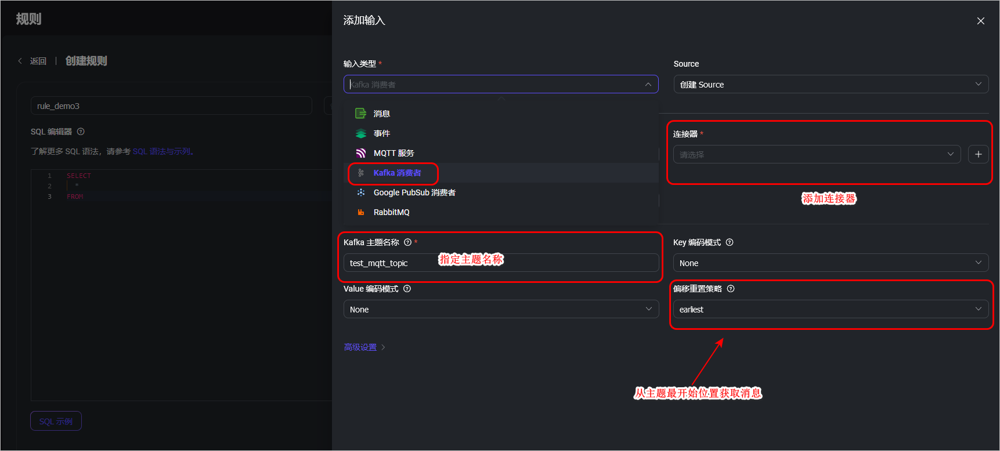

3、在添加source动作的页面，添加连接器"+"号，添加kafka的连接器

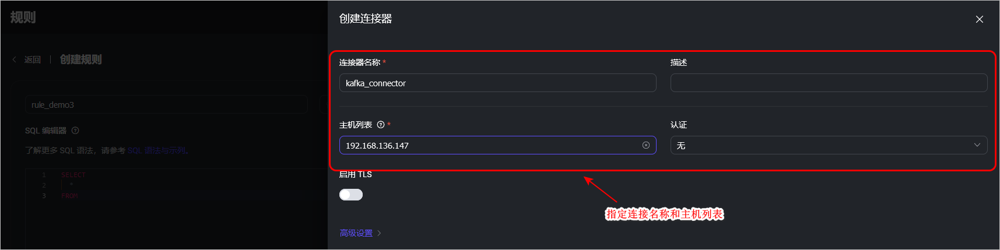

4、在创建规则的表单页面，点击`动作输出`添加控制台输出和Redis输出的sink

Redis的命令模板如下所示：

```shell
HSET kafka_mqtt:${topic} offset ${offset} value ${value}
```

命令参数可以通过控制台输出进行确定。

5、向Kafka中的`test_mqtt_topic`发送消息

具体步骤：

5.1、创建一个基于spring boot 3.0.5构建的web项目，加入如下依赖

```xml
<parent>
    <groupId>org.springframework.boot</groupId>
    <artifactId>spring-boot-starter-parent</artifactId>
    <version>3.0.5</version>
</parent>

<dependencies>

    <dependency>
        <groupId>org.springframework.boot</groupId>
        <artifactId>spring-boot-starter-web</artifactId>
    </dependency>

    <dependency>
        <groupId>org.springframework.kafka</groupId>
        <artifactId>spring-kafka</artifactId>
    </dependency>

    <dependency>
        <groupId>org.springframework.boot</groupId>
        <artifactId>spring-boot-starter-test</artifactId>
    </dependency>

</dependencies>
```

5.2、在application.yml文件中添加如下配置

```yaml
spring:
  kafka:
    producer:
      bootstrap-servers: 192.168.136.147:9092
```

5.3、编写启动类

```java
@SpringBootApplication
public class MqttKafkaApplication {

    public static void main(String[] args) {
        SpringApplication.run(MqttKafkaApplication.class , args) ;
    }

}
```

5.4 编写测试类，发送消息

```java
@SpringBootTest(classes = MqttKafkaApplication.class)
public class MqttKafkaProducerTest {

    @Autowired
    private KafkaTemplate<String , String> kafkaTemplate;

    @Test
    public void sendMsg() {
        kafkaTemplate.send("test_mqtt_topic" , "mqtt kafka producer msg....") ;
    }

}
```

发送消息进行测试，观察Redis中的数据状态：

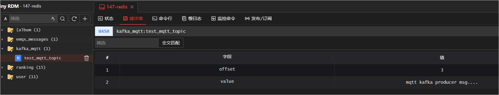

## 4.5 SQL语法介绍

SQL 处理结果将以 JSON 形式呈现在**输出结果**部分。SQL 处理结果中的所有字段都可以通过后续操作（内置操作或 Sink）以 `${key}`的形式进行引用。

### 4.5.1 FROM、SELECT 和 WHERE 子句

规则的 SQL 语句基本格式为:

```shell
SELECT <字段名> FROM <主题> [WHERE <条件>]
```

举例：

```shell
## SELECT 语句用于决定最终的输出结果里的字段。比如:
## 下面 SQL 的输出结果中将只有两个字段 "a" 和 "b":
SELECT a, b FROM "t/#"

# 选取 username 为 'abc' 的终端发来的消息，输出结果为所有可用字段:
SELECT * FROM "#" WHERE username = 'abc'

## 选取 clientid 为 'abc' 的终端发来的消息，输出结果将只有 cid 一个字段。
## 注意 cid 变量是在 SELECT 语句中定义的，故可在 WHERE 语句中使用:
SELECT clientid as cid FROM "#" WHERE cid = 'abc'

## 选取 username 为 'abc' 的终端发来的消息，输出结果将只有 cid 一个字段。
## 注意虽然 SELECT 语句中只选取了 cid 一个字段，所有消息发布事件中的可用字段 (比如 clientid、username 等) 仍然可以在 WHERE 语句中使用:
SELECT clientid as cid FROM "#" WHERE username = 'abc'

## 但下面这个 SQL 语句就不能工作了，因为变量 xyz 既不是消息发布事件中的可用字段，又没有在 SELECT 语句中定义:
SELECT clientid as cid FROM "#" WHERE xyz = 'abc'
```

FROM 语句用于选择事件来源。如果是消息发布则填写消息的主题，如果是事件则填写对应的事件主题。

### 4.5.2 FOREACH、DO 和 INCASE 子句

#### 语法介绍

如果对于一个数组数据，想针对数组中的每个元素分别执行一些操作并执行 Actions，需要使用 `FOREACH-DO-INCASE` 语法。其基本格式为:

```shell
FOREACH <字段名> [DO <条件>] [INCASE <条件>] FROM <主题> [WHERE <条件>]

FOREACH 子句用于选择需要做 foreach 操作的字段，注意选择出的字段必须为数组类型
DO 子句用于对 FOREACH 选择出来的数组中的每个元素进行变换，并选择出感兴趣的字段
INCASE 子句用于对 DO 选择出来的某个字段施加条件过滤


FOREACH
    payload.sensors as e ## 选择出的字段必须为数组类型
DO                       ## DO 相当于针对当前循环中对象的 SELECT 子句，决定最终的输出结果里的字段
    clientid,
    e.name as name,
    e.idx as idx
INCASE                  ## INCASE 相当于针对当前循环中对象的 WHERE 语句
    e.idx >= 1          ## 对DO选择出来的某个字段施加条件过滤
FROM "t/#"              ## 子句将规则挂载到某个主题上
```

#### 案例演示

假设有 ClientID 为 `c_steve`、主题为 `t/1` 的消息，消息体为 JSON 格式，其中 sensors 字段为包含多个 Object 的数组:

```shell
{
    "date": "2024-07-05",
    "sensors": [
        {"name": "a", "idx":0},
        {"name": "b", "idx":1},
        {"name": "c", "idx":2}
    ]
}
```

**示例 1：要求将 sensors 里的各个对象，分别作为数据输入重新发布消息到 `sensors/${idx}` 主题，内容为 `${name}`。即最终规则将会发出 3 条消息:**

1. 主题：sensors/0 内容：a
2. 主题：sensors/1 内容：b
3. 主题：sensors/2 内容：c

要完成这个规则，我们需要配置如下动作：

1、动作类型：消息重新发布 (republish)

2、目的主题：sensors/${idx}

3、目的 QoS：0

4、消息内容模板：${name}

以及如下 SQL 语句：

```shell
FOREACH
    payload.sensors
FROM "t/#"
```

示例解析:

这个 SQL 中，FOREACH 子句指定需要进行遍历的数组 sensors，则选取结果为(json):

```
[
  {
    "name": "a",
    "idx": 0
  },
  {
    "name": "b",
    "idx": 1
  },
  {
    "name": "c",
    "idx": 2
  }
]
```

FOREACH 语句将会对于结果数组里的每个对象分别执行 `消息重新发布` 动作，所以将会执行重新发布动作 3 次。

输出动作添加如下所示：

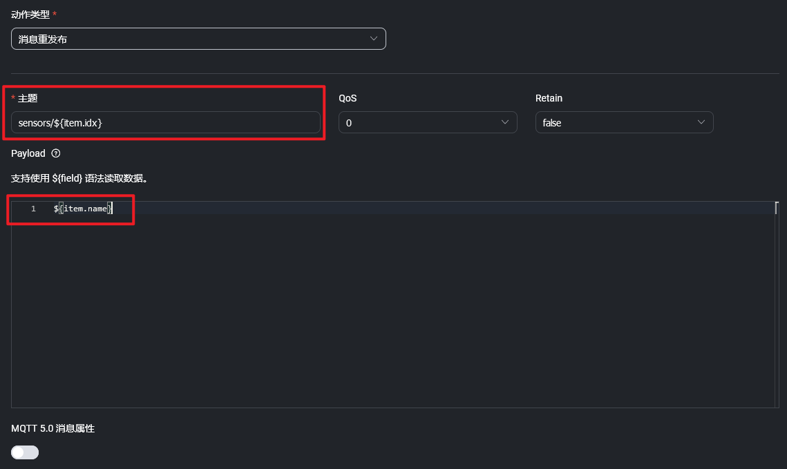

也可以对上述的案例进行改造，使用DO字句指定选择出感兴趣的字段，如下所示：

```sql
FOREACH
    payload.sensors as e
DO 
    e.name as name , 
    e.idx as idx
FROM "t/1"
```

此时在指定输出动作的时候可以省略item：

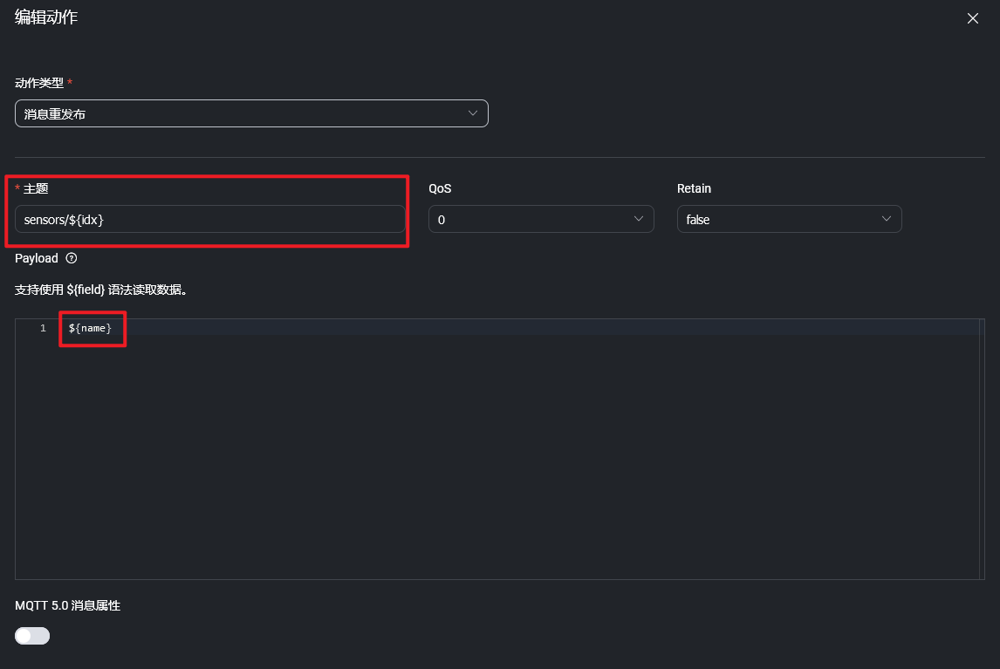

**示例 2：要求将 sensors 里的 `idx` 值大于或等于 1 的对象，分别作为数据输入重新发布消息到 `sensors/${idx}` 主题，内容为**

**`clientid=${clientid},name=${name},date=${date}`。即最终规则将会发出 2 条消息:**

1. 主题：sensors/1 内容：clientid=c_steve,name=b,date=2020-04-24
2. 主题：sensors/2 内容：clientid=c_steve,name=c,date=2020-04-24

要完成这个规则，我们需要配置如下动作：

1、动作类型：消息重新发布 (republish)

2、目的主题：sensors/${idx}

3、目的 QoS：0

4、消息内容模板：**`clientid=${clientid},name=${name},date=${date}`**

以及如下 SQL 语句：

```sql
FOREACH
    payload.sensors as e
DO
  clientid , 
  payload.date as date,
  e.idx as idx ,
  e.name as name
INCASE
  e.idx >= 1  
FROM "t/#"
```

此时在指定输出动作的时候可以省略item：


### 4.5.3 CASE-WHEN 语法示例

CASE-WHEN语法和MySQL中的很类似，当满足某一个条件的时候，取指定的数据值，如下所示：

**示例：将消息中 x 字段的值范围限定在 0~7 之间。**

```shell
SELECT
  CASE WHEN payload.x < 0 THEN 0
       WHEN payload.x > 7 THEN 7
       ELSE payload.x
  END as x
FROM "t/#"
```

假设消息为:

```json
{"x": 8}
```

则上面的 SQL 输出为:

```json
{"x": 7}
```

### 4.5.4 内置SQL函数

规则引擎提供了各种内置函数，您可以在 SQL 中使用这些函数实现基本的数据处理，包括 数学运算、数据类型判断、数据类型转换、字符串操作、映射操作、数组操作、

哈希、压缩与解压缩、位操作、位序列操作、编解码 以及 日期与时间转换。

官网地址：<https://docs.emqx.com/zh/emqx/v5.6/data-integration/rule-sql-builtin-functions.html>

举例说明：

```sql
FOREACH
    payload.sensors as e
DO 
    abs(-1) as abs,
    concat(e.name , 'xian') as address ,
    clientid ,
    e.name as name , 
    e.idx as idx
INCASE
    e.idx >= 1
FROM "t/1"
```

向主题't/1'发送如下消息：

```sql
{
    "date": "2024-07-05",
    "sensors": [
        {"name": "a", "idx":0},
        {"name": "b", "idx":1},
        {"name": "c", "idx":2}
    ]
}
```

观察控制台日志输出：

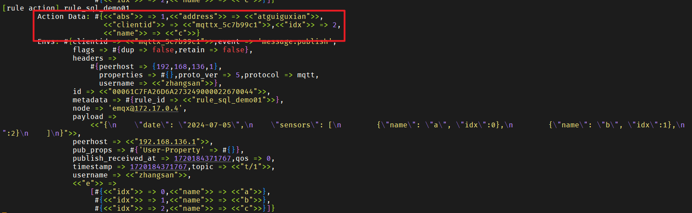

## 4.6 Webhook

### 4.6.1 Webhook简介

Webhook 提供了一种将 EMQX 客户端消息和事件集成到外部 HTTP 服务器的方法。

Webhook 是 EMQX 中开箱即用的功能。当客户端向特定主题发布消息，或执行特定操作时就会触发 Webhook，将事件数据和消息数据转发到预设的 HTTP 服务器中。

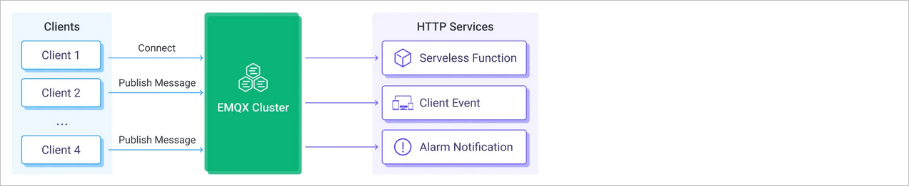

### 4.6.2 Webhook演示

具体步骤：

1、定义http的请求接口

```java
@RestController
@RequestMapping(value = "/webHook")
public class WebHookController {

    @PostMapping(value = "/notify")
    public void notify(@RequestBody Map<Object , Object> body) {
        System.out.println(body);
    }

}
```

2、在Dashboard中创建Webhook

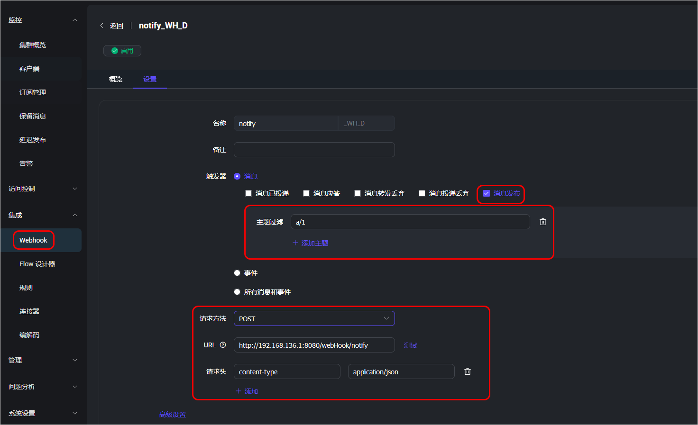

3、通过MQTTX向`a/1`主题发布消息，观察http服务控制台输出

# 5 日志管理

## 5.1 日志简介

通过 EMQX 的日志功能，您可查看`客户端访问、操作系统或网络异常等问题`，如登录错误，异常访问，性能故障等等，并基于日志信息进行问题排查或系统性能优化。

EMQX  支持两种不同的日志输出方式：

1、控制台输出日志(默认值)

2、文件输出日志。

日志级别：

EMQX 日志包含 8 个等级，默认为 warning 级别，由低到高分别为：

```console
debug < info < notice < warning < error < critical < alert < emergency
```

每一种日志输出的内容如下所示：

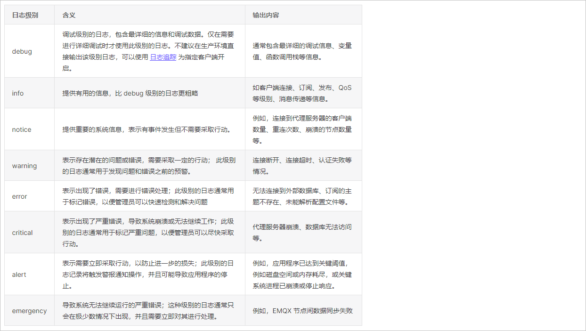

EMQX只会输出比配置日志级别高的日志数据。

## 5.2 日志配置

通过EMQX Dashboard 可以方便的修改日志配置。`保存修改后将立即生效，无需重启节点。`点击左侧导航栏的 **管理**-> **日志**。选择相应的页签配置控制台输出日志或文

件输出日志。

### 5.2.1 控制台日志配置

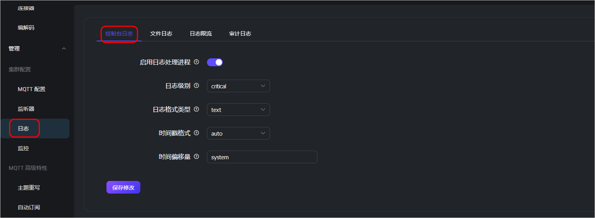

配置控制台日志处理进程的选项：

1、**启用日志处理进程**：单击切换开关以启用控制台日志处理进程。

2、**日志级别**：从下拉列表中选择要使用的日志级别。可选值为：`debug`, `info`, `notice`, `warning`, `error`, `critical`, `alert`, `emergency` 。默认值

为：`warning`。

3、**日志格式类型**：从下拉列表中选择日志格式。可选值为：`text` 和 `json`。默认值为 `text`。

4、**时间戳格式**：从下拉列表中选择日志时间戳格式。可选值为：

* `auto`: 根据所使用的日志格式类型自动确定时间戳格式。对于文本格式类型，使用 `rfc3339` 格式；对于 JSON 格式类型，则使用 `epoch`格式。
* `epoch`: 时间戳以微秒精度的 Unix 纪元时间格式表示。
* `rfc3339`: 时间戳使用符合 RFC3339 标准的日期时间字符串格式，格式示例为 `2024-03-26T11:52:19.777087+00:00`。

* **时间偏移量**：定义日志中时间相对 UTC 的偏移量，默认情况下跟随系统，默认值为 `system`。

完成配置后，点击 **保存更改**。

### 5.2.2 文件输出日志配置

在日志页面，选择文件日志页签：

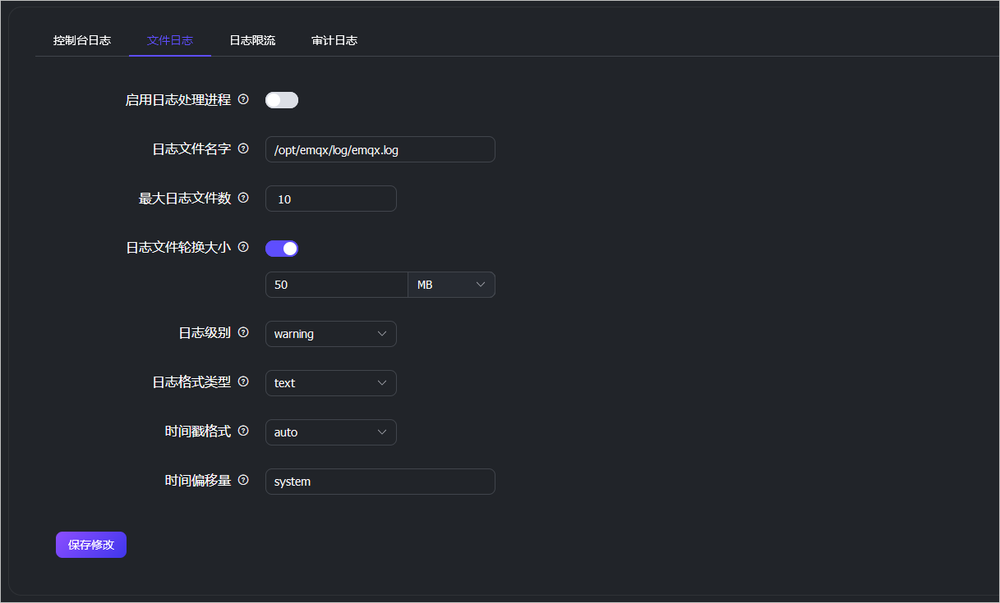

配置文件日志处理进程的选项：

1、**启用日志处理进程**：单击切换开关以启用文件日志处理进程。

2、**日志文件名字**：填写日志文件的名称。默认为`/opt/emqx/log/emqx.log`。

3、**最大日志文件数**：轮换的最大日志文件数。默认值为`10`。

4、**日志文件轮换大小**：设置日志文件大小，达到设定的值时日志文件将进行轮换。如果禁用，则日志文件将无限增长。可在文本框输入设定的值，在下拉列表中选择单

位，可选值为：`MB`, `GB`, `KB`。

5、**日志级别**：从下拉列表中选择要使用的日志级别。可选值为：`debug`, `info`, `notice`, `warning`, `error`, `critical`, `alert`, `emergency` 。默认值

为：`warning`。

6、**日志格式类型**：从下拉列表中选择日志格式。可选值为：`text` 和 `json`。默认值为 `text`。

7、时间戳格式

从下拉列表中选择日志时间戳格式。可选值为：

* `auto`: 根据所使用的日志格式类型自动确定时间戳格式。对于文本格式类型，使用 `rfc3339` 格式；对于 JSON 格式类型，则使用 `epoch`格式。
* `epoch`: 时间戳以微秒精度的 Unix 纪元时间格式表示。
* `rfc3339`: 时间戳使用符合 RFC3339 标准的日期时间字符串格式，格式示例为 `2024-03-26T11:52:19.777087+00:00`。

* **时间偏移量**：定义日志中时间相对 UTC 的偏移量，默认情况下跟随系统，默认值为 `system`。

完成配置后，点击**保存修改**。

在文件日志启用后，日志目录下会有如下几种文件:

* **emqx.log.N:** 以 emqx.log 为前缀的文件为日志文件，包含了 EMQX 的所有日志消息。比如 `emqx.log.1`、`emqx.log.2` ...
* **emqx.log.siz 和 emqx.log.idx:** 用于记录日志滚动信息的系统文件，**请不要手动修改**。

# MQTT 客户端编程

# 1 在VUE中使用MQTT

具体步骤如下所示：

1、初始化vue项目

```javascript
// 创建一个使用vite构建的前端项目
npm create vite@latest

// 进入到项目中，执行如下命令安装项目依赖
npm install 
```

2、安装element plus

```javascript
// 安装element plus
npm install element-plus --save

// 安装mqtt.js依赖
npm install mqtt --save

// 在main.js中添加如下代码
import { createApp } from 'vue'
import App from './App.vue'
import ElementPlus from 'element-plus'
import 'element-plus/dist/index.css'

const app = createApp(App)
app.use(ElementPlus)
app.mount('#app')
```

3、导入课程资料中的MqttDemo.vue页面到components文件夹下

4、更改App.vue页面代码如下所示

```vue
<script setup>
import MqttDemo from "./components/MqttDemo.vue";
</script>

<template>
  <MqttDemo/>
</template>

<style>
</style>
```

**5、建立和关闭连接**

```vue
<script setup>
import mqtt from "mqtt";

// 定义链接信息对象
const connectionInfo = ref({
  protocol: 'ws',
  host: "192.168.136.147",
  port: 8083,
  clientId: "emqx_vue3_" + Math.random().toString(16).substring(2, 8),
  username: "zhangsan",
  password: "123",
  clean: true,
  connectTimeout: 10 * 1000, // ms
  reconnectPeriod: 4000, // ms
})

// 创建链接对象
const client = ref({})
const clientInitData = ref({      // 链接初始化相关数据
  connnected: false
})

// 建立连接事件处理函数
const createConnection = () => {

  const { protocol, host, port , ...options } = connectionInfo.value;
  const connectUrl = `${protocol}://${host}:${port}/mqtt`;
  console.log(connectUrl)
  client.value = mqtt.connect(connectUrl , options);   // 建立连接
  clientInitData.value.connnected = true ;
  console.info("createConnection successful...")

}

// 端口链接事件处理函数
const closeConnection = () => {

  // 关闭链接
  client.value.end(false , () => {   // 如果设置为true，将会立即关闭套接字，并且不发送MQTT DISCONNECT包。如果设置为false（默认值），则会发送MQTT DISCONNECT包给代理，然后关闭套接字。
    clientInitData.value.connnected = false;
    console.info("closeConnection successful...")
  })

}
</script>

<template>
  <div class="mqtt-demo">
    <el-card>
      <h1>配置信息</h1>
      <el-form label-position="top" >
        <el-row :gutter="20">

          <el-col :span="8">
            <el-form-item prop="protocol" label="选择协议">
              <el-select v-model="connectionInfo.protocol">
                <el-option label="ws://" value="ws"></el-option>
                <el-option label="wss://" value="wss"></el-option>
              </el-select>
            </el-form-item>
          </el-col>

          <el-col :span="8">
            <el-form-item prop="host" label="主机地址">
              <el-input v-model="connectionInfo.host" ></el-input>
            </el-form-item>
          </el-col>

          <el-col :span="8">
            <el-form-item prop="port" label="端口号">
              <el-input type="number" v-model="connectionInfo.port" placeholder="8083/8084"></el-input>
            </el-form-item>
          </el-col>

          <el-col :span="8">
            <el-form-item prop="clientId" label="客户端ID">
              <el-input v-model="connectionInfo.clientId"> </el-input>
            </el-form-item>
          </el-col>

          <el-col :span="8">
            <el-form-item prop="username" label="用户名">
              <el-input v-model="connectionInfo.username"></el-input>
            </el-form-item>
          </el-col>

          <el-col :span="8">
            <el-form-item prop="password" label="密码">
              <el-input v-model="connectionInfo.password"></el-input>
            </el-form-item>
          </el-col>

          <el-col :span="24">
            <el-button type="primary" :disabled="clientInitData.connnected" @click="createConnection">建立连接</el-button>
            <el-button type="danger" :disabled="!clientInitData.connnected" @click="closeConnection">断开连接</el-button>
          </el-col>

        </el-row>
      </el-form>
    </el-card>
   </div>
</template>
```

**6、订阅和取消订阅**

```vue
<script setup>
    
// 消息质量取值数组
const qosList = [0, 1, 2];
const receivedMessages = ref(null)
const subscriptionInfo = ref({     // 订阅参数数据模型
  topic: '' ,
  qos: 0
})
const subscriptionInitData = ref({ // 订阅初始化数据
  subscription: false
})

// 定义定义主题的事件处理函数
const subscriptionTopicHandler = () => {

  const { topic, qos } = subscriptionInfo.value
  console.info(qos)
  client.value.subscribe(topic, { qos } , (error , res) => {
    if(error) {
      console.info("subscriptionTopic Error:", error);
      return ;
    }
    subscriptionInitData.value.subscription = true ;
    console.info("subscriptionTopic successful.... ");

    // 订阅成功以后，监听发送消息事件
    client.value.on('message' , (topic , message) => {
      console.info("topic -----> " + topic + ", message -----> " + message)
      receivedMessages.value = "topic -----> " + topic + ", message -----> " + message ;
    })

  })

}

// 定义取消订阅的事件处理函数
const unSubscriptionTopicHandler = () => {
  const {topic, qos } = subscriptionInfo.value
  client.value.unsubscribe(topic, { qos } , (error , res) => {
    if(error) {
      console.info("unSubscriptionTopic Error:", error);
      return ;
    }
    subscriptionInitData.value.subscription = false ;
    console.info("unSubscriptionTopic successful.... ");

  })
}

</script>

<template>

     <el-card>
          <h1>订阅主题</h1>
          <el-form label-position="top" >
            <el-row :gutter="20">
              <el-col :span="8">
                <el-form-item prop="topic" label="Topic">
                  <el-input v-model="subscriptionInfo.topic"></el-input>
                </el-form-item>
              </el-col>
              <el-col :span="8">
                <el-form-item prop="qos" label="QoS">
                  <el-select v-model="subscriptionInfo.qos">
                    <el-option
                        v-for="qos in qosList"
                        :key="qos"
                        :label="qos"
                        :value="qos"
                    ></el-option>
                  </el-select>
                </el-form-item>
              </el-col>
              <el-col :span="8">
                <el-button  type="primary" class="sub-btn" :disabled="subscriptionInitData.subscription" @click="subscriptionTopicHandler">订阅主题</el-button>
                <el-button type="primary" class="sub-btn" :disabled="!subscriptionInitData.subscription" @click="unSubscriptionTopicHandler">取消订阅</el-button>
              </el-col>
            </el-row>
          </el-form>
        </el-card>

</template>
```

**7、发布消息**

```vue
<script setup>
    
// 发布消息参数
const publishInfo = ref({
  topic: '' ,
  qos: 0,
  payLoad: ''
})
    
// 定义发布消息的事件处理函数
const doPublish = () => {
  const {topic , payLoad , qos } = publishInfo.value ;
  client.value.publish(topic , payLoad , { qos } , (error , res) => {
    if(error) {
      console.info("publish msg info error...." , error)
      return ;
    }
    console.info("publish msg info successful....")
  }) ;

}

</script>
<template>

 <el-card>
      <h1>发布消息</h1>
      <el-form label-position="top" >
        <el-row :gutter="20">
          <el-col :span="8">
            <el-form-item prop="topic" label="Topic">
              <el-input v-model="publishInfo.topic"></el-input>
            </el-form-item>
          </el-col>
          <el-col :span="8">
            <el-form-item prop="payload" label="Payload">
              <el-input v-model="publishInfo.payLoad"></el-input>
            </el-form-item>
          </el-col>
          <el-col :span="8">
            <el-form-item prop="qos" label="QoS">
              <el-select v-model="publishInfo.qos">
                <el-option
                    v-for="qos in qosList"
                    :key="qos"
                    :label="qos"
                    :value="qos"
                ></el-option>
              </el-select>
            </el-form-item>
          </el-col>
        </el-row>
      </el-form>
      <el-col :span="24" class="text-right">
        <el-button type="primary" @click="doPublish">发布消息</el-button>
      </el-col>
    </el-card>

</template>
```

# 2 在Java中使用MQTT

## 2.1 Eclipse Paho Java Client

具体步骤：

1、创建一个Spring Boot项目，添加如下依赖

```xml
<parent>
    <groupId>org.springframework.boot</groupId>
    <artifactId>spring-boot-starter-parent</artifactId>
    <version>3.0.5</version>
</parent>

<dependencies>

    <!-- spring boot整合junit单元测试的起步依赖 -->
    <dependency>
        <groupId>org.springframework.boot</groupId>
        <artifactId>spring-boot-starter-test</artifactId>
    </dependency>

    <!-- mqtt java客户端依赖 -->
    <dependency>
        <groupId>org.eclipse.paho</groupId>
        <artifactId>org.eclipse.paho.client.mqttv3</artifactId>
        <version>1.2.5</version>
    </dependency>

</dependencies>
```

2、建立连接代码实现

```java
@Test
public void createConnection() throws MqttException {

    // 定义链接相关参数
    String broker = "tcp://192.168.136.147:1883";
    String username = "zhangsan";
    String password = "123";
    String clientid = "mqtt_java_client_01";

    // 创建MqttJava客户端对象
    // MqttClientPersistence: 代表一个持久的数据存储，用于在传输过程中存储出站和入站的信息
    MqttClient client = new MqttClient(broker, clientid , new MemoryPersistence());   
    MqttConnectOptions options = new MqttConnectOptions();
    options.setUserName(username);
    options.setPassword(password.toCharArray());
    client.connect(options);

    // 阻塞当前线程
    while (true) ;
}
```

3、发布消息代码演示

```java
@Test
public void sendMessage() throws MqttException {

    // 定义链接相关参数
    String broker = "tcp://192.168.136.147:1883";
    String username = "zhangsan";
    String password = "123";
    String clientid = "mqtt_java_client_01";

    // 创建MqttJava客户端对象
    MqttClient client = new MqttClient(broker, clientid , new MemoryPersistence());
    MqttConnectOptions options = new MqttConnectOptions();
    options.setUserName(username);
    options.setPassword(password.toCharArray());
    client.connect(options);

    // 创建消息对象QoS
    String content = "hello mqtt";
    MqttMessage message = new MqttMessage(content.getBytes());
    message.setQos(2);
    message.setRetained(true);

    // 发送消息
    client.publish("a/c" , message);

    // 关闭链接释放资源
    client.disconnect();
    client.close();

}
```

4、订阅主题获取消息

```java
@Test
public void receiveMessage() throws MqttException {

    // 定义链接相关参数
    String broker = "tcp://192.168.136.147:1883";
    String username = "zhangsan";
    String password = "123";
    String clientid = "mqtt_java_client_02";

    // 创建MqttJava客户端对象
    MqttClient client = new MqttClient(broker, clientid , new MemoryPersistence());
    MqttConnectOptions options = new MqttConnectOptions();
    options.setUserName(username);
    options.setPassword(password.toCharArray());

    // 添加回调函数获取主题消息
    client.setCallback(new MqttCallback() {
        
        @Override
        public void connectionLost(Throwable cause) {  // 连接丢失时被调用
            System.out.println("connectionLost: " + cause.getMessage());
        }

        @Override
        public void messageArrived(String topic, MqttMessage message) throws Exception {  // 接收到消息时被调用
            System.out.println("topic: " + topic);
            System.out.println("Qos: " + message.getQos());
            System.out.println("message content: " + new String(message.getPayload()));
        }

        @Override
        public void deliveryComplete(IMqttDeliveryToken token) {  // 消息接收完成时被调用
            System.out.println("deliveryComplete---------" + token.isComplete());
        }
        
    });

    // 订阅主题
    client.connect(options);
    client.subscribe("a/d" , 2);

    while(true) ;

}
```

## 2.2 spring-integration-mqtt

### 2.2.1 基础环境搭建

1、创建一个Spring Boot项目，并加入如下依赖：

```xml
<dependencies>
 
    <!-- spring boot项目web开发的起步依赖 -->
    <dependency>
        <groupId>org.springframework.boot</groupId>
        <artifactId>spring-boot-starter-web</artifactId>
    </dependency>

 <!-- spring boot项目集成消息中间件基础依赖 -->
    <dependency>
        <groupId>org.springframework.boot</groupId>
        <artifactId>spring-boot-starter-integration</artifactId>
    </dependency>

 <!-- spring boot项目和mqtt客户端集成起步依赖 -->
    <dependency>
        <groupId>org.springframework.integration</groupId>
        <artifactId>spring-integration-mqtt</artifactId>
        <version>5.4.3</version>
    </dependency>

    <!-- lombok依赖 -->
    <dependency>
        <groupId>org.projectlombok</groupId>
        <artifactId>lombok</artifactId>
    </dependency>

    <!-- fastjson依赖 -->
    <dependency>
        <groupId>com.alibaba</groupId>
        <artifactId>fastjson</artifactId>
        <version>1.2.83</version>
    </dependency>

</dependencies>
```

2、编写启动类

```java
@EnableConfigurationProperties(value = MqttConfigurationProperties.class)
@SpringBootApplication
public class MqttDemoApplication {

    public static void main(String[] args) {
        SpringApplication.run(MqttDemoApplication.class , args) ;
    }

}
```

3、在application.yml文件中添加如下配置

```yaml
spring:
  mqtt:
    username: zhangsan
    password: 123
    url: tcp://192.168.136.147:1883
    subClientId: sub_client_id_123
    subTopic: atguigu/iot/lamp/line
    pubClientId: pub_client_id_123
```

4、创建实体类读取自定义配置

```java
@Data
@ConfigurationProperties(prefix = "spring.mqtt")
public class MqttConfigurationProperties {

    private String username;
    private String password;
    private String url;
    private String subClientId ;
    private String subTopic ;
    private String pubClientId ;

}
```

5、创建配置类配置链接工厂

```java
@Configuration
public class MqttConfiguration {

    @Autowired
    private MqttConfigurationProperties mqttConfigurationProperties ;

    @Bean
    public MqttPahoClientFactory mqttClientFactory(){

        // 创建客户端工厂
        DefaultMqttPahoClientFactory factory = new DefaultMqttPahoClientFactory();

        // 创建MqttConnectOptions对象
        MqttConnectOptions options = new MqttConnectOptions();
        options.setCleanSession(true);
        options.setUserName(mqttConfigurationProperties.getUsername());
        options.setPassword(mqttConfigurationProperties.getPassword().toCharArray());
        options.setServerURIs(new String[]{mqttConfigurationProperties.getUrl()});
        factory.setConnectionOptions(options);

        // 返回
        return factory;
    }

}
```

### 2.2.2 订阅主题获取消息

具体步骤：

1、配置入站适配器

```java
@Configuration
public class MqttInboundConfiguration {

    @Autowired
    private MqttConfigurationProperties mqttConfigurationProperties ;

    @Autowired
    private ReceiverMessageHandler receiverMessageHandler;

    /**
     * 配置消息传输通道
     * @return
     */
    @Bean
    public MessageChannel mqttInputChannel() {
        return new DirectChannel();
    }

    /**
     * 配置入站适配器
     */
    @Bean
    public MessageProducer messageProducer(MqttPahoClientFactory mqttPahoClientFactory) {
        MqttPahoMessageDrivenChannelAdapter adapter  =
                new MqttPahoMessageDrivenChannelAdapter(mqttConfigurationProperties.getUrl() ,
                        mqttConfigurationProperties.getSubClientId() ,
                        mqttPahoClientFactory , mqttConfigurationProperties.getSubTopic().split(",")) ;
        adapter.setConverter(new DefaultPahoMessageConverter());
        adapter.setQos(1);
        adapter.setOutputChannel(mqttInputChannel());
        return adapter ;
    }

    /**
     * 配置入站消息处理器
     * @return
     */
    @Bean
    @ServiceActivator(inputChannel = "mqttInputChannel")
    public MessageHandler messageHandler() {
        return this.receiverMessageHandler ;
    }

}
```

2、定义监听主题消息的处理器

```java
@Component
public class ReceiverMessageHandler implements MessageHandler {

    @Override
    public void handleMessage(Message<?> message) throws MessagingException {
        MessageHeaders headers = message.getHeaders();
        String receivedTopicName = (String) headers.get("mqtt_receivedTopic");
        if("atguigu/iot/lamp/line".equals(receivedTopicName)) {
            System.out.println("接收到消息：" + message.getPayload());
        }
    }

}
```

测试：通过MQTTX向`atguigu/iot/lamp/line`主题发送消息

### 2.2.3 向指定主题发送消息

具体步骤：

1、配置出站消息处理器

```java
@Configuration
public class MqttOutboundConfiguration {

    @Autowired
    private MqttConfigurationProperties mqttConfigurationProperties ;

    @Autowired
    private MqttPahoClientFactory pahoClientFactory ;

    @Bean
    public MessageChannel mqttOutputChannel() {
        return new DirectChannel();
    }

    @Bean
    @ServiceActivator(inputChannel = "mqttOutputChannel")
    public MessageHandler mqttOutboundMassageHandler() {
        MqttPahoMessageHandler messageHandler = new MqttPahoMessageHandler(mqttConfigurationProperties.getUrl() ,
                mqttConfigurationProperties.getPubClientId() , pahoClientFactory ) ;
        messageHandler.setAsync(true);
        messageHandler.setDefaultQos(0);
        messageHandler.setDefaultTopic("default");
        return messageHandler ;
    }

}
```

2、定义发送消息的网关接口

```java
@MessagingGateway(defaultRequestChannel = "mqttOutputChannel")
public interface MqttGateway {

    /**
     * 发送mqtt消息
     * @param topic 主题
     * @param payload 内容
     */
    void sendToMqtt(@Header(MqttHeaders.TOPIC) String topic, String payload);

    /**
     * 发送包含qos的消息
     * @param topic 主题
     * @param qos 对消息处理的几种机制。
     *          * 0 表示的是订阅者没收到消息不会再次发送，消息会丢失。<br>
     *          * 1 表示的是会尝试重试，一直到接收到消息，但这种情况可能导致订阅者收到多次重复消息。<br>
     *          * 2 多了一次去重的动作，确保订阅者收到的消息有一次。
     * @param payload 消息体
     */
    void sendToMqtt(@Header(MqttHeaders.TOPIC) String topic, @Header(MqttHeaders.QOS) int qos, String payload);
    
}
```

3、定义发送消息的服务类

```java
@Component
@AllArgsConstructor
public class MqttMessageSender {

    private MqttGateway mqttGateway;

    /**
     * 发送mqtt消息
     * @param topic 主题
     * @param message 内容
     */
    public void send(String topic, String message) {
        mqttGateway.sendToMqtt(topic, message);
    }

    /**
     * 发送包含qos的消息
     * @param topic 主题
     * @param qos 质量
     * @param message 消息体
     */
    public void send(String topic, int qos, byte[] message){
        mqttGateway.sendToMqtt(topic, qos, message);
    }
}
```

# 3 智能灯泡案例

需求：

1、智能灯泡设备上线以后向MQTT服务端发送消息，后端服务从MQTT中获取消息记录设备信息到数据库中

2、后端微服务向MQTT服务端发送开灯或者关灯消息，设备端从MQTT中获取消息控制灯泡的开和关

3、设备端对灯泡进行开和关操作的时候向MQTT中发送消息，后端服务获取MQTT消息记录灯泡的开关状态

## 3.1 服务端获取设备上线消息

### 3.1.1 环境准备

具体步骤：

1、创建对应的数据库表

```sql
-- 智能灯泡设备表
CREATE TABLE `tb_lamp` (
  `id` bigint NOT NULL AUTO_INCREMENT,
  `deviceId` varchar(50) DEFAULT NULL,
  `status` int DEFAULT NULL COMMENT '1：上线  0：下线',
  `create_time` datetime NOT NULL DEFAULT CURRENT_TIMESTAMP ,
  `update_time` datetime NOT NULL DEFAULT CURRENT_TIMESTAMP ON UPDATE CURRENT_TIMESTAMP,
  PRIMARY KEY (`id`)
) ENGINE=InnoDB DEFAULT CHARSET=utf8mb4 COLLATE=utf8mb4_0900_ai_ci;

-- 智能灯泡设备状态表
CREATE TABLE `tb_lamp_status` (
  `id` int NOT NULL AUTO_INCREMENT,
  `deviceId` varchar(50) DEFAULT NULL,
  `status` int DEFAULT NULL COMMENT '0: 关灯   1：开灯',
  `create_time` datetime NOT NULL DEFAULT CURRENT_TIMESTAMP,
  PRIMARY KEY (`id`)
) ENGINE=InnoDB DEFAULT CHARSET=utf8mb4 COLLATE=utf8mb4_0900_ai_ci;
```

2、在spring-integration-mqtt案例中加入如下依赖

```xml
<dependency>
    <groupId>com.baomidou</groupId>
    <artifactId>mybatis-plus-boot-starter</artifactId>
    <version>3.5.3.1</version>
</dependency>

<dependency>
    <groupId>mysql</groupId>
    <artifactId>mysql-connector-java</artifactId>
    <version>8.0.32</version>
</dependency>
```

3、在application.yml文件中加入如下依赖

```yaml
spring:
  datasource:
    driver-class-name: com.mysql.cj.jdbc.Driver
    url: jdbc:mysql://192.168.136.147:3306/lamp_test?useUnicode=true&characterEncoding=utf-8&useSSL=false&serverTimezone=Asia/Shanghai
    username: root
    password: 1234

mybatis-plus:
  configuration:
    log-impl: org.apache.ibatis.logging.stdout.StdOutImpl
    map-underscore-to-camel-case: true
  mapper-locations: classpath*:mapper/*Mapper.xml
```

4、通过mybatis的逆向工程生成tb_lamp和tb_lamp_status表对应的基础代码

5、在启动类上添加`@MapperScan`注解指定Mapper接口的包路径

### 3.1.2 接口说明

> 接口一：设备上线

当终端设备连接上EMQX以后，发送上线消息到EMQX服务端，说明如下：

```shell
主题: atguigu/iot/lamp/line
消息内容：
    {
        "deviceId": "xxxxxx",
        "online": 1
    }
数据说明：
 deviceId: 设备id
 online:   上线状态，1表示上线，0表示离线
```

### 3.1.3 业务代码

对`ReceiverMessageHandler`类的代码进行如下改造：

```java
@Component
public class ReceiverMessageHandler implements MessageHandler {

    @Autowired
    private TbLampService tbLampService ;

    @Override
    public void handleMessage(Message<?> message) throws MessagingException {
        MessageHeaders headers = message.getHeaders();
        String receivedTopicName = (String) headers.get("mqtt_receivedTopic");
        if("atguigu/iot/lamp/line".equals(receivedTopicName)) {
            tbLampService.updateLampOnlineStatus(message.getPayload().toString()) ;        // 更新智能灯泡的上线状态
        }
    }

}
```

对`TbLampServiceImpl`类的代码进行如下改造：

```java
@Service
public class TbLampServiceImpl extends ServiceImpl<TbLampMapper, TbLamp> implements TbLampService {

    @Override
    public void updateLampOnlineStatus(String jsonInfo) {

        // 解析消息获取设备id和上线状态
        Map<String ,  Object> map = JSON.parseObject(jsonInfo, Map.class);
        String deviceId = map.get("deviceId").toString();
        Integer status = Integer.parseInt(map.get("online").toString());

        // 根据设备的id查询设备数据
        LambdaQueryWrapper<TbLamp> lambdaQueryWrapper = new LambdaQueryWrapper<>() ;
        lambdaQueryWrapper.eq(TbLamp::getDeviceid , deviceId) ;
        TbLamp tbLamp = this.getOne(lambdaQueryWrapper);
        if(tbLamp == null) {        // 设备不存在，新增设备
           tbLamp = new TbLamp() ;
           tbLamp.setDeviceid(deviceId);
           tbLamp.setStatus(status);
           this.save(tbLamp) ;
        }else {     // 设备已经存在，修改设备的状态
            tbLamp.setStatus(status);
            tbLamp.setUpdateTime(new Date());
            this.updateById(tbLamp) ;
        }
    }

}
```

## 3.2 服务端发送关灯开灯消息到MQTT

### 3.2.1 接口说明

> 接口三：后端发送消息控制智能灯泡开关

后端可以发送控制灯泡状态消息到EMQX中，设备端监听指定主题获取消息，控制灯泡的开关状态，说明如下：

```shell
主题: atguigu/iot/lamp/server/status
消息内容：
 {
  "deviceId": "xxxxxx",
  "status": 0
 }
数据说明：  
 status： 0：关灯   ， 1：开灯
```

### 3.2.2 业务代码

在spring-integration-mqtt案例中添加如下controller接口方法

```java
@RestController
@RequestMapping(value = "/api/lamp")
public class LampApiController {

    @Autowired
    private MqttMessageSender mqttMessageSender;

    @GetMapping(value = "/{deviceId}/{status}")
    public String sendStatusLampMsg(@PathVariable(value = "deviceId") String deviceId , @PathVariable(value = "status") Integer status) {
        Map<String , Object> map = new HashMap<>() ;
        map.put("deviceId" , deviceId) ;
        map.put("status" , status) ;
        String json = JSON.toJSONString(map);
        mqttMessageSender.send("atguigu/iot/lamp/server/status" , json);
        return "ok" ;
    }

}
```

## 3.3 服务端获取设备开灯关灯消息

### 3.3.1 接口说明

> 接口四：设备端改变智能灯泡开关的状态，状态发给给后端，后端记录状态 

```shell
主题：atguigu/iot/lamp/device/status
消息内容：
 {
  "deviceId": "xxxxx"  
  "status": 0
 }
数据说明： 
 deviceId：设备id
 status：0：关灯   ， 1：开灯
```

### 3.3.2 业务代码

对`ReceiverMessageHandler`类的代码进行如下改造：

```java
// com.atguigu.mqtt.receiver.ReceiverMessageHandler
@Override
public void handleMessage(Message<?> message) throws MessagingException {
    MessageHeaders headers = message.getHeaders();
    String receivedTopicName = (String) headers.get("mqtt_receivedTopic");
    if("atguigu/iot/lamp/line".equals(receivedTopicName)) {
        tbLampService.updateLampOnlineStatus(message.getPayload().toString()) ;        // 更新智能灯泡的上线状态
    }else if("atguigu/iot/lamp/device/status".equals(receivedTopicName)) {
        tbLampStatusService.saveDeviceStatus(message.getPayload().toString()) ;
    }
}
```

对`TbLampStatusServiceImpl`类的代码进行如下改造：

```java
@Service
public class TbLampStatusServiceImpl extends ServiceImpl<TbLampStatusMapper, TbLampStatus> implements TbLampStatusService {

    @Override
    public void saveDeviceStatus(String json) {

        // 获取消息内容
        Map<String , Object> map = JSON.parseObject(json, Map.class);
        String deviceId = map.get("deviceId").toString();
        Integer status = Integer.parseInt(map.get("status").toString());

        // 创建对象封装消息
        TbLampStatus tbLampStatus = new TbLampStatus() ;
        tbLampStatus.setDeviceid(deviceId);
        tbLampStatus.setStatus(status);
        this.save(tbLampStatus) ;

    }

}
```
