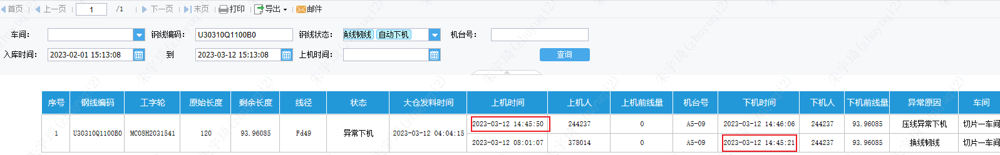
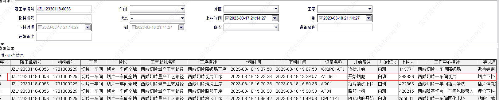
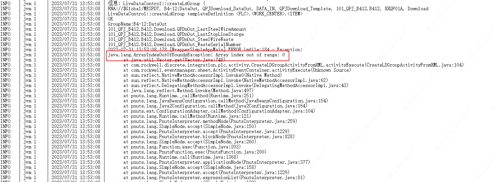
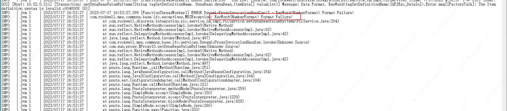
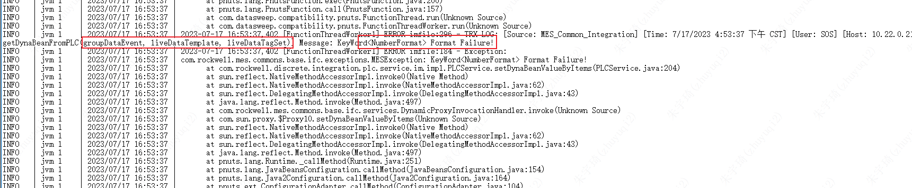
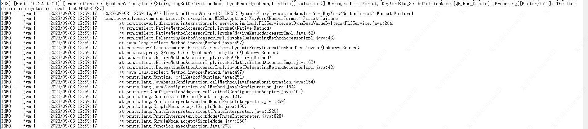
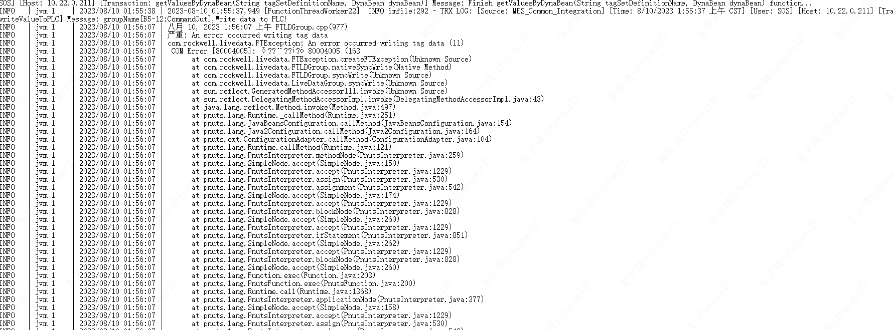

## 台账

- A1：西门子PLC、连城系统
- A2：西门子PLC、连城系统
- A3：西门子PLC、连城系统
- A4：汇川PLC、汇川系统
- A5：汇川PLC、汇川系统
- B1：西门子PLC、连城系统
- B2：西门子PLC、连城系统
- B3：
	- B3-01至B3-09：西门子PLC、连城系统
	- B3-10、B3-11：汇川PLC、汇川系统
- B4：汇川PLC、汇川系统
- B5：汇川PLC、汇川系统
## 系统异常处置

### 机台连不上网

问题现象：网络可以ping通，但【网络监测】不起作用。

出现场景：机台更新程序；机台长时间开始但未使用。

解决方案：

1. 重启机台。
2. 更换机台ip。
3. 新建通道。

### 钢线框锁定

推测原因：操作太快

出现对象：汇川PLC机台。



解决方案：直接在KPEServer中写入新的钢线编码，点击上机。

注意：不需要手动修改新钢线的钢线量，它会在上机时候更新。

## 切割时间异常

### SOS服务functions调用机制

*执行SOS服务的哪个方法，取决于KEPServer中定义名为Xxxx_HandShark的标记值为1。*
*即：上料、切割、下料3种情况种，上料、下料的Xxxx_HandShark点动触发，上料、下料只调用一次方法；切割Xxxx_HandShark持续触发，切割持续调用改方法。

**正确理解：**

监控数据值的变化：变一次调用一次。


### SOS日志

**代码：**

```java
function dataChangeForQPJUploadOne(groupDataEvent,liveDataDataIn,liveDataDataOut,liveDataFaultOut)
{

    // [Transaction: function name getCommandValueFromPLCByLDET] Message: groupName[A2-03],read command value from PLC!
    functionName = getMessage("MES_INTEGRATION_MSG", "FUNCTION") + " " + "dataChangeForQPJUploadOne["+timeLong+"]" 
    logInfo(MODULE_IM, "groupName["+groupDataEvent.getSource().getName()+"],PLC trigger for QPJ Upload !", getDBTime(), eventsheet.getName(), functionName)

	//[Transaction: function name getCommandValueFromPLCByLDET] Message: groupName[A2-03],read command value from PLC!
    commandFromPLCTagvalue = getCommandValueFromPLCByLDET(liveDataServer,commandgroupName)
    keyword = keyword + ",commandFromPLCTagvalue[" + commandFromPLCTagvalue + "]"
    logInfo(MODULE_IM, "Command value from plc, keyword<" + keyword + ">", getDBTime(), eventsheet.getName(), functionName)
}
```

```java
function getCommandValueFromPLCByLDET(server,groupName){   
    logInfo(MODULE_IM, "groupName["+groupName+"],read command value from PLC!",getDBTime(),SOS_INTEGRATION_SUBROUTINES ,functionName)
    itemValues = liveDataGroup.syncRead(class com.rockwell.livedata.LiveDataSource::OPCDevice,liveDataItems)
    if(itemValues != null){
        if(itemValues[0] != null){
            return itemValues[0].getValue()
        }else{
            logError(MODULE_IM, "itemValues[0] is null, Group: " + groupName, getDBTime(), SOS_INTEGRATION_SUBROUTINES,functionName )
            return null
        }
    }else{
        logError(MODULE_IM, "itemValues is null, Group: " + groupName, getDBTime(), SOS_INTEGRATION_SUBROUTINES,functionName )
        return null
    }
} 
```

**正常输出**

```bash
[Source: SOS_OM_EQ_Integration_XXSectionA_Upload]  [Transaction: 功能 dataChangeForQPJUploadOne[606929397684400000) Message: groupName[A5-11],PLC trigger for QPJ Upload !

[Source: MES_Common_Integration]  [Transaction: function name getCommandValueFromPLCByLDET] Message: groupName[A5-11],read command value from PLC!

[Source: SOS_OM_EQ_Integration_XXSectionA_Upload] [Transaction: 功能 dataChangeForQPJUploadOne[606929397684400000) Message: Command value from plc, keyword<groupName[A5-11],commandFromPLCTagvalue[true]>

[Source: MES_Common_Integration]  [Transaction: function name getDataInValuesFromPlcByLDET] Message: groupName[A5-11],read data in value from PLC!

[Source: SOS_OM_EQ_Integration_XXSectionA_Upload]  [Transaction: 功能 dataChangeForQPJUploadOne[606929397684400000) Message: Receive command from PLC  ,the serialNo is:[ JZL12340413-0017],keyword<切片上料[机台:A5-11,随工单:JZL12340413-0017,用户:422605]>
```

**异常输出：**

```bash
[Source: SOS_OM_EQ_Integration_XXSectionA_Upload]  [Transaction: 功能 dataChangeForQPJUploadOne[606929279809340000) Message: groupName[A2-03],PLC trigger for QPJ Upload !

[Source: MES_Common_Integration]  [Transaction: function name getCommandValueFromPLCByLDET] Message: groupName[A2-03],read command value from PLC!

[Source: SOS_OM_EQ_Integration_XXSectionA_Upload]  [Transaction: 功能 dataChangeForQPJUploadOne[606929279809340000) Message: Command value from plc, keyword<groupName[A2-03],commandFromPLCTagvalue[false]>
```

### 切割时间几分钟



可能情况：MES上料正常，开始切割时离线进行（机台断开连接——个性行为），13:23:28机台联网，由于设备正在运行，Xxxx_HandShark值为1，调用了记录上料过站的信息。13:29:57切割结束下料，记录下料过站信息。但是这种情况必须要求点过了【MES上料】，否则还是不会记录。

KEPServer挂了和SOS服务挂了，然后重启都会导致这样的问题吗？

推断只有SOS服务挂了才会，KEPServer挂了不会记录。原因是PD代码从SOS获得触发，读取FTSP的值，

- SOS挂了时，FTSP与KEPServer的连接正常，读取到的值不会发生变化。
- KEPServer挂了时，FTSP读取到的值会发生变化。
	- 

照上面这种分析，应该KEPserver挂了重启才会记录，自相矛盾了………………

### 大面积同时上料


可能情况：MES上料正常，开始切割离线进行（SOS切割服务异常——普遍行为），08:59:13SOS服务恢复正常，由于设备正在运行，Xxxx_HandShark值为1，调用了记录上料过站的信息。但是这种情况必须要求点过了【MES上料】，否则还是不会记录。

KEPServer挂了和SOS服务挂了，然后重启都会导致这样的问题吗？

## 尾刀平衡

本刀损耗 = 实际用线量 - 标准进线量

实际用线量：

- 前面几刀用线量 = 上刀停机 - 本刀停机
- 尾刀用线量 = 钢线长度 - ∑前面几刀用线量
	- 下图红色底纹18.735542的来源

尾刀损耗：

- 平衡前：本刀实际用线量 - 标准进线量
- 平衡后：平衡后用线量 - 标准进线量


## 连接bad自动记录

### 支撑基础

KEPWare`_System`组下有`ERROR`标记，当机台所有连接bad的时候会成为1（部分bad不会成为1）。


KEPWare的datalogger插件支持将标记值写入ODBC数据库。支持模式为：实时、按频率、订阅值发生变化。ODBC数据库为Oracle、MySQL、ACCESS（厂家不建议）

## 机台交互逻辑

### 钢线编码位数

- 汇川：可以写入长字符串（测试16位），但从16位（含）开始，机台显示#号。
	- 
- 西门子：未测试

### 自动提料

- 汇川：点击自动提料不立即触发后台方法，而是提料到料离开线网触发，8s后复位。
	- 机台记录的停机时间为点自动提料。
	- 机台时间早2min。
- 西门子：点击自动提料立即触发后台方法，脱离线网/提料到最高点复位。
	- 机台记录的停机时间为提料到最高点。
	- 机台时间早2min。

### MES上料

MES上料成功后，如果没有开切，则随工单框未锁定，仍然可修改。
## tag标签与kep点位

正常情况：一个kep点位对应一个tag标签，对应一段处理代码。

由于tag标签共用，则会在开发中遇到部分机台kep点位可用，不可用的情况。

情形一：有tag，有xml配置组，无kep点位，无代码。

启动sos，加载tag会报错。并影响同xml配置下的其他组点位加载，由于加载点位出错，执行代码肯定会找不到部分点位而报错。



执行报错：





情形二：有tag，有xml配置组，有kep，无代码。

启动sos，会加载tag，但是好像不会报错。

**总结**
- kep有点位，代码有方法，PD-tag无点位：读不到值，不报错。
- kep无点位，代码无方法，**PDtag有点位**：读不到值，报错。
	- 
## 切片机异常
### 不停服更新AT表

给AT表新增字段本质上是修改oralce表，由于表中存有数据，所以在此过程中，可能会出现保存失败的情况。

### 网络波动

故障表现：下料后MES失去连接，点击【网络监测】无反应。

日志记录：



路由端口日志表现：频繁上下线。

可试解决措施：重插网线。

## 切片机异常

### 8月15日B3-01断线未采集到深度

操作过程：作业人员观察到跳线，手动停机，停机过程中发生断线。

设备逻辑：手动停机过程中，不记录断线深度，原因为处理跳线时可能误碰报警线导致触发断线报警。

## SOS发布

### 3月

各位同事：根据MES运维需要，MES组计划于今日（3月20日）13:00对切片、插片设备数据采集服务器进行重启，预计3-5min，重启期间无法使用MES控制，特此通知。

### 4月

各位同事：根据MES运维需要，MES组计划于今日（4月6日）11:00对切片机数据采集服务进行重启，预计3-5min，重启期间切片机无法使用MES控制，特此通知。

各位同事：根据MES运维需要，MES组计划于今日（4月18日）10:00对切片机数据采集服务进行重启，预计3-5min，重启期间无法使用MES控制，特此通知。

### 6月

各位同事：根据MES运维需要，MES组计划于今日（6月1日）08：40对B区切片机数据采集服务进行更新，预计3-5min，重启期间B区切片机无法使用MES控制，A区不受影响，特此通知。

各位同事：根据MES运维需要，MES组计划于今日（6月8日）10：00对插片清洗机数据采集服务进行更新，重启预计3-5min，稳定预计30min，不影响切片机、脱胶机正常使用，特此通知。

### 7月

各位同事：根据MES运维需要，MES组计划于今日（7月7日）10：00对切片机数据采集服务进行更新，预计3-5min，重启期间切片机无法使用MES控制，特此通知。

各位同事：根据MES运维需要，MES组计划于今日（7月11日）16:10对切片机数据采集服务进行更新，预计3-5min，重启期间切片机无法使用MES控制，特此通知。

各位同事：根据MES运维需要，MES组计划于今日（7月20日）11:00对A区切片机数据采集服务进行更新，预计3-5min，重启期间A区切片机无法使用MES控制，B区不受影响，特此通知。

各位同事：根据生产管理需要，MES组计划于今日（7月31日）14:00对B4-12、B5-12机台进行接入MES工作。请相关部门提前做好以下准备工作：
1. 计划部门：维护B4-12、B5-12机台工艺信息。
2. 设备部门：对B4-12、B5-12机台主辊在PDA进行上机操作。
3. 生产部门：MES服务发布后，需要进行钢线上机操作，请按钢线使用流程进行钢线领用、出库操作；钢线上机时核对写入机台的剩余线量是否与实际一致，不一致及时联系MES组处理。

### 8月

各位同事：根据生产管理需要，MES组计划于今日（8月7日）11:20对切片机数据采集服务进行更新，预计3-5min，重启期间切片机无法使用MES控制，特此通知。本次更新内容如下：
1. A区：
（1）钢线上机、切片上料：校验线径与槽距匹配关系。
（2）过程异常：焊线人非必填。
（3）钢线下机：耗用完钢线记录尾刀平衡前线量。
2. B区：
（1）过程异常：焊线人非必填。
（2）钢线下机：耗用完钢线记录尾刀平衡前线量。
注意：重启过程会造成切片上料或下料过站无法正常记录，须进行补录操作。

### 9月

各位同事：根据MES运维需要，MES组计划于今日（9月1日）10:30对切片机钢线上下机服务进行更新，预计3-5min，重启期间无法进行切片机钢线上下机，特此通知。
注意1. 本次更新不影响切片上下料采集服务，不会造成上下料过站缺失。
注意2. 本次更新仅为MES运维需要，不涉及业务数据采集、计算变化或现场操作变化。

各位同事：根据MES运维需要，MES组计划于今日（9月6日）15:00对切片机数据采集服务进行更新，预计3-5min，重启期间无法进行切片上下料，特此通知。本次更新内容如下：
根据设备端记录的加切时间，如果该值不为0，则在切片下料时保存该时间，记录为加切。如果下料后，人工提交加切，则覆盖MES自动记录的加切记录。
注意：重启过程会造成切片上料或下料过站无法正常记录，须进行补录操作。

各位同事：根据MES运维需要，MES组计划于今日（9月8日）15:00对切片机数据采集服务及钢线上下机服务进行更新，预计3-5min，重启期间无法进行切片上下料及钢线上下机，特此通知。本次更新内容如下：
1. 优化自动记录加切异常，如果已有录入异常，则不保存“加切”异常类型，只保存异常时间。
2. 优化切片上料中重复上料校验逻辑——已请求过则不允许上料。
3. 优化换线韧线时，点击【耗用完】下机，随工单停机线量缺失问题。
4. 优化已提交反切异常，但切片下料还会更新钢线剩余线量的问题。
注意：重启过程会造成切片上料或下料过站无法正常记录，须进行补录操作。

各位同事：根据MES运维需要，MES组计划于今日（9月15日）14:00对切片机数据采集服务进行更新，预计3-5min，重启期间无法进行切片上下料，不影响钢线上下机操作，特此通知。本次更新内容如下：
1. 优化自动记录加切异常，增加异常判定值，超出该值记录加切，否则不记录。该值可配置，当前为0。
2. 优化切割异常时间记录逻辑，小于0时记录为0。
3. 优化A区上下料过站记录逻辑，不卡【MES控制激活】，A区稳定后实施B区。
4. 优化钢线损耗模块系统日志。
5. 修复过程异常界面点击【刷新】MES系统数据处理问题。
6. 增加开始切割记录切割液相关数据功能。
7. 优化换线韧线逻辑，已MES上料但未点运行，此时更换钢线不再作为换线韧线处理。
注意：重启过程会造成切片上料或下料过站无法正常记录，须进行补录操作。

各位同事：根据生产部反馈，MES组计划于明日（9月17日）00:20恢复MES上料校验逻辑，重启切片机数据采集服务，预计3-5min，重启期间无法进行切片上下料，特此通知。
注意：本次重启过程会造成切片上料或下料过站无法正常记录，须进行补录操作。

### 10月

各位同事：根据MES运维需要，MES组计划于今日（10月11日）11:30对切片机、脱胶机数据采集服务进行更新，预计3-5min，重启期间无法进行切片上下料，不影响钢线上下机操作；脱胶机无法使用工位机扫码上料，特此通知。本次更新内容如下：
1. 脱胶机新增主水槽1、储酸槽1温度、7槽温度、出料槽温度采集。
2. 换线韧线场景下，上机钢线产生的损耗，在切片下料时下发至机台。
3. 优化切片B区服务器与机台断开重连间隔设置，减少显示通讯正常但上料无响应问题。
4. B区切片上料过站、下料过站取消是否MES控制激活校验。
注意：重启过程会造成切片上料或下料过站无法正常记录，须进行补录操作。


各位同事：为处理切片下料录入损耗及异常提示缺少过站信息问题，MES组计划于今日（10月12日）21:50对切片机数据采集服务进行更新，预计5-10min，重启期间无法进行切片上下料，不影响钢线上下机操作，特此通知。本次更新内容如下：
注意：重启过程会造成切片上料或下料过站无法正常记录，须进行补录操作。

