## 1 网络检测功能

### 1.1 网络检测界面

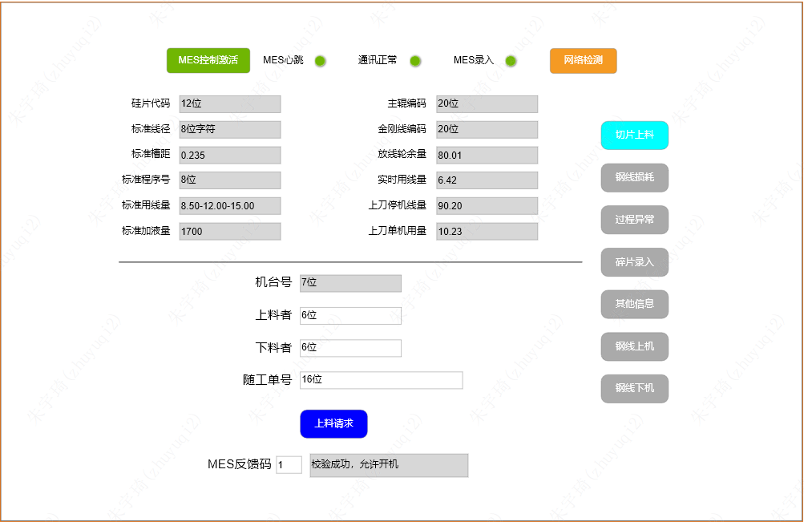

### 1.2 网络检测逻辑

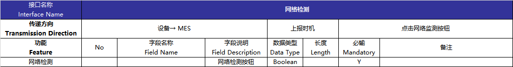

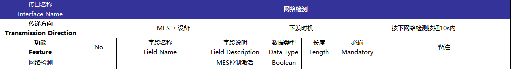

1. 网络检测：按下8s后复位。
2. MES控制激活：
	- 手动触发：该按钮不可在HMI点击，可远程读写置位和复位。按下网络检测，MES10s内给MES控制激活写入1，机台保持并使MES控制激活按钮常亮（绿色）。断开网络连接或MES10s内未写入1则复位。
	- 自动触发：每次提料完成后(必须在MES下料信号触发之后)⾃动触发⽹络检测按钮，逻辑同手动触发⼀样。 
4. _MES心跳：_
5. 通讯正常：按下网络检测，MES写入控制激活信号后，机台本地操作通讯正常常亮，MES控制激活信号复位，该信号亦复位。
6. MES已录入：上料请求成功后，MES已录入灯亮。切片下料后，MES已录入信号复位。

## 2 切片上料功能

### 2.1 切片上料界面

### 2.2 切⽚上料逻辑

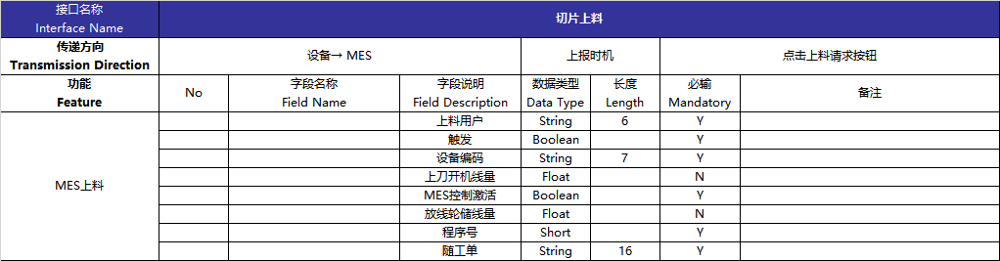

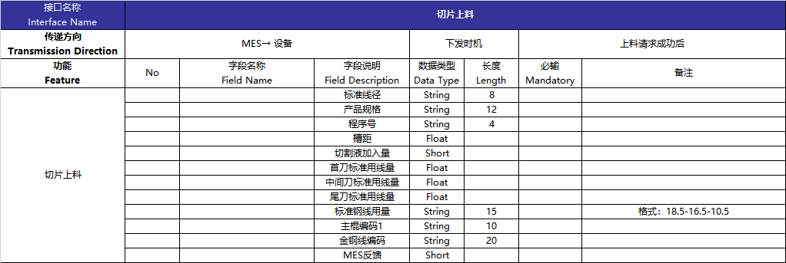

1. 灰⾊⽂本框不可编辑，除放线轮余量字段是设备⾃身字段，其余MES相关字段均⽀持读写。
2. 上刀开机线量：上刀随工单开始切割时的放线轮余量。
3. 本刀开机线量：本刀随工单开始切割时的放线轮余量。
4. 标准用线量文本框数据由首刀标准用线量、尾刀标准用线量、中间刀标准用线量拼接而成，格式为：首刀-中间刀-尾刀。
5. 上料请求按钮触发后，8秒⾃动复位。
6. 随⼯单流⽔码⽂本框，只在开始切割之后锁定，不允许编辑，⼯件松开解除，⼯件夹紧不锁定。  
7. MES反馈码为1时，MES已录⼊激活，允许开机。在控制激活打开情况下，MES已录⼊复位之后，报警提示【MES未录⼊，请在开机之前录⼊】，控制激活关闭情况下，⽆需该提示。
8. 单刀耗用量：设备提供每⼑料切割的单⼑实际耗线量，并说明计算逻辑。  
9. MES反馈码，⽂本框提示信息如下：

| 反馈代码 | 反馈提示信息                    |
| -------- | ------------------------------- |
| 0   | 未MES上料                                  |
| 1   | 校验成功，允许上料                         |
| 2   | 随工单流水码不存在                         |
| 3   | 设备编码不存在                             |
| 4   | 上料用户不存在                             |
| 5   | 下料用户不存在                             |
| 6   | 程序号不匹配                               |
| 7   | 随工单重复上料                             |
| 8   | 粘胶未出料扫描                             |
| 9   | 金刚线编码不存在                           |
| 10  | 设备已锁定                                 |
| 11  | 用户已锁定                                 |
| 12  | 工单已锁定                                 |
| 13  | 金钢线物料编码在工单BOM中不存在            |
| 14  | 不是指定设备                               |
| 15  | 随工单已解绑                               |
| 16  | 金刚线切割刀数已超出限制                   |
| 17  | 跨公司禁止上料                             |
| 18  | 换线未扫描新钢线编码                       |
| 19  | 上料数据校验不通过                         |
| 20  | 固化时间不合格                             |
| 21  | 金刚线未上机                               |
| 22  | 主辊槽距不符合标准槽距                     |
| 23  | 钢线线径不符合标准线径                     |
| 24  | 请联系刻槽房，做主辊上机维护               |
| 25  | 主辊编码不存在请联系刻槽房                 |
| 26  | 主辊槽距不存在请联系刻槽房                 |
| 27  | 请联系导轮维护人员做上机维护               |
| 28  | 请联系切割液维护人员做上机维护             |
| 29  | 请联系技术人员，金刚线标准进线量未维护     |
| 30  | 当前上机钢线总消耗量已超出限制             |
| 31  | 请检查是否已换线未做新钢线上机             |
| 32  | 请检查上刀随工单是否未录入钢线损耗         |
| 33  | 禁止实际钢线与上机钢线编码不对应           |
| 34  | 请校准上刀随工单钢线用量数据               |
| 35  | 请检查上刀随工单过站数据                   |
| 36  | 钢线下机未操作，当前机台钢线状态为自动下机 |
| 37  | 钢线异常信息未维护                         |
| 38  | 硅片代码不符合工艺包标准硅片代码           |
| 39  | 禁止跨车间上料                             |
| 40  | 金刚线线径为空                             |
| 41  | 机台工艺包线径未维护                       |
| 42  | 机台工艺包产品别未维护                     |
| 43  | 机台工艺包槽距未维护                       |
| 44  | 机台工艺包标准线量未维护                   |
| 45  | 机台工艺包未维护                           |
| 46  | 机台工艺包标准用线量不符合规范             |
| 47  | 上刀随工单过站信息有缺失                   |
| 48  | 离线随工单未录入                           |
| 49  | 上机钢线真实线径与槽距不匹配              |

## 3 上料过站功能

### 3.1 上料过站界面

上料过站无界面，机台开始切割时，触发MES上料过站逻辑。

### 3.2 上料过站逻辑

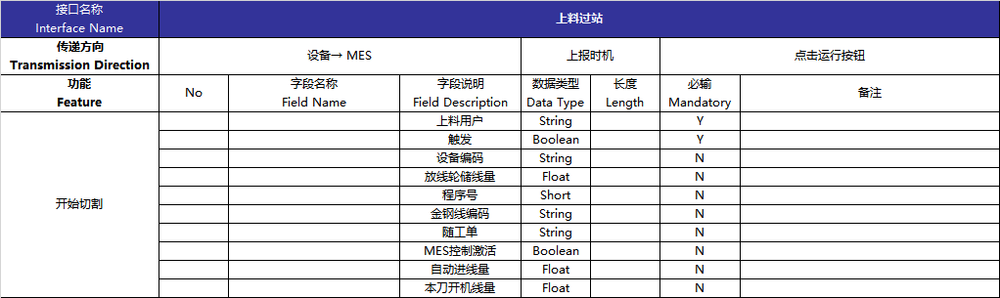

1. 上料过站无MES→设备传递的数据。
2. MES控制激活灯亮时，只有MES已录入信号也亮，才允许开始切割运行。
3. 运行时，上料过站触发信号保持，切割结束才复位。

## 4 下料过站功能

### 4.1 下料过站界面

下料过站无界面，机台切割完成，触发MES上料过站逻辑。

### 4.2 下料过站逻辑

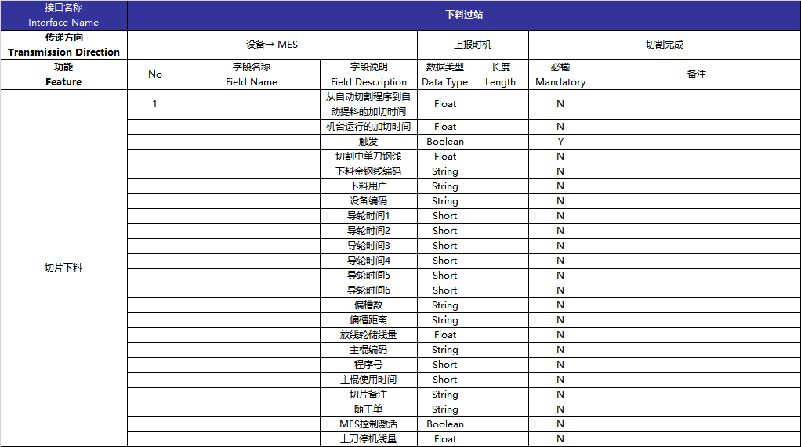

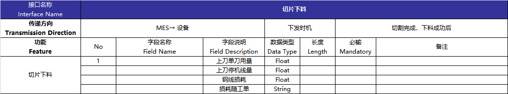

1. 设备自主设计切割完成信号，作为下料过站触发。

## 5 钢线损耗

### 5.1 损耗录入界面

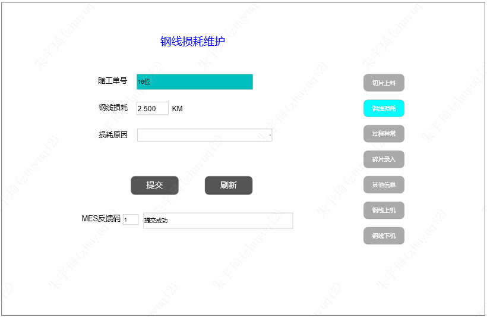

### 5.2 损耗录入逻辑

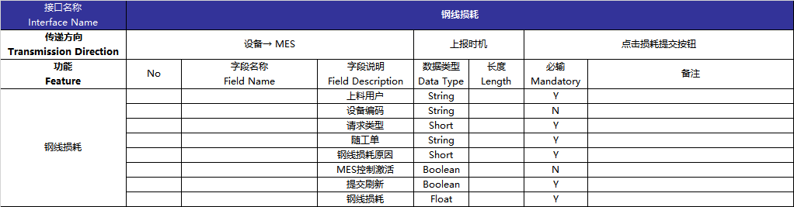

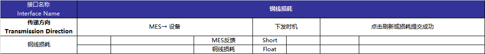

1. 录⼊和刷新按钮8秒⾃动复位。且录⼊和刷新提供⼀个公共的触发变量和请求类型。
2. 损耗原因下拉框显示文本，传递整数（有空选项）：
	- 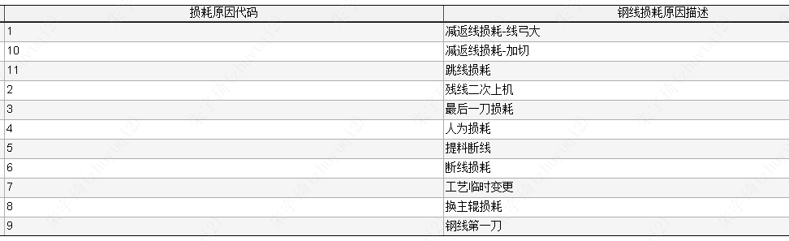
3. MES写⼊反馈码之后，在⾮0状态下，60秒⾃动复位为0，并清空复位除随⼯单以外的其他⽂本框。  
4. 反馈码及反馈信息提示：  

| 反馈代码 | 反馈描述               |
| -------- | ---------------------- |
| 1        | 录入成功               |
| 2        | 随工单流水码不存在     |
| 3        | 上料者工号不存在       |
| 4        | 禁止重复录入           |
| 5        | 随工单已完工，禁止修改 |
| 6        | 刷新成功               |
| 7        | 随工单没有过站信息     |
| 8        | 请选择钢线损耗原因     |
| 9        | 请到工控机进行操作     |
| 10       | 随工单没有下料过站信息 |
| 11       | 随工单已解绑           |
| 12       | 钢线损耗信息不存在                       |
## 6 过程异常录入

### 6.1 异常录入界面

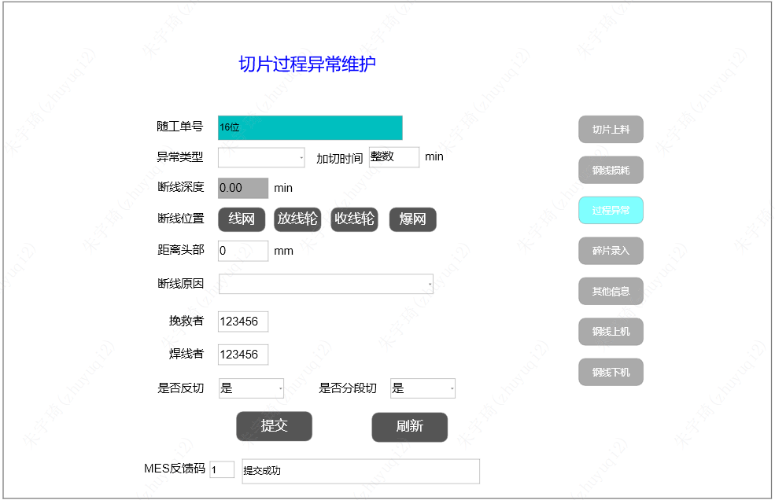

### 6.2 异常录入逻辑

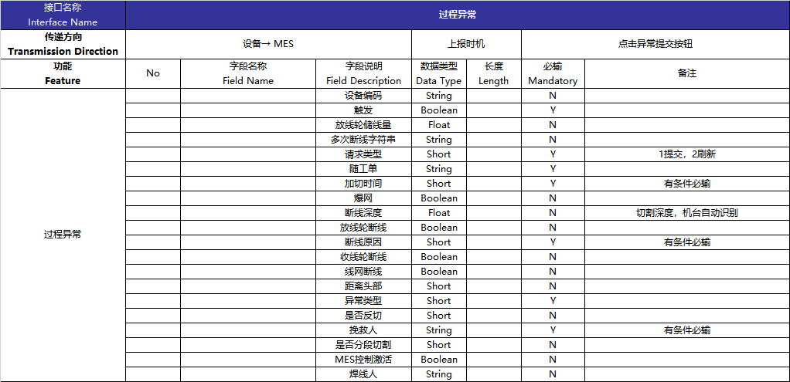

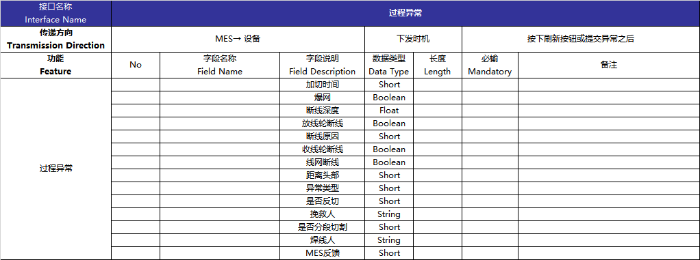

1. 录⼊和刷新按钮8秒⾃动复位。且录⼊和刷新提供⼀个公共的触发变量和请求类型。
2. 随⼯单流⽔码与切⽚上料界⾯同地址。  
3. 异常类型下拉框显示文本，传递整数（有空选项）：
	- 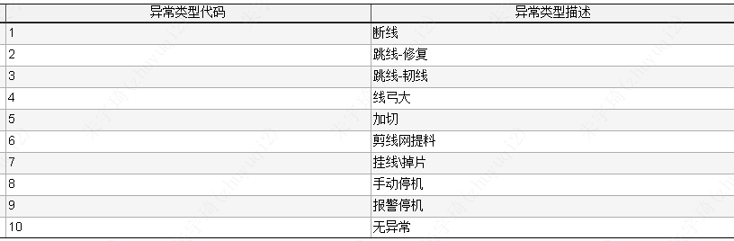
	- 异常类型选择加切时才可输⼊加切时间⽂本框（加切时间⽂本框只能输⼊数字）。 
4. 断线位置选择线⽹时，还必须输⼊距离头部和挽救者信息。  
5. 断线原因下拉框数据（有空选项）：
	- 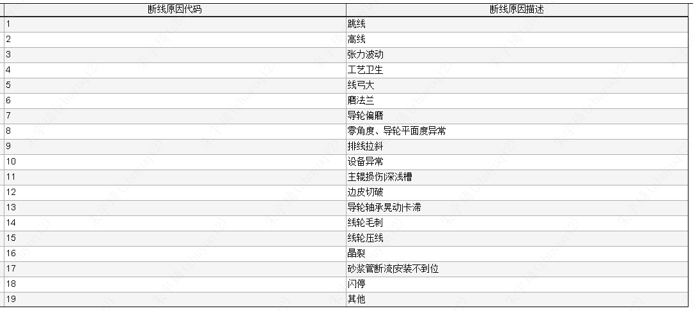
6. MES写⼊反馈码之后，在⾮0状态下，60秒⾃动复位为0，并清空复位除随⼯单以外的其他⽂本框。  
7. MES控制激活打开时，设备自动采集断线深度，不可编辑。同时记录断线次数及断线深度到断线字符串，半角逗号分隔，多次断线半角分号分隔，如：`1,56.2;2,84.6`。
8. 断线深度、断线深度字符串在下刀随工单在【MES上料】界面上料成功是亦清空，默认值分别为0.0、空串。
9. 反馈码及反馈信息提示：  

| 反馈代码 | 反馈描述                         |
| -------- | -------------------------------- |
| 1        | 录⼊成功                         |
| 2        | 随⼯单流⽔码不存在               |
| 3        | 挽救⼈⼯号不存在                 |
| 4        | 禁⽌重复录⼊                     |
| 5        | 随⼯单已完⼯，禁⽌修改           |
| 6        | 已存在记录，只能在⼯控机界⾯修改 |
| 7        | 请输⼊加切时间                   |
| 8        | 请输⼊线⽹断线距离头部距离       |
| 9        | 刷新成功                         |
| 10       | 随⼯单没有过站信息不可录⼊       |
| 11       | 请选择断线原因                   |
| 12       | 请选择异常类型                   |
| 13       | 未查询到过程异常记录             |
| 14       | 随工单已解绑                     |
| 15       | 请输入完整断线信息               |
| 16       | 无异常                           |
| 17       | 焊线人工号不存在                                 |

## 7 碎片录入功能

### 7.1 碎片录入界⾯

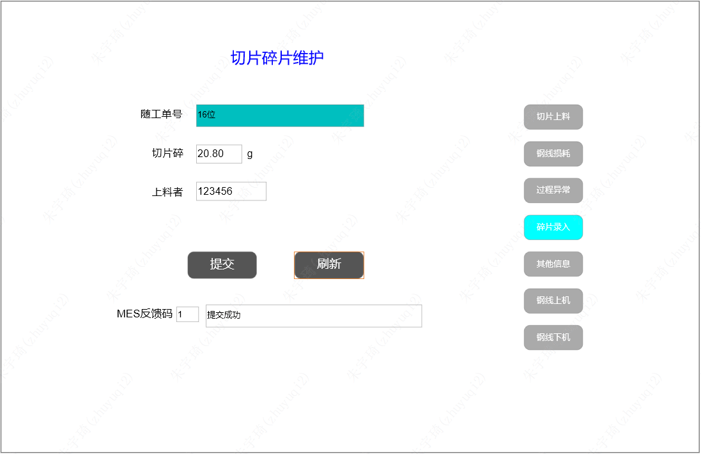

### 7.2 碎⽚录⼊逻辑

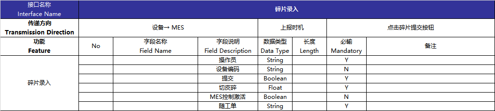

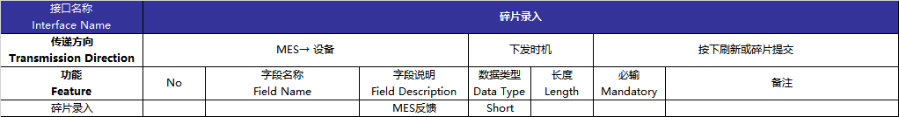

1. 录⼊和刷新按钮8秒⾃动复位。且录⼊和刷新提供⼀个公共的触发变量和请求类型。
2. 随⼯单流⽔码与切⽚上料的流⽔码地址同步。  
3. 切⽚碎⽀持带⼩数数字（HMI使⽤数字键盘）。  
4. 反馈码在⾮0状态下，60秒⾃动复位为0，并清空切⽚碎和操作员⽂本框。  
5. 反馈码及反馈提示信息：  

| 反馈代码 | 反馈描述               |
| -------- | ---------------------- |
| 1        | 录⼊成功               |
| 2        | 随⼯单流⽔码不存在     |
| 3        | 操作员⼯号不存在       |
| 4        | 禁⽌重复录⼊           |
| 5        | 随⼯单已完⼯，禁⽌修改 |
| 6        | 碎⽚重量超出限制       |
| 7        | 请到⼯控机进⾏录⼊     |
| 8        | 随工单已解绑           |
| 9        | 随工单缺少切片上料过站信息                       |

## 8 其他信息

###  8.1 其他信息界面

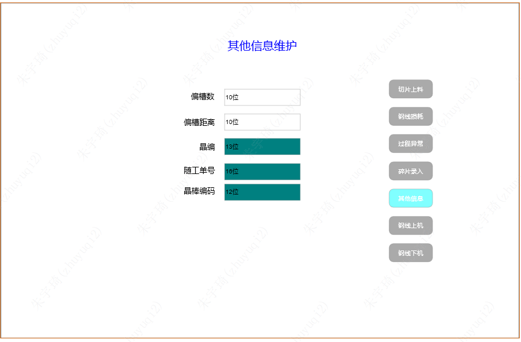

### 8.2 其他信息逻辑

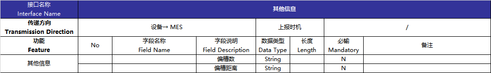

1. 偏槽数、偏槽距离本地可写，晶编、随工单号、晶棒编码本地不可写，提供数据地址即可。
2. 偏槽数、偏槽距离本地写入后，机台保持。
## 9 钢线上机功能
### 9.1 钢线上机界⾯

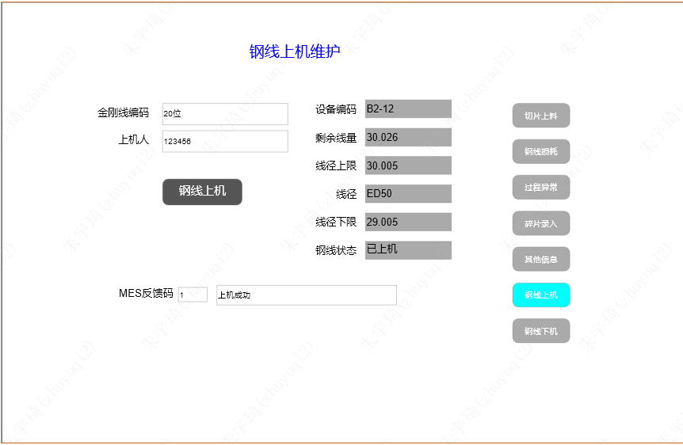

### 9.2 钢线上机逻辑

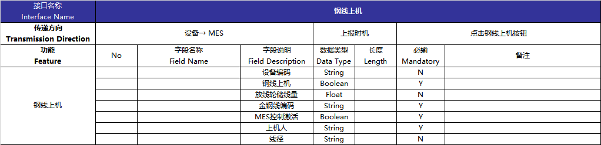

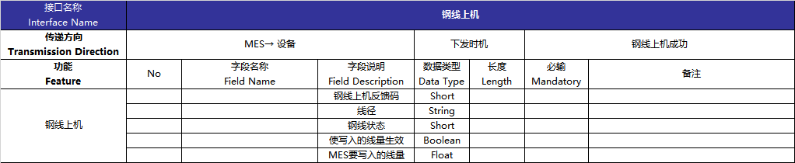

1. 钢线上机按钮置位后8秒复位。  
2. 灰⾊文本框不可编辑，均⽀持读写。线径点位为字符串数据类型。  
3. 钢线状态，MES返回对应数字，HMI对应提示如下对应⽂字：  
	- 10 -在线边
	- 20 -待使⽤
	- 30 -使⽤中
	- 40-使⽤完毕
	- 50-异常下机
	- 60-退库申请
	- 70-退库已接收
	- 80-换线韧线
	- 90-⾃动下机  
4. 反馈码在⾮0状态下，30秒⾃动复位为0，并清空上机⼈⽂本框。  
5. 钢线上机时，MES写⼊一个线量及写入信号，设备收到写入信号后，将MES写入的线量同步为放线轮余量。
6. 反馈码及对应中⽂提示：  

| 上机反馈代码 | 反馈描述                         |
| ------------ | -------------------------------- |
| 1            | 上机成功                         |
| 2            | 该机台已有上机钢线               |
| 3            | 设备编码不存在                   |
| 4            | 上机⼈⼯号不存在                 |
| 5            | ⾦刚线编码不存在                 |
| 6            | 异常下机未评审，不可上机         |
| 7            | 钢线线径与⼯艺维护线径不匹配     |
| 8            | 该钢线已耗⽤完，不可再次上机     |
| 9            | 该钢线已在其他机台使⽤中         |
| 10           | 钢线状态异常不可上机             |
| 11           | 该机台有其他钢线上机中，请先下机 |
| 12           | 请联系⼆级库钢线出库             |
| 13           | 请到⼯控机进⾏操作               |
| 14           | 该机台有⾃动下机钢线未下机处理   |
| 15           | 保存异常请重新再试               |
| 16             |MES控制激活未打开                                  |
| 17           | 上机钢线真实线径与槽距不匹配     |
| 18           | 主辊槽距为空                     |
| 19           | 主辊编码为空                     |
| 20           | 主辊上机未维护                   |
| 21           | 机台硅片代码厚度为空             |

## 10 钢线下机功能

### 10.1 钢线下机主界面

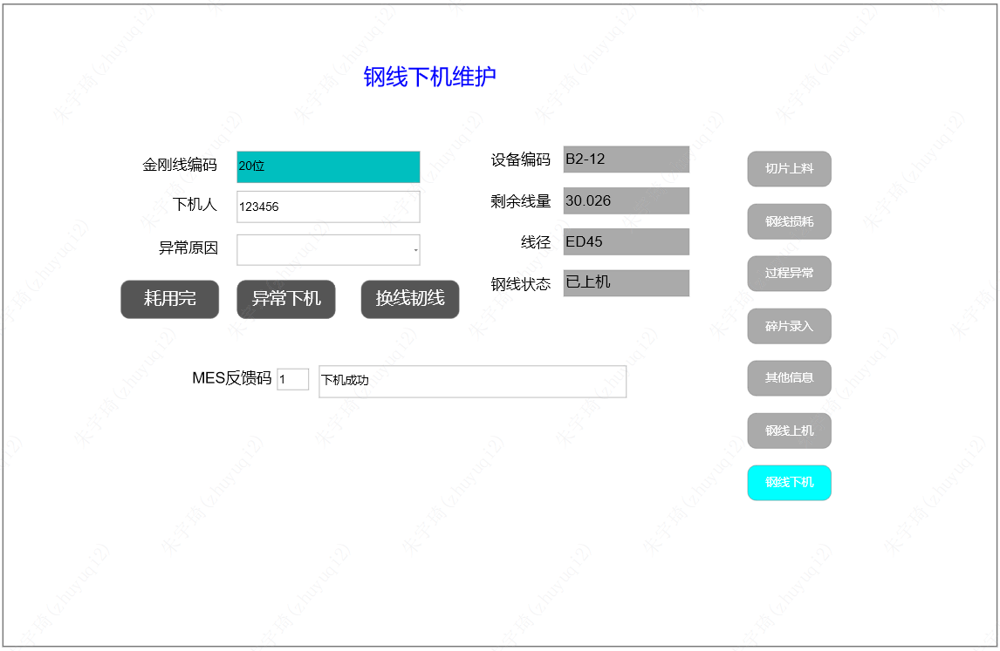

### 10.2 钢线下机逻辑

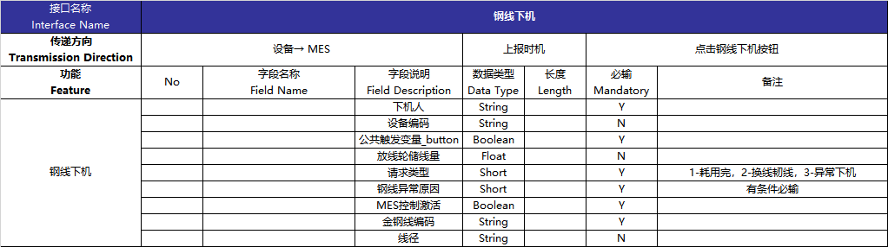

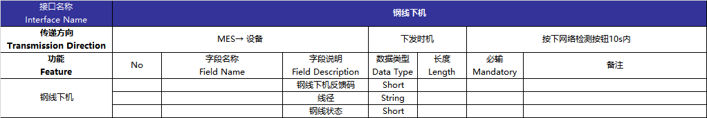

1. 钢线下机成功反馈1之后，清空⾦刚线编码、下机⼈，异常原因、线径、钢线状态
2. 异常原因下拉框可以有空值，不选择异常原因，⽆法点击异常下机。  
	- 异常原因下拉框值对应：1-断线异常，2-线痕异常，3-压线异常，4-其他异常  
3. 灰⾊⽂本框不可编辑，所有⽂本框⽀持读写。⾦刚线编码、设备编码、剩余线量（放线轮储线量）为公共变量。线径和钢线状态点位同钢线上机。
4. MES写⼊反馈码之后，在⾮0状态下，60秒⾃动复位为0。⾮1不清空复位⾦刚线编码、下机⼈、异常原因、线径、钢线状态。  
5、三个按钮都是置位后8秒⾃动复位，并且三个按钮都会触发⼀个公共Boolean变量，且对应不同的请求类型，MES根据请求类型区分是哪个按钮触发。  
6、钢线下机反馈码：  

| 下机反馈代码 | 反馈描述                             |
| ------------ | ------------------------------------ |
| 1            | 下机成功                             |
| 2            | 该机台没有正在上机的钢线             |
| 3            | 机台号不存在                         |
| 4            | 下机⼈不存在                         |
| 5            | 下机随⼯单不正确                     |
| 6            | 异常下机原因未选择                   |
| 7            | ⾦刚线编码不存在                     |
| 8            | 该钢线剩余量已不⾜，请使⽤耗⽤完     |
| 9            | 钢线剩余⻓度⼤于限定值，不允许耗⽤完 |
| 10           | 钢线上机机台不匹配                   |
| 11           | 该钢线未上机                         |
| 12           | 请到⼯控机进⾏操作                   |
| 13           | 保存异常请重新再试                   |
| 14           | MES控制激活未打开                                     |

## 11 下料弹窗功能

### 11.1 下料弹窗界面

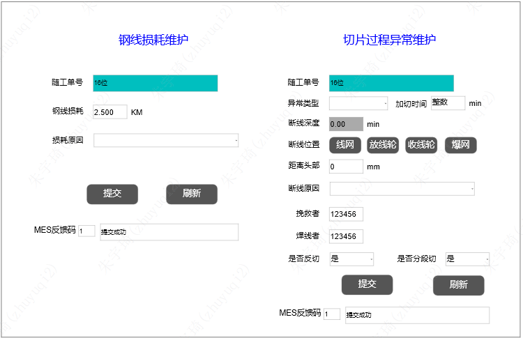

### 11.2 下料弹窗逻辑

1. 下料弹窗的数据同钢线损耗和过程异常录入界面。
2. MES控制激活有效时，切片下料弹出此界面，否则不弹。
3. 如果钢线损耗＞0、断线深度=0.0，提交损耗MES反馈1并关闭弹窗，反馈其他数不关闭弹窗。如果钢线损耗≤0.0、断线深度＞0，提交异常MES反馈1并关闭弹窗，反馈其他值不关闭弹窗。如果钢线损耗＞0、断线深度＞0，则要求损耗和异常的反馈均为1并关闭弹窗。此处注意反馈信号的保持，防止提交不同时导致某一反馈码已置位，且后续不能再提交导致的弹窗不能关闭。

## 12 其他问题

1. 设备可自动识别的异常类型有哪些？
2. 是否具有可视化IP地址设定界面，该界面是否有安全管控，防止修改？
3. 是否支持OPC UA协议？是否存在切⽚机断电重启或重启控制器后OPC UA激活失效，MES通讯不能重连的情况。
4. 设备本地保留切割记录，可在HMI查看10条。数据格式为：

| 随工单号        | 上料过站            | 下料过站            | 开切线量 | 停机线量 |
| --------------- | ------------------- | ------------------- | -------- | -------- |
| JZL1238952-0014 | 2023-10-07 10:22:36 | 2023-10-07 12:22:36 | 86.5     | 68.5         |

5. 设备实现钢线单⼑耗⽤量的计算，每⼑下料时MES采集。  
6. 机台本地保存操作记录，必须有与MES交互的触发信号记录。