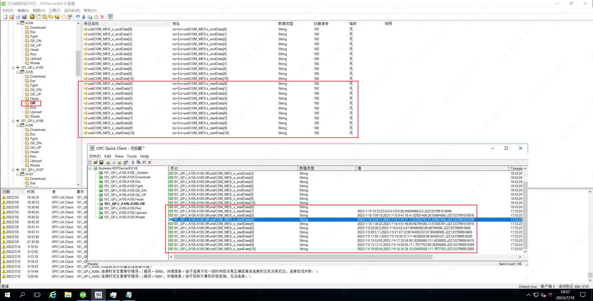
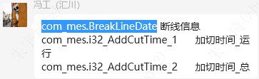
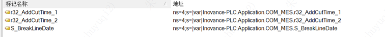

## 切片中控

### 数据交互方案

使用中控系统后，MES与设备连接有两种方式：

- 方案一：使用FTSP连接中控kepware，走Rockwell平台。
- 方案二：使用webapi接口，中控将机台动作信号通过接口传给mes，mes走springboot服务。

个人建议：使用方案二。由于kepware必须由中控管理运维，而FTSP连接kepware具有一定的复杂性，运维时，需要沟通kepware点位状态，不够方便。

中控建议：使用方案二。因为在系统架构种，中控属于底层系统，如果FTSP连接kepware，则脱离了中控系统，失去了中控的意义。

7月11日会议结论：（李靖）按照方案一，不改动原有架构。

### springboot服务和javaweb服务的选择

- 相同点：
	- 都采用controller层编写接口代码。
- 不同点
	- tomcat支持热部署javaweb工程，springboot则需要重启jvm虚拟机。
	- springboot易于微服务化扩展。

## 切片机服务

**切片离线补录（A1-05）：**

- 西门子：A1-05/off/
	- 

**断线深度（B3-01）**

- 西门子：`com_mes.BreakLineDate`
	- 
- 汇川：
	- 

**加切时间（B3-01）**

- 西门子：
	- 总时间：`com_mes.i32_AddCutTime_1`
	- 设备运行时间：`com_mes.i32_AddCutTime_2`
	- 
- 汇川：
	- 

## 记录机台断网时间

### 方案一：使用PD平台

PD平台

### 方案二：Java服务

### 方案三：node-red

## 测试点位设计

如何监控该测试点位的数据变化。

## 项目依赖

| 工程\依赖       | ftpc_lib | web_lib | webservice-client-jars-axis |
| --------------- | -------- | ------- | --------------------------- |
| xx_ftpc_danjing | 是       |         |                             |
| auto_interface  | 是       | 是      | 是                          |
| Longi_andon     | 是         |         |                             |

## SOS功能上线

| 功能\片区            | A          | B          | B301           | B511           | B412、B512 |
| -------------------- | ---------- | ---------- | -------------- | -------------- | ---------- |
| 标准程序时间采集     | 2023-07-10 | 2023-07-10 | 2023-07-10     | 2023-07-04     |            |
| ~~尾刀平衡损耗原因~~ |            |            | ~~2023-07-18~~ | ~~2023-07-05~~ |            |
| 首刀尾刀损耗         | 2023-07-07 | 2023-07-07 |                |                |            |
| 分离B301机台         |            |            | 2023-07-11     |                |            |
| 断线深度、加切时间   | 2023-07-20 | 2023-07-20 | 2023-07-15     | 2023-07-17     |            |
| B412、B512接入MES    |            |            |                | 2023-07-31     |            |

## 过站间隔防呆

