## DA错误

### 故障表现

1. 机台无网络，但能`ping`通。
2. KEPServerEX报错、客户端数量异常
	- 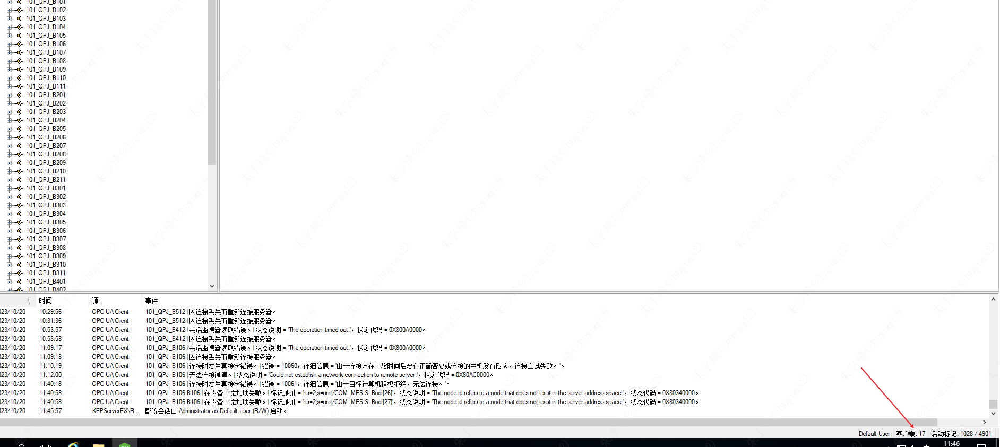
3. SOS服务器DCOM报错
	- 查看步骤：控制面板 》 管理工具 》 事件查看器 》 Windows日志 》 系统
	- 

### 解决方案

1. 每周查看一次KEPServerEX客户端数，如果超出7~8个，说明存在异常，可以立即重启。
2. 每周四中午13:00重启一次KEPServerEX，周期维护。
3. 重启步骤：
	- 关闭KEPServerEX服务器、FTSP服务器的运行程序。
	- 重启KEPServerEX服务器（选择计划内）
	- 重启FTSP服务器（选择计划内）
	- 注意重启步骤：先重启KEPServer（重启到一半时）、后重启FTSP，防止FTSP连接不到KEPServer报错。
4. 如果重启等待时间长，可联系李鹏飞（18049462869）。重启慢可能为更新补丁。

## KEPServer EX新增点位

1. 获取厂家地址：
	- 
2. 手动添加：新建标记，添加点位地址【不建议】：
	- 
	- 上述为错误写法：虽然厂家给的地址为`unit/COM_HMI/cmd_real[88]`，但是KEPServer在读取时，上图箭头位置的`/`为`.`。
3. 选择添加：设备 》 标记生成 》 选择导入项 》 选择地址 》 添加项
	- 

## 设备OPC UA未配置表现

1. 机台能ping通。
2. KEPServer客户端状态bad。
3. KEPServer控制台报错：
	- 

## QC通道显示不全

## 手动给机台写入钢线上机线量

修改`QPGXUPOut_WriteSteelWire`——MES要写入的线量值，编辑`QPGXUPOut_WriteEffect`值为1。
该值会修改剩余线量，修改后，`QPGXUPOut_WriteSteelWire`为写入的值，不会再变化，`LeftStorage`会从`QPGXUPOut_WriteSteelWire`写入的值开始变化。

## 连接KEPServer EX

### FTSP连接

- MESPDT：与DA配置的地址名一致。
	- 
- 连接url既可以手写，也可以在远程连接中选择。
- 设置DA服务时，还要求客户端的电脑账号密码与服务器的账号密码一致。

### UaExpert连接

1. 查看OPC UA地址配置：

不论上图配置为ip或是计算机名，在UaExpert连接时，均须使用ip。

总结：

- OPCUA地址配置有三种方式：
	- `opc.tcp://10.22.0.212:49322`
	- `opc.tcp://127.0.0.1:49322`
	- `opc.tcp://MES-SOS-212:49322`
	- 
- 异机客户端连接方式：

| OPCUA配置                     | 异机客户端连接                                            |
| ----------------------------- | ----------------------------------------------------- |
| `opc.tcp://10.22.0.212:49322` | `opc.tcp://10.22.0.212:49322`、不能使用计算机名       |
| `opc.tcp://MES-SOS-212:49322` | `opc.tcp://10.22.0.212:49322` 、不能使用计算机名      |
| `opc.tcp://127.0.0.1:49322`   | 只能使用本地连接，即KEPware和OPC UA客户端在同一台设备 | 

> *如果KEPServer的地址变化，则需要重新初始化KPEServer后连接。*
> *OPC UA配置位ip或计算机名，FTSP 服务器端只能用计算名，安装在其他终端的FTSP使用ip*

- 安全策略：
	- 无：
		- ip地址连接：可读取节点。
		- 计算机名连接：可访问，客户端要信任证书。
			- 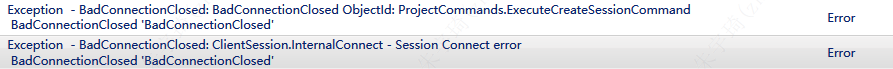
	- Basic128Rsa15或Basic256或Basic256Rsa256：
		- 签名：
			- ip地址连接：可读取节点。服务端要信任证书。
				- 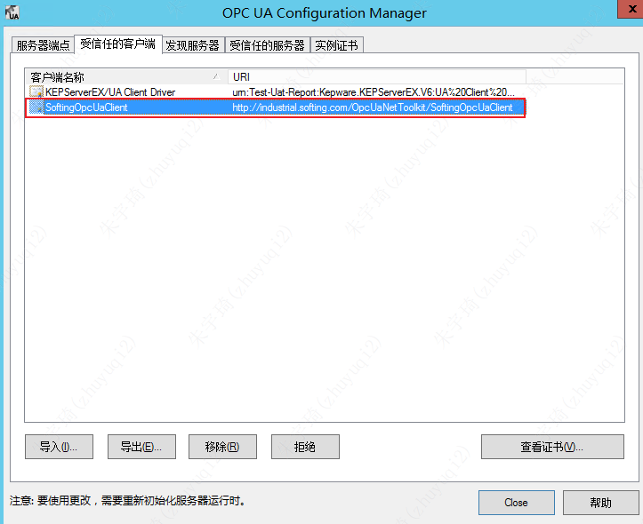
			- 计算机名连接：不可访问。
		- 签名并加密。
			- ip地址连接：可读取节点。服务端要信任证书。
			- 计算机名连接：不可访问。
		- 签名，签名并加密。
			- ip地址连接：可读取节点。服务端要信任证书。
			- 计算机名连接：不可访问。
		- 以上三种方法任意一种信任证书了其他方式就可以用了。

**但是，使用Softing软件时，使用计算机名连接的方式没办法在服务端获取到客户端的证书，没办法信任。**

2. 查看认证方式

查看允许登录的方式：

设置允许匿名连接：

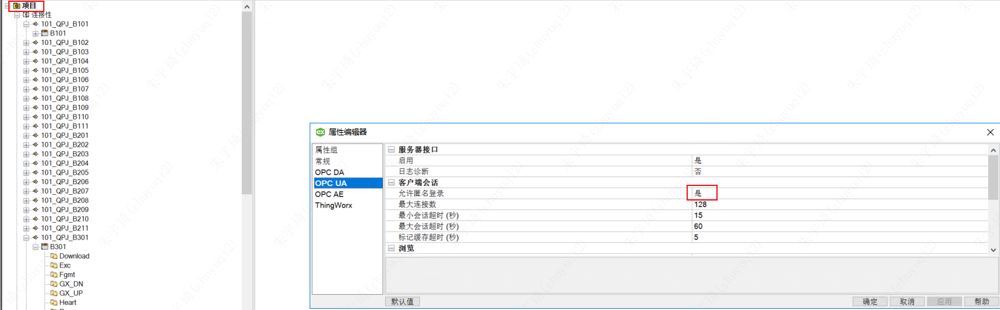

3. 建立连接：

连接地址设置：

连接方式选择：

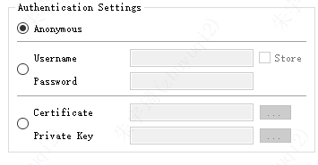

## 修改KEPServerEX通道IP

直接修改通道的IP时，保存后会复位，导致修改失败。。
方式1：停止SOS服务，然后修改。
方式2：修改通道名 -> 修改IP -> 改回通道名

## 网络能ping通，但连接Bad

1. 重新建这个通道。
2. 如果数量过多，可以直接重启服务器（还没试过重启KEPServer）。
3. 重新初始化通道：
	- 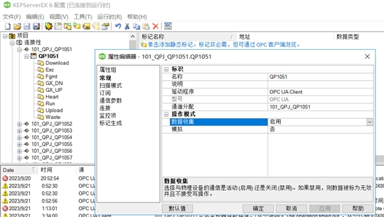

## 从机台读取值

机台数据传递流程：机台plc → 上位机 → kepserver → ftsp → 代码

其中代码读取过程为：

1. 启动服务加载xml文件。
2. 根据xml文件配置，读取pd中tag
3. 根据tag，读取kepserver中的值。

**要点1：tag配置了，但kepserver没配置，则sos日志报错。待二次验证：服务是否正常。**
**要点2：代码写了，tag没配置，则xml加载不到，SOS日志不会报错，但执行服务一定报错。**

## B511连接bad情况分析

能ping通，但B511机台连接bad，使用新建通道方式未能解决。排查相关情况如下：

1. 机台有过断开连接
	1. 
	2. 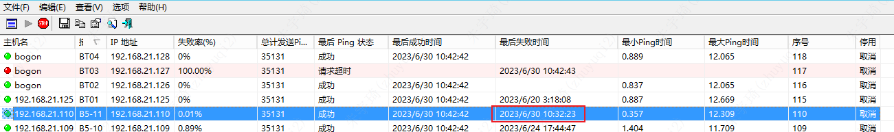
2. SOS服务报错，写入数据失败
	1. 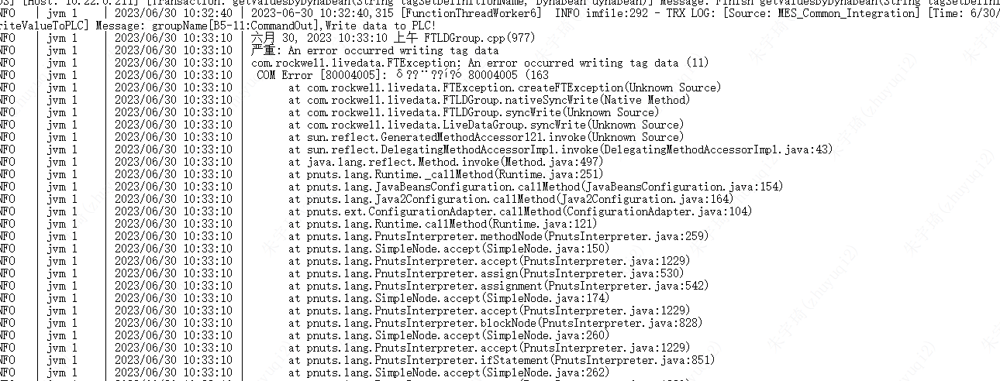
3. 211服务器的kepserver连接bad，但107服务器的kepserver连接good
	1. 部分bad问题应该是qc客户端没有刷新过来，其实已经是全部bad/good
		1. 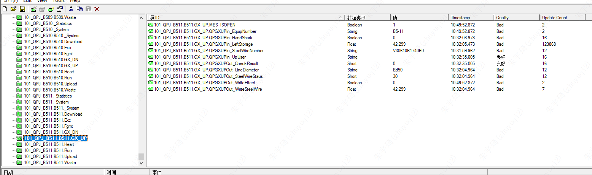

推测原因：

- 两个kepserver连接同一个机台的bug
- ~~订阅发布模式，opc ua server只能向一个opc ua client发布。~~

解决方案：重启kepserver。注意重启kepserver前需要先停止sos。

## Kepware读取异常

问题现象：MES上料按钮无反应，但碎片录入功能正常。

问题排查：查看日志报出：mes is off，检查代码，如下：

MES_OPEN_TAG_NAME代表MES控制激活功能，该点位公用，只不过碎片代码中注释掉了这段代码。

解决措施：重新初始化kepware。

原因分析：检查kepware中的MES控制激活点位值，为1，说明获取正常，但PD代码取值异常，说明可能在FTSP从kepware中取数据时出错。

kepware是良好 但是mesisopen是out of service。

## FTSP

### FTSP错误

这三个一般同时出现，出现场景，失去与kepserver的连接。

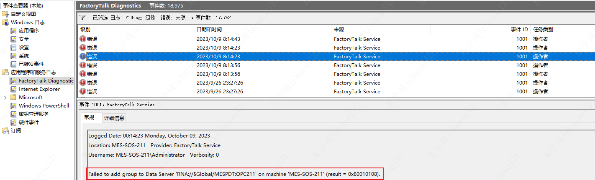

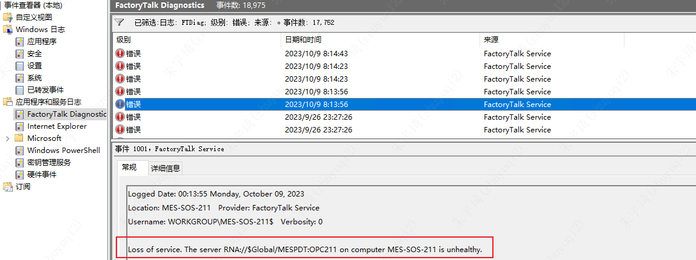

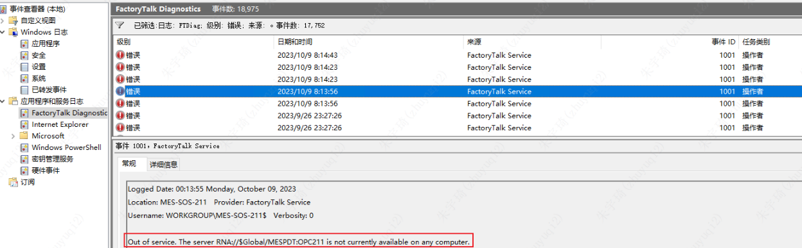

