# 01.硅片生产介绍

## 1. 生产流程介绍

  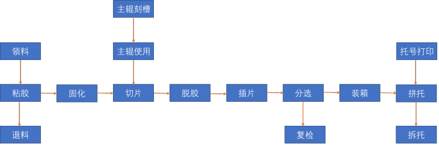

## 2. MES系统操作

### 2.1 线边领料

线边领料包括硅棒（棒）、金钢线（线）、切割液（液）。

#### 2.1.1 创建领料单

1. 新建领料单

    - 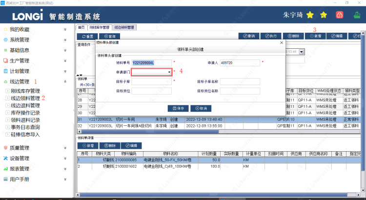

2. 添加领料物品

    - 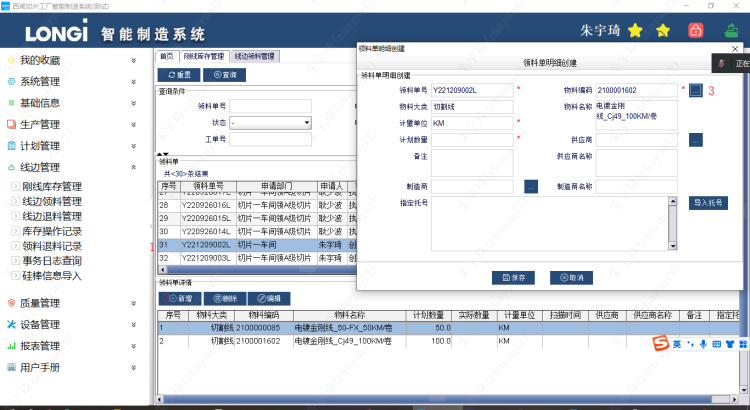
    - 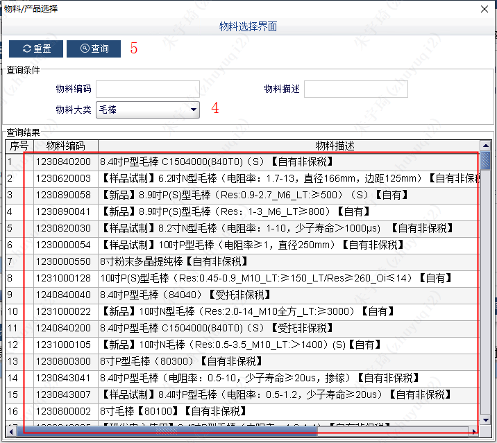
    - **注意：一个领料单只能领取一种物品，如下：**
        - 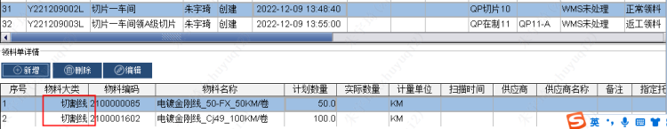

3. 执行领料单：点击执行后，领料单的状态由“创建”变为“执行”。

    - 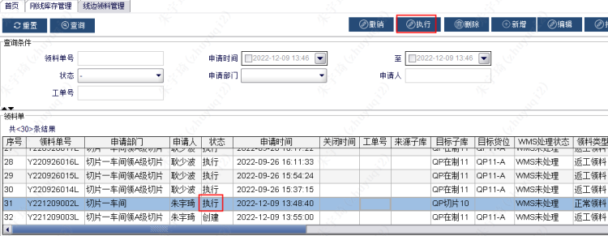

#### 2.1.2 维护库存信息

由于测试环境未与wms联通，因此库存维护需要手动进行。具体如下：

1. 导入物料信息：

    - 编辑钢线库存：修改excel表的物料号、领料单号、出库单号，与上述领料单一致（其中领料单号与出库单号一致）；线锯编号不能产生重复。
        - 
    - 硅棒的导入模板数据需要修改内容如下：
        -  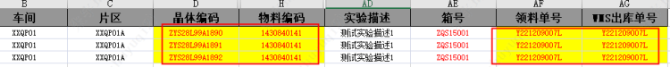
    - 导入钢线库存数据：如果“错误信息”一列没有任何报错，则证明数据可以导入。
        - 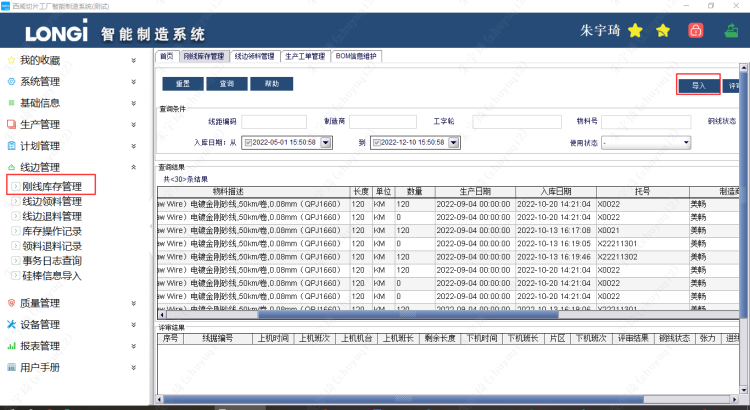
    - 硅棒信息导入同理：
        - 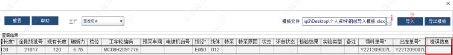

#### 2.1.3 领料接收

1. PDA中，选择 线边管理》领料接收-测试 中输入托号，按下回车，可以查询到第4步录入的材料，点击接收进行领出。此时该物料状态变为在线边。

    - 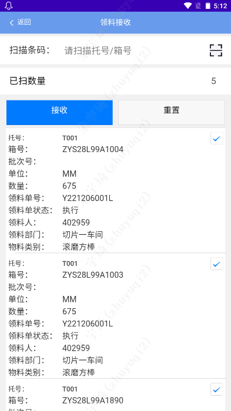

2. PDA中，选择 线边管理》领料出库-测试 中输入线距编码，按下回车，可以查询到第5步线边库接收的材料，点击接收进行领出。此时该物料状态变为待使用。

    - 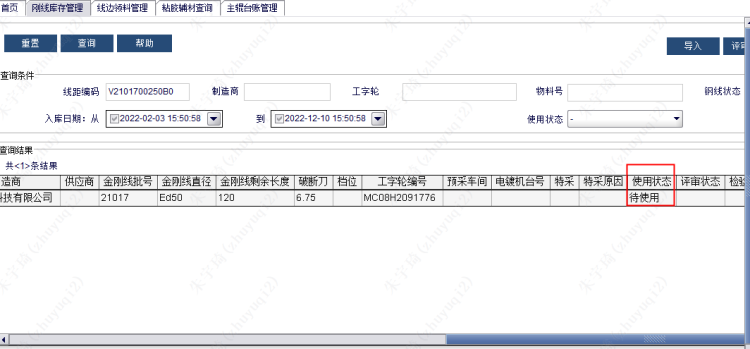

### 2.2 辅材操作

1. 在PDA 生产管理》辅材录入 界面录入

    - 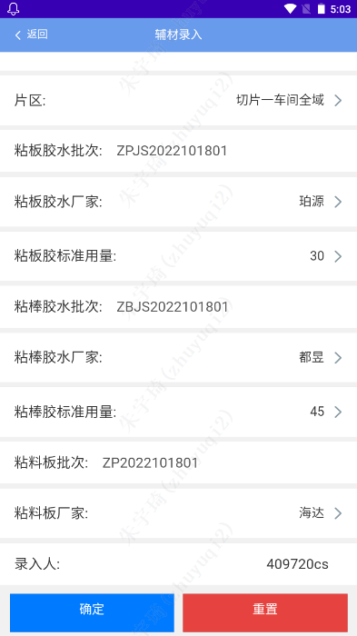

2. 根据PDA中录入的辅材类型，如上述录入为粘胶辅材，所以在 mes》生产管理 中，进行查询。

    - 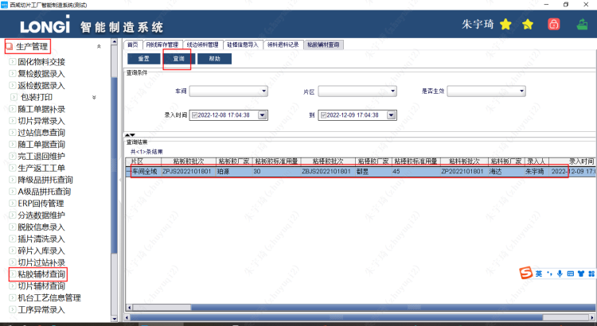
