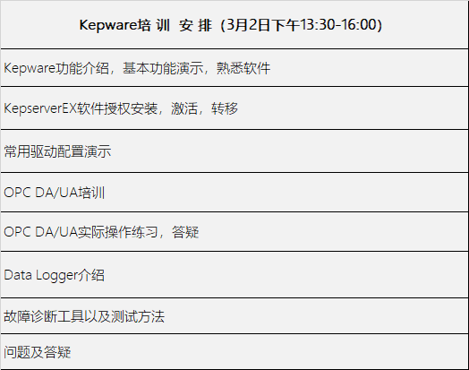

东方鼎晨 - 韩源 - 13699146636（技术）

kepserverex：
red：OPC DA服务器之间的数据冗余，方便切换活动和stand by节点之间的切换
link ：网桥，收集多个OPC DA服务器的数据

插件：

- Advanced Tags：设备到设备之间数据传输等
- DataLogger：ODBC接口
- IOT Gateway：云平台

勾选框时，表示在线激活。
激活时与设备绑定的，如果安装新设备等情况需要转移许可码，需要在KEPWare网站进行设备解绑等。

采集点数分多少个通道、多少个设备、多少的采集频率，没有确定的数量，通常受设备性能、网络条件、采集的数据量大小等影响。一般一个Device（设备）下≤5000个，一般一个Channel配一个Device（通过创建多个Channel并行采集），一般KEPServerEX采集点位数2~5万常见，到达10万时建议分配额外节点（其他的KEPServerEX上。

- Admin：应用级别设置项
	- 授权
	- OPC UA配置
	- 用户管理
	- 启动、停止运行模式
	- 时间和诊断日志
- Configuration：项目级别的设置
	- 创建
- Event Log：日志文件初步排错
- Runtime：后台服务，核心进程

- OPC DA：实时数据，受限于Windows平台，局限性非常大（受环境影响）
- OPC AE：报警数据

