## 工艺包切换

### 开发

1. 业务参数维护：
	- 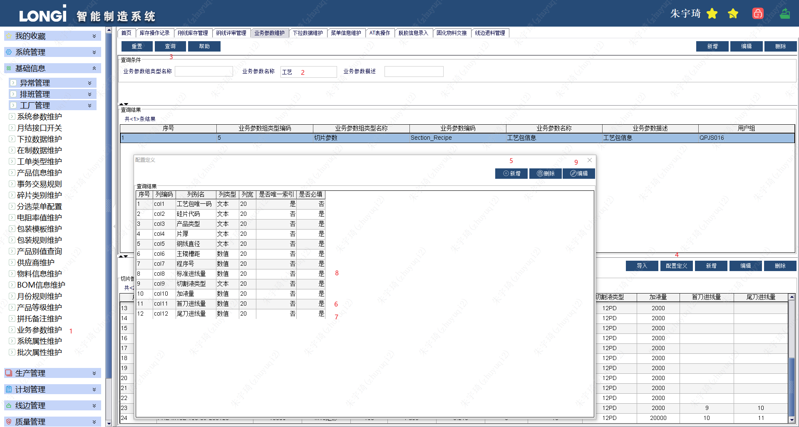
2. 下拉数据维护：【已完成】
	- 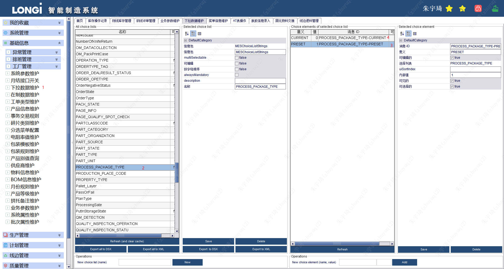
3. 修改`AT_X_ChoiceElement`表中`PROCESS_PACKAGE_TYPE-CURRENT`值为0。【通过修改Form代码完成】
	- 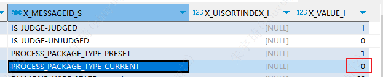
	- 正式环境需要注释掉以下内容后在下拉列表维护中添加：
	- 
4. `OM_MachineProcessHistory`与`OM_MachineProcessInfo`表新增字段：
	- 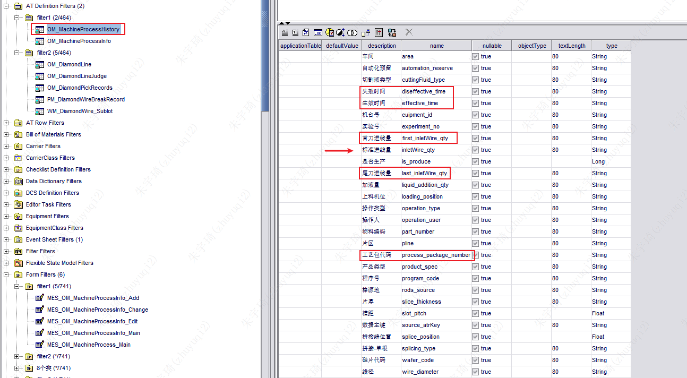
	- 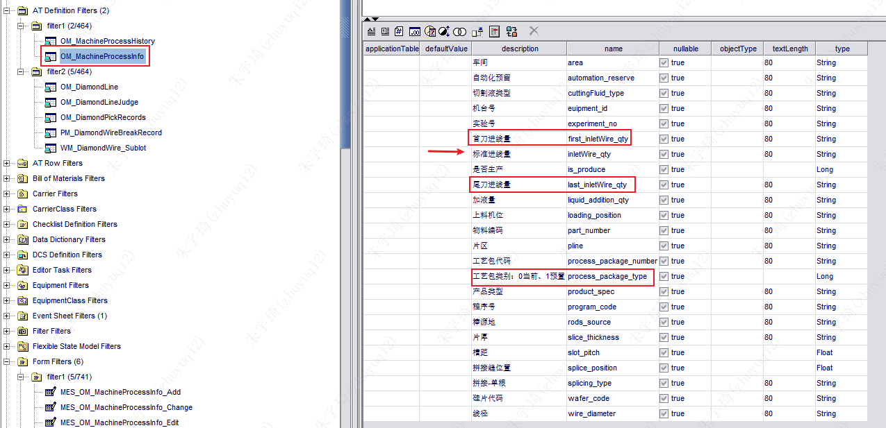
2. 重新生成8各类并打包上传：
	- 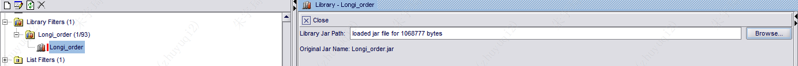
3. 维护Message：
	- 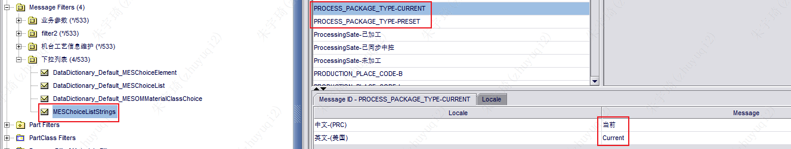
4. MESOMMachineProcessInfo新增的字段增加中文显示。
	- 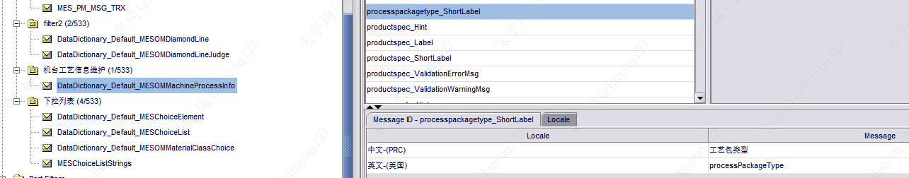
5. MES_PM_MSG_TRX新增异常提示：
	- 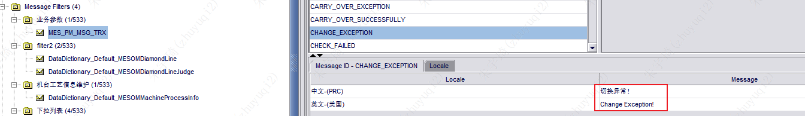
6. 开发Forms：
	- 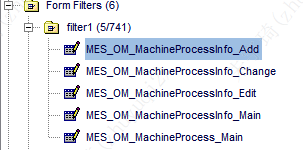
	- 注意：
		- Main中开发时注释掉了权限管理代码，上线记得打开。
			- 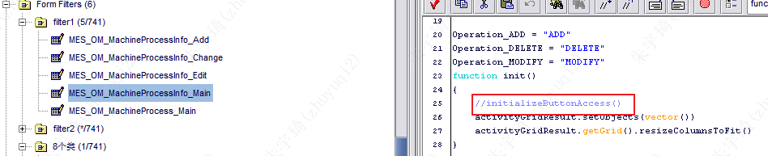

### 测试

1. 查询机台工艺包数量：
```sql
SELECT COUNT(*),EUIPMENT_ID_S FROM AT_OM_MACHINEPROCESSINFO aom2 GROUP BY EUIPMENT_ID_S order BY EUIPMENT_ID_S ;
```
2. 查询机台工艺包名及工艺包状态:
```sql
SELECT PROCESS_PACKAGE_NUMBER_S ,PROCESS_PACKAGE_TYPE_I FROM AT_OM_MACHINEPROCESSINFO aom WHERE EUIPMENT_ID_S = 'B4-06';
```
3. 查询机台工艺包ATR_KEY
```sql
SELECT
	ATR_KEY ,
	CREATION_TIME ,
	PROCESS_PACKAGE_TYPE_I,
	INLETWIRE_QTY_S ,
	FIRST_INLETWIRE_QTY_S ,
	LAST_INLETWIRE_QTY_S
FROM
	AT_OM_MACHINEPROCESSINFO aom2
WHERE
	EUIPMENT_ID_S = 'B4-06';
```
4. 根据机台工艺包ATR_KEY查询工艺包生效、失效时间
```sql
SELECT
	ATR_KEY ,
	CREATION_TIME ,
	SOURCE_ATRKEY_S,
	EFFECTIVE_TIME_S,
	DISEFFECTIVE_TIME_S,
	LAST_MODIFIED_TIME
FROM
	AT_OM_MACHINEPROCESSHISTORY aom
WHERE
	aom.SOURCE_ATRKEY_S = '1582651'
ORDER BY
	CREATION_TIME DESC ;
```

### BUG

1. 既有工艺包新增时，没有设置旧工艺包失效时间。【已修复】
2. 切换工艺包后，没有自动查询。【已修复】
3. 新增工艺包后，预设工艺包的类型显示没有转换。【已修复】
4. 新增工艺包时，如果未添加成功，对话窗口会关闭。

## 首刀、尾刀

### 开发

1. DataCollection表新增首刀、尾刀标准线量，
2. 重新生成8个类。
3. Common_Integration代码：

```java
/**      
 * 检查钢线标准用线量6-15 2023-02-23【TODO 首刀、尾刀校验——无必要】
 * */
function checkSteelWireAmount(steelWireAmount)
{
    if(steelWireAmount > 6.0f){
        if(steelWireAmount > 15.0f){
            //钢线标准用量超出
            return "EQ_BAG_WIREAMOUNT_EXCEED"
        }
    }else{
        //钢线标准用量超出
        return "EQ_BAG_WIREAMOUNT_EXCEED"
    }
    //范围内
    return "FEEDBACK_DATA_IS_NORMAL" 
}
```

```java
/**
 * 工艺程序包校验
 */
function checkProgramBag(equipName){

    mpObj = null
    mpFilter = class com.rockwell.discrete.mes.order.model.machineProcessInfo.MESOMMachineProcessInfoFilter()
    mpFilter.forEuipmentidEqualTo(equipName)
    mpFilter.forProcesspackagetypeEqualTo(Long::valueOf(0))//2023-02-22
    if(mpFilter.getCount()>0)
    {
        mpObj = mpFilter.getFilteredObjects().get(0)
        gyDiameter = mpObj.getWirediameter()
        if(isEmptyStr(gyDiameter)){
            //工艺包线径未维护
            return "EQ_BAG_NO_DIAMETER"
        }
        gyProductType = mpObj.getWafercode()
        if(isEmptyStr(gyProductType)){
            //工艺包产品别未维护
            return "EQ_BAG_NO_PRODUCTTYPE"
        }        
        gyRollerGapStr = mpObj.getSlotpitch()
        if(isEmptyStr(gyRollerGapStr)){
            //工艺包槽距未维护
            return "EQ_BAG_NO_ROLLERGAP"
        }
        gySteelWireAmount = mpObj.getInletWireqty()
        if(isEmptyStr(gySteelWireAmount)){
            //标准用线量未维护
            return "EQ_BAG_NO_WIREAMOUNT"
        }
        //2023-02-21 工艺包校验增加首刀、尾刀校验
        gyFirstSteelWireAmount = mpObj.getFirstinletWireqty()
        if(isEmptyStr(gyFirstSteelWireAmount)){
            //首刀用线量未维护
            return "EQ_BAG_NO_WIREAMOUNT"
        }
        gyLastSteelWireAmount = mpObj.getLastInletWireqty()
        if(isEmptyStr(gyLastSteelWireAmount)){
            //尾刀用线量未维护
            return "EQ_BAG_NO_WIREAMOUNT"
        }

    }else{
        //机台工艺包未维护
        return "EQ_BAG_NO_EXIST"
    }
    return "FEEDBACK_DATA_IS_NORMAL"
}
```
4. XXSectionOne代码：[XXSectionOne](file:D:/zhuyuqi2/Desktop/Event%20Sheets/XXGXOne.java)
5. XXGXOne代码：[XXGXOne](file:D:/zhuyuqi2/Desktop/Event%20Sheets/XXGXOne.java)

## 钢线

### 退料卡控

1.  仅DiamondLine评审结果为【退库】的才允许加入退料单
	- 原则所有钢线都需要评审。
	- 实际只对异常的钢线进行评审。
	- 对于没有异常而需要退库的钢线，则**需要进行一次评审，且结果为【退库】**。
2. 代码：`MES_PM_RetrunDetail_Dialog`【已完成】
	- 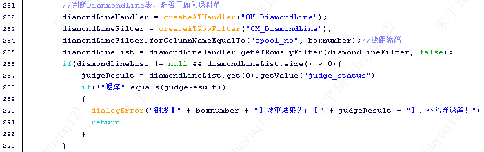
3. `MES_PM_RetrunDetail_Dialog`增加退料单中物料是否重复的校验。【陈伟霄 - 已完成】

### DiamondLine添加评审状态

1. DiamondLine表增加`is_judge`字段。【已完成】
2. 下拉数据维护增加：`IS_JUDGE`。【已完成】
3. 修改X_ChoiceElement表中`IS_JUDGE`字段值。【通过修改Form代码完成】
4. 维护Message：`DataDictionary_Default_MESOMDiamondLine`设置`IS_JUDGE`的国际化显示值。【已完成】
5. web_app重新导入DiamondLine8个类。【已完成】

### PDA领料接收设置钢线状态为未评审

【已完成】
`com.rockwell.webapp.server.requisitionServer.SaveRequisitionInfoServer`代码：
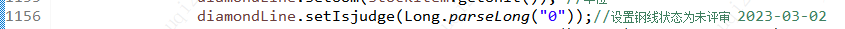

### PDA线边出库增加卡控逻辑

【已完成】
评审结果为【退库】的钢线，不可以发往现场【待使用】
`com.rockwell.webapp.servlet.storage.DeliveryStorageServiceImpl`代码：
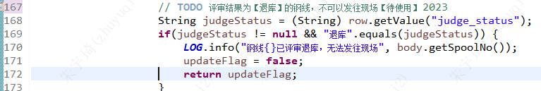

### PDA线边出库设置钢线状态为未评审

【已完成】
`com.rockwell.webapp.servlet.storage.DeliveryStorageServiceImpl`代码：
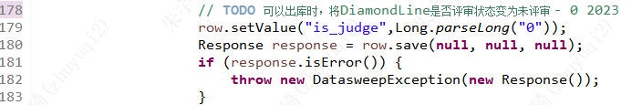

### MES评审后将钢线状态设置为已评审

`MES_OM_DiamondLineManagement_Judge`：【已完成】


`MES_OM_DiamondLineManagement_MultiJudge`【已完成】


### 评审界面按钢线是否评审查询

1. 编辑`MES_OM_DiamondLineManagement_Review`Form。【已完成】
2. 注意修改SQL：
	- 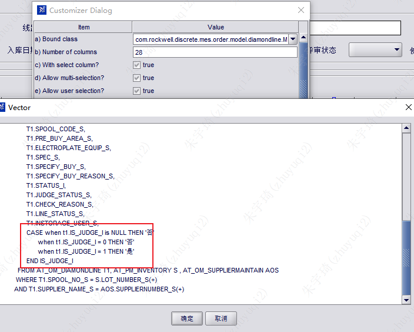

