## 搭建Java环境

### 运行基础

下载指定插件：

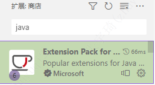

查看插件配置说明：

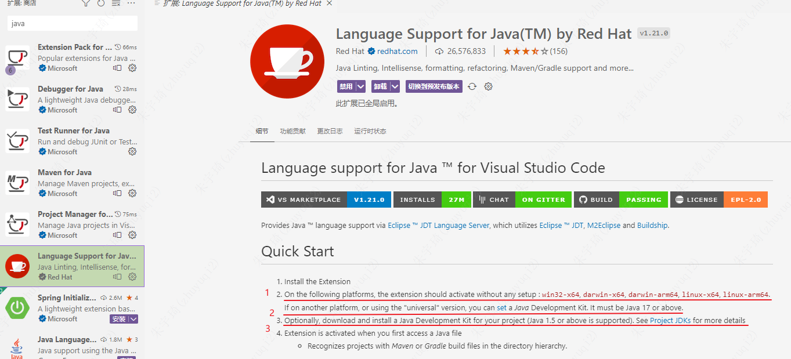

1. 第一句是说：红字的那些平台只要安装了插件就可以直接使用了。——**实际上是要安装了java且是java17以上的环境，没安装还是不能用**
2. 第二句是说：其他平台要使用则需要安装java17以上的jdk。
3. 第三句是说：可以安装其他版本的jdk使用。

对上面的具体描述参考下面：

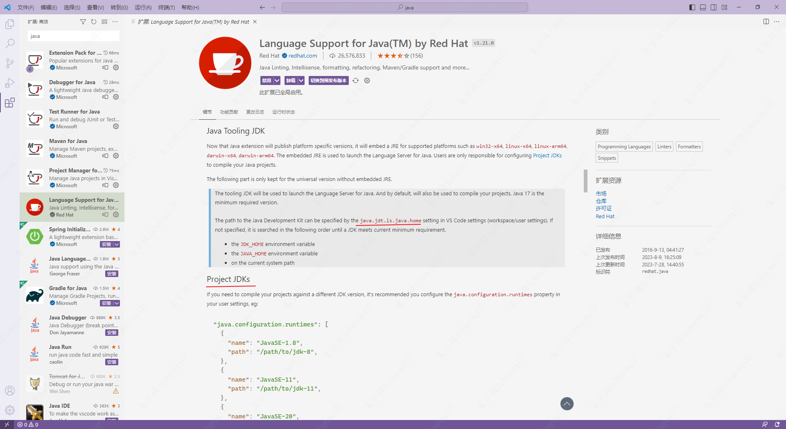

- Java Tooling JDK：系统统一的JDK版本
	- 由`java.jdt.ls.java.home`配置，如果没有配置，则依次找系统环境变量的`JDK_HOME`、`JAVA_HOME` 、系统java。
- Project JDKs：工程运行的JDK版本，可以配置多环境。
	- 由`java.configuration.runtimes`配置。

总结：可以只指定`java.configuration.runtimes`，如果同时配置了`java.jdt.ls.java.home`，则以`java.jdt.ls.java.home`优先。

### 实践

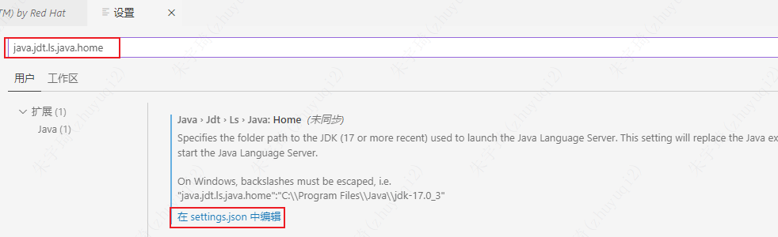

打开`settings.json`文件：

```json
{
  "redhat.telemetry.enabled": true,
    "security.workspace.trust.banner": "always",
    "java.codeGeneration.generateComments": true,
    "java.eclipse.downloadSources": true,
    "java.configuration.runtimes": [

        {
          "name": "JavaSE-1.8",
          "path": "D:/Apps/Java/jdk1.8.0_181",
        },
        {
          "name": "JavaSE-17",
          "path": "D:/Apps/Java/jdk-17.0.6",
        }
      ],
    "security.workspace.trust.untrustedFiles": "open",
    "editor.fontFamily": "'Cascadia Mono'",
    "workbench.colorTheme": "Quiet Light",
    "editor.fontSize": 15,
    "editor.unicodeHighlight.nonBasicASCII": false,
    "java.jdt.ls.java.home": ""
}
```

*上面的配置没有指定`java.jdt.ls.java.home`，运行时会在`java.configuration.runtimes`中查找第一个。还没有做到如何根据不同项目选择不同的运行环境*
### Java Web开发

#### 安装Server

下载插件：

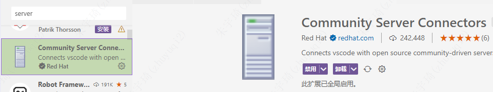

添加tomcat服务器：创建服务 》 选择本地服务/下载服务 》 选择本地服务的磁盘路径（根目录） 》 配置服务器信息

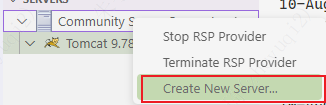

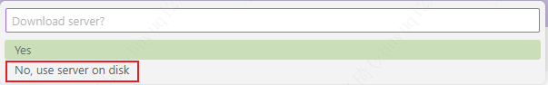

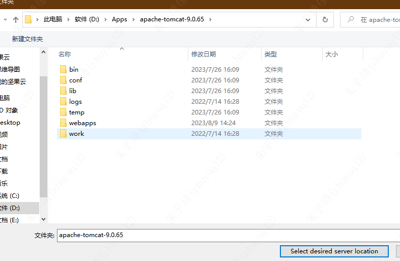

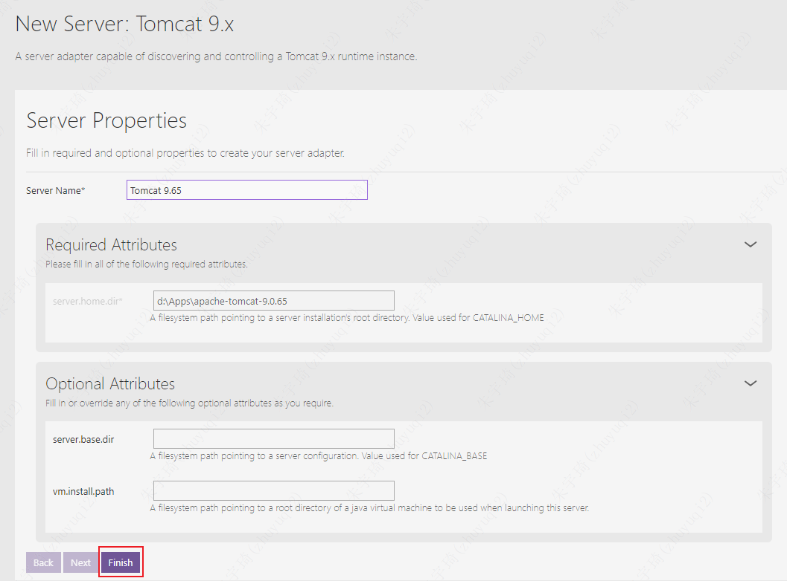

#### 安装maven

1. 下载maven（略）
2. 配置maven环境变量（略）
3. 设置maven仓库默认地址（略）
4. 指定maven配置地址：
	- 方式一：
		- 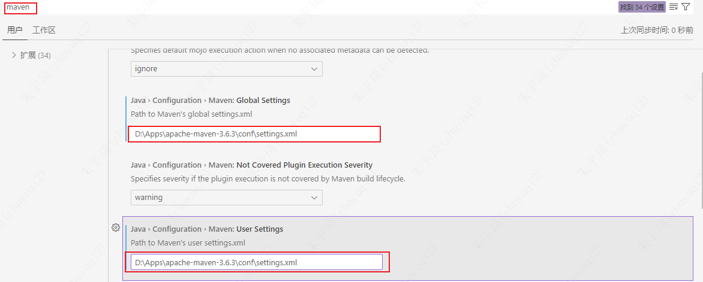
	- 方式二：
		- 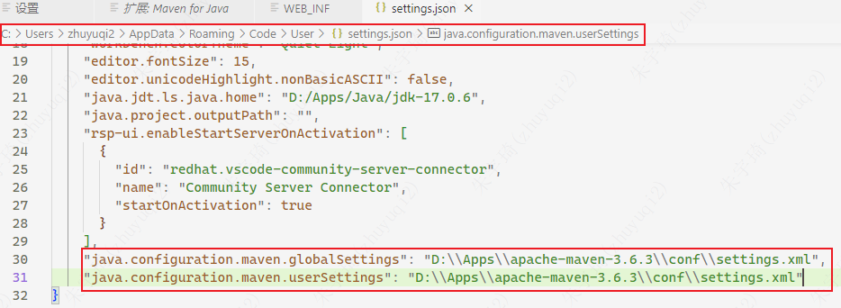
	- 上述配置之后，就会使用settings.xml文件中的maven仓库地址

#### 创建javaweb项目

1. 按下`ctrl+shift+p`打开控制台：
	- 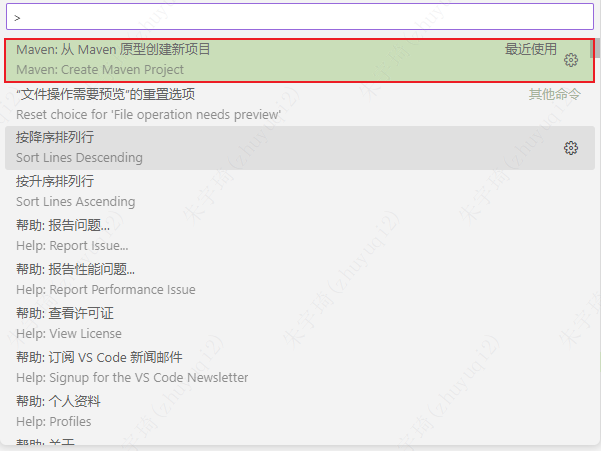
2. 创建web项目：
	- 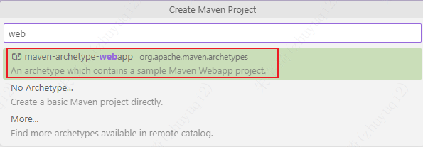
3. 选择web版本：
	- 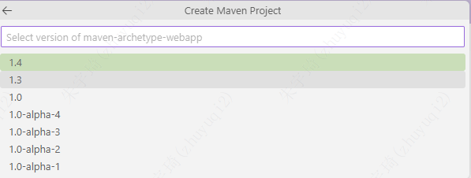
4. 省略其他步骤
5. 选择保存地址：
	- 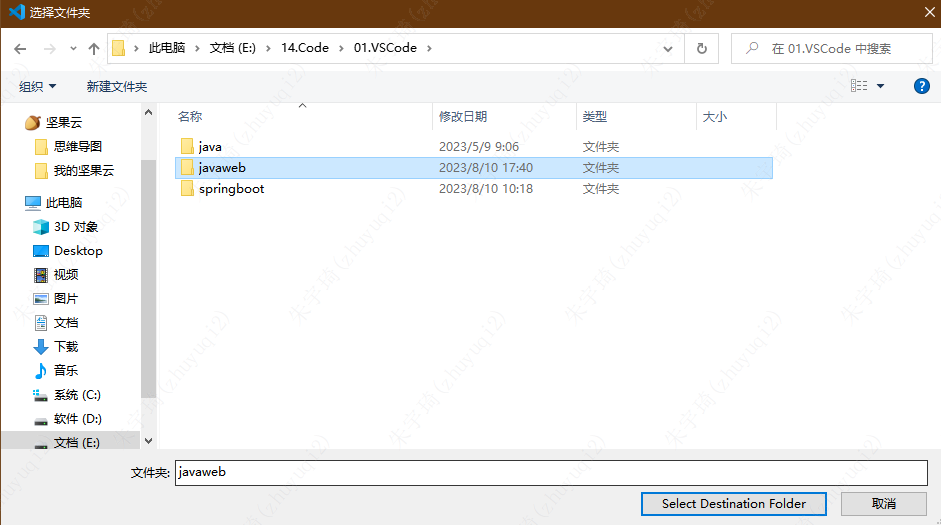

## diff比较文件差异

1. vscode文件资源管理器中，右键选择要比较的文件，点击【选择以进行比较】。这将是比较的第一个文件，也可以看作基版。
	- 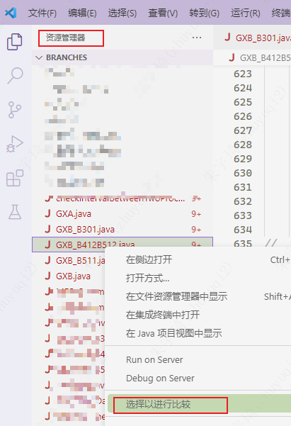
2. 继续在文件资源管理器中操作，选择需要比较的第二个文件，右键选择【与已选项目进行比较】。
	- 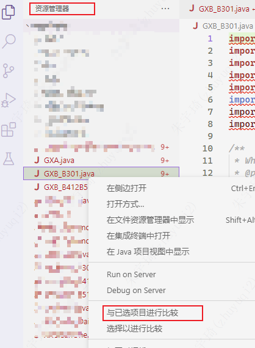
3. 后续还要与第一个文件（基版）比较，继续选择文件操作【与已选项目进行比较】。
4. 如果要更换比较的基板，则选中文件，操作【选择以进行比较】

## markdwon粘贴图片自动放到相对路径

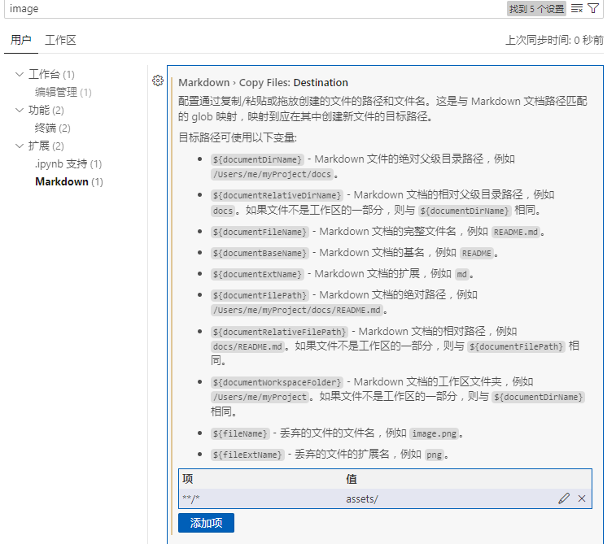