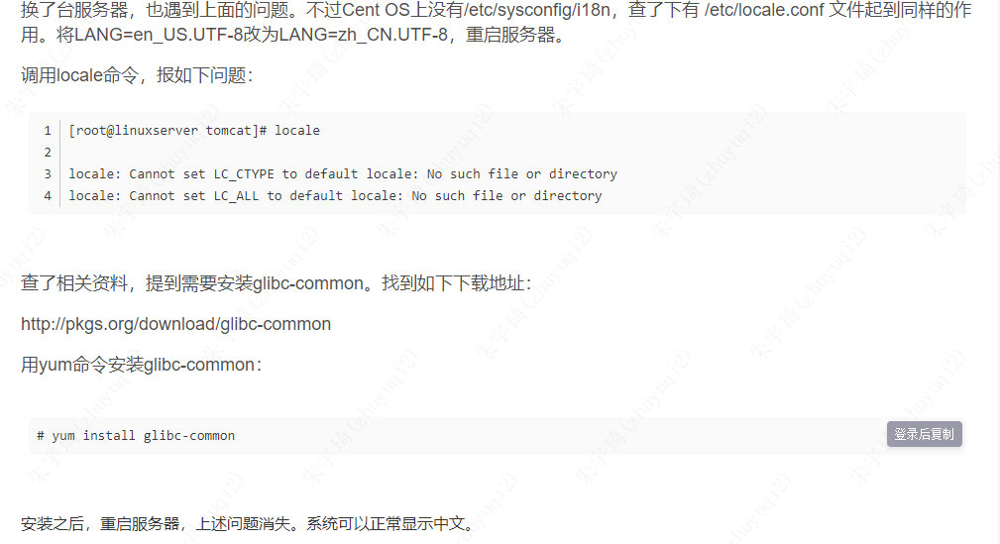

基于Fine Report 10。

## 服务器环境搭建

[Linux下使用Tomcat服务器部署包进行部署 - FineReport帮助文档 - 全面的报表使用教程和学习资料 (fanruan.com)](https://help.fanruan.com/finereport10.0/doc-view-2919.html)

1. 安装虚拟机
2. 安装中文环境：[Linux 系统安装中文语言包- FineReport帮助文档 - 全面的报表使用教程和学习资料 (fanruan.com)](https://help.fanruan.com/finereport10.0/doc-view-2028.html)

1. 上传压缩包文件
	- 如果上传提示没权限可以先传到 tmp 目录，然后再移动到自己的目录。

