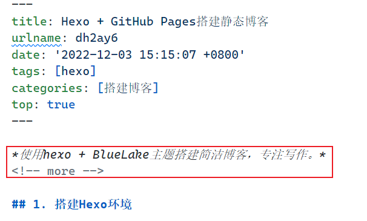

*使用hexo + BlueLake主题搭建简洁博客，专注写作。*
<!-- more -->

## 1. 搭建Hexo环境

1. 全局安装hexo工具：

   ```bash
   npm install hexo-cli -g
   ```

2. 创建hexo管理文件夹：

   ```bash
   hexo init <folder>
   ```

3. 初始化hexo文件夹：

   ```bash
   cd <folder>
   npm install
   ```

4. 此时文件目录如下：

   ```bash
    .
    ├── _config.yml
    ├── package.json
    ├── scaffolds
    ├── source
    |   ├──_drafts
    |   └──_posts
    └── themes
   ```

      - 本文中将`<foleder>/_config.yml`称为根配置文件。
      - 写在`<foleder>/_posts`目录下的markdown文件会自动发布为博客文章。

## 2. 使用BlueLake主题

### 2.1 安装主题

进入`<foleder>/themes`目录，执行：

```bash
git clone https://github.com/chaooo/hexo-theme-BlueLake.git themes/BlueLake
```

### 2.2 安装主题插件

进入`<foleder>/themes`目录，执行：

```bash
npm install hexo-renderer-jade --save
npm install hexo-renderer-stylus --save
npm install hexo-generator-feed --save
npm install hexo-generator-sitemap --save
```

### 2.3 启用主题

编辑`<foleder>/_config.yml`根配置文件，把主题设置修改为BlueLake：

```yaml
theme: BlueLake
```

### 2.4 配置主题

#### 2.4.1 配置关于页面

在`<folder>`目录下执行：

```bash
hexo new page 'about'
```

此时会自动创建`<folder>/about/index.md`文件，该文件中不需要写任何东西。编辑 `themes/BlueLake/_config.yml`主题配置文件中的about项，修改为自己的信息。

#### 2.4.2 更换markdown渲染器

1. 在`<folder>`目录下执行，卸载原来的渲染器：

    ```bash
    npm uninstall hexo-renderer-marked --save
    ```

2. 下载新渲染器

    ```bash
    npm i @upupming/hexo-renderer-markdown-it-plus --save
    ```

3. hexo-renderer-marked渲染器提供了更为丰富的markdown语法支持，比如数学公式，如果不需要，也可以不用更换。

## 3. 安装插件

### 3.1 安装本地搜索插件

在`<folder>`目录下执行：

```bash
npm install hexo-generator-json-content --save
```

编辑`<foleder>/_config.yml`根配置文件，添加配置：

```
jsonContent:
  meta: false
  pages: false
  posts:
    title: true
    date: true
    path: true
    text: true
    raw: false
    content: false
    slug: false
    updated: false
    comments: false
    link: false
    permalink: false
    excerpt: false
    categories: false
    tags: true
```

### 3.2 添加文章首页指定插件

在`<folder>`目录下执行：

```bash
npm uninstall hexo-generator-index --save
npm install hexo-generator-index-pin-top --save
```

在需要置顶的文章的Front-matter中加上top: true。

```yaml
title: Hexo + GitHub Pages搭建静态博客
urlname: dh2ay6
date: '2022-12-03 15:15:07 +0800'
tags: [hexo]
categories: [搭建博客]
top: true
```

## 4. 使用Hexo写作

### 4.1 给文章添加标签

在markdown文章的Front-matter区，添加tags标签：

```bash
tags:
- PS3
- Games
```

或：

```bash
tags: [PS3, Games]
```

### 4.2 给文章添加分类

在markdown文章的Front-matter区，添加tags标签：

```bash
categories:
  - Diary
  - Life
```

或：

```bash
categories: [Diary, Life]
```

**注意：Hexo 不支持指定多个同级分类，上述案例表示创建了Diary分类和Life分类，其中Life分类是Diary分类的子分类。**

### 4.3 显示文章摘要

在markdown文章的Front-matter区**后**，markdown正文**前**，书写需要显示的摘要，写完后使用`<!-- more -->`分割正文。


## 5. 部署GitHub Pages

### 5.1 安装 hexo-deployer-git

在`<folder>`目录下执行：

```bash
npm install hexo-deployer-git --save
```

### 5.2 添加部署地址

编辑`<foleder>/_config.yml`根配置文件，填写github仓库地址：

```yaml
deploy:
  type: git
  repo:
    github: https://github.com/sk370/sk370.github.io
    branch: master
```

### 5.3 推送网站到GitHub

在`<folder>`目录下执行：

```bash
hexo d
```

*参考文档：*
*[BlueLake主题安装](https://github.com/chaooo/hexo-theme-BlueLake/)*
*[BlueLake主题配置](https://chaooo.github.io/2016/12/29/bluelake.html)*
*[Heox官方文档](https://hexo.io/zh-cn/docs/configuration)*
*[最全Hexo博客搭建+主题优化+插件配置+常用操作+错误分析](https://juejin.cn/post/6844903713811890189#heading-12)*