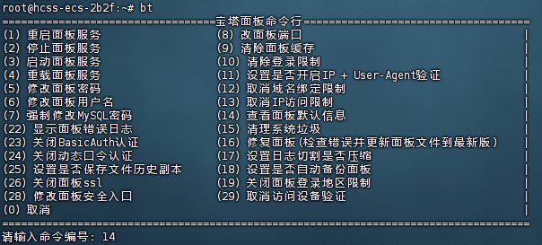

- apt-get属于ubuntu、Debian的包管理工具

- yum则属于Redhat、Centos包管理工具

Ubuntu安装命令：

`wget -O install.sh https://download.bt.cn/install/install_lts.sh && sudo bash install.sh ed8484bec`

 外网面板地址: https://117.72.38.236:24042/36be29f8
 内网面板地址: https://172.16.0.3:24042/36be29f8
 username: eygdi8y7
 password: 10d4f5f2

## 查看宝塔账号密码

命令行输入`bt`或`/etc/init.d/bt`

密码默认不显示，忘记密码需要重置。

## 卸载面板及环境

1. `wget http://download.bt.cn/install/bt-uninstall.sh`
2. `bash bt-uninstall.sh`

