*Kubernetes，简称K8s，是用8代替名字中间的8个字符“ubernete”而成的缩写。是一个开源的，用于管理云平台中多个主机上的容器化的应用，Kubernetes的目标是让部署容器化的应用简单并且高效（powerful）,Kubernetes提供了应用部署，规划，更新，维护的一种机制。*
<!-- more -->

## 1. 介绍

### 1.1 出现原因


传统部署：应用部署在一台主机上，一个应用的问题会扩散至整个主机上时，会导致整个主机崩溃，导致整个应用系统不可用。

虚拟化部署：应用部署在不同的虚拟机上，减小了应用问题影响的范围，但虚拟机太笨重，占用了过多的主机资源。

容器化部署：既达到了虚拟化部署的优点，同时由于容器占用资源小的优点，解决了大多数问题。但是业务庞大时，容器会部署过多，管理会存在很大的难度。所以急需一个对大量容器管理的系统——容器编排系统。

### 1.2 Kubernetes 特性

- **服务发现和负载均衡**
  Kubernetes 可以使用 DNS 名称或自己的 IP 地址公开容器，如果进入容器的流量很大， Kubernetes 可以负载均衡并分配网络流量，从而使部署稳定。
- **存储编排**
  Kubernetes 允许你自动挂载你选择的存储系统，例如本地存储、公共云提供商等。
- **自动部署和回滚**
  你可以使用 Kubernetes 描述已部署容器的所需状态，它可以以受控的速率将实际状态 更改为期望状态。例如，你可以自动化 Kubernetes 来为你的部署创建新容器， 删除现有容器并将它们的所有资源用于新容器。
- **自动完成装箱计算**
  Kubernetes 允许你指定每个容器所需 CPU 和内存（RAM）。 当容器指定了资源请求时，Kubernetes 可以做出更好的决策来管理容器的资源。
- **自我修复**
  Kubernetes 重新启动失败的容器、替换容器、杀死不响应用户定义的 运行状况检查的容器，并且在准备好服务之前不将其通告给客户端。
- **密钥与配置管理**
  Kubernetes 允许你存储和管理敏感信息，例如密码、OAuth 令牌和 ssh 密钥。 你可以在不重建容器镜像的情况下部署和更新密钥和应用程序配置，也无需在堆栈配置中暴露密钥。

### 1.3 架构

1. 工作方式：`Kubernetes Cluster = N * Master Node + N * Worker * Node`（N 主节点+N 工作节点， N>=1）
2. Kubernetes Cluister：k8s 集群——集团公司
   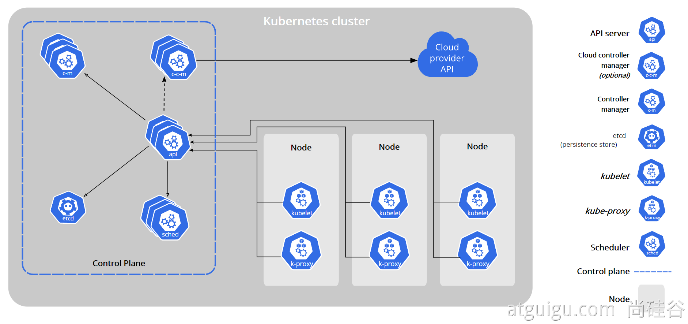
   - Controll plane：Control Plane Components，控制平面组件——集团公司总部
     - c-m：控制器管理器——决策领导
     - etcd：键值数据库——公司资料库
     - api：kube-apiserver，控制面的前端——给领导干活儿的秘书
     - sched：kube-scheduler，监视、调度节点——调度
     - c-c-m：cloud-controller-manaager，云控制器管理器——商务部门
   - Node：节点——分公司
     - kubelet：——分公司总经理
     - kube-proxy：——门卫大爷，他们之间保持通信
  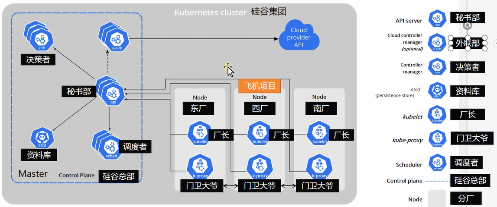

## 2. 安装 docker

### 2.1 开 3 个云服务器

选择任意云服务，购买 2 核 4g 的服务区 3 台（因为集群最少 3 台）。本例选择腾讯云，因为原先有账号。
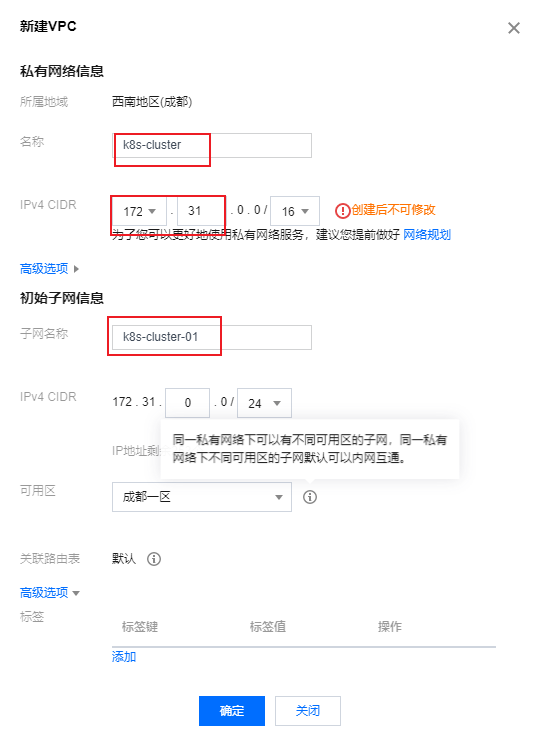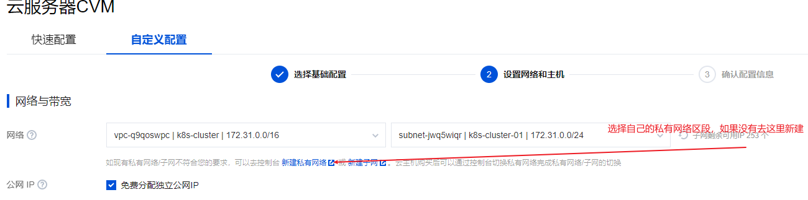
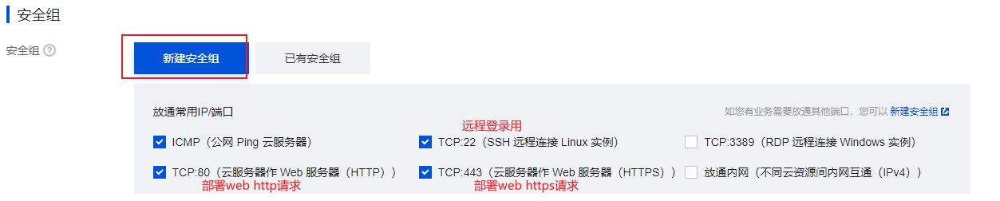
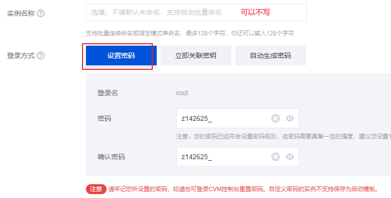
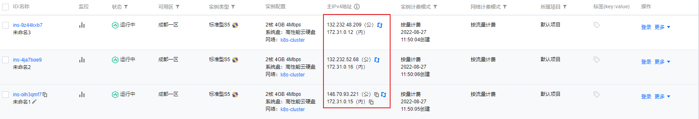

腾讯云特点：
   - 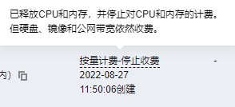

网络测试：
   - 本地主机 ping3 台远程主机的公网 ip 和私网 ip
     - 公网 ip：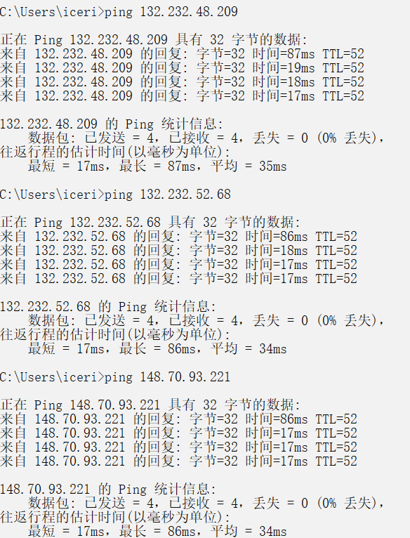
     - 私网 ip：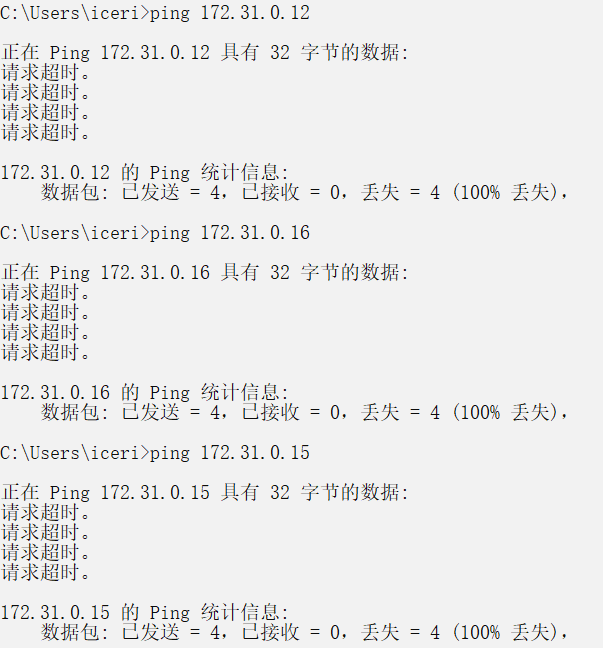
   - 远程主机互相 ping 公网 ip 和私网 ip
     - 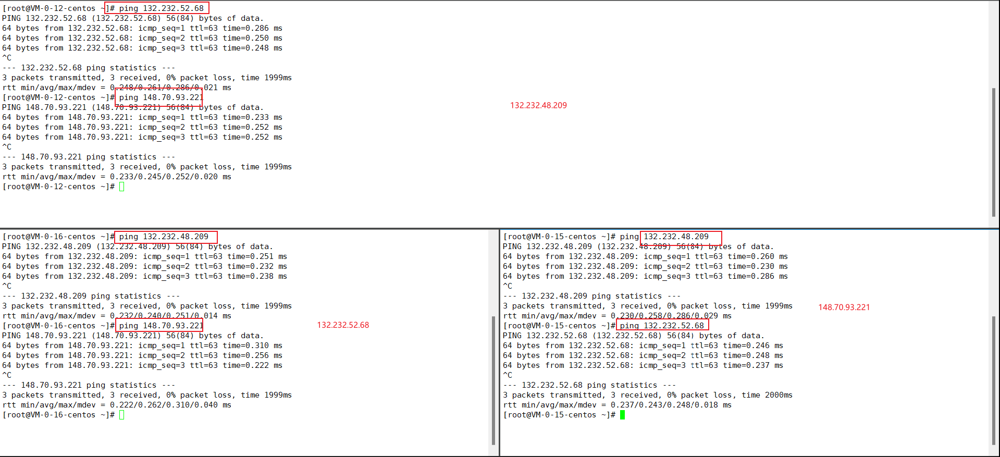
     - 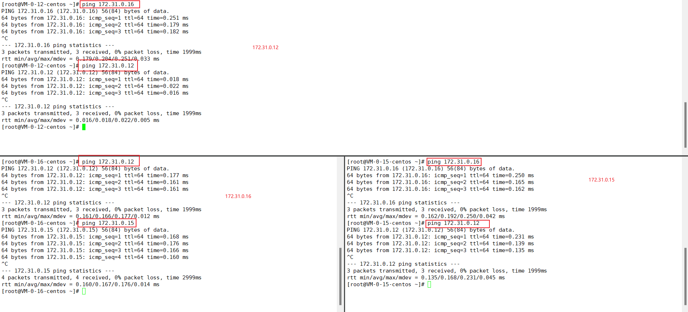

### 2.2 本地连接到 3 台服务区并安装 docker

1. 准备工作——实现一个窗口输入，另外两个也完成输入
   - 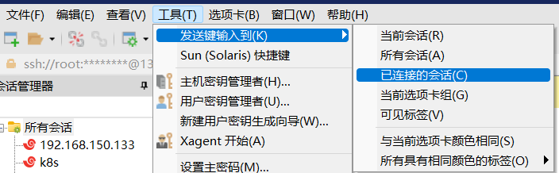
   - 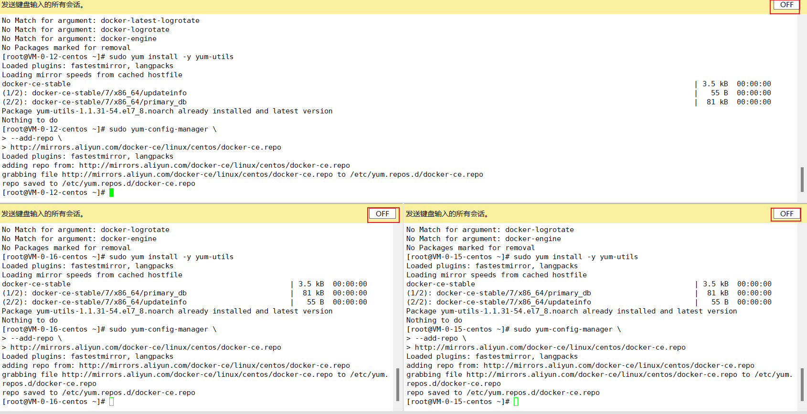
2. 配置 yum 源

```bash
sudo yum install -y yum-utils
sudo yum-config-manager \
--add-repo \
http://mirrors.aliyun.com/docker-ce/linux/centos/docker-ce.repo
```

3. 安装 docker

```bash
sudo yum install -y docker-ce docker-ce-cli containerd.io

#以下是在安装k8s的时候使用（本测试指定版本）
yum install -y docker-ce-20.10.7 docker-ce-cli-20.10.7  containerd.io-1.4.6
```

4. 启动（设置开机启动并让本次启动立即生效）

```bash
systemctl enable docker --now
```

5. 配置阿里云加速

```bash
sudo mkdir -p /etc/docker
sudo tee /etc/docker/daemon.json <<-'EOF'
{
  "registry-mirrors": ["https://bnzui6g7.mirror.aliyuncs.com"]
}
EOF
sudo systemctl daemon-reload
sudo systemctl restart docker
```

## 3. kubeadm 创建集群

### 3.1 集群架构

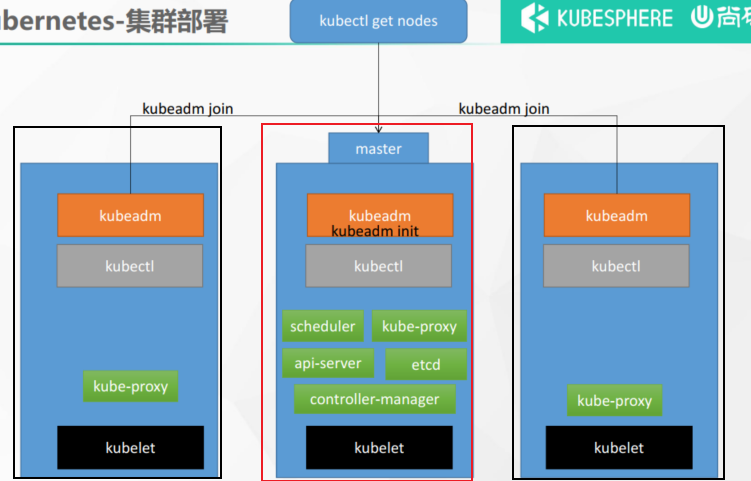
master、node 节点均需要：

- kubelet、kubeadm、kubectl

master 节点需要：

- kube-apiserver、kube-proxy、kube-controller-manager、kube-scheduler、coredns、etcd、pause。

node 节点需要：

- kube-proxy

### 3.2 准备工作

Kubernetes 项目为基于 Debian 和 Red Hat 的 Linux 发行版以及一些不提供包管理器的发行版提供通用的指令，但官方要求：

- 每台机器 2 GB 或更多的 RAM （如果少于这个数字将会影响你应用的运行内存)
- 2 CPU 核或更多
- 集群中的所有机器的网络彼此均能相互连接(公网和内网都可以)
  - **设置防火墙放行规则**（虚拟机互相 ping 公网 ip 或私网 ip）
- 节点之中不可以有重复的主机名、MAC 地址或 product_uuid。请参见[这里](https://kubernetes.io/zh/docs/setup/production-environment/tools/kubeadm/install-kubeadm/#verify-mac-address)了解更多详细信息。
  - **设置不同 hostname：**`hostnamectl set-hostname xxx`
  - **分别命名为 k8s-master、k8s-node1、k8s-node2**
- 开启机器上的某些端口。请参见[这里](https://kubernetes.io/zh/docs/setup/production-environment/tools/kubeadm/install-kubeadm/#check-required-ports) 了解更多详细信息。
  - **内网互信**
- 禁用交换分区。为了保证 kubelet 正常工作，你 **必须** 禁用交换分区。
  - **永久关闭**
  - 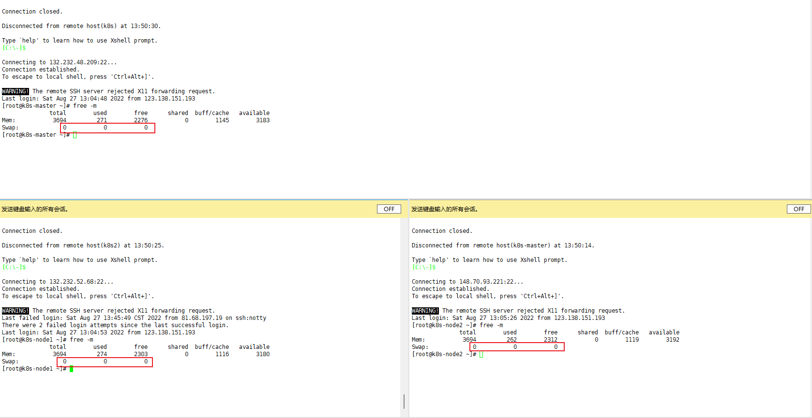
- 禁用 SELinux
- 允许 iptables 检查桥接流量（将 ipv6 的流量转到 ipv4，便于统计）

```bash
#各个机器设置自己的域名
hostnamectl set-hostname xxxx

# 将 SELinux 设置为 permissive 模式（相当于将其禁用）
sudo setenforce 0
sudo sed -i 's/^SELINUX=enforcing$/SELINUX=permissive/' /etc/selinux/config

#关闭swap
swapoff -a
sed -ri 's/.*swap.*/#&/' /etc/fstab

#允许 iptables 检查桥接流量
cat <<EOF | sudo tee /etc/modules-load.d/k8s.conf
br_netfilter
EOF

cat <<EOF | sudo tee /etc/sysctl.d/k8s.conf
net.bridge.bridge-nf-call-ip6tables = 1
net.bridge.bridge-nf-call-iptables = 1
EOF
sudo sysctl --system

```

### 3.3 安装 kubelet、kubeadm、kubectl

> 官方教程：
> 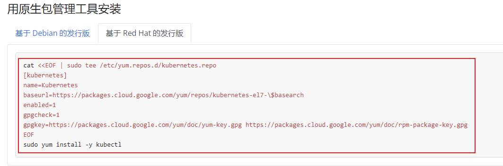

- kubelet 是在每个 Node 节点上运行的主要 “节点代理”。
- kubeadm 是官方社区推出的一个用于快速部署 kubernetes 集群的工具
- kubectl 是使用 Kubernetes API 与 Kubernetes 集群的控制面进行通信的命令行工具。

```bash
# 配置k8s下载地址
cat <<EOF | sudo tee /etc/yum.repos.d/kubernetes.repo
[kubernetes]
name=Kubernetes
baseurl=http://mirrors.aliyun.com/kubernetes/yum/repos/kubernetes-el7-x86_64
enabled=1
gpgcheck=0
repo_gpgcheck=0
gpgkey=http://mirrors.aliyun.com/kubernetes/yum/doc/yum-key.gpg
   http://mirrors.aliyun.com/kubernetes/yum/doc/rpm-package-key.gpg
exclude=kubelet kubeadm kubectl
EOF

# 安装kubelet、kubeadm、kubectl
sudo yum install -y kubelet-1.20.9 kubeadm-1.20.9 kubectl-1.20.9 --disableexcludes=kubernetes
# 设置开机启动并立即重启
sudo systemctl enable --now kubelet
# 查看kubelet服务状态
systemctl status kubelet
```

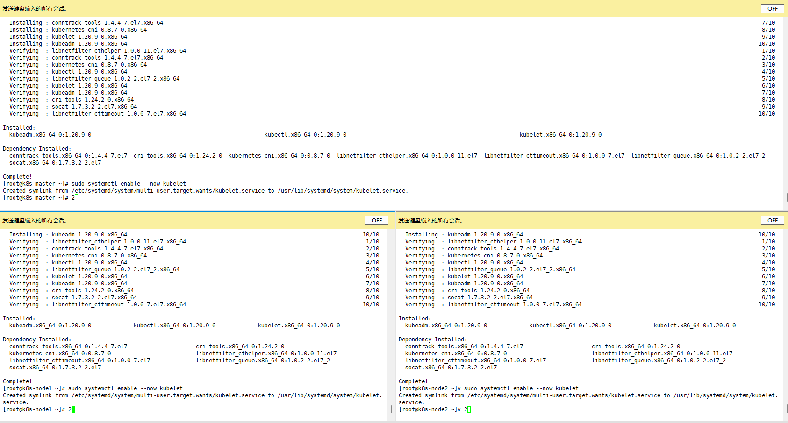
安装后效果：kubelet 现在每隔几秒就会重启，因为它陷入了一个等待 kubeadm 指令的死循环。

### 3.4 下载节点镜像文件

一个 k8s-master 节点需要 kube-apiserver、kube-proxy、kube-controller-manager、kube-scheduler、coredns、etcd、pause。

k8s-node 节点需要 kube-proxy。而 kubelet 是运行在虚拟机上的，其他部分是运行在容器内的，所以为了下载顺利，下面的流程先建立了一个下载上述镜像文件的可执行脚本`./images.sh`，并赋予了可执行权限进行下载。

```bash
# 创建脚本
sudo tee ./images.sh <<-'EOF'
#!/bin/bash
images=(
kube-apiserver:v1.20.9
kube-proxy:v1.20.9
kube-controller-manager:v1.20.9
kube-scheduler:v1.20.9
coredns:1.7.0
etcd:3.4.13-0
pause:3.2
)
for imageName in ${images[@]} ; do
docker pull registry.cn-hangzhou.aliyuncs.com/lfy_k8s_$imageName
done
EOF

# master节点赋予权限并执行
chmod +x ./images.sh && ./images.sh

# node节点执行
docker pull registry.cn-hangzhou.aliyuncs.com/lfy_k8s_kube-proxy
```

> - 注意：这里`docker-pull`使用了 lfy 的阿里云镜像仓库。类似下面这种。
> - 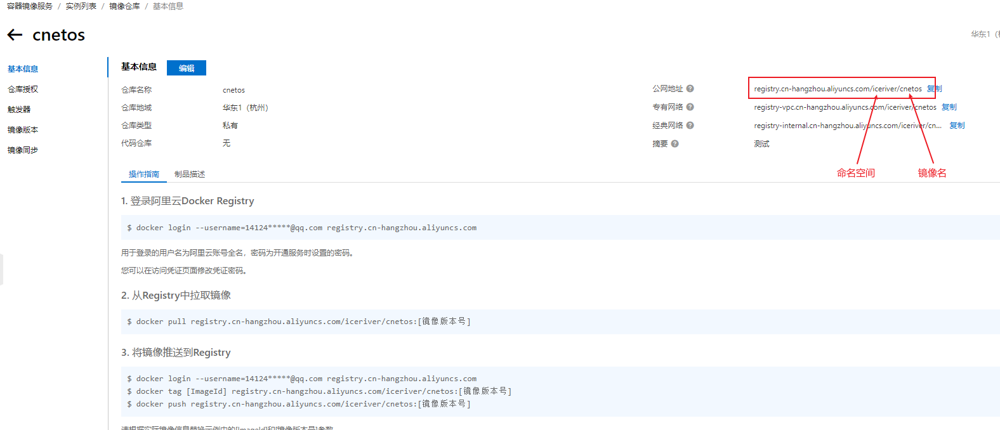
> - 这里建议使用 lfy 的仓库，因为镜像的名字是他设计的，别人没有。

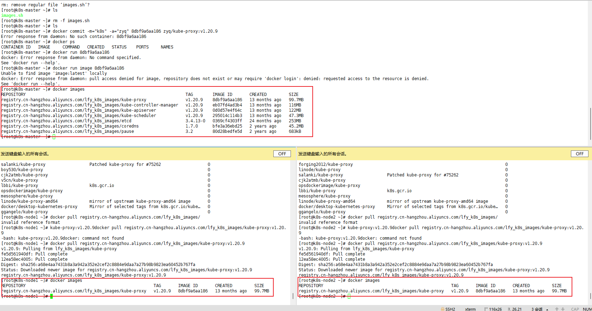

### 3.5 初始化主节点

```bash
#所有机器添加master域名映射，声明谁是master节点：私有ip要修改为自己的
echo "172.31.0.12  cluster-endpoint" >> /etc/hosts

#主节点初始化
kubeadm init \
--apiserver-advertise-address=172.31.0.12 \
--control-plane-endpoint=cluster-endpoint \
--image-repository registry.cn-hangzhou.aliyuncs.com/lfy_k8s_images \
--kubernetes-version v1.20.9 \
--service-cidr=10.96.0.0/16 \
--pod-network-cidr=192.168.0.0/16

#所有网络范围不重叠——指上述ip（下面两个ip保持默认，其中192.168.0.0/16是为了适配master节点安装calico）
```

设定完 master 节点后，可以`ping cluster-endpoint`测试是否接通：
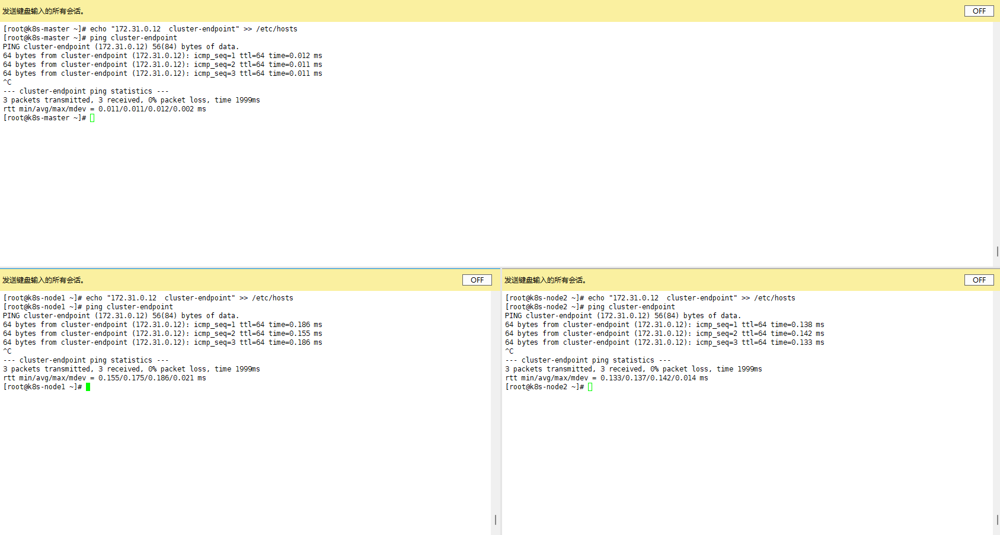
主节点安装完成后：

```bash
Your Kubernetes control-plane has initialized successfully!

To start using your cluster, you need to run the following as a regular user:

  mkdir -p $HOME/.kube
  sudo cp -i /etc/kubernetes/admin.conf $HOME/.kube/config
  sudo chown $(id -u):$(id -g) $HOME/.kube/config

Alternatively, if you are the root user, you can run:

  export KUBECONFIG=/etc/kubernetes/admin.conf

You should now deploy a pod network to the cluster.
Run "kubectl apply -f [podnetwork].yaml" with one of the options listed at:
  https://kubernetes.io/docs/concepts/cluster-administration/addons/

You can now join any number of control-plane nodes by copying certificate authorities
and service account keys on each node and then running the following as root:

  kubeadm join cluster-endpoint:6443 --token y53lrq.sca3goa3xm11y94q \
    --discovery-token-ca-cert-hash sha256:985e0f6815ee7b4f9b70c0d7cfc899ffaa7b4577c817ce6acbf925059d535030 \
    --control-plane

Then you can join any number of worker nodes by running the following on each as root:

kubeadm join cluster-endpoint:6443 --token y53lrq.sca3goa3xm11y94q \
    --discovery-token-ca-cert-hash sha256:985e0f6815ee7b4f9b70c0d7cfc899ffaa7b4577c817ce6acbf925059d535030
```

根据提示执行如下命令（步骤一）：
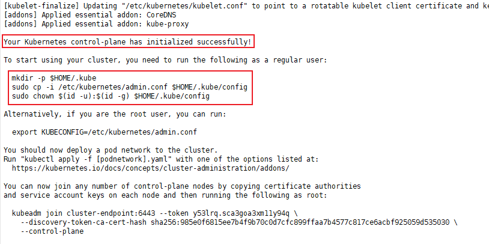

```bash
mkdir -p $HOME/.kube
sudo cp -i /etc/kubernetes/admin.conf $HOME/.kube/config
sudo chown $(id -u):$(id -g) $HOME/.kube/config
```

安装网络组件，这里选择[calico 官网](https://docs.projectcalico.org/getting-started/kubernetes/self-managed-onprem/onpremises#install-calico-with-kubernetes-api-datastore-more-than-50-nodes)（步骤二）：
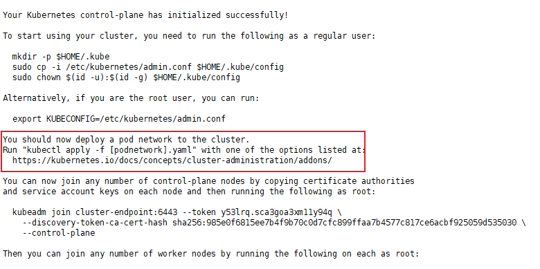

- 下载 calico 配置文件：`curl [https://docs.projectcalico.org/manifests/calico.yaml](https://docs.projectcalico.org/manifests/calico.yaml) -O`
- `curl https://docs.projectcalico.org/v3.20/manifests/calico.yaml -O`
- 安装 calico：`kubectl apply -f calico.yaml`

> 小总结：
> 
> 运行中的应用在 docker 里面叫容器，在 k8s 里面叫 Pod
> kubetcl 常用命令：
> 
> - 查看节点状态（只能在主节点运行）：`kubectl get nodes`
>   - 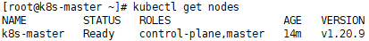
> - 根据配置文件，给集群创建资源：`kubectl apply -f xxxx.yaml`
> - 查看集群部署了哪些应用（pod）：`kubectl get pods -A`
>   - 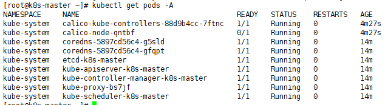

### 3.5 node 节点加入 master

根据 master 节点安装完的提示：
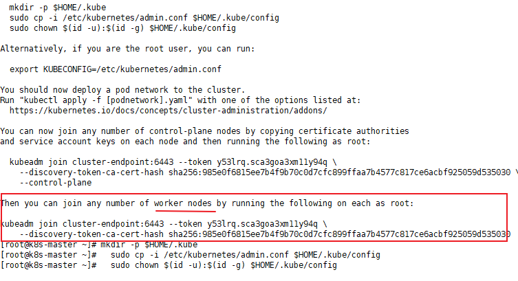
在 node1 和 node2 中执行（该命令有 24 小时有效期，如果过期了可以在 master 节点执行`kubeadm token create --print-join-command`重新获取：

```bash
kubeadm join cluster-endpoint:6443 --token y53lrq.sca3goa3xm11y94q \
    --discovery-token-ca-cert-hash sha256:985e0f6815ee7b4f9b70c0d7cfc899ffaa7b4577c817ce6acbf925059d535030
```

遇到报错：

- 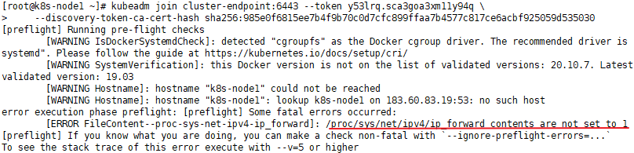
- node1、node2 执行：`sysctl -w net.ipv4.ip_forward=1`
- 网上解释：Linux 系统默认是禁止数据包转发的。所谓转发即当主机拥有多于一块的网卡时，其中一块收到数据包，根据数据包的目的 ip 地址将包发往本机另一网卡，该网卡根据[路由表](https://so.csdn.net/so/search?q=%E8%B7%AF%E7%94%B1%E8%A1%A8&spm=1001.2101.3001.7020)继续发送数据包。

在主节点查看节点状态``：

- 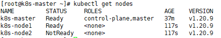

### 3.6 集群的自我修复

机器宕机后，重启集群可恢复。可以看到 AGE 延续的之前，STATUS 在逐渐恢复到 Running。
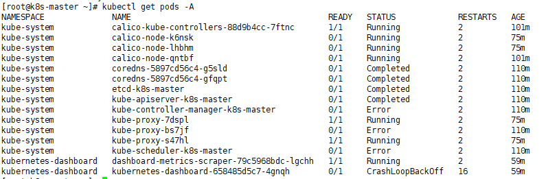

### 3.7 k8s 可视化界面

dashboard 是 k8s 官方提供的 web 可视化界面：

1. 安装命令（在 master 节点执行）：
   - 下载配置文件并安装：`kubectl apply -f https://raw.githubusercontent.com/kubernetes/dashboard/v2.3.1/aio/deploy/recommended.yaml`
   - 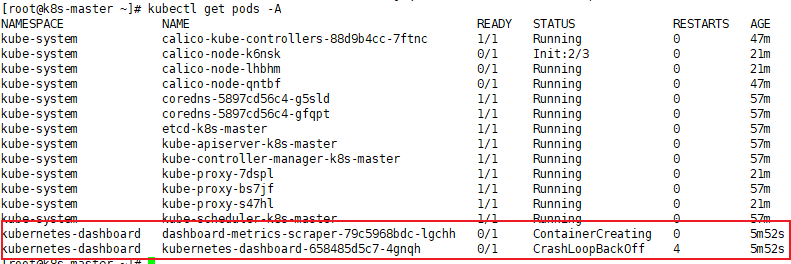
2. 设置访问端口：
   - 暴露端口：`kubectl edit svc kubernetes-dashboard -n kubernetes-dashboard`
     - type: ClusterIP 改为 type: NodePort
   - 查看暴露的端口：`kubectl get svc -A |grep kubernetes-dashboard`
     - 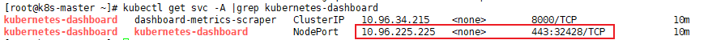
3. 在云服务器安全组中找到找到端口，在安全组放行上面的 32428 端口
   - 
   - 现在即可使用 k8s 集群的任意一台公网 ip+端口号即可访问
   - 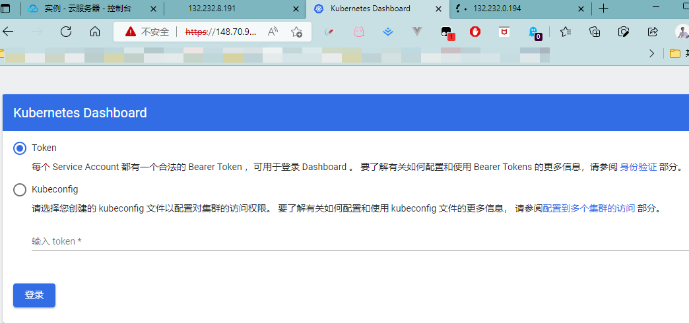
   - 为啥我只有子节点的 ip 能访问？
4. 创建访问者账号：
   - `vi dash-user.yaml`
   ```bash
    #创建访问账号，准备一个yaml文件； vi dash-user.yaml
    apiVersion: v1
    kind: ServiceAccount
    metadata:
      name: admin-user
      namespace: kubernetes-dashboard
    ---
    apiVersion: rbac.authorization.k8s.io/v1
    kind: ClusterRoleBinding
    metadata:
      name: admin-user
    roleRef:
      apiGroup: rbac.authorization.k8s.io
      kind: ClusterRole
      name: cluster-admin
    subjects:
    - kind: ServiceAccount
      name: admin-user
      namespace: kubernetes-dashboard
   ```
   - 执行`kubectl apply -f dash-user.yaml`
   - 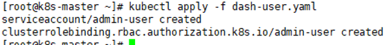
5. 获取 token 令牌：

```bash
#获取访问令牌
kubectl -n kubernetes-dashboard get secret $(kubectl -n kubernetes-dashboard get sa/admin-user -o jsonpath="{.secrets[0].name}") -o go-template="{{.data.token | base64decode}}"
```

```bash
eyJhbGciOiJSUzI1NiIsImtpZCI6IjR5RUhNVExPeXJORmkyaHFWWDNTMFBoZi1zbmVuRm0tY2ZMc1M3S1dPUDAifQ.eyJpc3MiOiJrdWJlcm5ldGVzL3NlcnZpY2VhY2NvdW50Iiwia3ViZXJuZXRlcy5pby9zZXJ2aWNlYWNjb3VudC9uYW1lc3BhY2UiOiJrdWJlcm5ldGVzLWRhc2hib2FyZCIsImt1YmVybmV0ZXMuaW8vc2VydmljZWFjY291bnQvc2VjcmV0Lm5hbWUiOiJhZG1pbi11c2VyLXRva2VuLXE3Z25iIiwia3ViZXJuZXRlcy5pby9zZXJ2aWNlYWNjb3VudC9zZXJ2aWNlLWFjY291bnQubmFtZSI6ImFkbWluLXVzZXIiLCJrdWJlcm5ldGVzLmlvL3NlcnZpY2VhY2NvdW50L3NlcnZpY2UtYWNjb3VudC51aWQiOiJhYTMxYmNkNi03NmM1LTRjNDUtOTM2Mi0xNzEwNjdlM2FjZGMiLCJzdWIiOiJzeXN0ZW06c2VydmljZWFjY291bnQ6a3ViZXJuZXRlcy1kYXNoYm9hcmQ6YWRtaW4tdXNlciJ9.pXvfXxXF_PsjeWLhCJWim2Amqus8zi1LwEWMiUNz4ECp7nTKVJ-bV8vZXvHjcPA3m5k3WKpvbW-5rVnGTjBTik_9-eCkY2QFrQlJHo3PEP2ggpbp-IdCd7fW8uBmM0tNeb0nhI4QIqwTJOaZ3xC9aB6w4gl06227VT-5Eq7b3L18NyudIe_wE7wq4oYjJxMwfC52UpXMdeUw5WVyDPK1CvB1l7jydZV8jpCXprcK-aSC_yyyjbDDPZp31olnSIfcIVmUsgKz0Y2HtNNaMBjeenKya9lgUdLijYnq7cvUDznY-D7oftGqApdZcpN4OzbfBvIel-iRJKKdvbcTQT4jxA[r
```

6. 将生成的令牌代码输入 dashboard：
   - 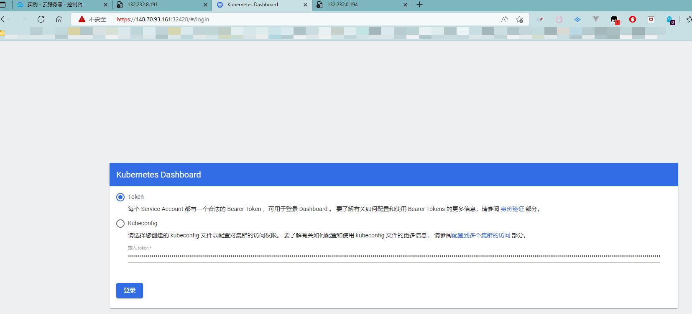
   - 我在 master 节点生成的 token，这个 dashboard 是 node1 节点，不知道是不是这个原因，反正登录不了。

## 4. k8s 资源理解

### 4.1 创建资源方式

- yaml 文件
  - `kubectl apply -f xxxx.yaml`
- 命令行

### 4.2 namespace

名称空间：用来隔离资源，不隔离网络。
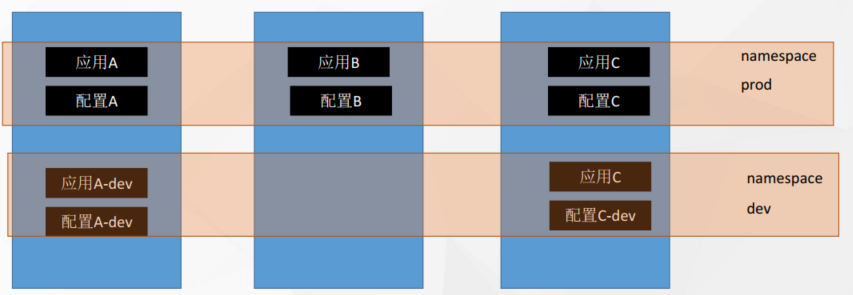
命令行操作：

- `kubectl get ns`或`kubectl get namespace`获取当前所有的名称空间
  - 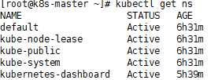
- `kubectl get pods`获取 default 名称空间下的 pods
- `kubectl get pods -A`获取所有名称空间下的 pods
- `kubectl create ns xxx`创建名称空间
- `kubectl delete ns xxx`删除名称空间（会将该名称空间下的资源一同删除）

配置文件操作：

```bash
apiVersion: v1
kind: Namespace
metadata:
  name: xxxx
```

- `kubectl delete -f xxxx.yaml`：删除 xxxx.yaml 文件创建的名称空间及资源。

### 4.3 Pod

运行中的一组容器， Pod 是 kubernetes 中应用的最小单位。
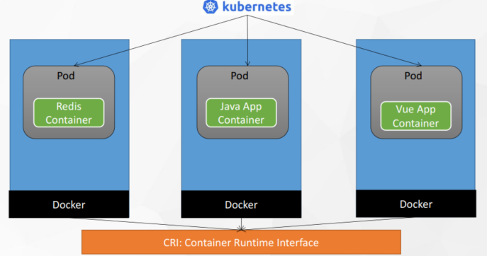
pod 是对 docker 中的多个 container 的封装吗？一个 docker 里有多个 pod 吗？
是的。是的。【2022.08.27】
命令行操作：

- `kubectl run mynginx --image=nginx`：从镜像文件创建并运行 nginx，并命名为 mynginx。不指定名称空间是，默认为 default
- `kubectl describe mynginx`：查看 mynginx 这个 pod 的详细运行信息
- `kubectl delete pod Pod名字`：删除 pod
- `kubectl get pod -owide`：查看 k8s 给每个 pod 分配的 ip，主要是-owide 参数
  - `kubectl get pod -w`：持续监控并在控制台打印变化过程
- `curl 192.168.169.136`集群中的每个 pod，k8s 都会给它分配一个 ip，使用 Pod 的 ip+pod 的端口，就能访问到里面运行容器
- `kubectl exec -it mynginx -- /bin/bash`

配置文件操作：

```bash
apiVersion: v1
kind: Pod
metadata:
  labels:
    run: myapp
  name: myapp
#  namespace: default
spec:
  containers:
  - image: nginx
    name: nginx
  - image: tomcat:8.5.68 # 镜像的名字
    name: tomcat # pod容器的名字
```

- `kubectl delete -f xxxx.yaml`：删除 xxxx.yaml 文件创建的 pod 及资源。

pod 的访问具有以下特点：

- 集群中的任意一个机器以及任意的应用都能通过 Pod 分配的 ip 来访问这个 Pod
- 同一个 pod 容器中的不同应用，可以通过本地连接访问，他们共享本 pod 的内存，存储空间。
- 同一个 pod 内的不同应用，不能安装两个同端口的应用，会报错。
- 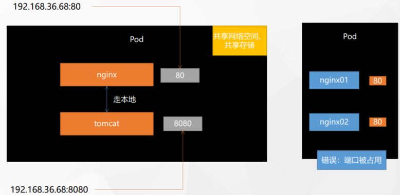

### 4.4 Deployment

表示一次部署，产生一个或多个 pod。具有自愈、故障转移、扩缩容等多种优势。

- `kubectl create deployment mytomcat --image=tomcat:8.5.68`：创建应用
  - 与`kubectl run mynginx --image=nginx`区别在于，部署的应用崩溃、被删除，会自动创建新的应用——即自愈能力。
- `kubectl delete deploy pod名`：删除 deployment 部署的应用
- `kubectl get deploy`或 `kubectl get deployment`：查看 deployment 部署的应用
- `kubectl create deployment my-dep --image=nginx --replicas=3`：多副本部署，3 表示 3 个 pod

```bash
apiVersion: apps/v1
kind: Deployment
metadata:
  labels:
    app: my-dep
  name: my-dep
spec:
  replicas: 3
  selector:
    matchLabels:
      app: my-dep
  template:
    metadata:
      labels:
        app: my-dep
    spec:
      containers:
      - image: nginx
        name: nginx
```

- 扩缩容：
  - `kubectl scale --replicas=5 deployment/my-dep`：部署 5 个名为 my-dp 的 pod（如果原先有 3 个，那就总数变为 5）
    - 当 5 大于既有 pod 数量，称为扩容
    - 当 5 小于既有 pod 数量，称为缩容
  - `kubectl edit deployment my-dep`：扩缩容的另一种操作
    - 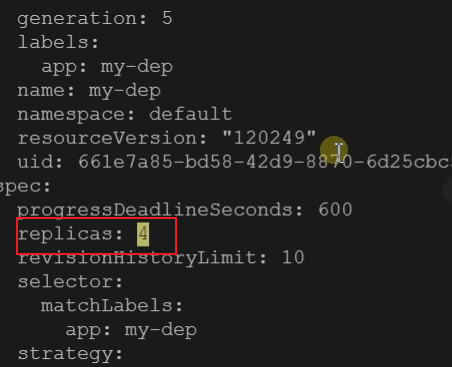
- 自愈：比如应用在 docker 中意外停止，k8s 会自动重启——自愈。但是如果机器停机，k8s 在监控周期内（阈值 5 分钟），k8s 会在其他机器上创建一个新的 pod。
  - 此时停机的机器重启会怎么样？
- 滚动更新（不停机维护、部署新版本后，旧版本暂时不下线，等到新版本生效了正常运行了再去更新）
  - `kubectl set image deployment/my-dep nginx=nginx:1.16.1 --record`
    - `nginx=nginx:1.16.1`是更新的新版本
    - `--record`记录本次更新
- 版本回退：
  - `kubectl rollout history deployment/my-dep`：查看历史记录
  - `kubectl rollout history deployment/my-dep --revision=2`：查看第 2 次的历史记录
  - `kubectl rollout undo deployment/my-dep`：回滚(回到上次)
  - `kubectl rollout undo deployment/my-dep --to-revision=2`：

### 4.5 工作负载

除了`Deployment`，k8s 还有 `StatefulSet` 、`DaemonSet` 、`Job` 等 类型资源。我们都称为 `工作负载`。

有状态应用使用 `StatefulSet` 部署，无状态应用使用 `Deployment` 部署。
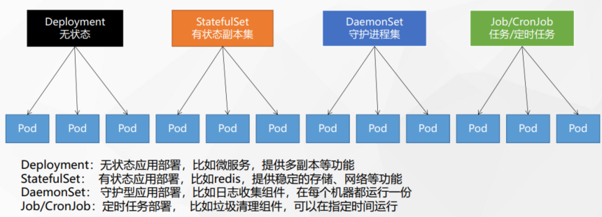

## 5. service

pod 的服务发现与负载均衡。相当于 pod 的网关入口，让原本需要通过 pod 的 IP 访问的资源，通过 service 的 ip 可以得到。
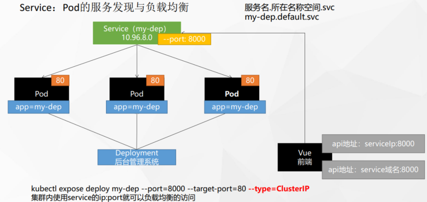

### 5.1 Service

- `kubectl expose deployment my-dep --port=8000 --target-port=80`：将 my-dep 部署的应用暴露端口，即访问 serv 的 ip+8000，相当于访问 my-dep 部署的应用的 ip+80（上图）
- 等价于`kubectl expose deploy my-dep --port=8000 --target-port=80 --type=ClusterIP`
  - 访问返回结果的的负载均衡方式是随机的
    - IP 的方式可以在集群内（3 个虚拟机上）、pod 容器内访问。【不可以在其他机器上访问】
  - service 的域名会自动生成：规则为`my-dep.default.svc`（服务名.所在名称空间.svc）
    - 域名的方式只能在 pod 容器内（进入某一个确定的程序内，如 tomcat）访问，但不能在集群内（3 个虚拟机上）访问，更不能在其他机器上访问
  - deployment 部署的 pod 的有固定的标签，service 通过这个标签可以发现应用，可以通过`kubectl get pod --show -labels`查看

```yaml
apiVersion: v1
kind: Service
metadata:
  labels:
    app: my-dep
  name: my-dep
spec:
  selector:
    app: my-dep
  ports:
    - port: 8000
      protocol: TCP
      targetPort: 80
```

- `kubectl get service`：获取服务的信息，可以查看 my-dep 的 ip
- service 部署的 ip 容器下线后不会再访问到，但是重新上线（本 pod 扩缩容）就又可以访问到

### 5.2 service-nodeport

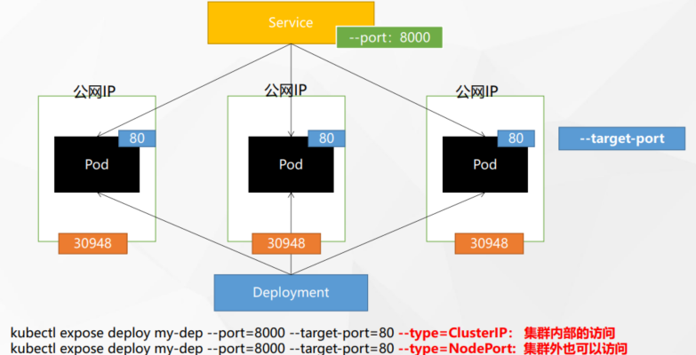

- `kubectl expose deployment my-dep --port=8000 --target-port=80 --type=NodePort`：通过任意节点的 ip+外部端口（如 30948）就可以访问到集群内的所有应用。
- 比较`type=NodePort`和`type=ClusterIP`
  - `type=ClusterIP`暴露的端口只能在集群内访问
  - `type=NodePort`暴露的端口能在任意外部访问

```yaml
apiVersion: v1
kind: Service
metadata:
  labels:
    app: my-dep
  name: my-dep
spec:
  ports:
    - port: 8000
      protocol: TCP
      targetPort: 80
  selector:
    app: my-dep
  type: NodePort
```

> NodePort 范围在 30000-32767 之间

## 6. Ingress

### 6.1 介绍

service 的统一网关入口。service 相当于 pod 的统一网关入口，让原本需要通过 service 的 IP 访问的资源，通过 ingress（集群？）的 ip 可以得到。

ingress 底层是 nginx 做的，k8s 默认不带，需要手动安装。
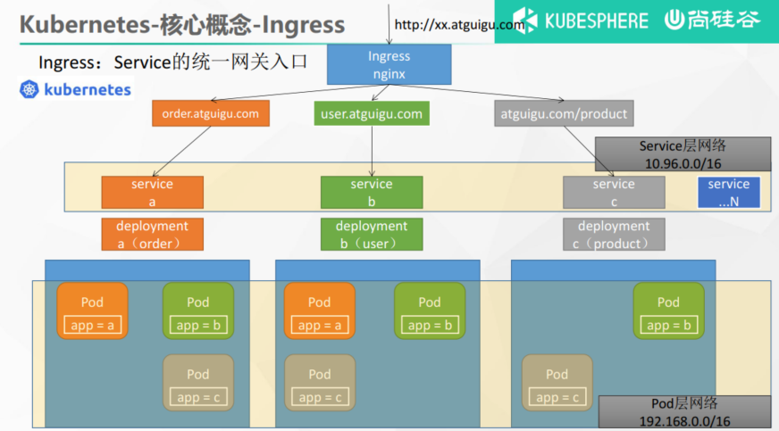

### 6.2 安装

1. 执行步骤

  ```bash
  wget https://raw.githubusercontent.com/kubernetes/ingress-nginx/controller-v0.47.0/deploy/static/provider/baremetal/deploy.yaml

  #修改镜像
  vi deploy.yaml
  #将image的值改为如下值：
  registry.cn-hangzhou.aliyuncs.com/lfy_k8s_ingress-nginx-controller:v0.46.0

  # 检查安装的结果
  kubectl get pod,svc -n ingress-nginx

  # 最后别忘记在服务器上把svc暴露的端口要放行
```

   - 本例中没有执行`wget https://raw.githubusercontent.com/kubernetes/ingress-nginx/controller-v0.47.0/deploy/static/provider/baremetal/deploy.yaml`，直接创建的 yaml 文件，因为怕下载不下来耽搁时间。

   - yaml 文件内容如下（已修改 image 镜像地址为 lfy 的）

<details>
  <summary>不用点开</summary>
  ```
  apiVersion: v1
  kind: Namespace
  metadata:
    name: ingress-nginx
    labels:
      app.kubernetes.io/name: ingress-nginx
      app.kubernetes.io/instance: ingress-nginx

  ---
  # Source: ingress-nginx/templates/controller-serviceaccount.yaml
  apiVersion: v1
  kind: ServiceAccount
  metadata:
    labels:
      helm.sh/chart: ingress-nginx-3.33.0
      app.kubernetes.io/name: ingress-nginx
      app.kubernetes.io/instance: ingress-nginx
      app.kubernetes.io/version: 0.47.0
      app.kubernetes.io/managed-by: Helm
      app.kubernetes.io/component: controller
    name: ingress-nginx
    namespace: ingress-nginx
  automountServiceAccountToken: true
  ---
  # Source: ingress-nginx/templates/controller-configmap.yaml
  apiVersion: v1
  kind: ConfigMap
  metadata:
    labels:
      helm.sh/chart: ingress-nginx-3.33.0
      app.kubernetes.io/name: ingress-nginx
      app.kubernetes.io/instance: ingress-nginx
      app.kubernetes.io/version: 0.47.0
      app.kubernetes.io/managed-by: Helm
      app.kubernetes.io/component: controller
    name: ingress-nginx-controller
    namespace: ingress-nginx
  data:
  ---
  # Source: ingress-nginx/templates/clusterrole.yaml
  apiVersion: rbac.authorization.k8s.io/v1
  kind: ClusterRole
  metadata:
    labels:
      helm.sh/chart: ingress-nginx-3.33.0
      app.kubernetes.io/name: ingress-nginx
      app.kubernetes.io/instance: ingress-nginx
      app.kubernetes.io/version: 0.47.0
      app.kubernetes.io/managed-by: Helm
    name: ingress-nginx
  rules:
    - apiGroups:
        - ""
      resources:
        - configmaps
        - endpoints
        - nodes
        - pods
        - secrets
      verbs:
        - list
        - watch
    - apiGroups:
        - ""
      resources:
        - nodes
      verbs:
        - get
    - apiGroups:
        - ""
      resources:
        - services
      verbs:
        - get
        - list
        - watch
    - apiGroups:
        - extensions
        - networking.k8s.io # k8s 1.14+
      resources:
        - ingresses
      verbs:
        - get
        - list
        - watch
    - apiGroups:
        - ""
      resources:
        - events
      verbs:
        - create
        - patch
    - apiGroups:
        - extensions
        - networking.k8s.io # k8s 1.14+
      resources:
        - ingresses/status
      verbs:
        - update
    - apiGroups:
        - networking.k8s.io # k8s 1.14+
      resources:
        - ingressclasses
      verbs:
        - get
        - list
        - watch
  ---
  # Source: ingress-nginx/templates/clusterrolebinding.yaml
  apiVersion: rbac.authorization.k8s.io/v1
  kind: ClusterRoleBinding
  metadata:
    labels:
      helm.sh/chart: ingress-nginx-3.33.0
      app.kubernetes.io/name: ingress-nginx
      app.kubernetes.io/instance: ingress-nginx
      app.kubernetes.io/version: 0.47.0
      app.kubernetes.io/managed-by: Helm
    name: ingress-nginx
  roleRef:
    apiGroup: rbac.authorization.k8s.io
    kind: ClusterRole
    name: ingress-nginx
  subjects:
    - kind: ServiceAccount
      name: ingress-nginx
      namespace: ingress-nginx
  ---
  # Source: ingress-nginx/templates/controller-role.yaml
  apiVersion: rbac.authorization.k8s.io/v1
  kind: Role
  metadata:
    labels:
      helm.sh/chart: ingress-nginx-3.33.0
      app.kubernetes.io/name: ingress-nginx
      app.kubernetes.io/instance: ingress-nginx
      app.kubernetes.io/version: 0.47.0
      app.kubernetes.io/managed-by: Helm
      app.kubernetes.io/component: controller
    name: ingress-nginx
    namespace: ingress-nginx
  rules:
    - apiGroups:
        - ""
      resources:
        - namespaces
      verbs:
        - get
    - apiGroups:
        - ""
      resources:
        - configmaps
        - pods
        - secrets
        - endpoints
      verbs:
        - get
        - list
        - watch
    - apiGroups:
        - ""
      resources:
        - services
      verbs:
        - get
        - list
        - watch
    - apiGroups:
        - extensions
        - networking.k8s.io # k8s 1.14+
      resources:
        - ingresses
      verbs:
        - get
        - list
        - watch
    - apiGroups:
        - extensions
        - networking.k8s.io # k8s 1.14+
      resources:
        - ingresses/status
      verbs:
        - update
    - apiGroups:
        - networking.k8s.io # k8s 1.14+
      resources:
        - ingressclasses
      verbs:
        - get
        - list
        - watch
    - apiGroups:
        - ""
      resources:
        - configmaps
      resourceNames:
        - ingress-controller-leader-nginx
      verbs:
        - get
        - update
    - apiGroups:
        - ""
      resources:
        - configmaps
      verbs:
        - create
    - apiGroups:
        - ""
      resources:
        - events
      verbs:
        - create
        - patch
  ---
  # Source: ingress-nginx/templates/controller-rolebinding.yaml
  apiVersion: rbac.authorization.k8s.io/v1
  kind: RoleBinding
  metadata:
    labels:
      helm.sh/chart: ingress-nginx-3.33.0
      app.kubernetes.io/name: ingress-nginx
      app.kubernetes.io/instance: ingress-nginx
      app.kubernetes.io/version: 0.47.0
      app.kubernetes.io/managed-by: Helm
      app.kubernetes.io/component: controller
    name: ingress-nginx
    namespace: ingress-nginx
  roleRef:
    apiGroup: rbac.authorization.k8s.io
    kind: Role
    name: ingress-nginx
  subjects:
    - kind: ServiceAccount
      name: ingress-nginx
      namespace: ingress-nginx
  ---
  # Source: ingress-nginx/templates/controller-service-webhook.yaml
  apiVersion: v1
  kind: Service
  metadata:
    labels:
      helm.sh/chart: ingress-nginx-3.33.0
      app.kubernetes.io/name: ingress-nginx
      app.kubernetes.io/instance: ingress-nginx
      app.kubernetes.io/version: 0.47.0
      app.kubernetes.io/managed-by: Helm
      app.kubernetes.io/component: controller
    name: ingress-nginx-controller-admission
    namespace: ingress-nginx
  spec:
    type: ClusterIP
    ports:
      - name: https-webhook
        port: 443
        targetPort: webhook
    selector:
      app.kubernetes.io/name: ingress-nginx
      app.kubernetes.io/instance: ingress-nginx
      app.kubernetes.io/component: controller
  ---
  # Source: ingress-nginx/templates/controller-service.yaml
  apiVersion: v1
  kind: Service
  metadata:
    annotations:
    labels:
      helm.sh/chart: ingress-nginx-3.33.0
      app.kubernetes.io/name: ingress-nginx
      app.kubernetes.io/instance: ingress-nginx
      app.kubernetes.io/version: 0.47.0
      app.kubernetes.io/managed-by: Helm
      app.kubernetes.io/component: controller
    name: ingress-nginx-controller
    namespace: ingress-nginx
  spec:
    type: NodePort
    ports:
      - name: http
        port: 80
        protocol: TCP
        targetPort: http
      - name: https
        port: 443
        protocol: TCP
        targetPort: https
    selector:
      app.kubernetes.io/name: ingress-nginx
      app.kubernetes.io/instance: ingress-nginx
      app.kubernetes.io/component: controller
  ---
  # Source: ingress-nginx/templates/controller-deployment.yaml
  apiVersion: apps/v1
  kind: Deployment
  metadata:
    labels:
      helm.sh/chart: ingress-nginx-3.33.0
      app.kubernetes.io/name: ingress-nginx
      app.kubernetes.io/instance: ingress-nginx
      app.kubernetes.io/version: 0.47.0
      app.kubernetes.io/managed-by: Helm
      app.kubernetes.io/component: controller
    name: ingress-nginx-controller
    namespace: ingress-nginx
  spec:
    selector:
      matchLabels:
        app.kubernetes.io/name: ingress-nginx
        app.kubernetes.io/instance: ingress-nginx
        app.kubernetes.io/component: controller
    revisionHistoryLimit: 10
    minReadySeconds: 0
    template:
      metadata:
        labels:
          app.kubernetes.io/name: ingress-nginx
          app.kubernetes.io/instance: ingress-nginx
          app.kubernetes.io/component: controller
      spec:
        dnsPolicy: ClusterFirst
        containers:
          - name: controller
            image: registry.cn-hangzhou.aliyuncs.com/lfy_k8s_ingress-nginx-controller:v0.46.0
            imagePullPolicy: IfNotPresent
            lifecycle:
              preStop:
                exec:
                  command:
                    - /wait-shutdown
            args:
              - /nginx-ingress-controller
              - --election-id=ingress-controller-leader
              - --ingress-class=nginx
              - --configmap=$(POD_NAMESPACE)/ingress-nginx-controller
              - --validating-webhook=:8443
              - --validating-webhook-certificate=/usr/local/certificates/cert
              - --validating-webhook-key=/usr/local/certificates/key
            securityContext:
              capabilities:
                drop:
                  - ALL
                add:
                  - NET_BIND_SERVICE
              runAsUser: 101
              allowPrivilegeEscalation: true
            env:
              - name: POD_NAME
                valueFrom:
                  fieldRef:
                    fieldPath: metadata.name
              - name: POD_NAMESPACE
                valueFrom:
                  fieldRef:
                    fieldPath: metadata.namespace
              - name: LD_PRELOAD
                value: /usr/local/lib/libmimalloc.so
            livenessProbe:
              failureThreshold: 5
              httpGet:
                path: /healthz
                port: 10254
                scheme: HTTP
              initialDelaySeconds: 10
              periodSeconds: 10
              successThreshold: 1
              timeoutSeconds: 1
            readinessProbe:
              failureThreshold: 3
              httpGet:
                path: /healthz
                port: 10254
                scheme: HTTP
              initialDelaySeconds: 10
              periodSeconds: 10
              successThreshold: 1
              timeoutSeconds: 1
            ports:
              - name: http
                containerPort: 80
                protocol: TCP
              - name: https
                containerPort: 443
                protocol: TCP
              - name: webhook
                containerPort: 8443
                protocol: TCP
            volumeMounts:
              - name: webhook-cert
                mountPath: /usr/local/certificates/
                readOnly: true
            resources:
              requests:
                cpu: 100m
                memory: 90Mi
        nodeSelector:
          kubernetes.io/os: linux
        serviceAccountName: ingress-nginx
        terminationGracePeriodSeconds: 300
        volumes:
          - name: webhook-cert
            secret:
              secretName: ingress-nginx-admission
  ---
  # Source: ingress-nginx/templates/admission-webhooks/validating-webhook.yaml
  # before changing this value, check the required kubernetes version
  # https://kubernetes.io/docs/reference/access-authn-authz/extensible-admission-controllers/#prerequisites
  apiVersion: admissionregistration.k8s.io/v1
  kind: ValidatingWebhookConfiguration
  metadata:
    labels:
      helm.sh/chart: ingress-nginx-3.33.0
      app.kubernetes.io/name: ingress-nginx
      app.kubernetes.io/instance: ingress-nginx
      app.kubernetes.io/version: 0.47.0
      app.kubernetes.io/managed-by: Helm
      app.kubernetes.io/component: admission-webhook
    name: ingress-nginx-admission
  webhooks:
    - name: validate.nginx.ingress.kubernetes.io
      matchPolicy: Equivalent
      rules:
        - apiGroups:
            - networking.k8s.io
          apiVersions:
            - v1beta1
          operations:
            - CREATE
            - UPDATE
          resources:
            - ingresses
      failurePolicy: Fail
      sideEffects: None
      admissionReviewVersions:
        - v1
        - v1beta1
      clientConfig:
        service:
          namespace: ingress-nginx
          name: ingress-nginx-controller-admission
          path: /networking/v1beta1/ingresses
  ---
  # Source: ingress-nginx/templates/admission-webhooks/job-patch/serviceaccount.yaml
  apiVersion: v1
  kind: ServiceAccount
  metadata:
    name: ingress-nginx-admission
    annotations:
      helm.sh/hook: pre-install,pre-upgrade,post-install,post-upgrade
      helm.sh/hook-delete-policy: before-hook-creation,hook-succeeded
    labels:
      helm.sh/chart: ingress-nginx-3.33.0
      app.kubernetes.io/name: ingress-nginx
      app.kubernetes.io/instance: ingress-nginx
      app.kubernetes.io/version: 0.47.0
      app.kubernetes.io/managed-by: Helm
      app.kubernetes.io/component: admission-webhook
    namespace: ingress-nginx
  ---
  # Source: ingress-nginx/templates/admission-webhooks/job-patch/clusterrole.yaml
  apiVersion: rbac.authorization.k8s.io/v1
  kind: ClusterRole
  metadata:
    name: ingress-nginx-admission
    annotations:
      helm.sh/hook: pre-install,pre-upgrade,post-install,post-upgrade
      helm.sh/hook-delete-policy: before-hook-creation,hook-succeeded
    labels:
      helm.sh/chart: ingress-nginx-3.33.0
      app.kubernetes.io/name: ingress-nginx
      app.kubernetes.io/instance: ingress-nginx
      app.kubernetes.io/version: 0.47.0
      app.kubernetes.io/managed-by: Helm
      app.kubernetes.io/component: admission-webhook
  rules:
    - apiGroups:
        - admissionregistration.k8s.io
      resources:
        - validatingwebhookconfigurations
      verbs:
        - get
        - update
  ---
  # Source: ingress-nginx/templates/admission-webhooks/job-patch/clusterrolebinding.yaml
  apiVersion: rbac.authorization.k8s.io/v1
  kind: ClusterRoleBinding
  metadata:
    name: ingress-nginx-admission
    annotations:
      helm.sh/hook: pre-install,pre-upgrade,post-install,post-upgrade
      helm.sh/hook-delete-policy: before-hook-creation,hook-succeeded
    labels:
      helm.sh/chart: ingress-nginx-3.33.0
      app.kubernetes.io/name: ingress-nginx
      app.kubernetes.io/instance: ingress-nginx
      app.kubernetes.io/version: 0.47.0
      app.kubernetes.io/managed-by: Helm
      app.kubernetes.io/component: admission-webhook
  roleRef:
    apiGroup: rbac.authorization.k8s.io
    kind: ClusterRole
    name: ingress-nginx-admission
  subjects:
    - kind: ServiceAccount
      name: ingress-nginx-admission
      namespace: ingress-nginx
  ---
  # Source: ingress-nginx/templates/admission-webhooks/job-patch/role.yaml
  apiVersion: rbac.authorization.k8s.io/v1
  kind: Role
  metadata:
    name: ingress-nginx-admission
    annotations:
      helm.sh/hook: pre-install,pre-upgrade,post-install,post-upgrade
      helm.sh/hook-delete-policy: before-hook-creation,hook-succeeded
    labels:
      helm.sh/chart: ingress-nginx-3.33.0
      app.kubernetes.io/name: ingress-nginx
      app.kubernetes.io/instance: ingress-nginx
      app.kubernetes.io/version: 0.47.0
      app.kubernetes.io/managed-by: Helm
      app.kubernetes.io/component: admission-webhook
    namespace: ingress-nginx
  rules:
    - apiGroups:
        - ""
      resources:
        - secrets
      verbs:
        - get
        - create
  ---
  # Source: ingress-nginx/templates/admission-webhooks/job-patch/rolebinding.yaml
  apiVersion: rbac.authorization.k8s.io/v1
  kind: RoleBinding
  metadata:
    name: ingress-nginx-admission
    annotations:
      helm.sh/hook: pre-install,pre-upgrade,post-install,post-upgrade
      helm.sh/hook-delete-policy: before-hook-creation,hook-succeeded
    labels:
      helm.sh/chart: ingress-nginx-3.33.0
      app.kubernetes.io/name: ingress-nginx
      app.kubernetes.io/instance: ingress-nginx
      app.kubernetes.io/version: 0.47.0
      app.kubernetes.io/managed-by: Helm
      app.kubernetes.io/component: admission-webhook
    namespace: ingress-nginx
  roleRef:
    apiGroup: rbac.authorization.k8s.io
    kind: Role
    name: ingress-nginx-admission
  subjects:
    - kind: ServiceAccount
      name: ingress-nginx-admission
      namespace: ingress-nginx
  ---
  # Source: ingress-nginx/templates/admission-webhooks/job-patch/job-createSecret.yaml
  apiVersion: batch/v1
  kind: Job
  metadata:
    name: ingress-nginx-admission-create
    annotations:
      helm.sh/hook: pre-install,pre-upgrade
      helm.sh/hook-delete-policy: before-hook-creation,hook-succeeded
    labels:
      helm.sh/chart: ingress-nginx-3.33.0
      app.kubernetes.io/name: ingress-nginx
      app.kubernetes.io/instance: ingress-nginx
      app.kubernetes.io/version: 0.47.0
      app.kubernetes.io/managed-by: Helm
      app.kubernetes.io/component: admission-webhook
    namespace: ingress-nginx
  spec:
    template:
      metadata:
        name: ingress-nginx-admission-create
        labels:
          helm.sh/chart: ingress-nginx-3.33.0
          app.kubernetes.io/name: ingress-nginx
          app.kubernetes.io/instance: ingress-nginx
          app.kubernetes.io/version: 0.47.0
          app.kubernetes.io/managed-by: Helm
          app.kubernetes.io/component: admission-webhook
      spec:
        containers:
          - name: create
            image: docker.io/jettech/kube-webhook-certgen:v1.5.1
            imagePullPolicy: IfNotPresent
            args:
              - create
              - --host=ingress-nginx-controller-admission,ingress-nginx-controller-admission.$(POD_NAMESPACE).svc
              - --namespace=$(POD_NAMESPACE)
              - --secret-name=ingress-nginx-admission
            env:
              - name: POD_NAMESPACE
                valueFrom:
                  fieldRef:
                    fieldPath: metadata.namespace
        restartPolicy: OnFailure
        serviceAccountName: ingress-nginx-admission
        securityContext:
          runAsNonRoot: true
          runAsUser: 2000
  ---
  # Source: ingress-nginx/templates/admission-webhooks/job-patch/job-patchWebhook.yaml
  apiVersion: batch/v1
  kind: Job
  metadata:
    name: ingress-nginx-admission-patch
    annotations:
      helm.sh/hook: post-install,post-upgrade
      helm.sh/hook-delete-policy: before-hook-creation,hook-succeeded
    labels:
      helm.sh/chart: ingress-nginx-3.33.0
      app.kubernetes.io/name: ingress-nginx
      app.kubernetes.io/instance: ingress-nginx
      app.kubernetes.io/version: 0.47.0
      app.kubernetes.io/managed-by: Helm
      app.kubernetes.io/component: admission-webhook
    namespace: ingress-nginx
  spec:
    template:
      metadata:
        name: ingress-nginx-admission-patch
        labels:
          helm.sh/chart: ingress-nginx-3.33.0
          app.kubernetes.io/name: ingress-nginx
          app.kubernetes.io/instance: ingress-nginx
          app.kubernetes.io/version: 0.47.0
          app.kubernetes.io/managed-by: Helm
          app.kubernetes.io/component: admission-webhook
      spec:
        containers:
          - name: patch
            image: docker.io/jettech/kube-webhook-certgen:v1.5.1
            imagePullPolicy: IfNotPresent
            args:
              - patch
              - --webhook-name=ingress-nginx-admission
              - --namespace=$(POD_NAMESPACE)
              - --patch-mutating=false
              - --secret-name=ingress-nginx-admission
              - --patch-failure-policy=Fail
            env:
              - name: POD_NAMESPACE
                valueFrom:
                  fieldRef:
                    fieldPath: metadata.namespace
        restartPolicy: OnFailure
        serviceAccountName: ingress-nginx-admission
        securityContext:
          runAsNonRoot: true
          runAsUser: 2000
  ```
</details>

  
  ingress 安装完后，产生了两个 service，type 类型一个是 cluster IP（集群内访问），一个是 nodeport（其他机器访问呢）。通过集群的 ip+暴露的端口，能够实现外部请求的统一处理。

  - http：虚拟机 ip+31405--->请求发给 http：clusterip+80
  - https：虚拟机 ip+32401--->请求发给 https：clusterip+443

  ### 6.3 使用

  示例：

  1. 部署 pod 和 service：

  ```yaml
  apiVersion: apps/v1
  kind: Deployment
  metadata:
    name: hello-server
  spec:
    replicas: 2
    selector:
      matchLabels:
        app: hello-server
    template:
      metadata:
        labels:
          app: hello-server
      spec:
        containers:
          - name: hello-server
            image: registry.cn-hangzhou.aliyuncs.com/lfy_k8s_hello-server
            ports:
              - containerPort: 9000
  ---
  apiVersion: apps/v1
  kind: Deployment
  metadata:
    labels:
      app: nginx-demo
    name: nginx-demo
  spec:
    replicas: 2
    selector:
      matchLabels:
        app: nginx-demo
    template:
      metadata:
        labels:
          app: nginx-demo
      spec:
        containers:
          - image: nginx
            name: nginx
  ---
  apiVersion: v1
  kind: Service
  metadata:
    labels:
      app: nginx-demo
    name: nginx-demo
  spec:
    selector:
      app: nginx-demo
    ports:
      - port: 8000
        protocol: TCP
        targetPort: 80
  ---
  apiVersion: v1
  kind: Service
  metadata:
    labels:
      app: hello-server
    name: hello-server
  spec:
    selector:
      app: hello-server
    ports:
      - port: 8000
        protocol: TCP
        targetPort: 9000
  ```

2. 结构
   - pod 结构图示：
     - 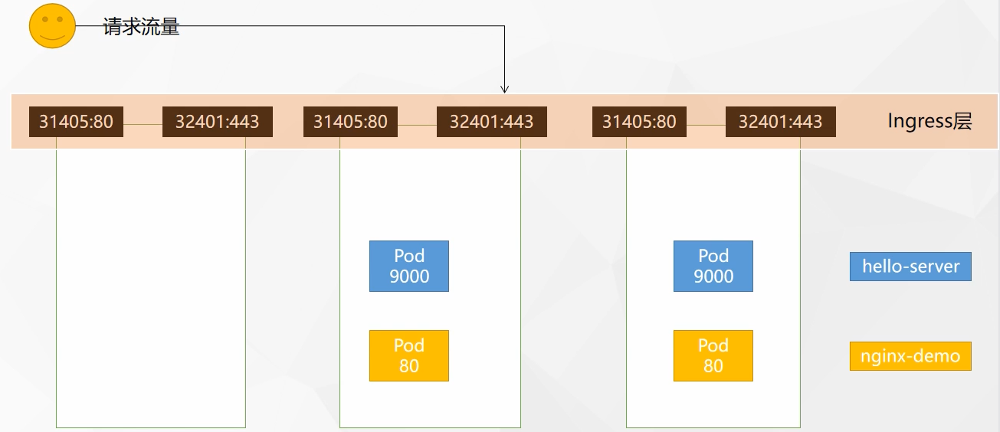
   - service 结构图示：
     - 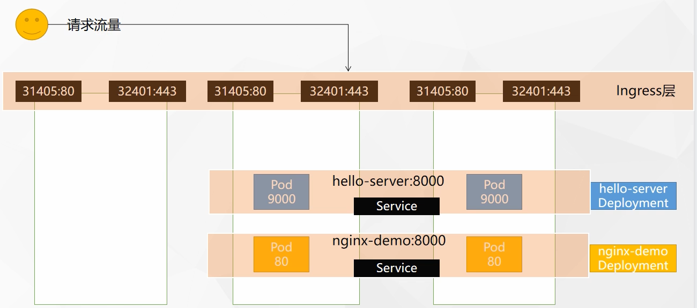
   - 可以从上面的 yaml 文件看到，service 的 type 是默认的是，所以外部不能通过集群的 ip 访问到。
3. 需求：
   - hello.atguigu.com:31405 把请求转给 hello-server 进行处理
   - demo.atguigu.com:31405 把请求转给 nginx-demo 进行处理
4. 配置 ingress 规则：
  ```yaml
  apiVersion: networking.k8s.io/v1
  kind: Ingress
  metadata:
    name: ingress-host-bar
  spec:
    ingressClassName: nginx
    rules:
      - host: "hello.atguigu.com"
        http:
          paths:
            - pathType: Prefix
              path: "/"
              backend:
                service:
                  name: hello-server
                  port:
                    number: 8000
      - host: "demo.atguigu.com"
        http:
          paths:
            - pathType: Prefix
              path: "/nginx" # 把请求会转给下面的服务，service的地址也要带/nginx，否则就是404
              backend:
                service:
                  name: nginx-demo
                  port:
                    number: 8000
  ```

### 6.4 路径重写

开启路径重写功能：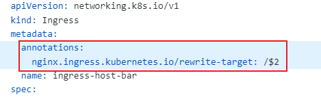

```yaml
apiVersion: networking.k8s.io/v1
kind: Ingress
metadata:
  annotations:
    nginx.ingress.kubernetes.io/rewrite-target: /$2
  name: ingress-host-bar
spec:
  ingressClassName: nginx
  rules:
    - host: "hello.atguigu.com"
      http:
        paths:
          - pathType: Prefix
            path: "/"
            backend:
              service:
                name: hello-server
                port:
                  number: 8000
    - host: "demo.atguigu.com"
      http:
        paths:
          - pathType: Prefix
            path: "/nginx(/|$)(.*)" # 把请求会转给下面的服务，下面的服务一定要能处理这个路径，不能处理就是404
            backend:
              service:
                name: nginx-demo
                port:
                  number: 8000
```

此时 ingress 层的/nginx 请求转发给 service 层时，会去掉 nginx

### 6.5 流量限制

```yaml
apiVersion: networking.k8s.io/v1
kind: Ingress
metadata:
  name: ingress-limit-rate
  annotations:
    nginx.ingress.kubernetes.io/limit-rps: "1"
spec:
  ingressClassName: nginx
  rules:
    - host: "haha.atguigu.com"
      http:
        paths:
          - pathType: Exact
            path: "/"
            backend:
              service:
                name: nginx-demo
                port:
                  number: 8000
```

## 7. k8s 网络模型

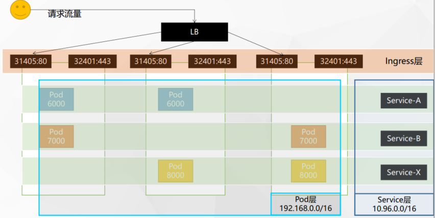

## 8. 存储抽象

### 8.1 介绍

由于 k8s 的自愈功能，如果某 pod 数据存储在一台机器上，自愈后 pod 启动在其他机器上，会导致原先的数据丢失。

k8s 为了解决这一问题，提出了存储层的概念，它将所有机器存储的内容统一放到一起，并在所有机器间进行共享，实现了数据的稳定。

k8s 实现存储层的技术有 Glusterfs、NFS、CephFS，本学习中，使用了 NFS。

### 8.2 NFS 的使用

1. 所有节点安装 nft：`yum install -y nfs-utils`
2. 主节点暴露目录，并给各个从节点同步数据：

```bash
#nfs主节点
echo "/nfs/data/ *(insecure,rw,sync,no_root_squash)" > /etc/exports

mkdir -p /nfs/data
systemctl enable rpcbind --now #
systemctl enable nfs-server --now # 设置开机启动
#配置生效
exportfs -r
```

3. 从节点同步主节点的数据

```bash
showmount -e 172.31.0.4 # 在从节点看主节点有哪些目录可以挂载

mkdir -p /nfs/data #执行以下命令挂载 创建本地的 /nfs/data

mount -t nfs 172.31.0.4:/nfs/data /nfs/data # 执行数据同步
# 写入一个测试文件
echo "hello nfs server" > /nfs/data/test.txt
```

### 8.3 设置 pod 的数据挂载

```yaml
apiVersion: apps/v1
kind: Deployment
metadata:
  labels:
    app: nginx-pv-demo
  name: nginx-pv-demo
spec:
  replicas: 2
  selector:
    matchLabels:
      app: nginx-pv-demo
  template:
    metadata:
      labels:
        app: nginx-pv-demo
    spec:
      containers:
        - image: nginx
          name: nginx
          volumeMounts:
            - name: html
              mountPath: /usr/share/nginx/html
      volumes:
        - name: html
          nfs:
            server: 172.31.0.4
            path: /nfs/data/nginx-pv
```

将 nginx 的/usr/share/nginx/html 挂载到了 nfs 存储层的/nfs/data/nginx-pv

### 8.4 PV&PVC 挂载

上述存储挂载存在两个问题，一是 pod 删除后，所挂载的数据不会在数据层删除，二是挂载的数据没有进行限制，如果还有其他挂载，存在数据不受控的情况。

PV：持久卷（Persistent Volume），将应用需要持久化的数据保存到指定位置。

PVC：持久卷申明（Persistent Volume Claim），申明需要使用的持久卷规格。

思想：先创建 pv 池（各种存储目录），当 pod 需要存储空间时，提交 pvc（申请书，写明需要多大空间），然后 k8s 从 pv 池分配该大小的空间。当 pod 不使用空间了，k8s 对不适用的数据进行回收。

### 8.5 示例

1. 创建 pv 池：主节点执行：
   - 首先创建 pv 池指向的目录（静态供应方式，也有动态供应方式，动态供应不需要提前创建好）
     - `mkdir -p /nfs/data/01`
     - `mkdir -p /nfs/data/02`
     - `mkdir -p /nfs/data/03`
   - 创建 pv，交给 k8s 管理

```yaml
apiVersion: v1
kind: PersistentVolume
metadata:
  name: pv01-10m
spec:
  capacity:
    storage: 10M
  accessModes:
    - ReadWriteMany
  storageClassName: nfs
  nfs:
    path: /nfs/data/01
    server: 172.31.0.4
---
apiVersion: v1
kind: PersistentVolume
metadata:
  name: pv02-1gi
spec:
  capacity:
    storage: 1Gi
  accessModes:
    - ReadWriteMany
  storageClassName: nfs
  nfs:
    path: /nfs/data/02
    server: 172.31.0.4
---
apiVersion: v1
kind: PersistentVolume
metadata:
  name: pv03-3gi
spec:
  capacity:
    storage: 3Gi
  accessModes:
    - ReadWriteMany
  storageClassName: nfs
  nfs:
    path: /nfs/data/03
    server: 172.31.0.4
```

2. 创建 pvc 使用空间——没有指明谁使用，只是告诉 pv 使用了（以需要 200m 的空间演示）

```yaml
kind: PersistentVolumeClaim
apiVersion: v1
metadata:
  name: nginx-pvc
spec:
  accessModes:
    - ReadWriteMany
  resources:
    requests:
      storage: 200Mi
  storageClassName: nfs
```

3. 创建 pod 绑定 pvc

```yaml
apiVersion: apps/v1
kind: Deployment
metadata:
  labels:
    app: nginx-deploy-pvc
  name: nginx-deploy-pvc
spec:
  replicas: 2
  selector:
    matchLabels:
      app: nginx-deploy-pvc
  template:
    metadata:
      labels:
        app: nginx-deploy-pvc
    spec:
      containers:
        - image: nginx
          name: nginx
          volumeMounts:
            - name: html
              mountPath: /usr/share/nginx/html
      volumes:
        - name: html
          persistentVolumeClaim:
            claimName: nginx-pvc
```

## 9. ConfigMap

抽取配置文件，同时可以自动更新。以 redis 示例

1. 创建配置集：`kubectl create cm redis-conf --from-file=redis.conf`
   - 前面的 redis-conf 是 k8s 识别的，后面的是本地新建的 redis.conf，注意，这是路径写法。
   - 创建前需要在本地先创建出 redis.conf，创建完就可以删了
   - 生成的 redis.conf 部分内容如下：

```yaml
apiVersion: v1
data: #data是所有真正的数据
  redis.conf: # key：默认是文件名
    appendonly yes # value：配置文件的内容
kind: ConfigMap
metadata:
  name: redis-conf
  namespace: default
```

2. 创建 pod 时使用配置集：

```yaml
apiVersion: v1
kind: Pod
metadata:
  name: redis
spec:
  containers:
    - name: redis
      image: redis
      command:
        - redis-server
        - "/redis-master/redis.conf" #指的是redis容器内部的位置
      ports:
        - containerPort: 6379
      volumeMounts:
        - mountPath: /data
          name: data
        - mountPath: /redis-master
          name: config
  volumes:
    - name: data
      emptyDir: {}
    - name: config
      configMap:
        name: redis-conf
        items:
          - key: redis.conf
            path: redis.conf
```

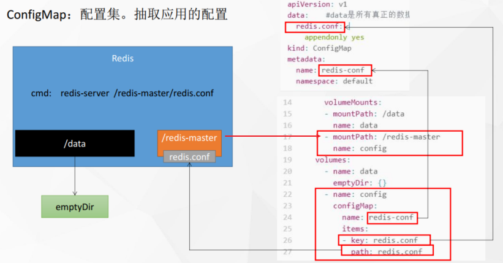

## 10. secret

Secret 对象类型用来保存敏感信息，例如密码、OAuth 令牌和 SSH 密钥。 将这些信息放在 secret 中比放在 Pod 的定义或者 容器镜像 中来说更加安全和灵活。

```bash
kubectl create secret docker-registry leifengyang-docker \
--docker-username=leifengyang \
--docker-password=Lfy123456 \
--docker-email=534096094@qq.com

##命令格式
kubectl create secret docker-registry regcred \
  --docker-server=<你的镜像仓库服务器> \
  --docker-username=<你的用户名> \
  --docker-password=<你的密码> \
  --docker-email=<你的邮箱地址>
```
